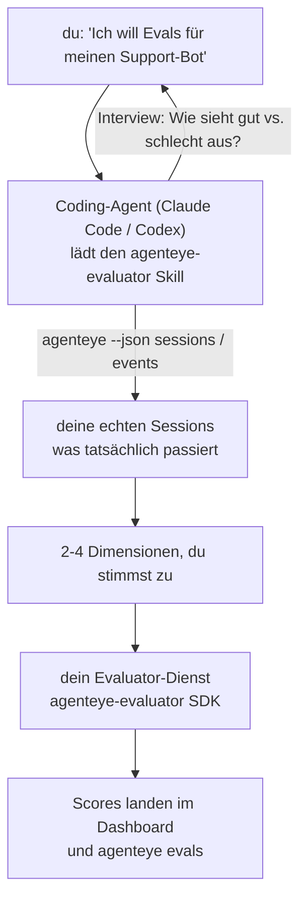

Von *„Ich glaube, unser Agent ist manchmal schlecht"* zu einem bereitgestellten Scoring-Dienst – wobei dein Coding-Agent sowohl die Entscheidungen trifft als auch den Dienst aufbaut. Der **Failproof AI Observability Evaluator Skill** (`agenteye-evaluator`) ist ein *Agent Skill*: ein kleiner Ordner mit Anweisungen, den ein Coding-Agent wie Claude Code oder Codex bei Bedarf lädt. Er bringt dem Agenten bei, herauszufinden, welche Qualitätsdimensionen es für *deinen* Agenten wert sind, verfolgt zu werden, und dann den [Evaluator-Dienst](/de/agenteye/evaluation-suite) zu schreiben, zu testen und bereitzustellen, der diese bewertet.

Er ist **kein** gehosteter Scorer, keine Registry zum Hochladen und kein Plugin-System. Dein Evaluator bleibt dein eigener HTTP-Dienst auf deiner eigenen Infrastruktur, genau wie im Leitfaden zur [Evaluation Suite](/de/agenteye/evaluation-suite) beschrieben. Der Skill bringt deinem Agenten lediglich bei, ihn gut zu bauen – alles, was er tut, könntest du also selbst tun, indem du denselben Code schreibst.

---

## Die schwierige Aufgabe ist zu entscheiden, was bewertet werden soll

Die SDK-Oberfläche ist klein – ein Decorator und zwei Modelle – und ein Agent kann das allein aus dem [Contract](/de/agenteye/evaluation-suite#http-contract) ableiten. Daran scheitern Evaluatoren nicht. Sie scheitern, weil sie das Falsche bewerten, und ein Evaluator, der das Falsche bewertet, ist schlimmer als keiner: Er produziert ein Dashboard, das alle lernen zu ignorieren.

Daher umfasst der größte Teil des Skills die Phase, bevor überhaupt Code existiert. Er lässt den Agenten dich interviewen (*„Beschreibe einen Lauf, der gut verlief; jetzt einen, der schlecht verlief"*), zieht dann deine echten Sessions über die [`agenteye`-CLI](/de/agenteye/cli) und liest sie von Anfang bis Ende. Diese beiden Hälften stimmen meist nicht überein, und genau diese Lücke ist der Kern: was du zu messen beabsichtigst im Vergleich zu dem, was deine Transkripte tatsächlich unterstützen können. Eine Dimension überlebt nur, wenn sie **berechenbar** aus den Events ist und **unterscheidend** – wenn sie auf deinem guten Lauf und deinem schlechten Lauf beide 0,9 erzielt, lehrt sie nichts und wird gestrichen.

Das Ergebnis ist ein Vorschlag mit 2–4 Dimensionen samt Begründung, dem du zustimmen musst, bevor eine einzige Zeile geschrieben wird.



---

## Wie es sich zu den anderen Evaluierungsteilen verhält

Vier Dokumente behandeln das Scoring und leiten in dieser Reihenfolge aneinander weiter:

| Seite | Was es ist | Greife darauf zurück, wenn |
|---|---|---|
| **[Evaluations](/de/agenteye/evaluations)** | Das Feature: Scores im Sessions-Grid, Dashboards, Neu-Evaluierung | Du wissen möchtest, was automatisches Scoring dir bringt |
| **[Evaluation suite](/de/agenteye/evaluation-suite)** | Der HTTP-Contract, das SDK, die Server-Umgebungsvariablen | Du den Evaluator selbst implementierst oder debuggst |
| **Evaluator Skill** (dieses Dokument) | Eine natürlichsprachliche Eingabe für das Entwerfen *und* Bauen des Scorers | Du von „Ich will Evals" zu einem laufenden Dienst gelangen möchtest |
| **[CLI Skill](/de/agenteye/cli-skill)** | Eine natürlichsprachliche Eingabe für die `agenteye`-CLI | Du die bereits vorhandenen Scores *lesen* möchtest |
| **[Python SDK Skill](/de/agenteye/python-sdk-skill)** | Eine natürlichsprachliche Eingabe für die Instrumentierung deines Agenten | Dein Agent noch keine Sessions ausgibt – es gibt noch nichts zu bewerten |

### vs. dem CLI Skill: Bauen versus Lesen

Die beiden Skills überschneiden sich bewusst nicht, und beide zu installieren ist die normale Konfiguration – der Agent wählt zwischen ihnen basierend auf deiner Anfrage:

- **`agenteye-evaluator`** (dieses Dokument) baut das Ding, das Scores *produziert*. Seine Aufgabe endet, wenn Scores zum ersten Mal eintreffen.
- **[`agenteye-cli`](/de/agenteye/cli-skill)** liest Scores, die bereits existieren (`agenteye evals`). *„Hat die Qualität diese Woche nachgelassen?"* ist seine Frage, nicht die dieses Skills.

---

## Voraussetzungen

1. Die **`agenteye`-CLI installiert und eingeloggt** (`pipx install agenteye`, dann `agenteye login`). Der Skill nutzt sie zweimal: um die echten Sessions zu laden, gegen die er entwirft, und um am Ende zu bestätigen, dass deine Scores angekommen sind. Dein Login benötigt `events:read` sowie `evaluations:read` für diese abschließende Prüfung. Wie beim CLI Skill kann er den per E-Mail gesendeten Einmalcode-Login **nicht** für dich abschließen.
2. **Irgendwo, wo der Evaluator leben kann.** Er wird in ein Image gebaut und als dauerhaft laufender Dienst betrieben, also braucht er ein echtes Repo, keine Scratch-Datei. Evaluatoren leben oft in einem eigenen Repo, getrennt vom bewerteten Agenten – der Skill sucht nach einem vorhandenen und fragt, bevor er ein neues anlegt.
3. **Das `agenteye-evaluator` SDK Wheel** – lies den nächsten Abschnitt, bevor dein Agent `pip`-Befehle einzutippen beginnt.

---

## Wo du es bekommst

Der Skill ist in Failproof AIs öffentlicher Skills-Sammlung veröffentlicht:

**[github.com/FailproofAI/skills](https://github.com/FailproofAI/skills)** → [`skills/agenteye-evaluator/`](https://github.com/FailproofAI/skills/tree/main/skills/agenteye-evaluator)

Das Repository ist öffentlich und der Skill benötigt keine eigenen Zugangsdaten – er steuert nur die `agenteye`-CLI mit der Session, mit der *du* eingeloggt bist, und schreibt Code in *deinem* Repo. Beachte, dass er als eigener Ordner ausgeliefert wird und **nicht** im `pipx install agenteye`-Paket enthalten ist – suche dort also nicht danach.

## Den Skill installieren

Der schnellste Weg ist die [`skills`](https://skills.sh)-CLI, die den Ordner holt und dort ablegt, wo dein Agent sucht:

```bash
# Claude Code, nur dieses Projekt
npx skills add FailproofAI/skills --skill agenteye-evaluator -a claude-code

# jedes Projekt (installiert nach ~/.claude/skills/)
npx skills add FailproofAI/skills --skill agenteye-evaluator -a claude-code -g --copy

# stattdessen Codex
npx skills add FailproofAI/skills --skill agenteye-evaluator -a codex
```

Verwalte ihn danach wie jeden anderen Skill:

```bash
npx skills list -a claude-code           # was installiert ist
npx skills update agenteye-evaluator     # neueste Version laden
npx skills remove agenteye-evaluator     # entfernen
```

Lieber manuell installieren? Ein Agent Skill ist nur ein Ordner mit einer `SKILL.md` (plus optionale Referenzen), das Kopieren funktioniert also ebenfalls:

- **Claude Code**: lege den Ordner `agenteye-evaluator/` in `~/.claude/skills/` (jedes Projekt) oder `<dein-repo>/.claude/skills/` (nur dieses Repo). Claude Code erkennt ihn automatisch – überprüfe mit der `/skills`-Liste oder frage einfach nach Evals.
- **Codex (OpenAI)**: Codex liest dieselbe `SKILL.md`. Das mitgelieferte `agents/openai.yaml` setzt `allow_implicit_invocation: true`, sodass Codex den Skill automatisch auswählt, wenn eine Aufgabe passt; andernfalls ruf ihn explizit als `$agenteye-evaluator` auf.

---

## Das SDK ist nicht auf dem öffentlichen PyPI

> **Warnung:** Lies dies, bevor du einen Agenten das SDK installieren lässt.

Der Skill ist öffentlich; das SDK, das er steuert, ist es nicht. `agenteye-evaluator` wird nur als privates Release-Artefakt ausgeliefert, und anders als `agenteye` ist der Name auf dem öffentlichen PyPI **nicht beansprucht** – ein einfaches `pip install agenteye-evaluator` könnte also das Paket eines Fremden in den Dienst laden, der deine Produktionstranskripte liest. Das ist ein Supply-Chain-Problem, kein Tippfehler.

Der Skill weiß das und arbeitet stattdessen eine Installationsleiter hinunter, wobei er bei der ersten zutreffenden Sprosse anhält: die Monorepo-Quelle, wenn du dich im AgentEye-Repo befindest, andernfalls das private Release-Wheel von GitHub Releases (benötigt Zugang), und wenn keines erreichbar ist, **hält er an und fordert dich auf, dein Failproof AI-Kontakt nach dem Wheel zu fragen**, anstatt zu improvisieren.

Wenn dein Agent also ein einfaches `pip install agenteye-evaluator` vom öffentlichen PyPI vorschlägt, ist das das Zeichen, dass der Skill nie geladen wurde. Stoppe dort und prüfe, ob er installiert ist.

---

## Was du ihn fragen kannst

Ein echter Durchlauf beginnt mit einer vagen Anfrage und endet mit einem abgestimmten Design, nicht mit Code:

```text
du    ▸ Ich will Evals für unseren Support-Bot. Ich glaube, er ist manchmal schlecht.

Agent ▸ Bevor ich irgendetwas schreibe: Beschreibe einen Lauf, der gut verlief,
        und einen, der schlecht verlief.

du    ▸ Gut: Er antwortet aus den Docs. Schlecht: Er erfindet Sachen,
        oder gibt auf und sagt „Wende dich an den Support".

Agent ▸ Führe aus: agenteye --json sessions --status error --since 7d
        Lese 5 Sessions, darunter zwei, die du als schlecht bezeichnen würdest.

        Deine Worte sagen Faktizität und Ausweichen. Die Transkripte
        stimmen beim Ausweichen zu (2 von 5 enden mit einer Support-Übergabe,
        deutlich sichtbar in model_response.content), aber Faktizität
        braucht eine Ground Truth, die deine Events nicht enthalten.

        Also würde ich drei Dinge bewerten:
          - deflection      regelbasiert, günstig, trennt deine beiden Läufe
          - tool_efficiency regelbasiert, erkennt die Retry-Schleife in run-004
          - groundedness    LLM-Judge: ist jede Aussage in den abgerufenen Docs?

        „Faktizität" bräuchte eine Ground Truth, die wir nicht haben; groundedness
        ist das Nächste, was deine Transkripte tatsächlich unterstützen können.
        Einverstanden mit diesen drei Namen? Späteres Umbenennen teilt den Verlauf.

du    ▸ ja

Agent ▸ Kein Evaluator in diesem Repo. Soll ich hier einen anlegen, oder
        hast du einen anderswo?
```

Von dort schreibt er zunächst die regelbasierten Dimensionen (kostenlos, sofort, deterministisch), testet sie gegen eine echte aufgezeichnete Session – einschließlich der leeren und nie abgeschlossenen, die naive Evaluatoren zum Absturz bringen –, und greift erst für die subjektive Dimension auf einen LLM-Judge zurück. Er kennt die [Limits des Dispatchers](/de/agenteye/evaluation-suite#configuring-the-server) – ein 30s-Request-Timeout und 8 gleichzeitige Aufrufe deployment-weit –, also wenn der Judge nicht zuverlässig hineinpasst, verwendet er async mit `JobPending`, anstatt den Judge fünfmal zum fünffachen Preis abbrechen und neu starten zu lassen.

Dann stellt er bereit, setzt die zwei Server-Umgebungsvariablen und bestätigt mit `agenteye --json evals --session-id <id>`, dass Scores tatsächlich angekommen sind. Dass Scores ankommen, ist der einzige Beweis.

---

## Worauf du achten solltest

- **Dimensionsnamen sind nahezu dauerhaft.** Score-Keys sind beliebige Strings und die Plattform verfolgt den Trend für alles, was du sendest – das bedeutet, nichts stromabwärts korrigiert eine schlechte Wahl. Benenne später um und der Verlauf teilt sich: Alte Sessions behalten den alten Key und der Trend bricht ab. Deshalb holt der Skill ausdrückliche Zustimmung ein, bevor er Code schreibt – nimm diese Aufforderung ernst.
- **Fixtures sind echte Produktionstranskripte.** Das Entwerfen gegen echte Sessions bedeutet, sie auf die Festplatte zu laden, und sie können Kundendaten enthalten. Der Skill fragt, bevor er sie in Git committet; im Zweifel halte `fixtures/` aus dem Repo heraus und lass jeden Entwickler seine eigenen laden.
- **Der Agent schreibt und stellt einen Dienst bereit, der jedes Transkript liest.** Er handelt als du, begrenzt durch die Berechtigungen deines CLI-Logins, aber überprüfe den Evaluator wie jeden anderen Code, der Produktionsdaten berührt.

---

## Nächste Schritte

- **[Evaluation suite](/de/agenteye/evaluation-suite)**: der HTTP-Contract, das SDK und die Server-Umgebungsvariablen, die der Skill konfiguriert.
- **[Evaluations](/de/agenteye/evaluations)**: wo die Scores erscheinen, sobald sie ankommen.
- **[CLI Skill](/de/agenteye/cli-skill)**: der Geschwister-Skill zum Lesen von Ergebnissen, anstatt den Scorer zu bauen.
- **[CLI](/de/agenteye/cli)**: die Befehlsreferenz hinter den Session-Daten, gegen die der Skill entwirft.