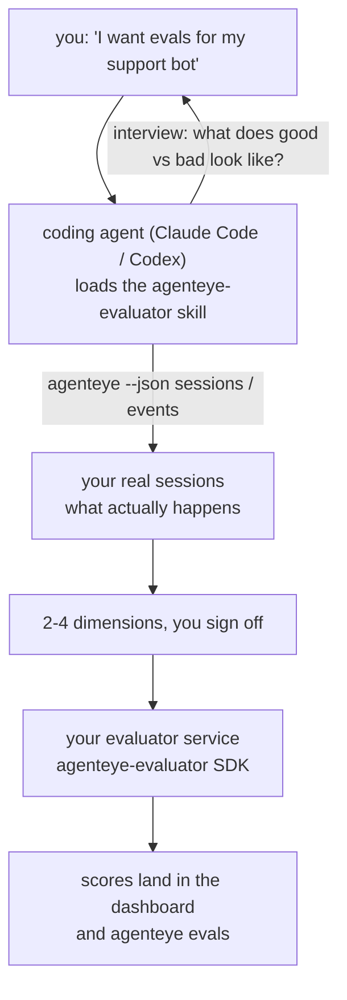

Von *„Ich glaube, unser Agent ist manchmal schlecht"* zu einem bereitgestellten Scoring-Service – wobei Ihr Coding-Agent sowohl die Entscheidungen trifft als auch den Aufbau übernimmt. Der **Failproof AI Observability Evaluator Skill** (`agenteye-evaluator`) ist ein *Agent Skill*: ein kleiner Ordner mit Anweisungen, den ein Coding-Agent wie Claude Code oder Codex bei Bedarf lädt. Er bringt dem Agenten bei, herauszufinden, welche Qualitätsdimensionen es für *Ihren* Agenten wert sind, verfolgt zu werden, und dann den [Evaluator-Service](/de/agenteye/evaluation-suite), der sie bewertet, zu schreiben, zu testen und bereitzustellen.

Es handelt sich **nicht** um einen gehosteten Scorer, eine Registry, in die Sie hochladen, oder ein Plugin-System. Ihr Evaluator bleibt Ihr eigener HTTP-Service auf Ihrer eigenen Infrastruktur, genau wie im Leitfaden zur [Evaluation Suite](/de/agenteye/evaluation-suite) beschrieben. Der Skill bringt Ihrem Agenten lediglich bei, ihn gut zu bauen – alles, was er tut, könnten Sie selbst tun, indem Sie denselben Code schreiben.

---

## Das Schwierige ist zu entscheiden, was bewertet werden soll

Die SDK-Oberfläche ist klein – ein Decorator und zwei Modelle – und ein Agent kann das allein aus dem [Vertrag](/de/agenteye/evaluation-suite#http-contract) herleiten. Daran scheitern Evaluatoren nicht. Sie scheitern, weil sie das Falsche bewerten, und ein Evaluator, der das Falsche bewertet, ist schlimmer als keiner: Er produziert ein Dashboard, das alle lernen zu ignorieren.

Der Großteil des Skills befasst sich daher mit dem Teil, bevor irgendein Code existiert. Er lässt den Agenten Sie interviewen (*„Beschreiben Sie einen Ablauf, der gut lief; jetzt einen, der schlecht lief"*), zieht dann Ihre echten Sessions über die [`agenteye`-CLI](/de/agenteye/cli) und liest sie von Anfang bis Ende. Diese beiden Hälften sind meist uneinig, und die Lücke ist der entscheidende Punkt: was Sie zu messen beabsichtigen gegenüber dem, was Ihre Transkripte tatsächlich unterstützen können. Eine Dimension überlebt nur, wenn sie aus den Ereignissen **berechenbar** und **diskriminierend** ist – wenn sie bei Ihrem guten und schlechten Ablauf jeweils 0,9 ergibt, lehrt sie nichts und wird gestrichen.

Das Ergebnis ist ein Vorschlag von 2-4 Dimensionen mit der dazugehörigen Begründung, dem Sie zustimmen müssen, bevor eine einzige Zeile geschrieben wird.



---

## Wie es sich zu den anderen Evaluierungs-Komponenten verhält

Vier Dokumente behandeln das Scoring und übergeben in dieser Reihenfolge aneinander:

| Seite | Was es ist | Verwenden Sie es, wenn |
|---|---|---|
| **[Evaluations](/de/agenteye/evaluations)** | Das Feature: Scores im Sessions-Raster, Dashboards, erneute Auswertung | Sie wissen möchten, was automatisches Scoring Ihnen bringt |
| **[Evaluation Suite](/de/agenteye/evaluation-suite)** | Der HTTP-Vertrag, das SDK, die Server-Umgebungsvariablen | Sie den Evaluator selbst implementieren oder debuggen |
| **Evaluator Skill** (dieses Dokument) | Eine natürlichsprachige Eingangstür zum Entwerfen *und* Aufbauen des Scorers | Sie von „Ich möchte Evals" zu einem laufenden Service gelangen möchten |
| **[CLI Skill](/de/agenteye/cli-skill)** | Eine natürlichsprachige Eingangstür zur `agenteye`-CLI | Sie die bereits vorhandenen Scores *lesen* möchten |
| **[Python SDK Skill](/de/agenteye/python-sdk-skill)** | Eine natürlichsprachige Eingangstür zur Instrumentierung Ihres Agenten | Ihr Agent noch keine Sessions ausgibt – es gibt nichts zu bewerten |

### vs. der CLI Skill: Bauen versus Lesen

Die beiden Skills überschneiden sich bewusst nicht, und beide zu installieren ist die übliche Konfiguration – der Agent wählt zwischen ihnen basierend darauf, was Sie fragen:

- **`agenteye-evaluator`** (dieses Dokument) baut das Ding, das Scores *produziert*. Seine Aufgabe endet, wenn Scores zum ersten Mal eintreffen.
- **[`agenteye-cli`](/de/agenteye/cli-skill)** liest bereits vorhandene Scores (`agenteye evals`). *„Hat die Qualität diese Woche nachgelassen?"* ist seine Frage, nicht die dieses Skills.

---

## Voraussetzungen

1. Die **`agenteye`-CLI installiert und eingeloggt** (`pipx install agenteye`, dann `agenteye login`). Der Skill nutzt sie zweimal: zum Abrufen der echten Sessions, gegen die er entwirft, und zum Bestätigen, dass Ihre Scores am Ende angekommen sind. Ihr Login benötigt `events:read`, plus `evaluations:read` für diese abschließende Überprüfung. Wie beim CLI Skill kann er den per E-Mail versandten Einmalcode-Login **nicht** für Sie abschließen.
2. **Einen Ort für den Evaluator.** Er wird in ein Image gebaut und als dauerhaft laufender Service betrieben, benötigt also ein echtes Repo, keine temporäre Datei. Evaluatoren befinden sich oft in einem eigenen Repo, getrennt vom bewerteten Agenten – der Skill sucht nach einem vorhandenen und fragt, bevor er ein neues anlegt.
3. **Das `agenteye-evaluator`-SDK-Wheel** – lesen Sie den nächsten Abschnitt, bevor Ihr Agent beginnt, `pip`-Befehle einzutippen.

---

## Wo man es bekommt

Der Skill ist in Failproof AI's öffentlicher Skills-Sammlung veröffentlicht:

**[github.com/FailproofAI/skills](https://github.com/FailproofAI/skills)** → [`skills/agenteye-evaluator/`](https://github.com/FailproofAI/skills/tree/main/skills/agenteye-evaluator)

Das Repository ist öffentlich und der Skill benötigt keine eigenen Zugangsdaten – er steuert nur die `agenteye`-CLI mit der Session, mit der *Sie* eingeloggt sind, und schreibt Code in *Ihr* Repo. Beachten Sie, dass er als eigener Ordner ausgeliefert wird und **nicht** im `pipx install agenteye`-Paket enthalten ist – suchen Sie also nicht dort danach.

## Den Skill installieren

Der schnellste Weg ist die [`skills`](https://skills.sh)-CLI, die den Ordner abruft und ihn dort ablegt, wo Ihr Agent sucht:

```bash
# Claude Code, nur dieses Projekt
npx skills add FailproofAI/skills --skill agenteye-evaluator -a claude-code

# jedes Projekt (installiert nach ~/.claude/skills/)
npx skills add FailproofAI/skills --skill agenteye-evaluator -a claude-code -g --copy

# Stattdessen Codex
npx skills add FailproofAI/skills --skill agenteye-evaluator -a codex
```

Dann verwalten Sie ihn wie jeden anderen Skill:

```bash
npx skills list -a claude-code           # was installiert ist
npx skills update agenteye-evaluator     # neueste Version holen
npx skills remove agenteye-evaluator     # entfernen
```

Lieber manuell installieren? Ein Agent Skill ist nur ein Ordner mit einer `SKILL.md` (plus optionalen Referenzen), daher funktioniert auch Kopieren:

- **Claude Code**: Legen Sie den Ordner `agenteye-evaluator/` in `~/.claude/skills/` (jedes Projekt) oder `<ihr-repo>/.claude/skills/` (nur dieses Repo). Claude Code erkennt ihn automatisch – überprüfen Sie dies mit der `/skills`-Liste oder fragen Sie einfach nach Evals.
- **Codex (OpenAI)**: Codex liest dieselbe `SKILL.md`. Das mitgelieferte `agents/openai.yaml` setzt `allow_implicit_invocation: true`, sodass Codex den Skill automatisch auswählt, wenn eine Aufgabe passt; andernfalls rufen Sie ihn explizit als `$agenteye-evaluator` auf.

---

## Das SDK ist nicht auf dem öffentlichen PyPI

> **Warnung:** Lesen Sie dies, bevor Sie einen Agenten das SDK installieren lassen.

Der Skill ist öffentlich; das SDK, das er verwendet, ist es nicht. `agenteye-evaluator` wird nur als privates Release-Artefakt ausgeliefert, und im Gegensatz zu `agenteye` ist der Name auf dem öffentlichen PyPI **nicht beansprucht** – ein bloßes `pip install agenteye-evaluator` könnte also ein fremdes Paket in den Service ziehen, der Ihre Produktionstranskripte liest. Das ist ein Supply-Chain-Problem, kein Tippfehler.

Der Skill weiß das und arbeitet stattdessen eine Installationsleiter hinunter, wobei er bei der ersten zutreffenden Stufe stoppt: die Monorepo-Quelle, wenn Sie sich im AgentEye-Repo befinden, andernfalls das private Release-Wheel von GitHub Releases (benötigt Zugang), und wenn keines erreichbar ist, **stoppt er und fordert Sie auf, Ihren Failproof AI-Kontakt nach dem Wheel zu fragen**, anstatt zu improvisieren.

Wenn Ihr Agent also ein bloßes `pip install agenteye-evaluator` aus dem öffentlichen PyPI vorschlägt, ist das das Zeichen, dass der Skill nie geladen wurde. Halten Sie dort inne und prüfen Sie, ob er installiert ist.

---

## Was Sie fragen können

Ein echter Durchlauf beginnt mit einer vagen Anfrage und endet mit einem abgesegneten Entwurf, nicht mit Code:

```text
you   ▸ I want evals for our support bot. I think it's sometimes bad.

agent ▸ Before I write anything: describe a run that went well,
        and one that went badly.

you   ▸ Good: it answers from the docs. Bad: it makes stuff up,
        or gives up and says "contact support".

agent ▸ Running: agenteye --json sessions --status error --since 7d
        Reading 5 sessions, including two you'd call bad.

        Your words say factuality and deflection. The transcripts
        agree on deflection (2 of 5 end with a support hand-off,
        and it's plain in model_response.content), but factuality
        needs a ground truth your events don't carry.

        So I'd score three things:
          - deflection      rules, cheap, separates your two runs
          - tool_efficiency rules, catches the retry loop in run-004
          - groundedness    LLM judge: is every claim in the docs it retrieved?

        "factuality" would need ground truth we don't have; groundedness
        is the closest thing your transcripts can actually support.
        OK with those three names? Renaming later splits the history.

you   ▸ yes

agent ▸ No evaluator in this repo. Should I scaffold one here, or do
        you have one elsewhere?
```

Von dort schreibt er die regelbasierten Dimensionen zuerst (kostenlos, sofort, deterministisch), testet sie gegen eine echte aufgezeichnete Session – einschließlich der leeren und nie abgeschlossenen, die naive Evaluatoren zum Absturz bringen –, und greift nur bei der subjektiven Dimension auf einen LLM-Richter zurück. Er kennt die [Grenzen des Dispatchers](/de/agenteye/evaluation-suite#configuring-the-server) – ein 30-Sekunden-Request-Timeout und 8 gleichzeitige Aufrufe systemweit –, sodass er bei einem Richter, der nicht zuverlässig hineinpasst, asynchron mit `JobPending` vorgeht, anstatt zuzulassen, dass Ihr Richter fünfmal abgebrochen und fünfmal so teuer wiederholt wird.

Dann stellt er bereit, setzt die zwei Server-Umgebungsvariablen und bestätigt mit `agenteye --json evals --session-id <id>`, dass Scores tatsächlich angekommen sind. Das Ankommen der Scores ist der einzige Beweis.

---

## Worauf Sie achten sollten

- **Dimensionsnamen sind nahezu dauerhaft.** Score-Keys sind beliebige Zeichenketten und die Plattform erstellt Trends aus allem, was Sie senden – das bedeutet, nichts stromabwärts korrigiert eine schlechte Wahl. Benennen Sie später um und die Geschichte teilt sich: Alte Sessions behalten den alten Key und der Trend bricht ab. Deshalb holt der Skill ausdrückliche Zustimmung ein, bevor Code geschrieben wird – nehmen Sie diese Aufforderung ernst.
- **Fixtures sind echte Produktionstranskripte.** Das Entwerfen gegen echte Sessions bedeutet, sie auf die Festplatte zu ziehen, und sie können Kundendaten enthalten. Der Skill fragt, bevor er sie in Git einschreibt; im Zweifelsfall halten Sie `fixtures/` aus dem Repo heraus und lassen Sie jeden Entwickler seine eigenen abrufen.
- **Der Agent schreibt und betreibt einen Service, der jedes Transkript liest.** Er handelt als Sie, begrenzt durch die Berechtigungen Ihres CLI-Logins, aber überprüfen Sie den Evaluator wie jeden anderen Code, der Produktionsdaten berührt.

---

## Nächste Schritte

- **[Evaluation Suite](/de/agenteye/evaluation-suite)**: der HTTP-Vertrag, das SDK und die Server-Umgebungsvariablen, die der Skill konfiguriert.
- **[Evaluations](/de/agenteye/evaluations)**: wo die Scores erscheinen, sobald sie ankommen.
- **[CLI Skill](/de/agenteye/cli-skill)**: der Geschwister-Skill, zum Lesen von Ergebnissen statt zum Aufbauen des Scorers.
- **[CLI](/de/agenteye/cli)**: die Befehlsreferenz hinter den Session-Daten, gegen die der Skill entwirft.