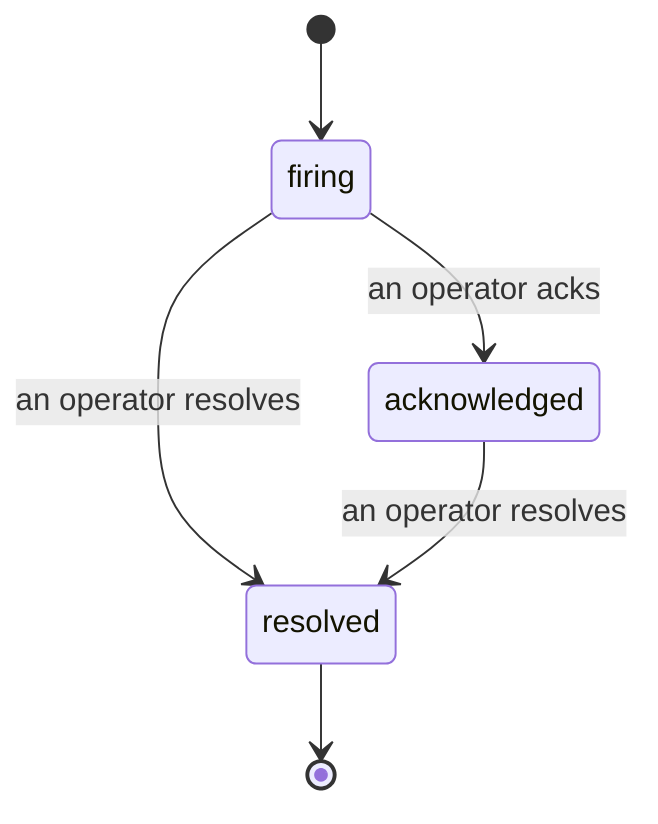

Wenn ein Alert ausgelöst wird, lautet die erste Frage immer: „Wer kümmert sich darum?" Incidents geben die Antwort: Sobald eine Schwelle überschritten wird, kann jeder sehen, dass der Incident offen ist, wer ihn verantwortet und genau was bisher passiert ist – als sauberes, zugeordnetes Protokoll, das sich direkt in ein Post-mortem übernehmen lässt.

*Das Postfach gruppiert offene Incidents nach Status und lässt sich nach Schweregrad und Zuständigem filtern – so siehst du sofort, was jetzt menschliches Eingreifen erfordert.*

## Auf einen Blick sehen, wer es hat

Kein „Schaut sich das gerade jemand an?" mehr im Chat. Eine Schwellenüberschreitung öffnet automatisch einen Incident und legt ihn in ein gemeinsames Postfach, gruppiert nach Status. Wer ihn bestätigt (Acknowledge), erscheint namentlich – das Team weiß sofort, dass es in Bearbeitung ist. Das Bestätigen ist geteilt: Mehrere Operatoren können denselben Incident bestätigen, und jeder Eintrag wird einzeln erfasst, sodass ein ganzes War-Room-Team namentlich auftaucht, statt sich gegenseitig zu überschreiben. Weise einen Verantwortlichen für die Triage zu und filtere das Postfach nach Schweregrad oder Zuständigem, um es auf das Wesentliche zu reduzieren.

## Die ganze Geschichte, in einer Timeline

Wenn der Incident vorbei ist, ist der Bericht schon fertig. Öffne einen beliebigen Incident und du siehst die Beweise der Schwellenüberschreitung, die Zuständigen und Abonnenten, einen Kommentar-Thread zur Koordination vor Ort und eine rein erweiterbare Aktivitäts-Timeline.

*Alles, was passiert ist, in chronologischer Reihenfolge – jede Zeile signiert von dem, der gehandelt hat.*

Jede Aktion (geöffnet, bestätigt, gelöst usw.) wird in diese Timeline geschrieben und nie nachträglich geändert. Jeder Eintrag ist zugeordnet: dem Operator, der gehandelt hat – per E-Mail –, oder **automated** für alles, was Failproof AI Observability eigenständig getan hat, z. B. das Öffnen des Incidents beim Breach. Nichts ist anonym, nichts geht verloren – das Post-mortem schreibt sich dadurch quasi von selbst.

## Wie ein Incident sich bewegt

- **Offen (firing):** Die Schwellenüberschreitung öffnet den Incident und benachrichtigt deine Kanäle einmalig. Wiederholte Breaches werden in denselben Incident eingefaltet und aktualisieren die Beweise, anstatt dich immer wieder zu benachrichtigen.
- **Bestätigt (Acknowledged):** Ein Operator übernimmt ihn. Er bleibt offen, und spätere Breaches aktualisieren die Beweise still im Hintergrund.
- **Gelöst (Resolved):** Ein Operator schließt ihn ab. Automatische Auflösung bei Behebung der Ursache ist geplant, aber noch nicht aktiviert – ein Incident bleibt also so lange offen, bis ein Mensch ihn löst. Das sorgt für Klarheit darüber, was wirklich behoben ist. Für denselben Alert kann später ein neuer Incident geöffnet werden.

Ein Alert kann immer höchstens einen offenen Incident haben – eine flatternde Regel kann dich also nicht mit Duplikaten überfluten. Du kannst einen Incident auch manuell öffnen: einen eigenständigen für etwas, das kein Alert erfasst hat, oder einen an einen bestehenden Alert gebundenen – sofern du `incidents:write` hast.

## Wo du es findest

Incidents sind unter `/<org-slug>/incidents` zu finden. Zum Ansehen ist **`incidents:read`** erforderlich; zum manuellen Öffnen eines Incidents **`incidents:write`**; zum Bestätigen, Zuweisen, Kommentieren und Lösen **`incidents:ack`**. Ältere Schlüssel mit dem abgelösten `alerts:ack` funktionieren weiterhin, da es als `incidents:ack` anerkannt wird – deine On-Call-Rotation muss also nicht neu ausgestellt werden.

## Verwandtes

- [Alerts](/de/agenteye/alerts): Die Regeln, die diese Incidents öffnen, wenn eine Schwelle überschritten wird.
- [Error tracking](/de/agenteye/error-tracking): Alle Fehler an einem Ort einsehen und einen davon zu einem Alert weiterentwickeln.
- [Audits](/de/agenteye/audits): Der geplante Analyst, der Fehler findet, auf die keine Regel geachtet hat.