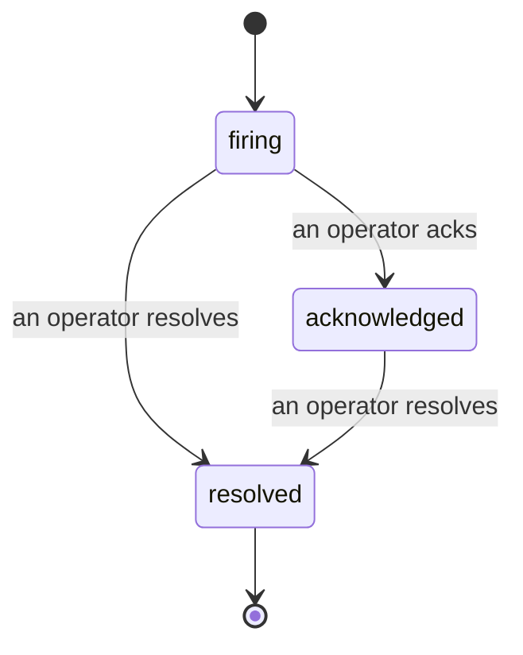

Wenn ein Alert ausgelöst wird, lautet die erste Frage immer: „Wer kümmert sich darum?" Incidents beantworten sie: In dem Moment, in dem etwas eine Schwelle überschreitet, kann jeder sehen, dass der Incident offen ist, wer ihn besitzt und genau was bisher passiert ist – mit einem sauberen, zugeschriebenen Protokoll, das sich direkt an ein Post-mortem weitergeben lässt.

*Der Posteingang gruppiert offene Incidents nach Status und filtert nach Schweregrad und Verantwortlichem, damit du sofort siehst, wo ein Mensch gefragt ist.*

## Auf einen Blick sehen, wer es übernommen hat

Kein „Schaut sich das jemand an?" mehr in einem Chat-Thread. Ein Schwellenverstoß öffnet automatisch einen Incident und legt ihn in einen gemeinsamen Posteingang, nach Status gruppiert. Bestätige ihn, und dein Name steht drauf – so weiß das restliche Team, dass es gehandhabt wird. Die Bestätigung ist geteilt: Mehrere Operatoren können denselben Incident bestätigen, und jeder wird einzeln erfasst, sodass ein vollständiges War-Room-Team namentlich auftaucht, ohne sich gegenseitig zu überschreiben. Weise einen Verantwortlichen für das Triage zu und filtere den Posteingang nach Schweregrad oder Verantwortlichem, um ihn auf das Wesentliche zu reduzieren.

## Die ganze Geschichte in einer Timeline

Wenn der Incident vorbei ist, hast du den Bericht bereits. Öffne einen beliebigen Incident und du siehst den Schwellenverstoss als Beleg, die zugewiesenen Personen und Abonnenten, einen Kommentar-Thread zur Koordination direkt vor Ort sowie eine nur ergänzbare Aktivitäts-Timeline.

*Alles, was passiert ist, in chronologischer Reihenfolge – jede Zeile signiert von der Person, die sie ausgeführt hat.*

Jede Aktion (geöffnet, bestätigt, gelöst usw.) wird in diese Timeline geschrieben und nie nachträglich gelöscht. Jeder Eintrag ist zugeschrieben: dem Operator, der ihn vorgenommen hat, per E-Mail, oder **automated** für alles, was Failproof AI Observability eigenständig getan hat, etwa das Öffnen des Incidents bei einem Verstoß. Nichts ist anonym, nichts geht verloren – das Post-mortem schreibt sich dadurch fast von selbst.

## Wie sich ein Incident bewegt

- **Offen (firing):** Der Verstoß öffnet den Incident und benachrichtigt deine Kanäle einmalig. Wiederholte Verstöße fließen in denselben Incident ein und aktualisieren dessen Beweise, anstatt dich immer wieder zu benachrichtigen.
- **Bestätigt (acknowledged):** Ein Operator übernimmt ihn. Er bleibt offen, und spätere Verstöße aktualisieren die Beweise stillschweigend.
- **Gelöst (resolved):** Ein Operator schließt ihn ab. Automatische Auflösung bei Wegfall der Bedingung ist geplant, aber noch nicht aktiviert – ein Incident bleibt also offen, bis ein Mensch ihn auflöst, was alle ehrlich darüber hält, was tatsächlich behoben wurde. Für denselben Alert kann später ein neuer Incident geöffnet werden.

Ein Alert hält zu jedem Zeitpunkt höchstens einen offenen Incident, sodass eine flappende Regel dich nicht in Duplikaten vergraben kann. Du kannst einen Incident auch manuell öffnen: einen eigenständigen für etwas, das kein Alert erfasst hat, oder einen, der an einen bestehenden Alert angehängt ist – sofern du `incidents:write` besitzt.

## Wo du es findest

Incidents befinden sich unter `/<org-slug>/incidents`. Zum Ansehen wird **`incidents:read`** benötigt; zum manuellen Öffnen eines Incidents **`incidents:write`**; zum Bestätigen, Zuweisen, Kommentieren und Lösen **`incidents:ack`**. Ältere Schlüssel, denen das abgekündigte `alerts:ack` gewährt wurde, funktionieren weiterhin, da es als `incidents:ack` anerkannt wird – deine Bereitschaftsrotation muss also nicht neu ausgestellt werden.

## Verwandt

- [Alerts](/de/agenteye/alerts): die Regeln, die diese Incidents öffnen, wenn ein Schwellenwert überschritten wird.
- [Error tracking](/de/agenteye/error-tracking): alle Fehler an einem Ort einsehen und einen davon zu einem Alert befördern.
- [Audits](/de/agenteye/audits): der geplante Analyst, der Fehler findet, auf die keine Regel geachtet hat.