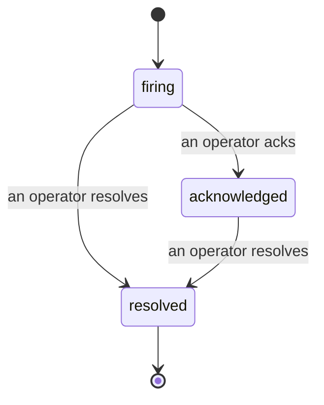

Wenn ein Alert ausgelöst wird, stellt sich immer zuerst die Frage: „Wer kümmert sich darum?" Incidents geben die Antwort: Sobald etwas einen Schwellenwert überschreitet, sehen alle, dass der Incident offen ist, wer ihn besitzt und was bisher passiert ist – mit einem sauberen, zugeordneten Protokoll, das sich direkt in ein Post-Mortem übernehmen lässt.

*Der Posteingang gruppiert offene Incidents nach Status und filtert nach Schweregrad und zugewiesener Person, damit sofort ersichtlich ist, was jetzt menschliches Eingreifen erfordert.*

## Auf einen Blick sehen, wer es in der Hand hat

Kein „Schaut sich das jemand an?" mehr im Chat. Eine Schwellenwertüberschreitung öffnet automatisch einen Incident und legt ihn in einen gemeinsamen Posteingang, gruppiert nach Status. Wird er bestätigt, erscheint der eigene Name darauf – der Rest des Teams weiß, dass es gehandhabt wird. Die Bestätigung ist gemeinsam nutzbar: Mehrere Operatoren können denselben Incident bestätigen, und jede Bestätigung wird einzeln erfasst, sodass ein vollständiges Bereitschaftsteam namentlich aufgeführt wird, ohne sich gegenseitig zu überschreiben. Eine Person wird als verantwortlich für die Triage zugewiesen; der Posteingang lässt sich nach Schweregrad oder zugewiesener Person filtern, um ihn auf das Eigene zu reduzieren.

## Die ganze Geschichte in einer Zeitleiste

Wenn der Incident vorbei ist, liegt der Bericht bereits vor. Öffnet man einen Incident, sieht man die Beweismittel zur Überschreitung, die zugewiesenen Personen und Abonnenten, einen Kommentar-Thread zur direkten Koordination und eine nur erweiterbare Aktivitäts-Zeitleiste.

*Alles, was passiert ist, in chronologischer Reihenfolge – jede Zeile mit der Angabe, wer sie verursacht hat.*

Jede Aktion (geöffnet, bestätigt, gelöst usw.) wird in diese Zeitleiste geschrieben und nie nachträglich bearbeitet. Jeder Eintrag ist zugeordnet: dem Operator, der die Aktion vorgenommen hat, per E-Mail, oder als **automated** für alles, was Failproof AI Observability selbstständig getan hat, wie etwa das Öffnen des Incidents bei einer Überschreitung. Nichts ist anonym und nichts geht verloren, sodass das Post-Mortem sich praktisch von selbst schreibt.

## Wie sich ein Incident entwickelt

- **Offen (firing):** Die Überschreitung öffnet den Incident und benachrichtigt die konfigurierten Kanäle einmalig. Wiederholte Überschreitungen werden in denselben Incident eingefaltet und aktualisieren dessen Beweismittel, anstatt wiederholt zu benachrichtigen.
- **Bestätigt (acknowledged):** Ein Operator nimmt sich des Incidents an. Er bleibt offen, und spätere Überschreitungen aktualisieren die Beweismittel still.
- **Gelöst (resolved):** Ein Operator schließt ihn ab. Eine automatische Auflösung, sobald die Bedingung nicht mehr zutrifft, ist geplant, aber noch nicht aktiviert – ein Incident bleibt daher offen, bis ein Mensch ihn auflöst. Das stellt sicher, dass tatsächlich geklärt ist, was wirklich behoben wurde. Auf denselben Alert kann später ein neuer Incident geöffnet werden.

Ein Alert kann gleichzeitig höchstens einen offenen Incident haben, sodass eine instabile Regel keine Flut an Duplikaten erzeugen kann. Ein Incident kann auch manuell geöffnet werden: entweder als eigenständiger Incident für etwas, das kein Alert erfasst hat, oder als einem bestehenden Alert zugeordneter Incident, vorausgesetzt man hat `incidents:write`.

## Wo man es findet

Incidents befinden sich unter `/<org-slug>/incidents`. Für die Anzeige ist **`incidents:read`** erforderlich; zum Öffnen eines manuellen Incidents wird **`incidents:write`** benötigt; Bestätigen, Zuweisen, Kommentieren und Auflösen erfordern **`incidents:ack`**. Ältere Schlüssel, denen das veraltete `alerts:ack` gewährt wurde, funktionieren weiterhin, da es als `incidents:ack` behandelt wird – die Bereitschaftsrotation muss also nicht neu ausgestellt werden.

## Verwandte Themen

- [Alerts](/de/agenteye/alerts): Die Regeln, die diese Incidents öffnen, wenn ein Schwellenwert überschritten wird.
- [Error tracking](/de/agenteye/error-tracking): Alle Fehler an einem Ort einsehen und einen davon zu einem Alert hochstufen.
- [Audits](/de/agenteye/audits): Der geplante Analyst, der Fehler findet, die keine Regel im Blick hatte.