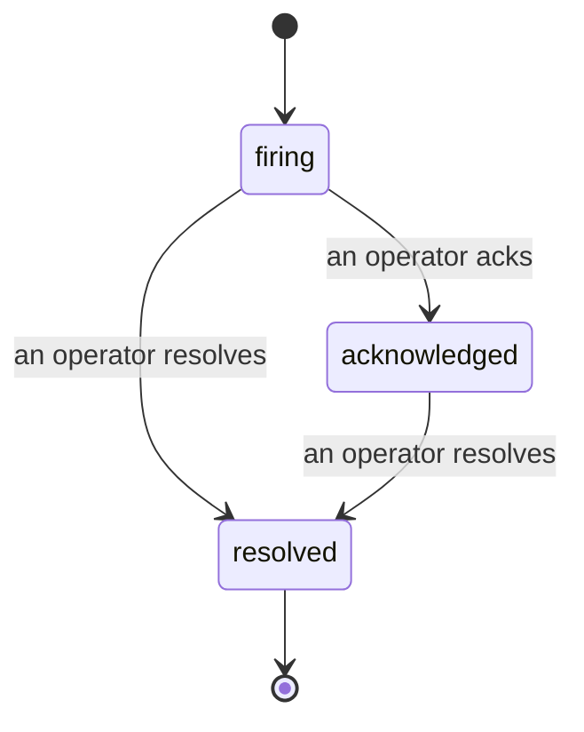

Wenn ein Alert ausgelöst wird, lautet die erste Frage immer: „Wer kümmert sich darum?" Incidents geben die Antwort: In dem Moment, in dem etwas einen Schwellenwert überschreitet, sehen alle, dass ein Incident offen ist, wer ihn verantwortet und genau was bisher passiert ist – mit einem sauberen, zugeordneten Protokoll, das sich direkt für ein Post-mortem verwenden lässt.

*Der Posteingang gruppiert offene Incidents nach Status und lässt sich nach Schweregrad und Verantwortlichem filtern, sodass sofort ersichtlich ist, was menschliches Eingreifen erfordert.*

## Auf einen Blick sehen, wer es übernommen hat

Kein „Schaut sich das jemand an?" mehr im Chat-Thread. Eine Schwellenwertüberschreitung öffnet automatisch einen Incident und legt ihn in einem gemeinsamen Posteingang ab, gruppiert nach Status. Wer ihn bestätigt, setzt seinen Namen darunter – so weiß das restliche Team, dass er bearbeitet wird. Die Bestätigung ist geteilt: Mehrere Operatoren können denselben Incident bestätigen, und jeder wird separat erfasst, sodass ein vollständiges War Room namentlich erkennbar ist, ohne sich gegenseitig zu überlagern. Weist man einen Verantwortlichen für die Triage zu und filtert den Posteingang nach Schweregrad oder Verantwortlichem, sieht man schnell nur noch die eigenen Aufgaben.

## Die ganze Geschichte auf einer Timeline

Wenn der Incident vorbei ist, liegt der Bericht bereits vor. Öffnet man einen Incident, sieht man die Breach-Beweise, die Zugewiesenen und Abonnenten, einen Kommentar-Thread für die Koordination vor Ort und eine nur erweiterbare Aktivitäts-Timeline.

*Alles, was passiert ist, in chronologischer Reihenfolge – jede Zeile signiert von der Person, die sie ausgeführt hat.*

Jede Aktion (geöffnet, bestätigt, gelöst usw.) wird in diese Timeline geschrieben und nie nachträglich bearbeitet. Jeder Eintrag ist zugeordnet: entweder dem Operator, der sie per E-Mail vorgenommen hat, oder **automated** für alles, was Failproof AI Observability eigenständig getan hat, etwa das Öffnen des Incidents beim Breach. Nichts ist anonym, und nichts geht verloren – das Post-mortem schreibt sich dadurch fast von selbst.

## Wie sich ein Incident entwickelt

- **Offen (firing):** Der Breach öffnet den Incident und benachrichtigt die konfigurierten Kanäle einmalig. Wiederholte Breaches werden in denselben Incident eingefaltet und aktualisieren dessen Beweise, anstatt immer wieder neue Benachrichtigungen zu senden.
- **Bestätigt (acknowledged):** Ein Operator übernimmt ihn. Er bleibt offen, und spätere Breaches aktualisieren die Beweise stillschweigend.
- **Gelöst (resolved):** Ein Operator schließt ihn ab. Die automatische Auflösung, wenn die Bedingung sich klärt, ist geplant, aber noch nicht aktiviert – ein Incident bleibt daher so lange offen, bis ein Mensch ihn löst. Das sorgt für Ehrlichkeit darüber, was tatsächlich behoben wurde. Für denselben Alert kann später ein neuer Incident geöffnet werden.

Ein Alert hält zu jedem Zeitpunkt höchstens einen offenen Incident, sodass eine flatternde Regel nicht in Duplikaten versinkt. Es ist auch möglich, einen Incident manuell zu öffnen: einen eigenständigen für etwas, das kein Alert erfasst hat, oder einen an einen bestehenden Alert gekoppelten – sofern man `incidents:write` besitzt.

## Wo man es findet

Incidents befinden sich unter `/<org-slug>/incidents`. Zum Anzeigen wird **`incidents:read`** benötigt; zum manuellen Öffnen eines Incidents **`incidents:write`**; zum Bestätigen, Zuweisen, Kommentieren und Lösen **`incidents:ack`**. Ältere Schlüssel mit dem veralteten `alerts:ack` funktionieren weiterhin, da es als `incidents:ack` behandelt wird – die Bereitschaftsrotation muss also nicht neu ausgestellt werden.

## Verwandte Themen

- [Alerts](/de/agenteye/alerts): die Regeln, die diese Incidents öffnen, wenn ein Schwellenwert überschritten wird.
- [Error Tracking](/de/agenteye/error-tracking): alle Fehler an einem Ort einsehen und einen davon zu einem Alert hochstufen.
- [Audits](/de/agenteye/audits): der geplante Analyst, der Fehler findet, auf die keine Regel geachtet hat.