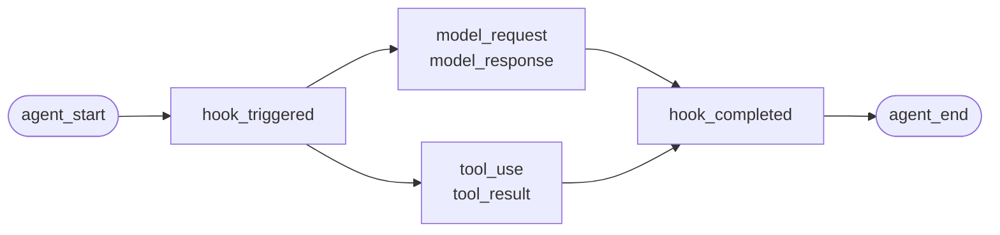
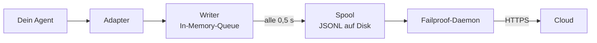

Für selbst geschriebene Agenten oder Frameworks, für die Failproof AI keinen Adapter bereitstellt. Es gibt nichts zu instrumentieren: Du sendest die Events selbst.

Das ist dieselbe API, die auch die vier Framework-Adapter intern verwenden. Sie sind lediglich Übersetzungstabellen darüber.

## Installation

```bash
pip install failproofai-sdk
```

Keine Extras, keine Abhängigkeiten.

## Instrumentierung

```python
import failproofai_sdk

failproofai_sdk.configure(environment="production")

with failproofai_sdk.session():                 # ein Durchlauf
    with failproofai_sdk.agent("planner"):      # eine Arbeitseinheit
        with failproofai_sdk.tool_call("search", input={"q": q}) as t:
            t.output = search(q)                # ein Tool-Aufruf
```

Von oben nach unten gelesen erklärt sich der Code von selbst:

| Einschließen mit | Bedeutung |
| --- | --- |
| `session()` | Diese Events gehören zum selben Durchlauf |
| `agent()` | Etwas verrichtet Arbeit – gib ihm einen erkennbaren Namen |
| `tool_call()` | Das ist ein Tool-Aufruf, und das ist sein Ergebnis |

Und was jedes davon tatsächlich sendet:

| Scope | Sendet | Zweck |
| --- | --- | --- |
| `session()` | Nichts | Bindet eine Session-ID und gruppiert einen Durchlauf |
| `agent()` | `agent_start`, `agent_end` | Klammert eine Arbeitseinheit |
| `tool_call()` | `tool_use`, `tool_result` | Klammert einen Tool-Aufruf und misst ihn |

Alles im Inneren kann `session_id` und `agent_id` weglassen. Die Scopes binden die Identität an Kontextvariablen, und jeder Event-Aufruf liest sie von dort – du musst keine IDs durch deine Funktionen durchreichen.

Alle drei funktionieren sowohl mit `async with` als auch mit `with`.

Verschachtelte Agenten bilden den Baum. `parent_id` und Tiefe werden aus dem Stack berechnet:

```python
with failproofai_sdk.session():
    with failproofai_sdk.agent("supervisor"):
        with failproofai_sdk.agent("researcher"):    # parent_id = "supervisor"
            ...
```

## Wie ein Scope schließt

`agent()` behandelt Ausnahmen für dich:

| Was passiert | Events | Ergebnis |
| --- | --- | --- |
| Keine Ausnahme | `agent_end` | `success` |
| `Exception` | `error`, dann `agent_end` | `failed` |
| `KeyboardInterrupt`, `SystemExit` | `error`, dann `agent_end` | `failed` |
| `CancelledError`, `GeneratorExit` | Nur `agent_end` | `cancelled` |

Der Fehler wird vor `agent_end` gesendet, weil das Dashboard den Span bei `agent_end` schließt und alles Spätere keinem Span mehr zugeordnet wird. Ein Abbruch ist kein Fehler, daher verschmutzen abgebrochene Durchläufe die Fehleransicht nicht. Die Ausnahme wird immer weitergeleitet – ein Scope schluckt niemals.

## Die Event-Methoden

Fünfzehn Methoden in sechs Familien. Die meisten kommen paarweise – du sendest den Öffner, dann den Schließer, und das SDK misst die Zeitspanne dazwischen.

| Familie | Öffnet | Schließt | Eigenständig |
| --- | --- | --- | --- |
| **Agenten** | `agent_start` | `agent_end` | — |
| | `agent_pause` | `agent_resume` | — |
| **Modelle** | `model_request` | `model_response` | — |
| **Tools** | `tool_use` | `tool_result` | — |
| **Hooks** | `hook_triggered` | `hook_completed` | — |
| **Menschen** | `human_wait` | `human_input` | `human_pause`, `human_interrupt` |
| **Fehler** | — | — | `error` |

<Tip>
  Bevorzuge die Scopes – `agent()` und `tool_call()` – wo immer sie passen. Sie garantieren das schließende Event auch dann, wenn der Rumpf eine Ausnahme wirft. Greife direkt auf diese Methoden zurück, wenn dein Kontrollfluss nicht schachtelt, etwa bei einem Modellaufruf innerhalb einer Hilfsfunktion.
</Tip>

<CodeGroup>
```python Agents
failproofai_sdk.event.agent_start(agent_id="planner", goal="find the cheapest flight")
failproofai_sdk.event.agent_end(agent_id="planner", outcome="success", summary="...")
failproofai_sdk.event.agent_pause(pause_id="p1", reason="awaiting approval")
failproofai_sdk.event.agent_resume(pause_id="p1")
```

```python Models
failproofai_sdk.event.model_request(
    model="gpt-4o-mini",
    messages=[{"role": "user", "content": "..."}],
    request_id="req-1",
)
failproofai_sdk.event.model_response(
    model="gpt-4o-mini",
    content="...",
    input_tokens=139,
    output_tokens=21,
    request_id="req-1",
    duration_ms=5202,
)
```

```python Tools
failproofai_sdk.event.tool_use(tool_name="search", tool_call_id="c1", input={"q": "..."})
failproofai_sdk.event.tool_result(tool_name="search", tool_call_id="c1", output="...")
```

```python Hooks
failproofai_sdk.event.hook_triggered(hook_name="retrieve", hook_id="h1", trigger_event="node")
failproofai_sdk.event.hook_completed(hook_name="retrieve", hook_id="h1", outcome="success")
```

```python Humans
failproofai_sdk.event.human_wait(input_id="i1", prompt="Approve?", options=["yes", "no"])
failproofai_sdk.event.human_input(input_id="i1", response="yes")
failproofai_sdk.event.human_pause(reason="operator paused the run", user_id="dana")
failproofai_sdk.event.human_interrupt(reason="operator stopped the run", at_step="step_3")
```

```python Failures
failproofai_sdk.event.error(
    error_type="TimeoutError",
    message="provider timed out after 30s",
    traceback="...",
)
```
</CodeGroup>

<Note>
  **Die zwei Human-Familien zeigen in entgegengesetzte Richtungen.**

  | Methoden | Bedeutung |
  | --- | --- |
  | `human_wait` / `human_input` | Der **Agent hat eine Person gefragt** – ein Freigabe-Gate, eine Rückfrage |
  | `human_pause` / `human_interrupt` | Eine **Person hat auf den Agenten eingewirkt** – ein Stopp-Button, eine Operator-Pause |

  Kein Framework signalisiert das zweite Paar – es liegt immer an dir, diese Events zu senden.
</Note>

<Warning>
  **Übergib `request_id`, wenn Modellaufrufe gleichzeitig laufen.** Ohne sie werden Anfragen und Antworten in Empfangsreihenfolge pro Agent zugeordnet – bei gleichzeitigen Aufrufen entstehen so falsche Paarungen, bei denen jede Antwort der falschen Anfrage zugewiesen wird.
</Warning>

## Beispiel

Eine Tool-Calling-Schleife gegen die OpenAI-API, ohne Agent-Framework:

```python
import json

import failproofai_sdk
from openai import OpenAI

failproofai_sdk.configure(environment="production")
client = OpenAI()
MODEL = "gpt-4o-mini"


def turn(messages: list):
    """Ein Modellaufruf, eingeklammert durch das Paar."""
    failproofai_sdk.event.model_request(model=MODEL, messages=messages)
    reply = client.chat.completions.create(model=MODEL, messages=messages, tools=TOOLS)
    usage = reply.usage
    failproofai_sdk.event.model_response(
        model=MODEL,
        content=reply.choices[0].message.content or "",
        input_tokens=usage.prompt_tokens,
        output_tokens=usage.completion_tokens,
    )
    return reply.choices[0].message


with failproofai_sdk.session():
    with failproofai_sdk.agent("inventory", goal="price report"):
        for _ in range(4):          # begrenzt; eine unbegrenzte Agentenschleife ist ein eigener Fehler
            message = turn(messages)
            if not message.tool_calls:
                break
            messages.append(message.model_dump(exclude_none=True))
            for call in message.tool_calls:
                args = json.loads(call.function.arguments or "{}")
                with failproofai_sdk.tool_call(
                    call.function.name, tool_call_id=call.id, input=args
                ) as handle:
                    handle.output = run_tool(call.function.name, args)
                messages.append({
                    "role": "tool",
                    "tool_call_id": call.id,
                    "content": str(handle.output),
                })
```

Das erzeugt dieselben sechs Event-Typen, die auch ein Adapter liefern würde. Die vollständige, ausführbare Version mit den Tool-Definitionen liegt im SDK-Repository unter `docs/manual/examples/`.

## Threads und async

Kontextvariablen werden automatisch in asyncio-Tasks weitergegeben. In neue Threads werden sie nicht weitergegeben, da ein Thread mit einem leeren Kontext startet.

```python
# asyncio: nichts zu tun
async with failproofai_sdk.session():
    await asyncio.gather(worker(1), worker(2))

# Threads: das Callable einwickeln
pool.submit(failproofai_sdk.propagate(work), x)
threading.Thread(target=failproofai_sdk.propagate(work)).start()
loop.run_in_executor(None, failproofai_sdk.propagate(work), x)
```

Ohne `propagate()` werfen die Events des Workers einen `TypeError`, der den Fix benennt, anstatt auf keiner Session zu landen. Das ist beabsichtigt: Ein Event ohne Session wird bei der Verarbeitung übersprungen und mit `200` beantwortet – genau der stille Fehler, den die Identitätsschicht verhindern soll.

## Ein Framework ohne Adapter instrumentieren

Jedes Agent-Framework bietet dieselben drei Ansatzpunkte. Bilde sie ab und du hast einen vollständigen Trace – die vier mitgelieferten Adapter tun nichts weiter als das.

| Der Ansatzpunkt | Was du schreibst | Was landet |
| --- | --- | --- |
| Der Durchlauf | `session()` + `agent()` | `agent_start`, `agent_end` |
| Jeder Tool-Aufruf | `tool_call()` | `tool_use`, `tool_result` |
| Jeder Modellaufruf | Das `model_*`-Paar | `model_request`, `model_response` |

<Steps>
  <Step title="Den Durchlauf einklammern">
    ```python
    with failproofai_sdk.session():
        with failproofai_sdk.agent(agent_name, goal=task):
            result = framework.run(task)
    ```
  </Step>
  <Step title="Jeden Tool-Aufruf einklammern">
    In dem, was das Framework als Tool-Wrapper oder Middleware bezeichnet.

    ```python
    with failproofai_sdk.tool_call(name, input=args) as call:
        call.output = original(**args)
    ```
  </Step>
  <Step title="Jeden Modellaufruf paaren">
    ```python
    failproofai_sdk.event.model_request(model=model, messages=messages)
    reply = provider.complete(...)
    failproofai_sdk.event.model_response(
        model=model,
        content=text,
        input_tokens=usage.prompt_tokens,
        output_tokens=usage.completion_tokens,
    )
    ```
  </Step>
</Steps>

<Tip>
  **Gibt es eine Node-, Step- oder Middleware-Grenze, die sichtbar sein soll?** Wickle sie in ein Hook-Paar – `hook_triggered` / `hook_completed` – nicht in ein verschachteltes `agent()`. `agent_id` ist eine Facette mit niedriger Kardinalität, und ein Eintrag pro Node würde sie überfluten. Hook-Spans werden genauso gerendert und liefern dir die Latenz pro Node.
</Tip>

<Note>
  **Manuelle und automatische Instrumentierung ergänzen sich.** Ein Adapter, der innerhalb eines handgeschriebenen Scopes läuft, tritt der Session bei und wird dem Agenten untergeordnet – du erhältst einen einzigen Baum statt zwei. Das ist nützlich, wenn du ein Framework selbst instrumentierst und gleichzeitig ein unterstütztes verwendest.
</Note>

<Accordion title="Warum es keinen AutoGen-Adapter gibt">
  Zwei Gründe, und die drei Ansatzpunkte oben sind die Antwort auf beide:

  - `autogen-core` wird seit September 2025 nicht mehr gepflegt.
  - AG2 bietet keinen prozessweiten Registrierungspunkt, der den Hooks anderer Frameworks entspricht, sodass die Instrumentierung bedeutet, jeden Agenten an jeder Konstruktionsstelle zu wrappen.

  Durch manuelles Abbilden der Ansatzpunkte werden dieselben Events mit derselben Genauigkeit aufgezeichnet wie durch einen mitgelieferten Adapter.
</Accordion>

## Tiefer eintauchen

Wie die Aufzeichnung tatsächlich funktioniert. Nichts davon ist nötig, um loszulegen.

<AccordionGroup>

<Accordion title="Wie eine Aufzeichnung aussieht, pro Framework" icon="eye">

Jede Aufzeichnung hat dieselbe Form: Ein Span öffnet sich, Arbeit schachtelt sich hinein, und jeder öffnende Event erhält einen schließenden.



Das **Paar** ist die Grundeinheit. Jeder schließende Event trägt eine Dauer, die das SDK vom öffnenden Event an gemessen hat.

Unten ist je ein echter Durchlauf pro Framework – aufgezeichnet aus den Beispielen, die mit dem SDK geliefert werden, Modellname normalisiert. Beachte, wie viel ein einzelner Aufruf zurückliefert.

<Tabs>
  <Tab title="LangGraph">
    ```text 14 events
     1  +0.000s  agent_start       LangGraph
     2  +0.001s    hook_triggered  agent
     3  +0.002s      model_request   gpt-4o-mini
     4  +3.023s      model_response  gpt-4o-mini · 21 out-tok
     5  +3.024s    hook_completed  agent
     6  +3.024s    hook_triggered  tools
     7  +3.025s      tool_use      word_count
     8  +3.025s      tool_result   word_count · ok
     9  +3.025s    hook_completed  tools
    10  +3.026s    hook_triggered  agent
    11  +3.027s      model_request   gpt-4o-mini
    12  +5.717s      model_response  gpt-4o-mini · 5 out-tok
    13  +5.720s    hook_completed  agent
    14  +5.721s  agent_end         LangGraph · success
    ```

    Nodes werden zu Hook-Paaren, sodass du die Latenz pro Node erhältst, ohne die Agentenliste zu überfüllen.
  </Tab>

  <Tab title="CrewAI">
    ```text 10 events
     1  +0.000s  agent_start       crew
     2  +0.050s    agent_start     analyst · under crew
     3  +0.057s      model_request   gpt-4o-mini
     4  +3.475s      model_response  gpt-4o-mini · 19 out-tok
     5  +3.478s      tool_use      lookup_metric
     6  +3.478s      tool_result   lookup_metric · ok
     7  +3.486s      model_request   gpt-4o-mini
     8  +5.694s      model_response  gpt-4o-mini · 9 out-tok
     9  +5.727s    agent_end       analyst · success
    10  +5.739s  agent_end         crew · success
    ```

    Die `role` jedes Agenten wird zu seinem Span-Namen, sodass Latenz und Token-Verbrauch nach Rolle aufgeschlüsselt werden.
  </Tab>

  <Tab title="LlamaIndex">
    ```text 26 events
     1  +0.000s  agent_start       Agent
     2  +0.001s    hook_triggered  init_run
     4  +0.501s    hook_triggered  setup_agent
     6  +0.503s    hook_triggered  run_agent_step
     7  +0.505s      model_request   gpt-4o-mini
     8  +3.083s      model_response  gpt-4o-mini · 18 out-tok
    10  +3.197s    hook_triggered  parse_agent_output
    12  +3.355s    hook_triggered  call_tool
    13  +3.355s      tool_use      city_population
    14  +3.355s      tool_result   city_population · ok
    16  +3.356s    hook_triggered  aggregate_tool_results
       ...                        zweite Iteration
    26  +7.038s  agent_end         Agent · success
    ```

    Die Agentenschleife selbst ist sichtbar, nicht nur ihre Modellaufrufe.
  </Tab>

  <Tab title="Pydantic AI">
    ```text 8 events
    1  +0.000s  agent_start       agent
    2  +0.001s    model_request   gpt-4o-mini
    3  +4.413s    model_response  gpt-4o-mini · 17 out-tok
    4  +4.415s    tool_use        population
    5  +4.415s    tool_result     population · ok
    6  +4.416s    model_request   gpt-4o-mini
    7  +8.118s    model_response  gpt-4o-mini · 6 out-tok
    8  +8.119s  agent_end         agent · success
    ```

    Keine Hook-Paare: Pydantic AI hat keine Node- oder Step-Grenze zum Einklammern.
  </Tab>

  <Tab title="Custom agents">
    ```text 6 events
    1  +0.000s  agent_start       main
    2  +0.000s    tool_use        population
    3  +0.000s    tool_result     population · ok
    4  +0.000s    model_request   gpt-4o-mini
    5  +0.000s    model_response  gpt-4o-mini · 3 out-tok
    6  +0.000s  agent_end         main · success
    ```

    Diese sendest du selbst. Dieselben Event-Typen, dieselbe Genauigkeit – es kostet dich die Aufrufstellen.
  </Tab>
</Tabs>

</Accordion>

<Accordion title="Wie eine Session beginnt und endet" icon="circle-play">

**Es gibt kein Session-End-Event.** Eine Session ist nichts, das man schließt – sie ist eine Gruppe von Events, die dieselbe `session_id` teilen.

Der Status wird aus der Form des Traces abgeleitet:

| Status | Wann |
| --- | --- |
| `ongoing` | Mindestens ein Span ist noch offen |
| `paused` | Ein `agent_pause` hat kein passendes `agent_resume` |
| `error` | Nichts ist offen, und mindestens ein Event ist fehlgeschlagen |
| `done` | Nichts ist offen, und nichts ist fehlgeschlagen |

Eine Session endet also, wenn jedes Paar geschlossen wurde. Die Adapter senden `agent_end` für dich und schließen beim Beenden alles noch Offene, markiert als unvollständig – ein abgestürzter Durchlauf endet als `done` mit einer sichtbaren Lücke, statt hängenzubleiben.

<Note>
  Deshalb kann eine Session zwei Aufrufe überspannen. Ein LangGraph `interrupt()` pausiert den Durchlauf, der Root-Span bleibt absichtlich offen, und der wiederaufnehmende Aufruf schließt ihn. Beide Aufrufe sind eine Session.
</Note>

</Accordion>

<Accordion title="Identität: session_id, agent_id und wer sie vergibt" icon="fingerprint">

`session_id` und `agent_id` sind bei jeder Event-Methode optional. Werden sie weggelassen, werden sie aus dem umschließenden Scope aufgelöst:

```python
with failproofai_sdk.session():
    with failproofai_sdk.agent("planner"):
        failproofai_sdk.event.tool_use(tool_name="search", tool_call_id="c1")
```

Sie explizit zu übergeben funktioniert ebenfalls und hat Vorrang. Ist nichts gebunden und nichts übergeben, wirft der Aufruf einen `TypeError`, der den Fix benennt, statt ein Event ohne Session zu senden, das die Verarbeitung überspringen und mit `200` antworten würde.

Scopes binden Identität an Kontextvariablen. Diese werden automatisch in asyncio-Tasks weitergegeben, aber nicht in neue Threads – wickle einen Worker in `failproofai_sdk.propagate()`.

#### Wer welche ID vergibt

| ID | Vergeben von | Hinweise |
| --- | --- | --- |
| `session_id` | Dir oder dem SDK | `session("chat-42")` wird unverändert verwendet; wird sie weggelassen, generiert das SDK ein `uuid4().hex` |
| `agent_id` | Dir oder dem Framework | Aus `agent("analyst")`, einer CrewAI-`role`, einem `FunctionAgent.name`. Ein UUID-ähnlicher Wert wird abgelehnt und ersetzt |
| `tool_call_id`, `hook_id`, `request_id` | Dir oder dem Framework | Adapter verwenden die eigenen Run-IDs des Frameworks, weshalb Paare auch Thread-Wechsel überleben |
| **Event-ID** | **Cloud, bei der Verarbeitung** | Das SDK sendet keine |
| **`dedup_key`** | **Cloud, bei der Verarbeitung** | Ein Hash aus Org, Session, Zeitstempel, Typ und Payload. Das ist die echte Identität – sie lässt einen wiederholten Batch zusammenfallen statt zu duplizieren |

#### Wie Adapter `session_id` auflösen

Erste Übereinstimmung gewinnt:

1. Eine explizite `session_id`-Option
2. Metadaten pro Aufruf
3. Der umschließende `session()`-Scope
4. Framework-Metadaten
5. Die eigene Run-ID des Frameworks

Sie wird nie erfunden, solange eine dieser Quellen vorhanden ist – eine synthetisierte ID würde einen Durchlauf auf mehrere Sessions aufteilen.

#### `agent_id` niedrig-kardinal halten

Es ist die primäre Facette auf jeder Dashboard-Ansicht und eine `LowCardinality(String)`-Spalte. Ein per-Run-Wert verschlechtert die Spalte und füllt das Filter-Dropdown mit einem Eintrag pro Durchlauf.

Adapter schützen diese Spalte für dich:

| Was das Framework liefert | Aufgezeichnet als | Warum |
| --- | --- | --- |
| `3f9a1c2b-…` (eine UUID) | `main` | Nichts Lesbares zu behalten |
| Ein langer reiner Hex-String | `main` | Dasselbe |
| `agent-3f9a1c2b-…` | `agent` | Per-Run-ID entfernt, lesbarer Teil behalten |
| `agent-v2` | `agent-v2` | Kurze Segmente werden unverändert gelassen |
| `step-3` | `step-3` | Dasselbe |

Die echte ID wird auf `fw_agent_id` / `fw_run_id` gespeichert, wo sie abfragbar bleibt, ohne eine Facette zu sein.

<Warning>
  **Dieser Schutz betrifft nur Labels, die das *Framework* gewählt hat.** Eine `agent_id`, die du selbst übergibst – an `event.*` oder an `failproofai_sdk.agent(...)` – wird exakt so aufgezeichnet. Ein explizites Argument stillschweigend umzuschreiben wäre schlimmer als die Kardinalität, die es verhindert – benenne deine eigenen Spans entsprechend.
</Warning>

</Accordion>

<Accordion title="Event-Typen gruppiert – und welches Framework was aufzeichnet" icon="table">

| Gruppe | Events |
| --- | --- |
| Agenten | `agent_start`, `agent_end`, `agent_pause`, `agent_resume` |
| Modelle | `model_request`, `model_response` |
| Tools | `tool_use`, `tool_result` |
| Hooks | `hook_triggered`, `hook_completed` |
| Menschen | `human_wait`, `human_input`, `human_pause`, `human_interrupt` |
| Fehler | `error` |

Welches Framework was aufzeichnet, gemessen aus den obigen Durchläufen:

| Event | LangGraph | CrewAI | LlamaIndex | Pydantic AI | Eigene |
| --- | :--: | :--: | :--: | :--: | :--: |
| Agent start und end | Ja | Ja | Ja | Ja | Du |
| Model request und response | Ja | Ja | Ja | Ja | Du |
| Tool use und result | Ja | Ja | Ja | Ja | Du |
| Hook triggered und completed | Node | Task | Step | — | Du |
| Error | Ja | Ja | Ja | Ja | Automatisch |
| Human wait und input | Ja | Ja | Ja | — | Du |
| Agent pause und resume | Ja | Ja | Ja | — | Du |

Ein Strich bedeutet, das Framework kennt dieses Konzept nicht. `human_pause` und `human_interrupt` beschreiben eine *Person*, die auf den Agenten einwirkt – kein Framework signalisiert das, sende diese Events selbst.

</Accordion>

<Accordion title="Paare, Korrelation und Dauer" icon="link">

Ein Event kommt nie allein. Eines öffnet einen Span, eines schließt ihn, und das schließende Event trägt eine Dauer, die das SDK vom öffnenden Event an gemessen hat.

| Öffnet | Schließt | Das schließende Event trägt |
| --- | --- | --- |
| `agent_start` | `agent_end` | `outcome`, `summary` |
| `model_request` | `model_response` | Tokens, `stop_reason`, Latenz |
| `tool_use` | `tool_result` | `output` oder `error`, Dauer |
| `hook_triggered` | `hook_completed` | `outcome`, Dauer |
| `agent_pause` | `agent_resume` | Wie lange die Pause dauerte |
| `human_wait` | `human_input` | Die Antwort und wie lange die Person brauchte |

<Warning>
  Ein öffnendes Event ohne schließendes ist ein Span, der nie endet. Die Session wird als noch laufend angezeigt, für immer, und ihre aktive Dauer wächst weiter. Das ist der Fehlerfall, auf den man achten muss, wenn man manuell instrumentiert.
</Warning>

#### Korrelationsregeln

- Verwende dieselbe `tool_call_id`, `hook_id`, `pause_id` oder `input_id` für das passende Abschluss-Event.
- Das SDK berechnet `duration_ms` für `tool_result`, `hook_completed`, `agent_resume` und `human_input`. Diese Methoden werfen einen `ValueError`, wenn du es übergibst.
- `duration_ms` **wird** bei `model_response` akzeptiert, weil nur der Aufrufer die echte Provider-Latenz kennt. Es muss ein Integer sein – ein Float wirft am Aufrufpunkt einen `ValueError`, weil der Server die Spalte als vorzeichenlose 32-Bit-Ganzzahl liest und für alles andere NULL speichern würde.
- Korrelationsschlüssel sind nach Art und Session begrenzt, sodass ein Tool-Aufruf und ein Hook gefahrlos dieselbe ID teilen dürfen, und zwei gleichzeitige Sessions können dieselben IDs ohne Kollision wiederverwenden. Sie sind nicht nach Agent begrenzt: Ein Paar, das unter einem Agenten geöffnet und unter einem anderen geschlossen wird, korreliert trotzdem – das ist der normale Fall in Multi-Agenten-Frameworks.
- `request_id` paart `model_request` mit `model_response`. Ohne sie werden Model-Events pro Agent der Reihe nach gepaart, sodass gleichzeitige Aufrufe falsch zugeordnet werden.
- Ein über Prozesse hinweg gespaltenes Paar korreliert nachgelagert noch, aber das SDK kann seine In-Process-Dauer nicht berechnen.
- Die Pending-Map hält höchstens 10.000 Starts und verdrängt den ältesten Eintrag, wenn sie voll ist.

</Accordion>

<Accordion title="Was im Paket steckt und wie instrument() dein Framework findet" icon="box">

Die Installation von `failproofai-sdk` installiert alles, alle vier Adapter inklusive. Die Extras holen das **Framework**, nicht den Adapter.

```python
import failproofai_sdk        # lädt nichts außerhalb der Standardbibliothek
failproofai_sdk.instrument()  # importiert nur die Adapter, die du tatsächlich brauchst
```

`import failproofai_sdk` ist vertraglich abhängigkeitsfrei, erzwungen durch einen Test, der das gebaute Wheel mit `--no-deps` installiert, und einen weiteren, der beweist, dass kein Framework `sys.modules` erreicht.

<Warning>
  Es gibt kein `failproofai_sdk.crewai`-Attribut. Adapter werden bewusst nicht im Top-Level-Paket exponiert: Das Berühren eines Adapters würde das Framework als Nebeneffekt eines Attributzugriffs importieren und das Versprechen der Abhängigkeitsfreiheit brechen. Verwende `instrument()`.
</Warning>

```python
failproofai_sdk.instrument()              # jedes bereits importierte Framework
failproofai_sdk.instrument("crewai")      # genau eines, nach Name
failproofai_sdk.uninstrument("crewai")    # rückgängig machen
```

| Name | Akzeptiert auch |
| --- | --- |
| `langchain` | `langgraph`, `langchain_core` |
| `crewai` | — |
| `llama_index` | `llamaindex`, `llama-index` |
| `pydantic_ai` | `pydantic-ai`, `pydanticai` |

Die automatische Erkennung liest `sys.modules`, nicht die installierte Paketliste – ein Framework, das installiert, aber nie importiert wurde, wird nicht instrumentiert und nie in deinem Namen importiert. Um zu sehen, was verdrahtet ist:

```python
from failproofai_sdk.integrations import active, available

available()   # ('crewai', 'langchain', 'llama_index', 'pydantic_ai')
active()      # ('langchain',)
```

<Note>
  **`instrument("crewai")` auf einem Rechner ohne CrewAI wirft keine Exception.** Es protokolliert eine Warnung und gibt `()` zurück, sodass ein fehlendes Framework nie einen Prozess beendet, der auch andere instrumentiert.

  Die Warnung enthält den zugrundeliegenden `ImportError`, und diese Meldung nennt den genauen Installationsbefehl – der Fix steckt also in deinen Logs, nicht versteckt.

  ```text
  ImportError: failproofai_sdk: cannot instrument 'crewai' because 'crewai.events'
  is not importable. Install it with:  pip install 'failproofai_sdk[crewai]'
  ```

  Setze `FAILPROOFAI_SDK_STRICT=1`, um stattdessen eine Exception zu werfen. Dieses Flag wird **einmal gelesen und gecacht**, also setze es vor dem Prozessstart, nicht mittendrin.
</Note>

<Warning>
  **`instrument()` muss *nach* dem Framework-Import aufgerufen werden.** Die automatische Erkennung liest `sys.modules`, ein nackter Aufruf vor dem Import findet nichts, installiert nichts und gibt `()` zurück.
</Warning>

<CodeGroup>
```python Wrong
import failproofai_sdk
failproofai_sdk.instrument()   # sys.modules hat noch kein langchain -> ()

import langchain               # zu spät, nichts ist verdrahtet
```

```python Right
import langchain               # erst das Framework importieren
import failproofai_sdk

failproofai_sdk.instrument()   # findet es -> ('langchain',)
```

```python Right, order-proof
import failproofai_sdk

# Den Namen anzugeben importiert den Adapter auf Anfrage, funktioniert also von überall.
failproofai_sdk.instrument("langchain")
```
</CodeGroup>

Machst du das falsch, läuft der Prozess mit importiertem SDK, scheinbar installiertem Adapter und **keinem einzigen gesendeten Event**. Es protokolliert eine Warnung, die genau das sagt – prüfe also zuerst deine Logs, wenn ein Durchlauf nichts aufzeichnet.

</Accordion>

<Accordion title="Wie Events die Cloud erreichen" icon="cloud-upload">



| Stufe | Aufgabe | Läuft in |
| --- | --- | --- |
| Adapter | Übersetzt einen Framework-Callback in einen von 15 Event-Typen | Dein Prozess |
| Writer | Reiht Events ein, bündelt sie, schreibt JSONL atomar | Dein Prozess, Hintergrund-Thread |
| Spool | Dauerhafter Übergabepunkt, überlebt den Prozessabbruch | Lokale Disk |
| Daemon | Überwacht den Spool, sendet Batches, löscht Versendetes | Deine Maschine |
| Ingest | Vergibt Row-ID und Dedup-Schlüssel, befördert abfragbare Spalten | Cloud |

Der Spool macht das sicher: Dein Agent blockiert nie auf das Netzwerk, und ein Cloud-Ausfall bedeutet ein wachsendes Verzeichnis statt verlorene Events.

Jeder Flush schreibt eine Batch-Datei, zuerst `.tmp`, dann `fsync`, dann ein atomares Umbenennen:

```text
~/.failproofai/custom-agents/events/
  event-2026-08-20T10-15-00-123Z-48213-0.jsonl
```

Der Daemon liest nur `.jsonl`, kann also nie eine halb geschriebene Datei lesen. Der Dateiname enthält Zeitstempel, Prozess-ID und Sequenznummer, sodass zwei Prozesse, die in derselben Millisekunde flushen, nicht kollidieren können. Die Queue ist auf 10.000 Events begrenzt; darüber hinaus werden die ältesten verworfen und protokolliert.

<Warning>
  **`collector.redact` ist auch für SDK-Events standardmäßig auf `minimal` gesetzt.** Das SDK bereinigt, bevor es einen Batch auf Disk schreibt, und der Daemon wiederholt denselben deterministischen Durchlauf vor dem Upload, sodass Batches älterer SDKs geschützt sind.
</Warning>

Der Daemon liest jeden Batch und wendet die Bereinigung im Speicher vor dem Upload an. Er schreibt die gelesene Spool-Datei nicht neu.

| Events | Geschrieben von | Wo minimale Bereinigung läuft |
| --- | --- | --- |
| CLI-Session-Transkripte | Der Daemon | Bevor der Daemon den Batch schreibt |
| Hook-Aktivität | Der Daemon | Bevor der Daemon den Batch schreibt |
| **Alles, was das SDK sendet** | **Dein Prozess** | **Bevor das SDK den Batch schreibt und erneut vor dem Daemon-Upload** |

Setze `collector.redact` nur auf `off`, wenn verbatim Payloads eine explizite Anforderung sind; SDK und Daemon beachten diese Einstellung beide. Minimale Bereinigung erkennt gängige API-Schlüssel, Bearer-Tokens, JWTs und Secret-Zuweisungen. Sie kann keine beliebig sensiblen Freitexte erkennen.

<Tip>
  **Du kontrollierst Payloads an der Quelle, an zwei Stellen:**

  - Deaktiviere die Content-Erfassung im Adapter. **Der Optionsname unterscheidet sich, und ein Adapter hat keinen** – das ist kein universeller Schalter:
    - LangChain / LangGraph, Pydantic AI — `capture_content=False`
    - LlamaIndex — `capture_messages=False`
    - CrewAI — **kein Content-Schalter**; `session_id` ist die einzige Option, die es liest, also werden Prompts und Completions immer aufgezeichnet.

    `instrument()` ignoriert Optionen, die ein Adapter nicht liest, sodass ein falscher Name nichts auslöst und nichts ändert.
  - Übergib das Geheimnis erst gar nicht an `input=`.

  `collector.redact` ist Defense-in-Depth, kein Ersatz für beides.
</Tip>

<Warning>
  **Ein leeres Spool-Verzeichnis ist der gesunde Zustand.** Verwende es nicht zur Lieferkontrolle.
</Warning>

Der Daemon löscht jeden Batch innerhalb von Millisekunden nach dem Versand, sodass ein `ls` mit dem Collector konkurriert und nur einen Bruchteil des Gesendeten zeigt – nicht zu unterscheiden von einem SDK, das nichts aufgezeichnet hat.

Um zu bestätigen, dass Events tatsächlich angekommen sind, prüfe das Dashboard. Um den Spool beim Füllen zu beobachten, stoppe zuerst den Daemon.

</Accordion>

<Accordion title="Wenn die Instrumentierung fehlschlägt" icon="triangle-alert">

Jeder Callback läuft in einem Wrapper, dessen einzige Aufgabe das Weiterleiten ist, sodass dein Aufruf in genau einem `try` sitzt und alles, was das SDK tut, außerhalb davon passiert.

| Was passiert | Ergebnis |
| --- | --- |
| Ein Hook wirft eine Exception | Einmal mit Traceback protokolliert. Dein Aufruf ist unberührt |
| Derselbe Hook wirft dreimal | Dieser eine Hook wird für den Rest des Prozesses deaktiviert, mit einer Fehlerzeile |
| `FAILPROOFAI_SDK_STRICT=1` ist gesetzt | Die Exception wird stattdessen weitergeleitet |
| Eine Framework-Version liegt außerhalb des getesteten Bereichs | Einmalige Warnung, wird trotzdem instrumentiert |
| Eine einzelne Fähigkeit fehlt | Genau dieser Hook wird deaktiviert, nie der gesamte Adapter |

Der Standard ist in Produktion richtig und beim Debuggen falsch, weil er nur beweisen kann, dass es nicht abgestürzt ist. Setze `FAILPROOFAI_SDK_STRICT=1`, um einen geschluckten Fehler laut zu machen.

</Accordion>

</AccordionGroup>

## Häufige Probleme

<AccordionGroup>
  <Accordion title="Ein Span endet nie">
    Ein öffnendes Event hat kein schließendes: ein `model_request` ohne `model_response` oder ein `tool_use` ohne `tool_result`. Verwende die Scopes, die das Paar auch dann garantieren, wenn der Rumpf eine Exception wirft. Rufst du die Event-Methoden direkt auf, verwende `try` und `finally`.
  </Accordion>

  <Accordion title="duration_ms übergeben wirft einen ValueError">
    Es wird vom passenden öffnenden Event aus gemessen und daher bei `tool_result`, `hook_completed`, `agent_resume` und `human_input` abgelehnt. Bei `model_response` wird es akzeptiert, weil nur du die echte Provider-Latenz kennst, und es muss ein Integer sein.
  </Accordion>

  <Accordion title="Events aus einem Worker-Thread werfen einen TypeError">
    Der Thread hat den Kontext nie geerbt. Wickle das Callable in `failproofai_sdk.propagate()`. Siehe [Threads und async](#threads-and-async).
  </Accordion>

  <Accordion title="Ein zusätzliches Feld ist verschwunden oder hat etwas überschrieben">
    Zusätzliche Felder werden zuletzt zusammengeführt, sodass eines mit dem Namen eines echten Felds wie `model` oder `outcome` dieses überschreiben und eine gespeicherte Spalte verändern würde. Verwende eigene Namespaces; die Adapter nutzen ein `fw_`-Präfix.
  </Accordion>

  <Accordion title="Der Agenten-Filter hat tausende Einträge">
    `agent_id` ist eine Facette mit niedriger Kardinalität, und du hast eine Run-ID hineingesteckt. Verwende eine Rollen- oder Node-Bezeichnung und lege die echte ID in ein Payload-Feld.
  </Accordion>
</AccordionGroup>

## Weiter

<Columns cols={3}>
  <Card title="Wie es funktioniert" icon="workflow" href="/de/reference/custom-agents">
    Paare, IDs, Session-Lebenszyklus und Zustellung.
  </Card>
  <Card title="Einen Trace lesen" icon="route" href="/de/sessions/read-a-trace">
    Verfolge die Kausalität durch die soeben erfasste Session.
  </Card>
  <Card title="Framework-Adapter" icon="plug" href="/de/start/integrations">
    LangGraph, CrewAI, LlamaIndex und Pydantic AI.
  </Card>
</Columns>