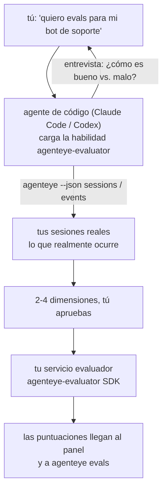

Pasa de *"creo que nuestro agente a veces falla"* a un servicio de puntuación desplegado, con tu agente de código tomando tanto las decisiones como haciendo la construcción. La **habilidad evaluadora de Observabilidad de Failproof AI** (`agenteye-evaluator`) es una *Agent Skill*: una pequeña carpeta de instrucciones que un agente de código como Claude Code o Codex carga bajo demanda. Le enseña al agente a determinar qué dimensiones de calidad vale la pena rastrear para *tu* agente, y luego escribir, probar y desplegar el [servicio evaluador](/es/agenteye/evaluation-suite) que las puntúa.

**No** es un puntuador alojado, un registro al que subes cosas, ni un sistema de plugins. Tu evaluador sigue siendo tu propio servicio HTTP en tu propia infraestructura, exactamente como se describe en la guía de la [Suite de evaluación](/es/agenteye/evaluation-suite). La habilidad solo le enseña a tu agente a construirlo bien, así que todo lo que hace, tú podrías hacerlo escribiendo el mismo código.

---

## La parte difícil es decidir qué puntuar

La superficie del SDK es pequeña — un decorador y dos modelos — y un agente puede escribirla a partir del [contrato](/es/agenteye/evaluation-suite#http-contract) solo. Ahí no es donde fallan los evaluadores. Fallan porque puntúan lo incorrecto, y un evaluador que puntúa lo incorrecto es peor que ninguno: produce un panel que todos aprenden a ignorar.

Así que la mayor parte de la habilidad es la etapa previa a que exista cualquier código. Le hace al agente entrevistarte (*"describe una ejecución que salió bien; ahora una que salió mal"*), luego extrae tus sesiones reales a través de la [CLI `agenteye`](/es/agenteye/cli) y las lee de principio a fin. Esas dos mitades generalmente no coinciden, y la brecha es el punto: lo que pretendes medir frente a lo que tus transcripciones pueden realmente soportar. Una dimensión solo sobrevive si es **computable** a partir de los eventos y **discriminante** — si puntúa 0,9 tanto en tu ejecución buena como en la mala, no enseña nada y se descarta.

Lo que se obtiene es una propuesta de 2 a 4 dimensiones con el razonamiento adjunto, para que lo apruebes antes de que se escriba una sola línea.



---

## Cómo se relaciona con las otras piezas de evaluación

Cuatro documentos cubren la puntuación, y se encadenan entre sí en orden:

| Página | Qué es | Úsala cuando |
|---|---|---|
| **[Evaluaciones](/es/agenteye/evaluations)** | La funcionalidad: puntuaciones en la cuadrícula de sesiones, paneles, re-evaluar | Quieres saber qué te aporta la puntuación automática |
| **[Suite de evaluación](/es/agenteye/evaluation-suite)** | El contrato HTTP, el SDK, las variables de entorno del servidor | Estás implementando o depurando el evaluador tú mismo |
| **Habilidad evaluadora** (este doc) | Una puerta de entrada en lenguaje natural para diseñar *y* construir el puntuador | Quieres ir de "quiero evals" a un servicio en marcha |
| **[Habilidad CLI](/es/agenteye/cli-skill)** | Una puerta de entrada en lenguaje natural para la CLI `agenteye` | Quieres *leer* las puntuaciones que ya tienes |
| **[Habilidad Python SDK](/es/agenteye/python-sdk-skill)** | Una puerta de entrada en lenguaje natural para instrumentar tu agente | Tu agente aún no emite sesiones — no hay nada que puntuar |

### vs. la habilidad CLI: construir vs. leer

Las dos habilidades están deliberadamente separadas, e instalar ambas es la configuración normal — el agente elige entre ellas según lo que le pidas:

- **`agenteye-evaluator`** (este doc) construye lo que *produce* puntuaciones. Su trabajo termina cuando las puntuaciones llegan por primera vez.
- **[`agenteye-cli`](/es/agenteye/cli-skill)** lee puntuaciones que ya existen (`agenteye evals`). *"¿Bajó la calidad esta semana?"* es su pregunta, no la de esta habilidad.

---

## Requisitos previos

1. **La CLI `agenteye` instalada e iniciada sesión** (`pipx install agenteye`, luego `agenteye login`). La habilidad la usa en dos momentos: para extraer las sesiones reales con las que diseña, y para confirmar que tus puntuaciones llegaron al final. Tu sesión necesita `events:read`, más `evaluations:read` para esa comprobación final. Al igual que con la habilidad CLI, **no puede** completar el inicio de sesión con código de un solo uso por correo electrónico en tu nombre.
2. **Un lugar donde vivir para el evaluador.** Se construye en una imagen y se ejecuta como un servicio de larga duración, así que necesita un repositorio real, no un archivo temporal. Los evaluadores suelen vivir en su propio repositorio, separado del agente que se está puntuando — la habilidad busca uno existente y pregunta antes de crear un scaffolding nuevo.
3. **El wheel del SDK `agenteye-evaluator`** — lee la siguiente sección antes de que tu agente empiece a escribir comandos `pip`.

---

## Dónde conseguirlo

La habilidad está publicada en la colección pública de habilidades de Failproof AI:

**[github.com/FailproofAI/skills](https://github.com/FailproofAI/skills)** → [`skills/agenteye-evaluator/`](https://github.com/FailproofAI/skills/tree/main/skills/agenteye-evaluator)

El repositorio es público y la habilidad no necesita credenciales propias — solo maneja la CLI `agenteye` con la sesión con la que *tú* iniciaste sesión, y escribe código en *tu* repositorio. Ten en cuenta que se distribuye como su propia carpeta y **no** está dentro del paquete `pipx install agenteye`, así que no la busques ahí.

## Instalando la habilidad

La forma más rápida es usar la CLI [`skills`](https://skills.sh), que descarga la carpeta y la coloca donde tu agente la busca:

```bash
# Claude Code, solo este proyecto
npx skills add FailproofAI/skills --skill agenteye-evaluator -a claude-code

# todos los proyectos (instala en ~/.claude/skills/)
npx skills add FailproofAI/skills --skill agenteye-evaluator -a claude-code -g --copy

# Codex en su lugar
npx skills add FailproofAI/skills --skill agenteye-evaluator -a codex
```

Luego adminístrala como cualquier otra habilidad:

```bash
npx skills list -a claude-code           # qué está instalado
npx skills update agenteye-evaluator     # descargar la última versión
npx skills remove agenteye-evaluator     # eliminarla
```

¿Prefieres instalar manualmente? Una Agent Skill es solo una carpeta que contiene un `SKILL.md` (más referencias opcionales), así que copiarla también funciona:

- **Claude Code**: coloca la carpeta `agenteye-evaluator/` en `~/.claude/skills/` (todos los proyectos) o `<tu-repo>/.claude/skills/` (solo ese repositorio). Claude Code la descubre automáticamente — verifícalo con la lista `/skills`, o simplemente pide evals.
- **Codex (OpenAI)**: Codex lee el mismo `SKILL.md`. El archivo `agents/openai.yaml` incluido establece `allow_implicit_invocation: true`, por lo que Codex selecciona automáticamente la habilidad cuando una tarea coincide; de lo contrario, invócala explícitamente como `$agenteye-evaluator`.

---

## El SDK no está en PyPI público

> **Advertencia:** Lee esto antes de dejar que un agente instale el SDK.

La habilidad es pública; el SDK que utiliza no lo es. `agenteye-evaluator` solo se distribuye como un artefacto de versión privada, y a diferencia de `agenteye`, el nombre está **sin reclamar en PyPI público** — así que un simple `pip install agenteye-evaluator` podría instalar el paquete de un desconocido en el servicio que lee tus transcripciones de producción. Eso es un problema de cadena de suministro, no un error tipográfico.

La habilidad lo sabe y en su lugar sigue una escalera de instalación, deteniéndose en el primer peldaño que aplique: la fuente del monorepo si estás dentro del repositorio AgentEye, de lo contrario el wheel de versión privada desde GitHub Releases (requiere acceso), y si ninguno es accesible **se detiene y te dice que pidas el wheel a tu contacto de Failproof AI** en lugar de improvisar.

Así que si tu agente propone un simple `pip install agenteye-evaluator` desde PyPI público, esa es la señal de que la habilidad nunca se cargó. Detente ahí y verifica que esté instalada.

---

## Qué puedes pedirle

Un ciclo completo real empieza con una solicitud vaga y termina con un diseño aprobado, no con código:

```text
tú    ▸ Quiero evals para nuestro bot de soporte. Creo que a veces falla.

agente▸ Antes de escribir nada: describe una ejecución que salió bien,
        y una que salió mal.

tú    ▸ Buena: responde desde la documentación. Mala: se inventa cosas,
        o se rinde y dice "contacta a soporte".

agente▸ Ejecutando: agenteye --json sessions --status error --since 7d
        Leyendo 5 sesiones, incluyendo dos que considerarías malas.

        Tus palabras dicen factualidad y evasión. Las transcripciones
        coinciden en evasión (2 de 5 terminan con un pase a soporte,
        y es claro en model_response.content), pero la factualidad
        necesita una verdad base que tus eventos no contienen.

        Así que puntuaría tres cosas:
          - deflection      reglas, barato, separa tus dos ejecuciones
          - tool_efficiency reglas, detecta el bucle de reintentos en run-004
          - groundedness    juez LLM: ¿cada afirmación está en los docs recuperados?

        "factuality" necesitaría una verdad base que no tenemos; groundedness
        es lo más cercano que tus transcripciones pueden realmente soportar.
        ¿De acuerdo con esos tres nombres? Renombrar después divide el historial.

tú    ▸ sí

agente▸ No hay evaluador en este repositorio. ¿Debería crear el scaffolding
        aquí, o tienes uno en otro lugar?
```

A partir de ahí escribe primero las dimensiones basadas en reglas (gratuitas, instantáneas, deterministas), las prueba contra una sesión real capturada incluyendo las vacías y las que nunca terminaron y que hacen fallar a los evaluadores ingenuos, y solo recurre a un juez LLM para la dimensión subjetiva. Conoce los [límites del despachador](/es/agenteye/evaluation-suite#configuring-the-server) — un tiempo de espera de solicitud de 30 s y 8 llamadas concurrentes en todo el despliegue — así que si el juez no cabe de forma fiable, va asíncrono con `JobPending` en lugar de dejar que tu juez sea cancelado y reintentado cinco veces a cinco veces el costo.

Luego despliega, establece las dos variables de entorno del servidor, y confirma con `agenteye --json evals --session-id <id>` que las puntuaciones realmente llegaron. Que lleguen las puntuaciones es la única prueba.

---

## Qué vigilar

- **Los nombres de dimensiones son casi permanentes.** Las claves de puntuación son cadenas arbitrarias y la plataforma muestra tendencias con lo que envíes, lo que significa que nada aguas abajo corrige una mala elección. Renombra después y el historial se divide: las sesiones antiguas conservan la clave antigua y la tendencia se rompe. Por eso la habilidad obtiene una aprobación explícita antes de escribir código — tómate ese paso en serio.
- **Los fixtures son transcripciones reales de producción.** Diseñar con sesiones reales implica descargarlas al disco, y pueden contener datos de clientes. La habilidad pregunta antes de hacer commit en git; en caso de duda, mantén `fixtures/` fuera del repositorio y que cada desarrollador descargue las suyas propias.
- **El agente escribe y despliega un servicio que lee cada transcripción.** Actúa como tú, limitado por los permisos de tu sesión de CLI, pero revisa el evaluador como cualquier otro código que toque datos de producción.

---

## Próximos pasos

- **[Suite de evaluación](/es/agenteye/evaluation-suite)**: el contrato HTTP, el SDK y las variables de entorno del servidor que configura la habilidad.
- **[Evaluaciones](/es/agenteye/evaluations)**: donde aparecen las puntuaciones una vez que llegan.
- **[Habilidad CLI](/es/agenteye/cli-skill)**: la habilidad hermana, para leer resultados en lugar de construir el puntuador.
- **[CLI](/es/agenteye/cli)**: la referencia de comandos detrás de los datos de sesión con los que la habilidad diseña.