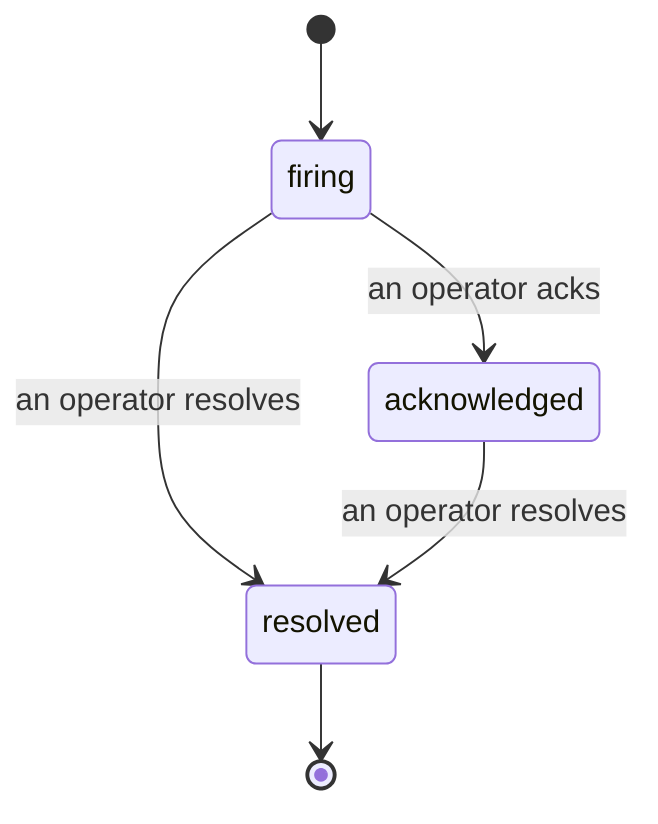

Cuando se dispara una alerta, la primera pregunta siempre es "¿quién lo está viendo?". Los incidentes responden esa pregunta: en el momento en que algo supera un umbral, todos pueden ver que el incidente está abierto, quién lo gestiona y exactamente qué ha ocurrido hasta ahora, con un registro limpio y atribuido que puedes entregar directamente a un post-mortem.

*La bandeja agrupa los incidentes abiertos por estado y filtra por severidad y responsable asignado, para que veas de inmediato qué requiere intervención humana.*

## Saber quién lo tiene, de un vistazo

Se acabó el "¿alguien está viendo esto?" en un hilo de chat. Una brecha abre automáticamente un incidente y lo coloca en una bandeja compartida, agrupada por estado. Reconócelo y tu nombre queda asociado, de modo que el resto del equipo sabe que está atendido. El reconocimiento es compartido: varios operadores pueden reconocer el mismo incidente y cada uno queda registrado individualmente, de manera que todo el equipo de guardia aparece por nombre en lugar de solaparse. Asigna un único responsable para el triaje y filtra la bandeja por severidad o asignado para ver solo lo que te corresponde.

## Toda la historia, en una sola línea de tiempo

Cuando el incidente termina, ya tienes el informe escrito. Abre cualquier incidente y encontrarás la evidencia de la brecha, sus asignados y suscriptores, un hilo de comentarios para coordinar en el mismo lugar y una línea de tiempo de actividad de solo anexo.

*Todo lo que ocurrió, en orden, cada línea firmada por quien lo hizo.*

Cada acción (apertura, reconocimiento, resolución, etc.) queda escrita en esa línea de tiempo y nunca se edita. Cada entrada está atribuida: al operador que la realizó, por correo electrónico, o a **automated** para cualquier acción que Failproof AI Observability ejecutó de forma autónoma, como abrir el incidente ante la brecha. Nada es anónimo y nada se pierde, por lo que el post-mortem prácticamente se escribe solo.

## Cómo avanza un incidente

- **Abierto (firing):** la brecha abre el incidente y notifica a tus canales una sola vez. Las brechas repetidas se integran en el mismo incidente y actualizan su evidencia en lugar de notificarte una y otra vez.
- **Reconocido (acknowledged):** un operador lo toma. Permanece abierto, y las brechas posteriores actualizan la evidencia de forma silenciosa.
- **Resuelto (resolved):** un operador lo cierra. La resolución automática al desaparecer la condición está planificada, pero aún no está habilitada, por lo que un incidente permanece abierto hasta que un humano lo resuelva — lo que mantiene la honestidad sobre lo que realmente se ha corregido. Más adelante puede abrirse un nuevo incidente sobre la misma alerta.

Una alerta mantiene como máximo un incidente abierto a la vez, por lo que una regla intermitente no puede enterrarte en duplicados. También puedes abrir un incidente manualmente: uno independiente para algo que ninguna alerta detectó, o uno vinculado a una alerta existente, si tienes el permiso `incidents:write`.

## Dónde encontrarlo

Los incidentes se encuentran en `/<org-slug>/incidents`. Para visualizarlos se necesita **`incidents:read`**; para abrir un incidente manual se necesita **`incidents:write`**; para reconocer, asignar, comentar y resolver se necesita **`incidents:ack`**. Las claves antiguas que tenían el permiso retirado `alerts:ack` siguen funcionando, ya que se reconoce como `incidents:ack`, por lo que tu rotación de guardia no necesita ser reemitida.

## Relacionado

- [Alertas](/es/agenteye/alerts): las reglas que abren estos incidentes cuando se supera un umbral.
- [Seguimiento de errores](/es/agenteye/error-tracking): ve todos los fallos en un solo lugar y promociona uno a alerta.
- [Auditorías](/es/agenteye/audits): el analista programado que detecta los fallos que ninguna regla estaba vigilando.