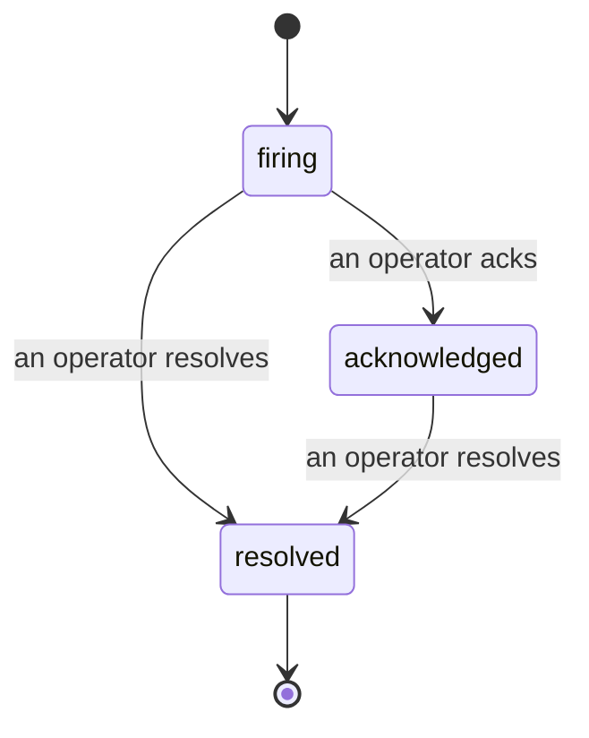

Cuando se activa una alerta, la primera pregunta siempre es «¿quién está en ello?». Los incidentes dan la respuesta: en el momento en que algo supera un umbral, todos pueden ver que el incidente está abierto, quién es el responsable y exactamente qué ha ocurrido hasta ahora, con un registro limpio y atribuido que puedes entregar directamente a una retrospectiva.

*La bandeja agrupa los incidentes abiertos por estado y filtra por severidad y responsable, para que veas de un vistazo qué necesita atención humana ahora mismo.*

## Saber quién lo tiene, de un vistazo

Se acabó el «¿alguien está mirando esto?» en un hilo de chat. Un umbral superado abre un incidente automáticamente y lo deposita en una bandeja compartida, agrupada por estado. Al reconocerlo, tu nombre queda registrado, de modo que el resto del equipo sabe que está atendido. El reconocimiento es compartido: varios operadores pueden confirmar el mismo incidente y cada uno queda registrado por separado, así que una sala de guerra completa aparece por nombre en lugar de pisarse unos a otros. Asigna un único responsable para el triaje y filtra la bandeja por severidad o responsable para quedarte solo con lo que es tuyo.

## Toda la historia, en una única línea de tiempo

Cuando el incidente termina, ya tienes el informe listo. Abre cualquier incidente y encontrarás la evidencia del umbral superado, sus responsables y suscriptores, un hilo de comentarios para coordinar en el mismo lugar y una línea de tiempo de actividad de solo adición.

*Todo lo que ocurrió, en orden, cada línea firmada por quien lo hizo.*

Cada acción (abierto, reconocido, resuelto, etc.) se escribe en esa línea de tiempo y nunca se edita. Cada entrada está atribuida: al operador que la realizó, por correo electrónico, o a **automated** para cualquier cosa que Failproof AI Observability haya hecho por su cuenta, como abrir el incidente al detectar el umbral superado. Nada es anónimo y nada se pierde, así que la retrospectiva prácticamente se escribe sola.

## Cómo avanza un incidente

- **Abierto (firing):** el umbral superado abre el incidente y notifica tus canales una sola vez. Los umbrales superados repetidos se agrupan en el mismo incidente y actualizan su evidencia en lugar de notificarte una y otra vez.
- **Reconocido:** un operador lo asume. Permanece abierto y los umbrales superados posteriores actualizan la evidencia de forma silenciosa.
- **Resuelto:** un operador lo cierra. La resolución automática al despejarse la condición está planificada pero aún no está habilitada, por lo que un incidente permanece abierto hasta que un humano lo resuelve, lo que mantiene la honestidad sobre qué se ha despejado realmente. Más adelante puede abrirse un nuevo incidente sobre la misma alerta.

Una alerta puede tener como máximo un incidente abierto a la vez, de modo que una regla inestable no puede sepultarte en duplicados. También puedes abrir un incidente manualmente: uno independiente para algo que ninguna alerta detectó, o uno vinculado a una alerta existente, si dispones del permiso `incidents:write`.

## Dónde encontrarlo

Los incidentes están disponibles en `/<org-slug>/incidents`. Para verlos se necesita **`incidents:read`**; para abrir un incidente manual se necesita **`incidents:write`**; para reconocer, asignar, comentar y resolver se necesita **`incidents:ack`**. Las claves antiguas que otorgaban el permiso retirado `alerts:ack` siguen funcionando, ya que se reconoce como `incidents:ack`, por lo que tu rotación de guardia no necesita ser reemitida.

## Relacionado

- [Alertas](/es/agenteye/alerts): las reglas que abren estos incidentes cuando se supera un umbral.
- [Seguimiento de errores](/es/agenteye/error-tracking): consulta todos los fallos en un único lugar y promueve uno a alerta.
- [Auditorías](/es/agenteye/audits): el analista programado que encuentra los fallos que ninguna regla estaba vigilando.