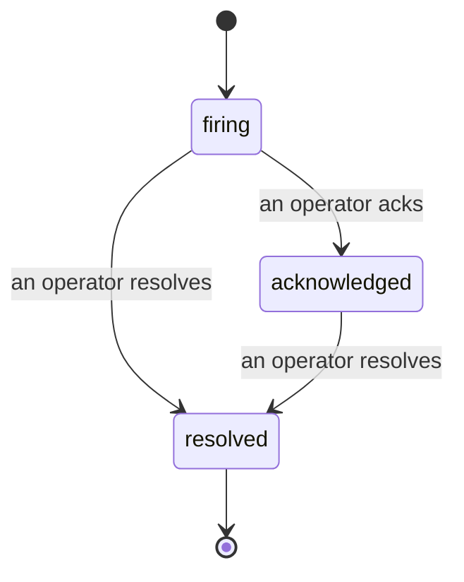

Cuando se dispara una alerta, la primera pregunta siempre es «¿quién lo está viendo?» Los incidentes responden esa pregunta: en el momento en que algo supera un umbral, todos pueden ver que el incidente está abierto, quién lo gestiona y exactamente qué ha ocurrido hasta ese punto, con un registro limpio y atribuido que puedes entregar directamente a una revisión post-mortem.

*La bandeja de entrada agrupa los incidentes abiertos por estado y permite filtrar por gravedad y responsable, para que veas de inmediato qué necesita atención humana.*

## Saber quién lo tiene, de un vistazo

Se acabó el «¿alguien está mirando esto?» en un hilo de chat. Una brecha abre un incidente automáticamente y lo coloca en una bandeja de entrada compartida, agrupado por estado. Confírmalo y tu nombre queda asignado, para que el resto del equipo sepa que está gestionado. La confirmación es compartida: varios operadores pueden confirmar el mismo incidente y cada uno queda registrado de forma individual, de modo que todo un equipo de guardia aparece por nombre sin pisarse unos a otros. Asigna un único responsable para el triaje, y filtra la bandeja de entrada por gravedad o responsable para reducirla a lo que te corresponde.

## Toda la historia, en una única línea de tiempo

Cuando el incidente termina, ya tienes el informe listo. Abre cualquier incidente y obtendrás la evidencia de la brecha, sus responsables y suscriptores, un hilo de comentarios para coordinar en el lugar, y una línea de tiempo de actividad de solo adición.

*Todo lo que ocurrió, en orden, cada línea firmada por quien lo hizo.*

Cada acción (apertura, confirmación, resolución, etc.) se escribe en esa línea de tiempo y jamás se edita. Cada entrada está atribuida: al operador que la realizó, por correo electrónico, o a **automated** para todo lo que Failproof AI Observability hizo de forma autónoma, como abrir el incidente en la brecha. Nada es anónimo y nada se pierde, por lo que el post-mortem prácticamente se escribe solo.

## Cómo progresa un incidente

- **Abierto (firing):** la brecha abre el incidente y notifica a tus canales una sola vez. Las brechas repetidas se consolidan en el mismo incidente y actualizan su evidencia en lugar de notificarte una y otra vez.
- **Confirmado (acknowledged):** un operador lo toma. Permanece abierto y las brechas posteriores actualizan la evidencia de forma silenciosa.
- **Resuelto (resolved):** un operador lo cierra. La resolución automática al desaparecer la condición está planificada pero aún no habilitada, por lo que un incidente permanece abierto hasta que un humano lo resuelva — lo que garantiza honestidad sobre lo que realmente se ha solucionado. Un nuevo incidente puede abrirse sobre la misma alerta más adelante.

Una alerta tiene como máximo un incidente abierto a la vez, por lo que una regla inestable no puede sepultarte en duplicados. También puedes abrir un incidente manualmente: uno independiente para algo que ninguna alerta detectó, o uno vinculado a una alerta existente, si tienes el permiso `incidents:write`.

## Dónde encontrarlo

Los incidentes se encuentran en `/<org-slug>/incidents`. Para consultarlos se necesita **`incidents:read`**; para abrir un incidente manual se necesita **`incidents:write`**; para confirmar, asignar, comentar y resolver se necesita **`incidents:ack`**. Las claves antiguas que otorgaban el permiso retirado `alerts:ack` siguen funcionando, ya que se reconoce como `incidents:ack`, por lo que tu rotación de guardia no necesita ser reemitida.

## Relacionado

- [Alertas](/es/agenteye/alerts): las reglas que abren estos incidentes cuando se supera un umbral.
- [Seguimiento de errores](/es/agenteye/error-tracking): consulta todos los fallos en un solo lugar y promociónalo a una alerta.
- [Auditorías](/es/agenteye/audits): el analista programado que encuentra los fallos que ninguna regla estaba vigilando.