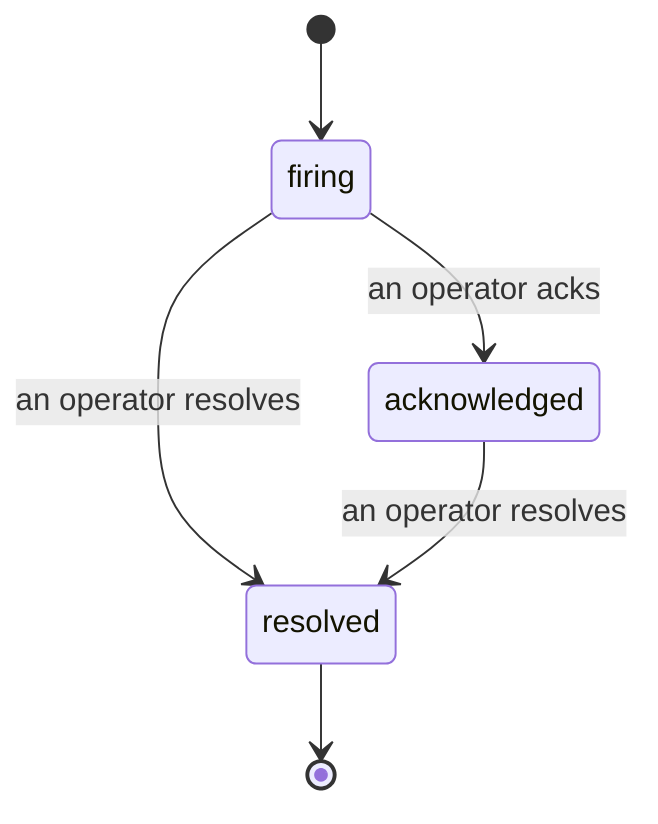

Cuando se dispara una alerta, la primera pregunta siempre es "¿quién lo está viendo?". Los incidentes responden esa pregunta: en el momento en que algo supera un umbral, todos pueden ver que el incidente está abierto, quién es el responsable y exactamente qué ha ocurrido hasta ese momento, con un registro limpio y atribuido que puedes entregar directamente a una retrospectiva.

*La bandeja agrupa los incidentes abiertos por estado y filtra por severidad y responsable, para que veas de un vistazo qué requiere atención humana ahora mismo.*

## Saber quién lo tiene, de un vistazo

Nada de "¿alguien está mirando esto?" en un hilo de chat. Una brecha abre un incidente automáticamente y lo deposita en una bandeja compartida, agrupada por estado. Reconócelo y tu nombre aparece en él, para que el resto del equipo sepa que está atendido. El reconocimiento es compartido: varios operadores pueden reconocer el mismo incidente y cada uno queda registrado por separado, de modo que un equipo de respuesta completo aparece por nombre en lugar de pisarse unos a otros. Asigna un único responsable para el triaje y filtra la bandeja por severidad o responsable para quedarte solo con lo que es tuyo.

## Toda la historia, en una única línea de tiempo

Cuando el incidente termina, ya tienes el informe. Abre cualquier incidente y encontrarás la evidencia de la brecha, sus responsables y suscriptores, un hilo de comentarios para coordinarse en el propio incidente, y una línea de tiempo de actividad de solo adición.

*Todo lo que ocurrió, en orden, con cada línea firmada por quien lo hizo.*

Cada acción (abierto, reconocido, resuelto, etc.) queda escrita en esa línea de tiempo y nunca se edita. Cada entrada está atribuida: al operador que la realizó, por correo electrónico, o a **automated** para cualquier cosa que Failproof AI Observability haya hecho de forma autónoma, como abrir el incidente al detectar la brecha. Nada es anónimo y nada se pierde, por lo que la retrospectiva prácticamente se escribe sola.

## Cómo avanza un incidente

- **Abierto (firing):** la brecha abre el incidente y notifica a tus canales una sola vez. Las brechas repetidas se acumulan en el mismo incidente y actualizan su evidencia en lugar de notificarte una y otra vez.
- **Reconocido (acknowledged):** un operador lo toma. Permanece abierto y las brechas posteriores actualizan la evidencia de forma silenciosa.
- **Resuelto (resolved):** un operador lo cierra. La resolución automática cuando la condición se despeja está planificada pero aún no está habilitada, por lo que un incidente permanece abierto hasta que un humano lo resuelva, lo que mantiene a todos honestos sobre qué se ha resuelto realmente. Un nuevo incidente puede abrirse sobre la misma alerta más adelante.

Una alerta tiene como máximo un incidente abierto a la vez, de modo que una regla inestable no puede sepultarte en duplicados. También puedes abrir un incidente manualmente: uno independiente para algo que ninguna alerta detectó, o uno vinculado a una alerta existente, si tienes `incidents:write`.

## Dónde encontrarlo

Los incidentes se encuentran en `/<org-slug>/incidents`. Para verlos se necesita **`incidents:read`**; para abrir un incidente manual se necesita **`incidents:write`**; reconocer, asignar, comentar y resolver requieren **`incidents:ack`**. Las claves antiguas que otorgaban el permiso retirado `alerts:ack` siguen funcionando, ya que se respeta como `incidents:ack`, por lo que no es necesario reemitir las credenciales de tu rotación de guardia.

## Relacionados

- [Alertas](/es/agenteye/alerts): las reglas que abren estos incidentes cuando se supera un umbral.
- [Seguimiento de errores](/es/agenteye/error-tracking): ve todos los fallos en un solo lugar y promociona uno a alerta.
- [Auditorías](/es/agenteye/audits): el analista programado que encuentra los fallos que ninguna regla estaba vigilando.