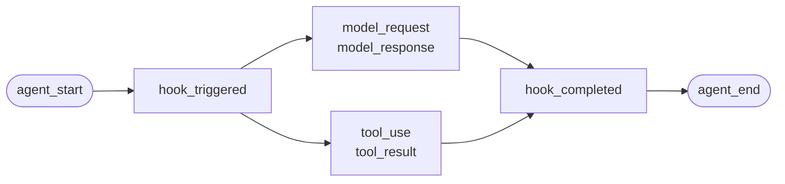
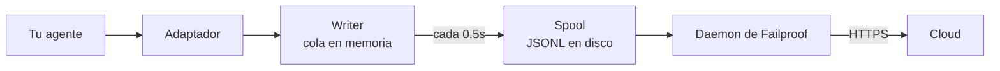

Para un agente que escribiste tú mismo, o un framework para el que Failproof AI no tiene adaptador. No hay nada que instrumentar: tú emites los eventos.

Esta es la misma API que los cuatro adaptadores de framework utilizan internamente. Son tablas de traducción sobre ella.

## Instalación

```bash
pip install failproofai-sdk
```

Sin extras ni dependencias.

## Instrumentación

```python
import failproofai_sdk

failproofai_sdk.configure(environment="production")

with failproofai_sdk.session():                 # una ejecución
    with failproofai_sdk.agent("planner"):      # una unidad de trabajo
        with failproofai_sdk.tool_call("search", input={"q": q}) as t:
            t.output = search(q)                # una llamada a herramienta
```

Léelo de arriba a abajo y verás lo que significa:

| Envuélvelo en | Para indicar |
| --- | --- |
| `session()` | Estos eventos pertenecen a la misma ejecución |
| `agent()` | Algo está haciendo trabajo — dale un nombre que reconocerías en una lista |
| `tool_call()` | Esta es una herramienta, y esto es lo que devolvió |

Y lo que cada uno emite realmente:

| Ámbito | Emite | Propósito |
| --- | --- | --- |
| `session()` | Nada | Vincula un id de sesión, agrupando una ejecución |
| `agent()` | `agent_start`, `agent_end` | Delimita una unidad de trabajo |
| `tool_call()` | `tool_use`, `tool_result` | Delimita una herramienta y la mide |

Todo lo que esté dentro puede omitir `session_id` y `agent_id`. Los ámbitos vinculan la identidad en variables de contexto y cada llamada a evento la lee de vuelta, por lo que nunca necesitas pasar ids a través de tus funciones.

Los tres funcionan tanto con `async with` como con `with`.

Anidar agentes construye el árbol. `parent_id` y la profundidad se calculan desde la pila:

```python
with failproofai_sdk.session():
    with failproofai_sdk.agent("supervisor"):
        with failproofai_sdk.agent("researcher"):    # parent_id = "supervisor"
            ...
```

## Cómo se cierra un ámbito

`agent()` gestiona las excepciones por ti:

| Qué ocurrió | Eventos | Resultado |
| --- | --- | --- |
| No se lanzó nada | `agent_end` | `success` |
| `Exception` | `error`, luego `agent_end` | `failed` |
| `KeyboardInterrupt`, `SystemExit` | `error`, luego `agent_end` | `failed` |
| `CancelledError`, `GeneratorExit` | solo `agent_end` | `cancelled` |

El error se emite antes de `agent_end`, porque el panel cierra el span en `agent_end` y cualquier cosa posterior no se atribuye a nada. Una cancelación no es un fallo, por lo que las ejecuciones canceladas no contaminan la superficie de errores. La excepción siempre se relanza: un ámbito nunca la suprime.

## Los métodos de evento

Quince métodos en seis familias. La mayoría vienen en pares: emites el abridor, luego el cierre, y el SDK mide el span entre ellos.

| Familia | Abre | Cierra | Independiente |
| --- | --- | --- | --- |
| **Agentes** | `agent_start` | `agent_end` | — |
| | `agent_pause` | `agent_resume` | — |
| **Modelos** | `model_request` | `model_response` | — |
| **Herramientas** | `tool_use` | `tool_result` | — |
| **Hooks** | `hook_triggered` | `hook_completed` | — |
| **Humanos** | `human_wait` | `human_input` | `human_pause`, `human_interrupt` |
| **Fallos** | — | — | `error` |

<Tip>
  Prefiere los ámbitos — `agent()` y `tool_call()` — donde encajen. Garantizan el evento de cierre incluso cuando el cuerpo lanza una excepción. Recurre a estos métodos directamente cuando tu flujo de control no se anida, como una llamada a modelo dentro de un helper.
</Tip>

<CodeGroup>
```python Agents
failproofai_sdk.event.agent_start(agent_id="planner", goal="find the cheapest flight")
failproofai_sdk.event.agent_end(agent_id="planner", outcome="success", summary="...")
failproofai_sdk.event.agent_pause(pause_id="p1", reason="awaiting approval")
failproofai_sdk.event.agent_resume(pause_id="p1")
```

```python Models
failproofai_sdk.event.model_request(
    model="gpt-4o-mini",
    messages=[{"role": "user", "content": "..."}],
    request_id="req-1",
)
failproofai_sdk.event.model_response(
    model="gpt-4o-mini",
    content="...",
    input_tokens=139,
    output_tokens=21,
    request_id="req-1",
    duration_ms=5202,
)
```

```python Tools
failproofai_sdk.event.tool_use(tool_name="search", tool_call_id="c1", input={"q": "..."})
failproofai_sdk.event.tool_result(tool_name="search", tool_call_id="c1", output="...")
```

```python Hooks
failproofai_sdk.event.hook_triggered(hook_name="retrieve", hook_id="h1", trigger_event="node")
failproofai_sdk.event.hook_completed(hook_name="retrieve", hook_id="h1", outcome="success")
```

```python Humans
failproofai_sdk.event.human_wait(input_id="i1", prompt="Approve?", options=["yes", "no"])
failproofai_sdk.event.human_input(input_id="i1", response="yes")
failproofai_sdk.event.human_pause(reason="operator paused the run", user_id="dana")
failproofai_sdk.event.human_interrupt(reason="operator stopped the run", at_step="step_3")
```

```python Failures
failproofai_sdk.event.error(
    error_type="TimeoutError",
    message="provider timed out after 30s",
    traceback="...",
)
```
</CodeGroup>

<Note>
  **Las dos familias de humanos apuntan en direcciones opuestas.**

  | Métodos | Significado |
  | --- | --- |
  | `human_wait` / `human_input` | El **agente le preguntó a una persona** — una puerta de aprobación, una pregunta aclaratoria |
  | `human_pause` / `human_interrupt` | Una **persona actuó sobre el agente** — un botón de parada, una pausa de operador |

  Ningún framework señaliza el segundo par, por lo que siempre es tuya la responsabilidad de emitirlo.
</Note>

<Warning>
  **Pasa `request_id` cuando las llamadas al modelo se ejecuten de forma concurrente.** Sin él, las solicitudes y respuestas se emparejan en orden de llegada por agente, y las llamadas concurrentes se emparejan incorrectamente, asociando cada respuesta con la solicitud equivocada.
</Warning>

## Ejemplo

Un bucle de llamada a herramientas contra la API de OpenAI, sin ningún framework de agentes:

```python
import json

import failproofai_sdk
from openai import OpenAI

failproofai_sdk.configure(environment="production")
client = OpenAI()
MODEL = "gpt-4o-mini"


def turn(messages: list):
    """Una llamada al modelo, delimitada por el par."""
    failproofai_sdk.event.model_request(model=MODEL, messages=messages)
    reply = client.chat.completions.create(model=MODEL, messages=messages, tools=TOOLS)
    usage = reply.usage
    failproofai_sdk.event.model_response(
        model=MODEL,
        content=reply.choices[0].message.content or "",
        input_tokens=usage.prompt_tokens,
        output_tokens=usage.completion_tokens,
    )
    return reply.choices[0].message


with failproofai_sdk.session():
    with failproofai_sdk.agent("inventory", goal="price report"):
        for _ in range(4):          # acotado; un bucle de agente sin límite es un bug propio
            message = turn(messages)
            if not message.tool_calls:
                break
            messages.append(message.model_dump(exclude_none=True))
            for call in message.tool_calls:
                args = json.loads(call.function.arguments or "{}")
                with failproofai_sdk.tool_call(
                    call.function.name, tool_call_id=call.id, input=args
                ) as handle:
                    handle.output = run_tool(call.function.name, args)
                messages.append({
                    "role": "tool",
                    "tool_call_id": call.id,
                    "content": str(handle.output),
                })
```

Esto produce los mismos seis tipos de eventos que te daría un adaptador. La versión
ejecutable completa, con las definiciones de herramientas, se incluye en el repositorio del SDK bajo
`docs/manual/examples/`.

## Hilos y async

Las variables de contexto se propagan automáticamente a las tareas de asyncio. No se propagan a nuevos hilos, porque un hilo comienza con un contexto vacío.

```python
# asyncio: nada que hacer
async with failproofai_sdk.session():
    await asyncio.gather(worker(1), worker(2))

# hilos: envuelve el callable
pool.submit(failproofai_sdk.propagate(work), x)
threading.Thread(target=failproofai_sdk.propagate(work)).start()
loop.run_in_executor(None, failproofai_sdk.propagate(work), x)
```

Sin `propagate()`, los eventos del worker lanzan un `TypeError` que indica la corrección en lugar de terminar sin sesión. Esto es deliberado: un evento sin sesión es omitido por el ingest y respondido con `200`, que es el fallo silencioso que la capa de identidad existe para prevenir.

## Instrumentar un framework sin adaptador

Cada framework de agentes te ofrece los mismos tres puntos de enganche. Mapéalos y tendrás una traza completa — los cuatro adaptadores incluidos no hacen nada más que esto.

| El punto de enganche | Lo que escribes | Lo que resulta |
| --- | --- | --- |
| La ejecución | `session()` + `agent()` | `agent_start`, `agent_end` |
| Cada herramienta | `tool_call()` | `tool_use`, `tool_result` |
| Cada llamada al modelo | El par `model_*` | `model_request`, `model_response` |

<Steps>
  <Step title="Delimita la ejecución">
    ```python
    with failproofai_sdk.session():
        with failproofai_sdk.agent(agent_name, goal=task):
            result = framework.run(task)
    ```
  </Step>
  <Step title="Delimita cada herramienta">
    En lo que el framework llame wrapper de herramienta o middleware.

    ```python
    with failproofai_sdk.tool_call(name, input=args) as call:
        call.output = original(**args)
    ```
  </Step>
  <Step title="Empareja cada llamada al modelo">
    ```python
    failproofai_sdk.event.model_request(model=model, messages=messages)
    reply = provider.complete(...)
    failproofai_sdk.event.model_response(
        model=model,
        content=text,
        input_tokens=usage.prompt_tokens,
        output_tokens=usage.completion_tokens,
    )
    ```
  </Step>
</Steps>

<Tip>
  **¿Tienes un límite de nodo, paso o middleware que vale la pena ver?** Envuélvelo en un par de hooks — `hook_triggered` / `hook_completed` — no en un `agent()` anidado. `agent_id` es una faceta de baja cardinalidad, y una entrada por nodo la satura. Los spans de hooks se renderizan igual y te dan latencia por nodo.
</Tip>

<Note>
  **Manual y automático se combinan.** Un adaptador que se ejecuta dentro de un ámbito escrito a mano se une a esa sesión y se convierte en hijo de ese agente, de modo que obtienes un único árbol en lugar de dos — útil cuando instrumentas un framework tú mismo junto a uno soportado.
</Note>

<Accordion title="Por qué no hay adaptador para AutoGen">
  Dos razones, y los tres puntos de enganche anteriores son la respuesta a ambas:

  - `autogen-core` no tiene mantenimiento desde septiembre de 2025.
  - AG2 no expone ningún punto de registro a nivel de proceso equivalente a los hooks de los otros frameworks, por lo que instrumentarlo significa envolver cada agente en cada punto de construcción.

  Mapear los puntos de enganche a mano registra los mismos eventos, con la misma fidelidad, que un adaptador incluido.
</Accordion>

## Profundizando

Cómo funciona la grabación realmente. Nada de esto es necesario para empezar.

<AccordionGroup>

<Accordion title="Cómo se ve una grabación, por framework" icon="eye">

Toda grabación tiene la misma forma: un span se abre, el trabajo se anida dentro, y cada evento de apertura recibe uno de cierre.



El **par** es la unidad. Cada evento de cierre lleva una duración que el SDK mide desde el de apertura.

A continuación se muestra una ejecución real por framework — capturada de los ejemplos que se incluyen con el SDK, con el nombre del modelo normalizado. Fíjate en cuánto se obtiene de una sola llamada.

<Tabs>
  <Tab title="LangGraph">
    ```text 14 eventos
     1  +0.000s  agent_start       LangGraph
     2  +0.001s    hook_triggered  agent
     3  +0.002s      model_request   gpt-4o-mini
     4  +3.023s      model_response  gpt-4o-mini · 21 out-tok
     5  +3.024s    hook_completed  agent
     6  +3.024s    hook_triggered  tools
     7  +3.025s      tool_use      word_count
     8  +3.025s      tool_result   word_count · ok
     9  +3.025s    hook_completed  tools
    10  +3.026s    hook_triggered  agent
    11  +3.027s      model_request   gpt-4o-mini
    12  +5.717s      model_response  gpt-4o-mini · 5 out-tok
    13  +5.720s    hook_completed  agent
    14  +5.721s  agent_end         LangGraph · success
    ```

    Los nodos se convierten en pares de hooks, por lo que obtienes latencia por nodo sin que saturen la lista de agentes.
  </Tab>

  <Tab title="CrewAI">
    ```text 10 eventos
     1  +0.000s  agent_start       crew
     2  +0.050s    agent_start     analyst · under crew
     3  +0.057s      model_request   gpt-4o-mini
     4  +3.475s      model_response  gpt-4o-mini · 19 out-tok
     5  +3.478s      tool_use      lookup_metric
     6  +3.478s      tool_result   lookup_metric · ok
     7  +3.486s      model_request   gpt-4o-mini
     8  +5.694s      model_response  gpt-4o-mini · 9 out-tok
     9  +5.727s    agent_end       analyst · success
    10  +5.739s  agent_end         crew · success
    ```

    El `role` de cada agente se convierte en su nombre de span, por lo que la latencia y el gasto en tokens se desglosan por rol.
  </Tab>

  <Tab title="LlamaIndex">
    ```text 26 eventos
     1  +0.000s  agent_start       Agent
     2  +0.001s    hook_triggered  init_run
     4  +0.501s    hook_triggered  setup_agent
     6  +0.503s    hook_triggered  run_agent_step
     7  +0.505s      model_request   gpt-4o-mini
     8  +3.083s      model_response  gpt-4o-mini · 18 out-tok
    10  +3.197s    hook_triggered  parse_agent_output
    12  +3.355s    hook_triggered  call_tool
    13  +3.355s      tool_use      city_population
    14  +3.355s      tool_result   city_population · ok
    16  +3.356s    hook_triggered  aggregate_tool_results
       ...                        segunda iteración
    26  +7.038s  agent_end         Agent · success
    ```

    El propio bucle del agente es visible, no solo sus llamadas al modelo.
  </Tab>

  <Tab title="Pydantic AI">
    ```text 8 eventos
    1  +0.000s  agent_start       agent
    2  +0.001s    model_request   gpt-4o-mini
    3  +4.413s    model_response  gpt-4o-mini · 17 out-tok
    4  +4.415s    tool_use        population
    5  +4.415s    tool_result     population · ok
    6  +4.416s    model_request   gpt-4o-mini
    7  +8.118s    model_response  gpt-4o-mini · 6 out-tok
    8  +8.119s  agent_end         agent · success
    ```

    Sin pares de hooks: Pydantic AI no tiene límite de nodo o paso que delimitar.
  </Tab>

  <Tab title="Custom agents">
    ```text 6 eventos
    1  +0.000s  agent_start       main
    2  +0.000s    tool_use        population
    3  +0.000s    tool_result     population · ok
    4  +0.000s    model_request   gpt-4o-mini
    5  +0.000s    model_response  gpt-4o-mini · 3 out-tok
    6  +0.000s  agent_end         main · success
    ```

    Los emites tú mismo. Los mismos tipos de eventos, la misma fidelidad — te cuesta los puntos de llamada.
  </Tab>
</Tabs>

</Accordion>

<Accordion title="Cómo empieza y termina una sesión" icon="circle-play">

**No existe un evento de fin de sesión.** Una sesión no es algo que cierras — es un grupo de eventos que comparten un `session_id`.

El estado se deriva de la forma de la traza:

| Estado | Cuándo |
| --- | --- |
| `ongoing` | Al menos un span sigue abierto |
| `paused` | Un `agent_pause` no tiene un `agent_resume` correspondiente |
| `error` | Nada está abierto y al menos un evento falló |
| `done` | Nada está abierto y nada falló |

Por tanto, una sesión termina cuando todos los pares están cerrados. Los adaptadores emiten `agent_end` por ti, y al finalizar cierran todo lo que siga abierto y lo marcan como incompleto — una ejecución que se interrumpió se resuelve como `done` con un hueco visible en lugar de quedar colgada.

<Note>
  Por eso una sesión puede abarcar dos llamadas. Un `interrupt()` de LangGraph pausa la ejecución, el span raíz permanece deliberadamente abierto, y la llamada de reanudación lo cierra. Ambas llamadas son una sola sesión.
</Note>

</Accordion>

<Accordion title="Identidad: session_id, agent_id, y quién los genera" icon="fingerprint">

`session_id` y `agent_id` son opcionales en todos los métodos de evento. Si se omiten, se resuelven desde el ámbito que los contiene:

```python
with failproofai_sdk.session():
    with failproofai_sdk.agent("planner"):
        failproofai_sdk.event.tool_use(tool_name="search", tool_call_id="c1")
```

Pasarlos explícitamente también funciona y tiene precedencia. Si no hay nada vinculado ni nada pasado, la llamada lanza un `TypeError` que indica la corrección en lugar de emitir un evento sin sesión, que el ingest omitiría respondiendo con `200`.

Los ámbitos vinculan la identidad en variables de contexto. Estas se propagan automáticamente a las tareas de asyncio pero no a los nuevos hilos — envuelve un worker en `failproofai_sdk.propagate()`.

#### Quién genera cada id

| Id | Generado por | Notas |
| --- | --- | --- |
| `session_id` | Tú, o el SDK | `session("chat-42")` se usa tal cual; si se omite, el SDK genera un `uuid4().hex` |
| `agent_id` | Tú, o el framework | De `agent("analyst")`, un `role` de CrewAI, un `FunctionAgent.name`. Un valor con aspecto de UUID es rechazado y reemplazado |
| `tool_call_id`, `hook_id`, `request_id` | Tú, o el framework | Los adaptadores reutilizan los ids de ejecución propios del framework, por eso los pares sobreviven a los saltos entre hilos |
| **Id de evento** | **Cloud, en el ingest** | El SDK no emite ninguno |
| **`dedup_key`** | **Cloud, en el ingest** | Un hash de org, sesión, timestamp, tipo y payload. Esta es la identidad real — hace que un lote reintentado colapse en lugar de duplicarse |

#### Cómo los adaptadores resuelven `session_id`

Gana la primera coincidencia:

1. Una opción `session_id` explícita
2. Metadatos por llamada
3. El ámbito `session()` que lo contiene
4. Metadatos del framework
5. El id de ejecución propio del framework

Nunca se inventa mientras exista alguna de esas — un id sintetizado dividiría una ejecución en varias sesiones.

#### Mantén `agent_id` con baja cardinalidad

Es la faceta principal en todas las superficies del panel, y una columna `LowCardinality(String)`. Un valor por ejecución degrada la columna y llena el desplegable de filtros con una entrada por ejecución.

Los adaptadores protegen esa columna por ti:

| Lo que entrega el framework | Registrado como | Por qué |
| --- | --- | --- |
| `3f9a1c2b-…` (un UUID) | `main` | No hay nada legible que conservar |
| Una cadena hexadecimal larga | `main` | Igual |
| `agent-3f9a1c2b-…` | `agent` | Se elimina el id por ejecución, se conserva la parte legible |
| `agent-v2` | `agent-v2` | Los segmentos cortos se dejan tal cual |
| `step-3` | `step-3` | Igual |

El id real se conserva en `fw_agent_id` / `fw_run_id`, donde sigue siendo consultable sin ser una faceta.

<Warning>
  **Esta protección solo afecta a las etiquetas que eligió el *framework*.** Un `agent_id` que pasas tú mismo — a `event.*`, o a `failproofai_sdk.agent(...)` — se registra exactamente como se dio. Reescribir silenciosamente un argumento explícito sería peor que la cardinalidad que previene, así que nombra tus propios spans en consecuencia.
</Warning>

</Accordion>

<Accordion title="Tipos de eventos agrupados — y qué registra cada framework" icon="table">

| Grupo | Eventos |
| --- | --- |
| Agentes | `agent_start`, `agent_end`, `agent_pause`, `agent_resume` |
| Modelos | `model_request`, `model_response` |
| Herramientas | `tool_use`, `tool_result` |
| Hooks | `hook_triggered`, `hook_completed` |
| Humanos | `human_wait`, `human_input`, `human_pause`, `human_interrupt` |
| Fallos | `error` |

Qué registra cada framework, medido desde las ejecuciones anteriores:

| Evento | LangGraph | CrewAI | LlamaIndex | Pydantic AI | Custom |
| --- | :--: | :--: | :--: | :--: | :--: |
| Inicio y fin de agente | Sí | Sí | Sí | Sí | Tú |
| Solicitud y respuesta de modelo | Sí | Sí | Sí | Sí | Tú |
| Uso y resultado de herramienta | Sí | Sí | Sí | Sí | Tú |
| Hook disparado y completado | Nodo | Tarea | Paso | — | Tú |
| Error | Sí | Sí | Sí | Sí | Automático |
| Espera e input humano | Sí | Sí | Sí | — | Tú |
| Pausa y reanudación de agente | Sí | Sí | Sí | — | Tú |

Un guion indica que el framework no tiene ese concepto. `human_pause` y `human_interrupt` describen a una *persona* actuando sobre el agente, algo que ningún framework señaliza — emítelos tú mismo.

</Accordion>

<Accordion title="Pares, correlación y duración" icon="link">

Un evento nunca llega solo. Uno abre un span, otro lo cierra, y el evento de cierre lleva una duración que el SDK mide desde el de apertura.

| Abre | Cierra | El evento de cierre lleva |
| --- | --- | --- |
| `agent_start` | `agent_end` | `outcome`, `summary` |
| `model_request` | `model_response` | tokens, `stop_reason`, latencia |
| `tool_use` | `tool_result` | `output` o `error`, duración |
| `hook_triggered` | `hook_completed` | `outcome`, duración |
| `agent_pause` | `agent_resume` | cuánto duró la pausa |
| `human_wait` | `human_input` | la respuesta y cuánto tardó la persona |

<Warning>
  Un evento de apertura sin uno de cierre es un span que nunca termina. La sesión se muestra como aún en ejecución, para siempre, y su duración activa sigue creciendo. Este es el modo de fallo que hay que vigilar cuando se instrumenta a mano.
</Warning>

#### Reglas de correlación

- Reutiliza el mismo `tool_call_id`, `hook_id`, `pause_id` o `input_id` para el evento de completado correspondiente.
- El SDK calcula `duration_ms` para `tool_result`, `hook_completed`, `agent_resume` y `human_input`. Pasarlo a esos métodos lanza `ValueError`.
- `duration_ms` **sí** se acepta en `model_response`, porque solo el llamador conoce la latencia real del proveedor. Debe ser un entero — un float lanza `ValueError` en el punto de llamada, porque el servidor lee la columna como un entero de 32 bits sin signo y almacenaría NULL para cualquier otro valor.
- Las claves de correlación tienen ámbito por tipo y sesión, por lo que una llamada a herramienta y un hook pueden compartir un id sin problemas, y dos sesiones concurrentes pueden reutilizar los mismos ids sin colisionar. No tienen ámbito por agente: un par abierto bajo un agente y cerrado bajo otro sigue correlacionando, que es el caso habitual en frameworks multi-agente.
- `request_id` empareja `model_request` con `model_response`. Sin él, los eventos de modelo se emparejan en orden por agente, por lo que las llamadas concurrentes se emparejan incorrectamente.
- Un par dividido entre procesos sigue correlacionando en destino, pero el SDK no puede calcular su duración en proceso.
- El mapa de pendientes almacena como máximo 10.000 inicios y desaloja la entrada más antigua cuando se llena.

</Accordion>

<Accordion title="Qué hay en el paquete, y cómo instrument() encuentra tu framework" icon="box">

Instalar `failproofai-sdk` instala todo, los cuatro adaptadores incluidos. Los extras incorporan el **framework**, no el adaptador.

```python
import failproofai_sdk        # no carga nada fuera de la biblioteca estándar
failproofai_sdk.instrument()  # importa solo los adaptadores que realmente necesitas
```

`import failproofai_sdk` es contractualmente sin dependencias, verificado por un test que instala la wheel compilada con `--no-deps` y otro que demuestra que ningún framework llega a `sys.modules`.

<Warning>
  No existe el atributo `failproofai_sdk.crewai`. Los adaptadores no se exponen deliberadamente en el paquete de nivel superior: acceder a uno importaría el framework como efecto secundario del acceso al atributo, rompiendo la promesa de cero dependencias. Usa `instrument()`.
</Warning>

```python
failproofai_sdk.instrument()              # todos los frameworks ya importados
failproofai_sdk.instrument("crewai")      # exactamente uno, por nombre
failproofai_sdk.uninstrument("crewai")    # deshacerlo
```

| Nombre | También acepta |
| --- | --- |
| `langchain` | `langgraph`, `langchain_core` |
| `crewai` | — |
| `llama_index` | `llamaindex`, `llama-index` |
| `pydantic_ai` | `pydantic-ai`, `pydanticai` |

La detección automática lee `sys.modules`, no la lista de paquetes instalados, por lo que un framework que tienes instalado pero nunca has importado no se instrumenta y nunca se importa en tu nombre. Para ver qué está conectado:

```python
from failproofai_sdk.integrations import active, available

available()   # ('crewai', 'langchain', 'llama_index', 'pydantic_ai')
active()      # ('langchain',)
```

<Note>
  **`instrument("crewai")` en una máquina sin CrewAI no lanza una excepción.** Registra una advertencia y devuelve `()`, por lo que un framework faltante nunca derrumba un proceso que también instrumenta otros.

  La advertencia incluye el `ImportError` subyacente, y ese mensaje indica el comando de instalación exacto — así que la corrección está en tus logs, no oculta.

  ```text
  ImportError: failproofai_sdk: cannot instrument 'crewai' because 'crewai.events'
  is not importable. Install it with:  pip install 'failproofai_sdk[crewai]'
  ```

  Establece `FAILPROOFAI_SDK_STRICT=1` para que lance una excepción en su lugar. Ese flag se **lee una vez y se cachea**, así que expórtalo antes de que inicie tu proceso, no lo establezcas a mitad de ejecución.
</Note>

<Warning>
  **`instrument()` debe llamarse *después* de importar tu framework.** La detección automática lee `sys.modules`, por lo que una llamada sin argumentos antes del import no encuentra nada, no instala nada y devuelve `()`.
</Warning>

<CodeGroup>
```python Wrong
import failproofai_sdk
failproofai_sdk.instrument()   # sys.modules aún no tiene langchain -> ()

import langchain               # demasiado tarde, nada está conectado
```

```python Right
import langchain               # importa el framework primero
import failproofai_sdk

failproofai_sdk.instrument()   # lo encuentra -> ('langchain',)
```

```python Right, order-proof
import failproofai_sdk

# Nombrarlo importa el adaptador bajo demanda, así que esto funciona desde cualquier lugar.
failproofai_sdk.instrument("langchain")
```
</CodeGroup>

Si te equivocas, el proceso se ejecuta con el SDK importado, el adaptador aparentemente instalado, y **sin emitir un solo evento**. Registra una advertencia que lo indica exactamente — así que comprueba tus logs primero cuando una ejecución no registra nada.

</Accordion>

<Accordion title="Cómo llegan los eventos a Cloud" icon="cloud-upload">



| Etapa | Función | Se ejecuta en |
| --- | --- | --- |
| Adaptador | Traduce un callback del framework en uno de los 15 tipos de evento | Tu proceso |
| Writer | Encola, agrupa y escribe JSONL atómicamente | Tu proceso, hilo de fondo |
| Spool | Transferencia durable, sobrevive a que tu proceso termine | Disco local |
| Daemon | Vigila el spool, envía lotes y elimina los enviados | Tu máquina |
| Ingest | Asigna un id de fila y clave de dedup, promueve columnas consultables | Cloud |

El spool es lo que hace esto seguro: tu agente nunca bloquea esperando la red, y una interrupción de Cloud significa un directorio en crecimiento en lugar de eventos perdidos.

Cada flush escribe un archivo de lote, primero como `.tmp`, luego `fsync`, luego un renombrado atómico:

```text
~/.failproofai/custom-agents/events/
  event-2026-08-20T10-15-00-123Z-48213-0.jsonl
```

El daemon solo recoge `.jsonl`, por lo que nunca puede leer un archivo a medio escribir. El nombre lleva un timestamp, id de proceso y número de secuencia, por lo que dos procesos que hagan flush en el mismo milisegundo no colisionan. La cola tiene un límite de 10.000 eventos; a partir de ahí descarta los más antiguos y lo registra en el log.

<Warning>
  **`collector.redact` no se aplica a los eventos de tu SDK.** Nunca los ve.
</Warning>

El daemon **envía** tus lotes. No los abre ni los reescribe.

| Eventos | Escritos por | ¿Redactados por `collector.redact`? |
| --- | --- | --- |
| Transcripciones de sesión CLI | El daemon | Sí |
| Actividad de hooks | El daemon | Sí |
| **Todo lo que emite el SDK** | **Tu proceso** | **No** |

La redacción se ejecuta donde el daemon *escribe* sus propios eventos — no donde se *envían* los lotes. Así que un prompt o un argumento de herramienta que contenga una clave API la conservará al llegar.

Esto es deliberado. Estas son tus propias llamadas de instrumentación, y reescribirlas en tránsito significaría que los eventos que recibes no son los que emitiste.

<Tip>
  **Controlas los payloads en el origen, en dos lugares:**

  - Desactiva la captura de contenido en el adaptador. **El nombre de la opción varía, y un adaptador no tiene ninguna** — no es un único interruptor universal:
    - LangChain / LangGraph, Pydantic AI — `capture_content=False`
    - LlamaIndex — `capture_messages=False`
    - CrewAI — **sin interruptor de contenido en absoluto**; `session_id` es la única opción que lee, por lo que los prompts y las respuestas siempre se registran.

    `instrument()` descarta las opciones que un adaptador no lee, por lo que pasar el nombre incorrecto no lanza nada ni cambia nada.
  - No pases el secreto a `input=` desde el principio.

  `collector.redact` no es un sustituto de ninguna de las dos opciones.
</Tip>

<Warning>
  **Un directorio de spool vacío es el estado saludable.** No lo uses para verificar la entrega.
</Warning>

El daemon elimina cada lote en milisegundos después de enviarlo, por lo que un `ls` compite con el collector y muestra una fracción de lo que emitiste — indistinguible de un SDK que no registró nada.

Para confirmar que los eventos realmente llegaron, comprueba el panel. Para ver cómo se llena el spool, detén el daemon primero.

</Accordion>

<Accordion title="Cuando falla la instrumentación" icon="triangle-alert">

Cada callback se ejecuta dentro de un wrapper cuyo único trabajo es relanzar, por lo que tu llamada está en exactamente un `try` y todo lo que hace el SDK ocurre fuera de él.

| Qué ocurre | Resultado |
| --- | --- |
| Un hook lanza una excepción | Se registra una vez con su traceback. Tu llamada no se ve afectada |
| El mismo hook lanza tres veces | Ese hook se deshabilita para el resto del proceso, con una línea de error |
| `FAILPROOFAI_SDK_STRICT=1` está establecido | La excepción se relanza en su lugar |
| Una versión del framework está fuera del rango probado | Avisa una vez, instrumenta de todas formas |
| Falta una sola capacidad | Ese hook se deshabilita, nunca el adaptador completo |

El comportamiento por defecto es correcto en producción e incorrecto al depurar, porque solo puede demostrar que no se produjo un crash. Establece `FAILPROOFAI_SDK_STRICT=1` para hacer visible un fallo suprimido.

</Accordion>

</AccordionGroup>

## Problemas comunes

<AccordionGroup>
  <Accordion title="Un span nunca termina">
    Un evento de apertura no tiene uno de cierre: un `model_request` sin `model_response`, o un `tool_use` sin `tool_result`. Usa los ámbitos, que garantizan el par incluso cuando el cuerpo lanza una excepción. Si llamas a los métodos de evento directamente, usa `try` y `finally`.
  </Accordion>

  <Accordion title="Pasar duration_ms lanza un ValueError">
    Se mide desde el evento de apertura correspondiente, por lo que se rechaza en `tool_result`, `hook_completed`, `agent_resume` y `human_input`. Se acepta en `model_response`, porque solo tú conoces la latencia real del proveedor, y debe ser un entero.
  </Accordion>

  <Accordion title="Los eventos de un hilo worker lanzan un TypeError">
    El hilo nunca heredó el contexto. Envuelve el callable en `failproofai_sdk.propagate()`. Consulta [Hilos y async](#threads-and-async).
  </Accordion>

  <Accordion title="Un campo extra desapareció o sobreescribió algo">
    Los campos extra se fusionan al final, por lo que uno con el nombre de un campo real como `model` o `outcome` lo sobreescribiría y cambiaría una columna almacenada. Usa un espacio de nombres propio; los adaptadores utilizan el prefijo `fw_`.
  </Accordion>

  <Accordion title="El filtro de agentes tiene miles de entradas">
    `agent_id` es una faceta de baja cardinalidad y pusiste un id de ejecución en ella. Usa un rol o nombre de nodo y guarda el id real en un campo del payload.
  </Accordion>
</AccordionGroup>

## Siguiente paso

<Columns cols={3}>
  <Card title="Cómo funciona" icon="workflow" href="/es/reference/custom-agents">
    Pares, ids, ciclo de vida de sesión y entrega.
  </Card>
  <Card title="Leer una traza" icon="route" href="/es/sessions/read-a-trace">
    Sigue la causalidad a través de la sesión que acabas de capturar.
  </Card>
  <Card title="Adaptadores de framework" icon="plug" href="/es/start/integrations">
    LangGraph, CrewAI, LlamaIndex y Pydantic AI.
  </Card>
</Columns>