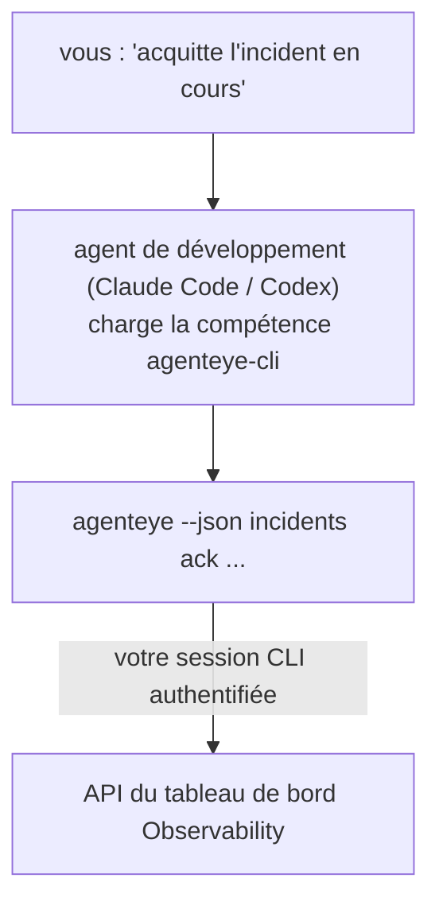

Demandez à votre agent de développement *« est-ce que quelque chose est cassé aujourd'hui ? »* et laissez-le répondre à partir de vos données live Failproof AI Observability, sans aucune commande à mémoriser. La **compétence CLI Failproof AI Observability** (`agenteye-cli`) est une *Agent Skill* : un petit dossier d'instructions qu'un agent de développement tel que Claude Code ou Codex charge à la demande. Elle apprend à l'agent à piloter votre déploiement Observability via le [CLI `agenteye`](/fr/agenteye/cli) à partir de requêtes en langage naturel comme *« donne à la CI une clé qui ne peut qu'envoyer des événements »* ou *« acquitte l'incident en cours et assigne-le moi. »*

Ce n'est **pas** un service ni un binaire séparé ; il n'y a rien à déployer. Elle s'appuie sur le CLI que vous avez déjà installé : l'agent exécute `agenteye --json …`, analyse le JSON propre produit, et vous répond en langage naturel. Tout ce qu'elle peut faire, vous pourriez le faire vous-même en tapant les mêmes commandes.

---

## Relation avec les autres interfaces Failproof AI Observability

Failproof AI Observability vous offre quatre façons d'accéder aux mêmes données et contrôles. Elles se complètent :

| Interface | Description | Où elle s'exécute | Quand l'utiliser |
|---|---|---|---|
| **[CLI](/fr/agenteye/cli)** | La référence des commandes et options de `agenteye` | Votre terminal | Quand vous voulez exécuter ou scripter une commande précise |
| **[Recettes CLI](/fr/agenteye/cli-recipes)** | Modèles `jq`/pipeline à copier-coller | Votre terminal / scripts | Quand vous intégrez le CLI dans de l'automatisation |
| **Compétence CLI** (ce document) | Une porte d'entrée en langage naturel sur le CLI | Votre agent de développement, sur votre poste | Quand vous voulez *simplement demander* et laisser l'agent choisir la commande |
| **[Compétence Evaluator](/fr/agenteye/evaluator-skill)** | Une compétence sœur qui conçoit et construit votre service de scoring | Votre agent de développement, sur votre poste | Quand vous voulez *produire* des scores d'évaluation plutôt que les lire |
| **[Compétence Python SDK](/fr/agenteye/python-sdk-skill)** | Une compétence sœur qui instrumente votre agent pour qu'il émette de la télémétrie | Votre agent de développement, sur votre poste | Quand vous voulez que votre agent *produise* les événements que cette compétence lit |
| **[Assistant IA intégré au tableau de bord](/fr/agenteye/assistant)** | Un chat intégré au tableau de bord | Côté serveur (dans le tableau de bord) | Quand vous souhaitez faire des Q&R sur vos données directement dans le tableau de bord |

La compétence n'a aucun privilège propre ; elle se contente de transformer vos mots en appels CLI qui s'exécutent en tant que vous :



### vs. l'assistant IA intégré au tableau de bord : une distinction importante

Ce sont deux outils différents avec des périmètres d'action très différents :

- L'**assistant IA intégré au tableau de bord** ([AI assistant](/fr/agenteye/assistant)) est un chat embarqué dans le tableau de bord, alimenté par le service agent. Il est **en lecture seule avec création soumise à approbation** : il peut rédiger des requêtes et des tableaux de bord sauvegardés, mais chaque écriture attend votre approbation explicite par clic, et il ne supprime jamais rien. Il est conditionné par la permission `agent:use` et ne voit jamais que les données de l'organisation que vous consultez.
- La **compétence CLI** s'exécute sur *votre* poste, au sein de *votre* agent de développement, et pilote le CLI `agenteye` en tant que **vous**. Elle peut utiliser la **totalité de la surface du CLI, y compris les mutations** (création/rotation/désactivation de clés API, modification des paramètres d'organisation, résolution d'incidents, suppression de requêtes sauvegardées), limitées uniquement par les permissions de votre connexion CLI. Traitez-la exactement avec la même prudence que si vous tapiez ces commandes vous-même.

---

## Prérequis

1. Le **CLI `agenteye` installé** et présent dans le `PATH` (voir la référence [CLI](/fr/agenteye/cli) : `pipx install agenteye`).
2. Votre **URL de tableau de bord** configurée (`AGENTEYE_DASHBOARD_URL`, ou l'agent passe `--base-url`).
3. Une **session connectée** : exécutez `agenteye login` vous-même au préalable. La compétence **ne peut pas** compléter la connexion par code à usage unique envoyé par e-mail à votre place ; elle vous demandera d'exécuter `agenteye login` si la session est absente ou expirée (code de sortie CLI `4`).

---

## Où la trouver

La compétence est publiée dans la collection publique de compétences de Failproof AI :

**[github.com/FailproofAI/skills](https://github.com/FailproofAI/skills)** → [`skills/agenteye-cli/`](https://github.com/FailproofAI/skills/tree/main/skills/agenteye-cli)

Rien n'est restreint — le dépôt est public et la compétence n'a besoin d'aucune accréditation propre, car elle ne fait que piloter le CLI `agenteye` **public** contre *votre* tableau de bord, en utilisant la session avec laquelle *vous* vous êtes connecté. Vous n'avez pas besoin de la demander à qui que ce soit.

Notez qu'elle est livrée dans son propre dossier et n'est **pas** incluse dans le paquet `pipx install agenteye`, donc ne la cherchez pas là.

## Installer la compétence

Le chemin le plus rapide est le CLI [`skills`](https://skills.sh), qui récupère le dossier et le place là où votre agent le cherche :

```bash
# Claude Code, ce projet uniquement
npx skills add FailproofAI/skills --skill agenteye-cli -a claude-code

# tous les projets (installe dans ~/.claude/skills/)
npx skills add FailproofAI/skills --skill agenteye-cli -a claude-code -g --copy

# Codex à la place
npx skills add FailproofAI/skills --skill agenteye-cli -a codex
```

Gérez-la ensuite comme n'importe quelle autre compétence :

```bash
npx skills list -a claude-code      # ce qui est installé
npx skills update agenteye-cli      # récupérer la dernière version
npx skills remove agenteye-cli      # la supprimer
```

Vous préférez installer manuellement ? Une Agent Skill n'est qu'un dossier contenant un `SKILL.md` (plus des références optionnelles), donc une simple copie fonctionne aussi :

- **Claude Code** : placez le dossier `agenteye-cli/` dans `~/.claude/skills/` (tous les projets) ou `<votre-repo>/.claude/skills/` (ce dépôt uniquement). Claude Code le découvre automatiquement — vérifiez avec la liste `/skills`, ou posez simplement une question correspondant à sa description.
- **Codex (OpenAI)** : Codex lit le même `SKILL.md`. Le fichier `agents/openai.yaml` inclus définit `allow_implicit_invocation: true`, de sorte que Codex sélectionne automatiquement la compétence lorsqu'une tâche correspond ; sinon, invoquez-la explicitement avec `$agenteye-cli`.

---

## Sécurité : les mutations ne demandent PAS de confirmation quand un agent exécute le CLI

> **Avertissement :** Lisez ceci avant de laisser un agent effectuer des modifications.

Le CLI `agenteye` demande normalement *« êtes-vous sûr ? »* avant une action destructive. Il **ignore automatiquement cette confirmation dès qu'il n'est pas attaché à un terminal (ce qui correspond exactement à la façon dont un agent de développement l'exécute), et `--json` l'ignore également.** La confirmation de sécurité ne se déclenchera donc **pas** pour l'agent.

La compétence est conçue pour compenser cela : elle est instruite d'indiquer la commande exacte qu'elle va exécuter et d'obtenir votre **accord explicite avant tout changement d'état**. Maintenez cette discipline. Lorsque vous pilotez Failproof AI Observability via un agent, *vous* êtes l'étape de confirmation. Les commandes qui modifient l'état à surveiller :

- `keys create` / `update` / `disable` / `regenerate`
- `users create` / `update` / `disable` / `enable`
- `settings set`
- `alerts create` / `update` / `delete` / `test`
- les sous-commandes d'écriture de `incidents` : `ack` / `assign` / `resolve` / `open` / `comment-add` / `comment-delete` / `subscribe` / `unsubscribe`
- `query create` / `update` / `delete`
- `agent rename` / `delete`
- `orgs switch`

Tout ce qui se trouve sous **Observe** (`events`, `sessions`, `evals`, `errors`, `list`, `whoami`, `orgs list/current/perms`) est en lecture seule et ne modifie rien.

L'agent agissant en tant que **vous**, il ne peut faire que ce que votre connexion est autorisée à faire ; les permissions sont résolues **par organisation** (voir [Clés API](/fr/agenteye/api-keys)). Une commande pour laquelle vous n'avez pas la permission renvoie le code de sortie `5` avec le nom exact de la permission manquante, de sorte que l'agent peut vous dire précisément ce qu'il faut demander à un administrateur plutôt qu'échouer sans explication.

---

## Ce que vous pouvez lui demander

Voici à quoi ressemble un vrai échange — une lecture, puis une modification qui attend votre accord :

```text
vous   ▸ Est-ce que quelque chose est cassé dans la dernière journée ?

agent  ▸ Exécution : agenteye --json errors --since 24h --aggregate
         3 types d'erreurs dans les dernières 24h. Le plus fréquent est TimeoutError
         (18 occurrences, toutes sur le checkout-agent), puis RateLimited (5).
         Voulez-vous les sessions en échec pour TimeoutError ?

vous   ▸ Donne à la CI une clé qui ne peut qu'envoyer des événements.

agent  ▸ Ceci crée une clé API. Je vais exécuter :
           agenteye keys create ci --add events:add
         OK pour continuer ?

vous   ▸ oui

agent  ▸ Fait. Clé « ci » créée avec events:add uniquement.
         Le secret n'est affiché qu'une seule fois, enregistrez-le maintenant. Je ne peux pas le réafficher.
```

La compétence associe chaque intention en langage naturel à la bonne commande `agenteye`, en découvrant d'abord les valeurs valides (`list <kind>`, `whoami`) pour ne pas deviner, et en indiquant la commande exacte avant tout changement. Autres exemples :

- *« Est-ce que quelque chose est cassé / en échec dans les dernières 24 heures ? »* → `errors --since 24h --aggregate`, puis une ventilation détaillée.
- *« Pourquoi la session `run-001` a-t-elle échoué ? »* → `events --session-id run-001 --all` + `evals --session-id run-001`.
- *« Comment évolue la qualité cette semaine ? »* → `evals --aggregate --since 7d`, puis exploration des runs avec faible score.
- *« Donne à la CI une clé qui ne peut qu'envoyer des événements. »* → `keys create ci --add events:add` (elle indique la commande, puis la crée et capture le secret à usage unique).
- *« Qui a accès ? Passe Dana en lecture seule. »* → `users list` → `users update dana@… --permission-set read-only` (après confirmation de votre part).
- *« Acquitte l'incident en cours et assigne-le moi. »* → `incidents list --state firing` → `incidents ack <id>` / `incidents assign <id> vous@…`.

Pour les commandes exactes, les options et les formats JSON correspondants, consultez la référence [CLI](/fr/agenteye/cli) et les [recettes CLI pour agents](/fr/agenteye/cli-recipes).

---

## Prochaines étapes

- **[CLI](/fr/agenteye/cli)** : référence complète des commandes et options de `agenteye`.
- **[Recettes CLI pour agents](/fr/agenteye/cli-recipes)** : modèles `jq` à copier-coller et gestion des codes de sortie.
- **[Compétence agent Evaluator](/fr/agenteye/evaluator-skill)** : la compétence sœur, pour construire l'évaluateur dont les scores sont lus par `agenteye evals`.
- **[Compétence agent Python SDK](/fr/agenteye/python-sdk-skill)** : la compétence sœur, pour instrumenter un agent afin qu'il émette la télémétrie lue par `agenteye`.
- **[Assistant IA](/fr/agenteye/assistant)** : l'assistant intégré au tableau de bord (à ne pas confondre avec cette compétence en ligne de commande).
- **[Clés API](/fr/agenteye/api-keys)** : le modèle de permissions par organisation qui définit ce que la compétence peut faire.