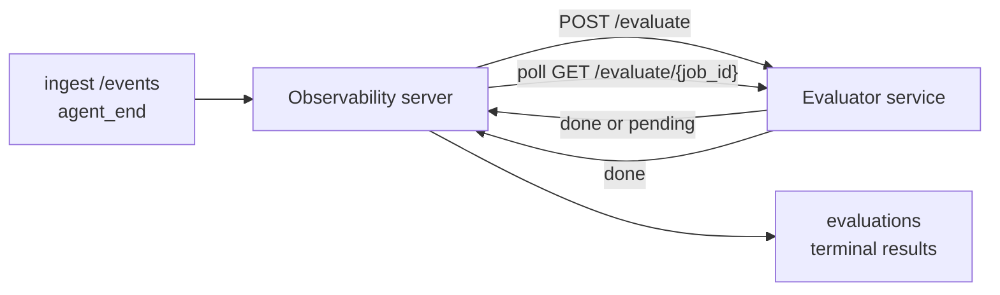

Failproof AI Observability peut noter automatiquement chaque exécution d'agent terminée : vous fournissez un petit service de notation, et Observability s'occupe du reste. Utilisez-le pour suivre les dimensions qui vous importent (utilité, efficacité des outils, factualité, sécurité — vous choisissez), détecter les régressions tôt et comparer des agents ou des environnements en un coup d'œil. La notation est optionnelle : le pipeline ne fait rien tant que `EVALUATOR_ENDPOINT` n'est pas défini sur le serveur.

> **Remarque :** Vous définissez vous-même les dimensions de notation. Votre évaluateur peut renvoyer les clés numériques qu'il souhaite ; Observability stocke, suit et affiche tout ce que vous lui envoyez.

## Vue d'ensemble

1. **Écrivez un évaluateur.** Démarrez un petit service HTTP qui lit une transcription de session et renvoie des scores. Observability inclut un exemple fonctionnel que vous pouvez copier. Voir [Écrire un évaluateur avec le SDK](#writing-an-evaluator-with-the-sdk).
2. **Pointez Observability vers ce service.** Définissez `EVALUATOR_ENDPOINT` (et un `EVALUATOR_TOKEN` partagé) sur le processus serveur.
3. **Observez les scores arriver.** Chaque session terminée est notée automatiquement ; les résultats apparaissent sur la page de détail de la session, la grille des sessions et les tableaux de bord sauvegardés.


*Une fois un évaluateur configuré, chaque exécution terminée est notée et les résultats apparaissent dans le panneau latéral droit de la session : le résumé en haut, puis les barres de score par dimension avec leur raisonnement.*

---

## Fonctionnement



Lorsque le SDK Observability émet un événement `agent_end` pour une session, le serveur planifie une évaluation. Il envoie ensuite en POST la transcription complète des événements à votre service évaluateur, qui peut soit :

- **Renvoyer le résultat en ligne** avec `{"status":"done", "scores":{...}, "reasoning":{...}, "summary":"..."}`. Le résultat est ajouté à la timeline d'évaluation de la session. `reasoning` et `summary` sont optionnels.
- **Différer** avec `{"status":"pending", "job_id":"abc-123"}`. Observability appelle alors `GET {EVALUATOR_ENDPOINT}/evaluate/abc-123` jusqu'à ce que votre évaluateur renvoie `{"status":"done", ...}` ou `{"status":"error", "error":"..."}`.

  La cadence de sondage est par tâche : une réponse `pending` peut inclure `next_poll_secs` pour la remplacer ; sinon Observability utilise la valeur `default_poll_interval_secs` de `GET /config` ; sinon le serveur se rabat sur `EVALUATOR_POLLING_INTERVAL_SECS` (10 s par défaut). Toutes les valeurs sont limitées à [1 s, 1 h].

Les sessions qui n'émettent jamais `agent_end` (par exemple, un processus agent planté) peuvent également être traitées : le `GET /config` de l'évaluateur peut renvoyer `{"inactivity_timeout_secs": 1800}`, et Observability évaluera toute session restée inactive aussi longtemps. Définissez le champ à `null` ou omettez-le pour désactiver ce mécanisme de secours.

Le pipeline est entièrement inactif lorsque `EVALUATOR_ENDPOINT` n'est pas défini.

Une session peut accumuler **plusieurs évaluations terminales au fil du temps** : chaque événement `agent_end` (et chaque réévaluation manuelle depuis le tableau de bord) ajoute une nouvelle ligne d'évaluation. C'est la méthode recommandée pour évaluer une conversation reprise : un utilisateur termine un agent, revient plus tard, envoie de nouveaux événements, termine à nouveau l'agent, et une deuxième évaluation s'exécute sur la transcription complète mise à jour. Le tableau de bord affiche l'évaluation la plus récente en titre principal et les évaluations précédentes dans une timeline repliable. Pendant qu'une évaluation est en cours pour une session, les événements `agent_end` supplémentaires pour cette session sont ignorés ; le prochain après la fin de l'évaluation en cours mettra en file d'attente une nouvelle évaluation normalement.

Le mécanisme de secours d'inactivité se réactive également sur les sessions reprises : si de nouveaux événements arrivent après une évaluation terminale précédente et que la session passe ensuite en inactivité au-delà de `inactivity_timeout_secs`, une nouvelle évaluation est mise en file d'attente.

Les échecs transitoires (5xx, 429, timeouts, erreurs réseau) sont relancés avec un backoff exponentiel jusqu'à `EVALUATOR_MAX_ATTEMPTS` ; les réponses 4xx sont terminales. Observability peut fonctionner en toute sécurité avec plusieurs instances serveur mises à l'échelle horizontalement ; le travail est réparti de sorte que la même session ne soit jamais envoyée deux fois simultanément.

---

## Contrat HTTP

Chaque route authentifiée utilise **l'authentification par token Bearer**. La même valeur doit être configurée des deux côtés :

- Serveur Observability : variable d'environnement `EVALUATOR_TOKEN`
- Service évaluateur : configuré de la même manière (le SDK `agenteye-evaluator` lit `EVALUATOR_TOKEN` par convention)

Si `EVALUATOR_TOKEN` n'est pas défini, le serveur n'envoie pas d'en-tête `Authorization` ; l'évaluateur peut alors accepter des requêtes anonymes, ce qui convient à un réseau purement interne mais est déconseillé sur internet public.

### Routes que l'évaluateur doit exposer

| Route | Corps / paramètres | Réponse |
|---|---|---|
| `GET /health` | aucun | `{"status":"ok"}` (ouverte, sans auth) |
| `GET /config` | aucun | `{"inactivity_timeout_secs": <int> \| null, "default_poll_interval_secs": <int> \| omitted}` |
| `POST /evaluate` | JSON `EvalRequest` | `{"status":"done", ...}` ou `{"status":"pending", "job_id":"..."}` |
| `GET /evaluate/{id}` | aucun | même structure de réponse que `/evaluate` |

### Corps `EvalRequest` envoyé par le serveur

```json
{
  "schema_version": "1",
  "session_id":     "session-abc123",
  "agent_id":       "planner",
  "environment":    "production",
  "started_at":     "2026-05-10T12:00:00Z",
  "ended_at":       "2026-05-10T12:05:00Z",
  "events": [
    { "id": 1234, "ts": "...", "event_type": "agent_start", "payload": { ... } },
    ...
  ]
}
```

### Structures de réponse

**Synchrone (terminé) :**

```json
{
  "status": "done",
  "scores": { "helpfulness": 0.85, "tool_efficiency": 0.6 },
  "reasoning": {
    "helpfulness": "answered the question directly with citations",
    "tool_efficiency": "called list_files three times when one would have done"
  },
  "summary": "strong answer quality, weak tool selection"
}
```

`reasoning` (une carte de justification par score) et `summary` (un récit global d'un paragraphe) sont tous deux optionnels. Les clés de `reasoning` doivent correspondre aux clés de `scores` ; le tableau de bord affiche chaque entrée sous sa barre de score. Les évaluateurs plus anciens qui renvoient uniquement `scores` continuent de fonctionner sans modification ; `reasoning` et `summary` sont simplement lus comme null et les affordances d'interface correspondantes sont omises.

**Asynchrone (différé) :**

```json
{ "status": "pending", "job_id": "abc-123", "next_poll_secs": 30 }
```

`next_poll_secs` est optionnel ; s'il est omis, le serveur se rabat sur `default_poll_interval_secs` de l'évaluateur depuis `/config`, puis sur sa propre variable d'environnement `EVALUATOR_POLLING_INTERVAL_SECS`.

**Erreur terminale côté évaluateur :**

```json
{ "status": "error", "error": "model service unavailable" }
```

Le serveur traite tout autre corps 2xx comme une erreur de protocole et enregistre une `error` terminale pour la session.

---

## Écrire un évaluateur avec le SDK

Vous n'avez pas besoin d'implémenter le contrat HTTP manuellement. Le package Python `agenteye-evaluator` vous fournit un wrapper FastAPI typé qui gère l'authentification, le routage et les structures requête/réponse à votre place.

Failproof AI Observability inclut également un **évaluateur de référence fonctionnel** qui note `helpfulness`, `tool_efficiency` et `factuality` à partir de la forme de la transcription. Copiez-le comme point de départ et substituez votre propre logique : un juge LLM, un moteur de règles, tout ce qui correspond à votre critère de qualité.

Évaluateur minimal viable :

```python
import os
from agenteye_evaluator import Evaluator, EvalRequest, EvalResponse

app = Evaluator(token=os.environ["EVALUATOR_TOKEN"])

@app.evaluator
def run(req: EvalRequest) -> EvalResponse:
    # Inspect req.events (the full session transcript) and return scores.
    tool_calls = sum(1 for e in req.events if e.event_type == "tool_use")
    return EvalResponse(
        scores={"tool_calls": float(tool_calls)},
        reasoning={"tool_calls": f"{tool_calls} tool invocations in the transcript"},
        summary="tight tool loop" if tool_calls < 5 else "agent looped on tools",
    )
```

L'instance `app` s'exécute sous n'importe quel serveur ASGI, donc `uvicorn module:app` suffit à la démarrer.

Pour les évaluateurs qui doivent différer un travail coûteux, renvoyez `JobPending` à la place et enregistrez un gestionnaire `@app.job_lookup` ; le serveur Observability sonde `GET /evaluate/{job_id}` jusqu'à ce que vous renvoyiez un statut terminal ou que le plafond `EVALUATOR_MAX_POLL_DURATION_SECS` (1 h par défaut) soit atteint.

La référence complète de l'API, le schéma asynchrone et le schéma des événements sont documentés dans le README du SDK `agenteye-evaluator`.

---

## Exécuter votre évaluateur

L'évaluateur est **votre service** — Failproof AI Observability ne fournit pas d'évaluateur par défaut, vous le construisez et l'exécutez là où vous déployez vos propres services. Il s'exécute sous n'importe quel serveur ASGI (par exemple `uvicorn my_evaluator:app`) ; exposez les routes `/health`, `/config` et `/evaluate` du [contrat HTTP](#http-contract), puis pointez le serveur vers ce service (voir [Configurer le serveur](#configuring-the-server)).

Une fois l'évaluateur accessible, `GET /health` renvoie `{"status":"ok"}`. Après l'exécution complète d'un agent, `GET /evaluations` sur le serveur renvoie une ligne avec `status: "done"` et les scores produits par votre évaluateur.

---

## Configurer le serveur

À définir sur le processus serveur :

| Variable d'env | Signification |
|---|---|
| `EVALUATOR_ENDPOINT` | URL de base de votre évaluateur (`http://evaluator:9000`). Non définie = pipeline désactivé. |
| `EVALUATOR_TOKEN` | Token Bearer. Doit correspondre à la valeur configurée dans le service évaluateur. |
| `EVALUATOR_WORKERS` | Tâches de travail par instance serveur (2 par défaut). |
| `EVALUATOR_CLAIM_BATCH` | Lignes réclamées par tick de worker (4 par défaut). Les lots sont traités **de manière concurrente** ; la concurrence effective sur votre endpoint évaluateur est `EVALUATOR_WORKERS × EVALUATOR_CLAIM_BATCH`. |
| `EVALUATOR_POLL_IDLE_SECS` | Durée de mise en veille d'un worker entre les tentatives de dispatch lorsqu'aucune évaluation n'est due (2 s par défaut). |
| `EVALUATOR_POLLING_INTERVAL_SECS` | Dernier recours pour la cadence de `GET /evaluate/{id}` lorsque ni `next_poll_secs` par réponse ni `default_poll_interval_secs` de l'évaluateur ne sont définis (10 s par défaut). |
| `EVALUATOR_REQUEST_TIMEOUT_MS` | Timeout par requête (30000 par défaut). |
| `EVALUATOR_MAX_ATTEMPTS` | Après ce nombre d'échecs transitoires, le résultat est enregistré comme `error` terminal (5 par défaut). |
| `EVALUATOR_CONFIG_REFRESH_SECS` | Cadence de `GET /config` (300 par défaut). |
| `EVALUATOR_MAX_POLL_DURATION_SECS` | Durée maximale en temps réel pendant laquelle une session peut rester dans la file de sondage avant d'être terminée comme `timeout` (3600 s par défaut). Protège contre un évaluateur qui renvoie indéfiniment `pending`. |

Pour activer la notation automatique, définissez `EVALUATOR_ENDPOINT` et `EVALUATOR_TOKEN` sur le serveur, puis redémarrez-le pour prendre en compte le changement. Avec `EVALUATOR_ENDPOINT` non défini, le pipeline reste inactif.

Les paramètres de réglage ci-dessus sont optionnels ; définissez les variables d'environnement correspondantes sur le serveur uniquement si vous avez besoin de remplacer les valeurs par défaut.

---

## Référence API

| Méthode | Chemin | Permission requise | Objet |
|---|---|---|---|
| `GET` | `/evaluations` | `evaluations:read` | Interroger les résultats terminaux. Prend en charge `session_id`, `agent_id`, `environment`, `status` (`done`/`error`/`timeout`), `ts_from`, `ts_to`, `cursor`, `limit`, `score_filters`, `latest_per_session`. `limit` est 50 par défaut et plafonné à 200 (différent de `/events` qui plafonne à 1000). `environment` accepte une liste séparée par des virgules (ex. `environment=prod,staging`) ; les valeurs uniques fonctionnent toujours. Avec `latest_per_session=true`, la réponse contient au plus une ligne par `session_id` (la plus récente selon `completed_at`), utilisée par la page de liste des sessions pour réduire la timeline d'évaluation d'une session à son titre courant. Par défaut false (renvoie l'historique complet). |
| `GET` | `/evaluations/aggregate` | `evaluations:read` | Synthèse de la santé d'évaluation pour une tranche filtrée : nombre total, ventilation done/error/timeout, statistiques par clé de score (count/avg/min/max/p50 sur les clés `scores` arbitraires), et une timeline par tranche temporelle. Accepte les **mêmes paramètres de filtre que `/evaluations`** plus `featured_keys` (CSV des clés de score à suivre) et `latest_per_session`. Alimente la fonctionnalité Tableaux de bord ; les métriques sont exactes sur l'ensemble correspondant, sans échantillonnage. |
| `GET` | `/evaluations/environments` | `evaluations:read` | Valeurs d'environnement distinctes de la table `evaluations`. Utilisé pour alimenter les listes déroulantes de filtre limitées aux données lisibles par évaluation. |
| `GET` | `/evaluation-jobs` | `evaluations:read` | Visibilité sur les évaluations en cours. Filtrage par `status` (`pending`/`polling`). |
| `GET` | `/events` | `events:read` | Diffuser les événements bruts d'une session. Prend en charge `session_id`, `agent_id`, `event_type` (CSV), `environment` (CSV), `ts_from`, `ts_to`, `cursor`, `limit` et `order`. `order` est `desc` (du plus récent au plus ancien, par défaut) ou `asc` (du plus ancien au plus récent) ; une valeur non reconnue se rabat sur `desc`. Paginez via le `next_cursor` de la réponse (un identifiant d'événement) : passez-le comme `cursor` pour obtenir la page suivante ; avec `asc` la page suivante contient les événements après cet identifiant, avec `desc` les événements avant. `limit` est 50 par défaut et plafonné à 1000. |
| `GET` | `/sessions/:session_id/export` | `events:read` | Renvoie le corps JSON exact que l'évaluateur recevrait pour cette session, servi comme pièce jointe téléchargeable nommée `session-<id>.json`. Utile pour rejouer des sessions de production via `agenteye-evaluator` pour des tests hors ligne. Les octets sont identiques à ce qu'envoie le pipeline évaluateur. |
| `POST` | `/sessions/:session_id/re-evaluate` | `evaluations:trigger` | Mettre en file d'attente une nouvelle évaluation pour une session ; s'exécute qu'une évaluation précédente existe ou non. Le nouveau résultat est **ajouté** à la timeline d'évaluation de la session plutôt que d'écraser le précédent, de sorte que les scores antérieurs restent visibles dans l'historique. Renvoie `202` lors de la mise en file d'attente, `404` pour une session inconnue, `409` si une évaluation est déjà en cours. À utiliser après le déploiement d'un nouvel évaluateur, ou pour les sessions qui n'ont jamais émis `agent_end`. |

### Filtrage par plage de score : `score_filters`

`GET /evaluations` accepte un paramètre optionnel `score_filters` qui restreint les résultats par valeurs numériques à l'intérieur de l'objet `scores`. Le paramètre est une liste séparée par des virgules d'entrées `key:min..max` ; chaque borne peut être omise. Plusieurs entrées se combinent par ET logique. Les lignes où la clé nommée est absente ou non numérique sont exclues. Une requête peut contenir au plus 20 entrées de filtre ; au-delà, HTTP 400 est renvoyé.

Exemples :
```text
# helpfulness dans [0.5, 0.8]
GET /evaluations?score_filters=helpfulness:0.5..0.8

# tool_efficiency au plus 0.3 (pas de borne inférieure)
GET /evaluations?score_filters=tool_efficiency:..0.3

# helpfulness >= 0.5 ET factuality >= 0.9
GET /evaluations?score_filters=helpfulness:0.5..,factuality:0.9..
```

Chaque objet de réponse `/evaluations` possède ces champs :

| Champ | Type | Notes |
|---|---|---|
| `evaluation_id` | chaîne (UUID) | L'identifiant canonique de cette évaluation terminale. Chaque évaluation terminale reçoit un nouvel UUID ; une même session peut en avoir plusieurs. |
| `id` | chaîne (UUID) | Alias de compatibilité descendante portant la même valeur que `evaluation_id`. |
| `session_id` | chaîne | La session sur laquelle cette évaluation a été exécutée. Une session peut avoir plusieurs évaluations dans sa timeline. |
| `agent_id` | chaîne | Identifie l'agent qui a produit la session. |
| `environment` | chaîne | Label d'environnement copié depuis la session. |
| `status` | enum | L'un de `"done"`, `"error"`, `"timeout"`. |
| `scores` | objet \| null | Scores renvoyés par votre évaluateur. |
| `reasoning` | objet \| null | Carte de justification optionnelle par score renvoyée par votre évaluateur. Les clés correspondent généralement à celles de `scores`. Le tableau de bord affiche chaque entrée sous sa barre de score. |
| `summary` | chaîne \| null | Récit global optionnel d'un paragraphe renvoyé par votre évaluateur. Le tableau de bord l'affiche au-dessus de la ventilation par score comme titre de l'évaluation. |
| `error` | chaîne \| null | Renseigné uniquement pour `"error"` / `"timeout"`. |
| `attempt_count` | entier | Nombre de tentatives de dispatch (≥ 1). |
| `duration_ms` | entier \| null | Durée de la dernière tentative. |
| `completed_at` | chaîne (ISO 8601 UTC) | Moment où le résultat terminal a été enregistré. Les résultats sont ordonnés par `completed_at` (du plus récent au plus ancien). |
| `created_at` | chaîne (ISO 8601 UTC) | Porte le même horodatage que `completed_at` (sémantique en écriture unique). |

---

## Permissions

| Permission | Accorde |
|---|---|
| `evaluations:read` | Lister les résultats d'évaluation, afficher les scores dans le tableau de bord et charger les métriques de santé du tableau de bord. |
| `evaluations:trigger` | Mettre manuellement en file d'attente une évaluation pour une session via `POST /sessions/:session_id/re-evaluate` ou le bouton de réévaluation du tableau de bord. |
| `dashboards:read` | Afficher les tableaux de bord sauvegardés (nécessite également `evaluations:read` pour charger leurs métriques). |
| `dashboards:write` | Créer et modifier des tableaux de bord. |
| `dashboards:delete` | Supprimer des tableaux de bord. |

L'administrateur bootstrap (`ADMIN_KEY`, `ADMIN_EMAIL`) reçoit automatiquement toutes ces permissions.

---

## Consulter les résultats

- **`/sessions/<id>`** : timeline des événements + panneau latéral droit affichant les scores de la session et toute erreur de la tentative de dispatch. Si votre clé dispose de `evaluations:trigger`, un bouton **re-evaluate** apparaît à côté du bouton d'export, utile pour les sessions qui n'ont jamais émis `agent_end` ou pour actualiser les scores après le déploiement d'un nouvel évaluateur. Le tableau de bord interroge le nouveau résultat et met à jour le panneau latéral dès qu'il arrive.
- **`/sessions`** : grille de sessions filtrable ; la colonne de score affiche le statut d'évaluation et les scores de chaque session en un coup d'œil.
- **`/dashboards`** : vues de santé d'évaluation sauvegardées (voir [Tableaux de bord](#dashboards) ci-dessous).


*La grille des sessions affiche le statut d'évaluation et les scores de chaque exécution en un coup d'œil ; des badges rouge/orange/vert font ressortir immédiatement les scores faibles.*

---

## Tableaux de bord

La page **Tableaux de bord** (`/dashboards`) vous permet de sauvegarder une combinaison de filtres d'évaluation sous forme de vue nommée et réutilisable, et de surveiller l'état de cette tranche d'évaluations en un coup d'œil. Les tableaux de bord sont **partagés à l'échelle de toute votre organisation** ; tous ceux disposant de `dashboards:read` voient le même ensemble.

Chaque tableau de bord fixe :

- **Filtres** : les mêmes contrôles que la page des sessions : environnement, statut, agent, une fenêtre temporelle glissante et des filtres de plage de score (`key:min..max`).
- **Une configuration d'affichage** : quelles clés de score mettre en avant, les seuils de santé vert/orange/rouge, quels panneaux afficher et si l'on doit réduire à la dernière évaluation par session.

Chaque carte affiche le nombre de sessions correspondantes, une ventilation done/error/timeout, la moyenne de chaque score mis en avant et un petit graphique sparkline de tendance. Ouvrir un tableau de bord affiche les panneaux en plein écran ; **« ouvrir dans les sessions »** vous redirige vers la page des sessions pré-filtrée exactement sur cette tranche. Les métriques sont calculées côté serveur sur l'ensemble correspondant (via `GET /evaluations/aggregate`), donc les chiffres sont exacts et non échantillonnés.


**Permissions :** la consultation nécessite `dashboards:read` et `evaluations:read` ; la création et la modification nécessitent `dashboards:write` ; la suppression nécessite `dashboards:delete`. L'administrateur bootstrap reçoit toutes ces permissions automatiquement.

---

## Dépannage

**Des sessions existent mais aucune évaluation n'est créée.** Vérifiez que `EVALUATOR_ENDPOINT` est défini sur le processus serveur, que le serveur et l'évaluateur partagent la même valeur `EVALUATOR_TOKEN`, et que le endpoint `/health` de l'évaluateur est accessible depuis le serveur. Avec `EVALUATOR_ENDPOINT` non défini, le pipeline est inactif.

**Les évaluations en cours s'accumulent.** Interrogez `GET /evaluation-jobs` pour voir la file en cours. Inspectez `attempt_count`, `next_attempt_at` et `last_error` sur chaque ligne. Causes courantes : service évaluateur inaccessible ou renvoyant des 5xx (réessayé avec backoff), mauvais `EVALUATOR_TOKEN` (401 est terminal), ou un évaluateur asynchrone qui renvoie `pending` indéfiniment (voir ci-dessous).

**Les sessions sont terminées mais aucune évaluation terminale.** Interrogez `GET /evaluation-jobs?status=polling` ; le résultat peut encore être en cours. Si une tâche est bloquée sur `pending`, le serveur a du mal à joindre l'évaluateur ; vérifiez que l'évaluateur est opérationnel et que `EVALUATOR_TOKEN` correspond.

**`HTTP 401 from evaluator: invalid bearer token`.** Le `EVALUATOR_TOKEN` sur le serveur ne correspond pas à la valeur configurée dans le service évaluateur. Ils doivent être identiques.

**L'évaluateur asynchrone renvoie `pending` indéfiniment.** Le serveur sonde `GET /evaluate/{job_id}` jusqu'à ce que l'évaluateur renvoie `done` ou `error`, ou jusqu'à ce que le plafond `EVALUATOR_MAX_POLL_DURATION_SECS` (1 h par défaut) soit atteint. Passé ce délai, l'évaluation est enregistrée comme `timeout` et retirée de la file en cours. Augmentez `EVALUATOR_MAX_POLL_DURATION_SECS` si votre évaluateur a légitimement besoin de plus de temps que la valeur par défaut.

---

## Prochaines étapes

- [Compétence d'agent évaluateur](/fr/agenteye/evaluator-skill) : demandez à un agent de codage de concevoir vos dimensions sur des sessions réelles et de construire ce service pour vous.
- [SDK Python](/fr/agenteye/python-sdk) : émettez les événements `agent_end` qui déclenchent la notation.
- [Clés API](/fr/agenteye/api-keys) : les permissions `evaluations:read` et `evaluations:trigger`.
- [Audits](/fr/agenteye/audits) : l'autre fonctionnalité de qualité automatisée d'Observability, pour la revue basée sur des politiques.