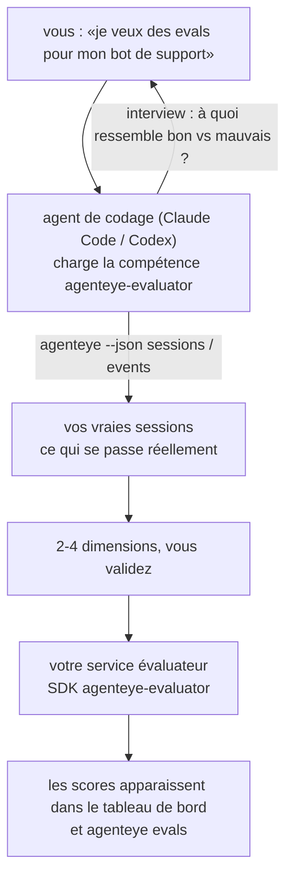

Passez de *«je pense que notre agent est parfois mauvais»* à un service de scoring déployé, avec votre agent de codage qui prend les décisions et réalise la construction. La **compétence évaluateur d'observabilité Failproof AI** (`agenteye-evaluator`) est une *Agent Skill* : un petit dossier d'instructions qu'un agent de codage tel que Claude Code ou Codex charge à la demande. Elle apprend à l'agent à déterminer quelles dimensions de qualité méritent d'être suivies pour *votre* agent, puis à écrire, tester et déployer le [service évaluateur](/fr/agenteye/evaluation-suite) qui les note.

Il ne s'agit **pas** d'un scorer hébergé, d'un registre vers lequel vous téléchargez, ni d'un système de plugins. Votre évaluateur reste votre propre service HTTP sur votre propre infrastructure, exactement comme décrit dans le guide [Evaluation suite](/fr/agenteye/evaluation-suite). La compétence apprend simplement à votre agent à le construire correctement — tout ce qu'elle fait, vous pourriez le faire vous-même en écrivant le même code.

---

## La partie difficile, c'est de décider quoi mesurer

La surface du SDK est réduite — un décorateur et deux modèles — et un agent peut l'écrire à partir du seul [contrat](/fr/agenteye/evaluation-suite#http-contract). Ce n'est pas là que les évaluateurs échouent. Ils échouent parce qu'ils mesurent la mauvaise chose, et un évaluateur qui mesure la mauvaise chose est pire que rien : il produit un tableau de bord que tout le monde finit par ignorer.

Ainsi, l'essentiel de la compétence concerne la phase avant que le moindre code n'existe. Elle fait interroger l'agent (*«décrivez une exécution qui s'est bien passée ; maintenant une qui s'est mal passée»*), puis fait passer vos vraies sessions par le [CLI `agenteye`](/fr/agenteye/cli) pour les lire de bout en bout. Ces deux moitiés sont souvent en désaccord, et l'écart est précisément le sujet : ce que vous avez l'intention de mesurer versus ce que vos transcriptions peuvent réellement supporter. Une dimension ne survit que si elle est **calculable** à partir des événements et **discriminante** — si elle obtient 0,9 aussi bien sur votre bonne exécution que sur la mauvaise, elle n'apprend rien et est écartée.

Ce qui en ressort est une proposition de 2 à 4 dimensions avec le raisonnement associé, que vous devez valider avant qu'une seule ligne soit écrite.



---

## Sa relation avec les autres composants d'évaluation

Quatre pages couvrent le scoring, et se transmettent le relais dans l'ordre :

| Page | Ce que c'est | À consulter quand |
|---|---|---|
| **[Evaluations](/fr/agenteye/evaluations)** | La fonctionnalité : scores sur la grille de sessions, tableaux de bord, réévaluation | Vous voulez savoir ce que le scoring automatique vous apporte |
| **[Evaluation suite](/fr/agenteye/evaluation-suite)** | Le contrat HTTP, le SDK, les variables d'environnement du serveur | Vous implémentez ou déboguez l'évaluateur vous-même |
| **Compétence évaluateur** (ce document) | Une interface en langage naturel pour concevoir *et* construire le scorer | Vous voulez passer de «je veux des evals» à un service opérationnel |
| **[Compétence CLI](/fr/agenteye/cli-skill)** | Une interface en langage naturel sur le CLI `agenteye` | Vous voulez *lire* les scores que vous avez déjà |
| **[Compétence Python SDK](/fr/agenteye/python-sdk-skill)** | Une interface en langage naturel pour instrumenter votre agent | Votre agent n'émet pas encore de sessions — il n'y a rien à scorer |

### vs. la compétence CLI : construire vs lire

Les deux compétences se chevauchent délibérément peu, et les installer toutes les deux est la configuration normale — l'agent choisit entre elles en fonction de ce que vous demandez :

- **`agenteye-evaluator`** (ce document) construit ce qui *produit* les scores. Sa mission se termine quand les scores arrivent pour la première fois.
- **[`agenteye-cli`](/fr/agenteye/cli-skill)** lit les scores qui existent déjà (`agenteye evals`). *«La qualité a-t-elle baissé cette semaine ?»* est sa question, pas celle de cette compétence.

---

## Prérequis

1. **Le CLI `agenteye` installé et connecté** (`pipx install agenteye`, puis `agenteye login`). La compétence s'appuie dessus à deux reprises : pour récupérer les vraies sessions sur lesquelles elle base sa conception, et pour confirmer que vos scores sont bien arrivés à la fin. Votre connexion nécessite `events:read`, plus `evaluations:read` pour cette vérification finale. Comme pour la compétence CLI, elle **ne peut pas** effectuer à votre place la connexion par code à usage unique envoyé par e-mail.
2. **Un endroit où héberger l'évaluateur.** Il est intégré dans une image et exécuté en tant que service long, il a donc besoin d'un vrai dépôt, pas d'un fichier temporaire. Les évaluateurs vivent souvent dans leur propre dépôt, séparé de l'agent évalué — la compétence cherche un dépôt existant et demande avant d'en créer un nouveau.
3. **Le wheel SDK `agenteye-evaluator`** — lisez la section suivante avant de laisser votre agent taper des commandes `pip`.

---

## Où le trouver

La compétence est publiée dans la collection de compétences publiques de Failproof AI :

**[github.com/FailproofAI/skills](https://github.com/FailproofAI/skills)** → [`skills/agenteye-evaluator/`](https://github.com/FailproofAI/skills/tree/main/skills/agenteye-evaluator)

Le dépôt est public et la compétence n'a pas besoin d'identifiants propres — elle ne fait que piloter le CLI `agenteye` avec la session *que vous* avez ouverte, et écrire du code dans *votre* dépôt. Notez qu'elle est livrée dans son propre dossier et **n'est pas** incluse dans le package `pipx install agenteye`, ne la cherchez donc pas là.

## Installer la compétence

Le chemin le plus rapide est le CLI [`skills`](https://skills.sh), qui récupère le dossier et le place là où votre agent le cherche :

```bash
# Claude Code, ce projet uniquement
npx skills add FailproofAI/skills --skill agenteye-evaluator -a claude-code

# tous les projets (installe dans ~/.claude/skills/)
npx skills add FailproofAI/skills --skill agenteye-evaluator -a claude-code -g --copy

# Codex à la place
npx skills add FailproofAI/skills --skill agenteye-evaluator -a codex
```

Puis gérez-la comme n'importe quelle autre compétence :

```bash
npx skills list -a claude-code           # ce qui est installé
npx skills update agenteye-evaluator     # récupérer la dernière version
npx skills remove agenteye-evaluator     # la supprimer
```

Vous préférez installer manuellement ? Une Agent Skill n'est qu'un dossier contenant un `SKILL.md` (plus des références optionnelles), donc la copier fonctionne aussi :

- **Claude Code** : placez le dossier `agenteye-evaluator/` dans `~/.claude/skills/` (tous les projets) ou `<votre-dépôt>/.claude/skills/` (ce dépôt uniquement). Claude Code le découvre automatiquement — vérifiez avec la liste `/skills`, ou demandez simplement des evals.
- **Codex (OpenAI)** : Codex lit le même `SKILL.md`. Le fichier `agents/openai.yaml` inclus définit `allow_implicit_invocation: true`, donc Codex sélectionne automatiquement la compétence quand une tâche correspond ; sinon, invoquez-la explicitement avec `$agenteye-evaluator`.

---

## Le SDK n'est pas sur PyPI public

> **Avertissement :** Lisez ceci avant de laisser un agent installer le SDK.

La compétence est publique ; le SDK qu'elle pilote ne l'est pas. `agenteye-evaluator` est fourni uniquement en tant qu'artefact de version privée, et contrairement à `agenteye`, le nom est **non revendiqué sur PyPI public** — donc un simple `pip install agenteye-evaluator` pourrait introduire le package d'un inconnu dans le service qui lit vos transcriptions de production. C'est un problème de chaîne d'approvisionnement, pas une faute de frappe.

La compétence le sait et suit une échelle d'installation à la place, s'arrêtant au premier échelon applicable : la source du monorepo si vous êtes à l'intérieur du dépôt AgentEye, sinon le wheel de version privée depuis GitHub Releases (accès requis), et si aucun n'est accessible, elle **s'arrête et vous dit de demander le wheel à votre contact Failproof AI** plutôt que d'improviser.

Donc si votre agent propose un simple `pip install agenteye-evaluator` depuis PyPI public, c'est le signe que la compétence n'a jamais été chargée. Arrêtez-vous et vérifiez qu'elle est bien installée.

---

## Ce que vous pouvez lui demander

Un vrai aller-retour commence par une demande vague et se termine par une conception validée, pas par du code :

```text
vous  ▸ Je veux des evals pour notre bot de support. Je pense qu'il est parfois mauvais.

agent ▸ Avant d'écrire quoi que ce soit : décrivez une exécution qui s'est bien passée,
        et une qui s'est mal passée.

vous  ▸ Bien : il répond à partir de la documentation. Mal : il invente des choses,
        ou abandonne et dit «contactez le support».

agent ▸ Exécution : agenteye --json sessions --status error --since 7d
        Lecture de 5 sessions, dont deux que vous qualifieriez de mauvaises.

        Vos mots disent factualité et déflexion. Les transcriptions
        concordent sur la déflexion (2 sur 5 se terminent par un transfert au support,
        clairement visible dans model_response.content), mais la factualité
        nécessite une vérité terrain que vos événements ne contiennent pas.

        Je scorerais donc trois choses :
          - deflection      règles, peu coûteux, sépare vos deux exécutions
          - tool_efficiency règles, détecte la boucle de réessai dans run-004
          - groundedness    juge LLM : chaque affirmation est-elle dans les docs récupérés ?

        «factualité» nécessiterait une vérité terrain que nous n'avons pas ; groundedness
        est ce que vos transcriptions peuvent réellement supporter.
        OK avec ces trois noms ? Les renommer plus tard divise l'historique.

vous  ▸ oui

agent ▸ Pas d'évaluateur dans ce dépôt. Dois-je en créer un ici, ou en avez-vous
        un ailleurs ?
```

À partir de là, il écrit d'abord les dimensions basées sur des règles (gratuites, instantanées, déterministes), les teste contre une vraie session capturée incluant les sessions vides et jamais terminées qui font planter les évaluateurs naïfs, et ne fait appel à un juge LLM que pour la dimension subjective. Il connaît les [limites du dispatcher](/fr/agenteye/evaluation-suite#configuring-the-server) — un délai d'expiration de requête de 30s et 8 appels concurrents pour tout le déploiement — donc si le juge ne tient pas de manière fiable, il passe en asynchrone avec `JobPending` plutôt que de laisser votre juge se faire annuler et réessayer cinq fois au quintuple du coût.

Ensuite, il déploie, définit les deux variables d'environnement du serveur, et confirme avec `agenteye --json evals --session-id <id>` que les scores sont bien arrivés. L'arrivée des scores est la seule preuve.

---

## Ce qu'il faut surveiller

- **Les noms de dimensions sont quasi permanents.** Les clés de score sont des chaînes arbitraires et la plateforme suit les tendances de tout ce que vous envoyez, ce qui signifie que rien en aval ne corrige un mauvais choix. Renommer plus tard divise l'historique : les anciennes sessions conservent l'ancienne clé et la tendance se brise. C'est pourquoi la compétence obtient une validation explicite avant d'écrire du code — prenez cette invite au sérieux.
- **Les fixtures sont de vraies transcriptions de production.** Concevoir à partir de vraies sessions implique de les récupérer sur disque, et elles peuvent contenir des données clients. La compétence demande avant de les committer dans git ; en cas de doute, gardez `fixtures/` hors du dépôt et demandez à chaque développeur de récupérer les siennes.
- **L'agent écrit et déploie un service qui lit chaque transcription.** Il agit en votre nom, limité par les permissions de votre connexion CLI, mais examinez l'évaluateur comme n'importe quel autre code qui touche aux données de production.

---

## Prochaines étapes

- **[Evaluation suite](/fr/agenteye/evaluation-suite)** : le contrat HTTP, le SDK et les variables d'environnement du serveur que la compétence configure.
- **[Evaluations](/fr/agenteye/evaluations)** : là où les scores apparaissent une fois qu'ils arrivent.
- **[Compétence CLI](/fr/agenteye/cli-skill)** : la compétence sœur, pour lire les résultats plutôt que construire le scorer.
- **[CLI](/fr/agenteye/cli)** : la référence des commandes derrière les données de session sur lesquelles la compétence se base.