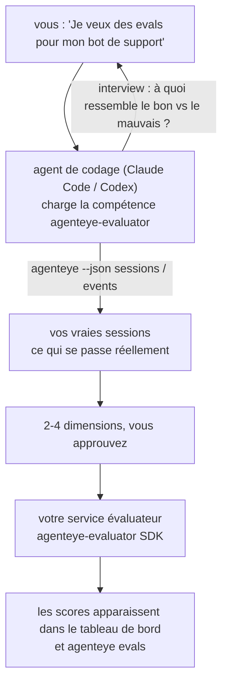

Passez de *« je pense que notre agent est parfois défaillant »* à un service de scoring déployé, avec votre agent de codage qui prend les décisions et réalise la construction. La **compétence d'évaluation Failproof AI Observability** (`agenteye-evaluator`) est une *Agent Skill* : un petit dossier d'instructions qu'un agent de codage tel que Claude Code ou Codex charge à la demande. Elle apprend à l'agent à déterminer quelles dimensions de qualité valent la peine d'être suivies pour *votre* agent, puis à écrire, tester et déployer le [service d'évaluation](/fr/agenteye/evaluation-suite) qui les note.

Ce n'est **pas** un système de scoring hébergé, un registre vers lequel vous téléversez, ni un système de plugins. Votre évaluateur reste votre propre service HTTP sur votre propre infrastructure, exactement comme décrit dans le guide [Evaluation suite](/fr/agenteye/evaluation-suite). La compétence apprend simplement à votre agent à le construire correctement — tout ce qu'il fait, vous pourriez le faire vous-même en écrivant le même code.

---

## La partie difficile, c'est de décider quoi scorer

La surface du SDK est réduite — un décorateur et deux modèles — et un agent peut l'écrire à partir du seul [contrat](/fr/agenteye/evaluation-suite#http-contract). Ce n'est pas là que les évaluateurs échouent. Ils échouent parce qu'ils scorent la mauvaise chose, et un évaluateur qui score la mauvaise chose est pire qu'aucun : il produit un tableau de bord que tout le monde apprend à ignorer.

La majeure partie de la compétence concerne donc ce qui précède tout code. L'agent vous interroge (*« décrivez une exécution qui s'est bien passée ; maintenant une qui s'est mal passée »*), puis fait passer vos vraies sessions par le [CLI `agenteye`](/fr/agenteye/cli) et les lit de bout en bout. Ces deux moitiés sont souvent en désaccord, et l'écart est précisément le point crucial : ce que vous avez l'intention de mesurer versus ce que vos transcripts peuvent réellement prendre en charge. Une dimension ne survit que si elle est **calculable** à partir des événements et **discriminante** — si elle score 0,9 sur votre bonne exécution comme sur votre mauvaise, elle n'apprend rien et est éliminée.

Ce qui en résulte est une proposition de 2 à 4 dimensions avec le raisonnement joint, pour que vous l'approuviez avant qu'une seule ligne soit écrite.



---

## Comment cela s'articule avec les autres éléments d'évaluation

Quatre pages de documentation couvrent le scoring, et elles se passent le relais dans l'ordre :

| Page | Ce que c'est | Quand y recourir |
|---|---|---|
| **[Evaluations](/fr/agenteye/evaluations)** | La fonctionnalité : scores sur la grille de sessions, tableaux de bord, réévaluation | Vous voulez savoir ce que le scoring automatique vous apporte |
| **[Evaluation suite](/fr/agenteye/evaluation-suite)** | Le contrat HTTP, le SDK, les variables d'environnement du serveur | Vous implémentez ou déboguez vous-même l'évaluateur |
| **Evaluator skill** (ce doc) | Une interface en langage naturel pour concevoir *et* construire le scorer | Vous voulez passer de « je veux des evals » à un service fonctionnel |
| **[CLI skill](/fr/agenteye/cli-skill)** | Une interface en langage naturel sur le CLI `agenteye` | Vous souhaitez *lire* les scores que vous avez déjà |
| **[Python SDK skill](/fr/agenteye/python-sdk-skill)** | Une interface en langage naturel pour instrumenter votre agent | Votre agent n'émet pas encore de sessions — il n'y a rien à scorer |

### vs. la CLI skill : construire versus lire

Les deux compétences sont délibérément sans chevauchement, et installer les deux est la configuration habituelle — l'agent choisit entre elles en fonction de ce que vous demandez :

- **`agenteye-evaluator`** (ce doc) construit ce qui *produit* des scores. Son rôle s'achève lorsque les scores apparaissent pour la première fois.
- **[`agenteye-cli`](/fr/agenteye/cli-skill)** lit les scores qui existent déjà (`agenteye evals`). *« La qualité a-t-elle baissé cette semaine ? »* est sa question, pas celle de cette compétence.

---

## Prérequis

1. **Le CLI `agenteye` installé et connecté** (`pipx install agenteye`, puis `agenteye login`). La compétence s'appuie dessus à deux reprises : pour récupérer les vraies sessions sur lesquelles elle se base, et pour confirmer que vos scores sont bien arrivés à la fin. Votre connexion nécessite `events:read`, ainsi que `evaluations:read` pour cette vérification finale. Comme pour la CLI skill, elle **ne peut pas** effectuer la connexion par code à usage unique envoyé par e-mail à votre place.
2. **Un endroit où héberger l'évaluateur.** Il est construit en image et exécuté comme un service permanent, donc il lui faut un vrai dépôt, pas un fichier temporaire. Les évaluateurs vivent souvent dans leur propre dépôt, séparé de l'agent évalué — la compétence recherche un dépôt existant et demande confirmation avant d'en créer un nouveau.
3. **Le wheel SDK `agenteye-evaluator`** — lisez la section suivante avant de laisser votre agent taper des commandes `pip`.

---

## Où l'obtenir

La compétence est publiée dans la collection publique de compétences de Failproof AI :

**[github.com/FailproofAI/skills](https://github.com/FailproofAI/skills)** → [`skills/agenteye-evaluator/`](https://github.com/FailproofAI/skills/tree/main/skills/agenteye-evaluator)

Le dépôt est public et la compétence n'a besoin d'aucun identifiant propre — elle pilote uniquement le CLI `agenteye` avec la session *avec laquelle vous* êtes connecté, et écrit du code dans *votre* dépôt. Notez qu'elle est livrée sous forme de dossier autonome et n'est **pas** incluse dans le package `pipx install agenteye` — ne la cherchez pas là.

## Installer la compétence

Le chemin le plus rapide est le CLI [`skills`](https://skills.sh), qui récupère le dossier et le dépose là où votre agent le cherche :

```bash
# Claude Code, ce projet uniquement
npx skills add FailproofAI/skills --skill agenteye-evaluator -a claude-code

# tous les projets (installe dans ~/.claude/skills/)
npx skills add FailproofAI/skills --skill agenteye-evaluator -a claude-code -g --copy

# Codex à la place
npx skills add FailproofAI/skills --skill agenteye-evaluator -a codex
```

Puis gérez-la comme n'importe quelle autre compétence :

```bash
npx skills list -a claude-code           # ce qui est installé
npx skills update agenteye-evaluator     # récupérer la dernière version
npx skills remove agenteye-evaluator     # la supprimer
```

Vous préférez installer manuellement ? Une Agent Skill est simplement un dossier contenant un `SKILL.md` (plus des références optionnelles), donc la copier fonctionne aussi :

- **Claude Code** : placez le dossier `agenteye-evaluator/` dans `~/.claude/skills/` (tous les projets) ou `<votre-dépôt>/.claude/skills/` (ce dépôt uniquement). Claude Code le découvre automatiquement — vérifiez avec la liste `/skills`, ou demandez simplement des evals.
- **Codex (OpenAI)** : Codex lit le même `SKILL.md`. Le fichier `agents/openai.yaml` fourni définit `allow_implicit_invocation: true`, de sorte que Codex sélectionne automatiquement la compétence quand une tâche correspond ; sinon, invoquez-la explicitement avec `$agenteye-evaluator`.

---

## Le SDK n'est pas sur le PyPI public

> **Avertissement :** Lisez ceci avant de laisser un agent installer le SDK.

La compétence est publique ; le SDK qu'elle pilote ne l'est pas. `agenteye-evaluator` est livré uniquement en tant qu'artefact de version privée, et contrairement à `agenteye`, le nom est **non revendiqué sur le PyPI public** — donc un simple `pip install agenteye-evaluator` pourrait intégrer le package d'un inconnu dans le service qui lit vos transcripts de production. C'est un problème de chaîne d'approvisionnement, pas une faute de frappe.

La compétence le sait et utilise à la place une échelle d'installation, s'arrêtant à la première marche qui s'applique : la source du monodépôt si vous êtes dans le dépôt AgentEye, sinon le wheel de version privée depuis GitHub Releases (nécessite un accès), et si ni l'un ni l'autre n'est accessible, elle **s'arrête et vous demande de contacter votre interlocuteur Failproof AI pour obtenir le wheel** plutôt que d'improviser.

Donc si votre agent propose un simple `pip install agenteye-evaluator` depuis le PyPI public, c'est le signe que la compétence n'a jamais été chargée. Arrêtez-vous là et vérifiez qu'elle est bien installée.

---

## Ce que vous pouvez lui demander

Un vrai aller-retour commence par une demande vague et se termine par un design approuvé, pas par du code :

```text
vous  ▸ Je veux des evals pour notre bot de support. Je pense qu'il est parfois défaillant.

agent ▸ Avant d'écrire quoi que ce soit : décrivez une exécution qui s'est bien passée,
        et une qui s'est mal passée.

vous  ▸ Bien : il répond à partir de la documentation. Mal : il invente des choses,
        ou abandonne et dit « contactez le support ».

agent ▸ Exécution : agenteye --json sessions --status error --since 7d
        Lecture de 5 sessions, dont deux que vous qualifieriez de mauvaises.

        Vos mots évoquent factualité et déflexion. Les transcripts
        confirment la déflexion (2 sessions sur 5 se terminent par un
        transfert au support, clairement visible dans model_response.content),
        mais la factualité nécessite une vérité terrain que vos événements ne portent pas.

        Je scorerais donc trois choses :
          - deflection      règles, peu coûteux, distingue vos deux exécutions
          - tool_efficiency règles, détecte la boucle de relance dans run-004
          - groundedness    juge LLM : chaque affirmation est-elle dans les docs récupérés ?

        « factualité » nécessiterait une vérité terrain que nous n'avons pas ;
        groundedness est ce que vos transcripts peuvent réellement prendre en charge.
        Ces trois noms vous conviennent ? Les renommer plus tard divise l'historique.

vous  ▸ oui

agent ▸ Pas d'évaluateur dans ce dépôt. Dois-je en créer un ici, ou
        en avez-vous un ailleurs ?
```

À partir de là, il écrit d'abord les dimensions basées sur des règles (gratuites, instantanées, déterministes), les teste contre une vraie session capturée, y compris les sessions vides et jamais terminées qui font planter les évaluateurs naïfs, et n'a recours à un juge LLM que pour la dimension subjective. Il connaît les [limites du dispatcher](/fr/agenteye/evaluation-suite#configuring-the-server) — un délai de requête de 30 secondes et 8 appels concurrents à l'échelle du déploiement — donc si le juge ne tient pas fiablement dans ce délai, il passe en mode asynchrone avec `JobPending` plutôt que de laisser votre juge être annulé et relancé cinq fois au quintuple du coût.

Ensuite, il déploie, configure les deux variables d'environnement du serveur, et confirme avec `agenteye --json evals --session-id <id>` que les scores sont bien arrivés. L'arrivée des scores est la seule preuve.

---

## Ce à quoi faire attention

- **Les noms de dimensions sont quasi permanents.** Les clés de score sont des chaînes arbitraires et la plateforme suit l'évolution de tout ce que vous envoyez, ce qui signifie que rien en aval ne corrige un mauvais choix. Renommez plus tard et l'historique se divise : les anciennes sessions gardent l'ancienne clé et la tendance se casse. C'est pourquoi la compétence obtient une approbation explicite avant d'écrire du code — prenez cette invitation au sérieux.
- **Les fixtures sont de vrais transcripts de production.** Concevoir à partir de vraies sessions signifie les télécharger sur le disque, et elles peuvent contenir des données client. La compétence demande avant de les committer dans git ; en cas de doute, gardez `fixtures/` hors du dépôt et faites en sorte que chaque développeur tire les siennes.
- **L'agent écrit et déploie un service qui lit tous les transcripts.** Il agit en votre nom, limité par les permissions de votre connexion CLI, mais examinez l'évaluateur comme tout autre code qui touche des données de production.

---

## Prochaines étapes

- **[Evaluation suite](/fr/agenteye/evaluation-suite)** : le contrat HTTP, le SDK et les variables d'environnement du serveur que la compétence configure.
- **[Evaluations](/fr/agenteye/evaluations)** : là où les scores apparaissent une fois qu'ils sont arrivés.
- **[CLI skill](/fr/agenteye/cli-skill)** : la compétence sœur, pour lire les résultats plutôt que construire le scorer.
- **[CLI](/fr/agenteye/cli)** : la référence de commandes derrière les données de session sur lesquelles la compétence se base.