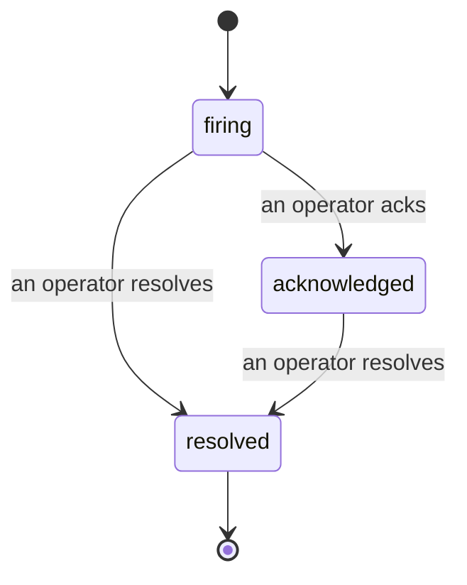

Lorsqu'une alerte se déclenche, la première question est toujours « qui s'en occupe ? » Les incidents y répondent : dès qu'un seuil est franchi, tout le monde peut voir que l'incident est ouvert, qui en est responsable, et exactement ce qui s'est passé jusqu'ici, avec un historique clair et attribué que vous pouvez transmettre directement à un post-mortem.

*La boîte de réception regroupe les incidents ouverts par état et permet de filtrer par sévérité et par responsable, pour que vous voyiez ce qui nécessite une intervention humaine immédiatement.*

## Savoir qui s'en charge, d'un coup d'œil

Fini les « est-ce que quelqu'un regarde ça ? » dans un fil de discussion. Un dépassement de seuil ouvre automatiquement un incident et le dépose dans une boîte de réception partagée, regroupée par état. Accusez-en réception et votre nom y apparaît, signalant au reste de l'équipe que c'est pris en charge. L'accusé de réception est partagé : plusieurs opérateurs peuvent acquitter le même incident, chacun étant enregistré indépendamment, ce qui permet à toute une cellule de crise d'apparaître nominativement sans se marcher dessus. Assignez un seul responsable pour le triage, et filtrez la boîte de réception par sévérité ou par assigné pour ne garder que ce qui vous appartient.

## Toute l'histoire, sur une seule timeline

Une fois l'incident terminé, votre compte-rendu est déjà prêt. Ouvrez n'importe quel incident et vous trouvez les preuves du dépassement, les assignés et abonnés, un fil de commentaires pour coordonner sur place, et une timeline d'activité en ajout seul.

*Tout ce qui s'est passé, dans l'ordre, chaque ligne signée par son auteur.*

Chaque action (ouverture, accusé de réception, résolution, etc.) est écrite dans cette timeline et ne peut jamais être modifiée ou supprimée. Chaque entrée est attribuée : à l'opérateur qui l'a effectuée, par e-mail, ou à **automated** pour tout ce que Failproof AI Observability a fait automatiquement, comme l'ouverture de l'incident lors du dépassement. Rien n'est anonyme et rien n'est perdu, ce qui permet au post-mortem de pratiquement s'écrire tout seul.

## Comment un incident évolue

- **Ouvert (firing) :** le dépassement ouvre l'incident et notifie vos canaux une seule fois. Les dépassements successifs se fondent dans le même incident et actualisent ses preuves au lieu de vous notifier encore et encore.
- **Acquitté (acknowledged) :** un opérateur prend l'incident en charge. Il reste ouvert, et les dépassements ultérieurs mettent à jour les preuves discrètement.
- **Résolu (resolved) :** un opérateur le clôture. La résolution automatique lorsque la condition se rétablit est prévue mais pas encore activée ; un incident reste donc ouvert jusqu'à ce qu'un humain le résolve, ce qui garantit une vérité partagée sur ce qui est réellement rétabli. Un nouvel incident peut s'ouvrir sur la même alerte par la suite.

Une alerte ne peut détenir qu'un seul incident ouvert à la fois, de sorte qu'une règle instable ne peut pas vous noyer sous les doublons. Vous pouvez également ouvrir un incident manuellement : un incident autonome pour quelque chose qu'aucune alerte n'a détecté, ou un incident attaché à une alerte existante, si vous disposez de `incidents:write`.

## Où le trouver

Les incidents se trouvent à `/<org-slug>/incidents`. La consultation nécessite **`incidents:read`** ; l'ouverture d'un incident manuel nécessite **`incidents:write`** ; l'accusé de réception, l'assignation, les commentaires et la résolution nécessitent **`incidents:ack`**. Les anciennes clés ayant accordé le rôle retraité `alerts:ack` continuent de fonctionner, car il est reconnu comme `incidents:ack`, de sorte que votre rotation d'astreinte n'a pas besoin d'être reconfigurée.

## Voir aussi

- [Alertes](/fr/agenteye/alerts) : les règles qui ouvrent ces incidents lorsqu'un seuil est franchi.
- [Suivi des erreurs](/fr/agenteye/error-tracking) : visualisez tous les échecs en un seul endroit et promouvez-en un en alerte.
- [Audits](/fr/agenteye/audits) : l'analyste planifié qui détecte les échecs qu'aucune règle ne surveillait.