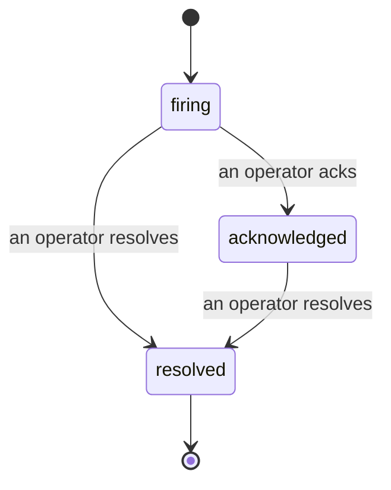

Quand une alerte se déclenche, la première question est toujours « qui s'en occupe ? » Les incidents y répondent : dès qu'un seuil est franchi, tout le monde peut voir que l'incident est ouvert, qui en est responsable, et exactement ce qui s'est passé jusqu'ici, avec un historique clair et attribué que vous pouvez transmettre directement à un post-mortem.

*La liste regroupe les incidents ouverts par état et permet de filtrer par sévérité et par responsable, afin de voir immédiatement ce qui nécessite une intervention humaine.*

## Savoir qui s'en occupe, d'un coup d'œil

Fini les « est-ce que quelqu'un regarde ça ? » dans un fil de discussion. Un franchissement de seuil ouvre automatiquement un incident et le dépose dans une boîte de réception partagée, regroupée par état. Prenez-le en charge et votre nom y apparaît, signalant au reste de l'équipe que c'est traité. La prise en charge est partagée : plusieurs opérateurs peuvent acquitter le même incident et chacun est enregistré séparément, de sorte qu'une cellule de crise complète s'affiche par nom sans que les uns n'écrasent les autres. Assignez un responsable pour le triage, et filtrez la liste par sévérité ou par responsable pour ne voir que ce qui vous incombe.

## Toute l'histoire, dans une seule chronologie

Quand l'incident est terminé, le compte-rendu est déjà là. Ouvrez n'importe quel incident et vous obtenez les preuves du franchissement, ses responsables et abonnés, un fil de commentaires pour coordonner sur place, et une chronologie d'activité en ajout seul.

*Tout ce qui s'est passé, dans l'ordre, chaque ligne signée par celui qui l'a fait.*

Chaque action (ouverture, acquittement, résolution, etc.) est inscrite dans cette chronologie et n'en est jamais effacée. Chaque entrée est attribuée : à l'opérateur qui l'a effectuée, par e-mail, ou à **automated** pour tout ce que Failproof AI Observability a fait de son propre chef, comme l'ouverture de l'incident lors du franchissement. Rien n'est anonyme et rien n'est perdu, si bien que le post-mortem s'écrit presque tout seul.

## Comment un incident évolue

- **Ouvert (firing) :** le franchissement ouvre l'incident et notifie vos canaux une seule fois. Les franchissements répétés se regroupent dans le même incident et actualisent ses preuves plutôt que de vous notifier encore et encore.
- **Acquitté (acknowledged) :** un opérateur prend en charge l'incident. Il reste ouvert, et les franchissements ultérieurs mettent à jour les preuves discrètement.
- **Résolu (resolved) :** un opérateur le clôture. La résolution automatique lorsque la condition se normalise est prévue mais pas encore activée, donc un incident reste ouvert jusqu'à ce qu'un humain le résolve, ce qui oblige chacun à rester honnête sur ce qui est vraiment réglé. Un nouvel incident peut s'ouvrir sur la même alerte ultérieurement.

Une alerte ne peut avoir qu'un seul incident ouvert à la fois, de sorte qu'une règle instable ne peut pas vous noyer sous les doublons. Vous pouvez également ouvrir un incident manuellement : un incident autonome pour quelque chose qu'aucune alerte n'a détecté, ou un incident rattaché à une alerte existante, si vous disposez de `incidents:write`.

## Où le trouver

Les incidents se trouvent à `/<org-slug>/incidents`. La consultation nécessite **`incidents:read`** ; l'ouverture d'un incident manuel nécessite **`incidents:write`** ; l'acquittement, l'assignation, les commentaires et la résolution nécessitent **`incidents:ack`**. Les clés plus anciennes accordant l'autorisation `alerts:ack` désormais retirée continuent de fonctionner, car elle est honorée en tant que `incidents:ack`, de sorte que votre rotation d'astreinte n'a pas besoin d'être réémise.

## Voir aussi

- [Alertes](/fr/agenteye/alerts) : les règles qui ouvrent ces incidents lorsqu'un seuil est franchi.
- [Suivi des erreurs](/fr/agenteye/error-tracking) : visualisez toutes les défaillances en un seul endroit et promouvez-en une en alerte.
- [Audits](/fr/agenteye/audits) : l'analyste planifié qui détecte les défaillances qu'aucune règle ne surveillait.