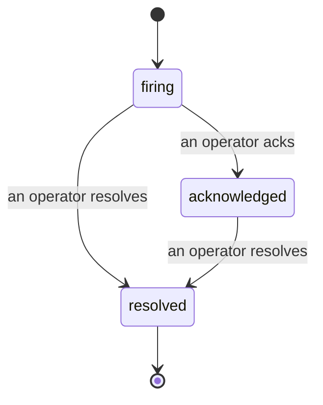

Quand une alerte se déclenche, la première question est toujours « qui s'en occupe ? » Les incidents y répondent : dès qu'un seuil est franchi, tout le monde peut voir que l'incident est ouvert, qui en est responsable, et exactement ce qui s'est passé jusqu'ici, avec un historique clair et attribué que vous pouvez transmettre directement à un post-mortem.

*La boîte de réception regroupe les incidents ouverts par état et filtre par sévérité et par assigné, afin que vous voyiez immédiatement ce qui nécessite une intervention humaine.*

## Savoir qui s'en occupe, en un coup d'œil

Fini les « est-ce que quelqu'un regarde ça ? » dans un fil de discussion. Un franchissement de seuil ouvre automatiquement un incident et le dépose dans une boîte de réception partagée, regroupée par état. Prenez-en connaissance et votre nom y apparaît, signalant au reste de l'équipe que la situation est prise en charge. La prise en charge est partagée : plusieurs opérateurs peuvent acquitter le même incident, et chacun est enregistré individuellement, de sorte qu'une cellule de crise entière apparaît nominativement sans que les intervenants se marchent dessus. Désignez un responsable unique pour le triage, et filtrez la boîte de réception par sévérité ou par assigné pour n'afficher que ce qui vous incombe.

## Toute l'histoire, dans une seule chronologie

Quand l'incident est terminé, le compte-rendu est déjà prêt. Ouvrez n'importe quel incident et vous accédez aux preuves du franchissement de seuil, à ses assignés et abonnés, à un fil de commentaires pour coordonner les actions sur place, ainsi qu'à une chronologie d'activité en ajout seul.

*Tout ce qui s'est passé, dans l'ordre, chaque ligne signée par celui ou celle qui l'a effectuée.*

Chaque action (ouverture, acquittement, résolution, etc.) est inscrite dans cette chronologie et n'est jamais supprimée. Chaque entrée est attribuée : à l'opérateur qui l'a effectuée, par e-mail, ou à **automated** pour tout ce que Failproof AI Observability a fait de manière autonome, comme l'ouverture de l'incident lors du franchissement de seuil. Rien n'est anonyme et rien n'est perdu, de sorte que le post-mortem s'écrit presque tout seul.

## Comment un incident évolue

- **Ouvert (firing) :** le franchissement de seuil ouvre l'incident et notifie vos canaux une seule fois. Les franchissements répétés sont regroupés dans le même incident et actualisent ses preuves au lieu de vous relancer indéfiniment.
- **Acquitté (acknowledged) :** un opérateur prend en charge l'incident. Il reste ouvert, et les franchissements ultérieurs mettent à jour les preuves discrètement.
- **Résolu (resolved) :** un opérateur clôture l'incident. La résolution automatique lorsque la condition se résorbe est prévue mais pas encore activée, donc un incident reste ouvert jusqu'à ce qu'un humain le résolve — ce qui maintient tout le monde honnête quant à ce qui a réellement été corrigé. Un nouvel incident peut s'ouvrir ultérieurement sur la même alerte.

Une alerte ne peut contenir qu'un seul incident ouvert à la fois, ce qui empêche une règle instable de vous noyer sous des doublons. Vous pouvez également ouvrir un incident manuellement : un incident autonome pour quelque chose qu'aucune alerte n'a détecté, ou un incident rattaché à une alerte existante, si vous disposez de `incidents:write`.

## Où le trouver

Les incidents se trouvent à `/<org-slug>/incidents`. La consultation nécessite **`incidents:read`** ; l'ouverture manuelle d'un incident nécessite **`incidents:write`** ; l'acquittement, l'assignation, les commentaires et la résolution nécessitent **`incidents:ack`**. Les anciennes clés ayant accordé le droit retraité `alerts:ack` continuent de fonctionner, car il est reconnu comme `incidents:ack`, de sorte que votre rotation d'astreinte n'a pas besoin d'être réémise.

## Voir aussi

- [Alertes](/fr/agenteye/alerts) : les règles qui ouvrent ces incidents lorsqu'un seuil est franchi.
- [Suivi des erreurs](/fr/agenteye/error-tracking) : visualisez chaque échec en un seul endroit et promouvez-en un en alerte.
- [Audits](/fr/agenteye/audits) : l'analyste planifié qui détecte les défaillances qu'aucune règle ne surveillait.