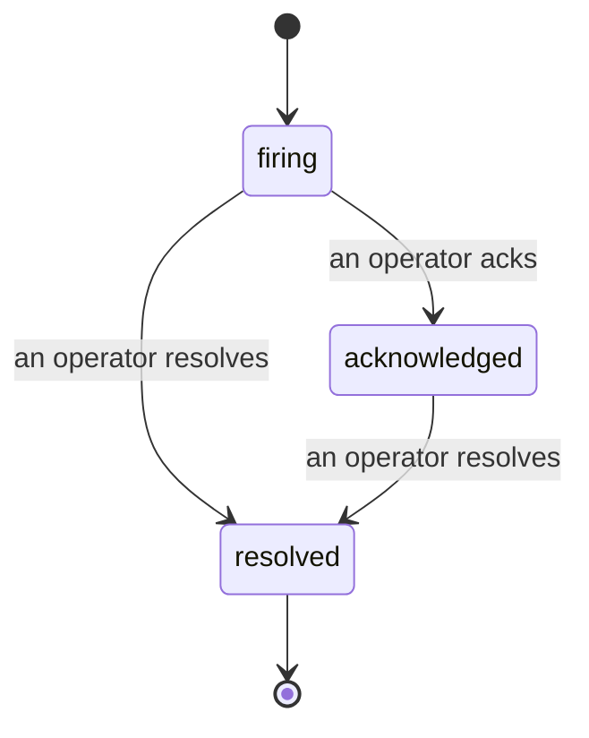

Quand une alerte se déclenche, la première question est toujours « qui s'en occupe ? » Les incidents y répondent : dès qu'un seuil est franchi, tout le monde peut voir que l'incident est ouvert, qui en est responsable, et exactement ce qui s'est passé jusqu'ici, avec un historique clair et attribué que vous pouvez transmettre directement à un post-mortem.

*La liste regroupe les incidents ouverts par état et permet de filtrer par sévérité et assignataire, afin que vous voyiez ce qui nécessite une intervention humaine immédiate.*

## Savoir qui s'en occupe, d'un coup d'œil

Plus de « quelqu'un s'en occupe ? » dans un fil de discussion. Un dépassement de seuil ouvre automatiquement un incident et le dépose dans une boîte de réception partagée, regroupée par état. Accusez réception et votre nom y est associé, indiquant au reste de l'équipe que c'est pris en charge. L'accusé de réception est partagé : plusieurs opérateurs peuvent accuser réception du même incident, chacun étant enregistré séparément, de sorte qu'une cellule de crise complète apparaît nominativement plutôt que de se superposer. Assignez un responsable pour le triage, et filtrez la liste par sévérité ou assignataire pour n'afficher que ce qui vous concerne.

## Toute l'histoire, dans une seule chronologie

Quand l'incident est terminé, le compte-rendu est déjà rédigé. Ouvrez n'importe quel incident et vous obtenez les preuves du dépassement, ses assignataires et abonnés, un fil de commentaires pour coordonner sur place, et une chronologie d'activité en ajout seul.

*Tout ce qui s'est passé, dans l'ordre, chaque ligne signée par celui qui l'a fait.*

Chaque action (ouverture, accusé de réception, résolution, etc.) est consignée dans cette chronologie et ne peut jamais être modifiée. Chaque entrée est attribuée : à l'opérateur qui l'a effectuée, par e-mail, ou à **automated** pour tout ce que Failproof AI Observability a fait de façon autonome, comme l'ouverture de l'incident lors du dépassement. Rien n'est anonyme et rien n'est perdu, de sorte que le post-mortem s'écrit presque tout seul.

## Comment un incident évolue

- **Ouvert (firing) :** le dépassement ouvre l'incident et notifie vos canaux une seule fois. Les dépassements répétés se regroupent dans le même incident et actualisent ses preuves au lieu de vous notifier encore et encore.
- **Accusé de réception (acknowledged) :** un opérateur prend en charge l'incident. Il reste ouvert, et les dépassements ultérieurs mettent à jour les preuves discrètement.
- **Résolu (resolved) :** un opérateur clôture l'incident. La résolution automatique lorsque la condition se résorbe est prévue mais pas encore activée, donc un incident reste ouvert jusqu'à ce qu'un humain le résolve, ce qui garantit que tout le monde soit honnête sur ce qui a réellement été résolu. Un nouvel incident peut s'ouvrir sur la même alerte ultérieurement.

Une alerte ne peut avoir qu'un seul incident ouvert à la fois, de sorte qu'une règle instable ne peut pas vous noyer dans des doublons. Vous pouvez également ouvrir un incident manuellement : un incident autonome pour quelque chose qu'aucune alerte n'a détecté, ou un incident rattaché à une alerte existante, si vous disposez de `incidents:write`.

## Où le trouver

Les incidents se trouvent à `/<org-slug>/incidents`. La consultation nécessite **`incidents:read`** ; l'ouverture d'un incident manuel nécessite **`incidents:write`** ; l'accusé de réception, l'assignation, les commentaires et la résolution nécessitent **`incidents:ack`**. Les clés plus anciennes ayant accordé le droit retraité `alerts:ack` continuent de fonctionner, car il est reconnu comme `incidents:ack`, de sorte que votre rotation d'astreinte n'a pas besoin d'être réémise.

## Voir aussi

- [Alertes](/fr/agenteye/alerts) : les règles qui ouvrent ces incidents lors d'un dépassement de seuil.
- [Suivi des erreurs](/fr/agenteye/error-tracking) : visualisez chaque échec en un seul endroit et promouvez-en un en alerte.
- [Audits](/fr/agenteye/audits) : l'analyste planifié qui détecte les échecs qu'aucune règle ne surveillait.