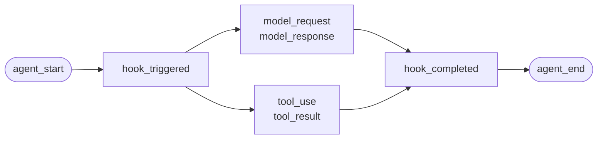
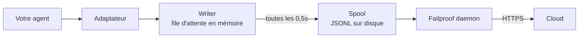

Pour un agent que vous avez développé vous-même, ou un framework pour lequel Failproof AI ne dispose pas d'adaptateur. Il n'y a rien à instrumenter : vous émettez les événements.

C'est la même API qu'appellent les quatre adaptateurs de framework en coulisses. Ce sont des tables de correspondance au-dessus d'elle.

## Installation

```bash
pip install failproofai-sdk
```

Aucun extra, aucune dépendance.

## Instrumentation

```python
import failproofai_sdk

failproofai_sdk.configure(environment="production")

with failproofai_sdk.session():                 # une exécution
    with failproofai_sdk.agent("planner"):      # une unité de travail
        with failproofai_sdk.tool_call("search", input={"q": q}) as t:
            t.output = search(q)                # un appel d'outil
```

En lisant de haut en bas, le sens est explicite :

| Envelopper dans | Pour indiquer |
| --- | --- |
| `session()` | Ces événements appartiennent à la même exécution |
| `agent()` | Quelque chose effectue un travail — donnez-lui un nom que vous reconnaîtriez dans une liste |
| `tool_call()` | Il s'agit d'un outil, et voici ce qu'il a retourné |

Et ce que chacun émet réellement :

| Portée | Émet | Rôle |
| --- | --- | --- |
| `session()` | Rien | Lie un identifiant de session, regroupant une exécution |
| `agent()` | `agent_start`, `agent_end` | Délimite une unité de travail |
| `tool_call()` | `tool_use`, `tool_result` | Délimite un outil et le mesure |

Tout ce qui se trouve à l'intérieur peut omettre `session_id` et `agent_id`. Les portées lient l'identité sur des variables de contexte, et chaque appel d'événement la relit — vous n'avez donc jamais à propager des identifiants dans vos fonctions.

Les trois fonctionnent aussi bien avec `async with` qu'avec `with`.

L'imbrication d'agents construit l'arbre. `parent_id` et la profondeur sont calculés depuis la pile :

```python
with failproofai_sdk.session():
    with failproofai_sdk.agent("supervisor"):
        with failproofai_sdk.agent("researcher"):    # parent_id = "supervisor"
            ...
```

## Fermeture d'une portée

`agent()` gère les exceptions pour vous :

| Ce qui s'est passé | Événements | Résultat |
| --- | --- | --- |
| Aucune exception levée | `agent_end` | `success` |
| `Exception` | `error`, puis `agent_end` | `failed` |
| `KeyboardInterrupt`, `SystemExit` | `error`, puis `agent_end` | `failed` |
| `CancelledError`, `GeneratorExit` | `agent_end` uniquement | `cancelled` |

L'erreur est émise avant `agent_end`, car le tableau de bord ferme le span à `agent_end` et tout ce qui suit n'est attribué à rien. Une annulation n'est pas un échec, donc les exécutions annulées ne polluent pas la surface des erreurs. L'exception est toujours re-levée : une portée n'avale jamais.

## Les méthodes d'événements

Quinze méthodes en six familles. La plupart vont par paires — vous émettez l'ouverture, puis la fermeture, et le SDK mesure l'intervalle entre les deux.

| Famille | Ouvre | Ferme | Autonome |
| --- | --- | --- | --- |
| **Agents** | `agent_start` | `agent_end` | — |
| | `agent_pause` | `agent_resume` | — |
| **Modèles** | `model_request` | `model_response` | — |
| **Outils** | `tool_use` | `tool_result` | — |
| **Hooks** | `hook_triggered` | `hook_completed` | — |
| **Humains** | `human_wait` | `human_input` | `human_pause`, `human_interrupt` |
| **Échecs** | — | — | `error` |

<Tip>
  Préférez les portées — `agent()` et `tool_call()` — partout où elles s'appliquent. Elles garantissent l'événement de fermeture même lorsque le corps lève une exception. Utilisez ces méthodes directement lorsque votre flux de contrôle ne s'imbrique pas, par exemple un appel de modèle dans une fonction auxiliaire.
</Tip>

<CodeGroup>
```python Agents
failproofai_sdk.event.agent_start(agent_id="planner", goal="find the cheapest flight")
failproofai_sdk.event.agent_end(agent_id="planner", outcome="success", summary="...")
failproofai_sdk.event.agent_pause(pause_id="p1", reason="awaiting approval")
failproofai_sdk.event.agent_resume(pause_id="p1")
```

```python Models
failproofai_sdk.event.model_request(
    model="gpt-4o-mini",
    messages=[{"role": "user", "content": "..."}],
    request_id="req-1",
)
failproofai_sdk.event.model_response(
    model="gpt-4o-mini",
    content="...",
    input_tokens=139,
    output_tokens=21,
    request_id="req-1",
    duration_ms=5202,
)
```

```python Tools
failproofai_sdk.event.tool_use(tool_name="search", tool_call_id="c1", input={"q": "..."})
failproofai_sdk.event.tool_result(tool_name="search", tool_call_id="c1", output="...")
```

```python Hooks
failproofai_sdk.event.hook_triggered(hook_name="retrieve", hook_id="h1", trigger_event="node")
failproofai_sdk.event.hook_completed(hook_name="retrieve", hook_id="h1", outcome="success")
```

```python Humans
failproofai_sdk.event.human_wait(input_id="i1", prompt="Approve?", options=["yes", "no"])
failproofai_sdk.event.human_input(input_id="i1", response="yes")
failproofai_sdk.event.human_pause(reason="operator paused the run", user_id="dana")
failproofai_sdk.event.human_interrupt(reason="operator stopped the run", at_step="step_3")
```

```python Failures
failproofai_sdk.event.error(
    error_type="TimeoutError",
    message="provider timed out after 30s",
    traceback="...",
)
```
</CodeGroup>

<Note>
  **Les deux familles humaines pointent dans des directions opposées.**

  | Méthodes | Signification |
  | --- | --- |
  | `human_wait` / `human_input` | **L'agent a sollicité une personne** — une porte d'approbation, une question de clarification |
  | `human_pause` / `human_interrupt` | **Une personne a agi sur l'agent** — un bouton d'arrêt, une pause opérateur |

  Aucun framework ne signale la deuxième paire, donc c'est toujours à vous de l'émettre.
</Note>

<Warning>
  **Passez `request_id` lorsque des appels de modèle s'exécutent en parallèle.** Sans lui, les requêtes et les réponses sont appariées dans l'ordre d'arrivée par agent — et les appels concurrents sont mal appariés, associant chaque réponse à la mauvaise requête.
</Warning>

## Exemple

Une boucle d'appels d'outils contre l'API OpenAI, sans framework d'agent :

```python
import json

import failproofai_sdk
from openai import OpenAI

failproofai_sdk.configure(environment="production")
client = OpenAI()
MODEL = "gpt-4o-mini"


def turn(messages: list):
    """Un appel de modèle, délimité par la paire."""
    failproofai_sdk.event.model_request(model=MODEL, messages=messages)
    reply = client.chat.completions.create(model=MODEL, messages=messages, tools=TOOLS)
    usage = reply.usage
    failproofai_sdk.event.model_response(
        model=MODEL,
        content=reply.choices[0].message.content or "",
        input_tokens=usage.prompt_tokens,
        output_tokens=usage.completion_tokens,
    )
    return reply.choices[0].message


with failproofai_sdk.session():
    with failproofai_sdk.agent("inventory", goal="price report"):
        for _ in range(4):          # borné ; une boucle d'agent non bornée est un bug en soi
            message = turn(messages)
            if not message.tool_calls:
                break
            messages.append(message.model_dump(exclude_none=True))
            for call in message.tool_calls:
                args = json.loads(call.function.arguments or "{}")
                with failproofai_sdk.tool_call(
                    call.function.name, tool_call_id=call.id, input=args
                ) as handle:
                    handle.output = run_tool(call.function.name, args)
                messages.append({
                    "role": "tool",
                    "tool_call_id": call.id,
                    "content": str(handle.output),
                })
```

Cela produit les six mêmes types d'événements qu'un adaptateur vous donnerait. La version exécutable complète, avec les définitions d'outils, est incluse dans le dépôt du SDK sous `docs/manual/examples/`.

## Threads et async

Les variables de contexte se propagent automatiquement dans les tâches asyncio. Elles ne se propagent pas dans les nouveaux threads, car un thread démarre avec un contexte vide.

```python
# asyncio : rien à faire
async with failproofai_sdk.session():
    await asyncio.gather(worker(1), worker(2))

# threads : enveloppez le callable
pool.submit(failproofai_sdk.propagate(work), x)
threading.Thread(target=failproofai_sdk.propagate(work)).start()
loop.run_in_executor(None, failproofai_sdk.propagate(work), x)
```

Sans `propagate()`, les événements du worker lèvent un `TypeError` indiquant le correctif à apporter plutôt que d'atterrir sur aucune session. C'est intentionnel : un événement sans session est ignoré par l'ingest et reçoit une réponse `200`, ce qui est l'échec silencieux que la couche d'identité existe précisément pour prévenir.

## Instrumenter un framework sans adaptateur

Chaque framework d'agent vous offre les mêmes trois points d'ancrage. Mappez-les et vous obtenez une trace complète — les quatre adaptateurs livrés ne font rien de plus que cela.

| Le point d'ancrage | Ce que vous écrivez | Ce qui est enregistré |
| --- | --- | --- |
| L'exécution | `session()` + `agent()` | `agent_start`, `agent_end` |
| Chaque outil | `tool_call()` | `tool_use`, `tool_result` |
| Chaque appel de modèle | La paire `model_*` | `model_request`, `model_response` |

<Steps>
  <Step title="Délimiter l'exécution">
    ```python
    with failproofai_sdk.session():
        with failproofai_sdk.agent(agent_name, goal=task):
            result = framework.run(task)
    ```
  </Step>
  <Step title="Délimiter chaque outil">
    Dans ce que le framework appelle un wrapper d'outil ou un middleware.

    ```python
    with failproofai_sdk.tool_call(name, input=args) as call:
        call.output = original(**args)
    ```
  </Step>
  <Step title="Appairer chaque appel de modèle">
    ```python
    failproofai_sdk.event.model_request(model=model, messages=messages)
    reply = provider.complete(...)
    failproofai_sdk.event.model_response(
        model=model,
        content=text,
        input_tokens=usage.prompt_tokens,
        output_tokens=usage.completion_tokens,
    )
    ```
  </Step>
</Steps>

<Tip>
  **Vous avez un nœud, une étape ou une frontière de middleware qui mérite d'être visible ?** Enveloppez-le dans une paire de hooks — `hook_triggered` / `hook_completed` — et non dans un `agent()` imbriqué. `agent_id` est une facette à faible cardinalité, et une entrée par nœud la noie. Les spans de hooks s'affichent de la même façon et vous donnent la latence par nœud.
</Tip>

<Note>
  **Le manuel et l'automatique se composent.** Un adaptateur s'exécutant dans une portée écrite à la main rejoint cette session et se rattache à cet agent, vous donnant un seul arbre plutôt que deux — utile lorsque vous instrumentez vous-même un framework en parallèle d'un framework supporté.
</Note>

<Accordion title="Pourquoi il n'y a pas d'adaptateur AutoGen">
  Deux raisons, et les trois points d'ancrage ci-dessus sont la réponse aux deux :

  - `autogen-core` n'est plus maintenu depuis septembre 2025.
  - AG2 n'expose aucun point d'enregistrement global équivalent aux hooks des autres frameworks, donc l'instrumenter signifie envelopper chaque agent à chaque site de construction.

  Mapper les points d'ancrage à la main enregistre les mêmes événements, avec la même fidélité, qu'un adaptateur livré le ferait.
</Accordion>

## Approfondir

Comment l'enregistrement fonctionne réellement. Rien de tout cela n'est nécessaire pour démarrer.

<AccordionGroup>

<Accordion title="À quoi ressemble un enregistrement, par framework" icon="eye">

Chaque enregistrement a la même forme : un span s'ouvre, le travail s'imbrique à l'intérieur, et chaque événement d'ouverture reçoit un événement de fermeture.



La **paire** est l'unité. Chaque événement de fermeture porte une durée mesurée par le SDK depuis son événement d'ouverture.

Voici une exécution réelle par framework — capturée depuis les exemples livrés avec le SDK, nom du modèle normalisé. Notez la quantité d'informations retournées par un seul appel.

<Tabs>
  <Tab title="LangGraph">
    ```text 14 events
     1  +0.000s  agent_start       LangGraph
     2  +0.001s    hook_triggered  agent
     3  +0.002s      model_request   gpt-4o-mini
     4  +3.023s      model_response  gpt-4o-mini · 21 out-tok
     5  +3.024s    hook_completed  agent
     6  +3.024s    hook_triggered  tools
     7  +3.025s      tool_use      word_count
     8  +3.025s      tool_result   word_count · ok
     9  +3.025s    hook_completed  tools
    10  +3.026s    hook_triggered  agent
    11  +3.027s      model_request   gpt-4o-mini
    12  +5.717s      model_response  gpt-4o-mini · 5 out-tok
    13  +5.720s    hook_completed  agent
    14  +5.721s  agent_end         LangGraph · success
    ```

    Les nœuds deviennent des paires de hooks, vous obtenez donc la latence par nœud sans qu'ils encombrent la liste des agents.
  </Tab>

  <Tab title="CrewAI">
    ```text 10 events
     1  +0.000s  agent_start       crew
     2  +0.050s    agent_start     analyst · under crew
     3  +0.057s      model_request   gpt-4o-mini
     4  +3.475s      model_response  gpt-4o-mini · 19 out-tok
     5  +3.478s      tool_use      lookup_metric
     6  +3.478s      tool_result   lookup_metric · ok
     7  +3.486s      model_request   gpt-4o-mini
     8  +5.694s      model_response  gpt-4o-mini · 9 out-tok
     9  +5.727s    agent_end       analyst · success
    10  +5.739s  agent_end         crew · success
    ```

    Le `role` de chaque agent devient son nom de span, la latence et la consommation de tokens se décomposent donc par rôle.
  </Tab>

  <Tab title="LlamaIndex">
    ```text 26 events
     1  +0.000s  agent_start       Agent
     2  +0.001s    hook_triggered  init_run
     4  +0.501s    hook_triggered  setup_agent
     6  +0.503s    hook_triggered  run_agent_step
     7  +0.505s      model_request   gpt-4o-mini
     8  +3.083s      model_response  gpt-4o-mini · 18 out-tok
    10  +3.197s    hook_triggered  parse_agent_output
    12  +3.355s    hook_triggered  call_tool
    13  +3.355s      tool_use      city_population
    14  +3.355s      tool_result   city_population · ok
    16  +3.356s    hook_triggered  aggregate_tool_results
       ...                        deuxième itération
    26  +7.038s  agent_end         Agent · success
    ```

    La boucle de l'agent elle-même est visible, pas seulement ses appels de modèle.
  </Tab>

  <Tab title="Pydantic AI">
    ```text 8 events
    1  +0.000s  agent_start       agent
    2  +0.001s    model_request   gpt-4o-mini
    3  +4.413s    model_response  gpt-4o-mini · 17 out-tok
    4  +4.415s    tool_use        population
    5  +4.415s    tool_result     population · ok
    6  +4.416s    model_request   gpt-4o-mini
    7  +8.118s    model_response  gpt-4o-mini · 6 out-tok
    8  +8.119s  agent_end         agent · success
    ```

    Pas de paires de hooks : Pydantic AI n'a pas de frontière de nœud ou d'étape à délimiter.
  </Tab>

  <Tab title="Custom agents">
    ```text 6 events
    1  +0.000s  agent_start       main
    2  +0.000s    tool_use        population
    3  +0.000s    tool_result     population · ok
    4  +0.000s    model_request   gpt-4o-mini
    5  +0.000s    model_response  gpt-4o-mini · 3 out-tok
    6  +0.000s  agent_end         main · success
    ```

    Vous émettez ceux-ci vous-même. Mêmes types d'événements, même fidélité — cela vous coûte les sites d'appel.
  </Tab>
</Tabs>

</Accordion>

<Accordion title="Comment une session démarre et se termine" icon="circle-play">

**Il n'y a pas d'événement de fin de session.** Une session n'est pas quelque chose que vous fermez — c'est un groupe d'événements partageant un `session_id`.

Le statut est déduit de la forme de la trace :

| Statut | Quand |
| --- | --- |
| `ongoing` | Au moins un span est encore ouvert |
| `paused` | Un `agent_pause` n'a pas de `agent_resume` correspondant |
| `error` | Rien n'est ouvert, et au moins un événement a échoué |
| `done` | Rien n'est ouvert, et rien n'a échoué |

Une session se termine donc quand toutes les paires sont fermées. Les adaptateurs émettent `agent_end` pour vous, et au démontage ils ferment tout ce qui est encore ouvert et le marquent comme incomplet — une exécution plantée se règle en `done` avec un écart visible plutôt qu'en restant bloquée.

<Note>
  C'est pourquoi une session peut s'étendre sur deux appels. Un `interrupt()` LangGraph met l'exécution en pause, le span racine reste délibérément ouvert, et l'appel de reprise le ferme. Les deux appels constituent une seule session.
</Note>

</Accordion>

<Accordion title="Identité : session_id, agent_id, et qui les génère" icon="fingerprint">

`session_id` et `agent_id` sont optionnels sur chaque méthode d'événement. Omis, ils sont résolus depuis la portée englobante :

```python
with failproofai_sdk.session():
    with failproofai_sdk.agent("planner"):
        failproofai_sdk.event.tool_use(tool_name="search", tool_call_id="c1")
```

Les passer explicitement fonctionne toujours et prend la priorité. Sans rien de lié ni passé, l'appel lève un `TypeError` indiquant le correctif plutôt que d'émettre un événement sans session, que l'ingest ignorerait tout en répondant `200`.

Les portées lient l'identité sur des variables de contexte. Celles-ci se propagent automatiquement dans les tâches asyncio mais pas dans les nouveaux threads — enveloppez un worker dans `failproofai_sdk.propagate()`.

#### Qui génère quel identifiant

| Identifiant | Généré par | Notes |
| --- | --- | --- |
| `session_id` | Vous, ou le SDK | `session("chat-42")` est utilisé tel quel ; omis, le SDK génère un `uuid4().hex` |
| `agent_id` | Vous, ou le framework | Depuis `agent("analyst")`, un `role` CrewAI, un `FunctionAgent.name`. Une valeur ressemblant à un UUID est refusée et remplacée |
| `tool_call_id`, `hook_id`, `request_id` | Vous, ou le framework | Les adaptateurs réutilisent les identifiants d'exécution propres au framework, ce qui explique pourquoi les paires survivent aux sauts de threads |
| **Identifiant d'événement** | **Cloud, à l'ingest** | Le SDK n'en émet aucun |
| **`dedup_key`** | **Cloud, à l'ingest** | Un hash de l'organisation, de la session, du timestamp, du type et du payload. C'est la véritable identité — elle fait qu'un lot réessayé se compresse plutôt que de se dupliquer |

#### Comment les adaptateurs résolvent `session_id`

La première correspondance gagne :

1. Une option `session_id` explicite
2. Des métadonnées par appel
3. La portée `session()` englobante
4. Des métadonnées du framework
5. L'identifiant d'exécution propre au framework

Il n'est jamais inventé tant que l'une de ces sources existe — un identifiant synthétisé fragmenterait une exécution sur plusieurs sessions.

#### Gardez `agent_id` à faible cardinalité

C'est la facette principale sur toutes les surfaces du tableau de bord, et une colonne `LowCardinality(String)`. Une valeur par exécution dégrade la colonne et remplit le menu déroulant de filtres avec une entrée par exécution.

Les adaptateurs défendent cette colonne pour vous :

| Ce que le framework fournit | Enregistré comme | Pourquoi |
| --- | --- | --- |
| `3f9a1c2b-…` (un UUID) | `main` | Rien de lisible à conserver |
| Une longue chaîne hexadécimale brute | `main` | Même raison |
| `agent-3f9a1c2b-…` | `agent` | Identifiant par exécution supprimé, partie lisible conservée |
| `agent-v2` | `agent-v2` | Les segments courts sont laissés tels quels |
| `step-3` | `step-3` | Même chose |

Le véritable identifiant est conservé dans `fw_agent_id` / `fw_run_id`, où il reste interrogeable sans être une facette.

<Warning>
  **Cette protection ne touche que les libellés choisis par le *framework*.** Un `agent_id` que vous passez vous-même — à `event.*`, ou à `failproofai_sdk.agent(...)` — est enregistré exactement tel que fourni. Réécrire silencieusement un argument explicite serait pire que la cardinalité qu'il prévient, donc nommez vos propres spans en conséquence.
</Warning>

</Accordion>

<Accordion title="Types d'événements, regroupés — et ce que chaque framework enregistre" icon="table">

| Groupe | Événements |
| --- | --- |
| Agents | `agent_start`, `agent_end`, `agent_pause`, `agent_resume` |
| Modèles | `model_request`, `model_response` |
| Outils | `tool_use`, `tool_result` |
| Hooks | `hook_triggered`, `hook_completed` |
| Humains | `human_wait`, `human_input`, `human_pause`, `human_interrupt` |
| Échecs | `error` |

Ce que chaque framework enregistre, mesuré depuis les exécutions ci-dessus :

| Événement | LangGraph | CrewAI | LlamaIndex | Pydantic AI | Custom |
| --- | :--: | :--: | :--: | :--: | :--: |
| Démarrage et fin d'agent | Oui | Oui | Oui | Oui | Vous |
| Requête et réponse de modèle | Oui | Oui | Oui | Oui | Vous |
| Utilisation et résultat d'outil | Oui | Oui | Oui | Oui | Vous |
| Hook déclenché et complété | Nœud | Tâche | Étape | — | Vous |
| Erreur | Oui | Oui | Oui | Oui | Automatique |
| Attente humaine et saisie | Oui | Oui | Oui | — | Vous |
| Pause et reprise d'agent | Oui | Oui | Oui | — | Vous |

Un tiret signifie que le framework n'a pas ce concept. `human_pause` et `human_interrupt` décrivent une *personne* agissant sur l'agent, ce qu'aucun framework ne signale — émettez-les vous-même.

</Accordion>

<Accordion title="Paires, corrélation et durée" icon="link">

Un événement n'arrive jamais seul. Un ouvre un span, un le ferme, et l'événement de fermeture porte une durée que le SDK mesure depuis l'événement d'ouverture.

| Ouvre | Ferme | L'événement de fermeture porte |
| --- | --- | --- |
| `agent_start` | `agent_end` | `outcome`, `summary` |
| `model_request` | `model_response` | tokens, `stop_reason`, latence |
| `tool_use` | `tool_result` | `output` ou `error`, durée |
| `hook_triggered` | `hook_completed` | `outcome`, durée |
| `agent_pause` | `agent_resume` | la durée de la pause |
| `human_wait` | `human_input` | la réponse, et le temps que la personne a mis |

<Warning>
  Un événement d'ouverture sans événement de fermeture est un span qui ne se termine jamais. La session s'affiche comme toujours en cours, à l'infini, et sa durée active continue de croître. C'est le mode d'échec à surveiller lorsque vous instrumentez manuellement.
</Warning>

#### Règles de corrélation

- Réutilisez le même `tool_call_id`, `hook_id`, `pause_id`, ou `input_id` pour l'événement de complétion correspondant.
- Le SDK calcule `duration_ms` pour `tool_result`, `hook_completed`, `agent_resume`, et `human_input`. Le passer à ces méthodes lève un `ValueError`.
- `duration_ms` **est** accepté sur `model_response`, car seul l'appelant connaît la vraie latence du fournisseur. Il doit être un entier — un float lève un `ValueError` au site d'appel, car le serveur lit la colonne comme un entier non signé 32 bits et stockerait NULL pour toute autre valeur.
- Les clés de corrélation sont délimitées par type et session, donc un appel d'outil et un hook peuvent partager un identifiant en toute sécurité, et deux sessions concurrentes peuvent réutiliser les mêmes identifiants sans collision. Elles ne sont pas délimitées par agent : une paire ouverte sous un agent et fermée sous un autre est toujours corrélée, ce qui est le cas ordinaire dans les frameworks multi-agents.
- `request_id` apparie `model_request` avec `model_response`. Sans lui, les événements de modèle sont appariés dans l'ordre par agent, donc les appels concurrents sont mal appariés.
- Une paire répartie entre plusieurs processus est toujours corrélée en aval, mais le SDK ne peut pas calculer sa durée intra-processus.
- La table des opérations en attente contient au maximum 10 000 démarrages et expulse l'entrée la plus ancienne quand elle est pleine.

</Accordion>

<Accordion title="Contenu du package, et comment instrument() trouve votre framework" icon="box">

Installer `failproofai-sdk` installe tout, les quatre adaptateurs inclus. Les extras récupèrent le **framework**, pas l'adaptateur.

```python
import failproofai_sdk        # ne charge rien en dehors de la bibliothèque standard
failproofai_sdk.instrument()  # importe uniquement les adaptateurs dont vous avez besoin
```

`import failproofai_sdk` est contractuellement sans dépendance, imposé par un test qui installe le wheel construit avec `--no-deps` et un autre qui prouve qu'aucun framework n'atteint `sys.modules`.

<Warning>
  Il n'y a pas d'attribut `failproofai_sdk.crewai`. Les adaptateurs ne sont délibérément pas exposés sur le package de niveau supérieur : y accéder importerait le framework comme effet secondaire d'un accès à un attribut, brisant la promesse zéro-dépendance. Utilisez `instrument()`.
</Warning>

```python
failproofai_sdk.instrument()              # tout framework déjà importé
failproofai_sdk.instrument("crewai")      # exactement un, par nom
failproofai_sdk.uninstrument("crewai")    # le remettre en place
```

| Nom | Accepte aussi |
| --- | --- |
| `langchain` | `langgraph`, `langchain_core` |
| `crewai` | — |
| `llama_index` | `llamaindex`, `llama-index` |
| `pydantic_ai` | `pydantic-ai`, `pydanticai` |

La détection automatique lit `sys.modules`, pas la liste des packages installés, donc un framework installé mais jamais importé n'est pas instrumenté et n'est jamais importé en votre nom. Pour voir ce qui est connecté :

```python
from failproofai_sdk.integrations import active, available

available()   # ('crewai', 'langchain', 'llama_index', 'pydantic_ai')
active()      # ('langchain',)
```

<Note>
  **`instrument("crewai")` sur une machine sans CrewAI ne lève pas d'exception.** Il enregistre un avertissement et retourne `()`, donc un framework manquant ne fait jamais tomber un processus qui instrumente aussi d'autres frameworks.

  L'avertissement contient l'`ImportError` sous-jacent, et ce message nomme la commande d'installation exacte — le correctif est donc dans vos logs, pas caché.

  ```text
  ImportError: failproofai_sdk: cannot instrument 'crewai' because 'crewai.events'
  is not importable. Install it with:  pip install 'failproofai_sdk[crewai]'
  ```

  Définissez `FAILPROOFAI_SDK_STRICT=1` pour qu'il lève une exception à la place. Ce drapeau est lu **une seule fois et mis en cache**, donc exportez-le avant le démarrage de votre processus plutôt que de le définir en cours d'exécution.
</Note>

<Warning>
  **`instrument()` doit être appelé *après* l'import de votre framework.** La détection automatique lit `sys.modules`, donc un appel nu avant l'import ne trouve rien, n'installe rien, et retourne `()`.
</Warning>

<CodeGroup>
```python Wrong
import failproofai_sdk
failproofai_sdk.instrument()   # sys.modules n'a pas encore langchain -> ()

import langchain               # trop tard, rien n'est connecté
```

```python Right
import langchain               # importez d'abord le framework
import failproofai_sdk

failproofai_sdk.instrument()   # le trouve -> ('langchain',)
```

```python Right, order-proof
import failproofai_sdk

# Le nommer importe l'adaptateur à la demande, donc cela fonctionne depuis n'importe où.
failproofai_sdk.instrument("langchain")
```
</CodeGroup>

Faites une erreur ici et le processus s'exécute avec le SDK importé, l'adaptateur apparemment installé, et **pas un seul événement émis**. Il enregistre un avertissement qui l'indique explicitement — vérifiez donc vos logs en premier lorsqu'une exécution n'enregistre rien.

</Accordion>

<Accordion title="Comment les événements atteignent Cloud" icon="cloud-upload">



| Étape | Rôle | S'exécute dans |
| --- | --- | --- |
| Adaptateur | Traduit un callback du framework en l'un des 15 types d'événements | Votre processus |
| Writer | Met en file d'attente, regroupe, écrit le JSONL de façon atomique | Votre processus, thread d'arrière-plan |
| Spool | Transfert durable, survit à la sortie de votre processus | Disque local |
| Daemon | Surveille le spool, envoie les lots, supprime ce qui a été envoyé | Votre machine |
| Ingest | Assigne un identifiant de ligne et une clé de déduplication, promeut les colonnes interrogeables | Cloud |

Le spool est ce qui rend cela sûr : votre agent ne se bloque jamais sur le réseau, et une panne Cloud signifie un répertoire qui grossit plutôt que des événements perdus.

Chaque flush écrit un fichier de lot, `.tmp` d'abord, puis `fsync`, puis un renommage atomique :

```text
~/.failproofai/custom-agents/events/
  event-2026-08-20T10-15-00-123Z-48213-0.jsonl
```

Le daemon ne récupère que les `.jsonl`, il ne peut donc jamais lire un fichier partiellement écrit. Le nom du fichier contient un timestamp, un identifiant de processus et un numéro de séquence, de sorte que deux processus flushing dans la même milliseconde ne peuvent pas entrer en collision. La file d'attente est limitée à 10 000 événements ; au-delà, elle abandonne les plus anciens et enregistre un log.

<Warning>
  **`collector.redact` est à `minimal` par défaut pour les événements SDK également.** Le SDK expurge avant d'écrire un lot sur disque, et le daemon répète le même passage déterministe avant l'upload afin que les lots d'anciens SDK soient protégés.
</Warning>

Le daemon lit chaque lot et applique la rédaction en mémoire avant l'upload. Il ne réécrit pas le fichier spool qu'il a lu.

| Événements | Écrits par | Où la rédaction minimale s'exécute |
| --- | --- | --- |
| Transcriptions de sessions CLI | Le daemon | Avant que le daemon écrive le lot |
| Activité de hooks | Le daemon | Avant que le daemon écrive le lot |
| **Tout ce que le SDK émet** | **Votre processus** | **Avant que le SDK écrive le lot et à nouveau avant l'upload par le daemon** |

Mettez `collector.redact` à `off` uniquement lorsque des payloads verbatim sont une exigence explicite ; le SDK et le daemon honorent tous les deux ce paramètre. La rédaction minimale attrape les clés d'API courantes, les tokens bearer, les JWT et les affectations de secrets. Elle ne peut pas identifier une prose sensible arbitraire.

<Tip>
  **Vous contrôlez les payloads à la source, à deux endroits :**

  - Désactivez la capture de contenu sur l'adaptateur. **Le nom de l'option diffère, et un adaptateur n'en a aucune** — ce n'est pas un interrupteur universel unique :
    - LangChain / LangGraph, Pydantic AI — `capture_content=False`
    - LlamaIndex — `capture_messages=False`
    - CrewAI — **aucun interrupteur de contenu du tout** ; `session_id` est la seule option qu'il lit, donc les prompts et les complétions sont toujours enregistrés.

    `instrument()` ignore les options qu'un adaptateur ne lit pas, donc passer le mauvais nom ne lève rien et ne change rien.
  - Ne donnez pas le secret à `input=` en premier lieu.

  `collector.redact` est une défense en profondeur, pas un substitut à l'un ou l'autre.
</Tip>

<Warning>
  **Un répertoire spool vide est l'état sain.** Ne l'utilisez pas pour vérifier la livraison.
</Warning>

Le daemon supprime chaque lot dans les millisecondes suivant son envoi, donc un `ls` est en compétition avec le collecteur et ne montre qu'une fraction de ce que vous avez émis — impossible à distinguer d'un SDK qui n'a rien enregistré.

Pour confirmer que les événements sont bien arrivés, consultez le tableau de bord. Pour observer le remplissage du spool, arrêtez d'abord le daemon.

</Accordion>

<Accordion title="Quand l'instrumentation échoue" icon="triangle-alert">

Chaque callback s'exécute dans un wrapper dont le seul rôle est de re-lever, donc votre appel se trouve dans exactement un `try` et tout ce que fait le SDK se passe en dehors.

| Ce qui se passe | Résultat |
| --- | --- |
| Un hook lève une exception | Enregistré une fois avec sa trace. Votre appel n'est pas affecté |
| Le même hook lève trois fois | Ce hook est désactivé pour le reste du processus, avec une ligne d'erreur |
| `FAILPROOFAI_SDK_STRICT=1` est défini | L'exception est re-levée à la place |
| Une version de framework est hors de la plage testée | Avertit une fois, instrumente quand même |
| Une seule capacité est manquante | Ce hook est désactivé, jamais l'adaptateur entier |

Le comportement par défaut est correct en production et incorrect lors du débogage, car il ne peut que prouver « ça n'a pas planté ». Définissez `FAILPROOFAI_SDK_STRICT=1` pour rendre bruyant un échec silencieux.

</Accordion>

</AccordionGroup>

## Problèmes courants

<AccordionGroup>
  <Accordion title="Un span ne se termine jamais">
    Un événement d'ouverture n'a pas d'événement de fermeture : un `model_request` sans `model_response`, ou un `tool_use` sans `tool_result`. Utilisez les portées, qui garantissent la paire même lorsque le corps lève une exception. Si vous appelez les méthodes d'événements directement, utilisez `try` et `finally`.
  </Accordion>

  <Accordion title="Passer duration_ms lève un ValueError">
    Il est mesuré depuis l'événement d'ouverture correspondant, donc il est refusé sur `tool_result`, `hook_completed`, `agent_resume`, et `human_input`. Il est accepté sur `model_response`, car seul vous connaissez la vraie latence du fournisseur, et il doit être un entier.
  </Accordion>

  <Accordion title="Les événements d'un thread worker lèvent un TypeError">
    Le thread n'a jamais hérité du contexte. Enveloppez le callable dans `failproofai_sdk.propagate()`. Voir [Threads et async](#threads-and-async).
  </Accordion>

  <Accordion title="Un champ supplémentaire a disparu ou en a écrasé un autre">
    Les champs supplémentaires sont fusionnés en dernier, donc un champ nommé comme un vrai champ tel que `model` ou `outcome` l'écraserait et modifierait une colonne stockée. Préfixez les vôtres ; les adaptateurs utilisent le préfixe `fw_`.
  </Accordion>

  <Accordion title="Le filtre d'agents contient des milliers d'entrées">
    `agent_id` est une facette à faible cardinalité et vous y avez mis un identifiant d'exécution. Utilisez un nom de rôle ou de nœud et placez le vrai identifiant dans un champ de payload.
  </Accordion>
</AccordionGroup>

## Étapes suivantes

<Columns cols={3}>
  <Card title="Comment ça fonctionne" icon="workflow" href="/fr/reference/custom-agents">
    Paires, identifiants, cycle de vie de session et livraison.
  </Card>
  <Card title="Lire une trace" icon="route" href="/fr/sessions/read-a-trace">
    Suivez la causalité à travers la session que vous venez de capturer.
  </Card>
  <Card title="Adaptateurs de framework" icon="plug" href="/fr/start/integrations">
    LangGraph, CrewAI, LlamaIndex et Pydantic AI.
  </Card>
</Columns>