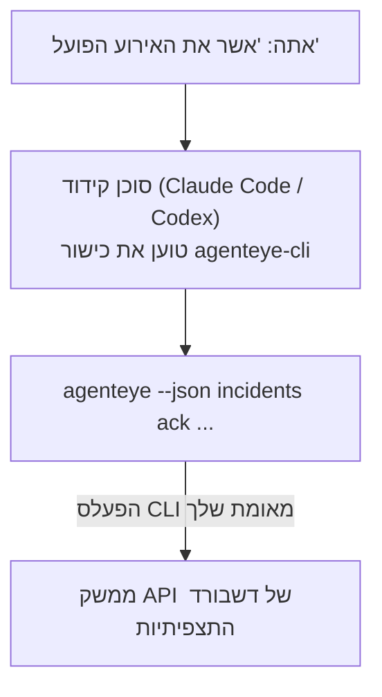

---
---
title: "כישור CLI לתצפיתיות Failproof AI של סוכן"
description: "שאל את סוכן הקידוד שלך \"האם משהו התקלקל היום?\" והנח לו להשיב מנתוני התצפיתיות החיים שלך ב-Failproof AI, ללא פקודות שצריך לזכור."
---

שאל את סוכן הקידוד שלך *"האם משהו התקלקל היום?"* והנח לו להשיב מנתוני התצפיתיות החיים שלך ב-Failproof AI, ללא פקודות שצריך לזכור. **כישור CLI לתצפיתיות Failproof AI** (`agenteye-cli`) הוא *Agent Skill*: תיקייה קטנה של הוראות שסוכן קידוד כמו Claude Code או Codex טוען לפי הצורך. הוא מלמד את הסוכן להפעיל את הפריסה שלך של Observability דרך [ה-`agenteye` CLI](/he/agenteye/cli) מבקשות בשפה טבעית כמו *"תן ל-CI מפתח שיכול רק לדחוף אירועים"* או *"אשר את האירוע הפועל והקצה אותו אלי."*

זה **לא** שירות או בינארי נפרד; אין כלום לפרוס. הוא רוכב על ה-CLI שכבר התקנת: הסוכן מפעיל `agenteye --json …`, מנתח את ה-JSON נקי, והשיב לך בטקסט. כל מה שהוא יכול לעשות, אתה יכול לעשות בעצמך על ידי הקלדת אותן פקודות.

---

## כיצד זה קשור לממשקי Failproof AI Observability האחרים

Failproof AI Observability נותנת לך ארבע דרכים להגיע לאותם נתונים ובקרות. הם משלימים זה את זה:

| ממשק | מה זה | היכן זה רץ | השתמש בו כאשר |
|---|---|---|---|
| **[CLI](/he/agenteye/cli)** | הפניה לפקודה/דגל עבור `agenteye` | הטרמינל שלך | אתה רוצה להריץ או לתסריט פקודה ספציפית |
| **[CLI recipes](/he/agenteye/cli-recipes)** | דוגמאות `jq`/pipeline להעתקה והדבקה | הטרמינל שלך / סקריפטים | אתה מחבר את ה-CLI לאוטומציה |
| **CLI skill** (מסמך זה) | דלת כניסה בשפה טבעית על ה-CLI | סוכן הקידוד שלך, בתחנת העבודה שלך | אתה רוצה *פשוט לשאול* ולהנח לסוכן לבחור את הפקודה |
| **[Evaluator skill](/he/agenteye/evaluator-skill)** | כישור אחות שמעצב ובונה את שירות הניקוד שלך | סוכן הקידוד שלך, בתחנת העבודה שלך | אתה רוצה *לייצר* ניקוד eval במקום לקרוא אותו |
| **[Python SDK skill](/he/agenteye/python-sdk-skill)** | כישור אחות שמחוייב את הסוכן כדי שיעמיד טלמטריה בהכל | סוכן הקידוד שלך, בתחנת העבודה שלך | אתה רוצה שהסוכן שלך *יייצר* את האירועים שכישור זה קורא |
| **[עוזר AI בדשבורד](/he/agenteye/assistant)** | צ'אט מוטבע בדשבורד | צד שרת (בדשבורד) | אתה רוצה שאלות וטיובות בדשבורד על הנתונים שלך |

לכישור עצמו אין הרשאות משלו; הוא פשוט הופך את המילים שלך לקריאות CLI שרצות כמוך:



### לעומת עוזר AI בדשבורד: הבחנה חשובה

אלו שני כלים שונים עם רדיוסי פיצוץ שונים מאוד:

- **עוזר AI בדשבורד** ([עוזר AI](/he/agenteye/assistant)) הוא צ'אט מוטבע בדשבורד, מופעל על ידי שירות הסוכן. הוא **קריאה בלבד ועם שערים לכתיבה**: הוא יכול לטיוטה שאילתות שמורות ודשבורדים, אך כל כתיבה משהה לאישור הקליק המפורש שלך, והוא לעולם לא מוחק. הוא מוגבל בהרשאה `agent:use` וחוקר רק נתונים עבור הארגון שאתה צופה.
- **כישור CLI** רץ בתחנת העבודה *שלך* בתוך סוכן הקידוד *שלך* ויוביל את ה-`agenteye` CLI כמו **אתה**. הוא יכול לבצע את **משטח ה-CLI המלא, כולל מוטציות** (create/rotate/disable מפתחות API, שינוי הגדרות ארגון, פתרון אירועים, מחיקת שאילתות שמורות), מוגבל רק בהרשאות של כניסת ה-CLI שלך. התייחס אליו בדיוק כפי שהיית מתייחס להרצת אותן פקודות ביד.

---

## דרישות מוקדמות

1. **ה-`agenteye` CLI מותקן** וב-`PATH` (ראה את ההפניה [CLI](/he/agenteye/cli): `pipx install agenteye`).
2. **כתובת ה-דשבורד שלך מוגדרת** (`AGENTEYE_DASHBOARD_URL`, או הסוכן מעביר `--base-url`).
3. **הפעלס מחובר**: הרץ `agenteye login` בעצמך תחילה. הכישור **לא יכול** להשלים את כניסת קוד חד פעמי בדוא"ל עבורך; הוא יגיד לך להריץ `agenteye login` אם ההפעלס חסר או פג (קוד יציאה CLI `4`).

---

## היכן להשיג אותו

הכישור פורסם בהאסף כישורים ציבורי של Failproof AI:

**[github.com/FailproofAI/skills](https://github.com/FailproofAI/skills)** → [`skills/agenteye-cli/`](https://github.com/FailproofAI/skills/tree/main/skills/agenteye-cli)

שום דבר בו אינו מוגבל — המאגר הוא ציבורי והכישור לא צריך כל אישור משלו, מכיוון שהוא רק יוביל את ה-`agenteye` CLI **הציבורי** נגד *הדשבורד שלך*, תוך שימוש בהפעלס *שאתה* התחברת איתו. אתה לא צריך לבקש את זה מאף אחד.

שים לב שהוא מגיע כתיקייה משלו ו**אינו** בתוך הפקד `pipx install agenteye`, אז אל תחפש אותו שם.

## התקנת הכישור

הנתיב המהיר ביותר הוא [CLI ה-`skills`](https://skills.sh), שמביא את התיקייה ומניח אותה היכן שהסוכן שלך מחפש:

```bash
# Claude Code, פרויקט זה בלבד
npx skills add FailproofAI/skills --skill agenteye-cli -a claude-code

# כל פרויקט (מתקין ל-~/.claude/skills/)
npx skills add FailproofAI/skills --skill agenteye-cli -a claude-code -g --copy

# Codex במקום זאת
npx skills add FailproofAI/skills --skill agenteye-cli -a codex
```

לאחר מכן נהל אותו כמו כל כישור אחר:

```bash
npx skills list -a claude-code      # מה מותקן
npx skills update agenteye-cli      # משוך את גרסה העדכנית
npx skills remove agenteye-cli      # הסר אותו
```

מעדיף להתקין ביד? Agent Skill הוא פשוט תיקייה המכילה `SKILL.md` (בתוספת הפניות אופציונליות), כך שהעתקה עובדת גם:

- **Claude Code**: שם את התיקייה `agenteye-cli/` ב-`~/.claude/skills/` (כל פרויקט) או `<your-repo>/.claude/skills/` (אותו מאגר בלבד). Claude Code גילוי אוטומטי — אמת עם רשימת `/skills`, או פשוט שאל שאלה המתאימה לתיאור שלו.
- **Codex (OpenAI)**: Codex קורא את אותו `SKILL.md`. ה-`agents/openai.yaml` הכלול קובע `allow_implicit_invocation: true`, כך ש-Codex בחירה אוטומטית בכישור כשמשימה תואמת; אחרת להזמין אותו במפורש כ-`$agenteye-cli`.

---

## בטיחות: מוטציות אינן מהצגות כאשר סוכן מריץ את ה-CLI

> **אזהרה:** קרא את זה לפני שתתן לסוכן לבצע שינויים.

ה-`agenteye` CLI בדרך כלל שואל *"האם אתה בטוח?"* לפני פעולה הרסנית. הוא **דילוגים אוטומטיים על אישור זה בכל פעם שהוא אינו מצורף לטרמינל (שזו בדיוק איך סוכן קידוד מריץ אותו), ו-`--json` דילוגים גם כן.** אז ההנחיה בטיחות תהיה **לא** חריגה עבור הסוכן.

הכישור כתוב כדי לפצות: הוא מחויב להצהיר על הפקודה המדויקת שהוא ירוץ ולקבל את ה-**OK** המפורש שלך לפני כל שינוי מצב. שמור על משמעת זו. כאשר אתה מעביר את Failproof AI Observability דרך סוכן, *אתה* הוא שלב האישור. פקודות שינוי המצב לצפייה:

- `keys create` / `update` / `disable` / `regenerate`
- `users create` / `update` / `disable` / `enable`
- `settings set`
- `alerts create` / `update` / `delete` / `test`
- תת-פקודות כתיבה `incidents`: `ack` / `assign` / `resolve` / `open` / `comment-add` / `comment-delete` / `subscribe` / `unsubscribe`
- `query create` / `update` / `delete`
- `agent rename` / `delete`
- `orgs switch`

הכל תחת **Observe** (`events`, `sessions`, `evals`, `errors`, `list`, `whoami`, `orgs list/current/perms`) הוא קריאה בלבד ולא משנה כלום.

מכיוון שהסוכן פועל כמו **אתה**, הוא יכול רק לעשות מה שההכנסה שלך מורשית לעשות; הרשאות מתורגמות **לכל ארגון** (ראה [מפתחות API](/he/agenteye/api-keys)). פקודה שאתה חסר הרשאה לה מחזירה קוד יציאה `5` עם הרשאה מדויקת בשם, כך שהסוכן יכול לומר לך בדיוק למה לבקש מ-admin במקום להיכשל ערפילי.

---

## מה אתה יכול לשאול אותו

הנה איך נראה סיבוב אמיתי, קריאה, ואחר כך שינוי שמחכה לאישור שלך:

```text
אתה   ▸ האם משהו התקלקל באחרון ביום?

סוכן ▸ מריץ: agenteye --json errors --since 24h --aggregate
        3 סוגי שגיאה ב-24 שעות האחרונות. הגדול ביותר הוא TimeoutError
        (18 פגיעות, הכל ב-checkout-agent), ואחר כך RateLimited (5).
        רוצה את ההפעלות הכושלות עבור TimeoutError?

אתה   ▸ תן ל-CI מפתח שיכול רק לדחוף אירועים.

סוכן ▸ זה יוצר מפתח API. אני אריץ:
          agenteye keys create ci --add events:add
        OK להמשיך?

אתה   ▸ כן

סוכן ▸ בוצע. מפתח "ci" נוצר עם events:add בלבד.
        הסוד מוצג רק פעם אחת, אז שמור אותו עכשיו. אני לא יכול להדפיס אותו מחדש.
```

הכישור ממפה כל כוונה בשפה טבעית לפקודת `agenteye` הנכונה, גילוי ערכים חוקיים תחילה (`list <kind>`, `whoami`) כדי שלא לנחש, והצהרה את הפקודה המדויקת לפני כל שינוי. עוד דוגמאות:

- *"האם משהו התקלקל / נכשל ב-24 השעות האחרונות?"* → `errors --since 24h --aggregate`, לאחר מכן פירוט.
- *"למה הפעלה `run-001` נכשלה?"* → `events --session-id run-001 --all` + `evals --session-id run-001`.
- *"איך האיכות מתפתחת השבוע?"* → `evals --aggregate --since 7d`, לאחר מכן עמוק לרצים בדירוג נמוך.
- *"תן ל-CI מפתח שיכול רק לדחוף אירועים."* → `keys create ci --add events:add` (הוא מצהיר על הפקודה, ואחר כך יוצר אותה ותופס את הסוד החד פעמי).
- *"למי יש גישה? הוציא את דנה לקריאה בלבד."* → `users list` → `users update dana@… --permission-set read-only` (לאחר אישור איתך).
- *"אשר את האירוע הפועל והקצה אותו אלי."* → `incidents list --state firing` → `incidents ack <id>` / `incidents assign <id> you@…`.

לפקודות המדויקות, דגלים וצורות JSON מאחורי אלה, ראה את ההפניה [CLI](/he/agenteye/cli) ו-[CLI recipes עבור סוכנים](/he/agenteye/cli-recipes).

---

## שלבים הבאים

- **[CLI](/he/agenteye/cli)**: הפניה מלאה לפקודה ודגל עבור `agenteye`.
- **[CLI recipes לסוכנים](/he/agenteye/cli-recipes)**: דוגמאות `jq` וטיפול בקוד יציאה להעתקה והדבקה.
- **[כישור סוכן Evaluator](/he/agenteye/evaluator-skill)**: כישור האחות, לבנייה המעריך שאת הניקוד שלו `agenteye evals` קורא.
- **[כישור סוכן Python SDK](/he/agenteye/python-sdk-skill)**: כישור האחות, לביצוע חיוב סוכן כך שהוא פולט את הטלמטריה שה-`agenteye` קורא.
- **[עוזר AI](/he/agenteye/assistant)**: עוזר בדשבורד (לא להתבלבל עם כישור טרמינל זה).
- **[מפתחות API](/he/agenteye/api-keys)**: מודל ההרשאה לכל ארגון שמגביל מה הכישור יכול לעשות.