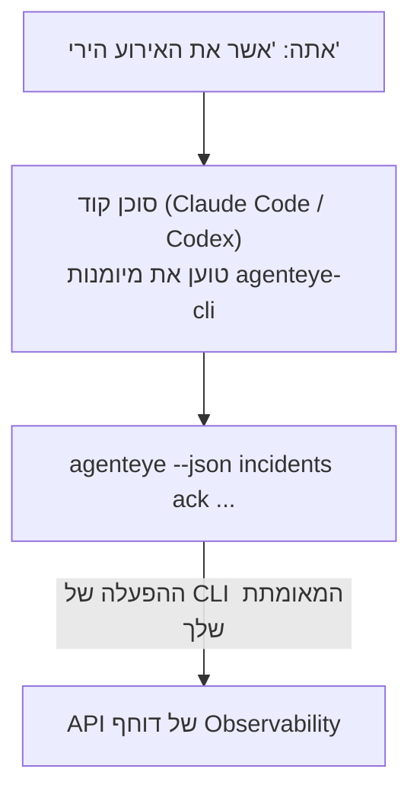

שאל את סוכן הקוד שלך *"האם משהו השתבר היום?"* והנח לו לענות מנתוני Failproof AI Observability החיים שלך, ללא צורך לזכור פקודות. **מיומנות Failproof AI Observability CLI** (`agenteye-cli`) היא *Agent Skill*: תיקייה קטנה של הוראות שסוכן קוד כמו Claude Code או Codex טוען לפי הביקוש. היא מלמדת את הסוכן להפעיל את הפריסה של Observability שלך דרך [CLI של `agenteye`](/he/agenteye/cli) מבקשות באנגלית פשוטה כמו *"תן ל-CI מפתח שיכול רק לדחוף אירועים"* או *"אשר את האירוע הירי והקצה אותו אלי."*

זה **לא** שירות או בינארי נפרד; אין שום דבר לפרוס. הוא עובד על גבי CLI שכבר התקנת: הסוכן משדר ל-`agenteye --json …`, ניתח את ה-JSON הנקי, וענה לך בטקסט. כל מה שהוא יכול לעשות, אתה יכול לעשות בעצמך על ידי הקלדת אותן פקודות.

---

## כיצד זה קשור לממשקי Failproof AI Observability האחרים

Failproof AI Observability נותן לך ארבע דרכים להגיע לאותם נתונים וביקורות. הם משלימים זה את זה:

| ממשק | מה זה | איפה זה עובד | בחר בו כאשר |
|---|---|---|---|
| **[CLI](/he/agenteye/cli)** | הייחוס לפקודה/דגל עבור `agenteye` | הטרמינל שלך | אתה רוצה להפעיל או לכתוב סקריפט לפקודה ספציפית |
| **[CLI recipes](/he/agenteye/cli-recipes)** | דפוסי `jq`/צינור להעתקה-הדבקה | הטרמינל שלך / סקריפטים | אתה קושר את CLI לאוטומציה |
| **CLI skill** (מסמך זה) | דלת כניסה בשפה טבעית ל-CLI | סוכן הקוד שלך, בתחנת העבודה שלך | אתה רוצה *פשוט לשאול* והנח לסוכן לבחור בפקודה |
| **[מיומנות Evaluator](/he/agenteye/evaluator-skill)** | מיומנות אחות שמעצבת ובונה את שירות הדירוג שלך | סוכן הקוד שלך, בתחנת העבודה שלך | אתה רוצה *להפיק* ניקוד eval במקום לקרוא אותו |
| **[מיומנות Python SDK](/he/agenteye/python-sdk-skill)** | מיומנות אחות שמעצבת את הסוכן שלך כך שהוא פולט טלמטריה בכלל | סוכן הקוד שלך, בתחנת העבודה שלך | אתה רוצה שהסוכן שלך *יפיק* את האירועים שמיומנות זו קוראת |
| **[עוזר AI בדוחף](/he/agenteye/assistant)** | צ'אט משובץ בדוחף | שרת-צד (בדוחף) | אתה רוצה Q&A בדוחף על הנתונים שלך |

למיומנות עצמה אין הרשאות משלה; היא פשוט הופכת את המילים שלך לקריאות CLI שפועלות כאתה:



### לעומת עוזר ה-AI בדוחף: הבדל חשוב

אלו שני כלים שונים עם רדיוסי התפוצה שונים מאוד:

- **עוזר ה-AI בדוחף** ([עוזר AI](/he/agenteye/assistant)) הוא צ'אט משובץ בדוחף, מגובה על ידי שירות הסוכן. הוא **קריאה בלבד בתוספת כתיבה כשאישור:** הוא יכול לעצב שאילתות שמורות ודוחפים, אך כל כתיבה מושהית לאישור הלחיצה המפורש שלך, וזה לעולם לא מוחק. הוא מגודר על ידי הרשאת `agent:use` ורואה רק נתונים עבור הארגון שאתה צופה.
- **מיומנות CLI** עובדת בתחנת העבודה *שלך* בתוך סוכן הקוד *שלך* ומניעה את CLI של `agenteye` כ**אתה**. היא יכולה לבצע את **משטח המלא של CLI, כולל מוטציות** (יצור/סיבוב/השבתת מפתחות API, שינוי הגדרות ארגון, פתרון אירועים, מחיקת שאילתות שמורות), מוגבלת רק על ידי הרשאות של כניסתך ל-CLI. התייחס אליה בדיוק כמו שהיית מתייחס להפעלת אותן פקודות ביד.

---

## דרישות מוקדמות

1. **`agenteye` CLI מותקן** וב-`PATH` (ראה ייחוס [CLI](/he/agenteye/cli): `pipx install agenteye`).
2. **כתובת ה-URL של הדוחף שלך** מוגדרת (`AGENTEYE_DASHBOARD_URL`, או הסוכן מעביר `--base-url`).
3. **הפעלה מחובר:** הרץ `agenteye login` בעצמך קודם. המיומנות **לא יכולה** להשלים את כניסת קוד חד-פעמי בדוא"ל עבורך; היא תגיד לך להריץ `agenteye login` אם ההפעלה חסרה או פגה (קוד יציאה של CLI `4`).

---

## איפה להשיג את זה

המיומנות פורסמה באוסף המיומנויות הציבורי של Failproof AI:

**[github.com/FailproofAI/skills](https://github.com/FailproofAI/skills)** → [`skills/agenteye-cli/`](https://github.com/FailproofAI/skills/tree/main/skills/agenteye-cli)

שום דבר בקשור אליו לא מגודר — המאגר ציבורי והמיומנות לא צריכה כל אישור משלה, כי היא רק מניעה את CLI `agenteye` **הציבורי** לעומת הדוחף *שלך*, באמצעות ההפעלה *שאתה* התחברת אליה. אתה לא צריך לשאול את זה מאנשים.

שימו לב שהוא משנה כתיקייה משלו והוא **לא** בתוך הארוזה `pipx install agenteye`, אז אל תחפש אותו שם.

## התקנת המיומנות

הדרך המהירה ביותר היא CLI של [`skills`](https://skills.sh), שמשדר את התיקייה ומוריד אותה היכן שהסוכן שלך מחפש:

```bash
# Claude Code, פרויקט זה בלבד
npx skills add FailproofAI/skills --skill agenteye-cli -a claude-code

# כל פרויקט (מתקין ל-~/.claude/skills/)
npx skills add FailproofAI/skills --skill agenteye-cli -a claude-code -g --copy

# Codex במקום זאת
npx skills add FailproofAI/skills --skill agenteye-cli -a codex
```

ואז נהל אותה כמו כל מיומנות אחרת:

```bash
npx skills list -a claude-code      # מה מותקן
npx skills update agenteye-cli      # משוך את הגרסה העדכנית
npx skills remove agenteye-cli      # הסר אותה
```

מעדיף להתקין ביד? Agent Skill היא פשוט תיקייה המכילה `SKILL.md` (בתוספת התייחסויות אופציונליות), אז העתקה עובדת גם:

- **Claude Code**: שים את תיקיית `agenteye-cli/` ב-`~/.claude/skills/` (כל פרויקט) או `<your-repo>/.claude/skills/` (רק אותו repo). Claude Code חוקר זאת באופן אוטומטי — אמת עם רשימת `/skills`, או פשוט שאל שאלה שתואמת את התיאור שלה.
- **Codex (OpenAI)**: Codex קורא את `SKILL.md` זהה. ה-`agents/openai.yaml` המצורף קובע `allow_implicit_invocation: true`, אז Codex בוחר באופן אוטומטי את המיומנות כאשר משימה תואמת; אחרת יש לזמן אותה במפורש כ-`$agenteye-cli`.

---

## בטיחות: מוטציות לא מהן כאשר סוכן מריץ את CLI

> **אזהרה:** קרא את זה לפני שאתה נותן לסוכן לבצע שינויים.

CLI של `agenteye` בדרך כלל שואל *"האם אתה בטוח?"* לפני פעולה הרסנית. הוא **דוחה באופן אוטומטי את האישור בכל פעם שהוא לא מחובר לטרמינל (שזה בדיוק איך סוכן קוד מריץ אותו), ו-`--json` דוחה אותו גם.** אז הבטחון בהודעה לא **יופעל** עבור הסוכן.

המיומנות כתובה לפיצוי: היא מונחית להצהיר על הפקודה המדויקת שהיא תריץ ותקבל את **ה-OK המפורש שלך לפני כל שינוי מצב**. שמור על הדיסציפלינה. כאשר אתה מניע את Failproof AI Observability דרך סוכן, *אתה* הצעד האישור. פקודות שינוי המצב שיש להיזהר מהן:

- `keys create` / `update` / `disable` / `regenerate`
- `users create` / `update` / `disable` / `enable`
- `settings set`
- `alerts create` / `update` / `delete` / `test`
- תת-הפקודות הכתיבה של `incidents`: `ack` / `assign` / `resolve` / `open` / `comment-add` / `comment-delete` / `subscribe` / `unsubscribe`
- `query create` / `update` / `delete`
- `agent rename` / `delete`
- `orgs switch`

כל דבר תחת **Observe** (`events`, `sessions`, `evals`, `errors`, `list`, `whoami`, `orgs list/current/perms`) קריאה בלבד ולא משנה דבר.

מכיוון שהסוכן פועל כ**אתה**, הוא יכול רק לעשות מה שהכניסה שלך מורשית לעשות; הרשאות מחוברות **לכל ארגון** (ראה [מפתחות API](/he/agenteye/api-keys)). פקודה שאתה חסר הרשאה לה מחזירה קוד יציאה `5` עם ההרשאה המדויקת בשם, כך שהסוכן יכול לומר לך בדיוק מה לבקש מאדמין במקום להיכשל בעדינות.

---

## מה אתה יכול לשאול אותו

הנה מה שחזרת בפועל נראית, קריאה, ואחר כך שינוי שמחכה ל-OK שלך:

```text
אתה   ▸ האם משהו השתבר בעדי היום?

סוכן ▸ הפעלה: agenteye --json errors --since 24h --aggregate
        3 סוגי שגיאה ביום האחרון. הגדולה ביותר היא TimeoutError
        (18 הצעות, הכל בחקוי-checkout), ואחריה RateLimited (5).
        רוצה את ההפעלות הכושלות עבור TimeoutError?

אתה   ▸ תן ל-CI מפתח שיכול רק לדחוף אירועים.

סוכן ▸ זה יוצר מפתח API. אני אריץ:
          agenteye keys create ci --add events:add
        בסדר להמשיך?

אתה   ▸ כן

סוכן ▸ בוצע. מפתח "ci" יצור עם events:add בלבד.
        הסוד מוצג רק פעם אחת, אז שמור אותו עכשיו. אני לא יכול להדפיס אותו מחדש.
```

המיומנות ממפה כל כוונה בשפה טבעית לפקודת `agenteye` הנכונה, גילויה ערכים תקפים תחילה (`list <kind>`, `whoami`) כדי שהוא לא יחשוד, והצהיר על הפקודה המדויקת לפני כל שינוי. דוגמאות נוספות:

- *"האם משהו השתבר / נכשל ביום האחרון?"* → `errors --since 24h --aggregate`, ואחר כך פירוק.
- *"למה ההפעלה `run-001` נכשלה?"* → `events --session-id run-001 --all` + `evals --session-id run-001`.
- *"כיצד האיכות חוזרת השבוע?"* → `evals --aggregate --since 7d`, ואחר כך קדח להפעלות בדרגה נמוכה.
- *"תן ל-CI מפתח שיכול רק לדחוף אירועים."* → `keys create ci --add events:add` (זה מצהיר על הפקודה, ואחר כך יוצר אותה ותופס את הסוד חד-פעמי).
- *"למי יש גישה? עשה Dana קריאה-בלבד."* → `users list` → `users update dana@… --permission-set read-only` (אחרי שאישור איתך).
- *"אשר את האירוע הירי והקצה אותו אלי."* → `incidents list --state firing` → `incidents ack <id>` / `incidents assign <id> you@…`.

עבור הפקודות המדויקות, הדגלים, וצורות JSON מאחורי אלה, ראה את הייחוס [CLI](/he/agenteye/cli) ו-[CLI recipes עבור סוכנים](/he/agenteye/cli-recipes).

---

## צעדים הבאים

- **[CLI](/he/agenteye/cli)**: ייחוס פקודה ודגל מלא עבור `agenteye`.
- **[CLI recipes עבור סוכנים](/he/agenteye/cli-recipes)**: דפוסי `jq` להעתקה-הדבקה ו-exit-code handling.
- **[מיומנות סוכן Evaluator](/he/agenteye/evaluator-skill)**: מיומנות אחות, לבניית המעריך שניקוד שלו `agenteye evals` קורא.
- **[מיומנות סוכן Python SDK](/he/agenteye/python-sdk-skill)**: מיומנות אחות, להכשרת סוכן כך שהוא פולט את הטלמטריה `agenteye` קורא.
- **[עוזר AI](/he/agenteye/assistant)**: עוזר בדוחף (לא להתבלבל עם מיומנות טרמינל זו).
- **[מפתחות API](/he/agenteye/api-keys)**: מודל ההרשאה לכל ארגון שמוגבל מה המיומנות יכולה לעשות.