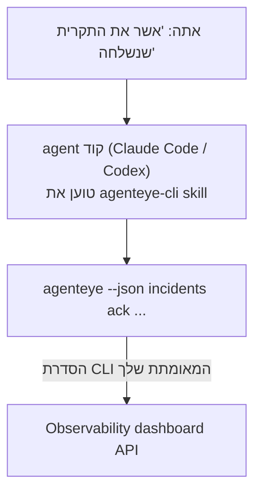

---
---
title: "Failproof AI Observability CLI Agent Skill"
description: "שאל את ה-agent שלך \"האם משהו מקולקל היום?\" והנח לו לענות מנתוני Failproof AI Observability החיים שלך, ללא צורך בשינון פקודות."
---


שאל את ה-agent שלך *"האם משהו מקולקל היום?"* והנח לו לענות מנתוני Failproof AI Observability החיים שלך, ללא צורך בשינון פקודות. ה-**Failproof AI Observability CLI skill** (`agenteye-cli`) הוא *Agent Skill*: תיקייה קטנה של הוראות שה-agent כמו Claude Code או Codex טוען בעת הצורך. היא מלמדת את ה-agent לעבוד עם ה-Observability שלך דרך [`agenteye` CLI](/he/agenteye/cli) מבקשות בשפה טבעית כמו *"תן ל-CI מפתח שיכול רק לדחוף אירועים"* או *"אשר את התקרית שנשלחה והקצה אותה אלי."*

זה **לא** שירות או בינארי נפרד; אין כלום לפרוס. הוא פועל על גבי ה-CLI שכבר התקנת: ה-agent משדר `agenteye --json …`, מחלץ את ה-JSON הנקי, ומענה לך בטקסט. כל מה שהוא יכול לעשות, אתה יכול לעשות בעצמך בהקלדת אותן פקודות.

---

## איך זה קשור לממשקים אחרים של Failproof AI Observability

Failproof AI Observability נותן לך ארבע דרכים להגיע לאותם נתונים ובקרות. הם משלימים זה את זה:

| ממשק | מה זה | איפה זה פועל | השתמש בזה כאשר |
|---|---|---|---|
| **[CLI](/he/agenteye/cli)** | הפניה לפקודות וסדרי גודל של `agenteye` | הטרמינל שלך | אתה רוצה להריץ או להתאים לתסריט פקודה מסוימת |
| **[CLI recipes](/he/agenteye/cli-recipes)** | דפוסי `jq`/pipeline להעתקה הדבקה | הטרמינל / סקריפטים שלך | אתה מחבר את ה-CLI לאוטומציה |
| **CLI skill** (דוקומנטציה זו) | דלת קדמית בשפה טבעית ל-CLI | ה-agent שלך, בתחנת העבודה שלך | אתה רוצה *פשוט לשאול* ולתת ל-agent לבחור את הפקודה |
| **[Evaluator skill](/he/agenteye/evaluator-skill)** | skill אחות שמעצבת ובונה את שירות ה-scoring שלך | ה-agent שלך, בתחנת העבודה שלך | אתה רוצה *לייצר* ניקוד eval במקום לקרוא אותו |
| **[Python SDK skill](/he/agenteye/python-sdk-skill)** | skill אחות שמעדכנת את ה-agent שלך כדי שיפיק טלמטריה בכלל | ה-agent שלך, בתחנת העבודה שלך | אתה רוצה שה-agent שלך *ייצור* את האירועים שהskill הזה קורא |
| **[In-dashboard AI assistant](/he/agenteye/assistant)** | צ'ט מובנה בלוח המחוונים | צד שרת (בלוח המחוונים) | אתה רוצה שאלות ותשובות בלוח המחוונים על הנתונים שלך |

ל-skill עצמו אין הרשאות משלו; זה פשוט הופך את הדברים שלך ל-CLI קורא שפועלים כמוך:



### לעומת ה-in-dashboard AI assistant: הבחנה חשובה

אלה שני כלים שונים עם רדיוסי הנפץ שונה מאוד:

- ה-**in-dashboard AI assistant** ([AI assistant](/he/agenteye/assistant)) הוא צ'ט מובנה בלוח המחוונים, המונע על ידי שירות ה-agent. הוא **קריאה בלבד בתוספת authoring בשערי אישור**: הוא יכול לתסקיר שאילתות שמור ודשבורדים, אך כל כתיבה עוצרת לקבלת אישור click מפורש שלך, ו-delete לעולם לא. זה מוגבל על ידי ההרשאה `agent:use` ורואה רק נתונים עבור הארגון שאתה צופה בו.
- ה-**CLI skill** פועל ב*תחנת העבודה שלך* בתוך *ה-agent שלך* וממכן את `agenteye` CLI כ-**אתה**. זה יכול לבצע את **פני CLI המלה, כולל מוטציות** (יצירה/סיבוב/השבתה של מפתחות API, שינוי הגדרות org, פתרון תקריות, מחיקה של שאילתות שמור), מוגבל רק על ידי ההרשאות של ה-CLI login שלך. התייחס אליו בדיוק כפי שהיית מתייחס להרצת אותן פקודות ביד.

---

## דרישות מוקדמות

1. **`agenteye` CLI מותקן** וב-`PATH` (ראה ההפניה [CLI](/he/agenteye/cli): `pipx install agenteye`).
2. **URL לוח המחוונים שלך** מוגדר (`AGENTEYE_DASHBOARD_URL`, או ה-agent עובר `--base-url`).
3. **סדרה מחוברת**: הרץ `agenteye login` בעצמך תחילה. ה-skill **לא יכול** להשלים את ה-login עם קוד חד פעמי בדוא"ל בשבילך; זה יגיד לך להרוץ `agenteye login` אם ההסדרה חסרה או פג תוקף (יציאת CLI קוד `4`).

---

## איפה להשיג את זה

ה-skill מפורסם בקולקציית ה-skills הציבורית של Failproof AI:

**[github.com/FailproofAI/skills](https://github.com/FailproofAI/skills)** → [`skills/agenteye-cli/`](https://github.com/FailproofAI/skills/tree/main/skills/agenteye-cli)

שום דבר בזה לא מוגבל — הrepository פתוח וה-skill לא צריך credential משלו, כי הוא רק מנהל את `agenteye` CLI **הציבורי** כנגד *לוח המחוונים שלך*, תוך שימוש בסדרה *שאתה* התחברת אליה. אתה לא צריך לבקש את זה מאף אחד.

שים לב שהוא משודר כתיקייה משלו ו-**לא** בתוך חבילת `pipx install agenteye`, אז אל תחפש אותה שם.

## התקנת ה-Skill

הנתיב המהיר ביותר הוא [`skills`](https://skills.sh) CLI, שמביא את התיקייה ומניח אותה היכן שה-agent שלך מחפש:

```bash
# Claude Code, פרויקט זה בלבד
npx skills add FailproofAI/skills --skill agenteye-cli -a claude-code

# כל פרויקט (מותקן ל-~/.claude/skills/)
npx skills add FailproofAI/skills --skill agenteye-cli -a claude-code -g --copy

# Codex במקום זאת
npx skills add FailproofAI/skills --skill agenteye-cli -a codex
```

לאחר מכן נהל אותו כמו כל skill אחר:

```bash
npx skills list -a claude-code      # מה מותקן
npx skills update agenteye-cli      # משוך את הגרסה החדשה ביותר
npx skills remove agenteye-cli      # הסר אותו
```

מעדיף להתקין ביד? Agent Skill הוא פשוט תיקייה המכילה `SKILL.md` (בתוספת הפניות אופציונליות), אז העתקה עובדת גם:

- **Claude Code**: שים את התיקייה `agenteye-cli/` ב-`~/.claude/skills/` (כל פרויקט) או `<your-repo>/.claude/skills/` (רק ה-repo הזה). Claude Code גילוי אוטומטי אותו — אמת עם רשימת `/skills`, או פשוט שאל שאלה התואמת את התיאור שלו.
- **Codex (OpenAI)**: Codex קורא את אותו `SKILL.md`. ה-`agents/openai.yaml` הכלול קובע `allow_implicit_invocation: true`, אז Codex בחר את ה-skill באופן אוטומטי כאשר משימה תואמת; אחרת הפעל אותו במפורש כ-`$agenteye-cli`.

---

## בטיחות: מוטציות **לא** מדיניות כאשר ה-agent מריץ את ה-CLI

> **אזהרה:** קרא את זה לפני שאתה מאפשר ל-agent לבצע שינויים.

ה-`agenteye` CLI בדרך כלל שואל *"האם אתה בטוח?"* לפני פעולה הרסנית. זה **דילוג אוטומטי על אישור זה בכל פעם שהוא לא מחובר לטרמינל (וזה בדיוק איך ה-agent מריץ אותו), ו-`--json` דילוגים גם כן.** אז ההודעת הבטיחות **לא** תשלח עבור ה-agent.

ה-skill כתוב כדי לפצות: זה מקבל הנחיות לציין את הפקודה המדויקת שהוא יריץ ולקבל את ה-**אישור המפורש שלך לפני שום שינוי מצב**. שמור על המשמעת הזו. כאשר אתה מנהל את Failproof AI Observability דרך ה-agent, *אתה* הצעד האישור. הפקודות המשנות מצב לצפייה:

- `keys create` / `update` / `disable` / `regenerate`
- `users create` / `update` / `disable` / `enable`
- `settings set`
- `alerts create` / `update` / `delete` / `test`
- כתיבת `incidents` subcommands: `ack` / `assign` / `resolve` / `open` / `comment-add` / `comment-delete` / `subscribe` / `unsubscribe`
- `query create` / `update` / `delete`
- `agent rename` / `delete`
- `orgs switch`

הכל תחת **Observe** (`events`, `sessions`, `evals`, `errors`, `list`, `whoami`, `orgs list/current/perms`) הוא קריאה בלבד ולא משנה דבר.

מכיוון שה-agent פועל כ-**אתה**, הוא יכול רק לעשות מה שההתחברות שלך מורשה לעשות; הרשאות מתבררות **לכל org** (ראה [מפתחות API](/he/agenteye/api-keys)). פקודה שאתה חסום מהרשאה עבורה מחזירה קוד יציאה `5` עם ההרשאה המדויקת שמוקלדת, כך שה-agent יכול להגיד לך בדיוק למה לבקש from admin במקום להיכשל באופן אטום.

---

## מה אתה יכול לשאול

הנה מה סיבוב בעולם האמיתי נראה, קריאה, ואז שינוי שמחכה לאישור שלך:

```text
אתה    ▸ האם משהו מקולקל ביום האחרון?

agent ▸ ריצה: agenteye --json errors --since 24h --aggregate
        3 סוגי שגיאות ביום האחרון. הגדול ביותר הוא TimeoutError
        (18 hit, כולם ב-checkout-agent), ואז RateLimited (5).
        רוצה את הסדרות שנכשלו עבור TimeoutError?

אתה    ▸ תן ל-CI מפתח שיכול רק לדחוף אירועים.

agent ▸ זה יוצר מפתח API. אני אריץ:
          agenteye keys create ci --add events:add
        בסדר להמשיך?

אתה    ▸ כן

agent ▸ בוצע. מפתח "ci" נוצר עם רק events:add.
        הסוד מוצג רק פעם אחת, אז שמור אותו עכשיו. אני לא יכול להדפיס אותו מחדש.
```

ה-skill ממפה כל כוונה בשפה טבעית לפקודת `agenteye` הנכונה, גילוי ערכים תקפים תחילה (`list <kind>`, `whoami`) אז זה לא ניחוש, וציון הפקודה המדויקת לפני שום שינוי. דוגמאות נוספות:

- *"האם משהו מקולקל / נכשל ביום האחרון?"* → `errors --since 24h --aggregate`, ואז פירוק.
- *"למה הסדרה `run-001` נכשלה?"* → `events --session-id run-001 --all` + `evals --session-id run-001`.
- *"איך איכות מתמגמגת השבוע?"* → `evals --aggregate --since 7d`, ואז קדר לריצות ניקוד נמוך.
- *"תן ל-CI מפתח שיכול רק לדחוף אירועים."* → `keys create ci --add events:add` (זה מציין את הפקודה, ואז יוצר אותה ולוכד את הסוד החד פעמי).
- *"למי יש גישה? עשה את Dana read-only."* → `users list` → `users update dana@… --permission-set read-only` (אחרי שאישור אתה).
- *"אשר את התקרית שנשלחה והקצה אותה אלי."* → `incidents list --state firing` → `incidents ack <id>` / `incidents assign <id> you@…`.

עבור הפקודות המדויקות, הסדרי גודל, והצורות JSON מאחורי אלה, ראה ההפניה [CLI](/he/agenteye/cli) ו-[CLI recipes עבור agents](/he/agenteye/cli-recipes).

---

## הצעדים הבאים

- **[CLI](/he/agenteye/cli)**: הפניה פקודה וסדר גודל מלא עבור `agenteye`.
- **[CLI recipes עבור agents](/he/agenteye/cli-recipes)**: דפוסי `jq` וטיפול בקוד יציאה להעתקה הדבקה.
- **[Evaluator agent skill](/he/agenteye/evaluator-skill)**: ה-skill אחות, לבנייה ה-evaluator שעבור אשריים `agenteye evals` קורא.
- **[Python SDK agent skill](/he/agenteye/python-sdk-skill)**: ה-skill אחות, לעדכון ה-agent כדי שזה פיצה את הטלמטריה `agenteye` קורא.
- **[AI assistant](/he/agenteye/assistant)**: ה-in-dashboard assistant (לא להתבלבל עם ה-skill טרמינל זה).
- **[מפתחות API](/he/agenteye/api-keys)**: ה-per-org מודל הרשאה שמקשור מה ה-skill יכול לעשות.