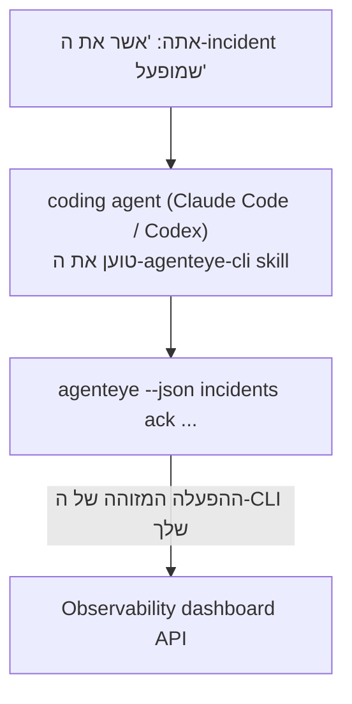

---
---
title: "Failproof AI Observability CLI Agent Skill"
description: "שאל את ה-Agent שלך \"האם משהו שבור היום?\" והנח לו לענות מנתוני ה-Failproof AI Observability החיים שלך, ללא צורך לזכור פקודות."
---


שאל את ה-coding agent שלך *"האם משהו שבור היום?"* והנח לו לענות מנתוני ה-Failproof AI Observability החיים שלך, ללא צורך לזכור פקודות. ה-**Failproof AI Observability CLI skill** (`agenteye-cli`) הוא *Agent Skill*: תיקייה קטנה של הוראות שה-coding agent שלך, כמו Claude Code או Codex, טוען לפי הצורך. היא מלמדת את ה-Agent להפעיל את ה-Observability deployment שלך דרך ה-[`agenteye` CLI](/he/agenteye/cli) מבקשות באנגלית פשוטה כמו *"תן ל-CI מפתח שיכול רק לדחוף אירועים"* או *"אשר את ה-incident שמופעל והצמד אותו אלי."*

זה **לא** שירות או בינארי נפרד; אין כלום לפרוס. זה עובד על גבי ה-CLI שכבר התקנת: ה-Agent משחרר shell ל-`agenteye --json …`, מנתח את ה-JSON הנקי, ומענה לך בטקסט. הכל שהוא יכול לעשות, אתה יכול לעשות בעצמך בעזרת הקלדת אותן פקודות.

---

## כיצד זה קשור לממשקים האחרים של Failproof AI Observability

Failproof AI Observability נותן לך ארבע דרכים להגיע לאותם נתונים ובקרות. הן משלימות זו את זו:

| ממשק | מה זה | איפה זה פועל | השתמש בזה כאשר |
|---|---|---|---|
| **[CLI](/he/agenteye/cli)** | הנתיב ההפנייה של פקודה/דגל עבור `agenteye` | הטרמינל שלך | אתה רוצה להריץ או לכתוב סקריפט של פקודה ספציפית |
| **[CLI recipes](/he/agenteye/cli-recipes)** | דוגמאות `jq`/Pipeline להעתקה בהדבקה | הטרמינל שלך / סקריפטים | אתה משלב את ה-CLI לאוטומציה |
| **CLI skill** (מסמך זה) | דלת כניסה בשפה טבעית ל-CLI | ה-coding agent שלך, בתחנת העבודה שלך | אתה רוצה *פשוט לשאול* והנח ל-Agent לבחור את הפקודה |
| **[Evaluator skill](/he/agenteye/evaluator-skill)** | Skill אחות שמעצבת ובונה את שירות ה-scoring שלך | ה-coding agent שלך, בתחנת העבודה שלך | אתה רוצה *לייצר* ניקוד eval במקום לקרוא אותו |
| **[Python SDK skill](/he/agenteye/python-sdk-skill)** | Skill אחות המכשירה את ה-Agent שלך כדי שהוא ישדר טלמטריה בכלל | ה-coding agent שלך, בתחנת העבודה שלך | אתה רוצה שה-Agent שלך *יייצר* את האירועים שה-Skill הזה קורא |
| **[In-dashboard AI assistant](/he/agenteye/assistant)** | צ'אט המוטבע בלוח הבקרה | צד שרת (בלוח הבקרה) | אתה רוצה שאלות ותשובות בלוח הבקרה על הנתונים שלך |

ל-Skill עצמו אין הרשאות משלו; זה רק הופך את המילים שלך לקריאות CLI שפועלות כמוך:



### לעומת In-Dashboard AI Assistant: הבחנה חשובה

אלו שתי כלים שונים עם רדיוסי פיצוץ שונים מאוד:

- ה-**in-dashboard AI assistant** ([AI assistant](/he/agenteye/assistant)) הוא צ'אט המוטבע בלוח הבקרה, תמוך על ידי שירות ה-Agent. הוא **קריאה בלבד בתוספת כתיבה שנשמרה בעל-שער אישור**: הוא יכול לשרטט שאילתות ולוחות בקרה שמורים, אך כל כתיבה עוצרת לקבלת לחיצת אישור מפורשת שלך, והיא לעולם לא מוחקת. זה מנוהל על ידי ההרשאה `agent:use` וכל פעם רואה רק נתונים של הארגון שאתה צופה בו.
- ה-**CLI skill** פועל על *תחנת העבודה שלך* בתוך *ה-coding agent שלך* ומניע את ה-CLI של `agenteye` כ-**אתה**. הוא יכול לבצע את **משטח ה-CLI המלא, כולל מוטציות** (יצירה/סיבוב/השבתת מפתחות API, שינוי הגדרות ארגון, פתרון incidents, מחיקת שאילתות שמורות), תחום רק על ידי ההרשאות של התחברות ה-CLI שלך. התייחס אליו בדיוק באותה זהירות שהיית מתייחס אליו כאילו היית מריץ את אותן פקודות ביד.

---

## דרישות מוקדמות

1. **`agenteye` CLI מותקן** וב-`PATH` (ראה [CLI](/he/agenteye/cli) reference: `pipx install agenteye`).
2. **URL לוח הבקרה שלך** מוגדר (`AGENTEYE_DASHBOARD_URL`, או ה-Agent מעביר `--base-url`).
3. **הפעלה מחוברת**: הרץ `agenteye login` בעצמך תחילה. ה-Skill **לא יכול** להשלים את כניסת ה-one-time-code המיוישרת לך; הוא יגיד לך להריץ `agenteye login` אם ההפעלה חסרה או פג תוקפה (קוד יציאת CLI `4`).

---

## איפה להשיג את זה

ה-Skill פורסם באוסף ה-Skills הציבורי של Failproof AI:

**[github.com/FailproofAI/skills](https://github.com/FailproofAI/skills)** → [`skills/agenteye-cli/`](https://github.com/FailproofAI/skills/tree/main/skills/agenteye-cli)

שום דבר בו אינו מנוהל — המאגר ציבורי וה-Skill לא צריך כל אישור משלו, כי הוא רק מניע את ה-CLI הציבורי `agenteye` נגד *לוח הבקרה שלך*, תוך שימוש בהפעלה *שאתה* התחברת בעזרתה. אתה לא צריך לבקש את זה מאיש.

שים לב שהוא משודר כתיקייה משלו וזה **לא** בתוך החבילה `pipx install agenteye`, אז אל תחפש אותו שם.

## התקנת ה-Skill

הנתיב המהיר ביותר הוא [`skills`](https://skills.sh) CLI, שמביא את התיקייה ושם אותה איפה ה-Agent שלך מחפש:

```bash
# Claude Code, פרויקט זה בלבד
npx skills add FailproofAI/skills --skill agenteye-cli -a claude-code

# כל פרויקט (מותקן ב-~/.claude/skills/)
npx skills add FailproofAI/skills --skill agenteye-cli -a claude-code -g --copy

# Codex במקום זאת
npx skills add FailproofAI/skills --skill agenteye-cli -a codex
```

אז נהל את זה כמו כל Skill אחר:

```bash
npx skills list -a claude-code      # מה מותקן
npx skills update agenteye-cli      # משוך את הגרסה הראשונה
npx skills remove agenteye-cli      # הסר אותו
```

מעדיף להתקין ביד? Agent Skill היא רק תיקייה המכילה `SKILL.md` (בתוספת הפניות אופציונליות), אז העתקה עובדת גם:

- **Claude Code**: שים את תיקיית `agenteye-cli/` ב-`~/.claude/skills/` (כל פרויקט) או `<your-repo>/.claude/skills/` (פרויקט זה בלבד). Claude Code מגלה אותו באופן אוטומטי — אמת עם הרשימה `/skills`, או פשוט שאל שאלה שתואמת את התיאור שלו.
- **Codex (OpenAI)**: Codex קורא את אותו `SKILL.md`. ה-`agents/openai.yaml` המכובל מגדיר `allow_implicit_invocation: true`, אז Codex בוחר באופן אוטומטי את ה-Skill כאשר משימה תואמת; אחרת אתה משדר אותו במפורש כ-`$agenteye-cli`.

---

## בטיחות: מוטציות לא מודיעות כאשר Agent מריץ CLI

> **אזהרה:** קרא את זה לפני שתיתן ל-Agent לעשות שינויים.

ה-`agenteye` CLI בדרך כלל שואל *"אתה בטוח?"* לפני פעולה הרסנית. הוא **מדלג באופן אוטומטי על האישור הזה בכל פעם שהוא לא מצורף לטרמינל (שזה בדיוק איך Agent מריץ אותו), וגם `--json` מדלג עליו.** אז דיאלוג הבטיחות **לא** יופעל עבור ה-Agent.

ה-Skill כתוב כדי לפצות: הוא מודרך לציין את הפקודה המדויקת שהוא יריץ ולקבל את ה-**אישור המפורש שלך לפני כל שינוי מצב**. שמור על הדיסציפלינה הזו. כשאתה מניע את Failproof AI Observability דרך Agent, *אתה* צעד האישור. הפקודות המשנות מצב שיש לשים עליהן לב:

- `keys create` / `update` / `disable` / `regenerate`
- `users create` / `update` / `disable` / `enable`
- `settings set`
- `alerts create` / `update` / `delete` / `test`
- תת-הפקודות `incidents` הכתובות: `ack` / `assign` / `resolve` / `open` / `comment-add` / `comment-delete` / `subscribe` / `unsubscribe`
- `query create` / `update` / `delete`
- `agent rename` / `delete`
- `orgs switch`

הכל תחת **Observe** (`events`, `sessions`, `evals`, `errors`, `list`, `whoami`, `orgs list/current/perms`) הוא קריאה בלבד ולא משנה כלום.

מכיוון שה-Agent פועל כ-**אתה**, הוא יכול רק לעשות את מה שההתחברות שלך מורשית לעשות; הרשאות מסתיימות **לכל ארגון** (ראה [API keys](/he/agenteye/api-keys)). פקודה שאתה חסר הרשאה עבורה מחזירה קוד יציאה `5` עם ההרשאה המדויקת בשם, כך ש-Agent יכול לומר לך בדיוק מה לבקש מ-Admin במקום להיכשל בעל-מדויק.

---

## מה אתה יכול לשאול אותו

הנה איך נראית Round-trip אמיתי, קריאה, ואחר כך שינוי שמחכה לאישור שלך:

```text
אתה   ▸ האם משהו שבור ביום האחרון?

agent ▸ בחילוץ: agenteye --json errors --since 24h --aggregate
        3 סוגי שגיאות ביום האחרון. הגדול ביותר הוא TimeoutError
        (18 עונות פגיעה, הכל ב-checkout-agent), ואחר כך RateLimited (5).
        רוצה את ההפעלות הנכשלות עבור TimeoutError?

אתה   ▸ תן ל-CI מפתח שיכול רק לדחוף אירועים.

agent ▸ זה יוצר מפתח API. אני אריץ:
          agenteye keys create ci --add events:add
        אישור להמשך?

אתה   ▸ כן

agent ▸ בוצע. מפתח "ci" נוצר רק עם events:add.
        הסוד מוצג רק פעם אחת, אז אחסון אותו עכשיו. אני לא יכול להדפיס אותו מחדש.
```

ה-Skill ממפה כל כוונה בשפה טבעית לפקודת `agenteye` הנכונה, מגלה ערכים חוקיים תחילה (`list <kind>`, `whoami`) כדי שהוא לא יחזה, וציין את הפקודה המדויקת לפני כל שינוי. עוד דוגמאות:

- *"האם משהו שבור / נוכשל ביום האחרון?"* → `errors --since 24h --aggregate`, ואחר כך פירוט.
- *"למה ההפעלה `run-001` נכשלה?"* → `events --session-id run-001 --all` + `evals --session-id run-001`.
- *"איך איכות נוטה השבוע הזה?"* → `evals --aggregate --since 7d`, ואחר כך עמקו לתוך ריצות בדירוג נמוך.
- *"תן ל-CI מפתח שיכול רק לדחוף אירועים."* → `keys create ci --add events:add` (הוא מציין את הפקודה, ואחר כך יוצר אותה וקוטף את הסוד החד-פעמי).
- *"למי יש גישה? בצע את Dana read-only."* → `users list` → `users update dana@… --permission-set read-only` (לאחר אישור איתך).
- *"אשר את ה-incident המופעל והצמד אותו אלי."* → `incidents list --state firing` → `incidents ack <id>` / `incidents assign <id> you@…`.

עבור הפקודות המדויקות, הדגלים, וצורות JSON מאחורי אלה, ראה את [CLI](/he/agenteye/cli) reference ו-[CLI recipes for agents](/he/agenteye/cli-recipes).

---

## שלבים הבאים

- **[CLI](/he/agenteye/cli)**: הנתיה המלאה של פקודה ודגל עבור `agenteye`.
- **[CLI recipes for agents](/he/agenteye/cli-recipes)**: דוגמאות `jq` להעתקה בהדבקה וטיפול בקוד יציאה.
- **[Evaluator agent skill](/he/agenteye/evaluator-skill)**: ה-Skill האחות, לבניית ה-Evaluator שאת הניקוד שלו `agenteye evals` קורא.
- **[Python SDK agent skill](/he/agenteye/python-sdk-skill)**: ה-Skill האחות, להכשיר Agent כך שהוא משדר את הטלמטריה ש-`agenteye` קורא.
- **[AI assistant](/he/agenteye/assistant)**: עוזר בלוח הבקרה (לא יישום זה לטעות עם ה-Skill של הטרמינל הזה).
- **[API keys](/he/agenteye/api-keys)**: מודל ההרשאה לכל ארגון שתוחם מה ה-Skill יכול לעשות.