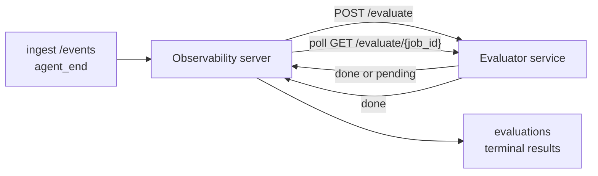

Failproof AI Observability יכול לתת ניקוד אוטומטי לכל הרצה סיום של סוכן לאיכות: אתה מספק שירות ניקוד קטן, ו-Observability טוען את השאר. השתמש בו כדי לעקוב אחר הממדים שחשובים לך (עזרתיות, יעילות כלים, עובדתיות, בטיחות; אתה בוחר), לתפוס רגרסיות מוקדם, ולהשוות סוכנים או סביבות במבט מהיר. ניקוד הוא הסכמה: צינור ההזרמה לא עושה כלום עד שתגדיר `EVALUATOR_ENDPOINT` בשרת.

> **הערה:** אתה מגדיר את ממדי הניקוד. המעריך שלך יכול להחזיר כל מפתחות מספריים שהוא רוצה; Observability שומר, מעקב וזורם כל מה שאתה שולח בחזרה.

## בתמצית

1. **כתוב מעריך.** הקם שירות HTTP קטן שקורא תמליל הפעלה ומחזיר ניקודים. Observability משלח הפניה עובדת שאתה יכול להעתיק. ראה [כתיבת מעריך עם ה-SDK](#writing-an-evaluator-with-the-sdk).
2. **הצבע ל-Observability עליה.** הגדר `EVALUATOR_ENDPOINT` (ו-`EVALUATOR_TOKEN` משותף) בתהליך השרת.
3. **צפה בניקודים הנחתים.** כל הפעלה שהושלמה מתקבלת ניקוד באופן אוטומטי; התוצאות מופיעות בדף פרטי ההפעלה, רשת ההפעלות, ולוחות מחוונים שמור.


*ברגע שמעריך מוגדר, כל הרצה שהושלמה מתקבלת ניקוד והתוצאות מופיעות בפס הימני של ההפעלה: הסיכום בחלקו העליון, ואחר כך ניקוד בעלי ממד עם הנמקה.*

---

## איך זה עובד



כאשר ה-SDK של Observability פולט אירוע `agent_end` לעבור הפעלה, השרת מתחיל הערכה. לאחר מכן הוא מפרסם את מלא תמליל האירוע לשירות המעריך שלך, שיכול:

- **להחזיר את התוצאה בדרך ישירה** עם `{"status":"done", "scores":{...}, "reasoning":{...}, "summary":"..."}`. התוצאה מתווספת לציר הזמן ההערכה של ההפעלה. `reasoning` ו-`summary` הם אופציונליים.
- **לדחות** עם `{"status":"pending", "job_id":"abc-123"}`. Observability קורא לאחר מכן `GET {EVALUATOR_ENDPOINT}/evaluate/abc-123` עד שהמעריך שלך מחזיר `{"status":"done", ...}` או `{"status":"error", "error":"..."}`.

  קצב הסקר הוא לכל עבודה: תגובת `pending` עשויה להכיל `next_poll_secs` כדי להחריג; אחרת Observability משתמש בערך `default_poll_interval_secs` מ-`GET /config`; אחרת השרת חוזר ל-`EVALUATOR_POLLING_INTERVAL_SECS` (ברירת מחדל 10 שניות). כל הערכים מהודקים ל-[1 שניה, שעה].

הפעלות שלא פולטות לעולם `agent_end` (למשל, תהליך סוכן שהתרסק) יכולות גם להיאסף: ה-`GET /config` של המעריך עשוי להחזיר `{"inactivity_timeout_secs": 1800}`, ו-Observability יעריך כל הפעלה שהיתה בטלה לפחות כל כך זמן. הגדר את השדה ל-`null` או הפל אותו כדי להשבית את הפקדון הזה.

צינור ההזרמה הוא בדיוק no-op כשל-`EVALUATOR_ENDPOINT` אינו מוגדר.

הפעלה יכולה להצטברות **הערכות סיום מרובות לאורך זמן**: כל אירוע `agent_end` (וכל re-eval ידני מלוח המחוונים) מוסיף שורת הערכה טרייה. זו הדרך הנתמכת להערכת שיחה שחדשה: משתמש מסיים סוכן, חוזר מאוחר יותר, שולח עוד אירועים, מסיים את הסוכן שוב, והערכה שנייה עדה נגד מלא התמליל המעודכן. לוח המחוונים מעניק את ההערכה העדכנית ביותר ככותרת וההערכות הקודמות כציר זמן צימוד. בעוד הערכה אחת רצה לעבור הפעלה, אירועי `agent_end` נוספים לעבור ההפעלה הזו מתעלמים; הבא אחרי ההערכה הנוהגת מושלם יתור הערכה טרייה כרגיל.

הפקדון החוסר פעילות מחדש להפעלות החדשות גם כן: אם אירועים חדשים מגיעים אחרי הערכה סיום קודמת ובהפעלה חוזרת לטלטל מעבר ל-`inactivity_timeout_secs`, הערכה טרייה מתורה.

כשלים ארעיים (5xx, 429, timeouts, שגיאות רשת) מנסו מחדש עם מעריכיים ליניארי עד ל-`EVALUATOR_MAX_ATTEMPTS`; תגובות 4xx הן סיום. Observability בטוח להריץ עם מכמה שרתים בקנה מידה אופקית; עבודה מחולקת כך שאותה הפעלה לעולם אינה משודרת פעמיים במקביל.

---

## חוזה HTTP

כל מסלול מואמת משתמש **auth של אסימון נושא**. אותו ערך חייב להיות מוגדר בשתי הצדדים:

- שרת Observability: משתנה סביבה `EVALUATOR_TOKEN`
- שירות המעריך: מוגדר באותו אופן (ה-SDK `agenteye-evaluator` קורא `EVALUATOR_TOKEN` לפי מוסכמה)

אם `EVALUATOR_TOKEN` אינו מוגדר, השרת אינו שולח ראש `Authorization`; המעריך עשוי אז לקבל בקשות אנונימיות, שהן בסדר לרשת פנימית בלבד אך מנוסות באינטרנט הציבורי.

### מסלולים שהמעריך חייב להשרת

| מסלול | גוף / פרמטרים | תגובה |
|---|---|---|
| `GET /health` | ללא | `{"status":"ok"}` (פתוח, ללא auth) |
| `GET /config` | ללא | `{"inactivity_timeout_secs": <int> \| null, "default_poll_interval_secs": <int> \| omitted}` |
| `POST /evaluate` | `EvalRequest` JSON | `{"status":"done", ...}` או `{"status":"pending", "job_id":"..."}` |
| `GET /evaluate/{id}` | ללא | אותה צורת תגובה כמו `/evaluate` |

### גוף `EvalRequest` ששלח השרת

```json
{
  "schema_version": "1",
  "session_id":     "session-abc123",
  "agent_id":       "planner",
  "environment":    "production",
  "started_at":     "2026-05-10T12:00:00Z",
  "ended_at":       "2026-05-10T12:05:00Z",
  "events": [
    { "id": 1234, "ts": "...", "event_type": "agent_start", "payload": { ... } },
    ...
  ]
}
```

### צורות תגובה

**סנכרון (בוצע):**

```json
{
  "status": "done",
  "scores": { "helpfulness": 0.85, "tool_efficiency": 0.6 },
  "reasoning": {
    "helpfulness": "answered the question directly with citations",
    "tool_efficiency": "called list_files three times when one would have done"
  },
  "summary": "strong answer quality, weak tool selection"
}
```

`reasoning` (מפת הנמקה לכל ניקוד) ו-`summary` (נרטיב כלל-אחד) שניהם אופציונליים. מפתחות ב-`reasoning` צריכים לשקף מפתחות ב-`scores`; לוח המחוונים מעניק כל ערך בתוכנית מתחתיו בר ניקוד. מעריכים ישנים יותר שמחזיר רק `scores` ממשיכים לעבוד ללא שינוי; `reasoning` ו-`summary` פשוט נקראים כ-null וה-UI affordances המתאימות מושמטות.

**אסנכרון (דחוי):**

```json
{ "status": "pending", "job_id": "abc-123", "next_poll_secs": 30 }
```

`next_poll_secs` הוא אופציונלי; אם מושמט השרת חוזר ל-`default_poll_interval_secs` של המעריך מ-`/config`, ואחר כך למשתנה סביבה `EVALUATOR_POLLING_INTERVAL_SECS` שלו.

**שגיאת סיום בצד מעריך:**

```json
{ "status": "error", "error": "model service unavailable" }
```

השרת מטפל בכל גוף 2xx אחר כשגיאת פרוטוקול ומתעד `error` סיום לעבור הפעלה.

---

## כתיבת מעריך עם ה-SDK

אתה לא צריך להטיל את החוזה HTTP בעצמך. חבילת Python `agenteye-evaluator` נותנת לך wrapper FastAPI מוקלד שטוען auth, ניתוב, וצורות בקשה/תגובה עבורך.

Failproof AI Observability גם משלח **מעריך הפניה עובד** שניקוד `helpfulness`, `tool_efficiency`, ו-`factuality` מצורת התמליל. הערך אותו כנקודת התחלה והחלף בלוגיקה שלך: שופט LLM, מנוע כללי, כל מה שמתאים לסף האיכות שלך.

מעריך מינימלי:

```python
import os
from agenteye_evaluator import Evaluator, EvalRequest, EvalResponse

app = Evaluator(token=os.environ["EVALUATOR_TOKEN"])

@app.evaluator
def run(req: EvalRequest) -> EvalResponse:
    # Inspect req.events (the full session transcript) and return scores.
    tool_calls = sum(1 for e in req.events if e.event_type == "tool_use")
    return EvalResponse(
        scores={"tool_calls": float(tool_calls)},
        reasoning={"tool_calls": f"{tool_calls} tool invocations in the transcript"},
        summary="tight tool loop" if tool_calls < 5 else "agent looped on tools",
    )
```

המכונה `app` רצה תחת כל שרת ASGI, כך שתוך כך `uvicorn module:app` מתחיל אותו.

עבור מעריכים שצריכים לדחות עבודה יקרה, החזר `JobPending` במקום רישום ל-`@app.job_lookup` handler; שרת Observability סוקר `GET /evaluate/{job_id}` עד שתחזור סטטוס סיום או כמות `EVALUATOR_MAX_POLL_DURATION_SECS` (ברירת מחדל שעה) מתרחשת.

הפניה ה-API המלאה, דפוס אסנכרון, וסכימת אירוע מתועדות ב-README של ה-SDK `agenteye-evaluator`.

---

## הרץ את המעריך שלך

המעריך הוא **שירות שלך** — Failproof AI Observability אינו משלח מעריך ברירת מחדל, כך שאתה בונה והורץ אותו איפה שאתה מריץ את השירותים שלך. הוא רץ תחת כל שרת ASGI (למשל `uvicorn my_evaluator:app`); הגש את מסלולי `/health`, `/config`, ו-`/evaluate` מ[חוזה HTTP](#http-contract), ואחר כך הצבע את השרת עליו (ראה [קביעת השרת](#configuring-the-server)).

ברגע שהמעריך זמין, `GET /health` מחזיר `{"status":"ok"}`. אחרי סוכן מריץ סוף ל-סוף, `GET /evaluations` בשרת מחזיר שורה עם `status: "done"` והניקודים שהמעריך שלך הפיק.

---

## קביעת השרת

קביעה בתהליך השרת:

| משתנה סביבה | משמעות |
|---|---|
| `EVALUATOR_ENDPOINT` | URL בסיסי של המעריך (`http://evaluator:9000`). אינו מוגדר = צינור מנוטרל. |
| `EVALUATOR_TOKEN` | אסימון נושא. חייב להיות שווה לערך שירות המעריך מוגדר עם. |
| `EVALUATOR_WORKERS` | משימות עובד לכל מכונת שרת (ברירת מחדל 2). |
| `EVALUATOR_CLAIM_BATCH` | שורות טבועות לכל עובד טיק (ברירת מחדל 4). אצוות מעובדות **במקביל**; ייעוד בפועל בנקודת הקצה של המעריך שלך הוא `EVALUATOR_WORKERS × EVALUATOR_CLAIM_BATCH`. |
| `EVALUATOR_POLL_IDLE_SECS` | כמה זמן עובד ישן בין ניסיוני משדרים כאשר לא הערכה כדי (ברירת מחדל 2 שניות). |
| `EVALUATOR_POLLING_INTERVAL_SECS` | פקדון סיום אחרון עבור קצב `GET /evaluate/{id}` כאשר לא ה-`next_poll_secs` לכל תגובה ולא ה-`default_poll_interval_secs` של המעריך מוגדרים (ברירת מחדל 10 שניות). |
| `EVALUATOR_REQUEST_TIMEOUT_MS` | timeout לכל בקשה (ברירת מחדל 30000). |
| `EVALUATOR_MAX_ATTEMPTS` | אחרי משימות כשל ארעיות רבות בתוצאה כה מתועדת כ-`error` סיום (ברירת מחדל 5). |
| `EVALUATOR_CONFIG_REFRESH_SECS` | קצב `GET /config` (ברירת מחדל 300). |
| `EVALUATOR_MAX_POLL_DURATION_SECS` | זמן קיר מקסימום הפעלה עשויה להישאר בתור הסקר לפני היא מסתיים כ-`timeout` (ברירת מחדל 3600 שניות). שמורה נגד מעריך שממשיך להחזיר `pending` לנצח. |

כדי להפעיל ניקוד אוטומטי, קביעה לא שניהם `EVALUATOR_ENDPOINT` ו-`EVALUATOR_TOKEN` בשרת, ואחר כך הפעלה מחדש כדי להרים את השינוי. עם `EVALUATOR_ENDPOINT` unset צינור ההזרמה נשאר no-op.

ככלים הכיוונון לעיל הם אופציונליים; קביעה משתני סביבה המתאימים בשרת רק אם אתה צריך להחריג את בירות המחדל.

---

## הפניה API

| שיטה | נתיב | רשות נדרשת | מטרה |
|---|---|---|---|
| `GET` | `/evaluations` | `evaluations:read` | ניתוח תוצאות סיום. תמיכה `session_id`, `agent_id`, `environment`, `status` (`done`/`error`/`timeout`), `ts_from`, `ts_to`, `cursor`, `limit`, `score_filters`, `latest_per_session`. `limit` ברירות אל 50 ועל 200 מוגבל (שימו לב זה שונה מ-`/events`, אשר מכסה ב-1000). `environment` מקבל רשימה מפוצלת לפי פסיק (למשל `environment=prod,staging`); ערכים יחידים עדיין עובדים. עם `latest_per_session=true` התגובה מכילה לכל היותר שורה אחת לכל `session_id` (העדכנית ביותר לפי `completed_at`) בשימוש על ידי דף רשימת ההפעלות כדי לכווץ ציר זמן הערכה של הפעלה לכותרת הנוכחית שלה. ברירות לשקר (חוזר היסטוריה מלא). |
| `GET` | `/evaluations/aggregate` | `evaluations:read` | בריאות eval מגולגלת לפרוסה מסוננת: ספירה כוללת, בדיקת done/error/timeout, סטטיסטיקות לכל-מפתח-ניקוד (ספירה/ממוצע/דקה/מקס/p50 על מפתחות `scores` שרירותיים), וציר זמן bucketed. קבלת **אותו פרמטרי סינון כמו `/evaluations`** בתוספת `featured_keys` (CSV של מפתחות ניקוד לטרנד) ו-`latest_per_session`. כוח דשבורדי; מטרים הם מדויקים על פני סט התאמה כולו, לא דגימה. |
| `GET` | `/evaluations/environments` | `evaluations:read` | ערכים סביבה ברורים מטבלת `evaluations`. בשימוש למלא פילטר dropdowns מסוננים לנתונים המתוקנים מערכת. |
| `GET` | `/evaluation-jobs` | `evaluations:read` | ראות לערכות הערכה בטוסה. סינון לפי `status` (`pending`/`polling`). |
| `GET` | `/events` | `events:read` | סטרם אירועים גולמיים של הפעלה. תמיכה `session_id`, `agent_id`, `event_type` (CSV), `environment` (CSV), `ts_from`, `ts_to`, `cursor`, `limit`, ו-`order`. `order` הוא `desc` (חדש-ראשון, ברירת המחדל) או `asc` (עתיק-ראשון); ערך לא מוכר חוזר ל-`desc`. Cursor-paginate דרך ה-`next_cursor` של התגובה (מזהה אירוע): עבור אותו חזרה בתור `cursor` כדי לקבל את דף הבא; עם `asc` הדף הבא הוא האירועים אחרי מזהה זה, עם `desc` האירועים לפניו. `limit` ברירות אל 50 ועל 1000 מוגבל. |
| `GET` | `/sessions/:session_id/export` | `events:read` | חוזר גוף JSON מדויק המעריך היה מקבל לעבור הפעלה זו, הגיש כהטלנה להורדה בשם `session-<id>.json`. שימושי לחזור הפעלות הייצור דרך `agenteye-evaluator` לבדיקה לא חוות. הבתים הם זהים בבתיים להערכה צינור שרות.  |
| `POST` | `/sessions/:session_id/re-evaluate` | `evaluations:trigger` | תור הערכה טרייה לעבור הפעלה; רצים בלי רשאות או הערכה קודמת קיימת. התוצאה החדשה **מתווספת** לציר זמן הערכה של ההפעלה ולא לשכתב אחד הקודם, כך שניקודים קודמים נשארים גלויים כהסטוריה. חוזר `202` בתור, `404` להפעלה לא ידועה, `409` אם הערכה כבר בטוסה. השתמש זה אחרי התפרסם מעריך חדש, או להפעלות שלעולם לא פלטו `agent_end`. |

### סינון לפי טווח ניקוד: `score_filters`

`GET /evaluations` קבלות פרמטר אופציונלי `score_filters` שמצמצם תוצאות לפי ערכים מספריים בתוך אובייקט `scores`. ה-פרמטר היא רשימה מפוצלת לפי פסיק של `key:min..max` ערכים; גבול כל אחד עשוי להיות מושמט. ערכים מרובים משתלבים עם AND לוגי. שורות איפה מפתח שקוראים לו היה היעדר או לא-מספרי מוסטות. בקשה עשויה לשאת לכל היותר 20 ערכי סינון; עלייה זו מחזיר HTTP 400.

דוגמאות:
```text
# helpfulness in [0.5, 0.8]
GET /evaluations?score_filters=helpfulness:0.5..0.8

# tool_efficiency at most 0.3 (no lower bound)
GET /evaluations?score_filters=tool_efficiency:..0.3

# helpfulness >= 0.5 AND factuality >= 0.9
GET /evaluations?score_filters=helpfulness:0.5..,factuality:0.9..
```

לכל אובייקט תגובה `/evaluations` יש שדות אלה:

| שדה | סוג | הערות |
|---|---|---|
| `evaluation_id` | מחרוזת (UUID) | המזהה הקנוני לעבור הערכה סיום זו. כל הערכה סיום קבלות UUID חדש; הפעלה יחידה יכולה להחזיק מרובות. |
| `id` | מחרוזת (UUID) | Backwards-compatibility alias לנשיאת אותו ערך כמו `evaluation_id`. |
| `session_id` | מחרוזת | ההפעלה הערכה זו רצה נגד. הפעלה יכולה להחזיק הערכות מרובות בציר הזמן. |
| `agent_id` | מחרוזת | זיהוי הסוכן שהפיק את ההפעלה. |
| `environment` | מחרוזת | תווית סביבה המועתקת מה-הפעלה. |
| `status` | enum | אחד מ-`"done"`, `"error"`, `"timeout"`. |
| `scores` | אובייקט \| null | ניקודים חוזרים על ידי המעריך שלך. |
| `reasoning` | אובייקט \| null | מפת הנמקה אופציונלית לכל ניקוד חוזרת על ידי המעריך שלך. מפתחות בדרך כלל משקפים אלה ב-`scores`. לוח המחוונים מעניק כל ערך תחת בר הניקוד שלו. |
| `summary` | מחרוזת \| null | נרטיב כלל-אחד אופציונלי כללי חוזר על ידי המעריך שלך. לוח המחוונים מעניק זה לעיל ההיווצרות לכל ניקוד ככותרת ההערכה. |
| `error` | מחרוזת \| null | מאוכלס עבור `"error"` / `"timeout"` רק. |
| `attempt_count` | מספר שלם | מספר ניסיוני משדרים (≥ 1). |
| `duration_ms` | מספר שלם \| null | משך הניסיון הסיום. |
| `completed_at` | מחרוזת (ISO 8601 UTC) | כאשר התוצאה סיום תועדה. תוצאות מהן על ידי `completed_at` (חדש ראשון). |
| `created_at` | מחרוזת (ISO 8601 UTC) | נשא את אותו timestamp כמו `completed_at` (כתוב-פעם semantics). |

---

## הרשאות

| הרשאה | מענקים |
|---|---|
| `evaluations:read` | רשימה תוצאות הערכה, ניקודי תצפית בלוח מחוונים, וטעינת מטרים בריאות לוח מחוונים. |
| `evaluations:trigger` | ידוע תור הערכה לעבור הפעלה דרך `POST /sessions/:session_id/re-evaluate` או כפתור re-evaluate לוח מחוונים. |
| `dashboards:read` | תצפית בלוחות מחוונים שמור (גם צורך `evaluations:read` כדי לטעון את המטרים שלהם). |
| `dashboards:write` | ברית ועריכה לוחות מחוונים. |
| `dashboards:delete` | מחק לוחות מחוונים. |

bootstrap admin (`ADMIN_KEY`, `ADMIN_EMAIL`) באופן אוטומטי קבלות אלה.

---

## תצפית תוצאות

- **`/sessions/<id>`**: ציר זמן אירועים + פס ימני מציג ניקודי ההפעלה וכל שגיאה מניסיון משדרים. אם המפתח שלך יש `evaluations:trigger`, **re-evaluate** כפתור מופיע ליד כפתור יצוא, שימושי להפעלות שלעולם לא פלטו `agent_end`, או כדי רענן ניקודים אחרי התפרסם מעריך חדש. לוח המחוונים סוקר את התוצאה החדשה ויעדכן את פס ימני כאשר הוא נוחת.
- **`/sessions`**: רשת הפעלה סמויה; ניקוד עמודה מציגה כל סטטוס הערכה של הפעלה וניקודים במבט מהיר.
- **`/dashboards`**: בדיקות בריאות eval שמור (ראה [לוחות מחוונים](#dashboards) למטה).


*רשת ההפעלות מציגה כל הערכה run סטטוס וניקודים במבט מהיר; תגים אדומים/amber/ירוקים עושים ניקודים נמוכים לקפוץ חוצה.*

---

## לוחות מחוונים

דף **לוחות מחוונים** (`/dashboards`) מאפשר לך שמור שילוב של סינונים הערכה כתצפית בשם, לשימוש חוזר ולצפות כיצד פרוסה זו של הערכות עושה במבט מהיר. לוחות מחוונים הם **משותפים על פני כל הארגון שלך**; כולם עם `dashboards:read` ראה אותה סט.

כל לוח מחוונים פינים:

- **סינונים**: בקרות זהה כמו דף הפעלות: סביבה, סטטוס, סוכן, חלון זמן מתגלגל, וסינונים טווח ניקוד (`key:min..max`).
- **קביעת תצוגה**: מפתחות ניקוד לתכונה, ירוק/amber/אדום בריאות סף, כמו לוחות להראות, ואם לכווץ לעדכנית הערכה לכל הפעלה.

כל כרטיס מציגה מספר הפעלות התאמה, בדיקת done/error/timeout, ממוצע של כל ניקוד תכונה, וספרקלין מגמה קטן. פתיחת לוח מחוונים מציגה לוחות גדולים-גדול; **"פתח בהפעלות"** משמיד אתה לדף הפעלות מ-pre-filtered להפעלה זו בדיוק פרוסה. מטרים מחושבים שרת-צד על אורך כל סט התאמה (דרך `GET /evaluations/aggregate`), כך המספרים הם מדויקים ולא דגימה.


**הרשאות:** צפייה צורך לא `dashboards:read` וגם `evaluations:read`; ברית ועריכה צורך `dashboards:write`; מחיקה צורך `dashboards:delete`. bootstrap admin קבלות כל אלה באופן אוטומטי.

---

## פתרון בעיות

**הפעלות קיימות אך לא הערכות נוצרות.** אשר `EVALUATOR_ENDPOINT` מוגדרת בתהליך השרת, כי השרת והמעריך שתף אותו ערך `EVALUATOR_TOKEN`, וכי נקודת קצה `/health` של המעריך הוא זמין משרת. עם `EVALUATOR_ENDPOINT` unset צינור ההזרמה הוא no-op.

**הערכות בטוסה ערמות למעלה.** כן `GET /evaluation-jobs` כדי לראות תור בטוסה. בדוק `attempt_count`, `next_attempt_at`, ו-`last_error` על כל שורה. הסיבות נפוצות: שירות מעריך לא זמין או חוזר 5xx (mover עם backoff), `EVALUATOR_TOKEN` לא נכון (401 היא סיום), או מעריך אסנכרון שחוזר `pending` ללא הגבלת זמן (ראה למטה).

**הפעלות הושלמו אך לא הערכה סיום.** כן `GET /evaluation-jobs?status=polling`; התוצאה עשויה עדיין בטוסה. אם עבודה תקוע ב-`pending`, השרת יש בעיה מגעת מעריך; בדוק כי מעריך למעלה וכי `EVALUATOR_TOKEN` משקפות.

**`HTTP 401 from evaluator: invalid bearer token`.** `EVALUATOR_TOKEN` בשרת עושה לא משקלל ערך שירות מעריך מוגדר עם. הם חייבים להיות זהים.

**מעריך אסנכרון חוזר `pending` לנצח.** השרת סוקר `GET /evaluate/{job_id}` עד מעריך חוזר `done` או `error`, או עד ל-`EVALUATOR_MAX_POLL_DURATION_SECS` (ברירת מחדל שעה) מתרחשת. לאחר הכמות הערכה כתות כ-`timeout` והוסרה מתור בטוסה. העלה `EVALUATOR_MAX_POLL_DURATION_SECS` אם מעריך שלך בעצם צורך יותר ארוך מברירת מחדל.

---

## שלבים הבאים

- [סוכן מיומנות מעריך](/he/agenteye/evaluator-skill): קבל סוכן קוד עיצוב מימדים שלך נגד הפעלות אמיתיות ובנות שרות זה עבורך.
- [SDK Python](/he/agenteye/python-sdk): פלוט אירועי `agent_end` שתגובר ניקוד.
- [מפתחות API](/he/agenteye/api-keys): הרשאות `evaluations:read` ו-`evaluations:trigger`.
- [ביקורות](/he/agenteye/audits): תכונה איכות אוטומטי אחרת של Observability, עבור ביקורת מדיניות-מבוססת.