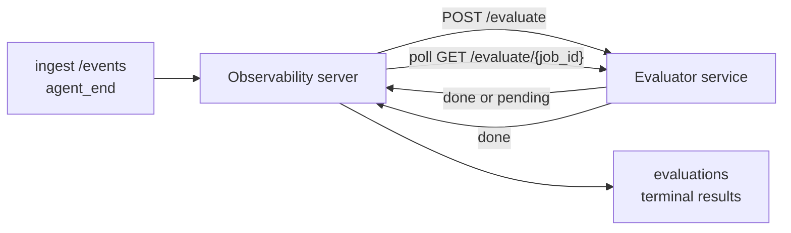

Failproof AI Observability יכול לדרג באופן אוטומטי כל הפעלת agent שהסתיימה לפי איכות: אתה מספק שירות דירוג קטן, ו-Observability מטפל בשאר. השתמש בו כדי לעקוב אחרי הממדים שחשובים לך (עזרתיות, יעילות כלים, עובדתיות, בטיחות; אתה בוחר), לתפוס נסיגות מוקדם, והשוואת agents או סביבות בהצצה. הדירוג הוא התנייה: ה-pipeline לא עושה כלום עד שתקביע `EVALUATOR_ENDPOINT` בשרת.

> **הערה:** אתה מגדיר את ממדי הדירוג. ה-evaluator שלך יכול להחזיר כל מפתחות מספריים שהוא רוצה; Observability שומר, מנטר, ומציג כל מה שאתה שולח בחזרה.

## בהצצה

1. **כתוב דירוג.** הצב שירות HTTP קטן שקורא תמליל של session ומחזיר ניקוד. Observability משלח הפניה עובדת שאתה יכול להעתיק. ראה [כתיבת evaluator עם ה-SDK](#writing-an-evaluator-with-the-sdk).
2. **סמן את Observability אליו.** קבע `EVALUATOR_ENDPOINT` (ו-`EVALUATOR_TOKEN` משותף) בתהליך השרת.
3. **צפה בניקוד שמגיע.** כל session שהושלם מדורג באופן אוטומטי; התוצאות מופיעות בעמוד פרטי ה-session, ברשת ה-sessions, וב-dashboards שמורים.


*לאחר שמודיל evaluator מוגדר, כל הפעלה שהושלמה מדורגת והתוצאות מופיעות בפס הימני של ה-session: הסיכום בחלקו העליון, ולאחר מכן ברים ניקוד לכל ממד עם נימוק.*

---

## איך זה עובד



כאשר Failproof AI Observability SDK פולט אירוע `agent_end` ל-session, השרת מתעד הערכה. לאחר מכן הוא משדר את תמליל האירוע המלא לשירות ה-evaluator שלך, שיכול:

- **להחזיר את התוצאה באופן מיידי** עם `{"status":"done", "scores":{...}, "reasoning":{...}, "summary":"..."}`. התוצאה מתווספת לציר הזמן של הערכת ה-session. `reasoning` ו-`summary` הם אופציונליים.
- **לדחות** עם `{"status":"pending", "job_id":"abc-123"}`. Observability אז קורא ל-`GET {EVALUATOR_ENDPOINT}/evaluate/abc-123` עד שה-evaluator שלך מחזיר `{"status":"done", ...}` או `{"status":"error", "error":"..."}`.

  קצב ה-polling הוא לכל job: תגובת `pending` עשויה לכלול `next_poll_secs` כדי להחריג; אחרת Observability משתמש בערך `default_poll_interval_secs` מ-`GET /config`; אחרת השרת חוזר ל-`EVALUATOR_POLLING_INTERVAL_SECS` (ברירת מחדל 10 שניות). כל הערכים מוגבלים ל-[1s, 1h].

Sessions שלעולם לא פולטים `agent_end` (לדוגמה, תהליך agent שקרס) יכול גם להיות נבחר: `GET /config` של ה-evaluator עשוי להחזיר `{"inactivity_timeout_secs": 1800}`, ו-Observability יעריך כל session שהיה inactive לפרק זמן כה ארוך. קבע את השדה ל-`null` או השמט אותו כדי להשבית את ה-fallback זה.

ה-pipeline הוא no-op לחלוטין כאשר `EVALUATOR_ENDPOINT` לא מוגדר.

Session יכול להצטבר **מספר הערכות סיום לאורך זמן**: כל אירוע `agent_end` (וכל re-eval ידני מה-dashboard) מוסיף שורת הערכה טרייה. זו הדרך הנתמכת להערכת שיחה מחודשת: משתמש מסיים agent, חוזר מאוחר יותר, שולח עוד אירועים, מסיים את ה-agent שוב, והערכה שנייה רצה כנגד התמליל המעודכן המלא. ה-dashboard מציג את ההערכה האחרונה כמטבח וההערכות הקודמות כציר זמן שניתן לכיווץ. כאשר הערכה אחת פועלת לכל session, אירועי `agent_end` נוספים לאותו session מתעלמים; הבא לאחר סיום ההערכה הפעמונית יתערער הערכה טרייה כרגיל.

ה-fallback inactivity מתחדש גם ב-sessions המחודשים: אם אירועים חדשים מגיעים אחרי הערכה טרמינלית קודמת והתא אז הופך ל-idle בעבר `inactivity_timeout_secs`, הערכה טרייה מתערערת.

כשלים שעלולים (5xx, 429, timeouts, שגיאות רשת) נסמנו בחזרה עם exponential backoff עד ל-`EVALUATOR_MAX_ATTEMPTS`; תגובות 4xx הן טרמינליות. Observability בטוח לריצה עם מספר instances של שרת בקנה מידה אופקי; העבודה מחולקת כך שאותו session לעולם לא מיוצא פעמיים בו-זמנית.

---

## חוזה HTTP

כל מסלול מאומת משתמש **באימות bearer token**. אותו ערך חייב להיות מוגדר משני הצדדים:

- שרת Observability: משתנה env `EVALUATOR_TOKEN`
- שירות Evaluator: מוגדר בדרך זהה (ה-SDK `agenteye-evaluator` קורא ל-`EVALUATOR_TOKEN` לפי כנס)

אם `EVALUATOR_TOKEN` לא מוגדר, השרת לא שולח כותרת `Authorization`; ה-evaluator עשוי להקבל בקשות אנונימיות, שזה בסדר לרשת פנימית בלבד אך לא מומלץ ב-public internet.

### מסלולים שה-evaluator חייב להגיש

| מסלול | גוף / params | תגובה |
|---|---|---|
| `GET /health` | אף אחד | `{"status":"ok"}` (פתוח, ללא auth) |
| `GET /config` | אף אחד | `{"inactivity_timeout_secs": <int> \| null, "default_poll_interval_secs": <int> \| omitted}` |
| `POST /evaluate` | `EvalRequest` JSON | `{"status":"done", ...}` או `{"status":"pending", "job_id":"..."}` |
| `GET /evaluate/{id}` | אף אחד | אותה צורת תגובה כמו `/evaluate` |

### גוף `EvalRequest` ששולח השרת

```json
{
  "schema_version": "1",
  "session_id":     "session-abc123",
  "agent_id":       "planner",
  "environment":    "production",
  "started_at":     "2026-05-10T12:00:00Z",
  "ended_at":       "2026-05-10T12:05:00Z",
  "events": [
    { "id": 1234, "ts": "...", "event_type": "agent_start", "payload": { ... } },
    ...
  ]
}
```

### צורות תגובה

**Sync (done):**

```json
{
  "status": "done",
  "scores": { "helpfulness": 0.85, "tool_efficiency": 0.6 },
  "reasoning": {
    "helpfulness": "answered the question directly with citations",
    "tool_efficiency": "called list_files three times when one would have done"
  },
  "summary": "strong answer quality, weak tool selection"
}
```

`reasoning` (מפת הצדקה לכל ניקוד) ו-`summary` (נרטיב כללי של פסקה אחת) שניהם אופציונליים. מפתחות ב-`reasoning` צריכים לשקף מפתחות ב-`scores`; ה-dashboard מעבד כל ערך בשורה מתחת לסרגל הניקוד שלו. Evaluators ישנים יותר שמחזירים רק `scores` ממשיכים לעבוד ללא שינוי; `reasoning` ו-`summary` פשוט קוראים כ-null וה-affordances ה-UI המתאימים מושמטים.

**Async (deferred):**

```json
{ "status": "pending", "job_id": "abc-123", "next_poll_secs": 30 }
```

`next_poll_secs` אופציונלי; אם מושמט השרת חוזר ל-`default_poll_interval_secs` של ה-evaluator מ-`/config`, ואז לשלו `EVALUATOR_POLLING_INTERVAL_SECS` env var.

**שגיאת טרמינלית בצד evaluator:**

```json
{ "status": "error", "error": "model service unavailable" }
```

השרת מעשה כל גוף 2xx אחר כשגיאת פרוטוקול ורוב טרמינלי `error` עבור ה-session.

---

## כתיבת evaluator עם ה-SDK

אתה לא צריך ליישם את חוזה HTTP ביד. חבילת Python `agenteye-evaluator` נותן לך wrapper FastAPI מוקלד המטפל באימות, ניתוב, וצורות בקשה/תגובה בעבורך.

Failproof AI Observability גם משלח **evaluator הפניה עובדת** שדורג `helpfulness`, `tool_efficiency`, ו-`factuality` מצורת התמליל. העתק אותו כנקודת התחלה וחליף בלוגיקה שלך: שופט LLM, מנוע כללים, כל מה שמתאים להגדרת הכיוונון שלך.

Evaluator מינימלי שניתן to liveliness:

```python
import os
from agenteye_evaluator import Evaluator, EvalRequest, EvalResponse

app = Evaluator(token=os.environ["EVALUATOR_TOKEN"])

@app.evaluator
def run(req: EvalRequest) -> EvalResponse:
    # Inspect req.events (the full session transcript) and return scores.
    tool_calls = sum(1 for e in req.events if e.event_type == "tool_use")
    return EvalResponse(
        scores={"tool_calls": float(tool_calls)},
        reasoning={"tool_calls": f"{tool_calls} tool invocations in the transcript"},
        summary="tight tool loop" if tool_calls < 5 else "agent looped on tools",
    )
```

מופע `app` פועל תחת כל שרת ASGI, אז `uvicorn module:app` מתחיל אותו.

עבור evaluators שצריכים לדחות עבודה יקרה, החזר `JobPending` במקום ורשום `@app.job_lookup` handler; שרת Observability סקור `GET /evaluate/{job_id}` עד שאתה מחזיר סטטוס טרמינלי או ה-`EVALUATOR_MAX_POLL_DURATION_SECS` כיפה (ברירת מחדל 1 שעה) חולף.

העדכון API המלא, דפוס async, וסכמה אירועים מתועדים ב-README של SDK `agenteye-evaluator`.

---

## הפעלת ה-evaluator שלך

ה-evaluator הוא **השירות שלך** — Failproof AI Observability לא משלח evaluator ברירת מחדל, אז אתה בונה ומפעיל אותו כל היכן שאתה מפעיל את השירותים שלך. הוא פועל תחת כל שרת ASGI (לדוגמה `uvicorn my_evaluator:app`); הגש את מסלולי `/health`, `/config`, ו-`/evaluate` מ-[חוזה HTTP](#http-contract), ואז סמן את השרת אליו (ראה [קביעת השרת](#configuring-the-server)).

לאחר שה-evaluator נגיש, `GET /health` מחזיר `{"status":"ok"}`. לאחר שagent רץ מקצה לקצה, `GET /evaluations` בשרת מחזיר שורה עם `status: "done"` והניקוד שה-evaluator שלך הפיק.

---

## קביעת השרת

קבע בתהליך השרת:

| Env var | משמעות |
|---|---|
| `EVALUATOR_ENDPOINT` | Base URL של ה-evaluator שלך (`http://evaluator:9000`). לא מוגדר = ה-pipeline מנוטרל. |
| `EVALUATOR_TOKEN` | Bearer token. חייב להיות שווה לערך ש-evaluator service מוגדר אתו. |
| `EVALUATOR_WORKERS` | משימות עובדים לכל instance שרת (ברירת מחדל 2). |
| `EVALUATOR_CLAIM_BATCH` | שורות שטענו לכל tick עובדים (ברירת מחדל 4). אצות מעובדות **בו-זמנית**; concurrency יעיל בנקודת הסיום של ה-evaluator שלך הוא `EVALUATOR_WORKERS × EVALUATOR_CLAIM_BATCH`. |
| `EVALUATOR_POLL_IDLE_SECS` | כמה זמן עובד ישן בין ניסיונות dispatch כשלא הערכה הגיעה (ברירת מחדל 2 שניות). |
| `EVALUATOR_POLLING_INTERVAL_SECS` | Final fallback עבור קצב `GET /evaluate/{id}` כשגם `next_poll_secs` לכל תגובה וגם `default_poll_interval_secs` של ה-evaluator לא מוגדר (ברירת מחדל 10 שניות). |
| `EVALUATOR_REQUEST_TIMEOUT_MS` | Per-request timeout (ברירת מחדל 30000). |
| `EVALUATOR_MAX_ATTEMPTS` | לאחר כשלים זמניים רבים זה התוצאה רשומה כ-`error` טרמינלי (ברירת מחדל 5). |
| `EVALUATOR_CONFIG_REFRESH_SECS` | `GET /config` קצב (ברירת מחדל 300). |
| `EVALUATOR_MAX_POLL_DURATION_SECS` | זמן wallclock מרבי session עשוי להישאר בתור polling לפני שהוא מסתיים כ-`timeout` (ברירת מחדל 3600 שניות). שומר כנגד evaluator שממשיך להחזיר `pending` לנצח. |

כדי להפעיל ניקוד אוטומטי, קבע גם `EVALUATOR_ENDPOINT` וגם `EVALUATOR_TOKEN` בשרת, ואחר כך הפעל מחדש אותו כדי לעלות על השינוי. עם `EVALUATOR_ENDPOINT` לא מוגדר ה-pipeline נשאר no-op.

ידיות הכיול לעיל הן אופציונליות; קבע את משתני הסביבה המתאימים בשרת רק אם אתה צריך להחריג את ברירות המחדל.

---

## הפניה API

| שיטה | נתיב | הרשאה נדרשת | מטרה |
|---|---|---|---|
| `GET` | `/evaluations` | `evaluations:read` | תוצאות טרמינליות שאילתה. תומך ב-`session_id`, `agent_id`, `environment`, `status` (`done`/`error`/`timeout`), `ts_from`, `ts_to`, `cursor`, `limit`, `score_filters`, `latest_per_session`. `limit` ברירות לערך 50 ומוגבל לערך 200 (שימו לב שזה שונה מ-`/events`, שמוגבל ל-1000). `environment` קיבל רשימה מופרדת בפסיקים (למשל `environment=prod,staging`); ערכים בודדים עדיין עובדים. עם `latest_per_session=true` התגובה מכילה לכל היותר שורה אחת לכל `session_id` (האחרון ביותר על ידי `completed_at`) בשימוש בעמוד רשימת ה-sessions כדי לכווץ ציר זמן הערכה של session להדפס הנוכחי. ברירות לערך false (מחזיר את ההיסטוריה המלאה). |
| `GET` | `/evaluations/aggregate` | `evaluations:read` | בריאות eval מגולגלת עבור ריסה מסננת: ספירה סה"כ, פירוק done/error/timeout, סטטיסטיקות לכל-score-key (count/avg/min/max/p50 על top-keyed `scores` שרירותיים), וציר זמן משוכה על ידי זמן. קיבל **אותם params filter כמו `/evaluations`** בתוספת `featured_keys` (CSV של score keys לטרנד) ו-`latest_per_session`. כוחות עמוד Dashboards; מטריקות מדויקות על כל הסט התאימות, לא דגומות. |
| `GET` | `/evaluations/environments` | `evaluations:read` | ערכי סביבה ברורים מטבלת `evaluations`. בשימוש לאוכלוסיית dropdowns filter בקנה מידה לנתונים ניתנים לקריאה-הערכה. |
| `GET` | `/evaluation-jobs` | `evaluations:read` | ראות לתוך הערכות in-flight. סינון לפי `status` (`pending`/`polling`). |
| `GET` | `/events` | `events:read` | זרום אירועים גולמיים של session. תומך ב-`session_id`, `agent_id`, `event_type` (CSV), `environment` (CSV), `ts_from`, `ts_to`, `cursor`, `limit`, וה-`order`. `order` הוא `desc` (newest-first, ברירת המחדל) או `asc` (oldest-first); ערך שלא מוכר חוזר ל-`desc`. Cursor-paginate דרך `next_cursor` של התגובה (id אירוע): העברה חזרה כ-`cursor` כדי לקבל את העמוד הבא; עם `asc` העמוד הבא הוא האירועים אחרי id זה, עם `desc` האירועים לפניו. `limit` ברירות לערך 50 ומוגבל ל-1000. |
| `GET` | `/sessions/:session_id/export` | `events:read` | מחזיר את גוף ה-JSON המדויק שה-evaluator היה מקבל לתא זה, שימשוך כקובץ מצורף להורדה בשם `session-<id>.json`. שימושי לעיבוד מחדש של sessions ייצור דרך `agenteye-evaluator` לבדיקה offline. הבתים הם byte-identical לאלו ש-evaluator pipeline שולח. |
| `POST` | `/sessions/:session_id/re-evaluate` | `evaluations:trigger` | כל הערכה טרייה עבור session; פעולות בין אם קיימת הערכה קודמת או לא. התוצאה החדשה היא **מתווספת** לציר זמן הערכה של ה-session במקום להחליף את הקודם, אז ניקודים קודמים נשארים גלויים כהיסטוריה. החזרות `202` בתערער, `404` עבור session לא ידוע, `409` אם הערכה כבר in-flight. השתמש בזה אחרי deployment evaluator חדש, או עבור sessions שלעולם לא פולטו `agent_end`. |

### סינון לפי טווח ניקוד: `score_filters`

`GET /evaluations` מקבל `score_filters` parameter אופציונלי שמצמצם תוצאות לפי ערכים מספריים בתוך אובייקט `scores`. ה-parameter הוא רשימה מופרדת בפסיקים של ערכים `key:min..max`; כל קשור עשוי להיות מושמט. ערכים מרובים משלבים עם AND לוגי. שורות כאשר המפתח הנקוב חסר או non-numeric מוחרגות. בקשה עלולה לשאת לכל היותר 20 ערכי filter; החריגה שלהם מחזירה HTTP 400.

דוגמאות:
```text
# helpfulness in [0.5, 0.8]
GET /evaluations?score_filters=helpfulness:0.5..0.8

# tool_efficiency at most 0.3 (no lower bound)
GET /evaluations?score_filters=tool_efficiency:..0.3

# helpfulness >= 0.5 AND factuality >= 0.9
GET /evaluations?score_filters=helpfulness:0.5..,factuality:0.9..
```

לכל אובייקט תגובה `/evaluations` יש שדות אלו:

| שדה | סוג | הערות |
|---|---|---|
| `evaluation_id` | string (UUID) | המזהה הקנוני להערכה טרמינלית זו. כל הערכה טרמינלית מקבלת UUID חדש; session יחיד יכול להחזיק רבים. |
| `id` | string (UUID) | תואם-אחורה alias הנושא את אותו ערך כמו `evaluation_id`. |
| `session_id` | string | ה-session הערכה זו רצה נגדה. session יכול להחזיק הערכות מרובות בציר זמן. |
| `agent_id` | string | מזהה את ה-agent שהפיק את ה-session. |
| `environment` | string | תווית סביבה המועתקת מ-session. |
| `status` | enum | אחד מ-`"done"`, `"error"`, `"timeout"`. |
| `scores` | object \| null | ניקודים המוחזרים על ידי ה-evaluator שלך. |
| `reasoning` | object \| null | מפת הצדקה אופציונלית לכל-ניקוד המוחזרת על ידי ה-evaluator שלך. מפתחות בדרך כלל משקפים אלו ב-`scores`. ה-dashboard מעבד כל ערך תחת סרגל הניקוד שלו. |
| `summary` | string \| null | סיכום פסקה אחת אופציונלי כללי המוחזר על ידי ה-evaluator שלך. ה-dashboard מעבד זה מעל פירוק ה-score לכל אחד כהדפס ההערכה. |
| `error` | string \| null | אוכלוס על `"error"` / `"timeout"` רק. |
| `attempt_count` | integer | מספר ניסיונות dispatch (≥ 1). |
| `duration_ms` | integer \| null | משך הניסיון הסופי. |
| `completed_at` | string (ISO 8601 UTC) | כאשר התוצאה הטרמינלית נרשמה. התוצאות מסודרות ב-`completed_at` (newest first). |
| `created_at` | string (ISO 8601 UTC) | נושא את אותו חותם זמן כמו `completed_at` (semantics כתיבה-פעם). |

---

## הרשאות

| הרשאה | מענקים |
|---|---|
| `evaluations:read` | תוצאות הערכה רשימה, צפה בניקודים ב-dashboard, וטען מטריקות בריאות dashboard. |
| `evaluations:trigger` | כל הערכה ידנית עבור session דרך `POST /sessions/:session_id/re-evaluate` או כפתור re-evaluate ב-dashboard. |
| `dashboards:read` | צפה בדashboards שמורים (גם צריך `evaluations:read` כדי לטעון את המטריקות שלהם). |
| `dashboards:write` | יצור וערוך dashboards. |
| `dashboards:delete` | מחק dashboards. |

bootstrap admin (`ADMIN_KEY`, `ADMIN_EMAIL`) קיבל אוטומטית את אלו.

---

## תצפיות תוצאות

- **`/sessions/<id>`**: ציר זמן אירועים + פס ימני המציג ניקודי ה-session וכל שגיאה מניסיון ה-dispatch. אם המפתח שלך יש `evaluations:trigger`, כפתור **re-evaluate** מופיע לצד כפתור ה-export, שימושי עבור sessions שלעולם לא פלטו `agent_end`, או לריענון ניקודים אחרי הצבה evaluator חדש. ה-dashboard סקור את התוצאה החדשה ומעדכן את הפס הימני כאשר הוא נחות.
- **`/sessions`**: רשת session שניתן לסנן; עמודת הניקוד מציגה כל status הערכה של session ודירוגים בהצצה.
- **`/dashboards`**: תצפיות בריאות eval שמורות (ראה [Dashboards](#dashboards) להלן).


*רשת ה-sessions מציגה כל status הערכה של הפעלה ודירוגים בהצצה; תגים אדום/אמבר/ירוק הם ניקודים נמוכים לקפוץ בחוץ.*

---

## Dashboards

עמוד **Dashboards** (`/dashboards`) מאפשר לך לשמור שילוב של filters הערכה כתצפיות שם שניתן להשתמש בהן מחדש וצפה כיצד הפרח הזה של הערכות עושה בהצצה. Dashboards הם **משותפים על פני ארגון שלך כולו**; כל אחד עם `dashboards:read` רואה את אותה קבוצה.

כל dashboard סיכה:

- **Filters**: הבקרות זהה כמו עמוד ה-sessions: סביבה, status, agent, חלון זמן מתגלגל, וfilters score-range (`key:min..max`).
- **תצורת תצוגה**: אילו score keys עד להתחייב, הירוק/אמבר/אדום health thresholds, אילו panels להציג, וכן לא להכניס להערכה האחרונה לכל session.

כל כרטיס מציג את מספר sessions תואמים, פירוק done/error/timeout, את הממוצע של כל featured score, וsparkline trend קטן. פתיחה של dashboard מציגה את המלא-size panels; **open in sessions** מטיל אתך לעמוד ה-sessions pre-filtered לבדיוק אותו מחדש. מטריקות מחושבות בצד-שרת על כל הסט התאימות (דרך `GET /evaluations/aggregate`), אז המספרים דויקים למעמ דגומות.


**הרשאות:** צפייה דורשת גם `dashboards:read` וגם `evaluations:read`; יצירה וערוך דורשים `dashboards:write`; מחיקה דורשת `dashboards:delete`. bootstrap admin קיבל אוטומטית את כל אלו.

---

## פתרון בעיות

**Sessions קיימים אבל לא הערכות נוצרות.** אישור `EVALUATOR_ENDPOINT` מוגדר בתהליך השרת, ששרת ו-evaluator משתפים את אותו ערך `EVALUATOR_TOKEN`, וש-`/health` endpoint של ה-evaluator נגיש מ-host. עם `EVALUATOR_ENDPOINT` לא מוגדר ה-pipeline הוא no-op.

**הערכות in-flight ערמון עד.** שאלה `GET /evaluation-jobs` כדי לראות את תור in-flight. בדוק `attempt_count`, `next_attempt_at`, ו-`last_error` בכל שורה. סיבות נפוצות: שירות evaluator לא נגיש או להחזיר 5xx (נסמנו בחזרה עם backoff), לא נכון `EVALUATOR_TOKEN` (401 טרמינלי), או async evaluator שמחזיר `pending` לנצח (ראה להלן).

**Sessions הושלמו אבל לא הערכה טרמינלית.** שאלה `GET /evaluation-jobs?status=polling`; התוצאה עלולה להיות עדיין in-flight. אם job תקוע ב-`pending`, השרת יש בעיה להגיע ל-evaluator; בדוק כי ה-evaluator גם עד וש-`EVALUATOR_TOKEN` תואמים.

**`HTTP 401 from evaluator: invalid bearer token`.** ה-`EVALUATOR_TOKEN` בשרת לא תואמים את הערך ש-evaluator service מוגדר אתו. הם חייבים להיות זהים.

**Async evaluator מחזיר `pending` לנצח.** השרת סקור `GET /evaluate/{job_id}` עד ש-evaluator מחזיר `done` או `error`, או עד `EVALUATOR_MAX_POLL_DURATION_SECS` (ברירת מחדל 1 שעה) עוברת. אחרי הכיפה ההערכה נרשמה כ-`timeout` והוסרה מהתור in-flight. גבה `EVALUATOR_MAX_POLL_DURATION_SECS` אם ה-evaluator שלך בהגון צורך יותר מברירת המחדל.

---

## השלבים הבאים

- [Evaluator agent skill](/he/agenteye/evaluator-skill): יש coding agent לעצב את הממדים שלך נגד sessions אמיתיים ובנה את השירות הזה בעבורך.
- [Python SDK](/he/agenteye/python-sdk): פלוט `agent_end` אירועים שטריגר דירוג.
- [API keys](/he/agenteye/api-keys): ההרשאות `evaluations:read` ו-`evaluations:trigger`.
- [Audits](/he/agenteye/audits): Observability של Failproof AI בעיה אחרת בחינה, לבדיקה מבוססת-policy.