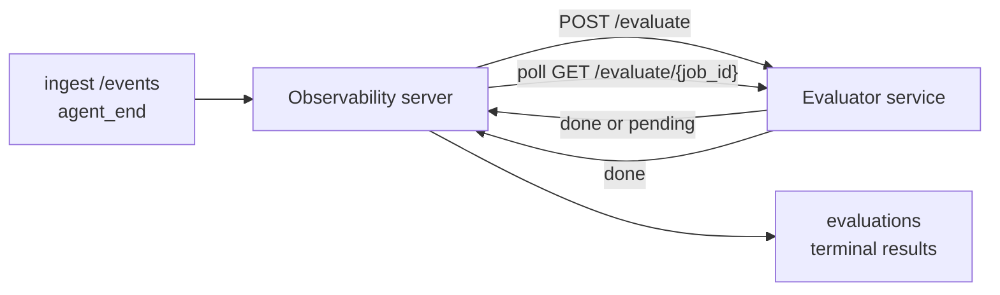

Failproof AI Observability יכול לדרג אוטומטית כל הרצה של agent שהסתיימה לאיכות: אתה מספק שירות דירוג קטן, ו-Observability מטפל בשאר. השתמש בו כדי לעקוב אחר הממדים שחשובים לך (עזרתיות, יעילות כלים, עובדתיות, בטיחות; בחר בעצמך), תפוס רגרסיות מוקדם, והשווה בין agents או סביבות במבט מהיר. דירוג הוא אופציונלי: הצינור לא עושה כלום עד שתגדיר `EVALUATOR_ENDPOINT` בשרת.

> **הערה:** אתה מגדיר את ממדי הדירוג. המעריך שלך יכול להחזיר כל מפתחות מספריים שהוא רוצה; Observability אחסן, מעקב ותצוגה של כל מה שאתה שולח חזרה.

## בקיצור

1. **כתוב דורג.** הקם שירות HTTP קטן שקורא תמלול הפעלה ומחזיר דירוגים. Observability משלח התייחסות עובדת שאתה יכול להעתיק. ראה [כתיבת מעריך עם ה-SDK](#writing-an-evaluator-with-the-sdk).
2. **הצב את Observability עליו.** הגדר `EVALUATOR_ENDPOINT` (ו-`EVALUATOR_TOKEN` משותף) בתהליך השרת.
3. **צפה בדירוגים להגיע.** כל הפעלה שהושלמה מדורגת אוטומטית; התוצאות מופיעות בעמוד פרטי ההפעלה, רשת ההפעלות, ותרשימי בקרה שנשמרו.


*כשמעריך מוגדר, כל הרצה שהושלמה מדורגת והתוצאות מופיעות בתוך הפנל הימני של ההפעלה: הסיכום בחלק העליון, ואחריו פסי דירוג למימד עם נימוקים.*

---

## איך זה עובד



כשה-SDK של Observability פולט אירוע `agent_end` עבור הפעלה, השרת מתכנן הערכה. לאחר מכן הוא POST את תמלול האירוע המלא לשירות המעריך שלך, שיכול להיות:

- **החזר את התוצאה באופן מיידי** עם `{"status":"done", "scores":{...}, "reasoning":{...}, "summary":"..."}`. התוצאה מצורפת לציר הזמן של הערכת ההפעלה. `reasoning` ו-`summary` הם אופציונליים.
- **דחה** עם `{"status":"pending", "job_id":"abc-123"}`. Observability לאחר מכן קורא `GET {EVALUATOR_ENDPOINT}/evaluate/abc-123` עד שהמעריך שלך מחזיר `{"status":"done", ...}` או `{"status":"error", "error":"..."}`.

  קצב הסקירה לכל עבודה: תגובת `pending` עשויה לכלול `next_poll_secs` כדי להחליף; אחרת Observability משתמש בערך `default_poll_interval_secs` מ-`GET /config`; אחרת השרת חוזר ל-`EVALUATOR_POLLING_INTERVAL_SECS` (ברירת מחדל 10s). כל הערכים קלויים ל-[1s, 1h].

הפעלות שלא פלטו `agent_end` (לדוגמה, תהליך agent שקרס) יכולות גם להיבחר: ה-`GET /config` של המעריך עשוי להחזיר `{"inactivity_timeout_secs": 1800}`, ו-Observability יערוך כל הפעלה שהייתה בשקט במשך זה הרבה זמן. הגדר את השדה ל-`null` או השמט אותו כדי להשבית את הסיוע הזה.

הצינור הוא no-op לחלוטין כשלא הוגדר `EVALUATOR_ENDPOINT`.

הפעלה יכולה להצבור **מספר הערכות טרמינליות לאורך זמן**: כל אירוע `agent_end` (וכל re-eval ידני מהלוח) מוסיף שורת הערכה חדשה. זו הדרך המומלצת להערכת שיחה חדשה: משתמש מסיים agent, חוזר מאוחר יותר, שולח עוד אירועים, מסיים את agent שוב, וההערכה השנייה פועלת נגד התמלול המלא המעודכן. הלוח מעניק את ההערכה העדכנית ביותר כהכותרת והערכות הקודמות כציר זמן שניתן לכיווץ. בזמן שהערכה אחת פועלת עבור הפעלה, אירועי `agent_end` נוספים לאותה הפעלה מתעלמים; ההבא אחרי שהערכה הפעילה מסתיימת יקטלג הערכה חדשה כרגיל.

הסיוע התוקף מחדש של חוסר פעילות פועל גם בהפעלות חדשות: אם אירועים חדשים מגיעים לאחר הערכה טרמינלית קודמת וההפעלה לאחר מכן תהיה בטל בעבר `inactivity_timeout_secs`, הערכה חדשה מתואזנת בתור.

כשלים זמניים (5xx, 429, timeouts, שגיאות רשת) מופעלו מחדש עם backoff אקספוננציאלי עד `EVALUATOR_MAX_ATTEMPTS`; תגובות 4xx הן טרמינליות. Observability בטוח להריץ עם מספר instances שרת בקנה מידה אופקי; העבודה מחולקת כך שאותה הפעלה לא מועברת לעולם פעמיים בו-זמנית.

---

## חוזה HTTP

כל נתיב מאומת משתמש **auth של bearer token**. אותו ערך חייב להיות מוגדר משני הצדדים:

- שרת Observability: משתנה env `EVALUATOR_TOKEN`
- שירות המעריך: מוגדר באותו אופן (ה-SDK `agenteye-evaluator` קורא `EVALUATOR_TOKEN` לפי מוסכמה)

אם לא הוגדר `EVALUATOR_TOKEN`, השרת לא שולח header `Authorization`; המעריך עשוי אז לקבל בקשות ללא זיהוי, וזה בסדר לרשת פנימית בלבד אך מונע ברשת הציבור.

### נתיבים שהמעריך חייב להגיש

| נתיב | גוף / פרמטרים | תגובה |
|---|---|---|
| `GET /health` | אין | `{"status":"ok"}` (פתוח, ללא auth) |
| `GET /config` | אין | `{"inactivity_timeout_secs": <int> \| null, "default_poll_interval_secs": <int> \| omitted}` |
| `POST /evaluate` | `EvalRequest` JSON | `{"status":"done", ...}` או `{"status":"pending", "job_id":"..."}` |
| `GET /evaluate/{id}` | אין | אותו צורת תגובה כמו `/evaluate` |

### גוף `EvalRequest` ששלח השרת

```json
{
  "schema_version": "1",
  "session_id":     "session-abc123",
  "agent_id":       "planner",
  "environment":    "production",
  "started_at":     "2026-05-10T12:00:00Z",
  "ended_at":       "2026-05-10T12:05:00Z",
  "events": [
    { "id": 1234, "ts": "...", "event_type": "agent_start", "payload": { ... } },
    ...
  ]
}
```

### צורות תגובה

**Sync (done):**

```json
{
  "status": "done",
  "scores": { "helpfulness": 0.85, "tool_efficiency": 0.6 },
  "reasoning": {
    "helpfulness": "answered the question directly with citations",
    "tool_efficiency": "called list_files three times when one would have done"
  },
  "summary": "strong answer quality, weak tool selection"
}
```

`reasoning` (מפת הצדקה לדירוג) ו-`summary` (נרטיב של פסקה אחת כללית) שניהם אופציונליים. מפתחות ב-`reasoning` צריכים לשקף מפתחות ב-`scores`; הלוח מעניק כל ערך בתוך פס הדירוג שלו. מעריכים ישנים יותר שמחזירים רק `scores` ממשיכים לעבוד ללא שינוי; `reasoning` ו-`summary` פשוט קרוא כ-null והאפורדנסיות ממשק המתאימות מושמטות.

**Async (deferred):**

```json
{ "status": "pending", "job_id": "abc-123", "next_poll_secs": 30 }
```

`next_poll_secs` הוא אופציונלי; אם מושמט השרת חוזר ל-`default_poll_interval_secs` של המעריך מ-`/config`, ואחריו למשתנה env `EVALUATOR_POLLING_INTERVAL_SECS` שלו.

**שגיאת טרמינלית בצד המעריך:**

```json
{ "status": "error", "error": "model service unavailable" }
```

השרת מטפל בכל גוף 2xx אחר כשגיאת פרוטוקול ומתעד שגיאה טרמינלית עבור ההפעלה.

---

## כתיבת מעריך עם ה-SDK

אתה לא צריך ליישם את חוזה HTTP ביד. חבילת Python `agenteye-evaluator` נותנת לך עטיפה FastAPI מוקלדת שמטפלת ב-auth, ניתוב, וצורות בקשה/תגובה בשבילך.

Failproof AI Observability גם משלח **מעריך התייחסות עובד** שדורג `helpfulness`, `tool_efficiency`, ו-`factuality` מצורת התמלול. העתק אותו כנקודת התחלה והחלף בלוגיקה שלך: שופט LLM, מנוע כללים, או כל מה שמתאים לסטנדרט האיכות שלך.

מעריך מינימלי קיים:

```python
import os
from agenteye_evaluator import Evaluator, EvalRequest, EvalResponse

app = Evaluator(token=os.environ["EVALUATOR_TOKEN"])

@app.evaluator
def run(req: EvalRequest) -> EvalResponse:
    # Inspect req.events (the full session transcript) and return scores.
    tool_calls = sum(1 for e in req.events if e.event_type == "tool_use")
    return EvalResponse(
        scores={"tool_calls": float(tool_calls)},
        reasoning={"tool_calls": f"{tool_calls} tool invocations in the transcript"},
        summary="tight tool loop" if tool_calls < 5 else "agent looped on tools",
    )
```

instance ה-`app` פועל תחת כל שרת ASGI, אז `uvicorn module:app` מפעיל אותו.

עבור מעריכים שצריכים להעביר עבודה יקרה, החזר `JobPending` בעוד בו ורשום `@app.job_lookup` handler; שרת Observability סוקר `GET /evaluate/{job_id}` עד שתחזיר מצב טרמינלי או תקע `EVALUATOR_MAX_POLL_DURATION_SECS` (ברירת מחדל 1 h) מתחיל.

ה-API reference המלא, דפוס async, וסכמת אירוע מתועדים ב-README של SDK `agenteye-evaluator`.

---

## הרצת המעריך שלך

המעריך הוא **שירות שלך** — Failproof AI Observability לא משלח מעריך ברירת מחדל, כך שאתה בונה והרץ אותו איפה שאתה מריץ את השירותים שלך. הוא פועל תחת כל שרת ASGI (לדוגמה `uvicorn my_evaluator:app`); הגיש את נתיבי `/health`, `/config`, ו-`/evaluate` מה-[HTTP contract](#http-contract), ואחריו הצב את השרת עליו (ראה [הגדרת השרת](#configuring-the-server)).

ברגע שהמעריך נגיע, `GET /health` מחזיר `{"status":"ok"}`. לאחר שהופעל agent מקצה לקצה, `GET /evaluations` בשרת מחזיר שורה עם `status: "done"` והדירוגים שהמעריך שלך הפיק.

---

## הגדרת השרת

הגדר בתהליך השרת:

| משתנה Env | משמעות |
|---|---|
| `EVALUATOR_ENDPOINT` | URL בסיס של המעריך שלך (`http://evaluator:9000`). לא מוגדר = צינור מוגבל. |
| `EVALUATOR_TOKEN` | Bearer token. חייב להיות שווה לערך שהשירות המעריך מוגדר איתו. |
| `EVALUATOR_WORKERS` | משימות worker לכל instance שרת (ברירת מחדל 2). |
| `EVALUATOR_CLAIM_BATCH` | שורות שנתבעו לכל tick worker (ברירת מחדל 4). קבוצות מעובדות **בו-זמנית**; קונקורנציה יעילה בנקודת הקצה של המעריך שלך היא `EVALUATOR_WORKERS × EVALUATOR_CLAIM_BATCH`. |
| `EVALUATOR_POLL_IDLE_SECS` | כמה זמן worker ישן בין ניסיונות משלוח כשלא הערכה הגיונית (ברירת מחדל 2s). |
| `EVALUATOR_POLLING_INTERVAL_SECS` | חזרה סופית עבור קצב `GET /evaluate/{id}` כשלא `next_poll_secs` לכל-תגובה ולא `default_poll_interval_secs` של המעריך הוגדר (ברירת מחדל 10s). |
| `EVALUATOR_REQUEST_TIMEOUT_MS` | timeout לכל בקשה (ברירת מחדל 30000). |
| `EVALUATOR_MAX_ATTEMPTS` | לאחר כל כך הרבה כשלים חולפים התוצאה מתועדת כ-`error` טרמינלי (ברירת מחדל 5). |
| `EVALUATOR_CONFIG_REFRESH_SECS` | קצב `GET /config` (ברירת מחדל 300). |
| `EVALUATOR_MAX_POLL_DURATION_SECS` | זמן wallclock מקסימלי שהפעלה עשויה להישאר בתור הסקירה לפני שהיא מסתיימת כ-`timeout` (ברירת מחדל 3600s). שומר נגד מעריך שממשיך להחזיר `pending` לחלוטין. |

כדי להפעיל דירוג אוטומטי, הגדר גם `EVALUATOR_ENDPOINT` וגם `EVALUATOR_TOKEN` בשרת, ולאחר מכן הפעל מחדש כדי להרים את השינוי. עם `EVALUATOR_ENDPOINT` לא מוגדר הצינור נשאר no-op.

כפתורי כיוונון הנ״ל הם אופציונליים; הגדר משתנים env תואמים בשרת רק אם אתה צריך להחליף את ברירות המחדל.

---

## API reference

| שיטה | נתיב | הרשאה נדרשת | מטרה |
|---|---|---|---|
| `GET` | `/evaluations` | `evaluations:read` | תשאול תוצאות טרמינליות. תומך `session_id`, `agent_id`, `environment`, `status` (`done`/`error`/`timeout`), `ts_from`, `ts_to`, `cursor`, `limit`, `score_filters`, `latest_per_session`. `limit` ברירות 50 וקלוי ב-200 (שימו לב שזה שונה מ-`/events`, אשר קלוי ב-1000). `environment` מקבל רשימה מופרדת בפסיק (למשל `environment=prod,staging`); ערכים יחידים עדיין עובדים. עם `latest_per_session=true` התגובה מכילה לכל היותר שורה אחת לכל `session_id` (האחרון ביותר לפי `completed_at`) בשימוש בעמוד רשימת ההפעלות כדי לכווץ ציר זמן הערכת של הפעלה לכותרת הנוכחית שלה. ברירות ל-false (מחזיר את ההיסטוריה המלאה). |
| `GET` | `/evaluations/aggregate` | `evaluations:read` | בריאות eval מעוטפת עבור פרוסה מסוננת: ספירה כוללת, פירוק done/error/timeout, סטטיסטיקות לכל-מפתח-דירוג (count/avg/min/max/p50 על `scores` שרירותי), וציר זמן קטוע זמן. מקבל **אותן פרמטרי סנן כמו `/evaluations`** בתוספת `featured_keys` (CSV של מפתחות דירוג כדי לעקוב) ו-`latest_per_session`. תומך בתכונה Dashboards; מטרות שדויקות על כל ערכה התואמת, לא דוגמה. |
| `GET` | `/evaluations/environments` | `evaluations:read` | ערכי environment מובחנים מטבלת ה-`evaluations`. משמש למילוי תיבות סנן בהיקף נתונים קרוא-הערכה. |
| `GET` | `/evaluation-jobs` | `evaluations:read` | ראות לתוך הערכות מעופות. סנן לפי `status` (`pending`/`polling`). |
| `GET` | `/events` | `events:read` | הזרם אירועים גולמיים של הפעלה. תומך `session_id`, `agent_id`, `event_type` (CSV), `environment` (CSV), `ts_from`, `ts_to`, `cursor`, `limit`, ו-`order`. `order` הוא `desc` (newest-first, ברירת מחדל) או `asc` (oldest-first); ערך לא מוכר חוזר ל-`desc`. סמן-עמוד דרך ה-`next_cursor` של התגובה (id אירוע): העבר אותו חזרה כ-`cursor` כדי לקבל את העמוד הבא; עם `asc` העמוד הבא הוא האירועים לאחר אותו id, עם `desc` האירועים לפניו. `limit` ברירות 50 וקלוי ב-1000. |
| `GET` | `/sessions/:session_id/export` | `events:read` | מחזיר את גוף JSON המדוייק שהמעריך היה מקבל עבור הפעלה זו, המוגש כעת קובץ להורדה בשם `session-<id>.json`. שימושי לניגון הפעלות ייצור דרך `agenteye-evaluator` לבדיקה פתוחה. הבתים זהים בדיוק לכל מה שצינור המעריך שולח. |
| `POST` | `/sessions/:session_id/re-evaluate` | `evaluations:trigger` | תור הערכה טרית עבור הפעלה; מופעל בין אם קיימת הערכה קודמת ובין אם לא. התוצאה החדשה היא **מצורפת** לציר זמן הערכה של ההפעלה ולא החלפה של הקודמת, כך שדירוגים קודמים נשארים גלויים כהיסטוריה. מחזיר `202` בתור, `404` עבור הפעלה לא ידועה, `409` אם הערכה כבר בטיסה. השתמש בזה לאחר פרסום מעריך חדש, או עבור הפעלות שלא פלטו `agent_end`. |

### סינון לפי טווח דירוג: `score_filters`

`GET /evaluations` מקבל פרמטר `score_filters` אופציונלי שמצמצם תוצאות לפי ערכים מספריים בתוך הישות `scores`. הפרמטר הוא רשימה מופרדת בפסיק של ערכים `key:min..max`; כל קשר עשוי להיות מושמט. ערכים מרובים משולבים עם AND לוגי. שורות היכן שהמפתח הנקוב נעדר או לא מספרי מוחרגות. בקשה עשויה להכיל לכל היותר 20 ערכי סינון; חריגה מזה מחזיר HTTP 400.

דוגמאות:
```text
# helpfulness in [0.5, 0.8]
GET /evaluations?score_filters=helpfulness:0.5..0.8

# tool_efficiency at most 0.3 (no lower bound)
GET /evaluations?score_filters=tool_efficiency:..0.3

# helpfulness >= 0.5 AND factuality >= 0.9
GET /evaluations?score_filters=helpfulness:0.5..,factuality:0.9..
```

כל אובייקט תגובה `/evaluations` יש לו שדות אלה:

| שדה | סוג | הערות |
|---|---|---|
| `evaluation_id` | string (UUID) | המזהה הקנוני עבור הערכה טרמינלית זו. כל הערכה טרמינלית מקבלת UUID חדש; הפעלה אחת יכולה להחזיק מרובים. |
| `id` | string (UUID) | כינוי תאימות לאחור הנושא את אותו ערך כמו `evaluation_id`. |
| `session_id` | string | ההפעלה שהערכה זו פעלה נגדה. הפעלה יכולה להיות בעלת מספר הערכות בציר הזמן. |
| `agent_id` | string | מזהה את ה-agent שהייצר את ההפעלה. |
| `environment` | string | תווית סביבה המועתקת מההפעלה. |
| `status` | enum | אחד מ-`"done"`, `"error"`, `"timeout"`. |
| `scores` | object \| null | דירוגים שהחזיר המעריך שלך. |
| `reasoning` | object \| null | מפת הצדקה אופציונלית לכל-דירוג שהחזיר המעריך שלך. מפתחות בדרך כלל משקפים אלה ב-`scores`. הלוח מעניק כל ערך תחת פס הדירוג שלו. |
| `summary` | string \| null | נרטיב אופציונלי של פסקה אחת כללית שהחזיר המעריך שלך. הלוח מעניק זאת מעל פירוק הדירוג לכל-מימד ככותרת ההערכה. |
| `error` | string \| null | מלא ב-`"error"` / `"timeout"` בלבד. |
| `attempt_count` | integer | מספר ניסיונות משלוח (≥ 1). |
| `duration_ms` | integer \| null | משך הניסיון הסופי. |
| `completed_at` | string (ISO 8601 UTC) | מתי התוצאה הטרמינלית תועדה. התוצאות מסודרות לפי `completed_at` (הנושן ראשון). |
| `created_at` | string (ISO 8601 UTC) | נושא את אותו חותם זמן כמו `completed_at` (סמנטיקת כתיבה פעם אחת). |

---

## הרשאות

| הרשאה | מעניקות |
|---|---|
| `evaluations:read` | רשימת תוצאות הערכה, צפייה בדירוגים בלוח, וטעינה של מטרות בריאות לוח. |
| `evaluations:trigger` | תור ידני של הערכה עבור הפעלה דרך `POST /sessions/:session_id/re-evaluate` או כפתור re-evaluate של הלוח. |
| `dashboards:read` | צפייה בתרשימי בקרה שנשמרו (גם צריך `evaluations:read` כדי לטעון את המטרות שלהם). |
| `dashboards:write` | יצירה ועריכה של תרשימי בקרה. |
| `dashboards:delete` | מחיקה של תרשימי בקרה. |

ה-admin בהנעה (`ADMIN_KEY`, `ADMIN_EMAIL`) מקבל אוטומטית את אלה.

---

## צפייה בתוצאות

- **`/sessions/<id>`**: ציר זמן אירועים + פנל ימני המציג את דירוגי ההפעלה וכל שגיאה מניסיון המשלוח. אם למפתח שלך יש `evaluations:trigger`, כפתור **re-evaluate** מופיע ליד כפתור ה-export, שימושי עבור הפעלות שלא פלטו `agent_end`, או לרענון דירוגים לאחר פרסום מעריך חדש. הלוח סוקר את התוצאה החדשה ומעדכן את הפנל הימני כשהוא מגיע.
- **`/sessions`**: רשת הפעלה שניתנת לסינון; עמודת הדירוג מציגה את מצב ההערכה וקובץ של כל הפעלה בהסתכלות מהיר.
- **`/dashboards`**: צפיות בריאות eval שנשמרו (ראה [Dashboards](#dashboards) למטה).


*רשת הפעלות מציגה מצב הערכה וקובץ של כל הפעלה בהסתכלות מהיר; badges אדום/צהוב/ירוק הופכים דירוגים נמוכים קופצים החוצה.*

---

## Dashboards

דף ה-**Dashboards** (`/dashboards`) מאפשר לך לשמור על שילוב של סנני הערכה כתצוגה שנקוב, ניתן לשימוש חוזר וצפה כיצד פרוסה זו של הערכות עושה בהסתכלות מהיר. Dashboards הם **משותף על כל הארגון שלך**; כולם עם `dashboards:read` רואים את אותה הערכה.

כל לוח מסיכות:

- **Filters**: אותו שליטוי כמו עמוד הפעלות: environment, status, agent, חלון זמן מתגלגל, וסנני טווח דירוג (`key:min..max`).
- **תצוגת הגדרה**: איזה מפתחות דירוג לתכונה, סף בריאות ירוק/צהוב/אדום, אילו פנלים להציג, ואם לכווץ להערכה העדכנית ביותר לכל הפעלה.

כל כרטיס מציג את מספר הפעלות התואמות, פירוק done/error/timeout, הממוצע של כל דירוג תכונה, וספרקלין ספק קטן. פתיחת לוח מציג את הפנלים בגודל מלא; **"open in sessions"** מוריד אותך לעמוד הפעלות מסונן קדימה לבדיוק פרוסה זו. מטרות מחושב בצד השרת על כל ערכה התואמת (דרך `GET /evaluations/aggregate`), כך שהמספרים דויקים ולא דוגמה.


**Permissions:** הצפייה צריכה גם `dashboards:read` וגם `evaluations:read`; יצירה ועריכה צריכה `dashboards:write`; מחיקה צריכה `dashboards:delete`. ה-admin בהנעה מקבל את כל אלה אוטומטית.

---

## פתרון בעיות

**הפעלות קיימות אך לא הערכות נוצרו.** אשר `EVALUATOR_ENDPOINT` מוגדר בתהליך השרת, ששרת המעריך משתפים את אותו ערך `EVALUATOR_TOKEN`, וכי נקודת הקצה `/health` של המעריך נגישה מהשרת. עם `EVALUATOR_ENDPOINT` לא מוגדר הצינור הוא no-op.

**הערכות מעופות ערמות.** שאול `GET /evaluation-jobs` כדי לראות תור מעופות. בדוק `attempt_count`, `next_attempt_at`, ו-`last_error` בכל שורה. סיבות נפוצות: שירות המעריך לא נגיש או מחזיר 5xx (הופעל מחדש עם backoff), `EVALUATOR_TOKEN` לא נכון (401 הוא טרמינלי), או מעריך async המחזיר `pending` לחלוטין (ראה למטה).

**הפעלות הושלמו אך לא הערכה טרמינלית.** שאול `GET /evaluation-jobs?status=polling`; התוצאה עשויה להיות עדיין מעופה. אם עבודה תקועה ב-`pending`, השרת מתקשה להגיע למעריך; בדוק שהמעריך הוא למעלה וכי `EVALUATOR_TOKEN` משחקים.

**`HTTP 401 from evaluator: invalid bearer token`.** ה-`EVALUATOR_TOKEN` בשרת לא תואם את הערך שהשירות המעריך מוגדר איתו. הם חייבים להיות זהים.

**Async מעריך מחזיר `pending` לחלוטין.** השרת סוקר `GET /evaluate/{job_id}` עד שהמעריך מחזיר `done` או `error`, או עד `EVALUATOR_MAX_POLL_DURATION_SECS` (ברירת מחדל 1 h) מתחיל. לאחר התקע ההערכה מתועדת כ-`timeout` ומוסר מתור מעופות. הגבה `EVALUATOR_MAX_POLL_DURATION_SECS` אם המעריך שלך בלגיטימציה צריך זמן ארוך מברירת המחדל.

---

## צעדים הבאים

- [Evaluator agent skill](/he/agenteye/evaluator-skill): היה בעל coding agent עיצוב הממדים שלך נגד הפעלות אמיתיות וביצוע שירות זה בשבילך.
- [Python SDK](/he/agenteye/python-sdk): פלוט את אירועי `agent_end` שמפעילים דירוג.
- [API keys](/he/agenteye/api-keys): הרשאות `evaluations:read` ו-`evaluations:trigger`.
- [Audits](/he/agenteye/audits): תכונת איכות אוטומטית אחרת של Observability, לסקירה מבוססת מדיניות.