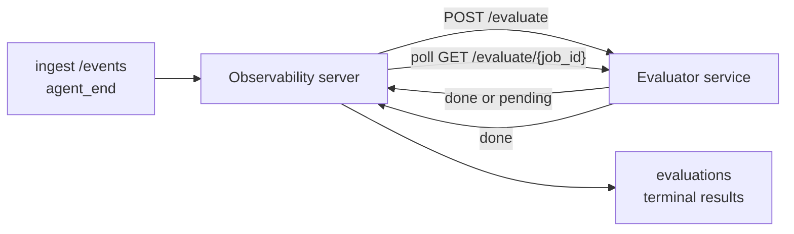

Failproof AI Observability יכול לתן ציון באופן אוטומטי לכל הרצה של agent שהסתיימה עבור איכות: אתה מספק שירות ניקוד קטן, ו-Observability מטפל בשאר. השתמש בזה כדי לעקוב אחר הממדים שחשובים לך (עזרתיות, יעילות כלים, עובדתיות, בטיחות; אתה בוחר), תופס רגרסיות מוקדמות, והשווה agents או סביבות במבט חוטף. ניקוד הוא אופציונלי: הצינור לא עושה שום דבר עד שתוגדר `EVALUATOR_ENDPOINT` על השרת.

> **הערה:** אתה מגדיר את ממדי הציון. המעריך שלך יכול להחזיר כל מפתחות מספריים שהוא רוצה; Observability שומר, עוקב טרנדים, ומציג כל מה שאתה שולח חזרה.

## בהצצה

1. **כתוב מעריך.** הקם שירות HTTP קטן שקורא תמליל הפעלה ומחזיר ציונים. Observability משלח עבודה חישוק שאתה יכול להעתיק. ראה [כתיבת מעריך עם ה-SDK](#writing-an-evaluator-with-the-sdk).
2. **הצבע את Observability אליו.** תנו `EVALUATOR_ENDPOINT` (ו-`EVALUATOR_TOKEN` משותף) בתהליך השרת.
3. **צפה בהנחתת הציונים.** כל הפעלה מסיימת מקבלת ציון באופן אוטומטי; התוצאות מופיעות בעמוד פרטי ההפעלה, ברשת ההפעלות, ובלוחות מידע שמורים.


*כאשר מעריך מוגדר, כל הרצה שהושלמה מקבלת ציון והתוצאות מופיעות בעמודה הימנית של ההפעלה: הסיכום בחלק העליון, ואחר כך סרגלי ציון לכל ממד עם נימוק.*

---

## איך זה עובד



כאשר Observability SDK משדר אירוע `agent_end` להפעלה, השרת מתזמן הערכה. לאחר מכן הוא משדר את תמליל האירוע המלא לשירות המעריך שלך, שיכול:

- **להחזיר את התוצאה בשורה** עם `{"status":"done", "scores":{...}, "reasoning":{...}, "summary":"..."}`. התוצאה מתוספת לציר הזמן של ההערכה של ההפעלה. `reasoning` ו-`summary` אופציונליים.
- **להדחות** עם `{"status":"pending", "job_id":"abc-123"}`. Observability ואז קורא `GET {EVALUATOR_ENDPOINT}/evaluate/abc-123` עד שהמעריך שלך מחזיר `{"status":"done", ...}` או `{"status":"error", "error":"..."}`.

  קצב הסקר הוא לפי-עבודה: תגובת `pending` עשויה לכלול `next_poll_secs` כדי להפוך; אחרת Observability משתמש בערך `default_poll_interval_secs` מ-`GET /config`; אחרת השרת חוזר ל-`EVALUATOR_POLLING_INTERVAL_SECS` (ברירת מחדל 10s). כל הערכים מחוברים ל-[1s, 1h].

הפעלות שלעולם לא משדרות `agent_end` (לדוגמה, תהליך agent שקרס) יכול גם להיאסוף: `GET /config` של המעריך עשוי להחזיר `{"inactivity_timeout_secs": 1800}`, ו-Observability יעריך כל הפעלה שהשתקתה במשך כל כך הרבה זמן. הגדר את השדה ל-`null` או השמט אותו כדי להשבית חלופה זו.

הצינור הוא no-op לחלוטין כאשר `EVALUATOR_ENDPOINT` לא מוגדר.

הפעלה יכולה להצטבר **מרובות הערכות טרמינליות לאורך זמן**: כל אירוע `agent_end` (וכל הערכה חוזרת ידנית מלוח הנתונים) מוסיף שורת הערכה טרייה. זו הדרך הנתמכת להערכת שיחה שהורשמה: משתמש מסיים agent, חוזר מאוחר יותר, שולח עוד אירועים, מסיים את ה-agent שוב, והערכה שנייה פועלת מול התמליל המעודכן המלא. לוח הנתונים משדר את ההערכה האחרונה ביותר כהכותרת וההערכות הקודמות כציר זמן שניתן לקיפול. בזמן שהערכה אחת פועלת להפעלה, אירועי `agent_end` נוספים לאותה הפעלה מתעלמים; השנייה אחרי שההערכה הפועלת מסיימת תשדר הערכה טרייה כרגיל.

החלופה של אי-פעילות מופעלת מחדש גם בהפעלות שהורשמו: אם אירועים חדשים מגיעים לאחר הערכה טרמינלית קודמת והפעלה לאחר מכן משתקת עד `inactivity_timeout_secs`, הערכה טרייה תורשת.

כשלים חולפים (5xx, 429, timeouts, שגיאות רשת) מנסים שוב עם backoff אקספוננציאלי עד `EVALUATOR_MAX_ATTEMPTS`; תגובות 4xx הן טרמינליות. Observability בטוח לריצה עם מספר instances של שרת מדורג בצורה אופקית; עבודה מחולקת כך שאותה הפעלה לעולם לא תיישלח פעמיים בו-זמנית.

---

## חוזה HTTP

כל מסלול מאומת משתמש **בהנחתת token נושא**. אותו ערך חייב להיות מוגדר משני הצדדים:

- שרת Observability: משתנה env `EVALUATOR_TOKEN`
- שירות המעריך: מוגדר בדרך זהה (ה-SDK של `agenteye-evaluator` קורא `EVALUATOR_TOKEN` בהמשך)

אם `EVALUATOR_TOKEN` לא מוגדר, השרת לא שולח header `Authorization`; המעריך עשוי אז להסכים לבקשות אנונימיות, שזה בסדר לרשת פנימית בלבד אך מומלץ נגדו באינטרנט הציבורי.

### מסלולים שהמעריך חייב לשרת

| מסלול | גוף / פרמטרים | תגובה |
|---|---|---|
| `GET /health` | none | `{"status":"ok"}` (פתוח, ללא auth) |
| `GET /config` | none | `{"inactivity_timeout_secs": <int> \| null, "default_poll_interval_secs": <int> \| omitted}` |
| `POST /evaluate` | `EvalRequest` JSON | `{"status":"done", ...}` או `{"status":"pending", "job_id":"..."}` |
| `GET /evaluate/{id}` | none | צורת תגובה זהה ל-`/evaluate` |

### גוף `EvalRequest` שנשלח על ידי השרת

```json
{
  "schema_version": "1",
  "session_id":     "session-abc123",
  "agent_id":       "planner",
  "environment":    "production",
  "started_at":     "2026-05-10T12:00:00Z",
  "ended_at":       "2026-05-10T12:05:00Z",
  "events": [
    { "id": 1234, "ts": "...", "event_type": "agent_start", "payload": { ... } },
    ...
  ]
}
```

### צורות תגובה

**Sync (done):**

```json
{
  "status": "done",
  "scores": { "helpfulness": 0.85, "tool_efficiency": 0.6 },
  "reasoning": {
    "helpfulness": "answered the question directly with citations",
    "tool_efficiency": "called list_files three times when one would have done"
  },
  "summary": "strong answer quality, weak tool selection"
}
```

`reasoning` (מפת הצדקה לכל ציון) ו-`summary` (נרטיב כולל של פסקה אחת) שניהם אופציונליים. מפתחות ב-`reasoning` צריכים להשתקף מפתחות ב-`scores`; לוח הנתונים משדר כל ערך בשורה מתחת לסרגל הציון שלו. מעריכים ישנים יותר שמחזירים רק `scores` ממשיכים לעבוד ללא שינוי; `reasoning` ו-`summary` פשוט קוראים כ-null וההנחתות ה-UI המתאימות מושמטות.

**Async (deferred):**

```json
{ "status": "pending", "job_id": "abc-123", "next_poll_secs": 30 }
```

`next_poll_secs` אופציונלי; אם השמט השרת חוזר ל-`default_poll_interval_secs` של המעריך מ-`/config`, ואחר כך למשתנה env `EVALUATOR_POLLING_INTERVAL_SECS` שלו.

**שגיאת טרמינלית בצד המעריך:**

```json
{ "status": "error", "error": "model service unavailable" }
```

השרת מתייחס לכל גוף 2xx אחר כשגיאה בפרוטוקול ורושם `error` טרמינלי להפעלה.

---

## כתיבת מעריך עם ה-SDK

אתה לא צריך ליישם את חוזה ה-HTTP ביד. חבילת Python `agenteye-evaluator` נותנת לך wrapper FastAPI מוקלד שמטפל בהנחתה, ניתוב, וצורות בקשה/תגובה בשבילך.

Failproof AI Observability גם משלח **מעריך ייחוס עובד** שנותן ציונים ל-`helpfulness`, `tool_efficiency`, ו-`factuality` מצורת התמליל. העתק את זה כנקודת התחלה והחלף בלוגיקה שלך: שופט LLM, מנוע כללים, כל מה שמתאים לתקן האיכות שלך.

מעריך מינימלי:

```python
import os
from agenteye_evaluator import Evaluator, EvalRequest, EvalResponse

app = Evaluator(token=os.environ["EVALUATOR_TOKEN"])

@app.evaluator
def run(req: EvalRequest) -> EvalResponse:
    # Inspect req.events (the full session transcript) and return scores.
    tool_calls = sum(1 for e in req.events if e.event_type == "tool_use")
    return EvalResponse(
        scores={"tool_calls": float(tool_calls)},
        reasoning={"tool_calls": f"{tool_calls} tool invocations in the transcript"},
        summary="tight tool loop" if tool_calls < 5 else "agent looped on tools",
    )
```

מופע ה-`app` פועל תחת כל שרת ASGI, כך ש-`uvicorn module:app` מתחיל אותו.

עבור מעריכים שצריכים להדחות עבודה יקרה, החזר `JobPending` במקום וגיש `@app.job_lookup` handler; שרת Observability בוחר `GET /evaluate/{job_id}` עד שאתה מחזיר סטטוס טרמינלי או עד שמכסה `EVALUATOR_MAX_POLL_DURATION_SECS` (ברירת מחדל 1 h).

ההפניה המלאה של API, דפוס אסינך, וסכימת אירוע מתועדים ב-README של SDK `agenteye-evaluator`.

---

## הרצת המעריך שלך

המעריך הוא **השירות שלך** — Failproof AI Observability לא משלח מעריך ברירת מחדל, אז אתה בנה והרץ אותו איפה שאתה מריץ את השירותים שלך. הוא פועל תחת כל שרת ASGI (לדוגמה `uvicorn my_evaluator:app`); הוא משדר את המסלולים `/health`, `/config`, ו-`/evaluate` מ-[חוזה ה-HTTP](#http-contract), ואחר כך הצבע את השרת אליו (ראה [הגדרת השרת](#configuring-the-server)).

ברגע שהמעריך ניתן להשגה, `GET /health` מחזיר `{"status":"ok"}`. לאחר שagent פועל end-to-end, `GET /evaluations` על השרת מחזיר שורה עם `status: "done"` וציוני שהמעריך שלך הפיק.

---

## הגדרת השרת

הגדר בתהליך השרת:

| משתנה Env | משמעות |
|---|---|
| `EVALUATOR_ENDPOINT` | URL בסיס של המעריך שלך (`http://evaluator:9000`). Unset = pipeline disabled. |
| `EVALUATOR_TOKEN` | bearer token. חייב להיות שווה לערך שירות המעריך מוגדר עם. |
| `EVALUATOR_WORKERS` | משימות עובד לכל instance שרת (ברירת מחדל 2). |
| `EVALUATOR_CLAIM_BATCH` | שורות שנתבעו לכל tick עובד (ברירת מחדל 4). אצוות מעובדות **בו-זמנית**; ניתוק אפקטיבי על ה-endpoint של המעריך שלך הוא `EVALUATOR_WORKERS × EVALUATOR_CLAIM_BATCH`. |
| `EVALUATOR_POLL_IDLE_SECS` | כמה זמן עובד ישן בין ניסיונות dispatching כאשר לא הערכה תהיה (ברירת מחדל 2s). |
| `EVALUATOR_POLLING_INTERVAL_SECS` | fallback סופי עבור קצב `GET /evaluate/{id}` כאשר לא ה-per-response `next_poll_secs` ולא `default_poll_interval_secs` של המעריך הם הוגדרים (ברירת מחדל 10s). |
| `EVALUATOR_REQUEST_TIMEOUT_MS` | timeout לכל-בקשה (ברירת מחדל 30000). |
| `EVALUATOR_MAX_ATTEMPTS` | אחרי כל כך הרבה כשלים חולפים התוצאה מתועדת כ-`error` טרמינלי (ברירת מחדל 5). |
| `EVALUATOR_CONFIG_REFRESH_SECS` | קצב `GET /config` (ברירת מחדל 300). |
| `EVALUATOR_MAX_POLL_DURATION_SECS` | זמן wallclock מקסימלי שהפעלה עשויה להישאר בתור הסקר לפני שהיא מופסקת כ-`timeout` (ברירת מחדל 3600s). שומר נגד מעריך שממשיך להחזיר `pending` לעד. |

כדי להפעיל ניקוד אוטומטי, הגדר גם `EVALUATOR_ENDPOINT` וגם `EVALUATOR_TOKEN` על השרת, ואחר כך הפעל אותו מחדש כדי להרים את השינוי. עם `EVALUATOR_ENDPOINT` unset הצינור נשאר no-op.

כפתורי הכיוונון לעיל אופציונליים; הגדר את משתנה ה-env המתאים בשרת רק אם אתה צריך להציף את ברירת המחדל.

---

## ייחוס API

| שיטה | נתיב | הרשאה נדרשת | מטרה |
|---|---|---|---|
| `GET` | `/evaluations` | `evaluations:read` | תוצאות טרמינליות של שאילתה. תומך `session_id`, `agent_id`, `environment`, `status` (`done`/`error`/`timeout`), `ts_from`, `ts_to`, `cursor`, `limit`, `score_filters`, `latest_per_session`. `limit` ברירת מחדל ל-50 ומוגבל ל-200 (שים לב זה שונה מ-`/events`, הגבלה ל-1000). `environment` מקבל רשימה מופרדת בפסיקים (לדוגמה `environment=prod,staging`); ערכים יחידים עדיין עובדים. עם `latest_per_session=true` התגובה מכילה לכל היותר שורה אחת לכל `session_id` (המאוחרת ביותר על ידי `completed_at`) בשימוש עמוד רשימת ההפעלות לקיפול ציר זמן הערכה של הפעלה להכותרת הנוכחית שלה. ברירת מחדל ל-false (מחזיר את ההיסטוריה המלאה). |
| `GET` | `/evaluations/aggregate` | `evaluations:read` | בריאות eval מקופלת עבור פרוסה מסוננת: ספירה כוללת, התמוטטות done/error/timeout, נתוני לכל-score-key (count/avg/min/max/p50 על פני מפתחות `scores` שרירותיים), וציר זמן מחולק זמן. מקבל את **אותם פרמטרי filter כמו `/evaluations`** בתוספת `featured_keys` (CSV של מפתחות ציון לטרנד) ו-`latest_per_session`. כוחות התכונה Dashboards; מדדים מדויקים על פני כל הסט תואם, לא דגימה. |
| `GET` | `/evaluations/environments` | `evaluations:read` | ערכי סביבה משונים מטבלת `evaluations`. משמש למילוי filter dropdowns ספוגים לנתוני eval-readable. |
| `GET` | `/evaluation-jobs` | `evaluations:read` | ראות לתוך הערכות בטיסה. סנן לפי `status` (`pending`/`polling`). |
| `GET` | `/events` | `events:read` | זרום אירועי גולמיים של הפעלה. תומך `session_id`, `agent_id`, `event_type` (CSV), `environment` (CSV), `ts_from`, `ts_to`, `cursor`, `limit`, ו-`order`. `order` הוא `desc` (newest-first, ברירת מחדל) או `asc` (oldest-first); ערך לא מוכר חוזר ל-`desc`. Cursor-paginate דרך `next_cursor` של התגובה (אירוע id): מעביר אותו חזרה כ-`cursor` כדי להשיג את העמוד הבא; עם `asc` העמוד הבא הוא אירועים אחרי ה-id זה, עם `desc` האירועים לפניו. `limit` ברירת מחדל ל-50 ומוגבל ל-1000. |
| `GET` | `/sessions/:session_id/export` | `events:read` | מחזיר את גוף JSON המדויק בדיוק ש-evaluator היה מקבל עבור הפעלה זו, משרת כצרופה ניתנת להורדה בשם `session-<id>.json`. שימושי ל-replay הפעלות ייצור דרך `agenteye-evaluator` לבדיקה offline. הבתים זהים בבתים למה הצינור eval שולח. |
| `POST` | `/sessions/:session_id/re-evaluate` | `evaluations:trigger` | תור הערכה טרייה להפעלה; פועל בין אם הערכה קודמת קיימת או לא. התוצאה החדשה היא **מתוספת** לציר זמן הערכה של ההפעלה במקום להחליף את הקודמת, כך שציונים קודמים נשארים כנראים כהיסטוריה. מחזיר `202` על queuing, `404` עבור הפעלה לא ידועה, `409` אם הערכה כבר בטיסה. השתמש בזה אחרי development מעריך חדש, או עבור הפעלות שלעולם לא פלטו `agent_end`. |

### סינון לפי טווח ציון: `score_filters`

`GET /evaluations` מקבל פרמטר `score_filters` אופציונלי שמצמצם תוצאות לפי ערכים מספריים בתוך אובייקט `scores`. הפרמטר הוא רשימה מופרדת בפסיקים של ערכים `key:min..max`; שתי הגבולות עשויות להיות השמטות. ערכים מרובים משתלבים עם AND לוגי. שורות שבהן המפתח בשם אינו קיים או לא מספרי מוחרגות. בקשה עשויה לשאת לכל היותר 20 ערכי filter; חריגה על זה מחזירה HTTP 400.

דוגמאות:
```text
# helpfulness in [0.5, 0.8]
GET /evaluations?score_filters=helpfulness:0.5..0.8

# tool_efficiency at most 0.3 (no lower bound)
GET /evaluations?score_filters=tool_efficiency:..0.3

# helpfulness >= 0.5 AND factuality >= 0.9
GET /evaluations?score_filters=helpfulness:0.5..,factuality:0.9..
```

לכל אובייקט תגובה `/evaluations` יש שדות אלה:

| שדה | סוג | הערות |
|---|---|---|
| `evaluation_id` | string (UUID) | המזהה הקנוני עבור הערכה טרמינלית זו. כל הערכה טרמינלית מקבלת UUID חדש; הפעלה יחידה יכולה להחזיק מרובות. |
| `id` | string (UUID) | backwards-compatibility alias נושא את אותו ערך כמו `evaluation_id`. |
| `session_id` | string | ההפעלה שהערכה רצה נגדה. הפעלה יכולה להחזיק מרובות הערכות בציר הזמן. |
| `agent_id` | string | מזהה את ה-agent שהיווה את ההפעלה. |
| `environment` | string | תווית סביבה מועתקת מההפעלה. |
| `status` | enum | אחד מ-`"done"`, `"error"`, `"timeout"`. |
| `scores` | object \| null | ציונים שהוחזרו על ידי המעריך שלך. |
| `reasoning` | object \| null | מפת הצדקה לכל-ציון אופציונלית שהוחזרה על ידי המעריך שלך. מפתחות בדרך כלל משתקפים אלה ב-`scores`. לוח הנתונים משדר כל ערך מתחת לסרגל הציון שלו. |
| `summary` | string \| null | נרטיב כולל אופציונלי של פסקה אחת שהוחזר על ידי המעריך שלך. לוח הנתונים משדר זה מעל התמוטטות לכל-ציון כהכותרת ההערכה. |
| `error` | string \| null | מלא על `"error"` / `"timeout"` בלבד. |
| `attempt_count` | integer | מספר ניסיונות dispatch (≥ 1). |
| `duration_ms` | integer \| null | משך הניסיון הסופי. |
| `completed_at` | string (ISO 8601 UTC) | מתי התוצאה הטרמינלית תועדה. תוצאות מסודרות לפי `completed_at` (newest first). |
| `created_at` | string (ISO 8601 UTC) | נושא את אותו timestamp כמו `completed_at` (סמנטיקה write-once). |

---

## הרשאות

| הרשאה | מעניק |
|---|---|
| `evaluations:read` | רשום תוצאות הערכה, הצג ציונים בלוח הנתונים, וטען מדדי בריאות לוח הנתונים. |
| `evaluations:trigger` | ידנית תור הערכה להפעלה דרך `POST /sessions/:session_id/re-evaluate` או כפתור re-evaluate של לוח הנתונים. |
| `dashboards:read` | הצג לוחות נתונים שמורים (גם צריך `evaluations:read` כדי לטען את המדדים שלהם). |
| `dashboards:write` | יצור וערוך לוחות נתונים. |
| `dashboards:delete` | מחק לוחות נתונים. |

ה-bootstrap admin (`ADMIN_KEY`, `ADMIN_EMAIL`) מקבל אוטומטית אלה.

---

## הצגת תוצאות

- **`/sessions/<id>`**: אירועים timeline + עמודה ימנית המציגה את ציוני ההפעלה וכל שגיאה מניסיון ה-dispatch. אם המפתח שלך יש `evaluations:trigger`, כפתור **re-evaluate** מופיע ליד כפתור הייצוא, שימושי להפעלות שלעולם לא פלטו `agent_end`, או ל-refresh ציונים אחרי development מעריך חדש. לוח הנתונים בוחר בתוצאה החדשה וחוקה העמודה הימנית כאשר היא הנחתת.
- **`/sessions`**: רשת הפעלה שניתן לסנן; טור הציון מציג לכל הפעלה את סטטוס ההערכה וציוני במבט חוטף.
- **`/dashboards`**: תצוגות eval-health שמורות (ראה [לוחות נתונים](#dashboards) למטה).


*רשת ההפעלות מציגה לכל הרצה סטטוס הערכה וציוני במבט חוטף; תגים אדומים/amber/ירוקים גורמים לציונים נמוכים לקפוץ החוצה.*

---

## לוחות נתונים

דף **Dashboards** (`/dashboards`) מאפשר לך לשמור שילוב של filters הערכה כתצוגה בשם, ניתנת לשימוש חוזר, וצפה כיצד פרוסה זו של הערכות עושה זאת במבט חוטף. לוחות נתונים הם **משותפים על פני כל הארגון שלך**; כל אחד עם `dashboards:read` רואה את אותה הסט.

כל לוח מציית:

- **Filters**: אותם כללים כמו דף ההפעלות: סביבה, סטטוס, agent, חלון זמן מתגלגל, וציון-range filters (`key:min..max`).
- **תצורת תצוגה**: אילו מפתחות ציון לתכונה, סף בריאות ירוק/amber/אדום, אילו לוחות להציג, ואם להתמוטט להערכה האחרונה ביותר לכל הפעלה.

כל כרטיס מציג את מספר ההפעלות התואמות, התמוטטות done/error/timeout, הממוצע של כל ציון מעוד, וספקלין טרנד קטן. פתיחת לוח מציגה את הלוחות בגודל מלא; **"open in sessions"** זורק אותך לעמוד ההפעלות מראש-מסונן לאותה פרוסה בדיוק. מדדים מחושבים server-side על פני כל הסט התואם (דרך `GET /evaluations/aggregate`), כך שהמספרים מדויקים במקום דגימה.


**הרשאות:** הצגה צריכה גם `dashboards:read` וגם `evaluations:read`; יצירה וערוך צריך `dashboards:write`; מחיקה צריך `dashboards:delete`. ה-bootstrap admin מקבל את כל אלה באופן אוטומטי.

---

## פתרון בעיות

**הפעלות קיימות אך לא הערכות נוצרות.** אשר `EVALUATOR_ENDPOINT` מוגדר בתהליך השרת, ששרת ו-evaluator חולקות את אותו ערך `EVALUATOR_TOKEN`, וש-endpoint `/health` של המעריך ניתן להשגה משרת. עם `EVALUATOR_ENDPOINT` unset הצינור הוא no-op.

**הערכות בטיסה ערימה עד.** שאילתה `GET /evaluation-jobs` כדי לראות את התור בטיסה. בדוק `attempt_count`, `next_attempt_at`, ו-`last_error` על כל שורה. סיבות נפוצות: שירות evaluator לא ניתן להשגה או מחזיר 5xx (נסה שוב עם backoff), `EVALUATOR_TOKEN` שגוי (401 הוא טרמינלי), או async evaluator שמחזיר `pending` לעד (ראה למטה).

**הפעלות הושלמו אך אין הערכה טרמינלית.** שאילתה `GET /evaluation-jobs?status=polling`; התוצאה עשויה להיות בטיסה. אם עבודה תקועה ב-`pending`, לשרת יש בעיה להגיע אל המעריך; בדוק ש-evaluator קם ו-`EVALUATOR_TOKEN` תואם.

**`HTTP 401 from evaluator: invalid bearer token`.** ה-`EVALUATOR_TOKEN` בשרת אינו תואם את הערך שירות המעריך מוגדר עם. הם חייבים להיות זהים.

**Async evaluator מחזיר `pending` לעד.** השרת בוחר `GET /evaluate/{job_id}` עד המעריך מחזיר `done` או `error`, או עד `EVALUATOR_MAX_POLL_DURATION_SECS` (ברירת מחדל 1 h) אלאפס. אחרי הכובע ההערכה מתועדת כ-`timeout` והוסרה מתור הטיסה. להעלות `EVALUATOR_MAX_POLL_DURATION_SECS` אם המעריך שלך בעצם צריך יותר מברירת המחדל.

---

## צעדים הבאים

- [skill agent Evaluator](/he/agenteye/evaluator-skill): יש agent בקוד עיצוב ממדים שלך נגד הפעלות אמיתיות ובנה שירות זה בשבילך.
- [Python SDK](/he/agenteye/python-sdk): פלוט את אירועי `agent_end` הטריגר ניקוד.
- [API keys](/he/agenteye/api-keys): ההרשאות `evaluations:read` ו-`evaluations:trigger`.
- [Audits](/he/agenteye/audits): תכונת איכות אוטומטית אחרת של Observability, לבדיקה מבוססת-מדיניות.