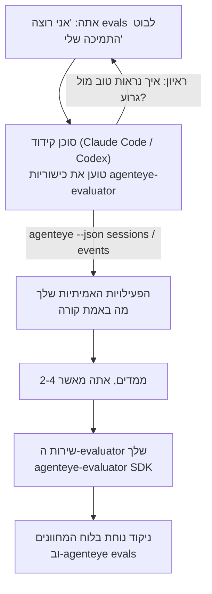

---
---
title: "כישוריות Failproof AI Observability Evaluator Agent"
description: "מעבר מ-\"אני חושב שהסוכן שלנו לפעמים גרוע\" לשירות scoring משומר, כשהסוכן הקידוד שלך עושה הן את ההחלטה והן את הבנייה."
---

מעבר מ*"אני חושב שהסוכן שלנו לפעמים גרוע"* לשירות scoring משומר, כשהסוכן הקידוד שלך עושה הן את ההחלטה והן את הבנייה. **כישוריות Failproof AI Observability evaluator** (`agenteye-evaluator`) היא *Agent Skill*: תיקייה קטנה של הוראות שסוכן קידוד כגון Claude Code או Codex טוען בדרישה. היא מלמדת את הסוכן לגלות אילו ממדי איכות כדאי לעקוב עבור *הסוכן שלך*, ואז לכתוב, לבדוק ולהשקות את [שירות ה-evaluator](/he/agenteye/evaluation-suite) שדירוג אותם.

זה **לא** scorer מתארח, רישום שאתה משתף בו, או מערכת plugin. ה-evaluator שלך נשאר שירות HTTP משלך בתשתית שלך, בדיוק כפי שמתואר ב-[מדריך Evaluation suite](/he/agenteye/evaluation-suite). הכישוריות רק מלמדת את הסוכן לבנות אותו טוב, אז כל מה שהוא עושה, אתה יכול לעשות בעצמך על ידי כתיבת אותו קוד.

---

## החלק הקשה הוא החלטה מה לדרג

פני ה-SDK קטנים — דקורטור ושתי מודלים — וסוכן יכול לכתוב את זה מ-[החוזה](/he/agenteye/evaluation-suite#http-contract) בלבד. זה לא המקום שבו evaluators נכשלים. הם נכשלים כי הם דירוגים הדברים הלא נכונים, ו-evaluator שדורג את הדברים הלא נכונים גרוע מכלום: הוא יוצר לוח מחוונים שכולם לומדים להתעלם ממנו.

אז רוב הכישוריות היא החלק לפני שקוד כלשהו קיים. יש לו את הסוכן לראיין אותך (*"תאר הרצה שהלכה טוב; עכשיו אחת שהלכה גרוע"*), ואז משוך את הפעילויות האמיתיות שלך דרך [`agenteye` CLI](/he/agenteye/cli) וקרא אותן מקצה לקצה. שני החלקים הללו בדרך כלל לא מסכימים, והפער הוא הנקודה: מה אתה התכוון למדוד מול מה התוכנות שלך יכולות למעשה לתמוך. ממד רק שורד אם הוא **ניתן לחישוב** מהאירועים ו**מפלה** — אם הוא דירוג 0.9 גם בהרצה הטובה שלך וגם בזו הרעה, זה לא מלמד כלום ומקבל חתוך.

מה שחוזר הוא הצעה של 2-4 ממדים עם ההנמקה המצורפת, עבורך לאשר לפני שכתוב שורה אחת.



---

## איך זה קשור לחלקי ההערכה האחרים

ארבעה מסמכים מכסים scoring, והם חוזרים אחד לשני בסדר:

| עמוד | מה זה | הגעל כשרוצה |
|---|---|---|
| **[Evaluations](/he/agenteye/evaluations)** | התכונה: ניקוד בגבולות הפעילויות, לוחות מחוונים, הערכה מחדש | אתה רוצה לדעת מה ניקוד אוטומטי נותן לך |
| **[Evaluation suite](/he/agenteye/evaluation-suite)** | החוזה HTTP, ה-SDK, משתני סביבת השרת | אתה מיישם או דיבאג את ה-evaluator בעצמך |
| **כישוריות Evaluator** (מסמך זה) | דלת קדמית בשפה טבעית על עיצוב *ובנייה* של ה-scorer | אתה רוצה לעבור מ-"אני רוצה evals" לשירות פעיל |
| **[CLI skill](/he/agenteye/cli-skill)** | דלת קדמית בשפה טבעית על ה-`agenteye` CLI | אתה רוצה *לקרוא* את הניקוד שכבר יש לך |
| **[Python SDK skill](/he/agenteye/python-sdk-skill)** | דלת קדמית בשפה טבעית על הנחמת הסוכן שלך | הסוכן שלך לא פולט פעילויות עדיין — אין שום דבר לדרג |

### מול CLI skill: בנייה מול קריאה

שתי הכישוריות בכוונה לא-חופפות, והתקנת שניהם היא ההגדרה הרגילה — הסוכן בוחר ביניהם על בסיס מה שאתה שואל:

- **`agenteye-evaluator`** (מסמך זה) בנוי את הדבר שמ*ייצר* ניקוד. המשימה שלו מסתיימת כשניקוד נוחת בפעם הראשונה.
- **[`agenteye-cli`](/he/agenteye/cli-skill)** קורא ניקוד שכבר קיים (`agenteye evals`). *"האם איכות ירדה השבוע?"* היא שאלתו, לא של הכישוריות הזו.

---

## דרישות מוקדמות

1. **`agenteye` CLI מותקן ומחובר** (`pipx install agenteye`, ואז `agenteye login`). הכישוריות תלויה בו פעמיים: להשיכ את הפעילויות האמיתיות שהוא עיצוב נגדה, ולאשר שהניקוד שלך נוחת בסוף. ההתחברות שלך צריכה `events:read`, בתוספת `evaluations:read` לבדיקה הסופית הזו. כמו עם CLI skill, היא **לא יכולה** להשלים את התחברות קוד חד-פעמי בדוא"ל בשבילך.
2. **איפה שום דבר ל-evaluator לגור.** הוא בנוי לתמונה ופעל כשירות দורך ארוך, אז הוא צריך מחסן אמיתי, לא קובץ גרוד. Evaluators לעתים קרובות גרים במחסן שלהם, מנוקה מהסוכן שדורג — הכישוריות מחפשת קיים אחד ושואלת לפני קיבוע חדש.
3. **גלגל `agenteye-evaluator` SDK** — קרא את הסעיף הבא לפני שהסוכן שלך מתחיל לכתוב פקודות `pip`.

---

## היכן להשיג את זה

הכישוריות מפורסמת באוסף הכישוריות הציבורי של Failproof AI:

**[github.com/FailproofAI/skills](https://github.com/FailproofAI/skills)** → [`skills/agenteye-evaluator/`](https://github.com/FailproofAI/skills/tree/main/skills/agenteye-evaluator)

המחסן הוא ציבורי והכישוריות לא צריכה כל credentialשל עצמה — היא רק מנהלת את `agenteye` CLI עם ההפעילות ש*אתה* התחברת בעזרתו, וכותבת קוד במחסן *שלך*. שים לב שהיא משלחת כתיקייה משלה והיא **לא** בתוך החבילה `pipx install agenteye`, אז אל תחפש אותה שם.

## התקנת הכישוריות

המסלול המהיר ביותר הוא [`skills`](https://skills.sh) CLI, אשר משיכת התיקייה ודופקת אותה איפה שהסוכן שלך מחפש:

```bash
# Claude Code, פרויקט זה בלבד
npx skills add FailproofAI/skills --skill agenteye-evaluator -a claude-code

# כל פרויקט (מתקנים ל-~/.claude/skills/)
npx skills add FailproofAI/skills --skill agenteye-evaluator -a claude-code -g --copy

# Codex במקום
npx skills add FailproofAI/skills --skill agenteye-evaluator -a codex
```

אז נהל אותו כמו כל כישוריות אחרת:

```bash
npx skills list -a claude-code           # מה מותקן
npx skills update agenteye-evaluator     # משיכת הגרסה העדכנית
npx skills remove agenteye-evaluator     # הסר את זה
```

דע להתקנה ביד? Agent Skill היא רק תיקייה המכילה `SKILL.md` (בתוספת התייחסויות אופציונליות), אז העתקה עובדת גם:

- **Claude Code**: שים את התיקייה `agenteye-evaluator/` ב-`~/.claude/skills/` (כל פרויקט) או `<your-repo>/.claude/skills/` (פרויקט זה בלבד). Claude Code מגלה אותו באופן אוטומטי — אמת עם רשימת `/skills`, או פשוט שאל ל-evals.
- **Codex (OpenAI)**: Codex קורא את `SKILL.md` זהה. ה-`agents/openai.yaml` בחבילה קובע `allow_implicit_invocation: true`, אז Codex בוחר את הכישוריות באופן אוטומטי כשמשימה תואמת; אחרת זימן אותה בפירוש כ-`$agenteye-evaluator`.

---

## ה-SDK לא בPyPI הציבורי

> **זהירות:** קרא את זה לפני שאתה נותן לסוכן להתקנות ה-SDK.

הכישוריות היא ציבורית; ה-SDK שהיא מנהלת לא. `agenteye-evaluator` משלחת רק כחדש שחרור פרטי, ובניגוד ל-`agenteye`, השם הוא **לא תובע ב-PyPI הציבורי** — כך `pip install agenteye-evaluator` בר יכול למשוך חבילת זר לתוך השירות שקורא תוך הייצור שלך. זו בעיית שרשרת אספקה, לא הקלדה שגויה.

הכישוריות יודעת את זה ועובדת למטה סולם התקנה במקום, עוצר בהפעם הראשונה שמחול: מקור ה-monorepo אם אתה בתוך מחסן AgentEye, אחרת גלגל שחרור פרטי מ-GitHub Releases (צריך גישה), ואם לא reachable זה **עוצר ואומר לך לבקש את ה-Failproof AI contact שלך לגלגל** במקום אימפרוביזציה.

אז אם הסוכן שלך מציע חשוף `pip install agenteye-evaluator` מ-PyPI הציבורי, זה הספירה שהכישוריות לא עמסה. עצור שם ובדוק שהוא מותקן.

---

## מה אתה יכול לשאול אותו

סבב אמיתי הולך מבקשה עמומה ומסתיים עם עיצוב חתום, לא עם קוד:

```text
אתה   ▸ אני רוצה evals לבוט התמיכה שלנו. אני חושב שזה לפעמים גרוע.

סוכן ▸ לפני שאני כותב משהו: תאר הרצה שהלכה טוב,
        ואחת שהלכה גרוע.

אתה   ▸ טוב: זה מענה מהמסמכים. גרוע: זה משדר, או זה
        מוותר ואומר "צור קשר תמיכה".

סוכן ▸ פועל: agenteye --json sessions --status error --since 7d
        קורא 5 פעילויות, כולל שניים שאתה קורא גרוע.

        המילים שלך אומרות עובדיות והפניה. התוכנות מסכימות על
        הפניה (2 של 5 מסתיימות עם hand-off תמיכה, וזה ברור
        ב-model_response.content), אבל עובדיות צריכה אמת יסוד
        שהאירועים שלך לא מכילים.

        אז הייתי דירוג שלוש דברים:
          - הפניה      כללים, זול, מפריד בין ההרצות שלך
          - tool_efficiency כללים, תופסת את לולאת ה-retry בהרצה-004
          - groundedness    שופט LLM: האם כל תביעה בדוקים זה אחזר?

        "עובדיות" תצטרך אמת יסוד שאין לנו; groundedness
        היא הדבר הקרוב ביותר שהתוכנות שלך יכולות למעשה לתמוך.
        בסדר עם שלושת השמות הללו? שינוי שם מאוחר קו מפצל.

אתה   ▸ כן

סוכן ▸ אין evaluator במחסן הזה. האם אני צריך קיבוע אחד כאן, או יש
        לך אחד אחר במקום?
```

משם זה כותב את הממדים מבוססי הכללים תחילה (בחינם, מיידי, דטרמיניסטי), בוחנם מול הרצה אמיתית לכודה כולל הריקים ולא-סיומיים שמנהלים naive evaluators, ורק מגיע לשופט LLM על ממד סובייקטיבי. זה יודע את [גבולות ה-dispatcher](/he/agenteye/evaluation-suite#configuring-the-server) — 30 שנייה timeout בקשה ו-8 קריאות concurrent בכל ההשקה — אז אם השופט לא בטוח להתאים, זה הולך אסינק עם `JobPending` במקום תן לשופט בטל וטוען מחדש חמש פעמים בחמש פעמים העלות.

אז זה משקע, קובע את שני משתני סביבת השרת, וקונפירם עם `agenteye --json evals --session-id <id>` שניקוד באמת נוחת. ניקוד נוחת הוא האישור היחיד.

---

## מה לשים עיניים עליו

- **שמות ממדים הם קרובים לקבע.** מפתחות ניקוד הם מחרוזות שרירותיות והפלטפורמה טרנדים אושר שאתה שולח, שמשמעו כלום downstream מתקן בחירה גרועה. שינוי שם מאוחר וההיסטוריה קו מפצל: פעילויות ישנות שומר המפתח הישן וה-trend שבורה. זה למה הכישוריות משיגה סימן מפורש לפני כתיבת קוד — קח את הנושא הזה ברצינות.
- **Fixtures הם תמלילים אמיתיים בייצור.** עיצוב נגד הפעילויות אמיתיות משמעו משיכת אותם לדיסק, והם יכולים להכיל נתוני לקוח. הכישוריות שואלת לפני commit אותם ל-git; אם בספק, שמור `fixtures/` מחוץ למחסן ותן לכל מפתח למשוך שלהם.
- **הסוכן כותב משומר שירות שקורא כל תוכנה.** זה פועל כאתה, חסום על ידי הרשאות ההתחברות CLI של השוגר, אבל בדוק את ה-evaluator כמו כל קוד אחר שנוגע בנתוני ייצור.

---

## השלבים הבאים

- **[Evaluation suite](/he/agenteye/evaluation-suite)**: החוזה HTTP, ה-SDK, ומשתני סביבת השרת שהכישוריות מגדירה.
- **[Evaluations](/he/agenteye/evaluations)**: איפה הניקוד מופיע כשהוא נוחת.
- **[CLI skill](/he/agenteye/cli-skill)**: הכישוריות הקרובה, לקריאת תוצאות במקום בנייה ה-scorer.
- **[CLI](/he/agenteye/cli)**: התייחסות הפקודה מאחורי נתוני ההפעילות שהכישוריות עיצוב נגד.