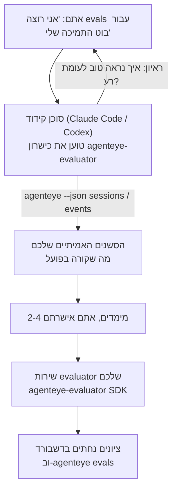

---
---
title: "כישרון סוכן הערכה של Failproof AI Observability"
description: "עברו מ\"אני חושב שהסוכן שלנו לפעמים רע\" לשירות סקורינג פעוּל, כאשר סוכן הקידוד שלכם עושה הן החלטות והן בנייה."
---


עברו מ*"אני חושב שהסוכן שלנו לפעמים רע"* לשירות סקורינג פעוּל, כאשר סוכן הקידוד שלכם עושה הן החלטות והן בנייה. **כישרון Failproof AI Observability evaluator** (`agenteye-evaluator`) הוא *Agent Skill*: תיקייה קטנה של הוראות שסוכן קידוד כגון Claude Code או Codex טוען בעת הצורך. הוא מלמד את הסוכן לחשוב איזה מימדי איכות שווה לעקוב אחריהם עבור *הסוכן שלכם*, ואז לכתוב, לבדוק ולפרוס את [שירות ה-evaluator](/he/agenteye/evaluation-suite) שסוקר אותם.

זה **לא** scaler מהוסט, רישום שאתם מעלים אליו, או מערכת פלוג-אינים. ה-evaluator שלכם נשאר שירות HTTP משלכם על התשתית שלכם, בדיוק כמו שמתואר ב[מדריך ה-Evaluation suite](/he/agenteye/evaluation-suite). הכישרון רק מלמד את הסוכן לבנות אותו טוב, כך שהכל שהוא עושה, אתם יכולים לעשות בעצמכם על ידי כתיבת אותו קוד.

---

## החלק הקשה הוא החלטה למה לתן ציונים

משטח ה-SDK קטן — דקורייטור ושתי מודלים — וסוכן יכול לכתוב את זה מ[החוזה](/he/agenteye/evaluation-suite#http-contract) לבדו. זה לא המקום בו evaluators נכשלים. הם נכשלים כי הם מתנים את הדבר הלא נכון, וה-evaluator שמתנה את הדבר הלא נכון הוא גרוע יותר מלא כלום: הוא מייצר dashboards שהכולם למדו להתעלם מהם.

אז רוב הכישרון הוא החלק לפני שקוד כלשהו קיים. יש לו את הסוכן לראיין אתכם (*"תארו הרצה שהלכה טוב; עכשיו אחת שהלכה רע"*), ואז למשוך את הסשנים האמיתיים שלכם דרך [`agenteye` CLI](/he/agenteye/cli) וקרא אותם מסוף לסוף. שני החלקים האלה בדרך כלל לא מסכימים, והפער הוא הנקודה: מה אתם מתכוונים למדוד לעומת מה שהתמלולים שלכם יכולים למעשה לתמוך. מימד הוא שורד רק אם הוא **חישוב** מהאירועים ו**מבחין** — אם הוא מתנה 0.9 הן בהרצה הטובה שלכם והן בהרצה הרעה שלכם, הוא לא מלמד דבר וקטוע.

מה חוזר הוא הצעה של 2-4 מימדים עם הנימוקים המצורפים, בשביל שתאשרו לפני ששורה אחת כתובה.



---

## איך זה קשור לחלקי ההערכה האחרים

ארבע דוקסים מכסים סקורינג, והם מחליפים ידיים זה לזה בסדר:

| עמוד | מה זה | הגע אליו כאשר |
|---|---|---|
| **[Evaluations](/he/agenteye/evaluations)** | התכונה: ציונים ברשת הסשנים, dashboards, הערכה מחדש | אתם רוצים לדעת מה סקורינג אוטומטי מביא לכם |
| **[Evaluation suite](/he/agenteye/evaluation-suite)** | החוזה HTTP, ה-SDK, משתני הסביבה של השרת | אתם מיישמים או מנפים את ה-evaluator בעצמכם |
| **כישרון Evaluator** (דוק זה) | דלת קדמית בשפה טבעית בעיצוב *ובנייה* של ה-scorer | אתם רוצים ללכת מ"אני רוצה evals" לשירות פועל |
| **[CLI skill](/he/agenteye/cli-skill)** | דלת קדמית בשפה טבעית על `agenteye` CLI | אתם רוצים *לקרוא* את הציונים שכבר יש לכם |
| **[Python SDK skill](/he/agenteye/python-sdk-skill)** | דלת קדמית בשפה טבעית על instrumentation של הסוכן שלכם | הסוכן שלכם עדיין לא פולט סשנים — אין שום דבר לתן ציונים |

### לעומת ה-CLI skill: בנייה לעומת קריאה

שני הכישרונות התכוונו בכוונה להיות לא חופפים, והתקנת שניהם היא ההגדרה הנורמלית — הסוכן בוחר ביניהם בהתאם לאשר אתם שואלים:

- **`agenteye-evaluator`** (דוק זה) בונה את הדבר שמייצר ציונים. המטרה שלו מסתיימת כאשר ציונים נחתים בפעם הראשונה.
- **[`agenteye-cli`](/he/agenteye/cli-skill)** קורא ציונים שכבר קיימים (`agenteye evals`). *"האם איכות ירדה השבוע?"* היא השאלה שלו, לא של הכישרון הזה.

---

## דרישות מוקדמות

1. **`agenteye` CLI מותקן ומחובר** (`pipx install agenteye`, ואז `agenteye login`). הכישרון משתמש בו פעמיים: למשיכת הסשנים האמיתיים שהוא עיצוב כנגדם, ולהשלמת שהציונים שלכם נחתו בסוף. ההתחברות שלכם צריכה `events:read`, בתוספת `evaluations:read` לבדיקה הסופית הזו. כמו ב-CLI skill, זה **לא יכול** להשלים את ההתחברות לקוד החד-פעמי בדואר בשבילכם.
2. **מקום עבור ה-evaluator להיות** זה מקבל בנייה לתמונה וריצה כשירות ממושך, כך שהוא צריך repo אמיתי, לא קובץ סקראץ'. Evaluators לעיתים קרובות חיים בrepo שלהם, נפרד מהסוכן שמקבל ציונים — הכישרון מחפש חד קיים ושואל לפני scaffolding של חדש.
3. **ה-`agenteye-evaluator` SDK wheel** — קראו את הסעיף הבא לפני שהסוכן שלכם מתחיל להקליד `pip` פקודות.

---

## היכן לקבל זאת

הכישרון פורסם באוסף הכישרונות הציבורי של Failproof AI:

**[github.com/FailproofAI/skills](https://github.com/FailproofAI/skills)** → [`skills/agenteye-evaluator/`](https://github.com/FailproofAI/skills/tree/main/skills/agenteye-evaluator)

ה-repository ציבורי והכישרון לא צריך כל credentials משלו — הוא רק מסיע את `agenteye` CLI עם הסשן שאתם התחברתם, וכותב קוד בrepo שלכם. שימו לב שהוא משודר כתיקייה משלו והוא **לא** בתוך החבילה `pipx install agenteye`, אז אל תחפשו אותה שם.

## התקנת הכישרון

הנתיב המהיר ביותר הוא [`skills`](https://skills.sh) CLI, שמביא את התיקייה ושם אותה היכן שהסוכן שלכם מחפש:

```bash
# Claude Code, פרויקט זה בלבד
npx skills add FailproofAI/skills --skill agenteye-evaluator -a claude-code

# כל פרויקט (מתקין ל-~/.claude/skills/)
npx skills add FailproofAI/skills --skill agenteye-evaluator -a claude-code -g --copy

# Codex במקום זאת
npx skills add FailproofAI/skills --skill agenteye-evaluator -a codex
```

אז נהלו אותו כמו כל כישרון אחר:

```bash
npx skills list -a claude-code           # מה מותקן
npx skills update agenteye-evaluator     # משוך את הגרסה האחרונה
npx skills remove agenteye-evaluator     # הסר אותו
```

עדיף להתקין ביד? Agent Skill היא פשוט תיקייה המכילה `SKILL.md` (בתוספת התייחסויות אופציונליות), אז העתקה עובדת גם:

- **Claude Code**: שימו את תיקייה `agenteye-evaluator/` ב-`~/.claude/skills/` (כל פרויקט) או `<your-repo>/.claude/skills/` (רק באותו repo). Claude Code מגלה אותה באופן אוטומטי — אמתו עם רשימת `/skills`, או פשוט בקשו evals.
- **Codex (OpenAI)**: Codex קורא את אותו `SKILL.md`. ה-`agents/openai.yaml` המלווה קובע `allow_implicit_invocation: true`, אז Codex בוחר את הכישרון באופן אוטומטי כשמשימה תואמת; אחרת הפעל אותו באופן מפורש כמו `$agenteye-evaluator`.

---

## ה-SDK לא ב-PyPI הציבורי

> **Warning:** קראו זאת לפני שתתירו לסוכן להתקין את ה-SDK.

הכישרון ציבורי; ה-SDK שהוא מסיע לא. `agenteye-evaluator` משודר רק כ-artifact release פרטי, ובשונה מ-`agenteye`, השם הוא **לא דורוש ב-PyPI הציבורי** — אז `pip install agenteye-evaluator` חשוף יכול למשוך חבילה של זר לשירות שקורא את התמלולים של הייצור שלכם. זו בעיית supply-chain, לא הקלדה.

הכישרון יודע זאת ויורד בסולם התקנה במקום, עוצר בקרung הראשון שחל: הקוד של monorepo אם אתם בתוך AgentEye repo, אחרת ה-wheel של release פרטי מ-GitHub Releases (צריך גישה), ואם לא רגע שניהם מגיעים **עוצר ואומר לכם לבקש את החוק מ-Failproof AI contact עבור wheel** במקום להמציא.

אז אם הסוכן שלכם מציע `pip install agenteye-evaluator` חשוף מ-PyPI הציבורי, זה סימן שהכישרון לא טען לעולם. עצור שם ובדוק שהוא מותקן.

---

## מה אתם יכולים לבקש

סיבוב אמיתי מקצה לקצה מתחיל בבקשה בעלמת ומסתיים בעיצוב חתום, לא בקוד:

```text
אתם   ▸ אני רוצה evals עבור בוט התמיכה שלנו. אני חושב שהוא לפעמים רע.

סוכן ▸ לפני שאני כותב דבר כלשהו: תארו הרצה שהלכה טוב,
        והרצה אחת שהלכה רע.

אתם   ▸ טוב: זה עונה מהדוקסים. רע: זה משקר דברים,
        או מתיש ואומר "צור קשר עם התמיכה".

סוכן ▸ פועל: agenteye --json sessions --status error --since 7d
        קורא 5 סשנים, כולל שניים שהיית קורא להם רע.

        המילים שלכם אומרות factuality ו-deflection. התמלולים
        מסכימים על deflection (2 מ-5 מסיימים בהעברת תמיכה,
        וזה ברור בـ model_response.content), אבל factuality
        צריך ground truth שהאירועים שלכם לא נושאים.

        אז הייתי סוקר שלוש דברים:
          - deflection      rules, זול, מבחין בשתי ההרצות שלכם
          - tool_efficiency rules, תופס לולאת ה-retry בהרצה 004
          - groundedness    LLM judge: כל טענה בדוקסים שהוא שיחזר?

        "factuality" היה צריך ground truth שאין לנו; groundedness
        הדבר הקרוב ביותר שהתמלולים שלכם יכולים למעשה לתמוך.
        בסדר עם שלוש הנמות האלה? שם שונה מאוחר יותר פוצל את ההיסטוריה.

אתם   ▸ כן

סוכן ▸ אין evaluator בrepo הזה. האם אני צריך לתקימה אחד כאן, או
        יש לכם אחד במקום אחר?
```

משם הוא כותב את המימדים המבוססים על כללים תחילה (חינמי, מיידי, דטרמיניסטי), בודק אותם כנגד סשן שנתפס בחיים כולל את הריקות ואלה שלא נגמרו לעולם שהם קורסים naive evaluators, ורק מגיע ל-LLM judge על המימד הסובייקטיבי. הוא יודע את [מגבלות ה-dispatcher](/he/agenteye/evaluation-suite#configuring-the-server) — timeout של 30s ו-8 קריאות במקביל deployment רחב — אז אם ה-judge לא יכול בתוקף להתאים, הוא עובר async עם `JobPending` במקום להתיר שה-judge יקבל ביטול וחזור על חמש פעמים בחמש פעמים העלות.

אז הוא מפרוס, קובע את שני משתני הסביבה של השרת, ומאשר עם `agenteye --json evals --session-id <id>` שציונים בפועל נחתו. ציונים נחתו הוא הראיה היחידה.

---

## מה להשגיח על זה

- **שמות מימדים קרובים לקבוע.** Score keys הם strings שרירותיים והפלטפורמה טרנדים מה שאתם שולחים, מה שאומר שום דבר downstream לא מתקן בחירה רעה. שנה שם מאוחר יותר וההיסטוריה מתפצלת: סשנים ישנים משמרים את המפתח הישן והטרנד נשבר. זו למה הכישרון מקבל sign-off מפורש לפני כתיבת קוד — קחו את הפרומפט ההוא ברצינות.
- **ה-fixtures הם תמלולים אמיתיים של ייצור.** עיצוב כנגד סשנים אמיתיים אומר משיכתם לדיסק, והם יכולים להכיל נתונים של לקוחות. הכישרון שואל לפני commitment אותם ל-git; אם יש ספק, שמרו `fixtures/` מחוץ ל-repo והגיעו לכל מפתח למשיכה שלהם.
- **הסוכן כותב ומפרוס שירות שקורא כל תמלול.** הוא פועל כמוכם, מוגבל על ידי ההרשאות של CLI login שלכם, אבל בחנו את ה-evaluator כמו כל קוד אחר שנוגע בנתונים של הייצור.

---

## השלבים הבאים

- **[Evaluation suite](/he/agenteye/evaluation-suite)**: החוזה HTTP, ה-SDK, ומשתני הסביבה של השרת שהכישרון מגדיר.
- **[Evaluations](/he/agenteye/evaluations)**: היכן הציונים מופיעים ברגע שהם נחתו.
- **[CLI skill](/he/agenteye/cli-skill)**: הכישרון התאום, לקריאת תוצאות במקום בנייה של ה-scorer.
- **[CLI](/he/agenteye/cli)**: התייחסות הפקודה מאחורי נתוני הסשן שהכישרון עיצוב כנגדם.