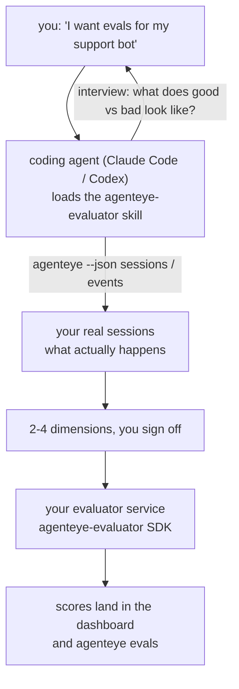

---
---
title: "מיומנות Failproof AI Observability Evaluator Agent"
description: "מעבר מ־\"אני חושב שהאייג'נט שלנו לפעמים לא טוב\" לשירות ניקוד מפורסם, כאשר האייג'נט שלך עושה גם את ההחלטה וגם את הבנייה."
---


מעבר מ־*"אני חושב שהאייג'נט שלנו לפעמים לא טוב"* לשירות ניקוד מפורסם, כאשר אייג'נט הקידוד שלך עושה גם את ההחלטה וגם את הבנייה. **מיומנות Failproof AI Observability evaluator** (`agenteye-evaluator`) היא *Agent Skill*: תיקייה קטנה של הוראות שאייג'נט קידוד כמו Claude Code או Codex טוען לפי הצורך. היא מלמדת את האייג'נט לגלות אילו ממדי איכות שווים לעקוב עבור *האייג'נט שלך*, ולאחר מכן לכתוב, לבדוק ולפרוס את [שירות ה־evaluator](/he/agenteye/evaluation-suite) המדרג אותם.

זה **לא** סקורר מעוגן, רישום שאתה מעלה אליו, או מערכת תוספות. ה־evaluator שלך נשאר שירות HTTP שלך בתשתית שלך, בדיוק כמו שמתואר בהדרכת [Evaluation suite](/he/agenteye/evaluation-suite). המיומנות רק מלמדת את האייג'נט לבנות אותה בצורה טובה, כך שכל מה שהוא עושה, אתה יכול לעשות בעצמך על ידי כתיבת אותו קוד.

---

## החלק הקשה הוא החלטה מה לדרג

משטח ה־SDK קטן — דקורטור וש׳ דגמים — ואייג'נט יכול לכתוב את זה מה־[חוזה](/he/agenteye/evaluation-suite#http-contract) בלבד. זה לא המקום שבו evaluators נכשלים. הם נכשלים כי הם דורגים את הדבר הלא נכון, ו־evaluator שדורג את הדבר הלא נכון הוא גרוע מלא: הוא מייצר לוח מחוונים שכולם לומדים להתעלם ממנו.

כך שרוב המיומנות היא החלק לפני שקוד כלשהו קיים. יש לאייג'נט לראיין אותך (*"תאר הפעלה שהלכה טוב; עכשיו אחת שהלכה בצורה רעה"*), ואז למשוך את ההפעלות האמיתיות שלך דרך ה־[`agenteye` CLI](/he/agenteye/cli) ולקרוא אותן מקצה לקצה. שתי הקצוות האלה בדרך כלל לא מסכימים, והפער הוא הנקודה: מה שאתה מתכוון למדוד מול מה שההוראות שלך יכולות בעצם לתמוך. ממד משרד רק אם הוא **חישוב** מהאירועים **ו־discriminating** — אם הוא מדרג 0.9 גם על הריצה הטובה שלך וגם על הרעה, הוא לא מלמד כלום ויקבל את הגזירה.

מה שחוזר חזרה הוא הצעה של 2–4 ממדים עם ההנמקה המצורפת, כדי שתאשר לפני ששורה אחת נכתבת.



---

## איך זה קשור לחלקי ההערכה האחרים

ארבע דוקים כוללים ניקוד, והם מוסרים זה לזה בסדר:

| עמוד | מה זה | הגע לזה כאשר |
|---|---|---|
| **[Evaluations](/he/agenteye/evaluations)** | התכונה: ניקודים בגריד ההפעלות, לוחות מחוונים, הערכה מחדש | אתה רוצה לדעת מה ניקוד אוטומטי מביא לך |
| **[Evaluation suite](/he/agenteye/evaluation-suite)** | חוזה HTTP, ה־SDK, משתני סביבה של השרת | אתה מיישם או ניפוי באגים של ה־evaluator בעצמך |
| **מיומנות Evaluator** (דוק זה) | דלת כניסה בשפה טבעית לעיצוב *ובנייה* של הסקורר | אתה רוצה לעבור מ־"אני רוצה evals" לשירות פעיל |
| **[CLI skill](/he/agenteye/cli-skill)** | דלת כניסה בשפה טבעית ל־`agenteye` CLI | אתה רוצה *לקרוא* את הניקודים שכבר יש לך |
| **[Python SDK skill](/he/agenteye/python-sdk-skill)** | דלת כניסה בשפה טבעית לעקוב אחר האייג'נט שלך | האייג'נט שלך לא משדר הפעלות עדיין — אין כלום לדרג |

### מול ה־CLI skill: בנייה מול קריאה

שתי המיומנויות מתוכננות במכוון כלא חופפות, והתקנת שניהם היא ההגדרה הנורמלית — האייג'נט בוחר בין הן בהתאם למה שאתה שואל:

- **`agenteye-evaluator`** (דוק זה) בונה את הדבר ש*מייצר* ניקודים. העבודה שלה מסתיימת כאשר ניקודים נחתים בפעם הראשונה.
- **[`agenteye-cli`](/he/agenteye/cli-skill)** קוראת ניקודים שכבר קיימים (`agenteye evals`). *"האם האיכות ירדה השבוע?"* היא השאלה שלה, לא של מיומנות זו.

---

## דרישות מקדימות

1. **ה־`agenteye` CLI מותקן ומחובר** (`pipx install agenteye`, אחר כך `agenteye login`). המיומנות משתמשת בו פעמיים: למשוך את ההפעלות האמיתיות שהיא מעצבת כנגדן, ולאשר שהניקודים שלך נחתו בסוף. ההתחברות שלך צריכה `events:read`, בתוספת `evaluations:read` לבדיקה הסופית זו. כמו עם ה־CLI skill, היא **לא יכולה** להשלים את התחברות קוד חד־פעמי שנשלח בדוא״ל בשבילך.
2. **מקום ל־evaluator לגור בו.** הוא משתמע לתמונה ופועל כשירות ארוך־טווח, אז הוא צריך מאגר אמיתי, לא קובץ עריכה זמני. Evaluators לעתים קרובות גרים במאגר משלהם, נפרד מהאייג'נט המדורג — המיומנות מחפשת אחד קיים ושואלת לפני הנגזרות.
3. **הגלגל `agenteye-evaluator` SDK** — קרא את הסעיף הבא לפני שהאייג'נט שלך מתחיל לכתוב פקודות `pip`.

---

## איפה לקבל את זה

המיומנות פורסמה בקוביית מיומנויות ציבורית של Failproof AI:

**[github.com/FailproofAI/skills](https://github.com/FailproofAI/skills)** → [`skills/agenteye-evaluator/`](https://github.com/FailproofAI/skills/tree/main/skills/agenteye-evaluator)

המאגר הוא ציבורי והמיומנות לא צריכה הסמכה משלה — היא רק מנהלת את ה־`agenteye` CLI עם ה־session ש*אתה* התחברת אליו, וכותבת קוד ב־*מאגר שלך*. שימו לב שהיא משלחת כתיקייה משלה והיא **לא** בתוך חבילת `pipx install agenteye`, אז אל תחפש את זה שם.

## התקנת המיומנות

הנתיב המהיר ביותר הוא ה־[`skills`](https://skills.sh) CLI, הו־fetch את התיקייה וזורק אותה כאשר האייג'נט שלך מחפש:

```bash
# Claude Code, project זה בלבד
npx skills add FailproofAI/skills --skill agenteye-evaluator -a claude-code

# כל project (מותקן ל־~/.claude/skills/)
npx skills add FailproofAI/skills --skill agenteye-evaluator -a claude-code -g --copy

# Codex במקום
npx skills add FailproofAI/skills --skill agenteye-evaluator -a codex
```

לאחר מכן נהל אותו כמו כל מיומנות אחרת:

```bash
npx skills list -a claude-code           # מה מותקן
npx skills update agenteye-evaluator     # משוך את הגרסה העדכנית
npx skills remove agenteye-evaluator     # הסר אותה
```

מעדיף להתקין ביד? Agent Skill הוא רק תיקייה המכילה `SKILL.md` (בתוספת הפניות אופציונליות), אז העתקה עובדת גם:

- **Claude Code**: שים את תיקיית `agenteye-evaluator/` ב־`~/.claude/skills/` (כל project) או `<your-repo>/.claude/skills/` (ה־repo הזה בלבד). Claude Code גילוי אוטומטי — אמת עם רשימת `/skills`, או פשוט בקש evals.
- **Codex (OpenAI)**: Codex קורא את אותו `SKILL.md`. ה־`agents/openai.yaml` המצורף קובע `allow_implicit_invocation: true`, כך Codex בוחר אוטומטי את המיומנות כאשר משימה מתאימה; אחרת הזמן זה מפורשות כ־`$agenteye-evaluator`.

---

## ה־SDK לא ב־PyPI ציבורי

> **Warning:** קרא את זה לפני שאתה נותן לאייג'נט להתקין את ה־SDK.

המיומנות ציבורית; ה־SDK שהיא מנהלת לא. `agenteye-evaluator` משלחת רק כחפץ שחרור פרטי, ובניגוד ל־`agenteye`, השם **תופס לא ב־PyPI ציבורי** — אז `pip install agenteye-evaluator` קלוט יכול למשוך חבילה של זר לשירות שקורא את הטרנסקריפטים ההנמקה שלך. זה בעיה בשרשרת אספקה, לא שגיאת הקלדה.

המיומנות יודעת את זה ועובדת למטה סולם התקנה במקום, עוצרת ב־rungs הראשון שחל: מקור ה־monorepo אם אתה בתוך ריפו AgentEye, אחרת הגלגל שחרור פרטי מ־GitHub Releases (צריך גישה), ואם לא אחד מהם אפשרי זה **עוצר ואומר לך לבקש מן המתאמת Failproof AI שלך את הגלגל** במקום ולתרום.

אז אם האייג'נט שלך מוצע `pip install agenteye-evaluator` קלוט מ־PyPI ציבורי, זה תו שהמיומנות לא עלה. עצור שם ובדוק אנו התקנת אותה.

---

## מה אתה יכול לבקש ממנה

סיבוב אמיתי התחלת עם בקשה עמומה וסופו עם עיצוב שחתום עליו, לא עם קוד:

```text
אתה   ▸ אני רוצה evals עבור support bot שלנו. אני חושב שהוא לפעמים לא טוב.

agent ▸ לפני שאני כותב כל דבר: תאר הפעלה שהלכה טוב,
        ואחת שהלכה בצורה רעה.

אתה   ▸ טוב: היא עונה מה־docs. רע: היא אומרת דברים, או
        משתפכת ואומרת "צור קשר support".

agent ▸ בהפעלה: agenteye --json sessions --status error --since 7d
        קריאה 5 הפעלות, כולל שניים שאתה הקלדת רע.

        המילים שלך אומרות factuality ו־deflection. ההוראות מסכימות
        על deflection (2 מתוך 5 סיימו עם support hand-off,
        וזה בבירור ב־model_response.content), אבל factuality צריך ground truth
        שהאירועים שלך לא נושאים.

        אז אני הייתי דורג שלושה דברים:
          - deflection      rules, cheap, מפריד את שתי הריצות שלך
          - tool_efficiency rules, תופס retry loop בריצה 004
          - groundedness    LLM judge: האם כל תביעה ב־docs שהוא אחזר?

        "factuality" תצטרך ground truth שאין לנו; groundedness
        הוא דבר קרוב עם ההוראות שלך יכול בעצם לתמוך.
        בסדר עם שלוש הנוסחאות האלה? שם לאחר מכן מפצל את ההיסטוריה.

אתה   ▸ כן

agent ▸ אין evaluator ב־repo הזה. עליי להנגזר אחד כאן, או יש לך אחד
        במקום אחר?
```

משם הוא כותב את ממדי מבוססי־הכללים בראשונה (חינם, מיידי, דטרמיניסטי), בוחנים אותם נגד ריצה אמיתית שנתפסה כולל את ריצות הריקות ולא־מוגמרות שהנוקזים הנאיביים קורסים, ורק מגיע לשופט LLM בממד סובייקטיבי. זה יודע את [גבולות המשדר](/he/agenteye/evaluation-suite#configuring-the-server) — 30s בקשה timeout ו־8 קריאות בו־זמנית פריסה־רחבה — אז אם השופט לא יתאים בעצמו באופן מהימן, זה הולך async עם `JobPending` במקום לתת לשופט שלך לקבל בטל וחזור חמש פעמים בחמש פעמים העלות.

לאחר מכן הוא פורס, קובע את שני משתני הסביבה של שרת, ומאשר עם `agenteye --json evals --session-id <id>` שניקודים בעצם נחתו. ניקודים נחתו היא ההוכחה היחידה.

---

## מה לשים לב ל

- **שמות ממדים קרובים לקבע.** מפתחות ניקוד הם מחרוזות שרירותיות ותרנדים הפלטפורמה מה שאתה שולח, מה שמשמעות כלום להוריד מתקן בחירה רעה. שם לאחר מכן מפצל את ההיסטוריה: הפעלות ישנות שמורות את המפתח הישן וההיסטוריה קורסה. זו הסיבה שהמיומנות משיגה שלום מפורש לפני כתיבת קוד — קח את הנמכה הזו ברצינות.
- **Fixtures הם הוראות ייצור אמיתיות.** עיצוב נגד הפעלות אמיתיות משמעות משיכה אותם לדיסק, וכן יכולה להכיל נתוני לקוח. המיומנות שואלת לפני התחייבות אותם לגיט; אם בספק, שמור `fixtures/` מחוץ ל־repo ויש לכל מפתח משיכה משלהם.
- **האייג'נט כותב ופורס שירות שקורא כל הוראה.** זה משפיע כמו אתה, התחום על ידי הרשאות ה־CLI login של אתה, אבל בדוק את ה־evaluator כמו כל קוד אחר הנוגע לנתוני ייצור.

---

## צעדים הבאים

- **[Evaluation suite](/he/agenteye/evaluation-suite)**: חוזה HTTP, ה־SDK, ומשתני הסביבה של שרת שהמיומנות מגדירה.
- **[Evaluations](/he/agenteye/evaluations)**: איפה ניקודים מופיעים ברגע שהם נחתו.
- **[CLI skill](/he/agenteye/cli-skill)**: המיומנות החברה, לקריאת תוצאות במקום בנייה של הסקורר.
- **[CLI](/he/agenteye/cli)**: הפניה פקודה מאחורי נתוני ההפעלה שהמיומנות מעצבת נגד.