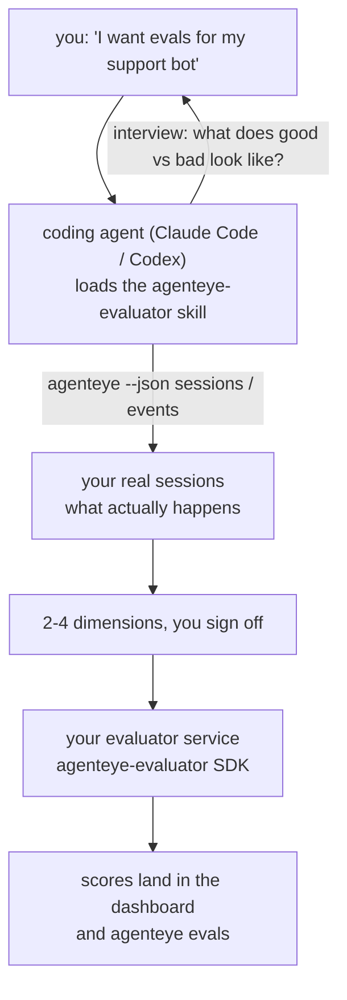

מעבר מ*"אני חושב שהסוכן שלנו לפעמים לא טוב"* לשירות scoring שפרוס, כאשר סוכן הקוד שלך עושה גם את ההחלטה וגם את הבנייה. **מיומנות Failproof AI Observability evaluator** (`agenteye-evaluator`) היא *Agent Skill*: תיקייה קטנה של הוראות שסוכן קוד כמו Claude Code או Codex טוען לפי דרישה. היא מלמדת את הסוכן להבין אילו ממדי איכות כדאי לעקוב אחריהם עבור *הסוכן שלך*, ואז לכתוב, לבדוק ולפרוס את [שירות ה-evaluator](/he/agenteye/evaluation-suite) שנותן ניקוד להם.

זה **לא** scorer מתארח, רישום שאתה מעלה אליו, או מערכת פלאגינים. ה-evaluator שלך נשאר שירות HTTP משלך בתשתית שלך, בדיוק כما מתואר ב[מדריך ה-Evaluation suite](/he/agenteye/evaluation-suite). המיומנות רק מלמדת את הסוכן שלך לבנות אותו טוב, אז כל מה שהוא עושה, אתה יכול לעשות בעצמך בכתיבת אותו קוד.

---

## החלק הקשה הוא להחליט מה לנקד

משטח ה-SDK קטן — דקורטור ושני מודלים — וסוכן יכול לכתוב את זה מ[החוזה](/he/agenteye/evaluation-suite#http-contract) לבדו. זה לא המקום בו evaluators נכשלים. הם נכשלים כי הם נוקדים את הדבר הלא נכון, ו-evaluator שנוקד את הדבר הלא נכון גרוע יותר מלא כלום: הוא מייצר לוח מחוונים שכולם לומדים להתעלם ממנו.

אז רוב המיומנות היא החלק לפני שקוד כלשהו קיים. יש לה את הסוכן מראיין אותך (*"תאר הרצה שהלכה טוב; עכשיו אחת שהלכה בעיה"*), ואז משוך את הסשנים האמיתיים שלך דרך [CLI של `agenteye`](/he/agenteye/cli) וקרא אותם מתחילה עד סוף. שני החלקים האלה בדרך כלל לא מסכימים, והפער הוא הנקודה: מה אתה מתכוון למדוד מול מה שהתמלילים שלך יכולים בעצם לתמוך. ממד שורד רק אם הוא **computable** מהאירועים ו**discriminating** — אם הוא נוקד 0.9 הן בהרצה הטובה שלך והן בזו הרעה, הוא לא מלמד כלום וגט חתוך.

מה שחוזר הוא הצעה של 2-4 ממדים עם הנימוק המצורף, בשבילך לאשר לפני שכתיבת שורה אחת.



---

## איך זה קשור לחתיכות ההערכה האחרות

ארבע דוקים כוללים scoring, והם עוברים אחד לשני בסדר:

| עמוד | מה זה | הגע אליו כשל |
|---|---|---|
| **[Evaluations](/he/agenteye/evaluations)** | התכונה: ניקוד על רשת הסשנים, לוחות מחוונים, הערכה מחדש | אתה רוצה לדעת מה scoring אוטומטי משיג |
| **[Evaluation suite](/he/agenteye/evaluation-suite)** | החוזה HTTP, ה-SDK, משתני סביבת השרת | אתה מיישם או debug את ה-evaluator בעצמך |
| **Evaluator skill** (מסמך זה) | דלת חזית בשפה טבעית לעיצוב *ובנייה* של ה-scorer | אתה רוצה ללכת מ"אני רוצה evals" לשירות פועל |
| **[CLI skill](/he/agenteye/cli-skill)** | דלת חזית בשפה טבעית ב-`agenteye` CLI | אתה רוצה *לקרוא* את הניקוד שיש לך כבר |
| **[Python SDK skill](/he/agenteye/python-sdk-skill)** | דלת חזית בשפה טבעית בהנדסת סוכן שלך | הסוכן שלך עדיין לא פולט סשנים — אין כלום לנקד |

### מול ה-CLI skill: בנייה מול קריאה

שתי המיומנויות הן בכוונה לא חופפות, והתקנת שתיהן היא ההתקנה הנורמלית — הסוכן בוחר בביניהן בהתאם למה שאתה שואל:

- **`agenteye-evaluator`** (מסמך זה) בונה את הדבר שמייצר scores. העבודה שלו מסתיימת כשניקוד נחת בפעם הראשונה.
- **[`agenteye-cli`](/he/agenteye/cli-skill)** קורא scores שכבר קיימים (`agenteye evals`). *"האם איכות ירדה השבוע?"* היא השאלה שלו, לא של מיומנות זו.

---

## דרישות קדם

1. **`agenteye` CLI מותקן ומחובר** (`pipx install agenteye`, ואז `agenteye login`). המיומנות משענת עליה פעמיים: כדי למשוך את הסשנים האמיתיים שהוא מעצב מולם, וכדי לאשר שניקוד שלך נחת בסוף. ההתחברות שלך צריכה `events:read`, בתוספת `evaluations:read` לבדיקה הסופית הזו. כמו ב-CLI skill, היא **לא יכולה** להשלים את התחברות קוד חד פעמי בהודעת דוא״ל בשבילך.
2. **מקום כדי שה-evaluator יגור בו.** הוא בנוי לתוך תמונה ורץ כשירות ארוך טווח, אז הוא צריך repo אמיתי, לא קובץ scratch. Evaluators לרוב גרים ב-repo משלהם, נפרדים מהסוכן שנוקד — המיומנות מחפשת קיימת ושואלת לפני scaffolding אחד חדש.
3. **wheel ה-`agenteye-evaluator` SDK** — קרא את הסעיף הבא לפני שהסוכן שלך מתחיל להקליד פקודות `pip`.

---

## איפה להשיג את זה

המיומנות פורסמה בקולקציית המיומנויות הציבורית של Failproof AI:

**[github.com/FailproofAI/skills](https://github.com/FailproofAI/skills)** → [`skills/agenteye-evaluator/`](https://github.com/FailproofAI/skills/tree/main/skills/agenteye-evaluator)

המחסן הוא ציבורי והמיומנות לא צריכה כל זכות גישה משלה — היא רק מנהלת את CLI של `agenteye` עם הסשן *שאתה* התחברת אליו, וכותבת קוד ב*repo שלך*. שים לב שהיא משלחת כתיקייה משלה וזו **לא** בתוך חבילת `pipx install agenteye`, אז אל תחפש אותה שם.

## התקנת המיומנות

הנתיב המהיר ביותר הוא [`skills`](https://skills.sh) CLI, שמביא את התיקייה ומוריד אותה למקום שהסוכן שלך מחפש:

```bash
# Claude Code, project זה בלבד
npx skills add FailproofAI/skills --skill agenteye-evaluator -a claude-code

# כל project (מתקנן ל-~/.claude/skills/)
npx skills add FailproofAI/skills --skill agenteye-evaluator -a claude-code -g --copy

# Codex במקום זה
npx skills add FailproofAI/skills --skill agenteye-evaluator -a codex
```

אז נהל אותה כמו כל מיומנות אחרת:

```bash
npx skills list -a claude-code           # מה מותקן
npx skills update agenteye-evaluator     # משוך את הגרסה האחרונה
npx skills remove agenteye-evaluator     # הסר אותה
```

תעדיף להתקנן ביד? Agent Skill הוא רק תיקייה המכילה `SKILL.md` (בתוספת הפניות אופציונליות), אז העתקה עובדת גם:

- **Claude Code**: שים את תיקיית `agenteye-evaluator/` ב-`~/.claude/skills/` (כל project) או `<your-repo>/.claude/skills/` (ה-repo הזה בלבד). Claude Code גילוי עצמי אותה — אמת עם הרשימה `/skills`, או פשוט שאל עבור evals.
- **Codex (OpenAI)**: Codex קורא את אותו `SKILL.md`. ה-`agents/openai.yaml` המצורף קובע `allow_implicit_invocation: true`, אז Codex בוחר את המיומנות באופן אוטומטי כשמשימה תואמת; אחרת קרא אותה מפורשות כ-`$agenteye-evaluator`.

---

## ה-SDK לא ברשת PyPI הציבורית

> **Warning:** קרא את זה לפני ששאתה משאיר סוכן להתקנן את ה-SDK.

המיומנות היא ציבורית; ה-SDK שהיא מנהלת לא. `agenteye-evaluator` משלחים רק כ-release artifact פרטי, ובניגוד ל-`agenteye`, השם הוא **unclaimed ברשת PyPI הציבורית** — אז `pip install agenteye-evaluator` בחוקי עלול למשוך חבילה של זר לתוך השירות שקורא תמלילים ייצורי שלך. זו בעיה של supply-chain, לא typo.

המיומנות יודעת את זה ועובדת משדרג התקנה במקום, עוצרת בדרג ראשון שחל: מקור ה-monorepo אם אתה בתוך ה-AgentEye repo, אחרת ה-wheel של release פרטי מ-GitHub Releases (צריך גישה), ואם לא משהו מהם ניתן להגיע זה **עוצר ואומר לך לשאול את הקשר Failproof AI שלך עבור ה-wheel** במקום improvising.

אז אם הסוכן שלך מציע `pip install agenteye-evaluator` בחוקי מרשת PyPI הציבורית, זה הסימן שהמיומנות מעולם לא נטענה. עצור שם ובדוק שהוא מותקן.

---

## מה אתה יכול לשאול אותו

סיבוב אמיתי מעגל מתחיל בבקשה בעלמת מעלה ומסתיים בעיצוב חתום, לא בקוד:

```text
you   ▸ I want evals for our support bot. I think it's sometimes bad.

agent ▸ Before I write anything: describe a run that went well,
        and one that went badly.

you   ▸ Good: it answers from the docs. Bad: it makes stuff up,
        or gives up and says "contact support".

agent ▸ Running: agenteye --json sessions --status error --since 7d
        Reading 5 sessions, including two you'd call bad.

        Your words say factuality and deflection. The transcripts
        agree on deflection (2 of 5 end with a support hand-off,
        and it's plain in model_response.content), but factuality
        needs a ground truth your events don't carry.

        So I'd score three things:
          - deflection      rules, cheap, separates your two runs
          - tool_efficiency rules, catches the retry loop in run-004
          - groundedness    LLM judge: is every claim in the docs it retrieved?

        "factuality" would need ground truth we don't have; groundedness
        is the closest thing your transcripts can actually support.
        OK with those three names? Renaming later splits the history.

you   ▸ yes

agent ▸ No evaluator in this repo. Should I scaffold one here, or do
        you have one elsewhere?
```

משם היא כותבת את הממדים מבוססי הכללים קודם לכן (חינם, מיידי, דטרמיניסטי), בודקת אותם מול סשן אמיתי שנתפס כולל הריקים ואלה שמעולם לא הסתיימו שמתרסקים naïve evaluators, ורק מגיעה לשופט LLM בממד סובייקטיבי. היא יודעת את [גבולות ה-dispatcher](/he/agenteye/evaluation-suite#configuring-the-server) — timeout בקשה של 30s ו-8 קריאות עוקבות deployment-wide — אז אם השופט לא יתאים בעדינות, היא הולכת async עם `JobPending` במקום להשאיר את השופט שלך לקבל ביטול וניסיון חוזר חמש פעמים בחמש פעמים הוצאה.

ואז היא פורסמת, קובעת את שני משתני סביבת השרת, ומאשרת עם `agenteye --json evals --session-id <id>` שניקוד באמת נחת. ניקוד נחת הוא ההוכחה היחידה.

---

## מה להיזהר ממנו

- **שמות ממדים קרובים לקבוע.** מפתחות ניקוד הם מחרוזות שרירותיות והפלטפורמה טוענת כל מה שאתה שולח, כלומר שום דבר downstrem לא מתקן בחירה רעה. שנה שם מאוחר יותר והתיש מחלוקת: סשנים ישנים שומרים על המפתח הישן והמגמה שבירה. זו הסיבה שהמיומנות מקבלת חתימה מפורשת לפני כתיבת קוד — קח את ה-prompt הזה ברצינות.
- **Fixtures הם תמלילים ייצורי אמיתיים.** עיצוב מול סשנים אמיתיים פירושו משיכתם לדיסק, והם יכולים להכיל נתוני לקוח. המיומנות שואלת לפני הפעלה אותם לתוך git; אם ספק, שמור `fixtures/` מחוץ ל-repo ויש לכל developer למשוך משלהם.
- **הסוכן כותב ופורס שירות שקורא כל תמליל.** היא פועלת כמוך, bounded על ידי הרשאות ההתחברות CLI שלך, אבל בחזור על ה-evaluator כמו קוד אחר שנוגע בנתוני ייצור.

---

## צעדים הבאים

- **[Evaluation suite](/he/agenteye/evaluation-suite)**: החוזה HTTP, ה-SDK, ומשתני סביבת השרת שהמיומנות קובעת.
- **[Evaluations](/he/agenteye/evaluations)**: היכן הניקוד מופיע ברגע שהוא נחת.
- **[CLI skill](/he/agenteye/cli-skill)**: המיומנות האחות, לקריאת תוצאות במקום בנייה של ה-scorer.
- **[CLI](/he/agenteye/cli)**: התייחסות הפקודה מאחורי נתוני הסשן שהמיומנות עיצוב מולם.