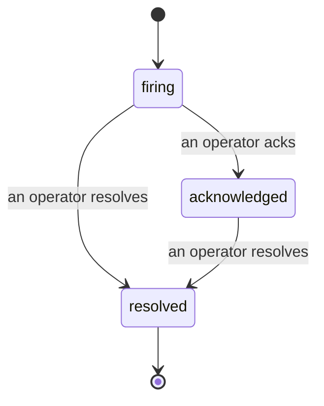

כאשר התראה משדרת, השאלה הראשונה היא תמיד "מי עוסק בזה?" תקריות משיבות עליה: ברגע שמשהו חוצה חסם, כל אחד יכול לראות שהתקרית פתוחה, מי בעלים עליה, ובדיוק מה קרה עד כה, עם רישום נקי ומיוחס שאתה יכול להעביר ישירות לביקורת שלאחר התקרית.

*תיבת הדואר מקבצת תקריות פתוחות לפי מצב וממסננת לפי חומרה והוקצה, כך שאתה רואה מה צריך אדם כרגע.*

## דע למי זה, במבט חטוף

אין יותר "אם מישהו מסתכל על זה?" בשרשור שיחה. חדירה פותחת תקרית באופן אוטומטי וזורקת אותה לתיבת דואר משותפת, מקובצת לפי מצב. קבל אותה והשם שלך עליו, כך שיתר הצוות יודע שזה מטופל. הודעת קבלה משותפת: מספר מפעילים יכולים לקבל את אותה התקרית וכל אחד מהם רשום בנפרד, כך חדר מלחמה מלא מופיע בשמות במקום שחומצים זה על זה. הקצה בעלים אחד לביקורת ראשונית, וסנן את תיבת הדואר לפי חומרה או הוקצה כדי להקטין אותה למה שלך.

## הסיפור כולו, בציר זמן אחד

כאשר התקרית מסתיימת, כבר יש לך את הכתיבה. פתח כל תקרית וקבל את ראיות החדירה, בעליה ומנויה, שרשור הערות לתיאום במקום, וציר זמן פעילות שאי אפשר לערוך מחדש.

*כל מה שקרה, לפי סדר, כל שורה חתומה על ידי מי שעשה זאת.*

כל פעולה (פתוחה, מקובלת, פתורה וכו') נכתבת לאותו ציר זמן ולעולם לא נערכת. כל ערך מיוחס: למפעיל שלקח אותה, לפי דוא"ל, או ל**automated** עבור כל דבר שFailproof AI Observability עשה בעצמו, כמו פתיחת התקרית בחדירה. שום דבר אינו אנונימי ושום דבר לא אבוד, כך שביקורת שלאחר התקרית כמעט כותבת את עצמה.

## איך תקרית נעה

- **פתוחה (firing):** החדירה פותחת את התקרית ופוגעת בערוצים שלך פעם אחת. חדירות חוזרות מתקפלות לאותה תקרית ורענן את הראיות שלה במקום לפגוע בך שוב ושוב.
- **מקובלת (Acknowledged):** מפעיל מרים אותה. היא נשארת פתוחה, וחדירות מאוחרות יותר עדכנו את הראיות בשקט.
- **פתורה (Resolved):** מפעיל סוגר אותה. רזולוציה אוטומטית כאשר התנאי מתפזר מתוכננת אך עדיין לא מופעלת, כך שתקרית נשארת פתוחה עד שאדם אחד פותר אותה, דבר שמשמור כל אחד כנה לגבי מה שבעצם התפזר. תקרית חדשה יכולה להיפתח באותה התראה מאוחר יותר.

התראה אחת מחזיקה לכל היותר תקרית פתוחה אחת בכל פעם, כך שכלל רועד לא יכול לקבור אותך בשכפולים. אתה יכול גם לפתוח תקרית ידנית: אחת עצמאית למשהו שאף התראה לא תפסה, או אחת המצורפת להתראה קיימת, אם יש לך `incidents:write`.

## היכן למצוא אותו

תקריות חיות ב`/<org-slug>/incidents`. צפייה צריכה **`incidents:read`**; פתיחת תקרית ידנית צריכה **`incidents:write`**; הודעה, הקצאה, הערה, והחלפה צריכה **`incidents:ack`**. מפתחות ישנים יותר שהעניקו את `alerts:ack` המפורש מעצים להמשיך לעבוד, מכיוון שהוא מכובד כ`incidents:ack`, כך שהסיבוב שלך בתא לא צריך להנפיק מחדש.

## קשור

- [Alerts](/he/agenteye/alerts): הכללים שפותחים את התקריות הללו כאשר סף חוצה.
- [Error tracking](/he/agenteye/error-tracking): ראה כל כישלון במקום אחד והעלה אחד להתראה.
- [Audits](/he/agenteye/audits): האנליסט המתוזמן שמוצא את הכישלונות שלא שום כלל היה צפוי.