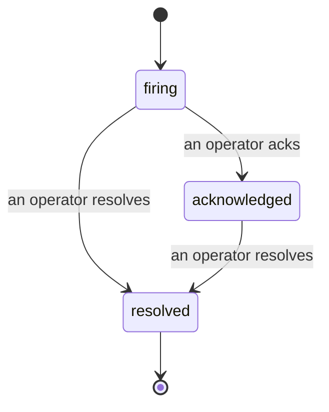

כאשר התראה מופעלת, השאלה הראשונה היא תמיד "מי מטפל בזה?" תקריות משיבות לכך: ברגע שמשהו חוצה את הסף, כולם יכולים לראות שהתקרית פתוחה, מי הבעלים שלה ובדיוק מה קרה עד כה, עם רשומה נקייה ומיוחסת שאתה יכול להעביר ישירות לניתוח פוסט-מורטם.

*תיבת הדואר מקבצת תקריות פתוחות לפי מצב ומסננת לפי חומרה ובעלים, כך שתראה רק את מה שדורש התערבות אנושית כעת.*

## דעו למי יש את זה, במבט אחד

אין יותר "אחד מטפל בזה?" בשרשור צ'ט. הפרה פותחת תקרית באופן אוטומטי ומכניסה אותה לתיבת דואר משותפת, מקובצת לפי מצב. קבלו אותה והשם שלכם חתום עליה, כך ששאר הצוות יודע שהמקרה מטופל. קבלה היא משותפת: מספר מפעילים יכולים לקבל את אותה תקרית וכל אחד מתועד בנפרד, כך שחדר מלחמה שלם מופיע בשמות במקום להיות מעורבבים. הקצו בעלים אחד לסיווג ראשוני, וסננו את תיבת הדואר לפי חומרה או בעלים כדי להחזיק רק את שלכם.

## כל הסיפור, בציר זמן אחד

כאשר התקרית מסתיימת, כבר יש לכם את הכתיבה. פתחו תקרית כלשהי ותקבלו את ראיות ההפרה, בעליה ומנויים, שרשור הערות לתיאום במקום, וציר זמן פעילות שלא ניתן לערוך.

*כל מה שקרה, בסדר, כל שורה חתומה על ידי מי שעשה את זה.*

כל פעולה (פתוחה, התקבלה, פתורה וכו') נכתבת לציר הזמן הזה ולא נערכת לעולם. כל ערך מיוחס: למפעיל שניסה זאת, לפי דוא"ל, או ל**automated** לכל דבר שFailproof AI Observability עשה בעצמו, כמו פתיחת התקרית בהפרה. כלום לא אנונימי וכלום לא הולך לאיבוד, כך שניתוח פוסט-מורטם כמעט כותב את עצמו.

## איך תקרית זורמת

- **פתוחה (firing):** ההפרה פותחת את התקרית וקוראת לערוצים שלכם פעם אחת. הפרות חוזרות קיפלו לאותה תקרית ורענון ההוכחות שלה במקום להקריא לכם שוב ושוב.
- **התקבלה:** מפעיל הרים אותה. היא נשארת פתוחה, והפרות מאוחרות יותר מעדכנות את ההוכחות בשקט.
- **פתורה:** מפעיל סגר אותה. רזולוציה אוטומטית כאשר התנאי מתפזר מתוכננת אך עדיין לא מופעלת, כך שתקרית נשארת פתוחה עד שאנושי פותר אותה, מה שמחזיק את כולם כנים לגבי מה שבעצם התפזר. תקרית חדשה יכולה להיפתח באותה התראה מאוחר יותר.

התראה אחת מחזיקה לכל היותר תקרית פתוחה אחת בכל פעם, כך שחוק רועד לא יכול להטביע אתכם בשכפולים. אתה יכול גם לפתוח תקרית ביד: אחת עצמאית לכל דבר שלא התראה תפסה, או אחת המצורפת להתראה קיימת, אם יש לכם `incidents:write`.

## היכן למצוא זאת

תקריות חיות ב`/<org-slug>/incidents`. צפייה דורשת **`incidents:read`**; פתיחת תקרית ידנית דורשת **`incidents:write`**; קבלה, הקצאה, הערות ורזולוציה דורשות **`incidents:ack`**. מפתחות ישנים יותר שהעניקו את `alerts:ack` המוגמר ממשיכים לעבוד, מכיוון שהוא כבוד כ`incidents:ack`, כך שרוטציית ה-on-call שלכם לא צריכה להוציא מחדש.

## קשור

- [התראות](/he/agenteye/alerts): הכללים שפותחים את התקריות הללו כאשר סף חוצה.
- [עקבוב שגיאות](/he/agenteye/error-tracking): ראה כל כישלון במקום אחד וקדם אחד להתראה.
- [ביקורות](/he/agenteye/audits): האנליסט המתוכנן שמוצא את הכשלים שלא כללי היו משקיפים עליהם.