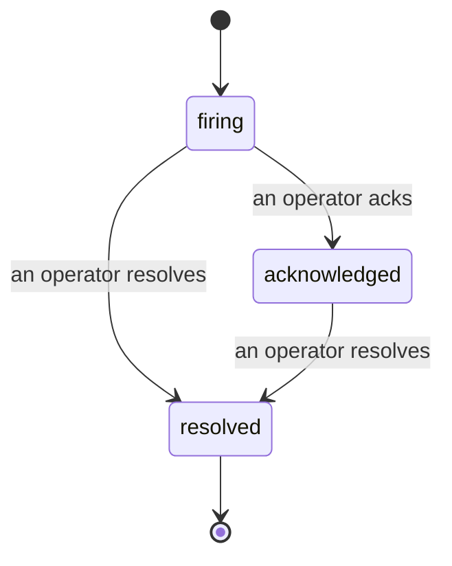

כאשר התראה נשדרת, השאלה הראשונה היא תמיד "מי עובד על זה?" תקריות עונות על זה: ברגע שמשהו חוצה סף, כל אחד יכול לראות שהתקרית פתוחה, למי היא שייכת, ובדיוק מה קרה עד כה, עם רשומה נקייה ומיוחסת שאתה יכול להעביר ישירות לניתוח פוסט-מורטם.

*תיבת הדואר מקבצת תקריות פתוחות לפי מצב ומסננת לפי חומרה ובעל משימה, כך שאתה רואה מה זקוק לתשומת לב אנושית כעת.*

## דע למי יש את זה, בהבט אחד

אין יותר "האם מישהו מסתכל על זה?" בשרשור צ'אט. הפרה פותחת תקרית באופן אוטומטי וזורקת אותה לתיבת דואר משותפת, מקובצת לפי מצב. הכר בה ושמך עליה, כך ששאר הצוות יודע שהיא בטיפול. הכרה היא משותפת: מספר מפעילים יכולים להכיר בתקרית זהה וכל אחד מתועד בנפרד, כך שחדר מלחמה מלא מופיע בשמות במקום שהם דורכים זה על זה. הקצה בעלים אחד לסינון, והסנן את תיבת הדואר לפי חומרה או בעל משימה כדי להצטמצם למה שלך.

## הכל בציר זמן אחד

כאשר התקרית נגמרת, כבר יש לך את ההסבר. פתח כל תקרית וקבל את ראיות ההפרה, את האחראים וה-subscribers שלה, שרשור הערות לתיאום במקום, וציר זמן פעילות בעלי-הוסף בלבד.

*כל מה שקרה, לפי סדר, כל שורה חתומה על ידי מי שעשה זאת.*

כל פעולה (פתוח, הוכר, פתור וכו') נכתבת לציר הזמן הזה ולעולם לא נערכת. כל רשומה מיוחסת: למפעיל שביצע אותה, לפי דוא"ל, או ל-**automated** עבור כל מה ש-failproofai Observability עשה בעצמו, כמו פתיחת התקרית בהפרה. שום דבר לא אנונימי ושום דבר לא אבוד, כך שניתוח פוסט-מורטם כמעט כותב את עצמו.

## איך תקרית נעה

- **פתוח (firing):** ההפרה פותחת את התקרית ועמודי את הערוצים שלך פעם אחת. הפרות חוזרות מתקופלות לתקרית זהה ומרעננות את ההוכחות שלה במקום לעמוד אותך שוב ושוב.
- **Acknowledged:** מפעיל קטף אותה. היא נשארת פתוחה, והפרות מאוחרות יותר מעדכנות את ההוכחות בשקט.
- **Resolved:** מפעיל סוגר אותה. פתרון אוטומטי כאשר התנאי מתברר מתוכנן אך עדיין לא מופעל, כך שתקרית נשארת פתוחה עד שאדם פותר אותה, מה שמשמר את כולם לאמת לגבי מה שבעצם התברר. תקרית חדשה יכולה להיפתח על אותה התראה בהמשך.

התראה אחת מכילה לכל היותר תקרית פתוחה אחת בכל פעם, כך שכלל מתנדנדת לא יכולה לקבור אותך בכפילויות. אתה גם יכול לפתוח תקרית ביד: תקרית עצמאית עבור משהו שאף התראה לא תפסה, או אחת המצורפת להתראה קיימת, אם יש לך `incidents:write`.

## איפה למצוא את זה

תקריות נמצאות ב-`/<org-slug>/incidents`. הצפייה דורשת **`incidents:read`**; פתיחת תקרית ידנית דורשת **`incidents:write`**; הכרה, הקצאה, הערה והפתרה דורשים **`incidents:ack`**. מפתחות ישנים יותר שהעניקו את `alerts:ack` המופסק נשארים בעבודה, מכיוון שהוא מכובד כ-`incidents:ack`, כך שסיבוב ה-on-call שלך לא צריך הוצאה מחדש.

## קשור

- [Alerts](/he/agenteye/alerts): הכללים שפותחים תקריות אלו כאשר סף חוצה.
- [Error tracking](/he/agenteye/error-tracking): ראה כל כישלון במקום אחד וקדם אחד להתראה.
- [Audits](/he/agenteye/audits): האנליסט המתוזמן שמוצא את הכישלונות שאף כלל לא היה מشוום.