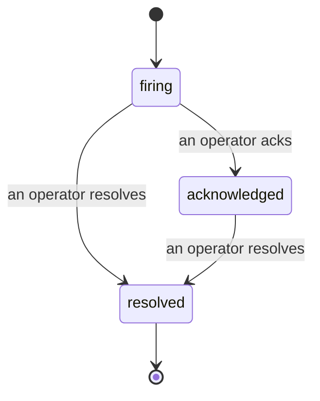

כאשר התראה מופעלת, השאלה הראשונה היא תמיד "מי טוען בזה?" Incidents עונה על זה: ברגע שמשהו חוצה סף, כל אחד יכול לראות שהתרעה פתוחה, מי בעל אחריות עליה, ובדיוק מה קרה עד כה, עם רשומה ברורה ומיוחסת שניתן להעביר ישירות לניתוח postmortem.

*תיבת הנכנסים מקבצת תרעות פתוחות לפי מצב ומסננת לפי חומרה ומקצה, כך שאתה רואה מה זקוק להתערבות אנושית כרגע.*

## דע מי טוען בזה, במבט אחד

אין עוד "האם מישהו בודק את זה?" בשרשור צ'אט. הפרה פותחת תרעה באופן אוטומטי וזורקת אותה לתיבת נכנסים משותפת, מקובצת לפי מצב. הכר בה ושמך על הדף, כך ששאר הצוות יודע שזה מטופל. הכרה היא משותפת: מספר מפעילים יכולים להכיר בתרעה זהה וכל אחד נרשם בנפרד, כך שחדר מלחמה מלא מופיע בשם במקום לדרוך זה על זה. הקצה בעל אחריות אחד לפחיתה, וסנן את תיבת הנכנסים לפי חומרה או מקצה כדי להקטין אותה למה שלך.

## הסיפור כולו, בשורה זמן אחת

כאשר התרעה תמומה, כבר יש לך את הכתיבה. פתח כל תרעה ותקבל את עדות ההפרה, את המקצים והמנויים שלה, שרשור הערות לתיאום במקום, ושורה זמן פעילות נוספת בלבד.

*הכל שקרה, לפי הסדר, כל שורה חתומה על ידי מי שעשה את זה.*

כל פעולה (פתוח, מוכר, פתור וכו') נכתבת לשורה הזו ולעולם לא נערכת. כל ערך מיוחס: למפעיל שנקט בה, לפי דוא"ל, או ל**automated** לכל דבר שObservability של Failproof AI עשה בעצמו, כמו פתיחת התרעה בהפרה. כלום אינו אנונימי וכלום לא אובד, כך שהpostmortem כמעט כותב את עצמו.

## כיצד תרעה נעה

- **Open (firing):** ההפרה פותחת את התרעה ודופקת בערוצים שלך פעם אחת. הפרות חוזרות מתקפלות לתוך אותה תרעה ומרעננות את העדות שלה במקום לדפוק אותך שוב ושוב.
- **Acknowledged:** מפעיל הוא אותה. זה נשאר פתוח, והפרות מאוחרות מעדכנות את העדות בשקט.
- **Resolved:** מפעיל סוגר אותה. פתרון אוטומטי כאשר התנאי מתפזר מתוכנן אך עדיין לא מופעל, כך שתרעה נשארת פתוחה עד שאדם פותר אותה, מה שמשמר את כל אחד כנה לגבי מה שבעצם מתפזר. תרעה חדשה יכולה להיפתח באותה התראה מאוחר יותר.

התראה אחת מחזיקה לכל היותר תרעה פתוחה אחת בבת אחת, כך שכלל תרידה לא יכולה לקבור אותך בשכפולים. אתה יכול גם לפתוח תרעה ביד: אחת עצמאית עבור משהו שלא התראה תפסה, או אחת המצורפת להתראה קיימת, אם יש לך `incidents:write`.

## איפה למצוא את זה

Incidents גרים ב`/<org-slug>/incidents`. הצפייה דורשת **`incidents:read`**; פתיחת תרעה ידנית דורשת **`incidents:write`**; הכרה, הקצאה, הערות ופתרון דורשים **`incidents:ack`**. מפתחות ישנים יותר שהעניקו את ה`alerts:ack` המיושן מתמשכים בעבודה, מכיוון שהוא מכובד כ`incidents:ack`, כך שסיבוב ה-on-call שלך לא צריך הנפקה מחדש.

## קשור

- [Alerts](/he/agenteye/alerts): הכללים שפותחים תרעות אלה כאשר סף חוצה.
- [Error tracking](/he/agenteye/error-tracking): ראה כל כישלון במקום אחד וקדם אחד להתראה.
- [Audits](/he/agenteye/audits): האנליסט המתוכנן שמוצא את הכשלים שלא כלל כלל היה צופה.