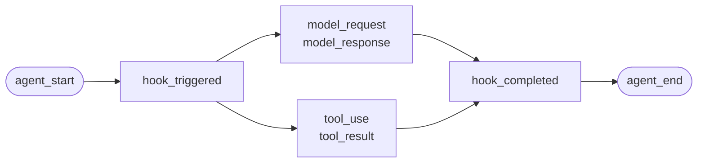
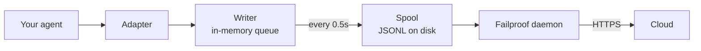

הדף הזה מיועד לסוכן שכתבת בעצמך, או לפריימוורק שאין לו מתאם ב-Failproof AI. אין כאן פריימוורק שצריך לבצע עליו אינסטרומנטציה: את האירועים אתה פולט בעצמך.

זהו אותו API שארבעת מתאמי הפריימוורק קוראים לו מאחורי הקלעים. הם בסך הכול טבלאות תרגום שנבנו מעליו.

## התקנה

```bash
pip install failproofai-sdk
```

בלי extras ובלי תלויות.

## אינסטרומנטציה

```python
import failproofai_sdk

failproofai_sdk.configure(environment="production")

with failproofai_sdk.session():                 # one run
    with failproofai_sdk.agent("planner"):      # one unit of work
        with failproofai_sdk.tool_call("search", input={"q": q}) as t:
            t.output = search(q)                # one tool call
```

קרא את הקוד מלמעלה למטה, והוא מסביר את עצמו:

| במה לעטוף | מה זה אומר |
| --- | --- |
| `session()` | האירועים האלה שייכים לאותה הרצה |
| `agent()` | משהו מבצע עבודה — תן לו שם שתזהה ברשימה |
| `tool_call()` | זה כלי אחד, וזה מה שהוא החזיר |

ומה כל אחד מהם פולט בפועל:

| היקף | פולט | תפקיד |
| --- | --- | --- |
| `session()` | כלום | קושר מזהה session שמקבץ הרצה אחת |
| `agent()` | `agent_start`, `agent_end` | תוחם יחידת עבודה |
| `tool_call()` | `tool_use`, `tool_result` | תוחם כלי אחד ומודד אותו |

כל מה שבתוך ההיקפים יכול להשמיט את `session_id` ואת `agent_id`. ההיקפים קושרים את הזהות למשתני הקשר (context variables), וכל קריאה לשיטת אירוע קוראת אותה משם, כך שלעולם לא צריך להעביר מזהים מפונקציה לפונקציה.

שלושתם עובדים גם עם `async with`, ולא רק עם `with`.

קינון סוכנים בונה את העץ. `parent_id` והעומק מחושבים מתוך המחסנית:

```python
with failproofai_sdk.session():
    with failproofai_sdk.agent("supervisor"):
        with failproofai_sdk.agent("researcher"):    # parent_id = "supervisor"
            ...
```

## איך היקף נסגר

`agent()` מטפל בחריגות בשבילך:

| מה קרה | אירועים | תוצאה |
| --- | --- | --- |
| לא נזרקה חריגה | `agent_end` | `success` |
| `Exception` | `error`, ואחריו `agent_end` | `failed` |
| `KeyboardInterrupt`, `SystemExit` | `error`, ואחריו `agent_end` | `failed` |
| `CancelledError`, `GeneratorExit` | `agent_end` בלבד | `cancelled` |

השגיאה נפלטת לפני `agent_end`, כי ה-dashboard סוגר את ה-span ב-`agent_end`, וכל מה שמגיע אחריו לא משויך לשום דבר. ביטול אינו כישלון, ולכן הרצות שבוטלו לא מזהמות את תצוגת השגיאות. החריגה תמיד נזרקת מחדש: היקף אף פעם לא בולע אותה.

## שיטות האירועים

חמש עשרה שיטות בשש משפחות. רובן באות בזוגות — אתה פולט את אירוע הפתיחה ואחריו את אירוע הסגירה, וה-SDK מודד את ה-span שביניהם.

| משפחה | פותח | סוגר | עצמאי |
| --- | --- | --- | --- |
| **סוכנים** | `agent_start` | `agent_end` | — |
| | `agent_pause` | `agent_resume` | — |
| **מודלים** | `model_request` | `model_response` | — |
| **כלים** | `tool_use` | `tool_result` | — |
| **Hooks** | `hook_triggered` | `hook_completed` | — |
| **בני אדם** | `human_wait` | `human_input` | `human_pause`, `human_interrupt` |
| **כשלים** | — | — | `error` |

<Tip>
  העדף את ההיקפים — `agent()` ו-`tool_call()` — בכל מקום שהם מתאימים. הם מבטיחים שאירוע הסגירה ייפלט גם כשגוף הבלוק זורק חריגה. פנה לשיטות האלה ישירות כשזרימת הבקרה שלך לא בנויה בצורה מקוננת, למשל כשהקריאה למודל מתבצעת בתוך פונקציית עזר.
</Tip>

<CodeGroup>
```python Agents
failproofai_sdk.event.agent_start(agent_id="planner", goal="find the cheapest flight")
failproofai_sdk.event.agent_end(agent_id="planner", outcome="success", summary="...")
failproofai_sdk.event.agent_pause(pause_id="p1", reason="awaiting approval")
failproofai_sdk.event.agent_resume(pause_id="p1")
```

```python Models
failproofai_sdk.event.model_request(
    model="gpt-4o-mini",
    messages=[{"role": "user", "content": "..."}],
    request_id="req-1",
)
failproofai_sdk.event.model_response(
    model="gpt-4o-mini",
    content="...",
    input_tokens=139,
    output_tokens=21,
    request_id="req-1",
    duration_ms=5202,
)
```

```python Tools
failproofai_sdk.event.tool_use(tool_name="search", tool_call_id="c1", input={"q": "..."})
failproofai_sdk.event.tool_result(tool_name="search", tool_call_id="c1", output="...")
```

```python Hooks
failproofai_sdk.event.hook_triggered(hook_name="retrieve", hook_id="h1", trigger_event="node")
failproofai_sdk.event.hook_completed(hook_name="retrieve", hook_id="h1", outcome="success")
```

```python Humans
failproofai_sdk.event.human_wait(input_id="i1", prompt="Approve?", options=["yes", "no"])
failproofai_sdk.event.human_input(input_id="i1", response="yes")
failproofai_sdk.event.human_pause(reason="operator paused the run", user_id="dana")
failproofai_sdk.event.human_interrupt(reason="operator stopped the run", at_step="step_3")
```

```python Failures
failproofai_sdk.event.error(
    error_type="TimeoutError",
    message="provider timed out after 30s",
    traceback="...",
)
```
</CodeGroup>

<Note>
  **שתי משפחות בני האדם פועלות בכיוונים הפוכים.**

  | שיטות | משמעות |
  | --- | --- |
  | `human_wait` / `human_input` | **הסוכן פנה לאדם** — שער אישור, שאלת הבהרה |
  | `human_pause` / `human_interrupt` | **אדם פעל על הסוכן** — כפתור עצירה, השהיה של מפעיל |

  אף פריימוורק לא מסמן את הזוג השני, ולכן תמיד תצטרך לפלוט אותו בעצמך.
</Note>

<Warning>
  **העבר `request_id` כשקריאות למודל רצות במקביל.** בלעדיו, בקשות ותגובות מזווגות לפי סדר ההגעה בכל סוכן — וקריאות מקבילות מזווגות לא נכון, כך שכל תגובה מוצמדת לבקשה הלא נכונה.
</Warning>

## דוגמה

לולאת קריאות לכלים מול ה-API של OpenAI, בלי פריימוורק סוכנים:

```python
import json

import failproofai_sdk
from openai import OpenAI

failproofai_sdk.configure(environment="production")
client = OpenAI()
MODEL = "gpt-4o-mini"


def turn(messages: list):
    """One model call, bracketed by the pair."""
    failproofai_sdk.event.model_request(model=MODEL, messages=messages)
    reply = client.chat.completions.create(model=MODEL, messages=messages, tools=TOOLS)
    usage = reply.usage
    failproofai_sdk.event.model_response(
        model=MODEL,
        content=reply.choices[0].message.content or "",
        input_tokens=usage.prompt_tokens,
        output_tokens=usage.completion_tokens,
    )
    return reply.choices[0].message


with failproofai_sdk.session():
    with failproofai_sdk.agent("inventory", goal="price report"):
        for _ in range(4):          # bounded; an unbounded agent loop is its own bug
            message = turn(messages)
            if not message.tool_calls:
                break
            messages.append(message.model_dump(exclude_none=True))
            for call in message.tool_calls:
                args = json.loads(call.function.arguments or "{}")
                with failproofai_sdk.tool_call(
                    call.function.name, tool_call_id=call.id, input=args
                ) as handle:
                    handle.output = run_tool(call.function.name, args)
                messages.append({
                    "role": "tool",
                    "tool_call_id": call.id,
                    "content": str(handle.output),
                })
```

הקוד הזה מפיק את אותם שישה סוגי אירועים שמתאם היה נותן לך. הגרסה המלאה והניתנת להרצה, כולל הגדרות הכלים, נמצאת במאגר של ה-SDK תחת `docs/manual/examples/`.

## חוטים ו-async

משתני הקשר עוברים אוטומטית למשימות asyncio. הם לא עוברים לחוטים חדשים, כי חוט מתחיל עם הקשר ריק.

```python
# asyncio: nothing to do
async with failproofai_sdk.session():
    await asyncio.gather(worker(1), worker(2))

# threads: wrap the callable
pool.submit(failproofai_sdk.propagate(work), x)
threading.Thread(target=failproofai_sdk.propagate(work)).start()
loop.run_in_executor(None, failproofai_sdk.propagate(work), x)
```

בלי `propagate()`, קריאות האירועים ב-worker זורקות `TypeError` שמציין את התיקון, במקום שהאירועים ינחתו בלי session. זה מכוון: ה-ingest מדלג על אירוע בלי session ועונה `200`, וזה בדיוק הכשל השקט ששכבת הזהות נועדה למנוע.

## אינסטרומנטציה לפריימוורק שאין לו מתאם

כל פריימוורק סוכנים נותן לך את אותן שלוש נקודות חיבור. מפה אותן ותקבל trace מלא — ארבעת המתאמים שמגיעים עם ה-SDK לא עושים יותר מזה.

| נקודת החיבור | מה אתה כותב | מה נרשם |
| --- | --- | --- |
| ההרצה | `session()` + `agent()` | `agent_start`, `agent_end` |
| כל כלי | `tool_call()` | `tool_use`, `tool_result` |
| כל קריאה למודל | הזוג `model_*` | `model_request`, `model_response` |

<Steps>
  <Step title="תחום את ההרצה">
    ```python
    with failproofai_sdk.session():
        with failproofai_sdk.agent(agent_name, goal=task):
            result = framework.run(task)
    ```
  </Step>
  <Step title="תחום כל כלי">
    בכל רכיב שהפריימוורק מכנה tool wrapper או middleware.

    ```python
    with failproofai_sdk.tool_call(name, input=args) as call:
        call.output = original(**args)
    ```
  </Step>
  <Step title="עטוף כל קריאה למודל בזוג אירועים">
    ```python
    failproofai_sdk.event.model_request(model=model, messages=messages)
    reply = provider.complete(...)
    failproofai_sdk.event.model_response(
        model=model,
        content=text,
        input_tokens=usage.prompt_tokens,
        output_tokens=usage.completion_tokens,
    )
    ```
  </Step>
</Steps>

<Tip>
  **יש גבול של צומת, שלב או middleware שכדאי לראות?** עטוף אותו בזוג hook — `hook_triggered` / `hook_completed` — ולא ב-`agent()` מקונן. `agent_id` הוא facet בעל קרדינליות נמוכה, ורשומה נפרדת לכל צומת מציפה אותו. ה-spans של hooks מוצגים באותה צורה ונותנים לך latency לכל צומת.
</Tip>

<Note>
  **אינסטרומנטציה ידנית ואוטומטית משתלבות.** מתאם שרץ בתוך היקף שכתבת ידנית מצטרף ל-session של ההיקף הזה, והסוכן של המתאם נרשם כילד של הסוכן שכתבת ידנית — כך מתקבל עץ אחד ולא שניים. זה שימושי כשאתה מוסיף אינסטרומנטציה ידנית לפריימוורק אחד לצד פריימוורק נתמך.
</Note>

<Accordion title="למה אין מתאם ל-AutoGen">
  יש לכך שתי סיבות, ושלוש נקודות החיבור שלמעלה הן התשובה לשתיהן:

  - `autogen-core` לא מתוחזק מאז ספטמבר 2025.
  - AG2 לא חושף נקודת רישום ברמת התהליך כולו, מקבילה ל-hooks של הפריימוורקים האחרים, ולכן אינסטרומנטציה שלו פירושה לעטוף כל סוכן בכל מקום שבו הוא נוצר.

  מיפוי ידני של נקודות החיבור רושם את אותם אירועים, באותה רמת פירוט, שמתאם מובנה היה רושם.
</Accordion>

## לעומק

איך ההקלטה עובדת בפועל. שום דבר מזה לא נדרש כדי להתחיל.

<AccordionGroup>

<Accordion title="איך נראית הקלטה בכל פריימוורק" icon="eye">

לכל הקלטה יש אותו מבנה: span נפתח, העבודה מקוננת בתוכו, ולכל אירוע פתיחה יש אירוע סגירה משלו.



**הזוג** הוא יחידת הבסיס. כל אירוע סגירה נושא משך זמן שה-SDK מודד מאירוע הפתיחה שלו.

להלן הרצה אמיתית אחת לכל פריימוורק — כל אחת נלכדה מהדוגמאות שמגיעות עם ה-SDK, ושם המודל עבר נרמול. שים לב כמה מידע מתקבל מקריאה אחת.

<Tabs>
  <Tab title="LangGraph">
    ```text 14 events
     1  +0.000s  agent_start       LangGraph
     2  +0.001s    hook_triggered  agent
     3  +0.002s      model_request   gpt-4o-mini
     4  +3.023s      model_response  gpt-4o-mini · 21 out-tok
     5  +3.024s    hook_completed  agent
     6  +3.024s    hook_triggered  tools
     7  +3.025s      tool_use      word_count
     8  +3.025s      tool_result   word_count · ok
     9  +3.025s    hook_completed  tools
    10  +3.026s    hook_triggered  agent
    11  +3.027s      model_request   gpt-4o-mini
    12  +5.717s      model_response  gpt-4o-mini · 5 out-tok
    13  +5.720s    hook_completed  agent
    14  +5.721s  agent_end         LangGraph · success
    ```

    צמתים הופכים לזוגות hook, כך שמתקבל latency לכל צומת בלי שהם יציפו את רשימת הסוכנים.
  </Tab>

  <Tab title="CrewAI">
    ```text 10 events
     1  +0.000s  agent_start       crew
     2  +0.050s    agent_start     analyst · under crew
     3  +0.057s      model_request   gpt-4o-mini
     4  +3.475s      model_response  gpt-4o-mini · 19 out-tok
     5  +3.478s      tool_use      lookup_metric
     6  +3.478s      tool_result   lookup_metric · ok
     7  +3.486s      model_request   gpt-4o-mini
     8  +5.694s      model_response  gpt-4o-mini · 9 out-tok
     9  +5.727s    agent_end       analyst · success
    10  +5.739s  agent_end         crew · success
    ```

    ה-`role` של כל סוכן הופך לשם ה-span שלו, כך שה-latency וצריכת הטוקנים מתפלגים לפי תפקיד.
  </Tab>

  <Tab title="LlamaIndex">
    ```text 26 events
     1  +0.000s  agent_start       Agent
     2  +0.001s    hook_triggered  init_run
     4  +0.501s    hook_triggered  setup_agent
     6  +0.503s    hook_triggered  run_agent_step
     7  +0.505s      model_request   gpt-4o-mini
     8  +3.083s      model_response  gpt-4o-mini · 18 out-tok
    10  +3.197s    hook_triggered  parse_agent_output
    12  +3.355s    hook_triggered  call_tool
    13  +3.355s      tool_use      city_population
    14  +3.355s      tool_result   city_population · ok
    16  +3.356s    hook_triggered  aggregate_tool_results
       ...                        second iteration
    26  +7.038s  agent_end         Agent · success
    ```

    לולאת הסוכן עצמה גלויה, ולא רק הקריאות שלה למודל.
  </Tab>

  <Tab title="Pydantic AI">
    ```text 8 events
    1  +0.000s  agent_start       agent
    2  +0.001s    model_request   gpt-4o-mini
    3  +4.413s    model_response  gpt-4o-mini · 17 out-tok
    4  +4.415s    tool_use        population
    5  +4.415s    tool_result     population · ok
    6  +4.416s    model_request   gpt-4o-mini
    7  +8.118s    model_response  gpt-4o-mini · 6 out-tok
    8  +8.119s  agent_end         agent · success
    ```

    אין זוגות hook: ל-Pydantic AI אין גבול של צומת או שלב שאפשר לתחום.
  </Tab>

  <Tab title="סוכנים מותאמים אישית">
    ```text 6 events
    1  +0.000s  agent_start       main
    2  +0.000s    tool_use        population
    3  +0.000s    tool_result     population · ok
    4  +0.000s    model_request   gpt-4o-mini
    5  +0.000s    model_response  gpt-4o-mini · 3 out-tok
    6  +0.000s  agent_end         main · success
    ```

    את האירועים האלה אתה פולט בעצמך. אותם סוגי אירועים, אותה רמת פירוט — המחיר הוא נקודות הקריאה שאתה כותב בעצמך.
  </Tab>
</Tabs>

</Accordion>

<Accordion title="איך session מתחיל ומסתיים" icon="circle-play">

**אין אירוע סיום ל-session.** את ה-session לא סוגרים — הוא פשוט קבוצת אירועים שחולקים את אותו `session_id`.

הסטטוס נגזר מהמבנה של ה-trace:

| סטטוס | מתי |
| --- | --- |
| `ongoing` | לפחות span אחד עדיין פתוח |
| `paused` | יש `agent_pause` בלי `agent_resume` תואם |
| `error` | שום דבר לא פתוח, ולפחות אירוע אחד נכשל |
| `done` | שום דבר לא פתוח, ושום דבר לא נכשל |

כלומר, session מסתיים כשכל הזוגות נסגרו. המתאמים פולטים את `agent_end` בשבילך, ובזמן הכיבוי הם סוגרים כל מה שעדיין פתוח ומסמנים אותו כלא שלם — הרצה שקרסה מסתיימת בסטטוס `done` עם פער גלוי, במקום להישאר תלויה.

<Note>
  זו הסיבה ש-session יכול להשתרע על פני שתי קריאות. `interrupt()` של LangGraph משהה את ההרצה, ה-span השורשי נשאר פתוח בכוונה, והקריאה שממשיכה את ההרצה סוגרת אותו. שתי הקריאות הן session אחד.
</Note>

</Accordion>

<Accordion title="זהות: session_id, agent_id ומי מנפיק אותם" icon="fingerprint">

`session_id` ו-`agent_id` הם אופציונליים בכל שיטות האירועים. אם משמיטים אותם, הם נלקחים מההיקף העוטף:

```python
with failproofai_sdk.session():
    with failproofai_sdk.agent("planner"):
        failproofai_sdk.event.tool_use(tool_name="search", tool_call_id="c1")
```

אפשר עדיין להעביר אותם במפורש, ואז הם גוברים על ההיקף. אם שום דבר לא קשור ושום דבר לא הועבר, הקריאה זורקת `TypeError` שמציין את התיקון, במקום לפלוט אירוע בלי session — אירוע שה-ingest היה מדלג עליו ובכל זאת עונה `200`.

ההיקפים קושרים את הזהות למשתני הקשר. אלה עוברים אוטומטית למשימות asyncio, אבל לא לחוטים חדשים — עטוף את ה-worker ב-`failproofai_sdk.propagate()`.

#### מי מנפיק איזה מזהה

| מזהה | מי מנפיק | הערות |
| --- | --- | --- |
| `session_id` | אתה, או ה-SDK | `session("chat-42")` נשמר כפי שהוא; אם משמיטים אותו, ה-SDK מייצר `uuid4().hex` |
| `agent_id` | אתה, או הפריימוורק | מתוך `agent("analyst")`, ה-`role` של CrewAI או `FunctionAgent.name`. ערך שנראה כמו UUID נדחה ומוחלף |
| `tool_call_id`, `hook_id`, `request_id` | אתה, או הפריימוורק | המתאמים משתמשים מחדש במזהי ההרצה של הפריימוורק עצמו, ולכן זוגות שורדים מעבר בין חוטים |
| **מזהה האירוע** | **Cloud, בשלב ה-ingest** | ה-SDK לא פולט מזהה כזה |
| **`dedup_key`** | **Cloud, בשלב ה-ingest** | גיבוב (hash) של הארגון, ה-session, חותמת הזמן, הסוג וה-payload. זו הזהות האמיתית — בזכותה אצווה שנשלחה שוב מתמזגת לעותק אחד במקום ליצור כפילויות |

#### איך מתאמים קובעים את `session_id`

ההתאמה הראשונה קובעת:

1. אפשרות `session_id` מפורשת
2. מטא-דאטה ברמת הקריאה
3. היקף `session()` העוטף
4. מטא-דאטה של הפריימוורק
5. מזהה ההרצה של הפריימוורק עצמו

המזהה אף פעם לא מומצא כל עוד אחד מאלה קיים — מזהה סינתטי היה מפצל הרצה אחת על פני כמה sessions.

#### שמור על קרדינליות נמוכה ב-`agent_id`

זהו ה-facet העיקרי בכל תצוגה של ה-dashboard, והוא עמודה מסוג `LowCardinality(String)`. ערך שמשתנה בכל הרצה פוגע ביעילות העמודה וממלא את התפריט הנפתח של המסנן ברשומה נפרדת לכל הרצה.

המתאמים מגנים על העמודה הזו בשבילך:

| הפריימוורק מעביר | מה נרשם | הסיבה |
| --- | --- | --- |
| `3f9a1c2b-…` (UUID) | `main` | אין חלק קריא שאפשר לשמור |
| מחרוזת hex ארוכה ותו לא | `main` | אותו דבר |
| `agent-3f9a1c2b-…` | `agent` | מזהה ההרצה הוסר, והחלק הקריא נשמר |
| `agent-v2` | `agent-v2` | מקטעים קצרים נשארים כמו שהם |
| `step-3` | `step-3` | אותו דבר |

המזהה האמיתי נשמר ב-`fw_agent_id` / `fw_run_id`, שם עדיין אפשר לתשאל אותו בלי שהוא יהיה facet.

<Warning>
  **ההגנה הזו חלה רק על תוויות שבחר *הפריימוורק*.** `agent_id` שאתה מעביר בעצמך — ל-`event.*` או ל-`failproofai_sdk.agent(...)` — נרשם בדיוק כפי שהועבר. שכתוב שקט של ארגומנט מפורש היה גרוע יותר מבעיית הקרדינליות שהוא בא למנוע, ולכן תן ל-spans שלך שמות מתאימים.
</Warning>

</Accordion>

<Accordion title="סוגי האירועים לפי קבוצות — ומה כל פריימוורק רושם" icon="table">

| קבוצה | אירועים |
| --- | --- |
| סוכנים | `agent_start`, `agent_end`, `agent_pause`, `agent_resume` |
| מודלים | `model_request`, `model_response` |
| כלים | `tool_use`, `tool_result` |
| Hooks | `hook_triggered`, `hook_completed` |
| בני אדם | `human_wait`, `human_input`, `human_pause`, `human_interrupt` |
| כשלים | `error` |

מה כל פריימוורק רושם, לפי מדידה בהרצות שלמעלה:

| אירוע | LangGraph | CrewAI | LlamaIndex | Pydantic AI | מותאם אישית |
| --- | :--: | :--: | :--: | :--: | :--: |
| התחלה וסיום של סוכן | כן | כן | כן | כן | אתה |
| בקשה ותגובה של מודל | כן | כן | כן | כן | אתה |
| שימוש בכלי ותוצאתו | כן | כן | כן | כן | אתה |
| הפעלה וסיום של hook | צומת | משימה | שלב | — | אתה |
| שגיאה | כן | כן | כן | כן | אוטומטי |
| המתנה לאדם וקלט ממנו | כן | כן | כן | — | אתה |
| השהיה וחידוש של סוכן | כן | כן | כן | — | אתה |

מקף פירושו שאין לפריימוורק מושג כזה. `human_pause` ו-`human_interrupt` מתארים *אדם* שפועל על הסוכן, ואף פריימוורק לא מסמן זאת — את אלה עליך לפלוט בעצמך.

</Accordion>

<Accordion title="זוגות, קורלציה ומשך" icon="link">

אירוע אף פעם לא מגיע לבד. אירוע אחד פותח span, אחר סוגר אותו, ואירוע הסגירה נושא משך זמן שה-SDK מודד מאירוע הפתיחה.

| פותח | סוגר | מה אירוע הסגירה נושא |
| --- | --- | --- |
| `agent_start` | `agent_end` | `outcome`, `summary` |
| `model_request` | `model_response` | טוקנים, `stop_reason`, latency |
| `tool_use` | `tool_result` | `output` או `error`, משך |
| `hook_triggered` | `hook_completed` | `outcome`, משך |
| `agent_pause` | `agent_resume` | כמה זמן נמשכה ההשהיה |
| `human_wait` | `human_input` | התשובה, וכמה זמן לקח לאדם לענות |

<Warning>
  אירוע פתיחה בלי אירוע סגירה הוא span שלעולם לא מסתיים. ה-session מוצג כאילו הוא עדיין רץ, לנצח, ומשך הפעילות שלו ממשיך לגדול. זה הכשל שצריך להיזהר ממנו כשמבצעים אינסטרומנטציה ידנית.
</Warning>

#### כללי קורלציה

- השתמש באותו `tool_call_id`, `hook_id`, `pause_id` או `input_id` גם באירוע הסיום התואם.
- ה-SDK מחשב את `duration_ms` עבור `tool_result`, `hook_completed`, `agent_resume` ו-`human_input`. העברה שלו לשיטות האלה זורקת `ValueError`.
- `duration_ms` **כן** מתקבל ב-`model_response`, כי רק מי שמבצע את הקריאה יודע מה ה-latency האמיתי של הספק. הוא חייב להיות מספר שלם — ערך float זורק `ValueError` כבר בנקודת הקריאה, כי השרת קורא את העמודה כמספר שלם לא מסומן של 32 סיביות, ועבור כל ערך אחר היה שומר NULL.
- מפתחות הקורלציה תחומים לפי סוג ולפי session, כך שקריאה לכלי ו-hook יכולים לחלוק מזהה בבטחה, ושני sessions שרצים במקביל יכולים להשתמש באותם מזהים בלי להתנגש. הם לא תחומים לפי סוכן: זוג שנפתח תחת סוכן אחד ונסגר תחת סוכן אחר עדיין מתואם, וזה המצב הרגיל בפריימוורקים מרובי סוכנים.
- `request_id` מזווג את `model_request` עם `model_response`. בלעדיו, אירועי מודל מזווגים לפי הסדר בכל סוכן, כך שקריאות מקבילות מזווגות לא נכון.
- זוג שמפוצל בין תהליכים עדיין מתואם בהמשך הצינור, אבל ה-SDK לא יכול לחשב את משך הזמן שלו בתוך התהליך.
- מפת האירועים הממתינים מחזיקה לכל היותר 10,000 אירועי פתיחה, וכשהיא מתמלאת היא מפנה את הרשומה הישנה ביותר.

</Accordion>

<Accordion title="מה יש בחבילה, ואיך instrument() מוצא את הפריימוורק שלך" icon="box">

התקנת `failproofai-sdk` מתקינה הכול, כולל ארבעת המתאמים. ה-extras מושכים את **הפריימוורק**, לא את המתאם.

```python
import failproofai_sdk        # loads nothing outside the standard library
failproofai_sdk.instrument()  # imports only the adapters you actually need
```

`import failproofai_sdk` מחויב חוזית לאפס תלויות. הדבר נאכף על ידי בדיקה שמתקינה את ה-wheel הבנוי עם `--no-deps`, ועל ידי בדיקה נוספת שמוכיחה שאף פריימוורק לא מגיע ל-`sys.modules`.

<Warning>
  אין מאפיין `failproofai_sdk.crewai`. המתאמים לא נחשפים ברמה העליונה של החבילה, וזה מכוון: גישה לאחד מהם הייתה מייבאת את הפריימוורק כתופעת לוואי של גישה למאפיין, ושוברת את ההבטחה לאפס תלויות. השתמש ב-`instrument()`.
</Warning>

```python
failproofai_sdk.instrument()              # every framework already imported
failproofai_sdk.instrument("crewai")      # exactly one, by name
failproofai_sdk.uninstrument("crewai")    # put it back
```

| שם | מקבל גם |
| --- | --- |
| `langchain` | `langgraph`, `langchain_core` |
| `crewai` | — |
| `llama_index` | `llamaindex`, `llama-index` |
| `pydantic_ai` | `pydantic-ai`, `pydanticai` |

הזיהוי האוטומטי קורא את `sys.modules`, ולא את רשימת החבילות המותקנות, כך שפריימוורק שהתקנת אבל אף פעם לא ייבאת לא עובר אינסטרומנטציה, וגם לא ייובא בשמך. כדי לראות מה מחובר:

```python
from failproofai_sdk.integrations import active, available

available()   # ('crewai', 'langchain', 'llama_index', 'pydantic_ai')
active()      # ('langchain',)
```

<Note>
  **`instrument("crewai")` במכונה שאין בה CrewAI לא זורק חריגה.** הוא רושם אזהרה בלוג ומחזיר `()`, כך שפריימוורק אחד חסר לעולם לא מפיל תהליך שמבצע אינסטרומנטציה גם לפריימוורקים אחרים.

  האזהרה כוללת את ה-`ImportError` המקורי, וההודעה שלו מציינת את פקודת ההתקנה המדויקת — כך שהתיקון נמצא בלוגים שלך, ולא מוסתר.

  ```text
  ImportError: failproofai_sdk: cannot instrument 'crewai' because 'crewai.events'
  is not importable. Install it with:  pip install 'failproofai_sdk[crewai]'
  ```

  הגדר `FAILPROOFAI_SDK_STRICT=1` כדי שבמקום זאת תיזרק חריגה. הדגל הזה נקרא **פעם אחת ונשמר במטמון**, לכן הגדר אותו בסביבה לפני שהתהליך מתחיל, ולא באמצע ההרצה.
</Note>

<Warning>
  **הקריאה ל-`instrument()` חייבת לבוא *אחרי* ייבוא הפריימוורק.** הזיהוי האוטומטי קורא את `sys.modules`, כך שקריאה בלי ארגומנטים מעל הייבוא לא מוצאת כלום, לא מתקינה כלום ומחזירה `()`.
</Warning>

<CodeGroup>
```python Wrong
import failproofai_sdk
failproofai_sdk.instrument()   # sys.modules has no langchain yet -> ()

import langchain               # too late, nothing is wired
```

```python Right
import langchain               # import the framework first
import failproofai_sdk

failproofai_sdk.instrument()   # finds it -> ('langchain',)
```

```python Right, order-proof
import failproofai_sdk

# Naming it imports the adapter on request, so this works from anywhere.
failproofai_sdk.instrument("langchain")
```
</CodeGroup>

אם הסדר שגוי, התהליך רץ עם ה-SDK מיובא, המתאם מותקן לכאורה, **ואף אירוע לא נפלט**. נרשמת בלוג אזהרה שאומרת בדיוק את זה — לכן כשהרצה לא מתעדת כלום, בדוק קודם את הלוגים.

</Accordion>

<Accordion title="איך אירועים מגיעים ל-Cloud" icon="cloud-upload">



| שלב | תפקיד | היכן רץ |
| --- | --- | --- |
| מתאם | מתרגם callback של הפריימוורק לאחד מ-15 סוגי האירועים | התהליך שלך |
| Writer | מכניס לתור, מאגד לאצוות וכותב JSONL באופן אטומי | התהליך שלך, בחוט רקע |
| Spool | נקודת מסירה עמידה, ששורדת גם את היציאה של התהליך שלך | הדיסק המקומי |
| Daemon | עוקב אחרי ה-spool, שולח אצוות ומוחק את מה שנשלח | המכונה שלך |
| Ingest | מקצה מזהה שורה ומפתח dedup, ומקדם שדות לעמודות שאפשר לתשאל | Cloud |

ה-spool הוא מה שהופך את זה לבטוח: הסוכן שלך אף פעם לא נחסם בהמתנה לרשת, והשבתה של Cloud פירושה תיקייה שהולכת וגדלה, ולא אירועים שאבדו.

כל flush כותב קובץ אצווה אחד: קודם `.tmp`, אחר כך `fsync`, ולבסוף שינוי שם אטומי:

```text
~/.failproofai/custom-agents/events/
  event-2026-08-20T10-15-00-123Z-48213-0.jsonl
```

ה-daemon אוסף רק קבצי `.jsonl`, כך שלעולם לא יקרא קובץ שנכתב רק בחלקו. שם הקובץ כולל חותמת זמן, מזהה תהליך ומספר רץ, כך ששני תהליכים שמבצעים flush באותה אלפית שנייה לא יכולים להתנגש. התור מוגבל ל-10,000 אירועים; מעבר לכך הוא משליך את הישנים ביותר ורושם זאת בלוג.

<Warning>
  **ברירת המחדל של `collector.redact` היא `minimal` גם עבור אירועי SDK.** ה-SDK
  מבצע השחרה לפני שהוא כותב אצווה לדיסק, וה-daemon מריץ שוב את אותו מעבר
  דטרמיניסטי לפני ההעלאה, כך שגם אצוות מגרסאות SDK ישנות מוגנות.
</Warning>

ה-daemon קורא כל אצווה ומחיל עליה השחרה בזיכרון לפני ההעלאה. הוא לא משכתב את
קובץ ה-spool שקרא.

| אירועים | נכתבים על ידי | היכן רצה ההשחרה המינימלית |
| --- | --- | --- |
| תמלילי sessions של CLI | ה-daemon | לפני שה-daemon כותב את האצווה |
| פעילות hooks | ה-daemon | לפני שה-daemon כותב את האצווה |
| **כל מה שה-SDK פולט** | **התהליך שלך** | **לפני שה-SDK כותב את האצווה, ושוב לפני שה-daemon מעלה אותה** |

הגדר את `collector.redact` ל-`off` רק כשיש דרישה מפורשת לשמור payloads כלשונם;
גם ה-SDK וגם ה-daemon מכבדים את ההגדרה הזו. השחרה מינימלית תופסת מפתחות API
נפוצים, אסימוני bearer, אסימוני JWT והשמה של סודות למשתנים. היא לא יכולה לזהות
מידע רגיש שמנוסח כטקסט חופשי.

<Tip>
  **אתה שולט ב-payloads כבר במקור, בשני מקומות:**

  - כבה את לכידת התוכן במתאם. **שם האפשרות שונה ממתאם למתאם, ולאחד המתאמים אין אפשרות כזו בכלל** — זה לא מתג אוניברסלי אחד:
    - LangChain / LangGraph, Pydantic AI — `capture_content=False`
    - LlamaIndex — `capture_messages=False`
    - CrewAI — **אין שום מתג תוכן**; `session_id` היא האפשרות היחידה שהוא קורא, ולכן ההנחיות והתשובות של המודל תמיד נרשמות.

    `instrument()` משמיט אפשרויות שהמתאם לא קורא, כך שהעברת שם שגוי לא זורקת שום חריגה וגם לא משנה דבר.
  - מלכתחילה, אל תעביר את הסוד ל-`input=`.

  `collector.redact` הוא הגנה לעומק, ולא תחליף לאף אחד משני אלה.
</Tip>

<Warning>
  **תיקיית spool ריקה היא המצב התקין.** אל תשתמש בה כדי לבדוק אם האירועים נמסרו.
</Warning>

ה-daemon מוחק כל אצווה תוך אלפיות שנייה מרגע שליחתה, כך ש-`ls` מתחרה ב-collector ומציג רק חלק קטן ממה שפלטת — ואי אפשר להבחין בין זה לבין SDK שלא תיעד כלום.

כדי לוודא שהאירועים באמת הגיעו, בדוק ב-dashboard. כדי לראות את ה-spool מתמלא, עצור קודם את ה-daemon.

</Accordion>

<Accordion title="כשהאינסטרומנטציה נכשלת" icon="triangle-alert">

כל callback רץ בתוך עוטף שתפקידו היחיד הוא לזרוק חריגות מחדש, כך שהקריאה שלך נמצאת בתוך `try` אחד בדיוק, וכל מה שה-SDK עושה קורה מחוצה לו.

| מה קורה | התוצאה |
| --- | --- |
| hook זורק חריגה | החריגה נרשמת בלוג פעם אחת, יחד עם ה-traceback שלה. הקריאה שלך לא מושפעת |
| אותו hook זורק חריגה שלוש פעמים | ה-hook הזה בלבד מושבת עד סוף חיי התהליך, ונרשמת שורת שגיאה אחת |
| `FAILPROOFAI_SDK_STRICT=1` מוגדר | במקום זאת, החריגה נזרקת מחדש |
| גרסת הפריימוורק מחוץ לטווח שנבדק | אזהרה אחת, והאינסטרומנטציה מתבצעת בכל זאת |
| יכולת בודדת חסרה | רק ה-hook הזה מושבת, אף פעם לא המתאם כולו |

ברירת המחדל נכונה ב-production ושגויה בזמן דיבוג, כי כל מה שהיא יכולה להוכיח הוא ש"זה לא קרס". הגדר `FAILPROOFAI_SDK_STRICT=1` כדי שכשל שהיה נבלע בשקט יתריע בקול רם.

</Accordion>

</AccordionGroup>

## בעיות נפוצות

<AccordionGroup>
  <Accordion title="span שאף פעם לא מסתיים">
    לאירוע פתיחה אין אירוע סגירה: `model_request` בלי `model_response`, או `tool_use` בלי `tool_result`. השתמש בהיקפים, שמבטיחים את הזוג גם כשגוף הבלוק זורק חריגה. אם אתה קורא לשיטות האירועים ישירות, השתמש ב-`try` וב-`finally`.
  </Accordion>

  <Accordion title="העברת duration_ms זורקת ValueError">
    הערך נמדד מאירוע הפתיחה התואם, ולכן הוא נדחה ב-`tool_result`, `hook_completed`, `agent_resume` ו-`human_input`. הוא מתקבל ב-`model_response`, כי רק אתה יודע מה ה-latency האמיתי של הספק, ושם הוא חייב להיות מספר שלם.
  </Accordion>

  <Accordion title="אירועים מחוט worker זורקים TypeError">
    החוט לא ירש את ההקשר. עטוף את ה-callable ב-`failproofai_sdk.propagate()`. ראה [חוטים ו-async](#חוטים-ו-async).
  </Accordion>

  <Accordion title="שדה נוסף נעלם או דרס משהו">
    שדות נוספים ממוזגים אחרונים, כך ששדה ששמו זהה לשדה אמיתי, כמו `model` או `outcome`, ידרוס אותו וישנה עמודה שמורה. תן לשדות שלך קידומת ייחודית; המתאמים משתמשים בקידומת `fw_`.
  </Accordion>

  <Accordion title="במסנן הסוכנים יש אלפי רשומות">
    `agent_id` הוא facet בעל קרדינליות נמוכה, והכנסת אליו מזהה הרצה. השתמש בשם של תפקיד או של צומת, ושמור את המזהה האמיתי בשדה של ה-payload.
  </Accordion>
</AccordionGroup>

## מה הלאה

<Columns cols={3}>
  <Card title="איך זה עובד" icon="workflow" href="/he/reference/custom-agents">
    זוגות, מזהים, מחזור החיים של session ומסירה.
  </Card>
  <Card title="קריאת trace" icon="route" href="/he/sessions/read-a-trace">
    עקוב אחרי שרשרת הסיבתיות ב-session שזה עתה לכדת.
  </Card>
  <Card title="מתאמי פריימוורק" icon="plug" href="/he/start/integrations">
    LangGraph, CrewAI, LlamaIndex ו-Pydantic AI.
  </Card>
</Columns>
