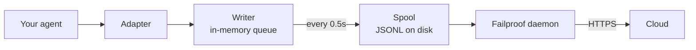

---
---
title: "סוכנים מותאמים"
sidebarTitle: "סוכנים מותאמים"
description: "כלאו סוכן שכתבת בעצמך, או פריימוורק ללא מתאם."
icon: "code"
---

עבור סוכן שכתבת בעצמך, או פריימוורק שאין ל-Failproof AI מתאם בשבילו. אין שום דבר להכין: אתה פולט את האירועים.

זו אותה API שמתאמי הפריימוורק הארבעה קוראים בעומק. הם טבלאות תרגום עליה.

## התקנה

```bash
pip install failproofai-sdk
```

ללא תוספות, וללא תלויות.

## הכנה

```python
import failproofai_sdk

failproofai_sdk.configure(environment="production")

with failproofai_sdk.session():                 # one run
    with failproofai_sdk.agent("planner"):      # one unit of work
        with failproofai_sdk.tool_call("search", input={"q": q}) as t:
            t.output = search(q)                # one tool call
```

קרא את זה מלמעלה למטה וזה אומר מה זה אומר:

| עטוף בו | כדי לומר |
| --- | --- |
| `session()` | אירועים אלה שייכים לאותו ריצה |
| `agent()` | משהו עושה עבודה — תן לו שם שהיית מזהה ברשימה |
| `tool_call()` | זה כלי אחד, והנה מה שהוא החזיר |

ומה כל אחד בעצם פולט:

| טווח | פולט | מטרה |
| --- | --- | --- |
| `session()` | כלום | קושר מזהה סשן, קיבוץ ריצה אחת |
| `agent()` | `agent_start`, `agent_end` | מסוגריים יחידת עבודה |
| `tool_call()` | `tool_use`, `tool_result` | מסוגריים כלי אחד ומודד אותו |

הכל בפנים יכול להשמיט את `session_id` ו-`agent_id`. הטווחים קושרים זהות על משתני הקשר וכל קריאת אירוע קוראת אותה בחזרה, אז אתה לעולם לא מעביר ids דרך הפונקציות שלך.

שלושתם עובדים תחת `async with` כמו גם `with`.

קינון סוכנים בונה את העץ. `parent_id` וגובה מחושבים מהערום:

```python
with failproofai_sdk.session():
    with failproofai_sdk.agent("supervisor"):
        with failproofai_sdk.agent("researcher"):    # parent_id = "supervisor"
            ...
```

## איך טווח נסגר

`agent()` מטפל בחריגים בשבילך:

| מה קרה | אירועים | תוצאה |
| --- | --- | --- |
| כלום לא הוצא | `agent_end` | `success` |
| `Exception` | `error`, אז `agent_end` | `failed` |
| `KeyboardInterrupt`, `SystemExit` | `error`, אז `agent_end` | `failed` |
| `CancelledError`, `GeneratorExit` | `agent_end` בלבד | `cancelled` |

השגיאה מופצת לפני `agent_end`, כי לוח הבקרה סוגר את ה-span ב-`agent_end` וכל דבר אחרי זה מיוחס לכלום. ביטול זה לא כישלון, אז ריצות מבוטלות לא מעלמות את משטח השגיאות. החריג תמיד מועלה מחדש: טווח לעולם לא בולע.

## שיטות האירוע

חמש עשרה שיטות בשש משפחות. רובן מגיעים בזוגות — אתה פולט את ה-opener, אז את ה-closer, וה-SDK מודד את ה-span ביניהם.

| משפחה | פותח | סוגר | עצמאי |
| --- | --- | --- | --- |
| **סוכנים** | `agent_start` | `agent_end` | — |
| | `agent_pause` | `agent_resume` | — |
| **מודלים** | `model_request` | `model_response` | — |
| **כלים** | `tool_use` | `tool_result` | — |
| **Hooks** | `hook_triggered` | `hook_completed` | — |
| **אנשים** | `human_wait` | `human_input` | `human_pause`, `human_interrupt` |
| **כשלים** | — | — | `error` |

<Tip>
  העדף את הטווחים — `agent()` ו-`tool_call()` — איפה שהם מתאימים. הם מבטיחים את אירוע הסגירה גם כשהגוף מעלה. הגיע לשיטות אלו ישירות כשזרימת הבקרה שלך לא מקוננת, כמו קריאת מודל בתוך עוזר.
</Tip>

<CodeGroup>
```python סוכנים
failproofai_sdk.event.agent_start(agent_id="planner", goal="find the cheapest flight")
failproofai_sdk.event.agent_end(agent_id="planner", outcome="success", summary="...")
failproofai_sdk.event.agent_pause(pause_id="p1", reason="awaiting approval")
failproofai_sdk.event.agent_resume(pause_id="p1")
```

```python מודלים
failproofai_sdk.event.model_request(
    model="gpt-4o-mini",
    messages=[{"role": "user", "content": "..."}],
    request_id="req-1",
)
failproofai_sdk.event.model_response(
    model="gpt-4o-mini",
    content="...",
    input_tokens=139,
    output_tokens=21,
    request_id="req-1",
    duration_ms=5202,
)
```

```python כלים
failproofai_sdk.event.tool_use(tool_name="search", tool_call_id="c1", input={"q": "..."})
failproofai_sdk.event.tool_result(tool_name="search", tool_call_id="c1", output="...")
```

```python Hooks
failproofai_sdk.event.hook_triggered(hook_name="retrieve", hook_id="h1", trigger_event="node")
failproofai_sdk.event.hook_completed(hook_name="retrieve", hook_id="h1", outcome="success")
```

```python אנשים
failproofai_sdk.event.human_wait(input_id="i1", prompt="Approve?", options=["yes", "no"])
failproofai_sdk.event.human_input(input_id="i1", response="yes")
failproofai_sdk.event.human_pause(reason="operator paused the run", user_id="dana")
failproofai_sdk.event.human_interrupt(reason="operator stopped the run", at_step="step_3")
```

```python כשלים
failproofai_sdk.event.error(
    error_type="TimeoutError",
    message="provider timed out after 30s",
    traceback="...",
)
```
</CodeGroup>

<Note>
  **שתי משפחות האנשים מצביעות בכיוונים מנוגדים.**

  | שיטות | משמעות |
  | --- | --- |
  | `human_wait` / `human_input` | ה**סוכן ביקש מאדם** — שער אישור, שאלה מבהירה |
  | `human_pause` / `human_interrupt` | **אדם פעל על הסוכן** — כפתור עצור, השהיית מפעיל |

  אף פריימוורק לא משדר את הזוג השני, אז זה תמיד שלך לפליטה.
</Note>

<Warning>
  **עבור `request_id` כאשר קריאות מודל פועלות בו-זמנית.** ללא זה, בקשות תגובות מתאימות בסדר הגעה לכל סוכן — וקריאות בו-זמנית מתאימות בצורה שגויה, וקובעות כל תגובה לבקשה השגויה.
</Warning>

## דוגמה

לולאת קריאת כלים כנגד ה-OpenAI API, ללא מסגרת סוכן:

```python
import json

import failproofai_sdk
from openai import OpenAI

failproofai_sdk.configure(environment="production")
client = OpenAI()
MODEL = "gpt-4o-mini"


def turn(messages: list):
    """One model call, bracketed by the pair."""
    failproofai_sdk.event.model_request(model=MODEL, messages=messages)
    reply = client.chat.completions.create(model=MODEL, messages=messages, tools=TOOLS)
    usage = reply.usage
    failproofai_sdk.event.model_response(
        model=MODEL,
        content=reply.choices[0].message.content or "",
        input_tokens=usage.prompt_tokens,
        output_tokens=usage.completion_tokens,
    )
    return reply.choices[0].message


with failproofai_sdk.session():
    with failproofai_sdk.agent("inventory", goal="price report"):
        for _ in range(4):          # bounded; an unbounded agent loop is its own bug
            message = turn(messages)
            if not message.tool_calls:
                break
            messages.append(message.model_dump(exclude_none=True))
            for call in message.tool_calls:
                args = json.loads(call.function.arguments or "{}")
                with failproofai_sdk.tool_call(
                    call.function.name, tool_call_id=call.id, input=args
                ) as handle:
                    handle.output = run_tool(call.function.name, args)
                messages.append({
                    "role": "tool",
                    "tool_call_id": call.id,
                    "content": str(handle.output),
                })
```

זה מייצר אותם שישה סוגי אירוע שמתאם היה נותן לך. הגרסה הריצה המלאה, עם הגדרות הכלים, משלחת ב-SDK ב-`docs/manual/examples/`.

## Threads ו-async

משתני הקשר מתפשטים למשימות asyncio באופן אוטומטי. הם לא מתפשטים לחוטים חדשים, כי חוט מתחיל עם קשר ריק.

```python
# asyncio: nothing to do
async with failproofai_sdk.session():
    await asyncio.gather(worker(1), worker(2))

# threads: wrap the callable
pool.submit(failproofai_sdk.propagate(work), x)
threading.Thread(target=failproofai_sdk.propagate(work)).start()
loop.run_in_executor(None, failproofai_sdk.propagate(work), x)
```

ללא `propagate()`, אירועי העובד מעלים `TypeError` ששם את התיקון ולא נוחתים בשום סשן. זה בכוונה: אירוע ללא סשן מדולג על ידי ingest וענה `200`, שזה כישלון שקט שרמת הזהות קיימת כדי למנוע.

## הכנת פריימוורק ללא מתאם

כל מסגרת סוכן נותנת לך אותם שלושה seams. מפה אותם ויש לך עקבות שלם — ארבעת המתאמים המשודרים לא עושים יותר מזה.

| ה-seam | מה אתה כותב | מה נוחת |
| --- | --- | --- |
| הריצה | `session()` + `agent()` | `agent_start`, `agent_end` |
| כל כלי | `tool_call()` | `tool_use`, `tool_result` |
| כל קריאת מודל | הזוג `model_*` | `model_request`, `model_response` |

<Steps>
  <Step title="הסוגר את הריצה">
    ```python
    with failproofai_sdk.session():
        with failproofai_sdk.agent(agent_name, goal=task):
            result = framework.run(task)
    ```
  </Step>
  <Step title="הסוגר את כל כלי">
    בכל מה שהפריימוורק קורא עטיפת כלי או middleware.

    ```python
    with failproofai_sdk.tool_call(name, input=args) as call:
        call.output = original(**args)
    ```
  </Step>
  <Step title="זוג כל קריאת מודל">
    ```python
    failproofai_sdk.event.model_request(model=model, messages=messages)
    reply = provider.complete(...)
    failproofai_sdk.event.model_response(
        model=model,
        content=text,
        input_tokens=usage.prompt_tokens,
        output_tokens=usage.completion_tokens,
    )
    ```
  </Step>
</Steps>

<Tip>
  **יש לך צומת, שלב או גבול middleware שכדאי לראות?** עטוף אותו בזוג hook — `hook_triggered` / `hook_completed` — לא `agent()` מקונן. `agent_id` הוא facet בעל עוצמה נמוכה, וערך אחד לכל צומת טובע אותו. span hook משדרו באותו אופן ונותן לך אותך-צומת latency.
</Tip>

<Note>
  **ידני ואוטומטי מרכיבים.** מתאם הפועל בתוך טווח כתוב בעצמך מצטרף לסשן זה ו-parents לסוכן זה, אז אתה מקבל עץ אחד במקום שניים — שימושי כאשר אתה מכין פריימוורק אחד בעצמך לצד אחד נתמך.
</Note>

<Accordion title="למה אין מתאם AutoGen">
  שתי סיבות, ושלושת ה-seams לעיל הם התשובה לשתיהן:

  - `autogen-core` היה לא תחזוקה מאז ספטמבר 2025.
  - AG2 לא חושף נקודת רישום בהיקף תהליך שקולה לה של הפריימוורקים האחרים' hooks, אז הכנה זה אומר עטיפת כל סוכן בכל אתר בנייה.

  מיפוי ה-seams ביד רושמות את אותם אירועים, באותה נאמנות, כמו מתאם משודר היה.
</Accordion>

## הלוך עמוק יותר

איך ההקלטה בעצם עובדת. כלום לא הכרחי כדי להתחיל.

<AccordionGroup>

<Accordion title="מה הקלטה נראית כמו, לכל פריימוורק" icon="eye">

לכל הקלטה יש אותה צורה: span נפתח, עבודה מקוננת בתוכה, וכל אירוע פתיחה מקבל אירוע סגירה.


ה**זוג** הוא היחידה. כל אירוע סגירה נושא משך הזמן שה-SDK מודד מהפתיחה שלו.

להלן ריצה אמיתית אחת לכל פריימוורק — תפוסה מהדוגמאות המשלחות עם ה-SDK, שם מודל מנורמל. שימו לב כמה חוזר מקריאה אחת.

<Tabs>
  <Tab title="LangGraph">
    ```text 14 events
     1  +0.000s  agent_start       LangGraph
     2  +0.001s    hook_triggered  agent
     3  +0.002s      model_request   gpt-4o-mini
     4  +3.023s      model_response  gpt-4o-mini · 21 out-tok
     5  +3.024s    hook_completed  agent
     6  +3.024s    hook_triggered  tools
     7  +3.025s      tool_use      word_count
     8  +3.025s      tool_result   word_count · ok
     9  +3.025s    hook_completed  tools
    10  +3.026s    hook_triggered  agent
    11  +3.027s      model_request   gpt-4o-mini
    12  +5.717s      model_response  gpt-4o-mini · 5 out-tok
    13  +5.720s    hook_completed  agent
    14  +5.721s  agent_end         LangGraph · success
    ```

    צמתים הופכים לזוגות hook, אז אתה מקבל per-node latency ללא שהם חונקים את רשימת הסוכן.
  </Tab>

  <Tab title="CrewAI">
    ```text 10 events
     1  +0.000s  agent_start       crew
     2  +0.050s    agent_start     analyst · under crew
     3  +0.057s      model_request   gpt-4o-mini
     4  +3.475s      model_response  gpt-4o-mini · 19 out-tok
     5  +3.478s      tool_use      lookup_metric
     6  +3.478s      tool_result   lookup_metric · ok
     7  +3.486s      model_request   gpt-4o-mini
     8  +5.694s      model_response  gpt-4o-mini · 9 out-tok
     9  +5.727s    agent_end       analyst · success
    10  +5.739s  agent_end         crew · success
    ```

    כל `role` של סוכן הופך לשם span שלו, אז latency וtoken spend שבור למטה per role.
  </Tab>

  <Tab title="LlamaIndex">
    ```text 26 events
     1  +0.000s  agent_start       Agent
     2  +0.001s    hook_triggered  init_run
     4  +0.501s    hook_triggered  setup_agent
     6  +0.503s    hook_triggered  run_agent_step
     7  +0.505s      model_request   gpt-4o-mini
     8  +3.083s      model_response  gpt-4o-mini · 18 out-tok
    10  +3.197s    hook_triggered  parse_agent_output
    12  +3.355s    hook_triggered  call_tool
    13  +3.355s      tool_use      city_population
    14  +3.355s      tool_result   city_population · ok
    16  +3.356s    hook_triggered  aggregate_tool_results
       ...                        second iteration
    26  +7.038s  agent_end         Agent · success
    ```

    לולאת הסוכן עצמה גלויה, לא רק קריאות הדגם שלה.
  </Tab>

  <Tab title="Pydantic AI">
    ```text 8 events
    1  +0.000s  agent_start       agent
    2  +0.001s    model_request   gpt-4o-mini
    3  +4.413s    model_response  gpt-4o-mini · 17 out-tok
    4  +4.415s    tool_use        population
    5  +4.415s    tool_result     population · ok
    6  +4.416s    model_request   gpt-4o-mini
    7  +8.118s    model_response  gpt-4o-mini · 6 out-tok
    8  +8.119s  agent_end         agent · success
    ```

    אין זוגות hook: Pydantic AI אין לא צומת או גבול שלב לסוגר.
  </Tab>

  <Tab title="סוכנים מותאמים">
    ```text 6 events
    1  +0.000s  agent_start       main
    2  +0.000s    tool_use        population
    3  +0.000s    tool_result     population · ok
    4  +0.000s    model_request   gpt-4o-mini
    5  +0.000s    model_response  gpt-4o-mini · 3 out-tok
    6  +0.000s  agent_end         main · success
    ```

    אתה פולט אלה בעצמך. אותם סוגי אירוע, אותה נאמנות — זה עולה אתה את אתרי הקריאה.
  </Tab>
</Tabs>

</Accordion>

<Accordion title="איך סשן מתחיל וסוף" icon="circle-play">

**אין אירוע session-end.** סשן זה לא משהו אתה סוגר — זה קבוצה של אירועים המשתפים `session_id`.

סטטוס מגוזר מצורת העקבות:

| סטטוס | מתי |
| --- | --- |
| `ongoing` | לפחות span אחד עדיין פתוח |
| `paused` | `agent_pause` אין שום matching `agent_resume` |
| `error` | כלום לא פתוח, וולפחות אירוע אחד נכשל |
| `done` | כלום לא פתוח, וכלום לא נכשל |

אז סשן מסתיים כאשר כל זוג סגור. המתאמים פולטים `agent_end` בשבילך, וב-teardown הם סוגרים כל דבר עדיין פתוח ומסמנים אותו לא שלם — ריצה שהתרסקה מסתדרת כ-`done` עם פער גלוי במקום תלוי לנצח.

<Note>
  זו הסיבה שסשן יכול להשתרע על שתי קריאות. `interrupt()` LangGraph מעצור את הריצה, ה-root span נשאר בכוונה פתוח, וקריאת השחזור סוגרת אותה. שתי הקריאות הן סשן אחד.
</Note>

</Accordion>

<Accordion title="זהות: session_id, agent_id, ומי מטביע אותם" icon="fingerprint">

`session_id` ו-`agent_id` אופציונליים בכל שיטת אירוע. השמיט, הם פותרים מה-scoping:

```python
with failproofai_sdk.session():
    with failproofai_sdk.agent("planner"):
        failproofai_sdk.event.tool_use(tool_name="search", tool_call_id="c1")
```

העברתם בצורה מפורשת עדיין עובדת ותקיחה עדיפות. עם כלום קשור וכלום עבר, הקריאה מעלה `TypeError` ששם את התיקון במקום פליטת אירוע עם לא סשן, וזה ingest היה דילוג עד בעת ענוה `200`.

Scopes קשרים זהות על משתני הקשר. אלה מתפשטים למשימות asyncio באופן אוטומטי אך לא לחוטים חדשים — עטוף עובד ב-`failproofai_sdk.propagate()`.

#### מי טביע איזה id

| Id | טבוע על ידי | הערות |
| --- | --- | --- |
| `session_id` | אתה, או ה-SDK | `session("chat-42")` משמש verbatim; השמיט, ה-SDK מייצר `uuid4().hex` |
| `agent_id` | אתה, או הפריימוורק | מ-`agent("analyst")`, CrewAI `role`, `FunctionAgent.name`. ערך הנראה כ-UUID מוחזק וקבע |
| `tool_call_id`, `hook_id`, `request_id` | אתה, או הפריימוורק | מתאמים עוד שוב להשתמש בה-framework שלה עוד ids, וזו למה זוגות עמוד חוט הקפצות |
| **אירוע id** | **ענן, ב-ingest** | ה-SDK פולט כלום |
| **`dedup_key`** | **ענן, ב-ingest** | גיבוב של ארגון, סשן, timestamp, סוג וחומלת עומס. זו הזהות האמיתית — זה עושה נסיון מחדש batch כמצטבר בקריסה במקום שכפול |

#### איך מתאמים פותרים `session_id`

משחק ראשון זוכה:

1. `session_id` בגלוי אפשרות
2. לכל קריאה מטא-נתונים
3. ה-enclosing `session()` scope
4. מטא-נתונים פריימוורק
5. ה-framework שלה עוד id ריצה

זו לעולם לא המצאה בזמן שאחת מאלה קיימת — id סינתטי היה לחלק ריצה אחת על פני מספר סשנים.

#### שמור `agent_id` low cardinality

זו פן ראשי על כל משטח לוח בקרה, וא `LowCardinality(String)` עמודה. ערך לכל ריצה מדרדר העמודה ומלא את dropdown המסנן עם ערך אחד לכל ריצה.

מתאמים שומרים על העמודה בשבילך:

| הפריימוורק מסר | רשום כ | למה |
| --- | --- | --- |
| `3f9a1c2b-…` (UUID) | `main` | כלום קריא להחזיק |
| מחרוזת hex ארוכה חשופה | `main` | זהה |
| `agent-3f9a1c2b-…` | `agent` | לכל ריצה id קורוע, חלק קריא שמור |
| `agent-v2` | `agent-v2` | מקטעים קצרים נותרו לבדם |
| `step-3` | `step-3` | זהה |

ה-id האמיתי נשמר ב-`fw_agent_id` / `fw_run_id`, איפה זה נשאר queried ללא להיות facet.

<Warning>
  **הגן זה רק נוגע תוויות ה-*framework* בחר.** `agent_id` אתה עובר בעצמך — ל-`event.*`, או `failproofai_sdk.agent(...)` — רשום בדיוק כפי שניתן. שקט כתיבה מחדש של טיעון מפורש היה גרוע יותר מ-cardinality זה מונע, אז שם שלך משל עצמך ספאנס בהתאם.
</Warning>

</Accordion>

<Accordion title="סוגי אירוע, מקובצים — ואיזה מסגרת רושמת מה" icon="table">

| קבוצה | אירועים |
| --- | --- |
| סוכנים | `agent_start`, `agent_end`, `agent_pause`, `agent_resume` |
| מודלים | `model_request`, `model_response` |
| כלים | `tool_use`, `tool_result` |
| Hooks | `hook_triggered`, `hook_completed` |
| אנשים | `human_wait`, `human_input`, `human_pause`, `human_interrupt` |
| כשלים | `error` |

איזה מסגרת רושמת מה, נמדד מהריצות למעלה:

| אירוע | LangGraph | CrewAI | LlamaIndex | Pydantic AI | מותאם |
| --- | :--: | :--: | :--: | :--: | :--: |
| התחלה ולסוף סוכן | כן | כן | כן | כן | אתה |
| בקשת מודל ותגובה | כן | כן | כן | כן | אתה |
| שימוש בכלים ותוצאה | כן | כן | כן | כן | אתה |
| Hook triggered וsupplied | צומת | משימה | שלב | — | אתה |
| שגיאה | כן | כן | כן | כן | אוטומטי |
| האדם מחכה ויזמה | כן | כן | כן | — | אתה |
| סוכן עצור וחזור | כן | כן | כן | — | אתה |

מקף אומר לפריימוורק אין מושג כזה. `human_pause` ו-`human_interrupt` תאר *אדם* פעל על הסוכן, וזה אף פריימוורק משדר — פלט אלה בעצמך.

</Accordion>

<Accordion title="זוגות, מתאם ומשך" icon="link">

אירוע לעולם לא מגיע לבדו. אחד פותח span, אחד סוגר אותה, ואירוע הסגירה נושא משך הזמן שה-SDK מודד מהפתיחה.

| פותח | סוגר | אירוע הסגירה נושא |
| --- | --- | --- |
| `agent_start` | `agent_end` | `outcome`, `summary` |
| `model_request` | `model_response` | tokens, `stop_reason`, latency |
| `tool_use` | `tool_result` | `output` או `error`, משך |
| `hook_triggered` | `hook_completed` | `outcome`, משך |
| `agent_pause` | `agent_resume` | כמה זמן ההשהיה נמשכה |
| `human_wait` | `human_input` | התשובה, וכמה זמן האדם לקח |

<Warning>
  אירוע פתיחה ללא סגירה הוא span שלעולם לא מסתיים. הסשן משדר כעדיין פועל, לנצח, ומשך הזמן הפעיל שלו ממשיך לגדול. זה מצב הכשל לצפות כאשר אתה מכין ביד.
</Warning>

#### כללי מתאם

- עוד שוב את אותו `tool_call_id`, `hook_id`, `pause_id`, או `input_id` לאירוע ההשלמה התואם.
- ה-SDK מחשב `duration_ms` ל-`tool_result`, `hook_completed`, `agent_resume`, ו-`human_input`. עברת אותו לשיטות אלו מעלה `ValueError`.
- `duration_ms` **כן** מקבל ב-`model_response`, כי רק הקורא יודע את latency ספק אמיתי. זה חייב להיות מספר שלם — float מעלה `ValueError` ב-אתר הקריאה, כי השרת קורא את העמודה כמספר שלם לא חתום ב-32 ביט וישמור NULL לכל אחר.
- מפתחות מתאם מתוחמים לפי סוג וסשן, אז כלי קוראה וחוק עשויים בבטחה לשתף id, וששתי סשנים בו-זמנים עשויים לעשות שימוש חוזר באותו ids ללא התנגשות. הם לא מתוחמים על ידי סוכן: זוג פתוח תחת סוכן אחד וסגור תחת שנייה עדיין מתאמים, שזה המקרה הרגיל במסגרות סוכן רבות.
- `request_id` זוגות `model_request` עם `model_response`. ללא זה, אירועי מודל זוגות בסדר לכל סוכן, אז קריאות בו-זמנים מתאימות בצורה שגויה.
- זוג לחלוקה על פני תהליכים עדיין מתאמים downstream, אך ה-SDK לא יכול לחשב משך הזמן בתוך הפרוסס שלה.
- המפה התלויה אחזיקה בסך הכל 10,000 התחלות ומסיקות את הערך הישן ביותר כאשר מלא.

</Accordion>

<Accordion title="מה בחבילה, וכיצד instrument() מוצא את הפריימוורק שלך" icon="box">

הקנו `failproofai-sdk` מקנה את הכל, את כל ארבעת המתאמים כלול. התוספות משכו את **פריימוורק**, לא את המתאם.

```python
import failproofai_sdk        # loads nothing outside the standard library
failproofai_sdk.instrument()  # imports only the adapters you actually need
```

`import failproofai_sdk` הוא חוזה אפס-תלוי, אנוף על ידי בדיקה המקנה את הגלגל הבנוי עם `--no-deps` ואחר שמוכיח שאין פריימוורק מגיע ל-`sys.modules`.

<Warning>
  אין `failproofai_sdk.crewai` תכונה. המתאמים בכוונה לא חשופים על חבילה ברמה עליונה: מגע של אחד היה לייבא את הפריימוורק כתופעת לוואי של גישה תכונה, שבור בחוזה אפס-תלוי. השתמש ב-`instrument()`.
</Warning>

```python
failproofai_sdk.instrument()              # every framework already imported
failproofai_sdk.instrument("crewai")      # exactly one, by name
failproofai_sdk.uninstrument("crewai")    # put it back
```

| שם | אף קבל |
| --- | --- |
| `langchain` | `langgraph`, `langchain_core` |
| `crewai` | — |
| `llama_index` | `llamaindex`, `llama-index` |
| `pydantic_ai` | `pydantic-ai`, `pydanticai` |

גילוי אוטו קורא `sys.modules`, לא את חבילה מותקנת רשימה, אז פריימוורק שיש לך מותקן אך לעולם לא יובא לא מכונו וישעדם לעולם לא יובא על בעד שלך. לראות מה חיווט עד:

```python
from failproofai_sdk.integrations import active, available

available()   # ('crewai', 'langchain', 'llama_index', 'pydantic_ai')
active()      # ('langchain',)
```

<Note>
  **`instrument("crewai")` על מכונה ללא CrewAI לא מעלה.** זה עליו קריאה וחזרות `()`, כך אחד פריימוורק חסר לעולם לא קח למטה תהליך גם כן מכין אחרים.

  התרעה נושא בו `ImportError`, והודעה זו שם קומנדה התקנה בדיוק — אז תיקון ב-יומנים שלך, לא מוסתר.

  ```text
  ImportError: failproofai_sdk: cannot instrument 'crewai' because 'crewai.events'
  is not importable. Install it with:  pip install 'failproofai_sdk[crewai]'
  ```

  קבע `FAILPROOFAI_SDK_STRICT=1` כדי היה זה מעלה במקום. דגל זה קורא **פעם וcached**, אז יצוא זה לפני הפרוסס שלך מתחיל במקום הגדרה בתוך ריצה.
</Note>

<Warning>
  **`instrument()` חייב לבוא *לאחר* הייבא פריימוורק שלך.** גילוי אוטו קורא `sys.modules`, אז קריאה חשופה מעל הייבא מוצא כלום, מקנה כלום, וחזרות `()`.
</Warning>

<CodeGroup>
```python Wrong
import failproofai_sdk
failproofai_sdk.instrument()   # sys.modules has no langchain yet -> ()

import langchain               # too late, nothing is wired
```

```python Right
import langchain               # import the framework first
import failproofai_sdk

failproofai_sdk.instrument()   # finds it -> ('langchain',)
```

```python Right, order-proof
import failproofai_sdk

# Naming it imports the adapter on request, so this works from anywhere.
failproofai_sdk.instrument("langchain")
```
</CodeGroup>

קבל זה לא ישר ותהליך פועל עם ה-SDK יובא, המתאם לכאורה מותקן, ו**לא אירוע אחד פלט**. זה עליו קריאה התרעה שכוללת בדיוק זה — אז בדוק יומנים שלך ראשון כאשר ריצה רושמת כלום.

</Accordion>

<Accordion title="כיצד אירועים מגיעים ענן" icon="cloud-upload">



| בימה | עבודה | רץ ב |
| --- | --- | --- |
| מתאם | תרגום קלט פריימוורק לאחד מ-15 סוגי אירוע | הפרוסס שלך |
| כותב | קיוו, אצווה, כתוב JSONL אטומית | הפרוסס שלך, חוט רקע |
| סקול | מעביר עמיד, שורד הפרוסס שלך יוצא | דיסק מקומי |
| דיימון | שמור סקול, ספינה אצווה, מחק מה ספינה | מכונה שלך |
| Ingest | הקצה שורה id וdedup מפתח, טלל queried עמודות | ענן |

ה-spool הוא מה עושה זה בטח: הסוכן שלך לעולם לא חסום ברשת, והפרה ענן אומר ספרייה גדלה במקום אבוד אירועים.

כל שטוף כותב אחד אצווה קובץ, `.tmp` ראשון, אז `fsync`, אז שינוי אטומית:

```text
~/.failproofai/custom-agents/events/
  event-2026-08-20T10-15-00-123Z-48213-0.jsonl
```

הדיימון רק כריע `.jsonl`, אז זה יכול לעולם קרא חצי-כתוב קובץ. ה-stem נושא timestamp, פרוסס id ומספר רצף, אז שני תהליכים שטוף באותה מילישנייה לא יכולה התנגשות. הקיוו מכוסה ב-10,000 אירועים; עבר זה זה משחזר הישן וגב.

<Warning>
  **`collector.redact` ברירות ל-`minimal` ל-SDK אירועים גם כן.** ה-SDK מנקה לפני כתיבה אצווה לדיסק, והדיימון חזר מעל אותו דטרמיניסטי לפני העלאה אז אצווה מה SDK ישן מוגן.
</Warning>

הדיימון קורא כל אצווה וחל redaction בזיכרון לפני העלאה. זה לא כתיבה מחדש הדיסק קובץ זה קרא.

| אירועים | כתוב על ידי | איפה redaction minimal רץ |
| --- | --- | --- |
| עדכני סשן CLב | הדיימון | לפני הדיימון כתיבה האצווה |
| Hook פעילות | הדיימון | לפני הדיימון כתיבה האצווה |
| **הכל ה-SDK פולט** | **הפרוסס שלך** | **לפני ה-SDK כותב האצווה ושוב לפני daemon ההעלאה** |

קבע `collector.redact` ל-`off` רק כאשר verbatim מטענים הוא תבחין מפורש; ה-SDK וdaemon שניהם כבדו הגדרה. redaction minimal תופס API מנוצל, bearer אסימונים, JWTs, וסוד מטימות. זה לא יכול מייצר שרירות רגישות שרירותיות.

<Tip>
  **אתה שלוט מטענים ב-מקור, ב-שתי מקומות:**

  - תור עוד תכן תופס ב-מתאם. **שם האפשרות שונה, ואחד מתאם אין כלום** — זה לא בחירה אוניברסלית יחידה:
    - LangChain / LangGraph, Pydantic AI — `capture_content=False`
    - LlamaIndex — `capture_messages=False`
    - CrewAI — **אין תור תכן לכל**; `session_id` הוא רק אפשרות זה קורא, אז prompts השלמות תמיד רשום.

    `instrument()` טיל אפשרויות מתאם לא קורא, אז עברת שם שגוי מעלה כלום ושינויים כלום.
  - אל תיד הסוד ל-`input=` ב-ראשון מקום.

  `collector.redact` הוא הגנה בעומק, לא תחליף לכל אחד.
</Tip>

<Warning>
  **ספרייה סקול ריק הוא המצב בריא.** אל להשתמש זה לתברואה חלוקה.
</Warning>

הדיימון מחק כל אצווה בתוך מילישנייה ספינה, אז `ls` מרוץ הקולקטור ותגיד שבר מה כוללים — בהבחנה מ-SDK שרשום כלום.

כדי לעזוב אירועים בעצם נחתו, בדוק לוח בקרה. לצפות הסקול למטלאות, עצור דיימון ראשון.

</Accordion>

<Accordion title="כאשר instrumention נכשלה" icon="triangle-alert">

כל קלט רץ בתוך עטיפה שעבודה היחידה הוא להעלות מחדש, אז הקריאה שלך יושבת בדיוק אחד `try` וכול דבר ה-SDK עושה קורה חוץ זה.

| מה קרה | תוצאה |
| --- | --- |
| חוק מעלה | רשום כפעם עם traceback שלה. הקריאה שלך לא מושפעת |
| אותו חוק מעלה שלוש פעמים | זה חוק אחד מנוטרל שאר הפרוסס, עם קו שגיאה אחד |
| `FAILPROOFAI_SDK_STRICT=1` קבע | החריג מוגבה במקום |
| פריימוורק גרסה מחוץ לטווח בדוק | קוראים פעם, מכין בכל זאת |
| יכול אחד חסר | זה חוק אחד מנוטרל, לעולם לא מתאם מלא |

ברירת זה כון בייצור ולא בזמן ירא, כי זה יכול רק לעולם הוכיח טו לא קרס. קבע `FAILPROOFAI_SDK_STRICT=1` כדי עשה כישלון בולע רועם.

</Accordion>

</AccordionGroup>

## בעיות נפוצות

<AccordionGroup>
  <Accordion title="span לעולם סוף">
    אירוע פתיחה אין סגירה: `model_request` עם לא `model_response`, או `tool_use` עם לא `tool_result`. השתמש הטווחים, גם ערבות הזוג כאשר גוף מעלה. אם קריאה יוש שיטות אירוע, השתמש `try` ו-`finally`.
  </Accordion>

  <Accordion title="עברת duration_ms מעלה ValueError">
    זה מודד מה אירוע פתיחה מתאם, אז זה דחה ב-`tool_result`, `hook_completed`, `agent_resume`, ו-`human_input`. זה קבול ב-`model_response`, כי רק אתה דע ספק אמיתי latency, וחייב להיות מספר שלם.
  </Accordion>

  <Accordion title="אירועים מה עובד חוט מעלה TypeError">
    החוט לא עדיין ירש הקשר. עטוף הקריא ב-`failproofai_sdk.propagate()`. עיין [Threads וasync](#threads-and-async).
  </Accordion>

  <Accordion title="שדה תוספת נעלם או overwrite משהו">
    שדות תוספת מגיעים אחרון, אז אחד שם כמו שדה אמיתי כגון `model` או `outcome` היה overwrite זה ושינוי עמודה אחסון. שדה שלך; המתאמים משתמש `fw_` קידומת.
  </Accordion>

  <Accordion title="מסנן הסוכן אלפים ערכים">
    `agent_id` הוא low-cardinality facet וגם אתה שם id ריצה בו. השתמש תפקיד או צומת שם וגם שם id אמיתי ב-שדה מטענה.
  </Accordion>
</AccordionGroup>

## הבא

<Columns cols={3}>
  <Card title="איך זה עובד" icon="workflow" href="/he/reference/custom-agents">
    זוגות, ids, סשן lifecycle, וחלוקה.
  </Card>
  <Card title="קרא עקבות" icon="route" href="/he/sessions/read-a-trace">
    עקוב causality דרך הסשן בדיוק תפסת.
  </Card>
  <Card title="מתאמי מסגרת" icon="plug" href="/he/start/integrations">
    LangGraph, CrewAI, LlamaIndex, ו-Pydantic AI.
  </Card>
</Columns>