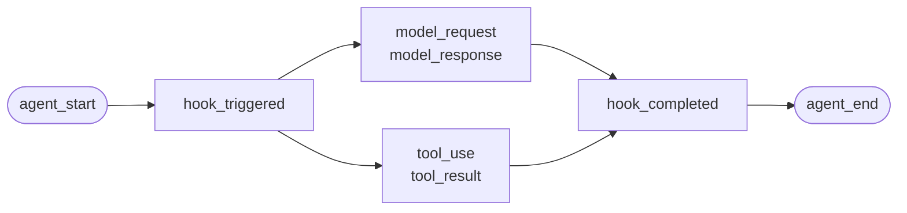
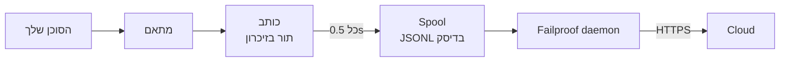

לסוכן שכתבת בעצמך, או לפריימוורק של Failproof AI אין לו מתאם. אין כלום להוסיף: אתה פולט את האירועים.

זה אותו API שארבעת מתאמי הפריימוורק קוראים תחתיו. הם טבלאות תרגום עליו.

## התקנה

```bash
pip install failproofai-sdk
```

ללא תוספים, וללא תלויות.

## הוספת מעקב

```python
import failproofai_sdk

failproofai_sdk.configure(environment="production")

with failproofai_sdk.session():                 # הרצה אחת
    with failproofai_sdk.agent("planner"):      # יחידת עבודה אחת
        with failproofai_sdk.tool_call("search", input={"q": q}) as t:
            t.output = search(q)                # קריאת כלי אחת
```

קרא זאת מלמעלה למטה והיא אומרת מה זה אומר:

| עטוף אותו ב | כדי לומר |
| --- | --- |
| `session()` | האירועים הללו שייכים לאותה הרצה |
| `agent()` | משהו עושה עבודה — תן לו שם שהיית מזהה ברשימה |
| `tool_call()` | זהו כלי אחד, וזה מה שהוא החזיר |

ומה כל אחד מהם למעשה פולט:

| טווח | פולט | מטרה |
| --- | --- | --- |
| `session()` | כלום | קושר מזהה session, ומקבץ הרצה אחת |
| `agent()` | `agent_start`, `agent_end` | תוחם יחידת עבודה |
| `tool_call()` | `tool_use`, `tool_result` | תוחם כלי אחד ומודד אותו |

הכל בתוך יכול להשמיט `session_id` ו-`agent_id`. הטווחים קושרים זהות על משתנות context ותוך כל קריאת event היא קוראת אותה חזרה, כך שאתה אף פעם לא מחליק מזהים דרך הפונקציות שלך.

כל השלושה עובדים תחת `async with` כמו גם תחת `with`.

קינון סוכנים בונה את העץ. `parent_id` והעמוק מחושבים מהערימה:

```python
with failproofai_sdk.session():
    with failproofai_sdk.agent("supervisor"):
        with failproofai_sdk.agent("researcher"):    # parent_id = "supervisor"
            ...
```

## כיצד טווח סוגר

`agent()` מטפל בחריגות עבורך:

| מה קרה | אירועים | תוצאה |
| --- | --- | --- |
| כלום לא הוגבה | `agent_end` | `success` |
| `Exception` | `error`, ואז `agent_end` | `failed` |
| `KeyboardInterrupt`, `SystemExit` | `error`, ואז `agent_end` | `failed` |
| `CancelledError`, `GeneratorExit` | `agent_end` בלבד | `cancelled` |

השגיאה פלטת לפני `agent_end`, כי הדashboard סוגר את ה-span ב-`agent_end` וכל דבר אחרי זה מיוחס לכלום. ביטול אינו כשל, כך שהרצות מבולות לא מזוהמות על משטח השגיאות. החריגה תמיד מוגבה מחדש: טווח אף פעם לא בולע.

## שיטות האירוע

חמש עשרה שיטות בשש משפחות. רובן מגיעות בזוגות — אתה פולט את הפותח, ואז את הסוגר, והSDK מודד את ה-span ביניהם.

| משפחה | פותח | סוגר | עצמאי |
| --- | --- | --- | --- |
| **סוכנים** | `agent_start` | `agent_end` | — |
| | `agent_pause` | `agent_resume` | — |
| **מודלים** | `model_request` | `model_response` | — |
| **כלים** | `tool_use` | `tool_result` | — |
| **וו (Hook)** | `hook_triggered` | `hook_completed` | — |
| **בני אדם** | `human_wait` | `human_input` | `human_pause`, `human_interrupt` |
| **כשלים** | — | — | `error` |

<Tip>
  העדף את הטווחים — `agent()` ו-`tool_call()` — בכל מקום שהם מתאימים. הם מבטיחים את אירוע הסיום גם כאשר הגוף מגביל. פנה לשיטות אלה ישירות כאשר זרימת הבקרה שלך לא קינה, כמו קריאה למודל בתוך עוזר.
</Tip>

<CodeGroup>
```python סוכנים
failproofai_sdk.event.agent_start(agent_id="planner", goal="find the cheapest flight")
failproofai_sdk.event.agent_end(agent_id="planner", outcome="success", summary="...")
failproofai_sdk.event.agent_pause(pause_id="p1", reason="awaiting approval")
failproofai_sdk.event.agent_resume(pause_id="p1")
```

```python מודלים
failproofai_sdk.event.model_request(
    model="gpt-4o-mini",
    messages=[{"role": "user", "content": "..."}],
    request_id="req-1",
)
failproofai_sdk.event.model_response(
    model="gpt-4o-mini",
    content="...",
    input_tokens=139,
    output_tokens=21,
    request_id="req-1",
    duration_ms=5202,
)
```

```python כלים
failproofai_sdk.event.tool_use(tool_name="search", tool_call_id="c1", input={"q": "..."})
failproofai_sdk.event.tool_result(tool_name="search", tool_call_id="c1", output="...")
```

```python וו
failproofai_sdk.event.hook_triggered(hook_name="retrieve", hook_id="h1", trigger_event="node")
failproofai_sdk.event.hook_completed(hook_name="retrieve", hook_id="h1", outcome="success")
```

```python בני אדם
failproofai_sdk.event.human_wait(input_id="i1", prompt="Approve?", options=["yes", "no"])
failproofai_sdk.event.human_input(input_id="i1", response="yes")
failproofai_sdk.event.human_pause(reason="operator paused the run", user_id="dana")
failproofai_sdk.event.human_interrupt(reason="operator stopped the run", at_step="step_3")
```

```python כשלים
failproofai_sdk.event.error(
    error_type="TimeoutError",
    message="provider timed out after 30s",
    traceback="...",
)
```
</CodeGroup>

<Note>
  **שתי משפחות בני אדם מצביעות בכיוונים מנוגדים.**

  | שיטות | משמעות |
  | --- | --- |
  | `human_wait` / `human_input` | **הסוכן שאל אדם** — שער אישור, שאלה הבהרה |
  | `human_pause` / `human_interrupt` | **אדם פעל על הסוכן** — כפתור עצור, השהיית מפעיל |

  אף פריימוורק לא משדר את הזוג השני, כך שתמיד שלך להפליט.
</Note>

<Warning>
  **עבור `request_id` כאשר קריאות מודל פועלות במקביל.** בלעדיו, בקשות ותגובות מתזווגות בסדר הגעה לכל סוכן — וקריאות מקבילות מתזווגות בצורה שגויה, ומצרפות כל תגובה לבקשה הלא נכונה.
</Warning>

## דוגמה

לולאת קריאת כלי כנגד ה-OpenAI API, ללא פריימוורק סוכנים:

```python
import json

import failproofai_sdk
from openai import OpenAI

failproofai_sdk.configure(environment="production")
client = OpenAI()
MODEL = "gpt-4o-mini"


def turn(messages: list):
    """קריאה מודל אחת, תוחומה בזוג."""
    failproofai_sdk.event.model_request(model=MODEL, messages=messages)
    reply = client.chat.completions.create(model=MODEL, messages=messages, tools=TOOLS)
    usage = reply.usage
    failproofai_sdk.event.model_response(
        model=MODEL,
        content=reply.choices[0].message.content or "",
        input_tokens=usage.prompt_tokens,
        output_tokens=usage.completion_tokens,
    )
    return reply.choices[0].message


with failproofai_sdk.session():
    with failproofai_sdk.agent("inventory", goal="price report"):
        for _ in range(4):          # bounded; an unbounded agent loop is its own bug
            message = turn(messages)
            if not message.tool_calls:
                break
            messages.append(message.model_dump(exclude_none=True))
            for call in message.tool_calls:
                args = json.loads(call.function.arguments or "{}")
                with failproofai_sdk.tool_call(
                    call.function.name, tool_call_id=call.id, input=args
                ) as handle:
                    handle.output = run_tool(call.function.name, args)
                messages.append({
                    "role": "tool",
                    "tool_call_id": call.id,
                    "content": str(handle.output),
                })
```

זה מייצר את אותם ששת סוגי אירוע שמתאם היה נותן לך. הגרסה הרצה המלאה, עם הגדרות הכלים, משפנה ב-SDK repository תחת
`docs/manual/examples/`.

## חוטים ו-async

משתנות context מתפשטות לתוך asyncio tasks באופן אוטומטי. הן לא מתפשטות לתוך חוטים חדשים, כי חוט מתחיל עם context ריק.

```python
# asyncio: כלום לא לעשות
async with failproofai_sdk.session():
    await asyncio.gather(worker(1), worker(2))

# threads: עטוף את ה-callable
pool.submit(failproofai_sdk.propagate(work), x)
threading.Thread(target=failproofai_sdk.propagate(work)).start()
loop.run_in_executor(None, failproofai_sdk.propagate(work), x)
```

ללא `propagate()`, אירועי העובד מגבילים `TypeError` ששם את התיקון במקום נחיתה ללא session. זה כוונתי: אירוע ללא session מדולל על ידי ingest וענות `200`, שזה הכשל שקט שלנו שה-identity layer קיים כדי למנוע.

## הוסף מעקב לפריימוורק ללא מתאם

כל סוכן פריימוורק נותן לך את אותם שלושה seams. מפה אותם ויש לך עקבות מלא — ארבעת המתאמים המספקים לא עושים יותר מזה.

| ה-seam | מה שאתה כותב | מה נחיתה |
| --- | --- | --- |
| ה-run | `session()` + `agent()` | `agent_start`, `agent_end` |
| כל כלי | `tool_call()` | `tool_use`, `tool_result` |
| כל קריאת מודל | הזוג `model_*` | `model_request`, `model_response` |

<Steps>
  <Step title="תחום את ה-run">
    ```python
    with failproofai_sdk.session():
        with failproofai_sdk.agent(agent_name, goal=task):
            result = framework.run(task)
    ```
  </Step>
  <Step title="תחום כל כלי">
    בכל מה שהפריימוורק קורא tool wrapper או middleware.

    ```python
    with failproofai_sdk.tool_call(name, input=args) as call:
        call.output = original(**args)
    ```
  </Step>
  <Step title="זווג כל קריאת מודל">
    ```python
    failproofai_sdk.event.model_request(model=model, messages=messages)
    reply = provider.complete(...)
    failproofai_sdk.event.model_response(
        model=model,
        content=text,
        input_tokens=usage.prompt_tokens,
        output_tokens=usage.completion_tokens,
    )
    ```
  </Step>
</Steps>

<Tip>
  **יש node, step או middleware boundary שחייב להיות נראה?** עטוף אותו בזוג hook — `hook_triggered` / `hook_completed` — לא nested `agent()`. `agent_id` הוא facet low-cardinality, והערך אחד לכל node טובע אותו. Hook spans מתרנדרים בדרך זהה וגם נותנים לך לטנציה לכל node.
</Tip>

<Note>
  **ידני והאוטומטי מרכיבים.** מתאם שנמצא בתוך scope כתוב ביד מצטרף לשיוך זה ומוריש לסוכן זה, כך שאתה מקבל עץ אחד ולא שניים — שימושי כאשר אתה מעביר מסגרת אחת בעצמך לצד אחד בעל תמיכה.
</Note>

<Accordion title="למה אין מתאם AutoGen">
  שתי סיבות, והשלושת ה-seams למעלה הן התשובה לשניהם:

  - `autogen-core` לא תופסת תחזוקה מ-September 2025.
  - AG2 לא חושף נקודת רישום כללית תהליך שווה ערך למשדרים של פריימוורקים אחרים, כך שהוספת מעקב אומר עטיפת כל סוכן בכל אתר בנייה.

  מיפוי ה-seams ביד רושם את אותם אירועים, בדיוק זהה, שמתאם משודר היה עושה.
</Accordion>

## עומק יותר

איך ההקלטה למעשה עובדת. כלום מזה לא נחוץ כדי להתחיל.

<AccordionGroup>

<Accordion title="מה הקלטה נראית כמו, לכל פריימוורק" icon="eye">

לכל הקלטה אותו צורה: span נפתח, עבודה קינה בתוכו, ולכל אירוע פותח יש אירוע סוגר אחד.



ה**זוג** הוא היחידה. כל אירוע סוגר נושא משך זמן SDK מודד מה-opening שלו.

להלן הרצה אמיתית אחת לכל פריימוורק — תפוסה מהדוגמאות שנמצאות עם ה-SDK, שם מודל מנורמל. שים לב כמה חוזר מקריאה יחידה.

<Tabs>
  <Tab title="LangGraph">
    ```text 14 events
     1  +0.000s  agent_start       LangGraph
     2  +0.001s    hook_triggered  agent
     3  +0.002s      model_request   gpt-4o-mini
     4  +3.023s      model_response  gpt-4o-mini · 21 out-tok
     5  +3.024s    hook_completed  agent
     6  +3.024s    hook_triggered  tools
     7  +3.025s      tool_use      word_count
     8  +3.025s      tool_result   word_count · ok
     9  +3.025s    hook_completed  tools
    10  +3.026s    hook_triggered  agent
    11  +3.027s      model_request   gpt-4o-mini
    12  +5.717s      model_response  gpt-4o-mini · 5 out-tok
    13  +5.720s    hook_completed  agent
    14  +5.721s  agent_end         LangGraph · success
    ```

    Nodes הופכים לזוגות hook, כך שאתה מקבל לטנציה לכל node ללא טביעת הרשימה סוכנים.
  </Tab>

  <Tab title="CrewAI">
    ```text 10 events
     1  +0.000s  agent_start       crew
     2  +0.050s    agent_start     analyst · under crew
     3  +0.057s      model_request   gpt-4o-mini
     4  +3.475s      model_response  gpt-4o-mini · 19 out-tok
     5  +3.478s      tool_use      lookup_metric
     6  +3.478s      tool_result   lookup_metric · ok
     7  +3.486s      model_request   gpt-4o-mini
     8  +5.694s      model_response  gpt-4o-mini · 9 out-tok
     9  +5.727s    agent_end       analyst · success
    10  +5.739s  agent_end         crew · success
    ```

    `role` של כל סוכן הופך לשם ה-span שלו, כך שלטנציה ו-token spend מתפרקים לפי תפקיד.
  </Tab>

  <Tab title="LlamaIndex">
    ```text 26 events
     1  +0.000s  agent_start       Agent
     2  +0.001s    hook_triggered  init_run
     4  +0.501s    hook_triggered  setup_agent
     6  +0.503s    hook_triggered  run_agent_step
     7  +0.505s      model_request   gpt-4o-mini
     8  +3.083s      model_response  gpt-4o-mini · 18 out-tok
    10  +3.197s    hook_triggered  parse_agent_output
    12  +3.355s    hook_triggered  call_tool
    13  +3.355s      tool_use      city_population
    14  +3.355s      tool_result   city_population · ok
    16  +3.356s    hook_triggered  aggregate_tool_results
       ...                        second iteration
    26  +7.038s  agent_end         Agent · success
    ```

    לולאת סוכן עצמה נראית, לא רק קריאות המודל שלו.
  </Tab>

  <Tab title="Pydantic AI">
    ```text 8 events
    1  +0.000s  agent_start       agent
    2  +0.001s    model_request   gpt-4o-mini
    3  +4.413s    model_response  gpt-4o-mini · 17 out-tok
    4  +4.415s    tool_use        population
    5  +4.415s    tool_result     population · ok
    6  +4.416s    model_request   gpt-4o-mini
    7  +8.118s    model_response  gpt-4o-mini · 6 out-tok
    8  +8.119s  agent_end         agent · success
    ```

    אין זוגות hook: ל-Pydantic AI אין node או step boundary לתחום.
  </Tab>

  <Tab title="סוכנים מותאמים אישית">
    ```text 6 events
    1  +0.000s  agent_start       main
    2  +0.000s    tool_use        population
    3  +0.000s    tool_result     population · ok
    4  +0.000s    model_request   gpt-4o-mini
    5  +0.000s    model_response  gpt-4o-mini · 3 out-tok
    6  +0.000s  agent_end         main · success
    ```

    אתה פולט אלה בעצמך. אותם סוגי אירוע, דיוק זהה — זה עולה לך לאתרי קריאה.
  </Tab>
</Tabs>

</Accordion>

<Accordion title="איך session מתחיל ומסתיים" icon="circle-play">

**אין אירוע session-end.** session אינה משהו שאתה סוגר — היא קבוצה של אירועים השיתוף `session_id`.

סטטוס נגזר מצורת העקבות:

| סטטוס | מתי |
| --- | --- |
| `ongoing` | לפחות span אחד עדיין פתוח |
| `paused` | `agent_pause` אין לו matching `agent_resume` |
| `error` | כלום לא פתוח, ולפחות אירוע אחד נכשל |
| `done` | כלום לא פתוח, וכלום לא נכשל |

כך שsession מסתיים כאשר כל זוג סוגר. המתאמים פולטים `agent_end` עבורך, והם סוגרים כל דבר עדיין פתוח ומסימנים אותו לא שלם — הרצה קרוסה מתפזרת כ-`done` עם פער גלוי במקום תלויה לנצח.

<Note>
  זה למה session יכול להקיף שתי קריאות. LangGraph `interrupt()` השהה את ה-run, ה-root span בכוונה נשאר פתוח, והקריאה הממשיכה סוגרת אותה. שתי הקריאות הן session אחד.
</Note>

</Accordion>

<Accordion title="זהות: session_id, agent_id, והמי חושב אותם" icon="fingerprint">

`session_id` ו-`agent_id` הם אופציונליים בכל שיטת event. בהשמטה, הם מתפזרים מהטווח שוקע:

```python
with failproofai_sdk.session():
    with failproofai_sdk.agent("planner"):
        failproofai_sdk.event.tool_use(tool_name="search", tool_call_id="c1")
```

העברתם בגלוי עדיין עובדת ולוקחת עדיפות. ללא כלום קשור וכלום עברר, הקריאה מגבילה `TypeError` שם את התיקון במקום הפקת אירוע ללא session, אשר ingest היה דלל תוך התשובה `200`.

טווחים קושרים זהות על משתנות context. אלה מתפשטות לתוך asyncio tasks באופן אוטומטי אך לא לתוך חוטים חדשים — עטוף עובד ב-`failproofai_sdk.propagate()`.

#### מי חושב איזה id

| Id | חשוב על ידי | הערות |
| --- | --- | --- |
| `session_id` | אתה, או ה-SDK | `session("chat-42")` משמש verbatim; בהשמטה, SDK מייצר `uuid4().hex` |
| `agent_id` | אתה, או הפריימוורק | מ-`agent("analyst")`, CrewAI `role`, `FunctionAgent.name`. ערך דומה UUID נדחה והחלפה |
| `tool_call_id`, `hook_id`, `request_id` | אתה, או הפריימוורק | מתאמים מחדשים שימוש ב-framework's שלהם run ids, שזה למה זוגות שורדים thread hops |
| **Event id** | **Cloud, ב-ingest** | ה-SDK לא פולט |
| **`dedup_key`** | **Cloud, ב-ingest** | hash של org, session, timestamp, type ו-payload. זאת הזהות האמיתית — היא גורמת batch שנו נסכל בקריסה במקום כפול |

#### איך מתאמים מתפזרים `session_id`

תאימה ראשונה זוכה:

1. ערך `session_id` מפורש
2. metadata לכל קריאה
3. טווח `session()` שוקע
4. framework metadata
5. framework's שלהם run id

זה אף פעם לא המצוי בזמן אחד מאלה קיים — id סינתטי היה מפלג הרצה אחת על פני מספר sessions.

#### שמור `agent_id` low cardinality

זה ה-facet ראשי בכל משטח dashboard, ו-`LowCardinality(String)` כולונה. ערך לכל run מורידה את הכולונה ומלאה את ה-filter dropdown בערך אחד לכל run.

מתאמים בטחון כולונה זו עבורך:

| הפריימוורק מוביל על | הוקלט כ | למה |
| --- | --- | --- |
| `3f9a1c2b-…` (UUID) | `main` | כלום קריא לשמור |
| hex ארוך חשוף string | `main` | זהה |
| `agent-3f9a1c2b-…` | `agent` | לכל run id חשוף, ible part שמור |
| `agent-v2` | `agent-v2` | קטגוריה קצרה משומרת |
| `step-3` | `step-3` | זהה |

ה-ID האמיתי שמור ב-`fw_agent_id` / `fw_run_id`, איפה זה נשאר queryable ללא להיות facet.

<Warning>
  **שמירה זו רק נוגעת בתוויות **הפריימוורק** בחר.** `agent_id` אתה עבור עצמך — ל-`event.*`, או ל-`failproofai_sdk.agent(...)` — הוקלט בדיוק כנתון. שמאלה כתוב argument מפורש היה גרוע יותר מה-cardinality זה מנע, כך שקרא את הspan שלך בהתאם.
</Warning>

</Accordion>

<Accordion title="סוגי אירוע, מקובצים — וריימוורק איזה רשום מה" icon="table">

| קבוצה | אירועים |
| --- | --- |
| סוכנים | `agent_start`, `agent_end`, `agent_pause`, `agent_resume` |
| מודלים | `model_request`, `model_response` |
| כלים | `tool_use`, `tool_result` |
| וו | `hook_triggered`, `hook_completed` |
| בני אדם | `human_wait`, `human_input`, `human_pause`, `human_interrupt` |
| כשלים | `error` |

איזה פריימוורק רושם מה, נמדד מה-runs למעלה:

| אירוע | LangGraph | CrewAI | LlamaIndex | Pydantic AI | מותאם אישית |
| --- | :--: | :--: | :--: | :--: | :--: |
| תחילת וסוף סוכן | כן | כן | כן | כן | אתה |
| בקשת מודל ותגובה | כן | כן | כן | כן | אתה |
| שימוש בכלי ותוצאה | כן | כן | כן | כן | אתה |
| וו מתוגבר וסיום | Node | משימה | Step | — | אתה |
| שגיאה | כן | כן | כן | כן | אוטומטי |
| חכיית אדם וקלט | כן | כן | כן | — | אתה |
| השהיית סוכן וחידוש | כן | כן | כן | — | אתה |

dash פירושו הפריימוורק אין לו כזה קונספט. `human_pause` ו-`human_interrupt` תארו **אדם** פועל על סוכן, אשר אף פריימוורק משדר — הפלוט אלה בעצמך.

</Accordion>

<Accordion title="זוגות, קורלציה ומשך זמן" icon="link">

אירוע אף פעם לא מגיע בודד. אחד פותח span, אחד סוגר אותו, ואירוע הסיום נוצא משך זמן SDK מודד מה-opening.

| פותח | סוגר | אירוע הסיום נוצא |
| --- | --- | --- |
| `agent_start` | `agent_end` | `outcome`, `summary` |
| `model_request` | `model_response` | tokens, `stop_reason`, latency |
| `tool_use` | `tool_result` | `output` או `error`, duration |
| `hook_triggered` | `hook_completed` | `outcome`, duration |
| `agent_pause` | `agent_resume` | כמה זמן ההשהיה נמשכה |
| `human_wait` | `human_input` | התשובה, וכמה זמן האדם לקח |

<Warning>
  אירוע פותח ללא סוגר אחד הוא span שלא סיים. השיוך מתרנדר כעדיין פעיל, לנצח, וה-active duration שלו ממשיך לגדול. זה כשל mode לצפות בו כאשר אתה מוסיף מעקב ביד.
</Warning>

#### כללי קורלציה

- חזור על אותו `tool_call_id`, `hook_id`, `pause_id`, או `input_id` לאירוע השלמה תואם.
- SDK מחשבות `duration_ms` לכל `tool_result`, `hook_completed`, `agent_resume`, ו-`human_input`. עברור אותו הודעות raises `ValueError`.
- `duration_ms` **הוא** קבול ב-`model_response`, כי רק ה-caller יודע ה-real provider latency. זה חייב להיות integer — float raises `ValueError` בקריאה site, כי השרת קורא את הכולונה כ-unsigned 32-bit integer וחנה NULL לכל דבר אחר.
- מפתחות קורלציה בטוח לפי סוג וsession, אז tool call ו-hook עשוי בטוח שיתוף id, וsessions מקבילות שני חזור על אותם ids ללא התנגשות. הם לא בטוח על ידי סוכן: זוג פתוח תחת סוכן אחד וסגור תחת אחר עדיין קורלציה, שהיא המקרה הרגיל במסגרות רב סוכנים.
- `request_id` זוגות `model_request` עם `model_response`. ללא אותו, אירועי מודל זוג בסדר לכל סוכן, כך קריאות מקבילות mispair.
- זוג פיצול על פני processes עדיין קורלציה downstream, אך SDK לא יכול לחשב in-process duration.
- מפת pending מחזיקה לכל היותר 10,000 starts ו-evicts ערך עתיק כאשר מלא.

</Accordion>

<Accordion title="מה בחבילה, ואיך instrument() מוצא הפריימוורק שלך" icon="box">

התקנת `failproofai-sdk` מתקנת הכל, כל ארבעת המתאמים כלול. ה-extras משדרים את **הפריימוורק**, לא את המתאם.

```python
import failproofai_sdk        # עומס כלום חוץ מה-standard library
failproofai_sdk.instrument()  # ייבוא רק המתאמים אתה בעצם צריך
```

`import failproofai_sdk` הוא חוזה אפס תלויות, אינפורמציה על ידי בדיקה שמתקנת את הגלגלון עם `--no-deps` ועוד שמוכיח אף פריימוורק מגיע ל-`sys.modules`.

<Warning>
  אין `failproofai_sdk.crewai` תכונה. מתאמים בכוונת לא חשוף על הפרה עליונה חבילה: לוגע אחד היה ייבוא הפריימוורק כ-side effect של גישה תכונה, שבירת אפס תלויות הבטחה. השתמש `instrument()`.
</Warning>

```python
failproofai_sdk.instrument()              # כל פריימוורק כבר ייובא
failproofai_sdk.instrument("crewai")      # בדיוק אחד, לפי שם
failproofai_sdk.uninstrument("crewai")    # שים חזרה
```

| שם | גם קבול |
| --- | --- |
| `langchain` | `langgraph`, `langchain_core` |
| `crewai` | — |
| `llama_index` | `llamaindex`, `llama-index` |
| `pydantic_ai` | `pydantic-ai`, `pydanticai` |

גילוי אוטומטי קורא `sys.modules`, לא את רשימת חבילה מותקנת, אז פריימוורק שיש לך מותקן אבל אף פעם לא ייבוא הוא לא מוכן והוא אף פעם לא ייובא בשמך. להראות מה חווט למעלה:

```python
from failproofai_sdk.integrations import active, available

available()   # ('crewai', 'langchain', 'llama_index', 'pydantic_ai')
active()      # ('langchain',)
```

<Note>
  **`instrument("crewai")` על מכונה ללא CrewAI לא מגביל.** זה עוקב אזהרה ו-return `()`, אז פריימוורק חמיץ אף פעם לוקח תהליך שגם מהמרות אחרים.

  האזהרה נוצא ה-`ImportError` בקדמה, וזה הודעה שם את פקודת התקנה מדויקת — כך התיקון בלוגים שלך, לא מוסתר.

  ```text
  ImportError: failproofai_sdk: cannot instrument 'crewai' because 'crewai.events'
  is not importable. Install it with:  pip install 'failproofai_sdk[crewai]'
  ```

  ערכה `FAILPROOFAI_SDK_STRICT=1` כדי יש לו מגביל במקום. זה דגל קורא **פעם אחת ו-cached**, אז ייצוא זה לפני התהליך מתחיל במקום קביעה mid-run.
</Note>

<Warning>
  **`instrument()` חייב לבוא **אחרי** ייבוא הפריימוורק שלך.** גילוי אוטומטי קורא `sys.modules`, אז קריאה ערומה מעל הייבוא מוצא כלום, מתקן כלום, וחוזר `()`.
</Warning>

<CodeGroup>
```python שגוי
import failproofai_sdk
failproofai_sdk.instrument()   # sys.modules אין langchain עדיין -> ()

import langchain               # מאוחר מדי, כלום לא חווט
```

```python נכון
import langchain               # ייבוא הפריימוורק ראשון
import failproofai_sdk

failproofai_sdk.instrument()   # מוצא זה -> ('langchain',)
```

```python נכון, order-proof
import failproofai_sdk

# שם זה ייבוא את המתאם על בקשה, אז זה עובד מכל מקום.
failproofai_sdk.instrument("langchain")
```
</CodeGroup>

קבל את זה שגוי והתהליך פועל עם ה-SDK ייובא, המתאם לכאורה מותקן, ו**לא אירוע אחד פלט**. זה עוקב אזהרה אומר בדיוק זה — אז בדוק לוגים ראשון כאשר run רושם כלום.

</Accordion>

<Accordion title="איך אירועים מגיעים Cloud" icon="cloud-upload">



| שלב | משימה | פועל בתוך |
| --- | --- | --- |
| מתאם | תרגם callback פריימוורק לתוך אחד מ-15 סוגי אירוע | התהליך שלך |
| כותב | תור, אצווה, כתיבה JSONL אטומית | התהליך שלך, חוט רקע |
| Spool | Durable handoff, שורד התהליך יציאה | דיסק מקומי |
| Daemon | שומר spool, משלח אצוות, מוחק מה-shipped | המכונה שלך |
| Ingest | מקצה שורה id ו-dedup key, מקדם שאלה כולוניות | Cloud |

ה-spool הוא מה עושה זה בטוח: סוכן שלך אף פעם לא חסום על הרשת, וCloud outage אומר ספריה גדלה במקום קביעה אירועים.

כל flush כתוב קובץ אצווה אחד, `.tmp` ראשון, ואז `fsync`, ואז atomic rename:

```text
~/.failproofai/custom-agents/events/
  event-2026-08-20T10-15-00-123Z-48213-0.jsonl
```

ה-daemon רק עוזב `.jsonl`, אז זה לא יכול אף פעם קרא חצי כתוב קובץ. הגזע נוצא timestamp, process id וסדר מספר, אז שני תהליכים flush בה-millisecond לא יכול להתנגש. התור כובל בחסום 10,000 אירועים; העבר זה זה טיפל הוקדם וrelog.

<Warning>
  **`collector.redact` עושה לא חל ל-SDK אירועים שלך.** זה אף פעם לא רואה אותם.
</Warning>

ה-daemon **משלח** אצוות שלך. זה לא פתוח או לשכתב אותם.

| אירועים | כתוב על ידי | Redacted על ידי `collector.redact`? |
| --- | --- | --- |
| CLI session תחקירי | Daemon | כן |
| וו פעילות | Daemon | כן |
| **הכל ה-SDK פלט** | **התהליך שלך** | **לא** |

Redaction פועל איפה ה-daemon **כתוב** שלהם אירועים — לא איפה אצוות **משודרים**. כך prompt או tool argument מחזיק API key עדיין מחזיק זה בהגעה.

זה כוונתי. אלה בעצמך מעקב קריאות, וכתיבה מחדש בטרנזיט יומר את אירועים אתה קבל הם לא אירועים אתה פלט.

<Tip>
  **אתה שלוט בפעילויות ב-source, בשני מקומות:**

  - כבה לכידת תוכן על המתאם. **שם אפשרות שונה, ומתאם אחד אין אחד** — זה לא אחד כללי אוניברסלי מתג:
    - LangChain / LangGraph, Pydantic AI — `capture_content=False`
    - LlamaIndex — `capture_messages=False`
    - CrewAI — **אין מתג תוכן בכל**; `session_id` היא רק אפשרות שהיא קורא, אז prompts ו-completions תמיד רשום.

    `instrument()` טיול אפשרויות מתאם לא קורא, אז עברור שם שגוי מגביל כלום ושינויים כלום.
  - אל תעביר את הסוד ל-`input=` בראשון מקום.

  `collector.redact` הוא לא תחליף לאף אחד מאלה.
</Tip>

<Warning>
  **ספריה spool ריקה היא המדינה הבריאה.** אל תשתמש בזה כדי בדוק משלוח.
</Warning>

ה-daemon מוחק כל אצווה בתוך milliseconds משליחה, אז `ls` מרוצים collector וש fraction של מה אתה פלט — לא ניתנת להבחנה מ-SDK ש קיבוץ כלום.

לאשר אירועים באמת נחתו, בדוק את ה-dashboard. לצפות ה-spool תמלא, עצור את ה-daemon ראשון.

</Accordion>

<Accordion title="כאשר מעקב נכשל" icon="triangle-alert">

כל callback פועל בתוך wrapper שלה יחידה משימה היא להגביל מחדש, אז קריאה שלך יושבת בדיוק אחד `try` והכל SDK עושה קורה מחוץ אותה.

| מה קורה | תוצאה |
| --- | --- |
| hook מגביל | עיתון פעם עם traceback. קריאה שלך לא השפעה |
| אותו hook מגביל שלוש פעמים | זה hook אחד משוביץ לנו התהליך, עם שורה טעות אחד |
| `FAILPROOFAI_SDK_STRICT=1` הוא קביעה | החריגה הוא re-raised במקום |
| פריימוורק גרסה חוץ בדוקו טווח | הזהרות פעם, מהמרות בכל זאת |
| יחיד יכולת היא חמיץ | זה חוק אחד משוביץ, אף פעם כל מתאם |

ה-default הוא ימין בייצור וחצי בזמן debug, כי זה יכול רק אי פעם הוכח אתה לא קרס. קביעה `FAILPROOFAI_SDK_STRICT=1` לעשות בוליט כשל קול.

</Accordion>

</AccordionGroup>

## בעיות נפוצות

<AccordionGroup>
  <Accordion title="span לא סיים">
    אירוע פותח אין אחד סוגר: `model_request` ללא `model_response`, או `tool_use` ללא `tool_result`. השתמש הטווחים, אשר ערובה הזוג אפילו כאשר הגוף מגביל. אם אתה קורא את שיטות האירוע ישירות, השתמש `try` ו-`finally`.
  </Accordion>

  <Accordion title="עברור duration_ms מגביל ValueError">
    זה נמדד מה-opening תואם אירוע, אז זה דחוי ב-`tool_result`, `hook_completed`, `agent_resume`, ו-`human_input`. זה קבול ב-`model_response`, כי רק אתה יודע ה-real provider latency, וזה חייב להיות integer.
  </Accordion>

  <Accordion title="אירועים מעובד חוט מגביל TypeError">
    החוט לא אף פעם inherited ה-context. עטוף את ה-callable ב-`failproofai_sdk.propagate()`. ראה [חוטים ו-async](#threads-and-async).
  </Accordion>

  <Accordion title="שדה תוספת נעלם או כתוב על משהו">
    שדות תוספת מיזוג אחרון, אז אחד שנקרא כמו שדה אמיתי כמו `model` או `outcome` היה כתוב על זה ו-שינוי כלונה שמור. Namespace שלך; המתאמים משתמשים `fw_` קידומת.
  </Accordion>

  <Accordion title="סוכן filter יש אלפים of entries">
    `agent_id` היא low-cardinality facet ו-אתה שים run id בזה. השתמש תפקיד או node שם ו-שים ה-ID אמיתי בשדה payload.
  </Accordion>
</AccordionGroup>

## הבא

<Columns cols={3}>
  <Card title="איך זה עובד" icon="workflow" href="/he/reference/custom-agents">
    זוגות, ids, session lifecycle, ו-delivery.
  </Card>
  <Card title="קרא trace" icon="route" href="/he/sessions/read-a-trace">
    עקוב סיבתיות דרך ה-session אתה רק תפוסה.
  </Card>
  <Card title="מתאמי פריימוורק" icon="plug" href="/he/start/integrations">
    LangGraph, CrewAI, LlamaIndex, ו-Pydantic AI.
  </Card>
</Columns>