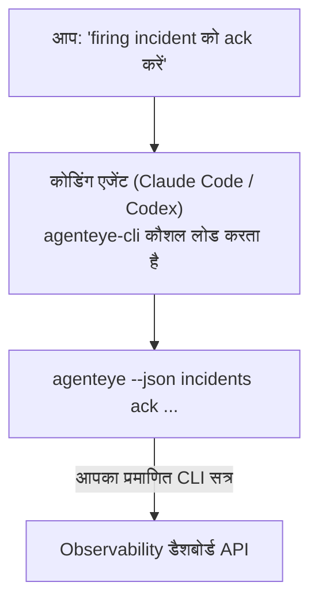

अपने कोडिंग एजेंट से *"क्या आज कुछ टूटा है?"* पूछें और इसे अपने लाइव Failproof AI Observability डेटा से जवाब पाएं, कोई कमांड याद रखने की जरूरत नहीं। **Failproof AI Observability CLI skill** (`agenteye-cli`) एक *Agent Skill* है: निर्देशों का एक छोटा फोल्डर जिसे Claude Code या Codex जैसा कोडिंग एजेंट आवश्यकतानुसार लोड करता है। यह एजेंट को [`agenteye` CLI](/hi/agenteye/cli) के माध्यम से आपकी Observability deployment को संचालित करना सिखाता है, साधारण अंग्रेजी अनुरोधों से जैसे *"CI को एक कुंजी दें जो केवल इवेंट्स पुश कर सके"* या *"फायरिंग इंसिडेंट को स्वीकार करें और इसे मुझे असाइन करें।"*

यह **नहीं** है एक सेवा या अलग बाइनरी; इसे तैनात करने के लिए कुछ नहीं है। यह आपके द्वारा पहले से इंस्टॉल की गई CLI के शीर्ष पर चलता है: एजेंट `agenteye --json …` के लिए शेल आउट करता है, स्वच्छ JSON को पार्स करता है, और आपको गद्य में जवाब देता है। जो कुछ भी यह कर सकता है, आप स्वयं उन्हीं कमांड्स को टाइप करके कर सकते हैं।

---

## यह अन्य Failproof AI Observability इंटरफेस से कैसे संबंधित है

Failproof AI Observability आपको एक ही डेटा और नियंत्रण तक पहुंचने के लिए चार तरीके देता है। वे एक दूसरे को पूरक करते हैं:

| इंटरफेस | यह क्या है | यह कहां चलता है | इसे तब प्राप्त करें जब |
|---|---|---|---|
| **[CLI](/hi/agenteye/cli)** | `agenteye` के लिए कमांड/फ्लैग संदर्भ | आपका टर्मिनल | आप एक विशिष्ट कमांड चलाना या स्क्रिप्ट करना चाहते हैं |
| **[CLI recipes](/hi/agenteye/cli-recipes)** | कॉपी-पेस्ट `jq`/पाइपलाइन पैटर्न | आपका टर्मिनल / स्क्रिप्ट्स | आप CLI को ऑटोमेशन में वायर कर रहे हैं |
| **CLI skill** (यह दस्तावेज़) | CLI पर एक प्राकृतिक-भाषा फ्रंट दरवाज़ा | आपका कोडिंग एजेंट, आपके वर्कस्टेशन पर | आप *बस पूछना* चाहते हैं और एजेंट को कमांड चुनने दें |
| **[Evaluator skill](/hi/agenteye/evaluator-skill)** | एक बहन कौशल जो आपकी स्कोरिंग सेवा डिजाइन और बनाता है | आपका कोडिंग एजेंट, आपके वर्कस्टेशन पर | आप eval स्कोर्स *उत्पादित* करना चाहते हैं न कि उन्हें पढ़ना |
| **[Python SDK skill](/hi/agenteye/python-sdk-skill)** | एक बहन कौशल जो आपके एजेंट को इंस्ट्रूमेंट करता है ताकि यह सभी पर टेलीमेट्री उत्सर्जित करे | आपका कोडिंग एजेंट, आपके वर्कस्टेशन पर | आप अपने एजेंट को *उत्पादित* करना चाहते हैं इवेंट्स जो यह कौशल पढ़ता है |
| **[In-dashboard AI assistant](/hi/agenteye/assistant)** | डैशबोर्ड में एम्बेड किया गया चैट | सर्वर-साइड (डैशबोर्ड में) | आप अपने डेटा पर इन-डैशबोर्ड Q&A चाहते हैं |

कौशल के पास अपने आप में कोई विशेषाधिकार नहीं है; यह सिर्फ आपके शब्दों को CLI कॉल्स में बदलता है जो आप के रूप में चलते हैं:



### in-dashboard AI assistant बनाम: एक महत्वपूर्ण अंतर

ये बहुत अलग-अलग ब्लास्ट त्रिज्या वाले दो अलग-अलग उपकरण हैं:

- **in-dashboard AI assistant** ([AI assistant](/hi/agenteye/assistant)) डैशबोर्ड में एम्बेड किया गया एक चैट है, एजेंट सेवा द्वारा समर्थित। यह **केवल-पढ़ने वाला प्लस अनुमोदन-गेटेड ऑथरिंग** है: यह सहेजे गए क्वेरी और डैशबोर्ड ड्राफ्ट कर सकता है, लेकिन हर लिखना आपकी स्पष्ट क्लिक-अनुमोदन के लिए रुकता है, और यह कभी नहीं हटाता। यह `agent:use` अनुमति द्वारा गेटेड है और केवल उस org के लिए डेटा देखता है जिसे आप देख रहे हैं।
- **CLI कौशल** आपके *workstation* पर आपके *coding agent* के अंदर चलता है और `agenteye` CLI को **आप** के रूप में चलाता है। यह CLI की **पूरी सतह, म्यूटेशन सहित** (API कुंजियां बनाएं/घुमाएं/अक्षम करें, org सेटिंग्स बदलें, इंसिडेंट्स को resolve करें, सहेजी गई क्वेरी हटाएं) निष्पादित कर सकता है, केवल आपकी CLI लॉगिन की अनुमति द्वारा बाध्य है। इसे ठीक उसी तरह ट्रीट करें जैसे आप उन कमांड्स को हाथ से चलाना चाहते हैं।

---

## पूर्वापेक्षाएं

1. **`agenteye` CLI इंस्टॉल** और `PATH` पर ([CLI](/hi/agenteye/cli) संदर्भ देखें: `pipx install agenteye`)।
2. आपका **डैशबोर्ड URL सेट** (`AGENTEYE_DASHBOARD_URL`, या एजेंट `--base-url` पास करता है)।
3. एक **लॉगिन किया गया सत्र**: पहले स्वयं `agenteye login` चलाएं। कौशल **नहीं** कर सकता ईमेल किए गए वन-टाइम-कोड लॉगिन को आपके लिए पूरा करना; यह आपको `agenteye login` चलाने के लिए कहेगा यदि सत्र गायब या समाप्त है (CLI exit कोड `4`)।

---

## इसे कहां प्राप्त करें

कौशल Failproof AI के सार्वजनिक कौशल संग्रह में प्रकाशित है:

**[github.com/FailproofAI/skills](https://github.com/FailproofAI/skills)** → [`skills/agenteye-cli/`](https://github.com/FailproofAI/skills/tree/main/skills/agenteye-cli)

इसके बारे में कुछ भी गेटेड नहीं है — रिपॉजिटरी सार्वजनिक है और कौशल को अपने स्वयं के प्रमाण-पत्र की जरूरत नहीं है, क्योंकि यह केवल **सार्वजनिक** `agenteye` CLI को आपके डैशबोर्ड के विरुद्ध चलाता है, सत्र का उपयोग करके *आप* लॉगिन किए हुए हैं। आपको किसी से भी इसके लिए पूछने की जरूरत नहीं है।

ध्यान दें कि यह अपने स्वयं के फोल्डर के रूप में शिप करता है और `pipx install agenteye` पैकेज के अंदर **नहीं** है, इसलिए वहां इसे न खोजें।

## कौशल स्थापित करना

सबसे तेज़ रास्ता [`skills`](https://skills.sh) CLI है, जो फोल्डर को फेच करता है और इसे वहां ड्रॉप करता है जहां आपका एजेंट देखता है:

```bash
# Claude Code, केवल यह प्रोजेक्ट
npx skills add FailproofAI/skills --skill agenteye-cli -a claude-code

# हर प्रोजेक्ट (~/.claude/skills/ में इंस्टॉल करता है)
npx skills add FailproofAI/skills --skill agenteye-cli -a claude-code -g --copy

# इसके बजाय Codex
npx skills add FailproofAI/skills --skill agenteye-cli -a codex
```

फिर इसे किसी अन्य कौशल की तरह प्रबंधित करें:

```bash
npx skills list -a claude-code      # क्या इंस्टॉल है
npx skills update agenteye-cli      # नवीनतम संस्करण प्राप्त करें
npx skills remove agenteye-cli      # इसे हटाएं
```

हाथ से इंस्टॉल करना पसंद करते हैं? एक Agent Skill केवल एक `SKILL.md` (साथ ही optional संदर्भ) युक्त फोल्डर है, इसलिए इसे कॉपी करना काम करता है:

- **Claude Code**: `agenteye-cli/` फोल्डर को `~/.claude/skills/` (हर प्रोजेक्ट) या `<your-repo>/.claude/skills/` (केवल उस repo) में रखें। Claude Code इसे auto-discover करता है — `/skills` सूची से सत्यापित करें, या बस ऐसा कोई प्रश्न पूछें जो इसके विवरण से मेल खाए।
- **Codex (OpenAI)**: Codex उसी `SKILL.md` को पढ़ता है। बंडल किया गया `agents/openai.yaml` सेट करता है `allow_implicit_invocation: true`, इसलिए Codex auto-select करता है कौशल जब एक कार्य मेल खाए; अन्यथा इसे स्पष्ट रूप से `$agenteye-cli` के रूप में invoke करें।

---

## सुरक्षा: म्यूटेशन जब एजेंट CLI चलाता है तब प्रॉम्प्ट नहीं करते

> **चेतावनी:** एजेंट को परिवर्तन करने देने से पहले यह पढ़ें।

`agenteye` CLI आमतौर पर एक विनाशकारी कार्य से पहले *"क्या आप सुनिश्चित हैं?"* पूछता है। यह **हमेशा इस पुष्टि को छोड़ देता है जब यह एक टर्मिनल से जुड़ा नहीं होता (जो ठीक है कि कोडिंग एजेंट इसे कैसे चलाता है), और `--json` भी इसे छोड़ देता है।** तो सुरक्षा प्रॉम्प्ट एजेंट के लिए **नहीं** फायर होगा।

कौशल लिखा गया है इसके लिए क्षतिपूर्ति करने के लिए: इसे सटीक कमांड बताने के लिए निर्देश दिया जाता है जो यह चलाएगा और किसी भी स्टेट चेंज से पहले आपकी स्पष्ट **OK** प्राप्त करता है। उस अनुशासन को रखें। जब आप Failproof AI Observability को एजेंट के माध्यम से चलाते हैं, *आप* पुष्टि चरण हैं। स्टेट-परिवर्तन कमांड्स को देखने के लिए:

- `keys create` / `update` / `disable` / `regenerate`
- `users create` / `update` / `disable` / `enable`
- `settings set`
- `alerts create` / `update` / `delete` / `test`
- लिखने वाले `incidents` subcommands: `ack` / `assign` / `resolve` / `open` / `comment-add` / `comment-delete` / `subscribe` / `unsubscribe`
- `query create` / `update` / `delete`
- `agent rename` / `delete`
- `orgs switch`

**Observe** के तहत सब कुछ (`events`, `sessions`, `evals`, `errors`, `list`, `whoami`, `orgs list/current/perms`) केवल-पढ़ने वाला है और कुछ नहीं बदलता है।

क्योंकि एजेंट **आप** के रूप में कार्य करता है, यह केवल वह कर सकता है जो आपकी लॉगिन करने की अनुमति है; अनुमति **प्रति org** हल की जाती है ([API कुंजियां](/hi/agenteye/api-keys) देखें)। एक कमांड जिसके लिए आपके पास अनुमति नहीं है exit कोड `5` देता है सटीक अनुमति के साथ नामित, इसलिए एजेंट आपको बता सकता है कि एक व्यवस्थापक को क्या पूछना है न कि अपारदर्शी रूप से विफल होने के बजाय।

---

## आप इससे क्या पूछ सकते हैं

यहां एक वास्तविक राउंड-ट्रिप दिखता है, एक पढ़ना, फिर एक परिवर्तन जो आपकी OK के लिए प्रतीक्षा करता है:

```text
आप   ▸ क्या पिछले एक दिन में कुछ टूटा है?

एजेंट ▸ चला रहे हैं: agenteye --json errors --since 24h --aggregate
        पिछले 24 घंटों में 3 error प्रकार। सबसे बड़ा है TimeoutError
        (18 hits, सभी checkout-agent पर), फिर RateLimited (5)।
        क्या आप TimeoutError के लिए विफल सत्र चाहते हैं?

आप   ▸ CI को एक कुंजी दें जो केवल इवेंट्स पुश कर सके।

एजेंट ▸ यह एक API कुंजी बनाता है। मैं चलाऊंगा:
          agenteye keys create ci --add events:add
        जारी रखने के लिए ठीक है?

आप   ▸ हां

एजेंट ▸ हो गया। कुंजी "ci" केवल events:add के साथ बनाई गई।
        secret केवल एक बार दिखाया जाता है, इसलिए इसे अभी स्टोर करें। मैं इसे फिर से प्रिंट नहीं कर सकता।
```

कौशल प्रत्येक साधारण-अंग्रेजी इरादे को सही `agenteye` कमांड से मैप करता है, पहले वैध मान खोजते हुए (`list <kind>`, `whoami`) ताकि यह अनुमान न लगाए, और किसी भी परिवर्तन से पहले सटीक कमांड बताते हुए। अधिक उदाहरण:

- *"क्या कुछ टूटा है / पिछले 24 घंटों में विफल हो रहा है?"* → `errors --since 24h --aggregate`, फिर एक breakdown।
- *"सत्र `run-001` विफल क्यों हुआ?"* → `events --session-id run-001 --all` + `evals --session-id run-001`।
- *"गुणवत्ता इस सप्ताह कैसे ट्रेंड कर रही है?"* → `evals --aggregate --since 7d`, फिर कम-स्कोरिंग रन को ड्रिल करें।
- *"CI को एक कुंजी दें जो केवल इवेंट्स पुश कर सके।"* → `keys create ci --add events:add` (यह कमांड बताता है, फिर इसे बनाता है और वन-टाइम secret को कैप्चर करता है)।
- *"किसके पास एक्सेस है? Dana को read-only बनाएं।"* → `users list` → `users update dana@… --permission-set read-only` (आपके साथ पुष्टि के बाद)।
- *"Firing incident को ack करें और इसे मुझे असाइन करें।"* → `incidents list --state firing` → `incidents ack <id>` / `incidents assign <id> you@…`।

सटीक कमांड्स, फ्लैग्स, और इन के पीछे JSON shapes के लिए, [CLI](/hi/agenteye/cli) संदर्भ और [एजेंट्स के लिए CLI recipes](/hi/agenteye/cli-recipes) देखें।

---

## अगले कदम

- **[CLI](/hi/agenteye/cli)**: `agenteye` के लिए पूर्ण कमांड और फ्लैग संदर्भ।
- **[एजेंट्स के लिए CLI recipes](/hi/agenteye/cli-recipes)**: कॉपी-पेस्ट `jq` पैटर्न और exit-कोड हैंडलिंग।
- **[Evaluator agent skill](/hi/agenteye/evaluator-skill)**: बहन कौशल, evaluator बनाने के लिए जिसके scores `agenteye evals` पढ़ता है।
- **[Python SDK agent skill](/hi/agenteye/python-sdk-skill)**: बहन कौशल, एजेंट को इंस्ट्रूमेंट करने के लिए ताकि यह टेलीमेट्री उत्सर्जित करे जो `agenteye` पढ़ता है।
- **[AI assistant](/hi/agenteye/assistant)**: in-dashboard असिस्टेंट (इस टर्मिनल कौशल के साथ भ्रमित न करें)।
- **[API keys](/hi/agenteye/api-keys)**: प्रति-org अनुमति मॉडल जो बाध्य करता है कि कौशल क्या कर सकता है।