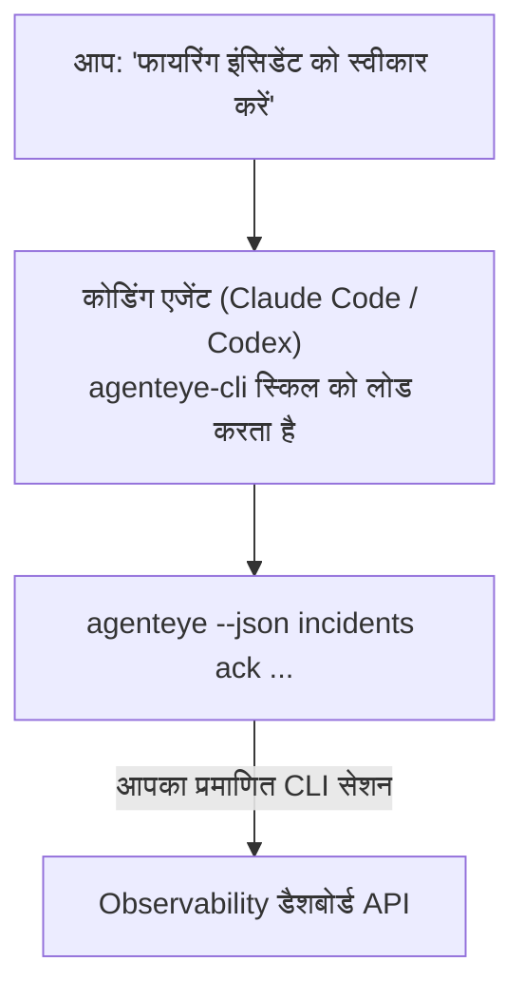

---
---
title: "Failproof AI Observability CLI Agent Skill"
description: "अपने कोडिंग एजेंट से पूछें कि \"क्या आज कुछ टूटा है?\" और इसे अपने लाइव Failproof AI Observability डेटा से जवाब देने दें, बिना किसी कमांड को याद रखने के।"
---


अपने कोडिंग एजेंट से *"क्या आज कुछ टूटा है?"* पूछें और इसे अपने लाइव Failproof AI Observability डेटा से जवाब देने दें, बिना किसी कमांड को याद रखने के। **Failproof AI Observability CLI स्किल** (`agenteye-cli`) एक *Agent Skill* है: निर्देशों का एक छोटा फोल्डर जिसे Claude Code या Codex जैसा कोडिंग एजेंट ज़रूरत पड़ने पर लोड करता है। यह एजेंट को [`agenteye` CLI](/hi/agenteye/cli) के माध्यम से आपके Observability डिप्लॉयमेंट को संचालित करना सिखाता है, साधारण अंग्रेजी अनुरोधों से जैसे *"CI को एक कुंजी दें जो केवल ईवेंट भेज सके"* या *"फायरिंग इंसिडेंट को स्वीकार करें और इसे मुझे असाइन करें।"*

यह **नहीं** एक सेवा या अलग बाइनरी है; इसे डिप्लॉय करने के लिए कुछ नहीं है। यह उस CLI के ऊपर चलता है जो आप पहले से इंस्टॉल कर चुके हैं: एजेंट `agenteye --json …` को चलाता है, साफ JSON को पार्स करता है, और आपको गद्य में जवाब देता है। यह जो कुछ भी कर सकता है, आप उन्हीं कमांड को टाइप करके खुद कर सकते हैं।

---

## यह अन्य Failproof AI Observability इंटरफेस से कैसे संबंधित है

Failproof AI Observability आपको एक ही डेटा और कंट्रोल तक पहुंचने के चार तरीके देता है। वे एक दूसरे को पूरक करते हैं:

| इंटरफेस | यह क्या है | यह कहां चलता है | इसे तब चुनें जब |
|---|---|---|---|
| **[CLI](/hi/agenteye/cli)** | `agenteye` के लिए कमांड/फ्लैग संदर्भ | आपका टर्मिनल | आप कोई विशिष्ट कमांड चलाना या स्क्रिप्ट करना चाहते हैं |
| **[CLI recipes](/hi/agenteye/cli-recipes)** | कॉपी-पेस्ट `jq`/पाइपलाइन पैटर्न | आपका टर्मिनल / स्क्रिप्ट | आप CLI को ऑटोमेशन में वायर कर रहे हैं |
| **CLI स्किल** (यह दस्तावेज़) | CLI पर प्राकृतिक-भाषा फ्रंट डोर | आपका कोडिंग एजेंट, आपके वर्कस्टेशन पर | आप बस पूछना चाहते हैं और एजेंट को कमांड चुनने दें |
| **[Evaluator स्किल](/hi/agenteye/evaluator-skill)** | एक सहयोगी स्किल जो आपकी स्कोरिंग सेवा को डिजाइन और बनाता है | आपका कोडिंग एजेंट, आपके वर्कस्टेशन पर | आप eval स्कोर *बनाना* चाहते हैं बजाय उन्हें पढ़ने के |
| **[Python SDK स्किल](/hi/agenteye/python-sdk-skill)** | एक सहयोगी स्किल जो आपके एजेंट को ताकि वह सभी जगह टेलीमेट्री भेजे | आपका कोडिंग एजेंट, आपके वर्कस्टेशन पर | आप अपने एजेंट को *बनाना* चाहते हैं ईवेंट भेजने के लिए जिसे यह स्किल पढ़ता है |
| **[इन-डैशबोर्ड AI असिस्टेंट](/hi/agenteye/assistant)** | डैशबोर्ड में एम्बेडेड एक चैट | सर्वर-साइड (डैशबोर्ड में) | आप अपने डेटा पर इन-डैशबोर्ड Q&A चाहते हैं |

स्किल के पास अपनी कोई विशेषाधिकार नहीं है; यह केवल आपके शब्दों को CLI कॉल में बदलता है जो आप के रूप में चलते हैं:



### बनाम इन-डैशबोर्ड AI असिस्टेंट: एक महत्वपूर्ण अंतर

ये दो अलग-अलग उपकरण हैं जिनकी बहुत अलग-अलग सीमाएं हैं:

- **इन-डैशबोर्ड AI असिस्टेंट** ([AI असिस्टेंट](/hi/agenteye/assistant)) डैशबोर्ड में एम्बेडेड एक चैट है, एजेंट सेवा द्वारा समर्थित। यह **केवल-पढ़ना प्लस अनुमोदन-गेट ऑथरिंग** है: यह सहेजे गए प्रश्नों और डैशबोर्ड को ड्राफ्ट कर सकता है, लेकिन हर लेखन आपके स्पष्ट क्लिक-अनुमोदन के लिए रुकता है, और यह कभी नहीं हटाता है। यह `agent:use` अनुमति द्वारा गेट किया गया है और केवल उस संगठन के लिए डेटा देखता है जिसे आप देख रहे हैं।
- **CLI स्किल** आपके वर्कस्टेशन पर *आपके* कोडिंग एजेंट के अंदर चलता है और `agenteye` CLI को **आप** के रूप में चलाता है। यह CLI की **संपूर्ण सतह, म्यूटेशन सहित** कर सकता है (API कुंजियां बनाएं/रोटेट/अक्षम करें, संगठन सेटिंग्स बदलें, इंसिडेंट रिज़ॉल्व करें, सहेजे गए प्रश्नों को हटाएं), केवल आपके CLI लॉगिन की अनुमतियों द्वारा सीमित। इसे बिल्कुल उसी तरह व्यवहार करें जैसे आप उन कमांड को हाथ से चलाना चाहते हैं।

---

## आवश्यकताएं

1. **`agenteye` CLI इंस्टॉल किया हुआ** और `PATH` पर (देखें [CLI](/hi/agenteye/cli) संदर्भ: `pipx install agenteye`)।
2. आपका **डैशबोर्ड URL सेट किया हुआ** (`AGENTEYE_DASHBOARD_URL`, या एजेंट `--base-url` पास करता है)।
3. एक **लॉग इन सेशन**: पहले `agenteye login` को स्वयं चलाएं। स्किल **नहीं** ईमेल किए गए एकबारी-कोड लॉगिन को आपके लिए पूरा कर सकता है; यह आपको `agenteye login` चलाने के लिए कहेगा यदि सेशन गायब या समाप्त है (CLI एक्जिट कोड `4`)।

---

## इसे कहां प्राप्त करें

स्किल Failproof AI के सार्वजनिक स्किल संग्रह में प्रकाशित है:

**[github.com/FailproofAI/skills](https://github.com/FailproofAI/skills)** → [`skills/agenteye-cli/`](https://github.com/FailproofAI/skills/tree/main/skills/agenteye-cli)

इसके बारे में कुछ भी गेट किया नहीं है — रिपॉजिटरी सार्वजनिक है और स्किल को अपने स्वयं के किसी क्रेडेंशियल की आवश्यकता नहीं है, क्योंकि यह केवल **सार्वजनिक** `agenteye` CLI को *आपके* डैशबोर्ड के विरुद्ध चलाता है, सेशन का उपयोग करके *आप* लॉग इन किए गए। आपको किसी से इसके लिए पूछने की आवश्यकता नहीं है।

ध्यान दें कि यह अपने स्वयं के फोल्डर के रूप में शिप करता है और `pipx install agenteye` पैकेज के अंदर **नहीं** है, तो वहां इसे न देखें।

## स्किल को इंस्टॉल करना

सबसे तेज़ रास्ता [`skills`](https://skills.sh) CLI है, जो फोल्डर को प्राप्त करता है और इसे वहां डालता है जहां आपका एजेंट देखता है:

```bash
# Claude Code, केवल यह प्रोजेक्ट
npx skills add FailproofAI/skills --skill agenteye-cli -a claude-code

# हर प्रोजेक्ट (इंस्टॉल करता है ~/.claude/skills/ में)
npx skills add FailproofAI/skills --skill agenteye-cli -a claude-code -g --copy

# इसके बजाय Codex
npx skills add FailproofAI/skills --skill agenteye-cli -a codex
```

फिर इसे किसी भी अन्य स्किल की तरह प्रबंधित करें:

```bash
npx skills list -a claude-code      # क्या इंस्टॉल है
npx skills update agenteye-cli      # नवीनतम संस्करण प्राप्त करें
npx skills remove agenteye-cli      # इसे हटाएं
```

हाथ से इंस्टॉल करना पसंद करते हैं? एक Agent Skill केवल `SKILL.md` (साथ ही वैकल्पिक संदर्भ) युक्त एक फोल्डर है, इसलिए इसे कॉपी करना काम करता है:

- **Claude Code**: `agenteye-cli/` फोल्डर को `~/.claude/skills/` में रखें (हर प्रोजेक्ट) या `<your-repo>/.claude/skills/` (केवल वह रिपॉजिटरी)। Claude Code स्वचालित रूप से इसे खोजता है — `/skills` सूची के साथ सत्यापित करें, या बस कोई प्रश्न पूछें जो इसके विवरण से मेल खाता हो।
- **Codex (OpenAI)**: Codex एक ही `SKILL.md` को पढ़ता है। बंडल किए गए `agents/openai.yaml` को `allow_implicit_invocation: true` सेट करता है, इसलिए Codex स्वचालित रूप से स्किल को चुनता है जब कोई कार्य मेल खाता है; अन्यथा इसे स्पष्ट रूप से `$agenteye-cli` के रूप में आह्वान करें।

---

## सुरक्षा: जब एजेंट CLI चलाता है तो म्यूटेशन संकेत नहीं देते

> **चेतावनी:** एजेंट को परिवर्तन करने देने से पहले यह पढ़ें।

`agenteye` CLI सामान्य रूप से विनाशकारी कार्रवाई से पहले *"क्या आप सुनिश्चित हैं?"* पूछता है। यह **जब भी टर्मिनल से जुड़ा नहीं होता (जो बिल्कुल वैसे ही है कि कोडिंग एजेंट इसे चलाता है), तो स्वचालित रूप से इस पुष्टि को छोड़ देता है, और `--json` भी इसे छोड़ देता है।** तो सुरक्षा संकेत एजेंट के लिए **नहीं** होगा।

स्किल मुआवजे के लिए लिखा गया है: इसे सटीक कमांड को बताने का निर्देश दिया जाता है जो यह चलाएगा और किसी भी स्थिति परिवर्तन से पहले आपकी स्पष्ट **ठीक है** प्राप्त करें। उस अनुशासन को रखें। जब आप Failproof AI Observability को एजेंट के माध्यम से चलाते हैं, *आप* पुष्टि चरण होते हैं। स्थिति-परिवर्तन करने वाली कमांड जिन पर नज़र रखनी है:

- `keys create` / `update` / `disable` / `regenerate`
- `users create` / `update` / `disable` / `enable`
- `settings set`
- `alerts create` / `update` / `delete` / `test`
- लेखन `incidents` सबकमांड: `ack` / `assign` / `resolve` / `open` / `comment-add` / `comment-delete` / `subscribe` / `unsubscribe`
- `query create` / `update` / `delete`
- `agent rename` / `delete`
- `orgs switch`

**Observe** के तहत सब कुछ (`events`, `sessions`, `evals`, `errors`, `list`, `whoami`, `orgs list/current/perms`) केवल-पढ़ना है और कुछ भी नहीं बदलता है।

क्योंकि एजेंट **आप** के रूप में कार्य करता है, यह केवल वह कर सकता है जो आपके लॉगिन को करने की अनुमति है; अनुमतियों को **प्रति संगठन** हल किया जाता है (देखें [API कुंजियां](/hi/agenteye/api-keys))। एक कमांड जिसके लिए आपके पास अनुमति नहीं है, एक्जिट कोड `5` के साथ सटीक अनुमति नामित करके लौटता है, इसलिए एजेंट आपको बता सकता है कि आप एक प्रशासक से क्या पूछने के लिए कहें, बजाय अस्पष्ट रूप से विफल होने के।

---

## आप इससे क्या पूछ सकते हैं

यहाँ एक वास्तविक राउंड-ट्रिप कैसा दिखता है, एक पढ़ना, फिर एक परिवर्तन जो आपके ठीक होने की प्रतीक्षा करता है:

```text
आप   ▸ क्या पिछले दिन में कुछ टूटा हुआ है?

एजेंट ▸ चला रहे हैं: agenteye --json errors --since 24h --aggregate
        पिछले 24 घंटों में 3 त्रुटि प्रकार। सबसे बड़ा है TimeoutError
        (18 हिट्स, सभी checkout-agent पर), फिर RateLimited (5)।
        क्या आप TimeoutError के लिए विफल सेशन चाहते हैं?

आप   ▸ CI को एक कुंजी दें जो केवल ईवेंट भेज सके।

एजेंट ▸ यह एक API कुंजी बनाता है। मैं चलाऊंगा:
          agenteye keys create ci --add events:add
        आगे बढ़ने के लिए ठीक है?

आप   ▸ हाँ

एजेंट ▸ पूरा। कुंजी "ci" केवल events:add के साथ बनाई गई।
        गोपनीय केवल एक बार दिखाया जाता है, इसलिए अभी इसे स्टोर करें। मैं इसे फिर से प्रिंट नहीं कर सकता।
```

स्किल प्रत्येक सादे-अंग्रेजी आशय को सही `agenteye` कमांड में मैप करता है, पहले वैध मान (`list <kind>`, `whoami`) की खोज करके ताकि यह अनुमान न लगाए, और किसी भी परिवर्तन से पहले सटीक कमांड को बताए। अधिक उदाहरण:

- *"क्या कुछ टूटा / विफल हो रहा है पिछले 24 घंटों में?"* → `errors --since 24h --aggregate`, फिर एक ब्रेकडाउन।
- *"सेशन `run-001` क्यों विफल हुआ?"* → `events --session-id run-001 --all` + `evals --session-id run-001`।
- *"गुणवत्ता इस हफ्ते कैसी प्रवृत्ति दिख रही है?"* → `evals --aggregate --since 7d`, फिर कम-स्कोरिंग रन में ड्रिल करें।
- *"CI को एक कुंजी दें जो केवल ईवेंट भेज सके।"* → `keys create ci --add events:add` (यह कमांड को बताता है, फिर इसे बनाता है और एकबारी गोपनीय को कैप्चर करता है)।
- *"किसके पास एक्सेस है? Dana को केवल-पढ़ना बनाएं।"* → `users list` → `users update dana@… --permission-set read-only` (आपके साथ पुष्टि के बाद)।
- *"फायरिंग इंसिडेंट को स्वीकार करें और इसे मुझे असाइन करें।"* → `incidents list --state firing` → `incidents ack <id>` / `incidents assign <id> you@…`।

सटीक कमांड, फ्लैग, और इन के पीछे के JSON आकार के लिए, देखें [CLI](/hi/agenteye/cli) संदर्भ और [एजेंट के लिए CLI recipes](/hi/agenteye/cli-recipes)।

---

## अगले कदम

- **[CLI](/hi/agenteye/cli)**: `agenteye` के लिए संपूर्ण कमांड और फ्लैग संदर्भ।
- **[एजेंट के लिए CLI recipes](/hi/agenteye/cli-recipes)**: कॉपी-पेस्ट `jq` पैटर्न और एक्जिट-कोड हैंडलिंग।
- **[Evaluator एजेंट स्किल](/hi/agenteye/evaluator-skill)**: सहयोगी स्किल, evaluator को बनाने के लिए जिसके स्कोर `agenteye evals` पढ़ता है।
- **[Python SDK एजेंट स्किल](/hi/agenteye/python-sdk-skill)**: सहयोगी स्किल, एजेंट को ताकि वह टेलीमेट्री भेजे जिसे `agenteye` पढ़ता है।
- **[AI असिस्टेंट](/hi/agenteye/assistant)**: इन-डैशबोर्ड असिस्टेंट (इस टर्मिनल स्किल के साथ भ्रमित न करें)।
- **[API कुंजियां](/hi/agenteye/api-keys)**: प्रति-संगठन अनुमति मॉडल जो स्किल को क्या कर सकता है इसे सीमित करता है।