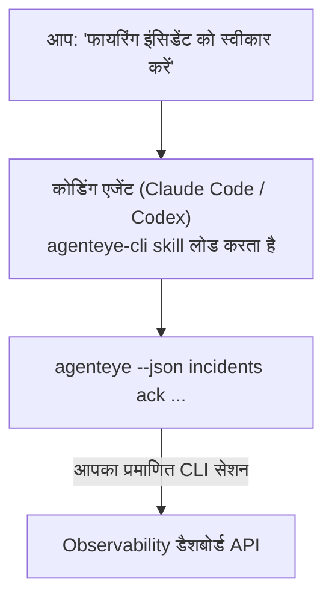

---
---
title: "Failproof AI Observability CLI Agent Skill"
description: "अपने कोडिंग एजेंट से पूछें \"क्या आज कुछ टूटा है?\" और इसे अपने लाइव Failproof AI Observability डेटा से जवाब दें, बिना कोई कमांड याद रखे।"
---


अपने कोडिंग एजेंट से *"क्या आज कुछ टूटा है?"* पूछें और इसे आपके लाइव Failproof AI Observability डेटा से जवाब दें, बिना कोई कमांड याद रखे। **Failproof AI Observability CLI skill** (`agenteye-cli`) एक *Agent Skill* है: निर्देशों का एक छोटा फोल्डर जिसे Claude Code या Codex जैसे कोडिंग एजेंट ऑन-डिमांड लोड करते हैं। यह एजेंट को [`agenteye` CLI](/hi/agenteye/cli) के माध्यम से आपके Observability डिप्लॉयमेंट को संचालित करना सिखाता है, साधारण अंग्रेजी अनुरोधों से जैसे *"CI को एक key दें जो केवल events push कर सके"* या *"फायरिंग इंसिडेंट को स्वीकार करें और इसे मुझे असाइन करें।"*

यह **नहीं** एक सेवा या अलग बाइनरी है; इसे डिप्लॉय करने के लिए कुछ नहीं है। यह CLI के ऊपर काम करता है जो आप पहले से ही इंस्टॉल कर चुके हैं: एजेंट `agenteye --json …` में शेल करता है, क्लीन JSON को पार्स करता है, और आपको प्रोज़ में जवाब देता है। यह जो कुछ भी कर सकता है, आप उसी कमांड को टाइप करके स्वयं कर सकते थे।

---

## यह अन्य Failproof AI Observability इंटरफेस से कैसे संबंधित है

Failproof AI Observability आपको समान डेटा और नियंत्रणों तक पहुंचने के चार तरीके देता है। वे एक दूसरे को पूरक करते हैं:

| इंटरफेस | यह क्या है | कहां चलता है | इसका उपयोग कब करें |
|---|---|---|---|
| **[CLI](/hi/agenteye/cli)** | `agenteye` के लिए कमांड/फ्लैग संदर्भ | आपका टर्मिनल | आप एक विशिष्ट कमांड चलाना या स्क्रिप्ट करना चाहते हैं |
| **[CLI recipes](/hi/agenteye/cli-recipes)** | कॉपी-पेस्ट `jq`/पाइपलाइन पैटर्न | आपका टर्मिनल / स्क्रिप्ट | आप CLI को ऑटोमेशन में जोड़ रहे हैं |
| **CLI skill** (यह doc) | CLI पर प्राकृतिक-भाषा फ्रंट डोर | आपका कोडिंग एजेंट, आपकी वर्कस्टेशन पर | आप *बस पूछना* चाहते हैं और एजेंट को कमांड चुनने दें |
| **[Evaluator skill](/hi/agenteye/evaluator-skill)** | एक सहोदर skill जो आपकी स्कोरिंग सेवा डिजाइन और निर्माण करता है | आपका कोडिंग एजेंट, आपकी वर्कस्टेशन पर | आप eval स्कोर *उत्पादन* करना चाहते हैं न कि उन्हें पढ़ना |
| **[Python SDK skill](/hi/agenteye/python-sdk-skill)** | एक सहोदर skill जो आपके एजेंट को इंस्ट्रूमेंट करता है ताकि यह सभी telemetry emit करे | आपका कोडिंग एजेंट, आपकी वर्कस्टेशन पर | आप चाहते हैं कि आपका एजेंट इस skill द्वारा पढ़े जाने वाले events *उत्पादन* करे |
| **[In-dashboard AI assistant](/hi/agenteye/assistant)** | डैशबोर्ड में embedded चैट | सर्वर-साइड (डैशबोर्ड में) | आप अपने डेटा पर in-dashboard Q&A चाहते हैं |

Skill के पास कोई अपने आप में विशेषाधिकार नहीं है; यह केवल आपके शब्दों को CLI कॉल में बदलता है जो आपके रूप में चलते हैं:



### in-dashboard AI assistant के बनाम: एक महत्वपूर्ण अंतर

ये दो अलग-अलग उपकरण हैं जिनके बहुत अलग-अलग प्रभाव क्षेत्र हैं:

- **in-dashboard AI assistant** ([AI assistant](/hi/agenteye/assistant)) डैशबोर्ड में embedded चैट है, एजेंट सेवा द्वारा समर्थित। यह **read-only प्लस approval-gated authoring** है: यह सेव की गई क्वेरीज़ और डैशबोर्ड ड्राफ्ट कर सकता है, लेकिन प्रत्येक लिखता समय आपकी स्पष्ट क्लिक-स्वीकृति के लिए रुकता है, और यह कभी हटाता नहीं। यह `agent:use` अनुमति द्वारा gated है और केवल उस org के लिए डेटा देखता है जिसे आप देख रहे हैं।
- **CLI skill** आपकी *अपनी* वर्कस्टेशन पर आपके *अपने* कोडिंग एजेंट के अंदर चलता है और `agenteye` CLI को **आप** के रूप में चलाता है। यह CLI के **पूर्ण सतह का प्रदर्शन कर सकता है, जिसमें mutations** (create/rotate/disable API keys, org सेटिंग्स बदलें, incidents resolve करें, सेव की गई क्वेरीज़ हटाएं) शामिल हैं, जो केवल आपके CLI लॉगिन की अनुमतियों द्वारा bounded है। इसे बिल्कुल उसी तरह सावधानी से व्यवहार करें जैसे आप उन कमांडों को हाथ से चलाते समय करते।

---

## पूर्वापेक्षाएं

1. **`agenteye` CLI इंस्टॉल किया हुआ** और `PATH` पर ([CLI](/hi/agenteye/cli) संदर्भ देखें: `pipx install agenteye`)।
2. आपका **डैशबोर्ड URL सेट** (`AGENTEYE_DASHBOARD_URL`, या एजेंट `--base-url` पास करता है)।
3. एक **लॉग-इन सेशन**: पहले स्वयं `agenteye login` चलाएं। Skill आपके लिए ईमेल किए गए one-time-code लॉगिन को पूरा **नहीं** कर सकता; यदि सेशन missing या expired है तो यह आपको `agenteye login` चलाने के लिए कहेगा (CLI exit code `4`)।

---

## इसे कहां से प्राप्त करें

Skill को Failproof AI के पब्लिक skills कलेक्शन में प्रकाशित किया गया है:

**[github.com/FailproofAI/skills](https://github.com/FailproofAI/skills)** → [`skills/agenteye-cli/`](https://github.com/FailproofAI/skills/tree/main/skills/agenteye-cli)

इसके बारे में कुछ भी gated नहीं है — रिपोजिटरी पब्लिक है और skill को कोई अपना credential की जरूरत नहीं है, क्योंकि यह केवल **पब्लिक** `agenteye` CLI को आपके डैशबोर्ड के विरुद्ध चलाता है, उस सेशन का उपयोग करके *जिसे* आप लॉग इन करते हैं। आपको इसके लिए किसी से पूछने की जरूरत नहीं है।

ध्यान दें कि यह अपने फोल्डर के रूप में शिप करता है और `pipx install agenteye` पैकेज के अंदर **नहीं** है, इसलिए वहां इसे न खोजें।

## Skill को इंस्टॉल करना

सबसे तेज़ पथ [`skills`](https://skills.sh) CLI है, जो फोल्डर को फेच करता है और इसे वहां ड्रॉप करता है जहां आपका एजेंट देखता है:

```bash
# Claude Code, केवल यह प्रोजेक्ट
npx skills add FailproofAI/skills --skill agenteye-cli -a claude-code

# हर प्रोजेक्ट (~/.claude/skills/ में इंस्टॉल करता है)
npx skills add FailproofAI/skills --skill agenteye-cli -a claude-code -g --copy

# इसके बजाय Codex
npx skills add FailproofAI/skills --skill agenteye-cli -a codex
```

फिर इसे किसी अन्य skill की तरह प्रबंधित करें:

```bash
npx skills list -a claude-code      # क्या इंस्टॉल है
npx skills update agenteye-cli      # नवीनतम संस्करण प्राप्त करें
npx skills remove agenteye-cli      # इसे हटाएं
```

हाथ से इंस्टॉल करना पसंद करते हैं? एक Agent Skill केवल एक फोल्डर है जिसमें `SKILL.md` (साथ ही वैकल्पिक संदर्भ) है, इसलिए इसे कॉपी करना काम करता है:

- **Claude Code**: `agenteye-cli/` फोल्डर को `~/.claude/skills/` (हर प्रोजेक्ट) या `<your-repo>/.claude/skills/` (केवल वह repo) में रखें। Claude Code इसे auto-discover करता है — `/skills` लिस्ट के साथ सत्यापित करें, या बस एक प्रश्न पूछें जो इसके विवरण से मेल खाता है।
- **Codex (OpenAI)**: Codex समान `SKILL.md` को पढ़ता है। bundled `agents/openai.yaml` `allow_implicit_invocation: true` सेट करता है, इसलिए Codex जब कोई कार्य मेल खाता है तब skill को auto-select करता है; अन्यथा इसे `$agenteye-cli` के रूप में स्पष्ट रूप से invoke करें।

---

## सुरक्षा: mutations जब एजेंट CLI चलाता है तो PROMPT नहीं करते

> **चेतावनी:** एजेंट को परिवर्तन करने देने से पहले इसे पढ़ें।

`agenteye` CLI सामान्यतः एक विनाशकारी कार्य से पहले *"क्या आप सुनिश्चित हैं?"* पूछता है। यह **हर बार जब यह टर्मिनल से attached नहीं है (जो बिल्कुल वैसे ही है जैसे कोडिंग एजेंट इसे चलाता है), और `--json` इसे भी स्किप करता है तब confirmation को auto-skip करता है।** तो सुरक्षा prompt एजेंट के लिए **नहीं** फायर होगा।

Skill को इसकी भरपाई के लिए लिखा गया है: इसे बिल्कुल कमांड स्टेट करने के लिए निर्देश दिया जाता है जो यह चलाएगा और किसी भी state change से पहले आपकी स्पष्ट **OK** प्राप्त करेगा। उस अनुशासन को रखें। जब आप Failproof AI Observability को एजेंट के माध्यम से चलाते हैं, *आप* confirmation स्टेप होते हैं। state-changing कमांड जो देखने योग्य हैं:

- `keys create` / `update` / `disable` / `regenerate`
- `users create` / `update` / `disable` / `enable`
- `settings set`
- `alerts create` / `update` / `delete` / `test`
- लिखते हुए `incidents` subcommands: `ack` / `assign` / `resolve` / `open` / `comment-add` / `comment-delete` / `subscribe` / `unsubscribe`
- `query create` / `update` / `delete`
- `agent rename` / `delete`
- `orgs switch`

**Observe** के अंतर्गत सब कुछ (`events`, `sessions`, `evals`, `errors`, `list`, `whoami`, `orgs list/current/perms`) read-only है और कुछ नहीं बदलता।

क्योंकि एजेंट **आप** के रूप में कार्य करता है, यह केवल वही कर सकता है जिसे आपकी लॉगिन करने की अनुमति है; अनुमतियों को **प्रति org** resolve किया जाता है ([API keys](/hi/agenteye/api-keys) देखें)। एक कमांड जिसके लिए आपके पास अनुमति नहीं है, exit code `5` के साथ exact permission नाम के साथ रिटर्न करता है, इसलिए एजेंट आपको बताता है कि आपको opaquely विफल होने के बजाय admin से क्या पूछना है।

---

## आप इससे क्या पूछ सकते हैं

यहां एक real round-trip दिखता है, एक read, फिर एक change जो आपकी OK के लिए प्रतीक्षा करता है:

```text
आप    ▸ क्या पिछले दिन में कुछ टूटा है?

एजेंट ▸ चल रहा है: agenteye --json errors --since 24h --aggregate
        पिछले 24h में 3 error प्रकार। सबसे बड़ा TimeoutError है
        (18 hits, सभी checkout-agent पर), फिर RateLimited (5)।
        क्या आप TimeoutError के लिए फायरिंग सेशन चाहते हैं?

आप    ▸ CI को एक key दें जो केवल events push कर सके।

एजेंट ▸ यह एक API key बनाता है। मैं चलाऊंगा:
          agenteye keys create ci --add events:add
        आगे बढ़ने के लिए OK?

आप    ▸ हां

एजेंट ▸ हो गया। Key "ci" events:add के साथ ही बनाई गई।
        Secret केवल एक बार दिखाया जाता है, इसलिए अभी इसे स्टोर करें। मैं इसे दोबारा प्रिंट नहीं कर सकता।
```

Skill प्रत्येक plain-English intent को सही `agenteye` कमांड में map करता है, पहले valid values को discover करता है (`list <kind>`, `whoami`) ताकि यह अनुमान न लगाए, और किसी भी change से पहले exact command को state करता है। अधिक उदाहरण:

- *"क्या कुछ टूटा / विफल है पिछले 24 घंटे में?"* → `errors --since 24h --aggregate`, फिर एक breakdown।
- *"सेशन `run-001` क्यों विफल हुआ?"* → `events --session-id run-001 --all` + `evals --session-id run-001`।
- *"गुणवत्ता इस हफ्ते कैसे trend हो रही है?"* → `evals --aggregate --since 7d`, फिर low-scoring runs में drill करें।
- *"CI को एक key दें जो केवल events push कर सके।"* → `keys create ci --add events:add` (यह कमांड को state करता है, फिर इसे बनाता है और one-time secret को capture करता है)।
- *"किसके पास एक्सेस है? Dana को read-only बनाएं।"* → `users list` → `users update dana@… --permission-set read-only` (आपके साथ confirm करने के बाद)।
- *"फायरिंग इंसिडेंट को स्वीकार करें और इसे मुझे असाइन करें।"* → `incidents list --state firing` → `incidents ack <id>` / `incidents assign <id> you@…`।

exact commands, flags, और इन के पीछे JSON shapes के लिए, [CLI](/hi/agenteye/cli) संदर्भ और [agents के लिए CLI recipes](/hi/agenteye/cli-recipes) देखें।

---

## अगले कदम

- **[CLI](/hi/agenteye/cli)**: `agenteye` के लिए पूर्ण कमांड और flag संदर्भ।
- **[Agents के लिए CLI recipes](/hi/agenteye/cli-recipes)**: copy-paste `jq` पैटर्न और exit-code handling।
- **[Evaluator agent skill](/hi/agenteye/evaluator-skill)**: सहोदर skill, evaluator बनाने के लिए जिसके स्कोर `agenteye evals` पढ़ता है।
- **[Python SDK agent skill](/hi/agenteye/python-sdk-skill)**: सहोदर skill, एजेंट को इंस्ट्रूमेंट करने के लिए ताकि यह telemetry emit करे जिसे `agenteye` पढ़ता है।
- **[AI assistant](/hi/agenteye/assistant)**: in-dashboard assistant (इस टर्मिनल skill से भ्रमित न हों)।
- **[API keys](/hi/agenteye/api-keys)**: per-org अनुमति मॉडल जो bound करता है कि skill क्या कर सकता है।