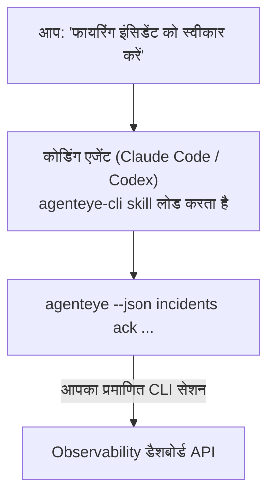

---
---
title: "Failproof AI Observability CLI Agent Skill"
description: "अपने कोडिंग एजेंट से पूछें \"क्या आज कुछ गलत है?\" और इसे अपने लाइव Failproof AI Observability डेटा से जवाब दें, बिना किसी कमांड को याद रखे।"
---


अपने कोडिंग एजेंट से *"क्या आज कुछ गलत है?"* पूछें और इसे अपने लाइव Failproof AI Observability डेटा से जवाब दें, बिना किसी कमांड को याद रखे। **Failproof AI Observability CLI skill** (`agenteye-cli`) एक *Agent Skill* है: निर्देशों का एक छोटा फोल्डर जो Claude Code या Codex जैसा कोडिंग एजेंट मांग पर लोड करता है। यह एजेंट को [`agenteye` CLI](/hi/agenteye/cli) के माध्यम से आपके Observability deployment को संचालित करना सिखाता है, साधारण अंग्रेजी अनुरोधों से जैसे *"CI को एक कुंजी दें जो केवल इवेंट्स पुश कर सकती है"* या *"फायरिंग इंसिडेंट को स्वीकार करें और इसे मुझे असाइन करें।"*

यह **कोई** सेवा या अलग बाइनरी नहीं है; इसे तैनात करने के लिए कुछ भी नहीं है। यह उस CLI के ऊपर काम करता है जो आपने पहले से स्थापित किया है: एजेंट `agenteye --json …` को निष्पादित करता है, स्वच्छ JSON को पार्स करता है, और आपको गद्य में जवाब देता है। यह जो कुछ भी कर सकता है, आप उन्हीं कमांड्स को टाइप करके स्वयं कर सकते हैं।

---

## यह अन्य Failproof AI Observability इंटरफेस से कैसे संबंधित है

Failproof AI Observability आपको एक ही डेटा और नियंत्रणों तक पहुंचने के लिए चार तरीके देता है। वे एक दूसरे को पूरक करते हैं:

| इंटरफेस | यह क्या है | यह कहां चलता है | इसका उपयोग करें जब |
|---|---|---|---|
| **[CLI](/hi/agenteye/cli)** | `agenteye` के लिए कमांड/फ्लैग संदर्भ | आपका टर्मिनल | आप किसी विशिष्ट कमांड को चलाना या स्क्रिप्ट करना चाहते हैं |
| **[CLI recipes](/hi/agenteye/cli-recipes)** | कॉपी-पेस्ट `jq`/पाइपलाइन पैटर्न | आपका टर्मिनल / स्क्रिप्ट्स | आप CLI को ऑटोमेशन में वायर कर रहे हैं |
| **CLI skill** (यह दस्तावेज़) | CLI पर एक प्राकृतिक-भाषा फ्रंट दरवाजा | आपका कोडिंग एजेंट, आपके वर्कस्टेशन पर | आप बस पूछना चाहते हैं और एजेंट को कमांड चुनने देते हैं |
| **[Evaluator skill](/hi/agenteye/evaluator-skill)** | एक भाई skill जो आपके स्कोरिंग सेवा को डिजाइन और निर्मित करता है | आपका कोडिंग एजेंट, आपके वर्कस्टेशन पर | आप eval स्कोर *produce* करना चाहते हैं, उन्हें पढ़ना नहीं |
| **[Python SDK skill](/hi/agenteye/python-sdk-skill)** | एक भाई skill जो आपके एजेंट को सभी में टेलीमेट्री उत्सर्जित करने के लिए इंस्ट्रूमेंट करता है | आपका कोडिंग एजेंट, आपके वर्कस्टेशन पर | आप अपने एजेंट को इवेंट्स *produce* करना चाहते हैं जो यह skill पढ़ता है |
| **[इन-डैशबोर्ड AI असिस्टेंट](/hi/agenteye/assistant)** | डैशबोर्ड में एम्बेड किया गया एक चैट | सर्वर-साइड (डैशबोर्ड में) | आप अपने डेटा पर डैशबोर्ड में Q&A चाहते हैं |

Skill के पास स्वयं कोई विशेषाधिकार नहीं है; यह केवल आपके शब्दों को CLI कॉल्स में बदलता है जो आप के रूप में चलते हैं:



### इन-डैशबोर्ड AI असिस्टेंट के विरुद्ध: एक महत्वपूर्ण अंतर

ये दो अलग-अलग उपकरण हैं जिनका बहुत अलग प्रभाव है:

- **इन-डैशबोर्ड AI असिस्टेंट** ([AI असिस्टेंट](/hi/agenteye/assistant)) डैशबोर्ड में एम्बेड किया गया एक चैट है, जिसे एजेंट सेवा द्वारा समर्थित है। यह **केवल पढ़ने के लिए प्लस अनुमोदन-गेट्स लेखन** है: यह सहेजी गई क्वेरीज़ और डैशबोर्ड का मसौदा तैयार कर सकता है, लेकिन प्रत्येक लिखना आपकी स्पष्ट क्लिक-अनुमोदन के लिए रुकता है, और यह कभी हटाता नहीं है। यह `agent:use` अनुमति द्वारा गेट किया गया है और केवल उस org के लिए डेटा देखता है जिसे आप देख रहे हैं।
- **CLI skill** आपके वर्कस्टेशन पर आपके कोडिंग एजेंट के अंदर चलता है और `agenteye` CLI को **आप** के रूप में चलाता है। यह CLI के **पूर्ण सतह, म्यूटेशन्स सहित** कर सकता है (API कुंजियां बनाएं/घुमाएं/अक्षम करें, org सेटिंग्स बदलें, इंसिडेंट्स हल करें, सहेजी गई क्वेरीज़ हटाएं), केवल आपकी CLI लॉगिन के अनुमतियों द्वारा बाध्य। इसे ठीक उसी सावधानी से व्यवहार करें जैसे आप उन कमांड्स को हाथ से चलाने के लिए करते हैं।

---

## पूर्वापेक्षाएं

1. **`agenteye` CLI स्थापित** और `PATH` पर (देखें [CLI](/hi/agenteye/cli) संदर्भ: `pipx install agenteye`)।
2. आपका **डैशबोर्ड URL सेट** (`AGENTEYE_DASHBOARD_URL`, या एजेंट `--base-url` पास करता है)।
3. एक **लॉगिन किया गया सेशन**: पहले स्वयं `agenteye login` चलाएं। Skill **ईमेल किए गए वन-टाइम-कोड लॉगिन को आपके लिए पूरा नहीं कर सकता**; यह आपको `agenteye login` चलाने के लिए कहेगा यदि सेशन गायब या समाप्त है (CLI एक्जिट कोड `4`)।

---

## इसे कहां प्राप्त करें

Skill Failproof AI के सार्वजनिक कौशल संग्रह में प्रकाशित है:

**[github.com/FailproofAI/skills](https://github.com/FailproofAI/skills)** → [`skills/agenteye-cli/`](https://github.com/FailproofAI/skills/tree/main/skills/agenteye-cli)

इसके बारे में कुछ भी गेट नहीं है — रिपोजिटरी सार्वजनिक है और skill को अपने स्वयं के किसी क्रेडेंशियल की आवश्यकता नहीं है, क्योंकि यह केवल सार्वजनिक `agenteye` CLI को आपके डैशबोर्ड के विरुद्ध चलाता है, आपके सेशन का उपयोग करके जिसे आप लॉगिन करते हैं। आपको किसी से इसके लिए पूछने की आवश्यकता नहीं है।

ध्यान दें कि यह अपने स्वयं के फोल्डर के रूप में शिप करता है और `pipx install agenteye` पैकेज के अंदर **नहीं** है, इसलिए वहां इसे न देखें।

## Skill को स्थापित करना

सबसे तेज़ रास्ता [`skills`](https://skills.sh) CLI है, जो फोल्डर को लाता है और इसे वहां छोड़ता है जहां आपका एजेंट देखता है:

```bash
# Claude Code, केवल यह प्रोजेक्ट
npx skills add FailproofAI/skills --skill agenteye-cli -a claude-code

# प्रत्येक प्रोजेक्ट (~/.claude/skills/ में स्थापित करता है)
npx skills add FailproofAI/skills --skill agenteye-cli -a claude-code -g --copy

# इसके बजाय Codex
npx skills add FailproofAI/skills --skill agenteye-cli -a codex
```

फिर इसे किसी भी अन्य skill की तरह प्रबंधित करें:

```bash
npx skills list -a claude-code      # क्या स्थापित है
npx skills update agenteye-cli      # नवीनतम संस्करण खींचें
npx skills remove agenteye-cli      # इसे हटाएं
```

हाथ से स्थापित करना पसंद करते हैं? एक Agent Skill केवल एक `SKILL.md` (प्लस वैकल्पिक संदर्भ) युक्त फोल्डर है, इसलिए इसे कॉपी करना काम करता है:

- **Claude Code**: `agenteye-cli/` फोल्डर को `~/.claude/skills/` (प्रत्येक प्रोजेक्ट) या `<your-repo>/.claude/skills/` (केवल वह रेपो) में रखें। Claude Code इसे ऑटो-खोज करता है — `/skills` सूची के साथ सत्यापित करें, या केवल किसी ऐसे प्रश्न पूछें जो इसके विवरण से मेल खाता हो।
- **Codex (OpenAI)**: Codex एक ही `SKILL.md` पढ़ता है। बंडल किया गया `agents/openai.yaml` `allow_implicit_invocation: true` सेट करता है, इसलिए Codex जब कोई कार्य मेल खाता है तब skill को ऑटो-चुनता है; अन्यथा इसे स्पष्ट रूप से `$agenteye-cli` के रूप में आमंत्रित करें।

---

## सुरक्षा: म्यूटेशन्स **प्रॉम्प्ट नहीं करते** जब कोई एजेंट CLI चलाता है

> **चेतावनी:** एजेंट को परिवर्तन करने देने से पहले यह पढ़ें।

`agenteye` CLI सामान्यतः विनाशकारी कार्य से पहले *"क्या आप सुनिश्चित हैं?"* पूछता है। यह **हमेशा उस पुष्टिकरण को छोड़ देता है जब यह टर्मिनल से जुड़ा नहीं होता (जो ठीक वही है कि कोडिंग एजेंट इसे कैसे चलाता है), और `--json` भी इसे छोड़ देता है।** इसलिए सुरक्षा प्रॉम्प्ट एजेंट के लिए **नहीं** चलेगा।

Skill इसके लिए क्षतिपूर्ति के लिए लिखा गया है: इसे सटीक कमांड बताने और किसी भी स्थिति परिवर्तन से पहले आपकी स्पष्ट **OK प्राप्त करने के लिए निर्देश दिया जाता है। वह अनुशासन रखें। जब आप Failproof AI Observability को एजेंट के माध्यम से चलाते हैं, *आप* पुष्टिकरण चरण हैं। स्थिति-परिवर्तन कमांड्स जिन्हें देखना है:

- `keys create` / `update` / `disable` / `regenerate`
- `users create` / `update` / `disable` / `enable`
- `settings set`
- `alerts create` / `update` / `delete` / `test`
- लेखन `incidents` सबकमांड्स: `ack` / `assign` / `resolve` / `open` / `comment-add` / `comment-delete` / `subscribe` / `unsubscribe`
- `query create` / `update` / `delete`
- `agent rename` / `delete`
- `orgs switch`

**Observe** के तहत सबकुछ (`events`, `sessions`, `evals`, `errors`, `list`, `whoami`, `orgs list/current/perms`) केवल पढ़ने के लिए है और कुछ भी नहीं बदलता है।

क्योंकि एजेंट **आप** के रूप में कार्य करता है, यह केवल वही कर सकता है जो आपकी लॉगिन को अनुमति है; अनुमतियों को **प्रति org** हल किया जाता है (देखें [API keys](/hi/agenteye/api-keys))। एक कमांड जिसके लिए आपके पास अनुमति नहीं है, एक्जिट कोड `5` के साथ सटीक अनुमति नाम के साथ लौटता है, इसलिए एजेंट आपको बताना बताता है कि आपको एक admin से क्या पूछने के लिए है, अपारदर्शी तरीके से विफल होने के बजाय।

---

## आप इससे क्या पूछ सकते हैं

यहां एक वास्तविक राउंड-ट्रिप दिखता है, एक पढ़ना, फिर एक परिवर्तन जो आपकी OK के लिए प्रतीक्षा करता है:

```text
आप   ▸ क्या पिछले दिन में कुछ गलत है?

एजेंट ▸ चल रहा है: agenteye --json errors --since 24h --aggregate
        पिछले 24h में 3 त्रुटि प्रकार। सबसे बड़ा TimeoutError है
        (18 हिट्स, सभी checkout-agent पर), फिर RateLimited (5)।
        क्या आप TimeoutError के लिए विफल सेशन चाहते हैं?

आप   ▸ CI को एक कुंजी दें जो केवल इवेंट्स पुश कर सकती है।

एजेंट ▸ यह एक API कुंजी बनाता है। मैं चलाऊंगा:
          agenteye keys create ci --add events:add
        आगे बढ़ने के लिए ठीक है?

आप   ▸ हां

एजेंट ▸ पूर्ण। कुंजी "ci" केवल events:add के साथ बनाई गई।
        गोपनीयता केवल एक बार दिखाई जाती है, इसलिए इसे अभी स्टोर करें। मैं इसे फिर से नहीं प्रिंट कर सकता।
```

Skill प्रत्येक साधारण-अंग्रेजी आशय को सही `agenteye` कमांड में मैप करता है, सबसे पहले मान्य मानों की खोज करता है (`list <kind>`, `whoami`) इसलिए यह अनुमान नहीं लगाता है, और किसी भी परिवर्तन से पहले सटीक कमांड बताता है। अधिक उदाहरण:

- *"क्या कुछ गलत / विफल हो गया है पिछले 24 घंटों में?"* → `errors --since 24h --aggregate`, फिर एक विच्छेद।
- *"सेशन `run-001` क्यों विफल हुआ?"* → `events --session-id run-001 --all` + `evals --session-id run-001`।
- *"गुणवत्ता इस हफ्ते कैसे चल रही है?"* → `evals --aggregate --since 7d`, फिर कम-स्कोरिंग रन्स में ड्रिल करें।
- *"CI को एक कुंजी दें जो केवल इवेंट्स पुश कर सकती है।"* → `keys create ci --add events:add` (यह कमांड बताता है, फिर इसे बनाता है और वन-टाइम गोपनीयता को कैप्चर करता है)।
- *"किसके पास एक्सेस है? Dana को केवल-पढ़ने के लिए बनाएं।"* → `users list` → `users update dana@… --permission-set read-only` (आपकी पुष्टि के बाद)।
- *"फायरिंग इंसिडेंट को स्वीकार करें और इसे मुझे असाइन करें।"* → `incidents list --state firing` → `incidents ack <id>` / `incidents assign <id> you@…`।

सटीक कमांड्स, फ्लैग्स, और इन के पीछे JSON आकृतियों के लिए, देखें [CLI](/hi/agenteye/cli) संदर्भ और [एजेंट्स के लिए CLI recipes](/hi/agenteye/cli-recipes)।

---

## अगले कदम

- **[CLI](/hi/agenteye/cli)**: `agenteye` के लिए पूर्ण कमांड और फ्लैग संदर्भ।
- **[एजेंट्स के लिए CLI recipes](/hi/agenteye/cli-recipes)**: कॉपी-पेस्ट `jq` पैटर्न और एक्जिट-कोड हैंडलिंग।
- **[Evaluator एजेंट skill](/hi/agenteye/evaluator-skill)**: भाई skill, evaluator बनाने के लिए जिसके स्कोर `agenteye evals` पढ़ता है।
- **[Python SDK एजेंट skill](/hi/agenteye/python-sdk-skill)**: भाई skill, एजेंट को इंस्ट्रूमेंट करने के लिए ताकि यह टेलीमेट्री उत्सर्जित करे जो `agenteye` पढ़ता है।
- **[AI असिस्टेंट](/hi/agenteye/assistant)**: इन-डैशबोर्ड असिस्टेंट (इस टर्मिनल skill से भ्रमित होने के लिए नहीं)।
- **[API keys](/hi/agenteye/api-keys)**: प्रति-org अनुमति मॉडल जो skill को क्या कर सकता है यह सीमित करता है।