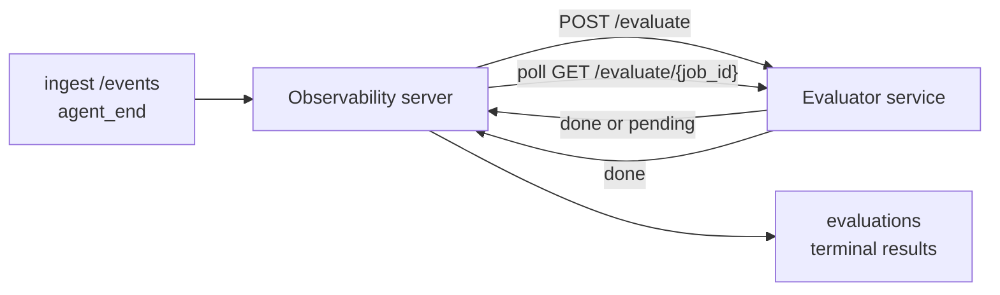

Failproof AI Observability प्रत्येक पूर्ण agent run को गुणवत्ता के लिए स्वचालित रूप से स्कोर कर सकता है: आप एक छोटी स्कोरिंग सेवा प्रदान करते हैं, और Observability बाकी को संभालता है। उन आयामों को ट्रैक करने के लिए इसका उपयोग करें जिनकी आप परवाह करते हैं (सहायकता, टूल दक्षता, तथ्यात्मकता, सुरक्षा; आप चुनते हैं), प्रतिगमन को जल्दी पकड़ें, और agents या environments की तुलना एक नज़र में करें। स्कोरिंग वैकल्पिक है: जब तक आप सर्वर पर `EVALUATOR_ENDPOINT` सेट न करें तब तक पाइपलाइन कुछ नहीं करता।

> **नोट:** आप स्कोर आयाम परिभाषित करते हैं। आपका evaluator कोई भी संख्यात्मक कुंजी वापस कर सकता है जो वह पसंद करता है; Observability जो भी आप वापस भेजते हैं उसे स्टोर, ट्रेंड और प्रदर्शित करता है।

## एक नज़र में

1. **एक स्कोरर लिखें।** एक छोटी HTTP सेवा चलाएं जो एक session transcript पढ़ता है और स्कोर वापस करता है। Observability एक working reference भेज रहा है जिसे आप कॉपी कर सकते हैं। [SDK के साथ एक evaluator लिखना](#writing-an-evaluator-with-the-sdk) देखें।
2. **Observability को इसकी ओर इशारा करें।** सर्वर प्रक्रिया पर `EVALUATOR_ENDPOINT` (और एक साझा `EVALUATOR_TOKEN`) सेट करें।
3. **स्कोर आते देखें।** हर पूर्ण session को स्वचालित रूप से स्कोर किया जाता है; परिणाम session विवरण पृष्ठ, sessions grid, और saved dashboards पर दिखाई देते हैं।


*एक बार evaluator कॉन्फ़िगर हो जाने पर, प्रत्येक पूर्ण run को स्कोर किया जाता है और परिणाम session के सही रेल में दिखाई देते हैं: शीर्ष पर सारांश, फिर प्रति-आयाम स्कोर बार तर्क के साथ।*

---

## यह कैसे काम करता है



जब Observability SDK एक session के लिए `agent_end` event emit करता है, तो सर्वर एक मूल्यांकन शेड्यूल करता है। फिर यह पूर्ण event transcript को आपकी evaluator सेवा को POST करता है, जो निम्न में से कर सकता है:

- **परिणाम इनलाइन वापस करें** `{"status":"done", "scores":{...}, "reasoning":{...}, "summary":"..."}` के साथ। परिणाम session के evaluation timeline में जोड़ा जाता है। `reasoning` और `summary` वैकल्पिक हैं।
- **स्थगित करें** `{"status":"pending", "job_id":"abc-123"}` के साथ। Observability तब `GET {EVALUATOR_ENDPOINT}/evaluate/abc-123` को कॉल करता है जब तक कि आपका evaluator `{"status":"done", ...}` या `{"status":"error", "error":"..."}` वापस न करे।

  polling cadence प्रति-job है: एक `pending` response में `next_poll_secs` शामिल हो सकता है override करने के लिए; अन्यथा Observability `GET /config` से `default_poll_interval_secs` value का उपयोग करता है; अन्यथा सर्वर `EVALUATOR_POLLING_INTERVAL_SECS` (डिफ़ॉल्ट 10s) पर वापस आता है। सभी values को [1s, 1h] में clamped किया जाता है।

Sessions जो कभी `agent_end` emit नहीं करते हैं (उदाहरण के लिए, एक क्रैश किया गया agent process) को भी चुना जा सकता है: evaluator का `GET /config` `{"inactivity_timeout_secs": 1800}` वापस कर सकता है, और Observability किसी भी session का मूल्यांकन करेगा जो उतने समय के लिए idle हो गया है। इस fallback को अक्षम करने के लिए field को `null` पर सेट करें या इसे छोड़ दें।

जब `EVALUATOR_ENDPOINT` unset हो तो पाइपलाइन पूरी तरह से no-op है।

एक session समय के साथ **कई terminal evaluations जमा कर सकता है**: प्रत्येक `agent_end` event (और dashboard से प्रत्येक manual re-eval) एक ताज़ा evaluation row जोड़ता है। यह एक resumed conversation का मूल्यांकन करने के लिए समर्थित तरीका है: एक उपयोगकर्ता एक agent को समाप्त करता है, बाद में वापस आता है, अधिक events भेजता है, agent को फिर से समाप्त करता है, और एक दूसरा मूल्यांकन पूर्ण updated transcript के विरुद्ध चलता है। dashboard सबसे हाल के मूल्यांकन को headline के रूप में और prior evaluations को एक collapsible timeline के रूप में प्रस्तुत करता है। जबकि एक मूल्यांकन एक session के लिए चल रहा है, उस session के लिए अतिरिक्त `agent_end` events को अनदेखा किया जाता है; चलने वाला मूल्यांकन पूर्ण होने के बाद अगला एक सामान्य रूप से एक ताज़ा मूल्यांकन enqueue करेगा।

inactivity fallback resumed sessions पर भी फिर से engage करता है: यदि पिछले terminal evaluation के बाद नए events आते हैं और session फिर `inactivity_timeout_secs` से अधिक समय के लिए idle हो जाता है, तो एक ताज़ा मूल्यांकन enqueue किया जाता है।

Transient failures (5xx, 429, timeouts, network errors) को `EVALUATOR_MAX_ATTEMPTS` तक exponential backoff के साथ retry किया जाता है; 4xx responses terminal हैं। Observability कई horizontally-scaled server instances के साथ चलाने के लिए सुरक्षित है; काम को विभाजित किया जाता है ताकि एक ही session को कभी भी simultaneously दो बार dispatch न किया जाए।

---

## HTTP contract

हर authenticated route **bearer token auth** का उपयोग करता है। दोनों sides पर एक ही value को कॉन्फ़िगर किया जाना चाहिए:

- Observability server: env var `EVALUATOR_TOKEN`
- Evaluator service: एक ही तरीके से कॉन्फ़िगर किया गया (the `agenteye-evaluator` SDK convention के अनुसार `EVALUATOR_TOKEN` पढ़ता है)

यदि `EVALUATOR_TOKEN` unset है, तो सर्वर कोई `Authorization` header नहीं भेजता; evaluator फिर anonymous requests को स्वीकार कर सकता है, जो एक internal-only network के लिए ठीक है लेकिन public internet पर discouraged है।

### Routes जो evaluator को serve करना चाहिए

| Route | Body / params | Response |
|---|---|---|
| `GET /health` | none | `{"status":"ok"}` (open, no auth) |
| `GET /config` | none | `{"inactivity_timeout_secs": <int> \| null, "default_poll_interval_secs": <int> \| omitted}` |
| `POST /evaluate` | `EvalRequest` JSON | `{"status":"done", ...}` या `{"status":"pending", "job_id":"..."}` |
| `GET /evaluate/{id}` | none | `/evaluate` के समान response shape |

### `EvalRequest` body जो सर्वर भेजता है

```json
{
  "schema_version": "1",
  "session_id":     "session-abc123",
  "agent_id":       "planner",
  "environment":    "production",
  "started_at":     "2026-05-10T12:00:00Z",
  "ended_at":       "2026-05-10T12:05:00Z",
  "events": [
    { "id": 1234, "ts": "...", "event_type": "agent_start", "payload": { ... } },
    ...
  ]
}
```

### Response shapes

**Sync (done):**

```json
{
  "status": "done",
  "scores": { "helpfulness": 0.85, "tool_efficiency": 0.6 },
  "reasoning": {
    "helpfulness": "answered the question directly with citations",
    "tool_efficiency": "called list_files three times when one would have done"
  },
  "summary": "strong answer quality, weak tool selection"
}
```

`reasoning` (एक per-score justification map) और `summary` (एक overall one-paragraph narrative) दोनों वैकल्पिक हैं। `reasoning` में keys को `scores` में keys को mirror करना चाहिए; dashboard प्रत्येक entry को अपने score bar के अंतर्गत inline प्रस्तुत करता है। पुराने evaluators जो केवल `scores` वापस करते हैं वे अपरिवर्तित जारी रहते हैं; `reasoning` और `summary` बस null के रूप में पढ़ते हैं और corresponding UI affordances को omitted किया जाता है।

**Async (deferred):**

```json
{ "status": "pending", "job_id": "abc-123", "next_poll_secs": 30 }
```

`next_poll_secs` वैकल्पिक है; यदि omitted है तो सर्वर evaluator के `/config` से `default_poll_interval_secs` पर वापस आता है, फिर अपने `EVALUATOR_POLLING_INTERVAL_SECS` env var पर।

**Terminal evaluator-side error:**

```json
{ "status": "error", "error": "model service unavailable" }
```

सर्वर किसी अन्य 2xx body को एक protocol error के रूप में मानता है और session के लिए एक terminal `error` record करता है।

---

## SDK के साथ एक evaluator लिखना

आपको HTTP contract को manually implement करना नहीं है। `agenteye-evaluator` Python package आपको एक typed FastAPI wrapper देता है जो auth, routing, और request/response shapes को आपके लिए संभालता है।

Failproof AI Observability एक **working reference evaluator** भी भेज रहा है जो transcript के आकार से `helpfulness`, `tool_efficiency`, और `factuality` को स्कोर करता है। इसे एक starting point के रूप में copy करें और अपने स्वयं के logic को swap करें: एक LLM judge, एक rule engine, जो भी आपकी quality bar के लिए उपयुक्त हो।

न्यूनतम व्यवहार्य evaluator:

```python
import os
from agenteye_evaluator import Evaluator, EvalRequest, EvalResponse

app = Evaluator(token=os.environ["EVALUATOR_TOKEN"])

@app.evaluator
def run(req: EvalRequest) -> EvalResponse:
    # Inspect req.events (the full session transcript) and return scores.
    tool_calls = sum(1 for e in req.events if e.event_type == "tool_use")
    return EvalResponse(
        scores={"tool_calls": float(tool_calls)},
        reasoning={"tool_calls": f"{tool_calls} tool invocations in the transcript"},
        summary="tight tool loop" if tool_calls < 5 else "agent looped on tools",
    )
```

`app` instance किसी भी ASGI server के अंतर्गत चलता है, इसलिए `uvicorn module:app` इसे शुरू करता है।

उन evaluators के लिए जिन्हें महंगे काम को defer करना है, `JobPending` को instead return करें और एक `@app.job_lookup` handler register करें; Observability server `GET /evaluate/{job_id}` को poll करता है जब तक कि आप एक terminal status return न करें या `EVALUATOR_MAX_POLL_DURATION_SECS` cap (डिफ़ॉल्ट 1 h) elapses न हो जाए।

पूर्ण API reference, async pattern, और event schema को `agenteye-evaluator` SDK के README में documented किया गया है।

---

## अपना evaluator चलाना

evaluator **आपकी सेवा** है — Failproof AI Observability एक default evaluator ship नहीं करता, इसलिए आप इसे जहां अपनी own services चलाते हैं वहां build और चलाते हैं। यह किसी भी ASGI server के अंतर्गत चलता है (उदाहरण के लिए `uvicorn my_evaluator:app`); [HTTP contract](#http-contract) से `/health`, `/config`, और `/evaluate` routes serve करें, फिर सर्वर को इसकी ओर point करें (देखें [Configuring the server](#configuring-the-server))।

एक बार evaluator reachable हो जाने पर, `GET /health` `{"status":"ok"}` return करता है। एक agent के बाद end-to-end चलता है, सर्वर पर `GET /evaluations` `status: "done"` के साथ एक row return करता है और आपके evaluator द्वारा उत्पादित scores।

---

## सर्वर को कॉन्फ़िगर करना

सर्वर प्रक्रिया पर सेट करें:

| Env var | Meaning |
|---|---|
| `EVALUATOR_ENDPOINT` | आपके evaluator का Base URL (`http://evaluator:9000`)। Unset = pipeline disabled। |
| `EVALUATOR_TOKEN` | Bearer token। evaluator service को configured value के साथ equal होना चाहिए। |
| `EVALUATOR_WORKERS` | सर्वर instance प्रति Worker tasks (डिफ़ॉल्ट 2)। |
| `EVALUATOR_CLAIM_BATCH` | प्रति worker tick Rows claimed (डिफ़ॉल्ट 4)। Batches को **concurrently** processed किया जाता है; आपके evaluator endpoint पर effective concurrency `EVALUATOR_WORKERS × EVALUATOR_CLAIM_BATCH` है। |
| `EVALUATOR_POLL_IDLE_SECS` | कितने समय के लिए एक worker dispatch attempts के बीच सोता है जब कोई evaluation due नहीं है (डिफ़ॉल्ट 2s)। |
| `EVALUATOR_POLLING_INTERVAL_SECS` | Final fallback `GET /evaluate/{id}` cadence के लिए जब न तो per-response `next_poll_secs` न ही evaluator का `default_poll_interval_secs` set है (डिफ़ॉल्ट 10s)। |
| `EVALUATOR_REQUEST_TIMEOUT_MS` | Per-request timeout (डिफ़ॉल्ट 30000)। |
| `EVALUATOR_MAX_ATTEMPTS` | इतने सारे transient failures के बाद परिणाम को terminal `error` के रूप में recorded किया जाता है (डिफ़ॉल्ट 5)। |
| `EVALUATOR_CONFIG_REFRESH_SECS` | `GET /config` cadence (डिफ़ॉल्ट 300)। |
| `EVALUATOR_MAX_POLL_DURATION_SECS` | अधिकतम wallclock time एक session polling queue में रह सकता है इसे `timeout` के रूप में terminated होने से पहले (डिफ़ॉल्ट 3600s)। एक evaluator के विरुद्ध guards जो हमेशा `pending` return करता है। |

automatic scoring को turn on करने के लिए, सर्वर पर `EVALUATOR_ENDPOINT` और `EVALUATOR_TOKEN` दोनों को सेट करें, फिर इसे restart करें change को pick up करने के लिए। `EVALUATOR_ENDPOINT` unset होने पर पाइपलाइन एक no-op रहता है।

ऊपर दिए गए tuning knobs वैकल्पिक हैं; केवल संबंधित environment variables को सर्वर पर तभी सेट करें जब आपको defaults को override करने की जरूरत हो।

---

## API reference

| Method | Path | Required permission | Purpose |
|---|---|---|---|
| `GET` | `/evaluations` | `evaluations:read` | Terminal results को query करें। `session_id`, `agent_id`, `environment`, `status` (`done`/`error`/`timeout`), `ts_from`, `ts_to`, `cursor`, `limit`, `score_filters`, `latest_per_session` को supports करता है। `limit` डिफ़ॉल्ट 50 है और 200 पर capped है (ध्यान दें कि यह `/events` से अलग है, जो 1000 पर capped है)। `environment` एक comma-separated list को accept करता है (जैसे `environment=prod,staging`); single values अभी भी काम करते हैं। `latest_per_session=true` के साथ response में `session_id` प्रति अधिकतम एक row होता है (सबसे हाल का `completed_at` द्वारा) sessions-list page द्वारा एक session के evaluation timeline को अपने current headline में collapse करने के लिए उपयोग किया जाता है। Defaults को false (full history return करता है)। |
| `GET` | `/evaluations/aggregate` | `evaluations:read` | एक filtered slice के लिए Rolled-up eval health: total count, एक done/error/timeout breakdown, per-score-key stats (count/avg/min/max/p50 arbitrary `scores` keys के अधिक), और एक time-bucketed timeline। `/evaluations` के समान **filter params** को plus `featured_keys` (trend करने के लिए score keys का CSV) और `latest_per_session` को accept करता है। Dashboards feature को powers करता है; metrics exact हैं पूरे matching set पर, sampled नहीं। |
| `GET` | `/evaluations/environments` | `evaluations:read` | `evaluations` table से Distinct environment values। evaluation-readable data को scoped filter dropdowns को populate करने के लिए उपयोग किया जाता है। |
| `GET` | `/evaluation-jobs` | `evaluations:read` | In-flight evaluations में Visibility। `status` (`pending`/`polling`) द्वारा filter करें। |
| `GET` | `/events` | `events:read` | एक session के raw events को stream करें। `session_id`, `agent_id`, `event_type` (CSV), `environment` (CSV), `ts_from`, `ts_to`, `cursor`, `limit`, और `order` को supports करता है। `order` `desc` (newest-first, default) या `asc` (oldest-first) है; एक unrecognized value `desc` पर fall back करता है। Cursor-paginate response के `next_cursor` के माध्यम से (एक event id): इसे `cursor` के रूप में वापस pass करें अगले page को प्राप्त करने के लिए; `asc` के साथ अगला page वह events है उस id के बाद, `desc` के साथ वह events पहले। `limit` डिफ़ॉल्ट 50 है और 1000 पर capped है। |
| `GET` | `/sessions/:session_id/export` | `events:read` | सटीक JSON body return करता है जो evaluator इस session के लिए receive करेगा, एक downloadable attachment के रूप में served `session-<id>.json` नाम के साथ। production sessions को offline testing के लिए `agenteye-evaluator` के माध्यम से replay करने के लिए उपयोगी। Bytes byte-identical हैं जो evaluator pipeline भेजता है। |
| `POST` | `/sessions/:session_id/re-evaluate` | `evaluations:trigger` | एक session के लिए एक ताज़ा मूल्यांकन enqueue करें; एक prior evaluation exist करता है या नहीं चलता है। नया परिणाम session के evaluation timeline में **appended** है previous one को overwrite करने के बजाय, इसलिए prior scores history के रूप में visible रहते हैं। Enqueue पर `202` return करता है, unknown session के लिए `404`, यदि evaluation already in flight है तो `409`। इसका उपयोग एक नए evaluator को deploy करने के बाद, या sessions के लिए करें जिन्होंने कभी `agent_end` emit नहीं किया। |

### Score range द्वारा filtering: `score_filters`

`GET /evaluations` एक optional `score_filters` parameter को accept करता है जो `scores` object के अंदर numeric values द्वारा results को narrow करता है। Parameter एक comma-separated list है `key:min..max` entries का; किसी भी bound को omitted किया जा सकता है। Multiple entries logical AND के साथ combine होते हैं। Rows जहां named key absent या non-numeric है excluded किया जाता है। एक request में अधिकतम 20 filter entries हो सकते हैं; exceed करने पर HTTP 400 return होता है।

Examples:
```text
# helpfulness in [0.5, 0.8]
GET /evaluations?score_filters=helpfulness:0.5..0.8

# tool_efficiency at most 0.3 (no lower bound)
GET /evaluations?score_filters=tool_efficiency:..0.3

# helpfulness >= 0.5 AND factuality >= 0.9
GET /evaluations?score_filters=helpfulness:0.5..,factuality:0.9..
```

प्रत्येक `/evaluations` response object के पास ये fields हैं:

| Field | Type | Notes |
|---|---|---|
| `evaluation_id` | string (UUID) | इस terminal evaluation के लिए canonical identifier। प्रत्येक terminal evaluation को एक नया UUID मिलता है; एक single session में multiple हो सकते हैं। |
| `id` | string (UUID) | Backwards-compatibility alias `evaluation_id` के समान value carry करता है। |
| `session_id` | string | Session जिसके विरुद्ध evaluation चला। एक session timeline में multiple evaluations हो सकते हैं। |
| `agent_id` | string | Agent को identify करता है जिसने session produce किया। |
| `environment` | string | Environment label session से copied। |
| `status` | enum | एक `"done"`, `"error"`, `"timeout"`। |
| `scores` | object \| null | आपके evaluator द्वारा return किए गए Scores। |
| `reasoning` | object \| null | Optional per-score justification map आपके evaluator द्वारा return किया गया। Keys typically `scores` में keys को mirror करते हैं। Dashboard प्रत्येक entry को अपने score bar के अंतर्गत render करता है। |
| `summary` | string \| null | Optional one-paragraph overall narrative आपके evaluator द्वारा return किया गया। Dashboard इसे per-score breakdown के ऊपर evaluation के headline के रूप में render करता है। |
| `error` | string \| null | `"error"` / `"timeout"` पर ही populated। |
| `attempt_count` | integer | Dispatch attempts की संख्या (≥ 1)। |
| `duration_ms` | integer \| null | Final attempt की duration। |
| `completed_at` | string (ISO 8601 UTC) | जब terminal result को recorded किया गया। Results को `completed_at` (newest first) द्वारा ordered किया गया। |
| `created_at` | string (ISO 8601 UTC) | `completed_at` के साथ ही timestamp carry करता है (write-once semantics)। |

---

## Permissions

| Permission | Grants |
|---|---|
| `evaluations:read` | List evaluation results, dashboard में scores को view करें, और dashboard health metrics को load करें। |
| `evaluations:trigger` | Manually एक session के लिए एक evaluation को enqueue करें `POST /sessions/:session_id/re-evaluate` के माध्यम से या dashboard के re-evaluate button। |
| `dashboards:read` | Saved dashboards को view करें (उनके metrics को load करने के लिए `evaluations:read` को भी चाहिए)। |
| `dashboards:write` | Dashboards को create और edit करें। |
| `dashboards:delete` | Dashboards को delete करें। |

Bootstrap admin (`ADMIN_KEY`, `ADMIN_EMAIL`) स्वचालित रूप से इन सभी को receive करता है।

---

## परिणाम देखना

- **`/sessions/<id>`**: events timeline + एक right rail session के scores और dispatch attempt से किसी error को दिखाता है। यदि आपकी key के पास `evaluations:trigger` है, तो एक **re-evaluate** button export button के बगल में दिखाई देता है, useful sessions के लिए जिन्होंने कभी `agent_end` emit नहीं किया, या एक नए evaluator को deploy करने के बाद scores को refresh करने के लिए। Dashboard नए result के लिए poll करता है और यह land होने पर right rail को update करता है।
- **`/sessions`**: filterable session grid; score column प्रत्येक session के evaluation status और scores को एक नज़र में दिखाता है।
- **`/dashboards`**: saved eval-health views (देखें [Dashboards](#dashboards) नीचे)।


*Sessions grid प्रत्येक run के evaluation status और scores को एक नज़र में दिखाता है; red/amber/green badges low scores को jump out करते हैं।*

---

## Dashboards

**Dashboards** page (`/dashboards`) आपको evaluation filters के एक combination को एक named, reusable view के रूप में save करने देता है और उस slice के evaluations को एक नज़र में देखते हैं कि कैसे doing किया जा रहा है। Dashboards **आपके पूरे organization में shared** हैं; हर कोई `dashboards:read` के साथ एक ही set देखता है।

प्रत्येक dashboard pins:

- **Filters**: sessions page के समान controls: environment, status, agent, एक rolling time window, और score-range filters (`key:min..max`)।
- **एक display configuration**: कौन से score keys को feature करना है, green/amber/red health thresholds, कौन से panels को दिखाना है, और क्या latest evaluation प्रति session में collapse करना है।

प्रत्येक card matching sessions की संख्या, एक done/error/timeout breakdown, प्रत्येक featured score की average, और एक small trend sparkline दिखाता है। एक dashboard को opening पर full-size panels दिखाई देते हैं; **"open in sessions"** आपको sessions page में उसी slice पर pre-filtered drop करता है। Metrics को server-side पर पूरे matching set के ऊपर compute किया जाता है (`GET /evaluations/aggregate` के माध्यम से), इसलिए numbers exact हैं rather than sampled।


**Permissions:** viewing को `dashboards:read` और `evaluations:read` दोनों चाहिए; creating और editing को `dashboards:write` चाहिए; deleting को `dashboards:delete` चाहिए। Bootstrap admin स्वचालित रूप से सभी को receive करता है।

---

## Troubleshooting

**Sessions exist लेकिन कोई evaluations create नहीं होते हैं।** Confirm करें कि `EVALUATOR_ENDPOINT` सर्वर प्रक्रिया पर set है, कि सर्वर और evaluator एक ही `EVALUATOR_TOKEN` value share करते हैं, और कि evaluator का `/health` endpoint सर्वर से reachable है। `EVALUATOR_ENDPOINT` unset होने पर पाइपलाइन एक no-op है।

**In-flight evaluations pile up होते हैं।** `GET /evaluation-jobs` को query करें in-flight queue को देखने के लिए। Inspect करें `attempt_count`, `next_attempt_at`, और `last_error` प्रत्येक row पर। Common causes: evaluator service unreachable या 5xx return कर रहा है (backoff के साथ retry किया जाता है), wrong `EVALUATOR_TOKEN` (401 terminal है), या एक async evaluator जो indefinitely `pending` return करता है (नीचे देखें)।

**Sessions completed लेकिन कोई terminal evaluation नहीं।** `GET /evaluation-jobs?status=polling` को query करें; result अभी भी in flight हो सकता है। यदि एक job `pending` में stuck है, तो सर्वर को evaluator तक पहुंचने में trouble हो रहा है; check करें कि evaluator up है और कि `EVALUATOR_TOKEN` matches करता है।

**`HTTP 401 from evaluator: invalid bearer token`।** सर्वर पर `EVALUATOR_TOKEN` evaluator service को configured value से match नहीं करता। वह identical होना चाहिए।

**Async evaluator indefinitely `pending` return करता है।** सर्वर `GET /evaluate/{job_id}` को poll करता है जब तक evaluator `done` या `error` return न करे, या जब तक `EVALUATOR_MAX_POLL_DURATION_SECS` (डिफ़ॉल्ट 1 h) elapses न हो जाए। Cap के बाद evaluation को `timeout` के रूप में recorded किया जाता है और in-flight queue से removed किया जाता है। `EVALUATOR_MAX_POLL_DURATION_SECS` को raise करें यदि आपका evaluator legitimately डिफ़ॉल्ट से अधिक समय की जरूरत है।

---

## अगले कदम

- [Evaluator agent skill](/hi/agenteye/evaluator-skill): एक coding agent को आपके real sessions के विरुद्ध dimensions को design करने और इस सेवा को आपके लिए build करने दें।
- [Python SDK](/hi/agenteye/python-sdk): `agent_end` events को emit करें जो scoring को trigger करते हैं।
- [API keys](/hi/agenteye/api-keys): `evaluations:read` और `evaluations:trigger` permissions।
- [Audits](/hi/agenteye/audits): Observability की एक अन्य automated quality feature, policy-based review के लिए।