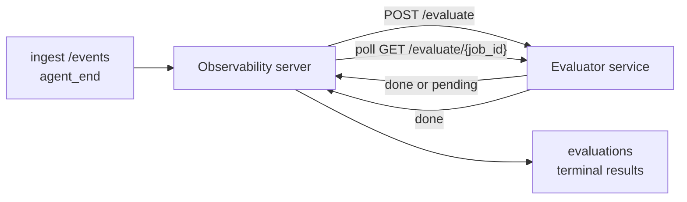

Failproof AI Observability प्रत्येक पूर्ण agent run को गुणवत्ता के लिए स्वचालित रूप से स्कोर कर सकता है: आप एक छोटी स्कोरिंग सेवा प्रदान करते हैं, और Observability बाकी को संभालता है। उन आयामों को ट्रैक करने के लिए इसका उपयोग करें जिनकी आपको परवाह है (मददगारिता, टूल दक्षता, तथ्यात्मकता, सुरक्षा; आप चुनें), प्रतिगमन को जल्दी पकड़ें, और agents या environments की तुरंत तुलना करें। स्कोरिंग वैकल्पिक है: जब तक आप सर्वर पर `EVALUATOR_ENDPOINT` सेट नहीं करते, तब तक पाइपलाइन कुछ नहीं करती।

> **नोट:** आप स्कोर आयाम परिभाषित करते हैं। आपका evaluator किसी भी संख्यात्मक कुंजियों को वापस कर सकता है जो वह चाहता है; Observability जो कुछ भी आप भेजते हैं उसे स्टोर, ट्रेंड और प्रदर्शित करता है।

## एक नज़र में

1. **एक scorer लिखें।** एक छोटी HTTP सेवा स्थापित करें जो एक session transcript पढ़ता है और scores वापस करता है। Observability एक कार्यशील संदर्भ भेज देता है जिसे आप कॉपी कर सकते हैं। [SDK के साथ एक evaluator लिखना](#writing-an-evaluator-with-the-sdk) देखें।
2. **Observability को इसकी ओर इंगित करें।** सर्वर प्रक्रिया पर `EVALUATOR_ENDPOINT` (और एक साझा `EVALUATOR_TOKEN`) सेट करें।
3. **स्कोर आते हुए देखें।** हर पूर्ण session स्वचालित रूप से स्कोर किया जाता है; परिणाम session विस्तार पृष्ठ, sessions ग्रिड, और सहेजे गए dashboards पर दिखाई देते हैं।


*एक बार evaluator कॉन्फ़िगर हो जाने के बाद, प्रत्येक पूर्ण run स्कोर किया जाता है और परिणाम session के दाहिनी रेल में दिखाई देते हैं: शीर्ष पर सारांश, फिर प्रति-आयाम स्कोर बार तर्क के साथ।*

---

## यह कैसे काम करता है



जब Observability SDK एक session के लिए `agent_end` event emit करता है, सर्वर एक मूल्यांकन को शेड्यूल करता है। फिर यह पूर्ण event transcript को आपकी evaluator सेवा में POST करता है, जो निम्नलिखित में से कर सकता है:

- **परिणाम को inline वापस करें** `{"status":"done", "scores":{...}, "reasoning":{...}, "summary":"..."}` के साथ। परिणाम session के मूल्यांकन timeline में जोड़ा जाता है। `reasoning` और `summary` वैकल्पिक हैं।
- **स्थगित करें** `{"status":"pending", "job_id":"abc-123"}` के साथ। Observability तब `GET {EVALUATOR_ENDPOINT}/evaluate/abc-123` को कॉल करता है जब तक आपका evaluator `{"status":"done", ...}` या `{"status":"error", "error":"..."}` वापस नहीं करता।

  पोलिंग cadence प्रति-job है: एक `pending` प्रतिक्रिया `next_poll_secs` शामिल कर सकती है; अन्यथा Observability `GET /config` से `default_poll_interval_secs` मान का उपयोग करता है; अन्यथा सर्वर `EVALUATOR_POLLING_INTERVAL_SECS` (डिफ़ॉल्ट 10s) पर वापस जाता है। सभी मान [1s, 1h] तक सीमित हैं।

Sessions जो कभी `agent_end` emit नहीं करते (उदाहरण के लिए, एक crashed agent प्रक्रिया) को भी चुना जा सकता है: evaluator के `GET /config` में `{"inactivity_timeout_secs": 1800}` वापस किया जा सकता है, और Observability किसी भी session को मूल्यांकन करेगा जो उस समय के लिए idle रहा है। इस fallback को disable करने के लिए फ़ील्ड को `null` पर सेट करें या इसे छोड़ दें।

जब `EVALUATOR_ENDPOINT` unset है तो पाइपलाइन पूरी तरह से no-op है।

एक session समय के साथ **कई terminal evaluations** जमा कर सकता है: प्रत्येक `agent_end` event (और dashboard से प्रत्येक manual re-eval) एक ताज़ा evaluation row जोड़ता है। यह एक resumed conversation को मूल्यांकन करने का समर्थित तरीका है: एक user एक agent को समाप्त करता है, बाद में वापस आता है, अधिक events भेजता है, agent को फिर से समाप्त करता है, और दूसरा मूल्यांकन पूरे updated transcript के विरुद्ध चलता है। Dashboard सबसे हाल के मूल्यांकन को headline के रूप में प्रस्तुत करता है और पूर्व मूल्यांकन को एक collapsible timeline के रूप में करता है। जबकि एक मूल्यांकन एक session के लिए चल रहा है, उस session के लिए अतिरिक्त `agent_end` events को ignored किया जाता है; चल रहे मूल्यांकन के पूरा होने के बाद अगला एक सामान्य रूप से एक ताज़ा मूल्यांकन को enqueue करेगा।

Inactivity fallback resumed sessions पर भी फिर से engage करता है: यदि previous terminal evaluation के बाद नई events आती हैं और session फिर `inactivity_timeout_secs` के अतीत idle चला जाता है, तो एक ताज़ा मूल्यांकन enqueued किया जाता है।

Transient failures (5xx, 429, timeouts, network errors) को `EVALUATOR_MAX_ATTEMPTS` तक exponential backoff के साथ retry किया जाता है; 4xx responses terminal हैं। Observability कई horizontally-scaled server instances के साथ चलाने के लिए सुरक्षित है; work को विभाजित किया जाता है ताकि एक ही session को कभी भी concurrently dispatch न किया जाए।

---

## HTTP अनुबंध

हर authenticated route **bearer token auth** का उपयोग करता है। समान मान दोनों तरफ से configured होना चाहिए:

- Observability सर्वर: env var `EVALUATOR_TOKEN`
- Evaluator सेवा: समान तरीके से configured (the `agenteye-evaluator` SDK सम्मेलन के द्वारा `EVALUATOR_TOKEN` को पढ़ता है)

यदि `EVALUATOR_TOKEN` unset है, तो सर्वर कोई `Authorization` header नहीं भेजता; evaluator फिर anonymous requests को स्वीकार कर सकता है, जो एक internal-only network के लिए ठीक है लेकिन सार्वजनिक internet पर discouraged है।

### Routes जो evaluator को serve करना चाहिए

| Route | Body / params | Response |
|---|---|---|
| `GET /health` | none | `{"status":"ok"}` (खुला, कोई auth नहीं) |
| `GET /config` | none | `{"inactivity_timeout_secs": <int> \| null, "default_poll_interval_secs": <int> \| omitted}` |
| `POST /evaluate` | `EvalRequest` JSON | `{"status":"done", ...}` या `{"status":"pending", "job_id":"..."}` |
| `GET /evaluate/{id}` | none | `/evaluate` के समान response shape |

### सर्वर द्वारा भेजा गया `EvalRequest` body

```json
{
  "schema_version": "1",
  "session_id":     "session-abc123",
  "agent_id":       "planner",
  "environment":    "production",
  "started_at":     "2026-05-10T12:00:00Z",
  "ended_at":       "2026-05-10T12:05:00Z",
  "events": [
    { "id": 1234, "ts": "...", "event_type": "agent_start", "payload": { ... } },
    ...
  ]
}
```

### Response shapes

**Sync (done):**

```json
{
  "status": "done",
  "scores": { "helpfulness": 0.85, "tool_efficiency": 0.6 },
  "reasoning": {
    "helpfulness": "answered the question directly with citations",
    "tool_efficiency": "called list_files three times when one would have done"
  },
  "summary": "strong answer quality, weak tool selection"
}
```

`reasoning` (एक per-score justification map) और `summary` (एक overall one-paragraph narrative) दोनों वैकल्पिक हैं। `reasoning` में keys को `scores` में keys को mirror करना चाहिए; dashboard प्रत्येक entry को अपने score bar के नीचे inline करता है। पुराने evaluators जो केवल `scores` return करते हैं वे अपरिवर्तित रूप से काम करते रहते हैं; `reasoning` और `summary` बस null को पढ़ते हैं और corresponding UI affordances को omit किया जाता है।

**Async (deferred):**

```json
{ "status": "pending", "job_id": "abc-123", "next_poll_secs": 30 }
```

`next_poll_secs` वैकल्पिक है; यदि omitted है तो सर्वर `/config` से evaluator के `default_poll_interval_secs` पर वापस जाता है, फिर अपने स्वयं के `EVALUATOR_POLLING_INTERVAL_SECS` env var पर।

**Terminal evaluator-side error:**

```json
{ "status": "error", "error": "model service unavailable" }
```

सर्वर किसी भी अन्य 2xx body को प्रोटोकॉल error के रूप में treat करता है और session के लिए एक terminal `error` record करता है।

---

## SDK के साथ एक evaluator लिखना

आपको HTTP अनुबंध को हाथ से implement नहीं करना है। `agenteye-evaluator` Python पैकेज आपको एक typed FastAPI wrapper देता है जो auth, routing, और request/response shapes को आपके लिए संभालता है।

Failproof AI Observability एक **कार्यशील reference evaluator** भी भेज देता है जो transcript के आकार से `helpfulness`, `tool_efficiency`, और `factuality` को स्कोर करता है। इसे एक starting point के रूप में कॉपी करें और अपने स्वयं के logic को swap करें: एक LLM judge, एक rule engine, जो कुछ भी आपकी quality bar के अनुकूल है।

न्यूनतम viable evaluator:

```python
import os
from agenteye_evaluator import Evaluator, EvalRequest, EvalResponse

app = Evaluator(token=os.environ["EVALUATOR_TOKEN"])

@app.evaluator
def run(req: EvalRequest) -> EvalResponse:
    # Inspect req.events (the full session transcript) and return scores.
    tool_calls = sum(1 for e in req.events if e.event_type == "tool_use")
    return EvalResponse(
        scores={"tool_calls": float(tool_calls)},
        reasoning={"tool_calls": f"{tool_calls} tool invocations in the transcript"},
        summary="tight tool loop" if tool_calls < 5 else "agent looped on tools",
    )
```

`app` instance किसी भी ASGI server के तहत चलता है, इसलिए `uvicorn module:app` इसे शुरू करता है।

Evaluators के लिए जिन्हें महंगे कार्य को defer करने की आवश्यकता है, `JobPending` return करें और एक `@app.job_lookup` handler register करें; Observability सर्वर `GET /evaluate/{job_id}` को poll करता है जब तक आप एक terminal status return नहीं करते या `EVALUATOR_MAX_POLL_DURATION_SECS` cap (डिफ़ॉल्ट 1 h) elapses।

पूर्ण API reference, async pattern, और event schema को `agenteye-evaluator` SDK के README में documented किया गया है।

---

## अपने evaluator को चलाना

Evaluator **आपकी सेवा** है — Failproof AI Observability एक default evaluator ship नहीं करता है, इसलिए आप इसे जहां आप अपनी सेवाओं को चलाते हैं वहां build और run करते हैं। यह किसी भी ASGI server के तहत चलता है (उदाहरण के लिए `uvicorn my_evaluator:app`); [HTTP अनुबंध](#http-contract) से `/health`, `/config`, और `/evaluate` routes serve करें, फिर सर्वर को इसकी ओर point करें ([सर्वर को configure करना](#configuring-the-server) देखें)।

एक बार evaluator reachable हो जाने के बाद, `GET /health` `{"status":"ok"}` return करता है। एक agent को end-to-end चलाने के बाद, सर्वर पर `GET /evaluations` एक row के साथ return करता है जिसमें `status: "done"` और scores आपका evaluator produced है।

---

## सर्वर को configure करना

सर्वर प्रक्रिया पर सेट करें:

| Env var | अर्थ |
|---|---|
| `EVALUATOR_ENDPOINT` | आपके evaluator का Base URL (`http://evaluator:9000`)। Unset = पाइपलाइन disabled। |
| `EVALUATOR_TOKEN` | Bearer token। evaluator सेवा के साथ configured मान के बराबर होना चाहिए। |
| `EVALUATOR_WORKERS` | प्रति सर्वर instance worker tasks (डिफ़ॉल्ट 2)। |
| `EVALUATOR_CLAIM_BATCH` | प्रति worker tick rows claimed (डिफ़ॉल्ट 4)। Batches को **concurrently** process किया जाता है; आपके evaluator endpoint पर प्रभावी concurrency `EVALUATOR_WORKERS × EVALUATOR_CLAIM_BATCH` है। |
| `EVALUATOR_POLL_IDLE_SECS` | कितना समय एक worker dispatch attempts के बीच सोता है जब कोई evaluation due नहीं है (डिफ़ॉल्ट 2s)। |
| `EVALUATOR_POLLING_INTERVAL_SECS` | `GET /evaluate/{id}` cadence के लिए अंतिम fallback जब न तो per-response `next_poll_secs` और न ही evaluator का `default_poll_interval_secs` सेट है (डिफ़ॉल्ट 10s)। |
| `EVALUATOR_REQUEST_TIMEOUT_MS` | Per-request timeout (डिफ़ॉल्ट 30000)। |
| `EVALUATOR_MAX_ATTEMPTS` | इस कई transient failures के बाद परिणाम को terminal `error` के रूप में record किया जाता है (डिफ़ॉल्ट 5)। |
| `EVALUATOR_CONFIG_REFRESH_SECS` | `GET /config` cadence (डिफ़ॉल्ट 300)। |
| `EVALUATOR_MAX_POLL_DURATION_SECS` | Maximum wallclock time एक session polling queue में रह सकता है इससे पहले कि इसे `timeout` के रूप में terminated किया जाए (डिफ़ॉल्ट 3600s)। एक evaluator के विरुद्ध जो हमेशा `pending` return करता है। |

स्वचालित स्कोरिंग को चालू करने के लिए, सर्वर पर `EVALUATOR_ENDPOINT` और `EVALUATOR_TOKEN` दोनों सेट करें, फिर परिवर्तन को pick करने के लिए इसे restart करें। `EVALUATOR_ENDPOINT` unset के साथ पाइपलाइन no-op रहती है।

ऊपर tuning knobs वैकल्पिक हैं; सर्वर पर संबंधित environment variables को केवल तब सेट करें जब आपको defaults को override करने की आवश्यकता हो।

---

## API संदर्भ

| Method | Path | आवश्यक permission | उद्देश्य |
|---|---|---|---|
| `GET` | `/evaluations` | `evaluations:read` | Terminal results को query करें। `session_id`, `agent_id`, `environment`, `status` (`done`/`error`/`timeout`), `ts_from`, `ts_to`, `cursor`, `limit`, `score_filters`, `latest_per_session` को support करता है। `limit` डिफ़ॉल्ट रूप से 50 है और 200 पर capped है (ध्यान दें कि यह `/events` से अलग है, जो 1000 पर caps है)। `environment` एक comma-separated list (उदा. `environment=prod,staging`) को स्वीकार करता है; single values अभी भी काम करते हैं। `latest_per_session=true` के साथ response में प्रति `session_id` अधिकतम एक row होता है (`completed_at` द्वारा सबसे हाल का) sessions-list page द्वारा एक session के evaluation timeline को अपनी current headline में collapse करने के लिए उपयोग किया जाता है। डिफ़ॉल्ट रूप से false (पूर्ण history return करता है)। |
| `GET` | `/evaluations/aggregate` | `evaluations:read` | एक filtered slice के लिए rolled-up eval health: कुल count, एक done/error/timeout breakdown, per-score-key stats (count/avg/min/max/p50 arbitrary `scores` keys पर), और एक time-bucketed timeline। **same filter params as `/evaluations`** plus `featured_keys` (trend करने के लिए score keys का CSV) और `latest_per_session` को स्वीकार करता है। Dashboards feature को power देता है; metrics पूरे matching set पर exact हैं, sampled नहीं। |
| `GET` | `/evaluations/environments` | `evaluations:read` | `evaluations` table से distinct environment values। evaluation-readable data के लिए scoped filter dropdowns को populate करने के लिए उपयोग किया जाता है। |
| `GET` | `/evaluation-jobs` | `evaluations:read` | In-flight evaluations में visibility। `status` (`pending`/`polling`) द्वारा filter करता है। |
| `GET` | `/events` | `events:read` | एक session की raw events को stream करता है। `session_id`, `agent_id`, `event_type` (CSV), `environment` (CSV), `ts_from`, `ts_to`, `cursor`, `limit`, और `order` को support करता है। `order` `desc` (newest-first, डिफ़ॉल्ट) या `asc` (oldest-first) है; एक unrecognized value `desc` पर वापस जाता है। Cursor-paginate response के `next_cursor` (एक event id) के माध्यम से: अगला page प्राप्त करने के लिए इसे `cursor` के रूप में pass करें; `asc` के साथ अगला page उस id के बाद की events है, `desc` के साथ इससे पहले की events हैं। `limit` डिफ़ॉल्ट रूप से 50 है और 1000 पर capped है। |
| `GET` | `/sessions/:session_id/export` | `events:read` | उस exact JSON body को return करता है जो evaluator इस session के लिए receive करेगा, एक downloadable attachment के रूप से served जिसका नाम `session-<id>.json` है। offline testing के लिए production sessions को `agenteye-evaluator` के माध्यम से replay करने के लिए उपयोगी। Bytes उसके समान byte-identical हैं जो evaluator pipeline भेजता है। |
| `POST` | `/sessions/:session_id/re-evaluate` | `evaluations:trigger` | एक session के लिए एक ताज़ा मूल्यांकन को enqueue करता है; चाहे पूर्व मूल्यांकन मौजूद हो या नहीं चलता है। नया result session के evaluation timeline में **appended** किया जाता है बजाय पिछले को overwrite करने के, तो पूर्व scores history के रूप में visible रहते हैं। enqueue पर `202` return करता है, एक unknown session के लिए `404`, यदि एक evaluation पहले से ही in-flight है तो `409`। एक नए evaluator को deploy करने के बाद, या उन sessions के लिए जिन्होंने कभी `agent_end` emit नहीं किया। |

### Score range द्वारा filtering: `score_filters`

`GET /evaluations` एक optional `score_filters` parameter को स्वीकार करता है जो `scores` object के अंदर numeric values द्वारा results को narrow करता है। Parameter एक comma-separated list है `key:min..max` entries का; कोई भी bound omitted हो सकता है। कई entries logical AND के साथ combine होते हैं। Rows जहां named key absent या non-numeric है को exclude किया जाता है। एक request अधिकतम 20 filter entries carry कर सकता है; इससे अधिक HTTP 400 return करता है।

उदाहरण:
```text
# helpfulness in [0.5, 0.8]
GET /evaluations?score_filters=helpfulness:0.5..0.8

# tool_efficiency at most 0.3 (कोई lower bound नहीं)
GET /evaluations?score_filters=tool_efficiency:..0.3

# helpfulness >= 0.5 AND factuality >= 0.9
GET /evaluations?score_filters=helpfulness:0.5..,factuality:0.9..
```

प्रत्येक `/evaluations` response object के पास ये fields हैं:

| Field | Type | Notes |
|---|---|---|
| `evaluation_id` | string (UUID) | इस terminal evaluation के लिए canonical identifier। प्रत्येक terminal evaluation को एक नया UUID मिलता है; एक single session कई रखता है। |
| `id` | string (UUID) | Backwards-compatibility alias `evaluation_id` के समान मान carry करता है। |
| `session_id` | string | वह session जिसके विरुद्ध यह मूल्यांकन चला। एक session के पास timeline में कई evaluations हो सकते हैं। |
| `agent_id` | string | Agent को identify करता है जिसने session produce किया। |
| `environment` | string | Environment label session से copied। |
| `status` | enum | `"done"`, `"error"`, `"timeout"` में से एक। |
| `scores` | object \| null | आपके evaluator द्वारा return किए गए Scores। |
| `reasoning` | object \| null | Optional per-score justification map आपके evaluator द्वारा return किया गया। Keys typically `scores` में उनके को mirror करते हैं। Dashboard प्रत्येक entry को अपने score bar के तहत render करता है। |
| `summary` | string \| null | Optional one-paragraph overall narrative आपके evaluator द्वारा return किया गया। Dashboard इसे per-score breakdown के ऊपर evaluation के headline के रूप में render करता है। |
| `error` | string \| null | केवल `"error"` / `"timeout"` पर Populated। |
| `attempt_count` | integer | Dispatch attempts की संख्या (≥ 1)। |
| `duration_ms` | integer \| null | अंतिम attempt की Duration। |
| `completed_at` | string (ISO 8601 UTC) | जब terminal result record किया गया। Results को `completed_at` द्वारा order किया जाता है (newest first)। |
| `created_at` | string (ISO 8601 UTC) | `completed_at` के समान timestamp carry करता है (write-once semantics)। |

---

## Permissions

| Permission | Grants |
|---|---|
| `evaluations:read` | मूल्यांकन परिणामों को list करता है, dashboard में scores देखता है, और dashboard health metrics को load करता है। |
| `evaluations:trigger` | मैन्युअली रूप से `POST /sessions/:session_id/re-evaluate` के माध्यम से एक session के लिए एक मूल्यांकन enqueue करता है या dashboard के re-evaluate button के माध्यम से। |
| `dashboards:read` | सहेजे गए dashboards को देखता है (उनके metrics को load करने के लिए `evaluations:read` भी आवश्यक है)। |
| `dashboards:write` | Dashboards को create और edit करता है। |
| `dashboards:delete` | Dashboards को delete करता है। |

Bootstrap admin (`ADMIN_KEY`, `ADMIN_EMAIL`) स्वचालित रूप से इन को receive करता है।

---

## परिणाम देखना

- **`/sessions/<id>`**: events timeline + एक right rail session के scores और dispatch attempt से किसी error को दिखाता है। यदि आपकी key के पास `evaluations:trigger` है, एक **re-evaluate** button export button के पास दिखाई देता है, उन sessions के लिए उपयोगी जिन्होंने कभी `agent_end` emit नहीं किया, या एक नए evaluator को deploy करने के बाद scores को refresh करने के लिए। Dashboard नए परिणाम के लिए poll करता है और जब यह lands तो right rail को update करता है।
- **`/sessions`**: filterable session grid; score column प्रत्येक session की मूल्यांकन status और scores को एक नज़र में दिखाता है।
- **`/dashboards`**: सहेजे गए eval-health views ([Dashboards](#dashboards) नीचे देखें)।


*Sessions grid प्रत्येक run की evaluation status और scores को एक नज़र में दिखाता है; red/amber/green badges low scores को jump out करते हैं।*

---

## Dashboards

**Dashboards** पृष्ठ (`/dashboards`) आपको evaluation filters का एक combination एक named, reusable view के रूप में save करने देता है और देखता है कि evaluations का वह slice एक नज़र में कैसा कर रहा है। Dashboards **आपके पूरे organization में shared** हैं; `dashboards:read` वाले सभी को समान set दिखाई देता है।

प्रत्येक dashboard pins करता है:

- **Filters**: sessions page के समान controls: environment, status, agent, एक rolling time window, और score-range filters (`key:min..max`)।
- **एक display configuration**: कौन से score keys को feature करना है, green/amber/red health thresholds, कौन से panels दिखाने हैं, और क्या per-session को latest evaluation तक collapse करना है।

प्रत्येक card matching sessions की संख्या दिखाता है, एक done/error/timeout breakdown, प्रत्येक featured score का average, और एक छोटी trend sparkline। एक dashboard को open करने से full-size panels दिखाई देते हैं; **"open in sessions"** आपको exactly उस slice में pre-filtered sessions page पर drop करता है। Metrics को server-side पर पूरे matching set पर compute किया जाता है (`GET /evaluations/aggregate` के माध्यम से), इसलिए numbers exact हैं sampled नहीं।


**Permissions:** viewing को `dashboards:read` और `evaluations:read` दोनों चाहिए; creating और editing को `dashboards:write` चाहिए; deleting को `dashboards:delete` चाहिए। Bootstrap admin को स्वचालित रूप से सभी ये मिलते हैं।

---

## समस्या निवारण

**Sessions मौजूद हैं लेकिन कोई evaluations create नहीं हैं।** Confirm करें कि `EVALUATOR_ENDPOINT` सर्वर प्रक्रिया पर सेट है, कि सर्वर और evaluator एक ही `EVALUATOR_TOKEN` मान share करते हैं, और कि evaluator का `/health` endpoint सर्वर से reachable है। `EVALUATOR_ENDPOINT` unset के साथ पाइपलाइन एक no-op है।

**In-flight evaluations pile up करते हैं।** `GET /evaluation-jobs` को query करता है in-flight queue को देखने के लिए। प्रत्येक row पर `attempt_count`, `next_attempt_at`, और `last_error` को inspect करता है। सामान्य कारण: evaluator सेवा unreachable या 5xx return करता है (backoff के साथ retry किया जाता है), गलत `EVALUATOR_TOKEN` (401 terminal है), या एक async evaluator जो indefinitely `pending` return करता है (नीचे देखें)।

**Sessions completed लेकिन कोई terminal evaluation नहीं।** `GET /evaluation-jobs?status=polling` को query करता है; परिणाम अभी भी in-flight हो सकता है। यदि एक job `pending` में stuck है, सर्वर को evaluator तक पहुंचने में परेशानी है; confirm करें कि evaluator up है और कि `EVALUATOR_TOKEN` matches है।

**`HTTP 401 from evaluator: invalid bearer token`।** सर्वर पर `EVALUATOR_TOKEN` उस मान से match नहीं करता है जो evaluator सेवा के साथ configured है। वे identical होने चाहिए।

**Async evaluator indefinitely `pending` return करता है।** सर्वर `GET /evaluate/{job_id}` को poll करता है जब तक evaluator `done` या `error` return नहीं करता, या जब तक `EVALUATOR_MAX_POLL_DURATION_SECS` (डिफ़ॉल्ट 1 h) elapses। Cap के बाद evaluation को `timeout` के रूप में record किया जाता है और in-flight queue से remove किया जाता है। यदि आपका evaluator डिफ़ॉल्ट से ज्यादा समय की वैधता से आवश्यकता है तो `EVALUATOR_MAX_POLL_DURATION_SECS` को raise करें।

---

## अगले कदम

- [Evaluator agent skill](/hi/agenteye/evaluator-skill): वास्तविक sessions के विरुद्ध आपके आयामों को design करने और इस सेवा को build करने के लिए एक coding agent रखें।
- [Python SDK](/hi/agenteye/python-sdk): वे `agent_end` events emit करें जो स्कोरिंग को trigger करते हैं।
- [API keys](/hi/agenteye/api-keys): `evaluations:read` और `evaluations:trigger` permissions।
- [Audits](/hi/agenteye/audits): Observability का अन्य स्वचालित quality feature, policy-based review के लिए।