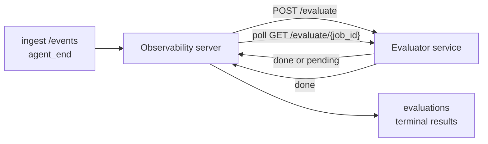

Failproof AI Observability प्रत्येक पूर्ण एजेंट रन को स्वचालित रूप से गुणवत्ता के लिए स्कोर कर सकता है: आप एक छोटी स्कोरिंग सेवा प्रदान करते हैं, और Observability बाकी सब कुछ संभालता है। इसे उन आयामों को ट्रैक करने के लिए उपयोग करें जिन्हें आप महत्व देते हैं (सहायकता, टूल दक्षता, तथ्यपूर्णता, सुरक्षा; आप चुनते हैं), प्रतिगमन जल्दी पकड़ें, और एक नज़र में एजेंट या वातावरण की तुलना करें। स्कोरिंग वैकल्पिक है: सर्वर पर `EVALUATOR_ENDPOINT` सेट न होने तक पाइपलाइन कुछ भी नहीं करता है।

> **नोट:** आप स्कोर आयाम परिभाषित करते हैं। आपका मूल्यांकक किसी भी संख्यात्मक कुंजी को वापस कर सकता है जो वह चाहता है; Observability जो कुछ भी आप भेजते हैं उसे संग्रहीत, ट्रेंड और प्रदर्शित करता है।

## एक नज़र में

1. **एक स्कोरर लिखें।** एक छोटी HTTP सेवा खड़ी करें जो सेशन ट्रांसक्रिप्ट को पढ़ता है और स्कोर लौटाता है। Observability एक कार्यशील संदर्भ भेज देता है जिसे आप कॉपी कर सकते हैं। [SDK के साथ एक मूल्यांकक लिखना](#writing-an-evaluator-with-the-sdk) देखें।
2. **Observability को इसकी ओर इंगित करें।** सर्वर प्रक्रिया पर `EVALUATOR_ENDPOINT` (और एक साझा `EVALUATOR_TOKEN`) सेट करें।
3. **स्कोर को लैंड होते देखें।** हर पूर्ण सेशन को स्वचालित रूप से स्कोर किया जाता है; परिणाम सेशन विवरण पृष्ठ, सेशन ग्रिड, और सहेजे गए डैशबोर्ड पर दिखाई देते हैं।


*एक बार मूल्यांकक कॉन्फ़िगर किए जाने के बाद, प्रत्येक पूर्ण रन को स्कोर किया जाता है और परिणाम सेशन की दाहिनी पट्टी में दिखाई देते हैं: शीर्ष पर सारांश, फिर प्रति-आयाम स्कोर बार और तर्क के साथ।*

---

## यह कैसे काम करता है



जब Observability SDK किसी सेशन के लिए `agent_end` इवेंट उत्सर्जित करता है, तो सर्वर एक मूल्यांकन शेड्यूल करता है। यह तब पूरी इवेंट ट्रांसक्रिप्ट को आपकी मूल्यांकन सेवा पर POST करता है, जो निम्न में से कोई भी कर सकता है:

- **परिणाम को इनलाइन लौटाएं** `{"status":"done", "scores":{...}, "reasoning":{...}, "summary":"..."}` के साथ। परिणाम सेशन की मूल्यांकन समयरेखा में जोड़ा जाता है। `reasoning` और `summary` वैकल्पिक हैं।
- **`{"status":"pending", "job_id":"abc-123"}`** के साथ स्थगित करें। Observability तब `GET {EVALUATOR_ENDPOINT}/evaluate/abc-123` को कॉल करता है जब तक आपका मूल्यांकक `{"status":"done", ...}` या `{"status":"error", "error":"..."}` लौटाता है।

  पोलिंग कैडेंस प्रति-कार्य है: एक `pending` प्रतिक्रिया `next_poll_secs` को ओवरराइड करने के लिए शामिल कर सकती है; अन्यथा Observability `GET /config` से `default_poll_interval_secs` मान का उपयोग करता है; अन्यथा सर्वर `EVALUATOR_POLLING_INTERVAL_SECS` पर वापस आता है (डिफ़ॉल्ट 10s)। सभी मान [1s, 1h] तक सीमित हैं।

जो सेशन कभी `agent_end` उत्सर्जित नहीं करते हैं (उदाहरण के लिए, एक क्रैश हुई एजेंट प्रक्रिया) को भी उठाया जा सकता है: मूल्यांकक का `GET /config` `{"inactivity_timeout_secs": 1800}` लौटा सकता है, और Observability किसी भी सेशन का मूल्यांकन करेगा जो उस लंबे समय के लिए निष्क्रिय रहा है। इस फॉलबैक को अक्षम करने के लिए फ़ील्ड को `null` पर सेट करें या इसे छोड़ दें।

जब `EVALUATOR_ENDPOINT` सेट नहीं होता है तो पाइपलाइन पूरी तरह no-op है।

एक सेशन समय के साथ **कई टर्मिनल मूल्यांकन जमा कर सकता है**: प्रत्येक `agent_end` इवेंट (और डैशबोर्ड से प्रत्येक मैनुअल री-इवल) एक ताज़ा मूल्यांकन पंक्ति जोड़ता है। यह एक पुनः शुरू किए गए वार्तालाप का मूल्यांकन करने का समर्थित तरीका है: एक उपयोगकर्ता एक एजेंट को समाप्त करता है, बाद में वापस आता है, अधिक इवेंट भेजता है, एजेंट को फिर से समाप्त करता है, और एक दूसरा मूल्यांकन पूर्ण अद्यतन ट्रांसक्रिप्ट के विरुद्ध चलता है। डैशबोर्ड सबसे हाल के मूल्यांकन को हेडलाइन के रूप में और पूर्व मूल्यांकन को एक संक्षिप्त समयरेखा के रूप में प्रदर्शित करता है। जबकि एक मूल्यांकन एक सेशन के लिए चल रहा है, उस सेशन के लिए अतिरिक्त `agent_end` इवेंट को अनदेखा किया जाता है; चलने वाले मूल्यांकन के बाद अगला एक सामान्य रूप से एक ताज़ा मूल्यांकन को कतारबद्ध करेगा।

निष्क्रियता फॉलबैक पुनः शुरू किए गए सेशन पर भी फिर से लगता है: यदि पिछले टर्मिनल मूल्यांकन के बाद नई इवेंट आती हैं और सेशन तब `inactivity_timeout_secs` को पास करके निष्क्रिय हो जाता है, तो एक ताज़ा मूल्यांकन कतारबद्ध किया जाता है।

क्षणिक विफलताएं (5xx, 429, टाइमआउट, नेटवर्क त्रुटियां) `EVALUATOR_MAX_ATTEMPTS` तक घातीय बैकऑफ के साथ पुनः प्रयास की जाती हैं; 4xx प्रतिक्रियाएं टर्मिनल हैं। Observability कई क्षैतिज रूप से स्केल किए गए सर्वर उदाहरणों के साथ चलाने के लिए सुरक्षित है; कार्य विभाजित होता है ताकि एक ही सेशन को कभी भी समवर्ती रूप से भेजा न जाए।

---

## HTTP अनुबंध

हर प्रमाणीकृत मार्ग **वाहक टोकन प्रमाणीकरण** का उपयोग करता है। दोनों पक्षों पर एक ही मान कॉन्फ़िगर किया जाना चाहिए:

- Observability सर्वर: env var `EVALUATOR_TOKEN`
- मूल्यांकन सेवा: उसी तरीके से कॉन्फ़िगर किया गया (agenteye-evaluator SDK परंपरा से `EVALUATOR_TOKEN` पढ़ता है)

यदि `EVALUATOR_TOKEN` सेट नहीं है, तो सर्वर कोई `Authorization` हेडर नहीं भेजता है; मूल्यांकक तब गुमनाम अनुरोधों को स्वीकार कर सकता है, जो आंतरिक-केवल नेटवर्क के लिए ठीक है लेकिन सार्वजनिक इंटरनेट पर हतोत्साहित है।

### मूल्यांकक को सेवा देने वाले मार्ग

| मार्ग | बॉडी / पैरामीटर | प्रतिक्रिया |
|---|---|---|
| `GET /health` | कोई नहीं | `{"status":"ok"}` (खुला, प्रमाणीकरण नहीं) |
| `GET /config` | कोई नहीं | `{"inactivity_timeout_secs": <int> \| null, "default_poll_interval_secs": <int> \| omitted}` |
| `POST /evaluate` | `EvalRequest` JSON | `{"status":"done", ...}` या `{"status":"pending", "job_id":"..."}` |
| `GET /evaluate/{id}` | कोई नहीं | `/evaluate` के समान प्रतिक्रिया आकार |

### सर्वर द्वारा भेजा गया `EvalRequest` बॉडी

```json
{
  "schema_version": "1",
  "session_id":     "session-abc123",
  "agent_id":       "planner",
  "environment":    "production",
  "started_at":     "2026-05-10T12:00:00Z",
  "ended_at":       "2026-05-10T12:05:00Z",
  "events": [
    { "id": 1234, "ts": "...", "event_type": "agent_start", "payload": { ... } },
    ...
  ]
}
```

### प्रतिक्रिया आकार

**सिंक (पूर्ण):**

```json
{
  "status": "done",
  "scores": { "helpfulness": 0.85, "tool_efficiency": 0.6 },
  "reasoning": {
    "helpfulness": "answered the question directly with citations",
    "tool_efficiency": "called list_files three times when one would have done"
  },
  "summary": "strong answer quality, weak tool selection"
}
```

`reasoning` (प्रति-स्कोर न्यायसंगतता मैप) और `summary` (एक समग्र एक-पैराग्राफ आख्यान) दोनों वैकल्पिक हैं। `reasoning` में कुंजियां `scores` में कुंजियों को प्रतिबिंबित करनी चाहिए; डैशबोर्ड प्रत्येक प्रविष्टि को अपने स्कोर बार के नीचे इनलाइन प्रस्तुत करता है। पुराने मूल्यांकनकर्ता जो केवल `scores` लौटाते हैं, अपरिवर्तित रहते हैं; `reasoning` और `summary` बस null के रूप में पढ़ते हैं और संबंधित UI सुविधाओं को छोड़ दिया जाता है।

**एसिंक (स्थगित):**

```json
{ "status": "pending", "job_id": "abc-123", "next_poll_secs": 30 }
```

`next_poll_secs` वैकल्पिक है; यदि छोड़ दिया जाता है तो सर्वर `/config` से मूल्यांकक के `default_poll_interval_secs` पर वापस आता है, फिर अपने `EVALUATOR_POLLING_INTERVAL_SECS` env var पर।

**टर्मिनल मूल्यांकक-पक्ष त्रुटि:**

```json
{ "status": "error", "error": "model service unavailable" }
```

सर्वर किसी अन्य 2xx बॉडी को प्रोटोकॉल त्रुटि के रूप में मानता है और सेशन के लिए एक टर्मिनल `error` रिकॉर्ड करता है।

---

## SDK के साथ एक मूल्यांकक लिखना

आपको HTTP अनुबंध को हाथ से लागू करने की आवश्यकता नहीं है। `agenteye-evaluator` Python पैकेज आपको एक टाइपड FastAPI रैपर देता है जो प्रमाणीकरण, रूटिंग, और अनुरोध/प्रतिक्रिया आकार को आपके लिए संभालता है।

Failproof AI Observability एक **कार्यशील संदर्भ मूल्यांकक** भी भेज देता है जो ट्रांसक्रिप्ट के आकार से `helpfulness`, `tool_efficiency`, और `factuality` को स्कोर करता है। इसे एक शुरुआती बिंदु के रूप में कॉपी करें और अपना स्वयं का तर्क स्वैप करें: एक LLM न्यायाधीश, एक नियम इंजन, जो भी आपकी गुणवत्ता बार में फिट बैठता है।

न्यूनतम व्यावहारिक मूल्यांकक:

```python
import os
from agenteye_evaluator import Evaluator, EvalRequest, EvalResponse

app = Evaluator(token=os.environ["EVALUATOR_TOKEN"])

@app.evaluator
def run(req: EvalRequest) -> EvalResponse:
    # Inspect req.events (the full session transcript) and return scores.
    tool_calls = sum(1 for e in req.events if e.event_type == "tool_use")
    return EvalResponse(
        scores={"tool_calls": float(tool_calls)},
        reasoning={"tool_calls": f"{tool_calls} tool invocations in the transcript"},
        summary="tight tool loop" if tool_calls < 5 else "agent looped on tools",
    )
```

`app` उदाहरण किसी भी ASGI सर्वर के अंतर्गत चलता है, इसलिए `uvicorn module:app` इसे शुरू करता है।

जो मूल्यांकनकर्ता महंगे काम को स्थगित करने की आवश्यकता रखते हैं, उन्हें इसके बजाय `JobPending` लौटाना चाहिए और एक `@app.job_lookup` हैंडलर को रजिस्टर करना चाहिए; Observability सर्वर `GET /evaluate/{job_id}` को पोल करता है जब तक आप एक टर्मिनल स्थिति लौटाते हैं या `EVALUATOR_MAX_POLL_DURATION_SECS` कैप (डिफ़ॉल्ट 1 h) समाप्त होता है।

संपूर्ण API संदर्भ, एसिंक पैटर्न, और इवेंट स्कीमा `agenteye-evaluator` SDK के README में प्रलेखित हैं।

---

## आपके मूल्यांकक को चलाना

मूल्यांकक **आपकी सेवा** है — Failproof AI Observability एक डिफ़ॉल्ट मूल्यांकक नहीं भेज देता है, इसलिए आप इसे जहां भी अपनी सेवाओं को चलाते हैं वहां बनाते और चलाते हैं। यह किसी भी ASGI सर्वर के अंतर्गत चलता है (उदाहरण के लिए `uvicorn my_evaluator:app`); [HTTP अनुबंध](#http-contract) से `/health`, `/config`, और `/evaluate` मार्गों को सेवा दें, फिर सर्वर को इस पर इंगित करें ([सर्वर कॉन्फ़िगर करना](#configuring-the-server) देखें)।

एक बार मूल्यांकक पहुंचने योग्य होने के बाद, `GET /health` `{"status":"ok"}` लौटाता है। एक एजेंट के अंत-से-अंत चलने के बाद, सर्वर पर `GET /evaluations` एक `status: "done"` के साथ एक पंक्ति लौटाता है और आपके मूल्यांकक द्वारा उत्पादित स्कोर लौटाता है।

---

## सर्वर कॉन्फ़िगर करना

सर्वर प्रक्रिया पर सेट करें:

| Env var | अर्थ |
|---|---|
| `EVALUATOR_ENDPOINT` | आपके मूल्यांकक का बेस URL (`http://evaluator:9000`)। सेट नहीं = पाइपलाइन अक्षम। |
| `EVALUATOR_TOKEN` | वाहक टोकन। मूल्यांकन सेवा के साथ कॉन्फ़िगर किए गए मान के बराबर होना चाहिए। |
| `EVALUATOR_WORKERS` | सर्वर उदाहरण प्रति कार्य कार्य (डिफ़ॉल्ट 2)। |
| `EVALUATOR_CLAIM_BATCH` | कार्यकर्ता टिक प्रति पंक्तियां दावा की गई (डिफ़ॉल्ट 4)। बैच **समवर्ती** रूप से संसाधित होते हैं; आपके मूल्यांकक एंडपॉइंट पर प्रभावी समवर्तिता `EVALUATOR_WORKERS × EVALUATOR_CLAIM_BATCH` है। |
| `EVALUATOR_POLL_IDLE_SECS` | एक कार्यकर्ता कितने समय के लिए सोता है जब कोई मूल्यांकन डिस्पैच प्रयास में कारण न हो (डिफ़ॉल्ट 2s)। |
| `EVALUATOR_POLLING_INTERVAL_SECS` | अंतिम फॉलबैक `GET /evaluate/{id}` कैडेंस के लिए जब न तो प्रति-प्रतिक्रिया `next_poll_secs` और न ही मूल्यांकक का `default_poll_interval_secs` सेट हो (डिफ़ॉल्ट 10s)। |
| `EVALUATOR_REQUEST_TIMEOUT_MS` | प्रति-अनुरोध टाइमआउट (डिफ़ॉल्ट 30000)। |
| `EVALUATOR_MAX_ATTEMPTS` | इस कई क्षणिक विफलताओं के बाद परिणाम को टर्मिनल `error` के रूप में रिकॉर्ड किया जाता है (डिफ़ॉल्ट 5)। |
| `EVALUATOR_CONFIG_REFRESH_SECS` | `GET /config` कैडेंस (डिफ़ॉल्ट 300)। |
| `EVALUATOR_MAX_POLL_DURATION_SECS` | अधिकतम वॉलक्लॉक समय एक सेशन पोलिंग कतार में `timeout` के रूप में समाप्त होने से पहले रह सकता है (डिफ़ॉल्ट 3600s)। एक मूल्यांकक के खिलाफ गार्ड जो हमेशा के लिए `pending` लौटाता रहता है। |

स्वचालित स्कोरिंग चालू करने के लिए, सर्वर पर `EVALUATOR_ENDPOINT` और `EVALUATOR_TOKEN` दोनों सेट करें, फिर परिवर्तन को उठाने के लिए इसे पुनः शुरू करें। `EVALUATOR_ENDPOINT` सेट न होने के साथ पाइपलाइन एक no-op रहता है।

ऊपर ट्यूनिंग नॉब्स वैकल्पिक हैं; केवल सर्वर पर संबंधित पर्यावरण चर सेट करें यदि आपको डिफ़ॉल्ट को ओवरराइड करने की आवश्यकता है।

---

## API संदर्भ

| विधि | पथ | आवश्यक अनुमति | उद्देश्य |
|---|---|---|---|
| `GET` | `/evaluations` | `evaluations:read` | टर्मिनल परिणामों को क्वेरी करें। `session_id`, `agent_id`, `environment`, `status` (`done`/`error`/`timeout`), `ts_from`, `ts_to`, `cursor`, `limit`, `score_filters`, `latest_per_session` का समर्थन करता है। `limit` डिफ़ॉल्ट 50 है और 200 पर सीमित है (ध्यान दें यह `/events` से भिन्न है, जो 1000 पर सीमित है)। `environment` एक अल्पविराम-पृथक सूची स्वीकार करता है (जैसे `environment=prod,staging`); एकल मान अभी भी काम करते हैं। `latest_per_session=true` के साथ प्रतिक्रिया में अधिकतम एक पंक्ति प्रति `session_id` (सबसे हाल की `completed_at` द्वारा) होती है जो सेशन-सूची पृष्ठ द्वारा सेशन की मूल्यांकन समयरेखा को इसकी वर्तमान हेडलाइन में संक्षिप्त करने के लिए उपयोग की जाती है। डिफ़ॉल्ट गलत है (पूरा इतिहास लौटाता है)। |
| `GET` | `/evaluations/aggregate` | `evaluations:read` | फ़िल्टर किए गए स्लाइस के लिए रोल्ड-अप eval स्वास्थ्य: कुल गणना, एक done/error/timeout ब्रेकडाउन, प्रति-स्कोर-कुंजी आँकड़े (मनमाने `scores` कुंजियों के ऊपर गणना/औसत/न्यूनतम/अधिकतम/p50), और एक समय-बकेटेड समयरेखा। `/evaluations` के समान फ़िल्टर पैरामीटर प्लस `featured_keys` (ट्रेंड करने के लिए स्कोर कुंजियों का CSV) और `latest_per_session` स्वीकार करता है। डैशबोर्ड सुविधा को शक्ति देता है; मेट्रिक्स पूरे मेल खाने वाले सेट पर सटीक हैं, नहीं नमूना किया गया। |
| `GET` | `/evaluations/environments` | `evaluations:read` | `evaluations` तालिका से अलग पर्यावरण मान। मूल्यांकन-पठनीय डेटा को सीमित करने वाले फ़िल्टर ड्रॉपडाउन को भरने के लिए उपयोग किया जाता है। |
| `GET` | `/evaluation-jobs` | `evaluations:read` | चलन-मध्य मूल्यांकनों में दृश्यमानता। `status` (`pending`/`polling`) द्वारा फ़िल्टर करें। |
| `GET` | `/events` | `events:read` | एक सेशन की कच्ची इवेंट को स्ट्रीम करें। `session_id`, `agent_id`, `event_type` (CSV), `environment` (CSV), `ts_from`, `ts_to`, `cursor`, `limit`, और `order` का समर्थन करता है। `order` `desc` (सबसे नई-पहले, डिफ़ॉल्ट) या `asc` (सबसे पुरानी-पहले) है; एक अपहचाना मान `desc` पर वापस आता है। प्रतिक्रिया के `next_cursor` (एक इवेंट id) के माध्यम से कर्सर-पेजिनेट करें: अगला पृष्ठ प्राप्त करने के लिए इसे `cursor` के रूप में पास करें; `asc` के साथ अगला पृष्ठ उस id के बाद की इवेंट है, `desc` के साथ इसके पहले की इवेंट है। `limit` डिफ़ॉल्ट 50 है और 1000 पर सीमित है। |
| `GET` | `/sessions/:session_id/export` | `events:read` | यह सटीक JSON बॉडी लौटाता है जो मूल्यांकक इस सेशन के लिए प्राप्त करेगा, `session-<id>.json` नामित एक डाउनलोड योग्य अनुलग्नक के रूप में सेवा की गई। ऑफ़लाइन परीक्षण के लिए उत्पादन सेशन को `agenteye-evaluator` के माध्यम से चलाना उपयोगी है। बाइट्स बाइट-समान हैं मूल्यांकक पाइपलाइन भेजने वाले को। |
| `POST` | `/sessions/:session_id/re-evaluate` | `evaluations:trigger` | एक सेशन के लिए एक ताज़ा मूल्यांकन कतारबद्ध करें; चाहे एक पूर्व मूल्यांकन मौजूद हो। नया परिणाम सेशन की मूल्यांकन समयरेखा में **जोड़ा जाता है** पूर्व को ओवरराइट करने के बजाय, इसलिए पूर्व स्कोर इतिहास के रूप में दृश्यमान रहते हैं। कतारबद्ध पर `202`, अज्ञात सेशन के लिए `404`, यदि एक मूल्यांकन पहले से चल रहा है तो `409` लौटाता है। एक नए मूल्यांकक को तैनात करने के बाद, या सेशन के लिए जो कभी `agent_end` उत्सर्जित नहीं करते हैं, इसका उपयोग करें। |

### स्कोर रेंज द्वारा फ़िल्टर करना: `score_filters`

`GET /evaluations` एक वैकल्पिक `score_filters` पैरामीटर स्वीकार करता है जो `scores` ऑब्जेक्ट के अंदर संख्यात्मक मानों द्वारा परिणामों को संकीर्ण करता है। पैरामीटर `key:min..max` प्रविष्टियों की एक अल्पविराम-पृथक सूची है; किसी भी सीमा को छोड़ा जा सकता है। कई प्रविष्टियां तार्किक AND के साथ मिलती हैं। जहां नामित कुंजी अनुपस्थित या गैर-संख्यात्मक है, पंक्तियों को बाहर रखा जाता है। एक अनुरोध में अधिकतम 20 फ़िल्टर प्रविष्टियां हो सकती हैं; उससे अधिक HTTP 400 लौटाता है।

उदाहरण:
```text
# helpfulness in [0.5, 0.8]
GET /evaluations?score_filters=helpfulness:0.5..0.8

# tool_efficiency at most 0.3 (no lower bound)
GET /evaluations?score_filters=tool_efficiency:..0.3

# helpfulness >= 0.5 AND factuality >= 0.9
GET /evaluations?score_filters=helpfulness:0.5..,factuality:0.9..
```

प्रत्येक `/evaluations` प्रतिक्रिया ऑब्जेक्ट के ये फ़ील्ड हैं:

| फ़ील्ड | प्रकार | नोट्स |
|---|---|---|
| `evaluation_id` | string (UUID) | इस टर्मिनल मूल्यांकन के लिए विहित पहचानकर्ता। प्रत्येक टर्मिनल मूल्यांकन को एक नया UUID मिलता है; एक एकल सेशन कई धारण कर सकता है। |
| `id` | string (UUID) | पश्चादृश्यता उपनाम `evaluation_id` के समान मान ले जा रहा है। |
| `session_id` | string | वह सेशन जिसके विरुद्ध यह मूल्यांकन चलाया गया। एक सेशन समयरेखा में कई मूल्यांकन हो सकते हैं। |
| `agent_id` | string | एजेंट को पहचानता है जिसने सेशन का उत्पादन किया। |
| `environment` | string | पर्यावरण लेबल सेशन से कॉपी किया गया। |
| `status` | enum | `"done"`, `"error"`, `"timeout"` में से एक। |
| `scores` | object \| null | आपके मूल्यांकक द्वारा लौटाए गए स्कोर। |
| `reasoning` | object \| null | आपके मूल्यांकक द्वारा लौटाया गया वैकल्पिक प्रति-स्कोर न्यायसंगतता मैप। कुंजियां आम तौर पर `scores` में उनके साथ प्रतिबिंबित करती हैं। डैशबोर्ड प्रत्येक प्रविष्टि को अपने स्कोर बार के नीचे प्रस्तुत करता है। |
| `summary` | string \| null | आपके मूल्यांकक द्वारा लौटाया गया वैकल्पिक एक-पैराग्राफ समग्र आख्यान। डैशबोर्ड इसे प्रति-स्कोर ब्रेकडाउन के ऊपर मूल्यांकन की हेडलाइन के रूप में प्रस्तुत करता है। |
| `error` | string \| null | केवल `"error"` / `"timeout"` पर भरा गया। |
| `attempt_count` | integer | डिस्पैच प्रयासों की संख्या (≥ 1)। |
| `duration_ms` | integer \| null | अंतिम प्रयास की अवधि। |
| `completed_at` | string (ISO 8601 UTC) | जब टर्मिनल परिणाम रिकॉर्ड किया गया। परिणाम `completed_at` द्वारा क्रमबद्ध हैं (सबसे नई पहली)। |
| `created_at` | string (ISO 8601 UTC) | `completed_at` के समान टाइमस्टैम्प लेता है (एक बार लिखना शब्दार्थ)। |

---

## अनुमतियां

| अनुमति | अनुदान |
|---|---|
| `evaluations:read` | मूल्यांकन परिणामों को सूचीबद्ध करें, डैशबोर्ड में स्कोर देखें, और डैशबोर्ड स्वास्थ्य मेट्रिक्स लोड करें। |
| `evaluations:trigger` | `POST /sessions/:session_id/re-evaluate` या डैशबोर्ड के री-इवल्यूएट बटन के माध्यम से एक सेशन के लिए मैनुअल रूप से एक मूल्यांकन कतारबद्ध करें। |
| `dashboards:read` | सहेजे गए डैशबोर्ड देखें (उनकी मेट्रिक्स लोड करने के लिए `evaluations:read` भी चाहिए)। |
| `dashboards:write` | डैशबोर्ड बनाएं और संपादित करें। |
| `dashboards:delete` | डैशबोर्ड हटाएं। |

बूटस्ट्रैप व्यवस्थापक (`ADMIN_KEY`, `ADMIN_EMAIL`) स्वचालित रूप से ये प्राप्त करता है।

---

## परिणाम देखना

- **`/sessions/<id>`**: इवेंट समयरेखा + दाहिनी ओर की पट्टी सेशन के स्कोर और डिस्पैच प्रयास से किसी भी त्रुटि दिखाती है। यदि आपकी कुंजी के पास `evaluations:trigger` है, तो निर्यात बटन के आगे एक **री-इवल्यूएट** बटन दिखाई देता है, सेशन के लिए उपयोगी जो कभी `agent_end` उत्सर्जित नहीं करते हैं, या एक नए मूल्यांकक को तैनात करने के बाद स्कोर को ताज़ा करने के लिए। डैशबोर्ड नई परिणाम के लिए पोल करता है और यह लैंड करने पर दाहिनी ओर की पट्टी को अपडेट करता है।
- **`/sessions`**: फ़िल्टर योग्य सेशन ग्रिड; स्कोर कॉलम प्रत्येक सेशन की मूल्यांकन स्थिति और स्कोर को एक नज़र में दिखाता है।
- **`/dashboards`**: सहेजे गए eval-स्वास्थ्य दृश्य ([डैशबोर्ड](#dashboards) नीचे देखें)।


*सेशन ग्रिड प्रत्येक रन की मूल्यांकन स्थिति और स्कोर को एक नज़र में दिखाता है; लाल/एम्बर/हरे बैज निम्न स्कोर को उछाल देते हैं।*

---

## डैशबोर्ड

**डैशबोर्ड** पृष्ठ (`/dashboards`) आपको एक नामित, पुनः प्रयोज्य दृश्य के रूप में मूल्यांकन फ़िल्टर का एक संयोजन सहेजने देता है और देखता है कि मूल्यांकन के उस स्लाइस को एक नज़र में कैसे प्राप्त करते हैं। डैशबोर्ड **आपके पूरे संगठन में साझा किए जाते हैं**; `dashboards:read` के साथ सभी समान सेट देखते हैं।

प्रत्येक डैशबोर्ड पिन:

- **फ़िल्टर**: सेशन पृष्ठ के समान नियंत्रण: पर्यावरण, स्थिति, एजेंट, एक रोलिंग समय विंडो, और स्कोर-रेंज फ़िल्टर (`key:min..max`)।
- **एक प्रदर्शन कॉन्फ़िगरेशन**: कौन सी स्कोर कुंजियां सुविधा देने के लिए, हरे/एम्बर/लाल स्वास्थ्य थ्रेशहोल्ड, कौन से पैनल दिखाने के लिए, और क्या प्रति सेशन नवीनतम मूल्यांकन को संक्षिप्त करना है।

प्रत्येक कार्ड मेल खाने वाले सेशन की संख्या, एक done/error/timeout ब्रेकडाउन, प्रत्येक विशेषता स्कोर का औसत, और एक छोटी प्रवृत्ति स्पार्कलाइन दिखाता है। एक डैशबोर्ड खोलने से पूर्ण आकार के पैनल दिखाई देते हैं; **"सेशन में खोलें"** आपको सेशन पृष्ठ में बिल्कुल उस स्लाइस में पूर्व-फ़िल्टर किया हुआ गिराता है। मेट्रिक्स पूरे मेल खाने वाले सेट के ऊपर सर्वर-पक्ष पर गणना की जाती हैं (`GET /evaluations/aggregate` के माध्यम से), इसलिए संख्याएं नहीं बल्कि सटीक हैं।


**अनुमतियां:** देखने के लिए `dashboards:read` और `evaluations:read` दोनों की आवश्यकता है; बनाने और संपादित करने के लिए `dashboards:write` की आवश्यकता है; हटाने के लिए `dashboards:delete` की आवश्यकता है। बूटस्ट्रैप व्यवस्थापक स्वचालित रूप से सभी प्राप्त करता है।

---

## समस्या निवारण

**सेशन मौजूद हैं लेकिन कोई मूल्यांकन नहीं बनाए जाते हैं।** सुनिश्चित करें कि सर्वर प्रक्रिया पर `EVALUATOR_ENDPOINT` सेट है, सर्वर और मूल्यांकक समान `EVALUATOR_TOKEN` मान साझा करते हैं, और मूल्यांकक का `/health` एंडपॉइंट सर्वर से पहुंचने योग्य है। `EVALUATOR_ENDPOINT` सेट नहीं होने पर पाइपलाइन एक no-op है।

**चलन-मध्य मूल्यांकन ढेर हो जाते हैं।** चलन-मध्य कतार देखने के लिए `GET /evaluation-jobs` को क्वेरी करें। प्रत्येक पंक्ति पर `attempt_count`, `next_attempt_at`, और `last_error` का निरीक्षण करें। सामान्य कारण: मूल्यांकन सेवा अप्राप्य या 5xx लौटा रहा है (बैकऑफ के साथ पुनः प्रयास किया गया), गलत `EVALUATOR_TOKEN` (401 टर्मिनल है), या एक एसिंक मूल्यांकक जो अनिश्चित काल तक `pending` लौटाता है (नीचे देखें)।

**सेशन पूरे हुए लेकिन कोई टर्मिनल मूल्यांकन नहीं।** `GET /evaluation-jobs?status=polling` को क्वेरी करें; परिणाम अभी भी चल रहा हो सकता है। यदि कोई कार्य `pending` में फंस जाता है, तो सर्वर को मूल्यांकक तक पहुंचने में परेशानी हो रही है; सुनिश्चित करें कि मूल्यांकक ऊपर है और `EVALUATOR_TOKEN` मेल खाता है।

**`HTTP 401 from evaluator: invalid bearer token`।** सर्वर पर `EVALUATOR_TOKEN` मूल्यांकन सेवा के साथ कॉन्फ़िगर किए गए मान से मेल नहीं खाता। वे समान होने चाहिए।

**एसिंक मूल्यांकक अनिश्चित काल तक `pending` लौटाता है।** सर्वर `GET /evaluate/{job_id}` को पोल करता है जब तक मूल्यांकक `done` या `error` लौटाता है, या जब तक `EVALUATOR_MAX_POLL_DURATION_SECS` (डिफ़ॉल्ट 1 h) समाप्त हो जाता है। कैप के बाद मूल्यांकन `timeout` के रूप में रिकॉर्ड किया जाता है और चलन-मध्य कतार से हटा दिया जाता है। यदि आपके मूल्यांकक को वास्तव में डिफ़ॉल्ट से अधिक समय की आवश्यकता है तो `EVALUATOR_MAX_POLL_DURATION_SECS` बढ़ाएं।

---

## अगले कदम

- [मूल्यांकक एजेंट कौशल](/hi/agenteye/evaluator-skill): एक कोडिंग एजेंट को वास्तविक सेशन के विरुद्ध आपके आयामों को डिजाइन करने और यह सेवा आपके लिए बनाने के लिए हो।
- [Python SDK](/hi/agenteye/python-sdk): स्कोरिंग को ट्रिगर करने वाली `agent_end` इवेंट उत्सर्जित करें।
- [API कुंजियां](/hi/agenteye/api-keys): `evaluations:read` और `evaluations:trigger` अनुमतियां।
- [ऑडिट](/hi/agenteye/audits): Observability की अन्य स्वचालित गुणवत्ता सुविधा, नीति-आधारित समीक्षा के लिए।