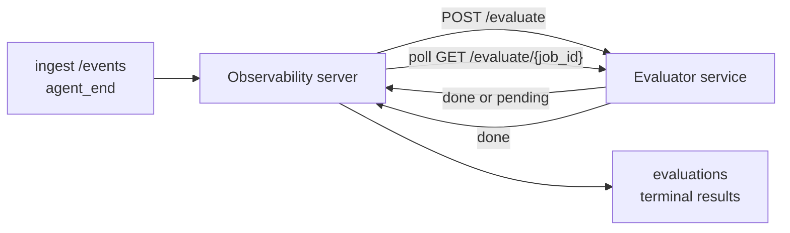

Failproof AI Observability हर पूर्ण एजेंट रन को गुणवत्ता के लिए स्वचालित रूप से स्कोर कर सकता है: आप एक छोटी स्कोरिंग सेवा प्रदान करते हैं, और Observability बाकी सब कुछ संभालता है। इसका उपयोग उन आयामों को ट्रैक करने के लिए करें जिनकी आपको परवाह है (सहायकता, टूल दक्षता, तथ्यात्मकता, सुरक्षा; आप चुनते हैं), प्रतिगमन जल्दी पकड़ें, और एजेंट या वातावरण की तुलना एक नज़र में करें। स्कोरिंग वैकल्पिक है: पाइपलाइन तब तक कुछ नहीं करती जब तक आप सर्वर पर `EVALUATOR_ENDPOINT` सेट नहीं करते।

> **नोट:** आप स्कोर आयामों को परिभाषित करते हैं। आपका मूल्यांकनकर्ता किसी भी संख्यात्मक कुंजी को वापस कर सकता है जो वह चाहता है; Observability जो भी आप भेजते हैं उसे संग्रहीत, ट्रेंड और प्रदर्शित करता है।

## एक नज़र में

1. **एक स्कोरर लिखें।** एक छोटी HTTP सेवा बनाएं जो एक सेशन ट्रांसक्रिप्ट पढ़ता है और स्कोर लौटाता है। Observability एक कार्यशील संदर्भ शिप करता है जिसे आप कॉपी कर सकते हैं। [SDK के साथ एक मूल्यांकनकर्ता लिखना](#writing-an-evaluator-with-the-sdk) देखें।
2. **Observability को इसकी ओर इशारा करें।** सर्वर प्रक्रिया पर `EVALUATOR_ENDPOINT` (और एक साझा `EVALUATOR_TOKEN`) सेट करें।
3. **स्कोर आते हुए देखें।** हर पूर्ण सेशन को स्वचालित रूप से स्कोर किया जाता है; परिणाम सेशन विवरण पृष्ठ, सेशन ग्रिड और सहेजे गए डैशबोर्ड पर दिखाई देते हैं।


*एक बार मूल्यांकनकर्ता कॉन्फ़िगर हो जाने के बाद, प्रत्येक पूर्ण रन को स्कोर किया जाता है और परिणाम सेशन की दाईं ओर दिखाई देते हैं: ऊपर सारांश, फिर तर्क के साथ प्रति-आयाम स्कोर बार।*

---

## यह कैसे काम करता है



जब Observability SDK किसी सेशन के लिए `agent_end` इवेंट उत्सर्जित करता है, तो सर्वर एक मूल्यांकन शेड्यूल करता है। यह फिर पूरी इवेंट ट्रांसक्रिप्ट आपकी मूल्यांकनकर्ता सेवा को POST करता है, जो या तो:

- **परिणाम को इनलाइन लौटाएं** `{"status":"done", "scores":{...}, "reasoning":{...}, "summary":"..."}` के साथ। परिणाम सेशन की मूल्यांकन समयरेखा में जोड़ा जाता है। `reasoning` और `summary` वैकल्पिक हैं।
- **स्थगित करें** `{"status":"pending", "job_id":"abc-123"}` के साथ। Observability फिर `GET {EVALUATOR_ENDPOINT}/evaluate/abc-123` को कॉल करता है जब तक आपका मूल्यांकनकर्ता `{"status":"done", ...}` या `{"status":"error", "error":"..."}` लौटाता है।

  पोलिंग गति प्रति-कार्य है: एक `pending` प्रतिक्रिया `next_poll_secs` को ओवरराइड करने के लिए शामिल कर सकती है; अन्यथा Observability `GET /config` से `default_poll_interval_secs` मान का उपयोग करता है; अन्यथा सर्वर `EVALUATOR_POLLING_INTERVAL_SECS` (डिफ़ॉल्ट 10s) को फॉलबैक करता है। सभी मान [1s, 1h] में क्लैम्प किए जाते हैं।

जो सेशन कभी `agent_end` उत्सर्जित नहीं करते (उदाहरण के लिए, एक क्रैश हुई एजेंट प्रक्रिया) उन्हें भी उठाया जा सकता है: मूल्यांकनकर्ता का `GET /config` `{"inactivity_timeout_secs": 1800}` लौटा सकता है, और Observability किसी भी सेशन का मूल्यांकन करेगा जो उस लंबे समय के लिए निष्क्रिय हो गया है। इस फॉलबैक को अक्षम करने के लिए फ़ील्ड को `null` पर सेट करें या इसे छोड़ दें।

जब `EVALUATOR_ENDPOINT` अनसेट होता है तो पाइपलाइन पूरी तरह से no-op होती है।

एक सेशन समय के साथ **कई टर्मिनल मूल्यांकन जमा कर सकता है**: प्रत्येक `agent_end` इवेंट (और डैशबोर्ड से प्रत्येक मैनुअल पुनः-मूल्य) एक ताजा मूल्यांकन पंक्ति जोड़ता है। यह एक पुनः सेशन का मूल्यांकन करने का समर्थित तरीका है: एक उपयोगकर्ता एक एजेंट को समाप्त करता है, बाद में वापस आता है, अधिक इवेंट भेजता है, एजेंट को फिर से समाप्त करता है, और एक दूसरा मूल्यांकन पूरी अद्यतन ट्रांसक्रिप्ट के विरुद्ध चलता है। डैशबोर्ड सबसे हाल के मूल्यांकन को हेडलाइन के रूप में प्रस्तुत करता है और पूर्व के मूल्यांकन को एक संक्षिप्त समयरेखा के रूप में प्रस्तुत करता है। जब एक सेशन के लिए एक मूल्यांकन चल रहा हो, उस सेशन के लिए अतिरिक्त `agent_end` इवेंट को अनदेखा किया जाता है; चलने वाले मूल्यांकन के पूरा होने के बाद अगला एक सामान्य रूप से एक ताजा मूल्यांकन को कतार में डालेगा।

निष्क्रियता फॉलबैक पुनः सेशन पर भी पुनः संलग्न होता है: यदि पूर्व टर्मिनल मूल्यांकन के बाद नई घटनाएं आती हैं और सेशन फिर `inactivity_timeout_secs` के बाद निष्क्रिय हो जाता है, तो एक ताजा मूल्यांकन को कतारबद्ध किया जाता है।

अस्थायी विफलताएं (5xx, 429, टाइमआउट, नेटवर्क त्रुटियां) `EVALUATOR_MAX_ATTEMPTS` तक घातीय बैकऑफ के साथ पुनः प्रयास की जाती हैं; 4xx प्रतिक्रियाएं टर्मिनल हैं। Observability कई क्षैतिज-स्केल किए गए सर्वर उदाहरणों के साथ चलाने के लिए सुरक्षित है; कार्य को विभाजित किया जाता है ताकि एक ही सेशन को कभी एक साथ दो बार भेजा न जाए।

---

## HTTP अनुबंध

हर प्रमाणित मार्ग **असहायक टोकन प्रमाणीकरण** का उपयोग करता है। समान मूल्य दोनों पक्षों पर कॉन्फ़िगर किया जाना चाहिए:

- Observability सर्वर: env var `EVALUATOR_TOKEN`
- मूल्यांकनकर्ता सेवा: समान तरीके से कॉन्फ़िगर किया गया (the `agenteye-evaluator` SDK सम्मेलन द्वारा `EVALUATOR_TOKEN` पढ़ता है)

यदि `EVALUATOR_TOKEN` अनसेट है, तो सर्वर कोई `Authorization` हेडर नहीं भेजता; मूल्यांकनकर्ता फिर अनाम अनुरोधों को स्वीकार कर सकता है, जो आंतरिक-केवल नेटवर्क के लिए ठीक है लेकिन सार्वजनिक इंटरनेट पर हतोत्साहित किया जाता है।

### मूल्यांकनकर्ता को सेवा करने वाले मार्ग

| मार्ग | बॉडी / पैरामीटर | प्रतिक्रिया |
|---|---|---|
| `GET /health` | कोई नहीं | `{"status":"ok"}` (खुला, कोई प्रमाणीकरण नहीं) |
| `GET /config` | कोई नहीं | `{"inactivity_timeout_secs": <int> \| null, "default_poll_interval_secs": <int> \| omitted}` |
| `POST /evaluate` | `EvalRequest` JSON | `{"status":"done", ...}` या `{"status":"pending", "job_id":"..."}` |
| `GET /evaluate/{id}` | कोई नहीं | `/evaluate` के समान प्रतिक्रिया आकार |

### सर्वर द्वारा भेजा गया `EvalRequest` बॉडी

```json
{
  "schema_version": "1",
  "session_id":     "session-abc123",
  "agent_id":       "planner",
  "environment":    "production",
  "started_at":     "2026-05-10T12:00:00Z",
  "ended_at":       "2026-05-10T12:05:00Z",
  "events": [
    { "id": 1234, "ts": "...", "event_type": "agent_start", "payload": { ... } },
    ...
  ]
}
```

### प्रतिक्रिया आकार

**सिंक (पूर्ण):**

```json
{
  "status": "done",
  "scores": { "helpfulness": 0.85, "tool_efficiency": 0.6 },
  "reasoning": {
    "helpfulness": "answered the question directly with citations",
    "tool_efficiency": "called list_files three times when one would have done"
  },
  "summary": "strong answer quality, weak tool selection"
}
```

`reasoning` (एक प्रति-स्कोर औचित्य मानचित्र) और `summary` (एक समग्र एक-पैराग्राफ आख्यान) दोनों वैकल्पिक हैं। `reasoning` में कुंजियां `scores` में कुंजियों को प्रतिबिंबित करनी चाहिए; डैशबोर्ड प्रत्येक प्रविष्टि को इसके स्कोर बार के नीचे इनलाइन प्रस्तुत करता है। पुराने मूल्यांकनकर्ता जो केवल `scores` लौटाते हैं वे अपरिवर्तित जारी रहते हैं; `reasoning` और `summary` केवल null के रूप में पढ़ते हैं और संबंधित UI सुविधाएं हटा दी जाती हैं।

**अनुकूलन (स्थगित):**

```json
{ "status": "pending", "job_id": "abc-123", "next_poll_secs": 30 }
```

`next_poll_secs` वैकल्पिक है; यदि छोड़ा जाता है तो सर्वर `/config` से मूल्यांकनकर्ता के `default_poll_interval_secs` में गिरता है, फिर इसके स्वयं के `EVALUATOR_POLLING_INTERVAL_SECS` env var में।

**टर्मिनल मूल्यांकनकर्ता-पक्ष त्रुटि:**

```json
{ "status": "error", "error": "model service unavailable" }
```

सर्वर किसी अन्य 2xx बॉडी को प्रोटोकॉल त्रुटि के रूप में मानता है और सेशन के लिए एक टर्मिनल `error` रिकॉर्ड करता है।

---

## SDK के साथ एक मूल्यांकनकर्ता लिखना

आपको HTTP अनुबंध को हाथ से लागू नहीं करना है। `agenteye-evaluator` Python पैकेज आपको एक टाइप्ड FastAPI रैपर देता है जो प्रमाणीकरण, रूटिंग और अनुरोध/प्रतिक्रिया आकारों को आपके लिए संभालता है।

Failproof AI Observability भी एक **कार्यशील संदर्भ मूल्यांकनकर्ता** शिप करता है जो ट्रांसक्रिप्ट के आकार से `helpfulness`, `tool_efficiency` और `factuality` को स्कोर करता है। इसे एक प्रारंभिक बिंदु के रूप में कॉपी करें और अपनी स्वयं की तर्क में स्वैप करें: एक LLM न्यायाधीश, एक नियम इंजन, जो भी आपकी गुणवत्ता पट्टी को फिट करता है।

न्यूनतम व्यवहार्य मूल्यांकनकर्ता:

```python
import os
from agenteye_evaluator import Evaluator, EvalRequest, EvalResponse

app = Evaluator(token=os.environ["EVALUATOR_TOKEN"])

@app.evaluator
def run(req: EvalRequest) -> EvalResponse:
    # Inspect req.events (the full session transcript) and return scores.
    tool_calls = sum(1 for e in req.events if e.event_type == "tool_use")
    return EvalResponse(
        scores={"tool_calls": float(tool_calls)},
        reasoning={"tool_calls": f"{tool_calls} tool invocations in the transcript"},
        summary="tight tool loop" if tool_calls < 5 else "agent looped on tools",
    )
```

`app` उदाहरण किसी भी ASGI सर्वर के तहत चलता है, तो `uvicorn module:app` इसे शुरू करता है।

उन मूल्यांकनकर्ताओं के लिए जिन्हें महंगे कार्य को स्थगित करने की आवश्यकता है, इसके बजाय `JobPending` लौटाएं और एक `@app.job_lookup` हैंडलर पंजीकृत करें; Observability सर्वर `GET /evaluate/{job_id}` को तब तक पोल करता है जब तक आप एक टर्मिनल स्थिति लौटाते हैं या `EVALUATOR_MAX_POLL_DURATION_SECS` कैप (डिफ़ॉल्ट 1 h) बीत जाते हैं।

संपूर्ण API संदर्भ, अनुकूलन पैटर्न और इवेंट स्कीमा `agenteye-evaluator` SDK के README में प्रलेखित हैं।

---

## आपके मूल्यांकनकर्ता को चलाना

मूल्यांकनकर्ता **आपकी सेवा** है — Failproof AI Observability एक डिफ़ॉल्ट मूल्यांकनकर्ता शिप नहीं करता, इसलिए आप इसे जहां आप अपनी स्वयं की सेवाएं चलाते हैं वहां बनाते और चलाते हैं। यह किसी भी ASGI सर्वर के तहत चलता है (उदाहरण के लिए `uvicorn my_evaluator:app`); [HTTP अनुबंध](#http-contract) से `/health`, `/config` और `/evaluate` मार्गों को सेवा दें, फिर सर्वर को इसकी ओर इशारा करें ([सर्वर कॉन्फ़िगर करना](#configuring-the-server) देखें)।

एक बार मूल्यांकनकर्ता पहुंचने योग्य हो, `GET /health` `{"status":"ok"}` लौटाता है। एक एजेंट अंत-से-अंत चलने के बाद, सर्वर पर `GET /evaluations` एक पंक्ति के साथ `status: "done"` और आपके मूल्यांकनकर्ता द्वारा उत्पादित स्कोर लौटाता है।

---

## सर्वर कॉन्फ़िगर करना

सर्वर प्रक्रिया पर सेट करें:

| Env var | अर्थ |
|---|---|
| `EVALUATOR_ENDPOINT` | आपके मूल्यांकनकर्ता का आधार URL (`http://evaluator:9000`)। अनसेट = पाइपलाइन अक्षम। |
| `EVALUATOR_TOKEN` | असहायक टोकन। मूल्यांकनकर्ता सेवा के साथ कॉन्फ़िगर किए गए मूल्य के समान होना चाहिए। |
| `EVALUATOR_WORKERS` | सर्वर उदाहरण प्रति कार्यकर्ता कार्य (डिफ़ॉल्ट 2)। |
| `EVALUATOR_CLAIM_BATCH` | कार्यकर्ता टिक प्रति पंक्तियां दावा की गई (डिफ़ॉल्ट 4)। बैच **समवर्ती** रूप से संसाधित किए जाते हैं; आपके मूल्यांकनकर्ता एंडपॉइंट पर प्रभावी समवर्तिता `EVALUATOR_WORKERS × EVALUATOR_CLAIM_BATCH` है। |
| `EVALUATOR_POLL_IDLE_SECS` | कार्यकर्ता कितने समय तक सोता है जब कोई मूल्यांकन निष्पादन के योग्य नहीं होता (डिफ़ॉल्ट 2s) के बीच। |
| `EVALUATOR_POLLING_INTERVAL_SECS` | `GET /evaluate/{id}` गति के लिए अंतिम फॉलबैक जब न तो प्रति-प्रतिक्रिया `next_poll_secs` और न ही मूल्यांकनकर्ता का `default_poll_interval_secs` सेट है (डिफ़ॉल्ट 10s)। |
| `EVALUATOR_REQUEST_TIMEOUT_MS` | प्रति-अनुरोध टाइमआउट (डिफ़ॉल्ट 30000)। |
| `EVALUATOR_MAX_ATTEMPTS` | इस कई अस्थायी विफलताओं के बाद परिणाम टर्मिनल `error` के रूप में दर्ज किया जाता है (डिफ़ॉल्ट 5)। |
| `EVALUATOR_CONFIG_REFRESH_SECS` | `GET /config` गति (डिफ़ॉल्ट 300)। |
| `EVALUATOR_MAX_POLL_DURATION_SECS` | अधिकतम वॉलक्लॉक समय जो कोई सेशन पोलिंग कतार में रह सकता है इससे पहले कि इसे `timeout` के रूप में समाप्त किया जाए (डिफ़ॉल्ट 3600s)। एक मूल्यांकनकर्ता के विरुद्ध गार्ड जो हमेशा `pending` लौटाता रहता है। |

स्वचालित स्कोरिंग चालू करने के लिए, सर्वर पर `EVALUATOR_ENDPOINT` और `EVALUATOR_TOKEN` दोनों को सेट करें, फिर परिवर्तन को चुनने के लिए इसे पुनः प्रारंभ करें। `EVALUATOR_ENDPOINT` के अनसेट होने पर पाइपलाइन एक no-op रहती है।

ऊपर दी गई ट्यूनिंग नॉब्स वैकल्पिक हैं; डिफ़ॉल्ट ओवरराइड करने की आवश्यकता होने पर सर्वर पर संबंधित पर्यावरण चर को केवल सेट करें।

---

## API संदर्भ

| विधि | पथ | आवश्यक अनुमति | उद्देश्य |
|---|---|---|---|
| `GET` | `/evaluations` | `evaluations:read` | टर्मिनल परिणामों को क्वेरी करें। `session_id`, `agent_id`, `environment`, `status` (`done`/`error`/`timeout`), `ts_from`, `ts_to`, `cursor`, `limit`, `score_filters`, `latest_per_session` का समर्थन करता है। `limit` डिफ़ॉल्ट 50 है और 200 पर कैप किया जाता है (ध्यान दें यह `/events` से भिन्न है, जो 1000 पर कैप करता है)। `environment` अल्पविराम-विभाजित सूची स्वीकार करता है (उदाहरण के लिए `environment=prod,staging`); एकल मान अभी भी काम करते हैं। `latest_per_session=true` के साथ प्रतिक्रिया प्रति `session_id` (सबसे हाल के `completed_at`) अधिकतम एक पंक्ति में होती है जिसका उपयोग सेशन-सूची पृष्ठ द्वारा एक सेशन की मूल्यांकन समयरेखा को इसकी वर्तमान हेडलाइन में संक्षिप्त करने के लिए किया जाता है। डिफ़ॉल्ट false (पूरा इतिहास लौटाता है)। |
| `GET` | `/evaluations/aggregate` | `evaluations:read` | फ़िल्टर किए गए स्लाइस के लिए रोल्ड-अप eval स्वास्थ्य: कुल गणना, एक done/error/timeout ब्रेकडाउन, प्रति-स्कोर-कुंजी सांख्यिकी (मनमाने `scores` कुंजियों पर गणना/औसत/न्यूनतम/अधिकतम/p50) और एक समय-विभाजित समयरेखा। `/evaluations` के साथ **समान फ़िल्टर पैरामीटर** साथ ही `featured_keys` (ट्रेंड करने के लिए स्कोर कुंजियों की CSV) और `latest_per_session` स्वीकार करता है। डैशबोर्ड सुविधा को शक्ति देता है; मेट्रिक्स पूरे मिलान सेट पर सटीक होते हैं, नमूना नहीं किए गए। |
| `GET` | `/evaluations/environments` | `evaluations:read` | `evaluations` तालिका से विशिष्ट environment मान। मूल्यांकन-पठनीय डेटा के दायरे में फ़िल्टर ड्रॉपडाउन को भरने के लिए उपयोग किया जाता है। |
| `GET` | `/evaluation-jobs` | `evaluations:read` | उड़ान में मूल्यांकन में दृश्यमानता। `status` (`pending`/`polling`) के अनुसार फ़िल्टर करें। |
| `GET` | `/events` | `events:read` | एक सेशन की कच्ची घटनाओं को स्ट्रीम करें। `session_id`, `agent_id`, `event_type` (CSV), `environment` (CSV), `ts_from`, `ts_to`, `cursor`, `limit` और `order` का समर्थन करता है। `order` `desc` (newest-first, डिफ़ॉल्ट) या `asc` (oldest-first) है; एक अपरिचित मान `desc` में फॉलबैक होता है। कर्सर-पेजिनेट प्रतिक्रिया के `next_cursor` (एक इवेंट id) के माध्यम से: अगली पृष्ठ प्राप्त करने के लिए इसे `cursor` के रूप में वापस पास करें; `asc` के साथ अगली पृष्ठ उस id के बाद की घटनाएं हैं, `desc` के साथ इससे पहले की घटनाएं हैं। `limit` डिफ़ॉल्ट 50 है और 1000 पर कैप किया जाता है। |
| `GET` | `/sessions/:session_id/export` | `events:read` | सटीक JSON बॉडी लौटाता है कि मूल्यांकनकर्ता इस सेशन के लिए प्राप्त करेगा, डाउनलोड करने योग्य अनुलग्नक `session-<id>.json` के रूप में सेवा की जाती है। उत्पादन सेशन को ऑफलाइन परीक्षण के लिए `agenteye-evaluator` के माध्यम से फिर से चलाने के लिए उपयोगी। बाइट्स मूल्यांकनकर्ता पाइपलाइन द्वारा भेजे गए बाइट-समान हैं। |
| `POST` | `/sessions/:session_id/re-evaluate` | `evaluations:trigger` | एक सेशन के लिए एक ताजा मूल्यांकन को कतारबद्ध करता है; कोई भी मूल्यांकन पूर्व में मौजूद है या नहीं चलता है। नया परिणाम पूर्व को अधिलेखित करने के बजाय सेशन की मूल्यांकन समयरेखा में **जोड़ा** जाता है, इसलिए पूर्व स्कोर इतिहास के रूप में दृश्यमान रहते हैं। कतारबद्ध पर `202` लौटाता है, अज्ञात सेशन के लिए `404`, यदि कोई मूल्यांकन पहले से ही चल रहा है तो `409`। एक नया मूल्यांकनकर्ता तैनात करने के बाद, या उन सेशन के लिए जो कभी `agent_end` उत्सर्जित नहीं करते, इसका उपयोग करें। |

### स्कोर रेंज के आधार पर फ़िल्टर करना: `score_filters`

`GET /evaluations` एक वैकल्पिक `score_filters` पैरामीटर स्वीकार करता है जो `scores` ऑब्जेक्ट के अंदर संख्यात्मक मानों द्वारा परिणामों को संकीर्ण करता है। पैरामीटर `key:min..max` प्रविष्टियों की एक अल्पविराम-विभाजित सूची है; या तो बाउंड छोड़ा जा सकता है। कई प्रविष्टियां तार्किक AND के साथ संयोजित होती हैं। पंक्तियां जहां नामित कुंजी अनुपस्थित है या गैर-संख्यात्मक है वहां बाहर रखी जाती हैं। एक अनुरोध अधिकतम 20 फ़िल्टर प्रविष्टियां ले जा सकता है; उससे अधिक HTTP 400 लौटाता है।

उदाहरण:
```text
# helpfulness in [0.5, 0.8]
GET /evaluations?score_filters=helpfulness:0.5..0.8

# tool_efficiency at most 0.3 (no lower bound)
GET /evaluations?score_filters=tool_efficiency:..0.3

# helpfulness >= 0.5 AND factuality >= 0.9
GET /evaluations?score_filters=helpfulness:0.5..,factuality:0.9..
```

प्रत्येक `/evaluations` प्रतिक्रिया ऑब्जेक्ट में ये फ़ील्ड हैं:

| फ़ील्ड | प्रकार | नोट्स |
|---|---|---|
| `evaluation_id` | string (UUID) | इस टर्मिनल मूल्यांकन के लिए कैनोनिकल पहचानकर्ता। प्रत्येक टर्मिनल मूल्यांकन को नया UUID मिलता है; एक भी सेशन कई हो सकते हैं। |
| `id` | string (UUID) | `evaluation_id` के समान मान को ले जाने वाली पश्चगामी-संगतता उपनाम। |
| `session_id` | string | वह सेशन जिसके विरुद्ध यह मूल्यांकन चला। एक सेशन में समयरेखा में कई मूल्यांकन हो सकते हैं। |
| `agent_id` | string | एजेंट को पहचानता है जिसने सेशन का उत्पादन किया। |
| `environment` | string | पर्यावरण लेबल सेशन से कॉपी किया गया। |
| `status` | enum | `"done"`, `"error"`, `"timeout"` में से एक। |
| `scores` | object \| null | आपके मूल्यांकनकर्ता द्वारा लौटाए गए स्कोर। |
| `reasoning` | object \| null | आपके मूल्यांकनकर्ता द्वारा लौटाए गए वैकल्पिक प्रति-स्कोर औचित्य मानचित्र। कुंजियां आमतौर पर `scores` में कुंजियों को दर्पण करती हैं। डैशबोर्ड प्रत्येक प्रविष्टि को इसके स्कोर बार के नीचे प्रस्तुत करता है। |
| `summary` | string \| null | आपके मूल्यांकनकर्ता द्वारा लौटाए गए वैकल्पिक एक-पैराग्राफ समग्र आख्यान। डैशबोर्ड प्रति-स्कोर विफलता के रूप में मूल्यांकन की हेडलाइन ऊपर इसे प्रस्तुत करता है। |
| `error` | string \| null | केवल `"error"` / `"timeout"` पर भरा जाता है। |
| `attempt_count` | integer | प्रेषण प्रयासों की संख्या (≥ 1)। |
| `duration_ms` | integer \| null | अंतिम प्रयास की अवधि। |
| `completed_at` | string (ISO 8601 UTC) | जब टर्मिनल परिणाम दर्ज किया गया था। परिणाम `completed_at` (newest first) द्वारा ऑर्डर किए जाते हैं। |
| `created_at` | string (ISO 8601 UTC) | `completed_at` के समान टाइमस्टैम्प रखता है (लिखना-एक बार सिमेंटिक्स)। |

---

## अनुमतियां

| अनुमति | अनुदान |
|---|---|
| `evaluations:read` | मूल्यांकन परिणाम सूचीबद्ध करें, डैशबोर्ड में स्कोर देखें, और डैशबोर्ड स्वास्थ्य मेट्रिक्स लोड करें। |
| `evaluations:trigger` | `POST /sessions/:session_id/re-evaluate` के माध्यम से सेशन के लिए मैनुअल रूप से एक मूल्यांकन को कतारबद्ध करें या डैशबोर्ड के पुनः-मूल्यांकन बटन। |
| `dashboards:read` | सहेजे गए डैशबोर्ड देखें (उनकी मेट्रिक्स लोड करने के लिए भी `evaluations:read` चाहिए)। |
| `dashboards:write` | डैशबोर्ड बनाएं और संपादित करें। |
| `dashboards:delete` | डैशबोर्ड हटाएं। |

बूटस्ट्रैप व्यवस्थापक (`ADMIN_KEY`, `ADMIN_EMAIL`) स्वचालित रूप से इन्हें प्राप्त करता है।

---

## परिणामों को देखना

- **`/sessions/<id>`**: इवेंट्स समयरेखा + एक सही रेल जो सेशन के स्कोर और प्रेषण प्रयास से कोई त्रुटि दिखाती है। यदि आपकी कुंजी में `evaluations:trigger` है, तो एक **पुनः-मूल्यांकन** बटन निर्यात बटन के बगल में दिखाई देता है, उन सेशन के लिए उपयोगी जो कभी `agent_end` उत्सर्जित नहीं करते हैं, या एक नया मूल्यांकनकर्ता तैनात करने के बाद स्कोर को ताज़ा करने के लिए। डैशबोर्ड नई परिणाम के लिए पोल करता है और इसके आने पर दाईं ओर को अपडेट करता है।
- **`/sessions`**: फ़िल्टर योग्य सेशन ग्रिड; स्कोर कॉलम प्रत्येक सेशन की मूल्यांकन स्थिति और स्कोर एक नज़र में दिखाता है।
- **`/dashboards`**: सहेजे गए eval-health दृश्य ([डैशबोर्ड](#dashboards) नीचे देखें)।


*सेशन ग्रिड प्रत्येक रन की मूल्यांकन स्थिति और स्कोर एक नज़र में दिखाता है; लाल/एम्बर/हरी बैज कम स्कोर को कूद बाहर बनाते हैं।*

---

## डैशबोर्ड

**डैशबोर्ड** पृष्ठ (`/dashboards`) आपको मूल्यांकन फ़िल्टर के संयोजन को एक नामित, पुन: प्रयोज्य दृश्य के रूप में सहेजने और उस स्लाइस को मूल्यांकन कैसे कर रहे हैं यह एक नज़र में देखने देता है। डैशबोर्ड **आपके पूरे संगठन में साझा** किए जाते हैं; हर कोई `dashboards:read` के साथ एक ही सेट देखता है।

प्रत्येक डैशबोर्ड पिन:

- **फ़िल्टर**: सेशन पृष्ठ के समान नियंत्रण: पर्यावरण, स्थिति, एजेंट, एक रोलिंग समय विंडो, और स्कोर-रेंज फ़िल्टर (`key:min..max`)।
- **एक प्रदर्शन कॉन्फ़िगरेशन**: किस स्कोर कुंजी को दिखाना है, हरे/एम्बर/लाल स्वास्थ्य सीमा, कौन से पैनल दिखाएं, और क्या सेशन प्रति सबसे हाल के मूल्यांकन को संक्षिप्त करें।

प्रत्येक कार्ड मिलान सेशन की संख्या, एक done/error/timeout ब्रेकडाउन, प्रत्येक विशेष स्कोर का औसत, और एक छोटी trend sparkline दिखाता है। एक डैशबोर्ड खोलने से पूर्ण आकार पैनल दिखते हैं; **"सेशन में खोलें"** आपको उस स्लाइस के लिए प्री-फ़िल्टर किए गए सेशन पृष्ठ में डालता है। मेट्रिक्स को सर्वर-पक्ष पूरे मिलान सेट पर (`GET /evaluations/aggregate` के माध्यम से) गणना की जाती है, इसलिए संख्याएं नमूना किए गए के बजाय सटीक होती हैं।


**अनुमतियां:** देखना दोनों `dashboards:read` और `evaluations:read` की आवश्यकता है; बनाना और संपादित करना `dashboards:write` की आवश्यकता है; हटाना `dashboards:delete` की आवश्यकता है। बूटस्ट्रैप व्यवस्थापक स्वचालित रूप से सभी को प्राप्त करता है।

---

## समस्या निवारण

**सेशन मौजूद हैं लेकिन कोई मूल्यांकन नहीं बनाए जाते।** पुष्टि करें कि `EVALUATOR_ENDPOINT` सर्वर प्रक्रिया पर सेट है, कि सर्वर और मूल्यांकनकर्ता समान `EVALUATOR_TOKEN` मान साझा करते हैं, और कि मूल्यांकनकर्ता का `/health` एंडपॉइंट सर्वर से पहुंचने योग्य है। `EVALUATOR_ENDPOINT` अनसेट होने पर पाइपलाइन एक no-op है।

**उड़ान में मूल्यांकन ढेर हो जाते हैं।** `GET /evaluation-jobs` को क्वेरी करने के लिए उड़ान में कतार देखें। प्रत्येक पंक्ति पर `attempt_count`, `next_attempt_at` और `last_error` का निरीक्षण करें। सामान्य कारण: मूल्यांकनकर्ता सेवा अनुपलब्ध या 5xx लौटा रहा है (बैकऑफ के साथ पुनः प्रयास किया जाता है), गलत `EVALUATOR_TOKEN` (401 टर्मिनल है), या एक अनुकूलित मूल्यांकनकर्ता जो अनिश्चित काल के लिए `pending` लौटाता है (नीचे देखें)।

**सेशन पूर्ण लेकिन कोई टर्मिनल मूल्यांकन नहीं।** `GET /evaluation-jobs?status=polling` को क्वेरी करें; परिणाम अभी भी उड़ान में हो सकता है। यदि कोई कार्य `pending` में फंसा हुआ है, तो सर्वर को मूल्यांकनकर्ता तक पहुंचने में परेशानी हो रही है; पुष्टि करें कि मूल्यांकनकर्ता ऊपर है और `EVALUATOR_TOKEN` मेल खाता है।

**`HTTP 401 from evaluator: invalid bearer token`।** सर्वर पर `EVALUATOR_TOKEN` मूल्यांकनकर्ता सेवा के साथ कॉन्फ़िगर किए गए मान से मेल नहीं खाता। उन्हें समान होना चाहिए।

**अनुकूलित मूल्यांकनकर्ता अनिश्चित काल के लिए `pending` लौटाता है।** सर्वर `GET /evaluate/{job_id}` को तब तक पोल करता है जब तक मूल्यांकनकर्ता `done` या `error` लौटाता है, या जब तक `EVALUATOR_MAX_POLL_DURATION_SECS` (डिफ़ॉल्ट 1 h) समाप्त हो जाता है। कैप के बाद मूल्यांकन `timeout` के रूप में दर्ज किया जाता है और उड़ान में कतार से हटाया जाता है। यदि आपका मूल्यांकनकर्ता वास्तव में डिफ़ॉल्ट से अधिक समय की आवश्यकता है तो `EVALUATOR_MAX_POLL_DURATION_SECS` को बढ़ाएं।

---

## अगले कदम

- [मूल्यांकनकर्ता एजेंट कौशल](/hi/agenteye/evaluator-skill): एक कोडिंग एजेंट को अपने आयामों को वास्तविक सेशन के विरुद्ध डिज़ाइन करने और यह सेवा आपके लिए बनाने दें।
- [Python SDK](/hi/agenteye/python-sdk): `agent_end` इवेंट्स उत्सर्जित करें जो स्कोरिंग को ट्रिगर करते हैं।
- [API कुंजियां](/hi/agenteye/api-keys): `evaluations:read` और `evaluations:trigger` अनुमतियां।
- [ऑडिट्स](/hi/agenteye/audits): Observability की अन्य स्वचालित गुणवत्ता सुविधा, नीति-आधारित समीक्षा के लिए।