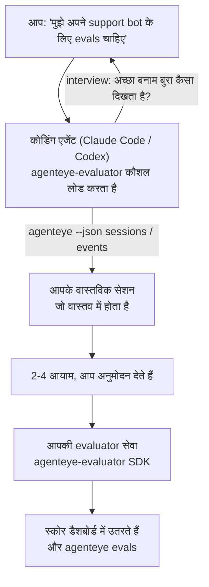

*"मुझे लगता है कि हमारा एजेंट कभी-कभी खराब है"* से लेकर एक तैनात किए गए स्कोरिंग सेवा तक जाएं, आपके कोडिंग एजेंट के साथ निर्णय और निर्माण दोनों को करते हुए। **Failproof AI Observability evaluator skill** (`agenteye-evaluator`) एक *Agent Skill* है: निर्देशों का एक छोटा फ़ोल्डर जिसे Claude Code या Codex जैसा एक कोडिंग एजेंट आवश्यकता के अनुसार लोड करता है। यह एजेंट को यह समझने के लिए सिखाता है कि कौन सी गुणवत्ता के आयाम *आपके* एजेंट के लिए ट्रैक करने के लायक हैं, फिर [evaluator service](/hi/agenteye/evaluation-suite) लिखता है, परीक्षण करता है, और तैनात करता है जो उन्हें स्कोर करता है।

यह एक होस्ट किया गया स्कोरर **नहीं** है, एक रजिस्ट्री नहीं जिसे आप अपलोड करते हैं, या एक प्लगइन सिस्टम नहीं। आपका evaluator आपका अपना HTTP सेवा रहता है आपके अपने infrastructure पर, बिल्कुल [Evaluation suite](/hi/agenteye/evaluation-suite) गाइड में वर्णित के रूप में। कौशल केवल आपके एजेंट को इसे अच्छी तरह से बनाने के लिए सिखाता है, इसलिए यह सब कुछ जो करता है, आप स्वयं कर सकते हैं समान कोड लिखकर।

---

## कठिन भाग यह तय करना है कि क्या स्कोर करना है

SDK सतह छोटी है — एक डेकोरेटर और दो मॉडल — और एक एजेंट [contract](/hi/agenteye/evaluation-suite#http-contract) अकेले से यह लिख सकता है। यह वह जगह नहीं है जहां evaluators विफल होते हैं। वे विफल होते हैं क्योंकि वे गलत चीज़ को स्कोर करते हैं, और एक evaluator जो गलत चीज़ को स्कोर करता है वह किसी से भी बदतर है: यह एक डैशबोर्ड का उत्पादन करता है जिसे सभी अनदेखा करना सीख जाते हैं।

तो कौशल का अधिकांश हिस्सा कोड अस्तित्व में आने से पहले का है। यह एजेंट को आपसे interview करने के लिए है (*"एक रन का वर्णन करें जो अच्छा गया; अब एक जो बुरा गया"*), फिर [`agenteye` CLI](/hi/agenteye/cli) के माध्यम से आपके वास्तविक सेशन खींचते हैं और उन्हें अंत तक पढ़ते हैं। वे दोनों हिस्से आमतौर पर सहमत नहीं होते, और यह अंतर बिंदु है: आप क्या मापना चाहते हैं बनाम आपके transcripts वास्तव में क्या समर्थन कर सकते हैं। एक आयाम केवल तभी जीवित रहता है यदि यह घटनाओं से **computable** है और **discriminating** है — यदि यह आपके अच्छे रन और आपके बुरे रन दोनों पर 0.9 स्कोर करता है, तो यह कुछ नहीं सिखाता और काट दिया जाता है।

जो वापस आता है वह 2-4 आयामों का एक प्रस्ताव है जिसमें तर्क संलग्न है, आपके लिए कोई भी लाइन लिखने से पहले अनुमोदन देने के लिए।



---

## यह अन्य evaluation pieces से कैसे संबंधित है

चार docs स्कोरिंग को कवर करते हैं, और वे क्रम में एक दूसरे को सौंपते हैं:

| पृष्ठ | यह क्या है | इसे कब चुनें |
|---|---|---|
| **[Evaluations](/hi/agenteye/evaluations)** | फीचर: सेशन ग्रिड पर स्कोर, डैशबोर्ड, फिर से मूल्यांकन करें | आप जानना चाहते हैं कि स्वचालित स्कोरिंग आपको क्या देता है |
| **[Evaluation suite](/hi/agenteye/evaluation-suite)** | HTTP contract, SDK, सर्वर env vars | आप स्वयं evaluator को लागू या डीबग कर रहे हैं |
| **Evaluator skill** (यह doc) | scorer को डिजाइन *और* बनाने पर एक प्राकृतिक भाषा का सामने का दरवाज़ा | आप "मुझे evals चाहिए" से एक चलती सेवा तक जाना चाहते हैं |
| **[CLI skill](/hi/agenteye/cli-skill)** | `agenteye` CLI पर एक प्राकृतिक भाषा का सामने का दरवाज़ा | आप उन स्कोर को *पढ़ना* चाहते हैं जो आपके पास पहले से हैं |
| **[Python SDK skill](/hi/agenteye/python-sdk-skill)** | अपने एजेंट को instrument करने पर एक प्राकृतिक भाषा का सामने का दरवाज़ा | आपका एजेंट अभी तक सेशन नहीं भेज रहा है — स्कोर करने के लिए कुछ नहीं है |

### CLI skill बनाम: बनाना बनाम पढ़ना

दोनों कौशल जानबूझकर non-overlapping हैं, और दोनों को स्थापित करना सामान्य setup है — एजेंट आप जो पूछते हैं उसके आधार पर उनके बीच चयन करता है:

- **`agenteye-evaluator`** (यह doc) वह चीज़ बनाता है जो स्कोर *का उत्पादन* करता है। इसका काम तब समाप्त होता है जब स्कोर पहली बार आते हैं।
- **[`agenteye-cli`](/hi/agenteye/cli-skill)** स्कोर पढ़ता है जो पहले से मौजूद हैं (`agenteye evals`)। *"क्या गुणवत्ता इस हफ्ते गिरी?"* इसका सवाल है, इस कौशल का नहीं।

---

## आवश्यकताएं

1. **`agenteye` CLI स्थापित और logged in** (`pipx install agenteye`, फिर `agenteye login`)। कौशल इसे दो बार उपयोग करता है: वास्तविक सेशन खींचने के लिए जो यह डिज़ाइन करता है, और अंत में अपने स्कोर आने की पुष्टि करने के लिए। आपके login को `events:read` की जरूरत है, साथ ही उस अंतिम जांच के लिए `evaluations:read`। CLI skill की तरह, यह **नहीं** कर सकता ईमेल किए गए one-time-code login को आपके लिए पूरा करें।
2. **evaluator के लिए कहीं रहने के लिए।** यह एक image में बनाया जाता है और एक long-running सेवा के रूप में चलाया जाता है, इसलिए इसे एक वास्तविक repo की जरूरत है, न कि एक scratch file की। Evaluators अक्सर अपने अपने repo में रहते हैं, स्कोर किए जा रहे एजेंट से अलग — कौशल एक मौजूदा को देखता है और एक नया scaffold करने से पहले पूछता है।
3. **`agenteye-evaluator` SDK wheel** — अगले भाग को पढ़ें इससे पहले कि आपका एजेंट `pip` कमांड टाइप करना शुरू करे।

---

## इसे कहां से प्राप्त करें

कौशल Failproof AI के public skills collection में प्रकाशित है:

**[github.com/FailproofAI/skills](https://github.com/FailproofAI/skills)** → [`skills/agenteye-evaluator/`](https://github.com/FailproofAI/skills/tree/main/skills/agenteye-evaluator)

repository public है और कौशल को अपनी कोई credential की जरूरत नहीं है — यह केवल `agenteye` CLI को सेशन के साथ चलाता है जिसमें *आप* logged in हैं, और *आपके* repo में कोड लिखता है। ध्यान दें कि यह अपने फ़ोल्डर के रूप में ships और **नहीं** है `pipx install agenteye` पैकेज के अंदर, इसलिए वहां इसे न खोजें।

## कौशल स्थापित करना

सबसे तेज़ तरीका [`skills`](https://skills.sh) CLI है, जो फ़ोल्डर को fetch करता है और इसे वहां छोड़ता है जहां आपका एजेंट देखता है:

```bash
# Claude Code, केवल यह प्रोजेक्ट
npx skills add FailproofAI/skills --skill agenteye-evaluator -a claude-code

# हर प्रोजेक्ट (installs to ~/.claude/skills/)
npx skills add FailproofAI/skills --skill agenteye-evaluator -a claude-code -g --copy

# इसके बजाय Codex
npx skills add FailproofAI/skills --skill agenteye-evaluator -a codex
```

फिर इसे किसी अन्य कौशल की तरह प्रबंधित करें:

```bash
npx skills list -a claude-code           # क्या स्थापित है
npx skills update agenteye-evaluator     # नवीनतम संस्करण खींचें
npx skills remove agenteye-evaluator     # इसे हटाएं
```

हाथ से स्थापित करना पसंद है? एक Agent Skill सिर्फ एक फ़ोल्डर है जिसमें एक `SKILL.md` है (प्लस optional references), इसलिए इसे कॉपी करना भी काम करता है:

- **Claude Code**: `agenteye-evaluator/` फ़ोल्डर को `~/.claude/skills/` (हर प्रोजेक्ट) या `<your-repo>/.claude/skills/` (केवल वह repo) में रखें। Claude Code इसे auto-discover करता है — `/skills` list के साथ verify करें, या बस evals के लिए पूछें।
- **Codex (OpenAI)**: Codex उसी `SKILL.md` को पढ़ता है। bundled `agents/openai.yaml` `allow_implicit_invocation: true` सेट करता है, इसलिए Codex auto-select करता है कौशल को जब एक कार्य मेल खाता है; अन्यथा इसे स्पष्ट रूप से `$agenteye-evaluator` के रूप में invoke करें।

---

## SDK public PyPI पर नहीं है

> **Warning:** SDK को स्थापित करने देने से पहले इसे पढ़ें।

कौशल public है; जो SDK इसे चलाता है वह नहीं है। `agenteye-evaluator` केवल एक private release artifact के रूप में ships करता है, और `agenteye` के विपरीत, नाम public PyPI पर **unclaimed** है — तो एक bare `pip install agenteye-evaluator` किसी अजनबी के पैकेज को सेवा में खींच सकता है जो आपके production transcripts को पढ़ता है। यह एक supply-chain समस्या है, एक टाइपो नहीं।

कौशल यह जानता है और इसके बजाय एक install ladder के नीचे काम करता है, पहले रung पर रुकता है जो लागू होता है: monorepo source यदि आप AgentEye repo के अंदर हैं, अन्यथा GitHub Releases से private release wheel (को access की जरूरत है), और यदि न ही reachable है तो यह **रुकता है और आपको Failproof AI contact से wheel मांगने के लिए बताता है** बजाय improvising के।

तो यदि आपका एजेंट एक bare `pip install agenteye-evaluator` public PyPI से propose करता है, यह संकेत है कि कौशल कभी लोड नहीं हुआ। वहां रुकें और जांचें कि यह स्थापित है।

---

## आप इससे क्या पूछ सकते हैं

एक वास्तविक round-trip एक vague ask के साथ शुरू होता है और एक signed-off design के साथ समाप्त होता है, कोड के साथ नहीं:

```text
आप   ▸ मुझे अपने support bot के लिए evals चाहिए। मुझे लगता है कि यह कभी-कभी खराब है।

agent ▸ कोई भी लाइन लिखने से पहले: एक रन का वर्णन करें जो अच्छा गया,
        और एक जो बुरा गया।

आप   ▸ अच्छा: यह docs से उत्तर देता है। बुरा: यह सामान बनाता है,
        या हार मान जाता है और कहता है "support से संपर्क करें"।

agent ▸ चलाता है: agenteye --json sessions --status error --since 7d
        5 सेशन पढ़ रहे हैं, जिनमें दो हैं जिन्हें आप बुरा कहेंगे।

        आपके शब्द कहते हैं factuality और deflection। transcripts
        deflection पर सहमत हैं (5 में से 2 support hand-off के साथ समाप्त होते हैं,
        और यह model_response.content में स्पष्ट है), लेकिन factuality
        को एक ground truth की जरूरत है जो आपकी events नहीं रखती।

        तो मैं तीन चीज़ें स्कोर करूंगा:
          - deflection      rules, सस्ता, आपके दोनों रन को अलग करता है
          - tool_efficiency rules, रन-004 में retry loop को पकड़ता है
          - groundedness    LLM judge: क्या हर दावा docs में है जिसे यह retrieve करता है?

        "factuality" को ground truth की जरूरत होगी जो हमारे पास नहीं है; groundedness
        सबसे करीबी चीज़ है जो आपके transcripts वास्तव में समर्थन कर सकते हैं।
        वे तीन नाम ठीक हैं? बाद में नाम बदलना इतिहास को splits करता है।

आप   ▸ हाँ

agent ▸ इस repo में कोई evaluator नहीं है। क्या मुझे यहां एक scaffold करना चाहिए, या
        क्या आपके पास कहीं और है?
```

वहां से यह rules-based आयामों को पहले लिखता है (free, तुरंत, deterministic), उन्हें एक वास्तविक captured session के विरुद्ध परीक्षण करता है जिसमें खाली और कभी-finished वाले हैं जो naive evaluators को crash करते हैं, और केवल subjective आयाम पर एक LLM judge तक पहुंचता है। यह [dispatcher's limits](/hi/agenteye/evaluation-suite#configuring-the-server) जानता है — एक 30s request timeout और 8 concurrent calls deployment-wide — तो यदि judge विश्वसनीय रूप से fit नहीं होगा, तो यह `JobPending` के साथ async चला जाता है बजाय आपके judge को cancelled और पांच बार पर पांच बार retried होने देता है।

फिर यह तैनात करता है, दो सर्वर env vars सेट करता है, और `agenteye --json evals --session-id <id>` के साथ पुष्टि करता है कि स्कोर वास्तव में आए हैं। स्कोर आना एकमात्र प्रमाण है।

---

## क्या watch करना है

- **Dimension names लगभग permanent हैं।** Score keys मनमाने strings हैं और platform जो कुछ भी भेजता है उसे trend करता है, जिसका मतलब downstream में कुछ भी गलत पसंद को सुधारता नहीं है। बाद में नाम बदलें और इतिहास splits: पुराने सेशन पुरानी key रखते हैं और trend टूट जाता है। यह है कि कौशल को कोड लिखने से पहले explicit sign-off मिलता है — उस prompt को गंभीरता से लें।
- **Fixtures वास्तविक production transcripts हैं।** वास्तविक सेशन के विरुद्ध designing का मतलब है उन्हें disk पर खींचना, और वे ग्राहक डेटा रख सकते हैं। कौशल git में commit करने से पहले पूछता है; यदि संदेह में है, तो `fixtures/` को repo से बाहर रखें और प्रत्येक developer को अपना स्वयं का खींचने दें।
- **एजेंट एक सेवा लिखता और तैनात करता है जो हर transcript को पढ़ता है।** यह आपके रूप में कार्य करता है, आपके CLI login की permissions द्वारा bounded, लेकिन evaluator की समीक्षा करें किसी भी अन्य कोड की तरह जो production data को छूता है।

---

## अगले कदम

- **[Evaluation suite](/hi/agenteye/evaluation-suite)**: HTTP contract, SDK, और सर्वर env vars जो कौशल configures करता है।
- **[Evaluations](/hi/agenteye/evaluations)**: जहां स्कोर दिखाई देते हैं एक बार वे आते हैं।
- **[CLI skill](/hi/agenteye/cli-skill)**: sibling कौशल, scorer बनाने के बजाय परिणाम पढ़ने के लिए।
- **[CLI](/hi/agenteye/cli)**: command reference जो सेशन डेटा के पीछे है जो कौशल design करता है।